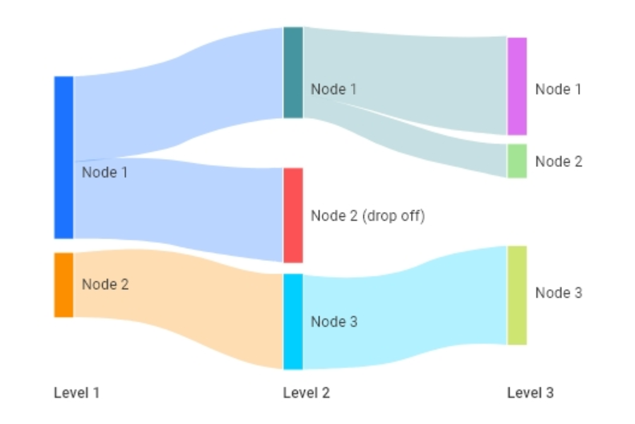

..
  Section title decorators for this document:
  
  ==============
  Document Title
  ==============
  Section Level 1
  ---------------
  Section Level 2
  +++++++++++++++
  Section Level 3
  ~~~~~~~~~~~~~~~
  Section Level 4
  ^^^^^^^^^^^^^^^
  Section Level 5
  '''''''''''''''

  The depth of each section level is determined by the order in which each
  decorator is encountered below. If you need an even deeper section level, just
  choose a new decorator symbol from the list here:
  https://docutils.sourceforge.io/docs/ref/rst/restructuredtext.html#sections
  And then add it to the list of decorators above.

.. _vivarium_interactive_simulation:

====================================
Utilizing the Interactive Simulation
====================================

.. contents::
   :local:
   :depth: 2

Intro to Interactive Simulations
--------------------------------

Interactive simulations are a way to step inside of a simulation instead of 
just receiving final outputs. This can be very helpful for a number of tasks 
including V&V, debugging, and generating primary outputs. These are described 
in detail :ref:`below <interactive_tasks>`. 

The interactive sim allows a user to see all of the data available for any simulant. 
For example, in the main simulation you might record the average BMI in the population 
by age and sex. In the interactive simulation, you can see each simulant's individual 
BMI as well as their propensity score for BMI. 

In addition, you can move the simulation forward in time to watch and record how 
simulants change and experience health events. 

However, since we don't parallelize runs in the interactive sim, we tend to use much 
smaller populations and generally only 1 draw and seed combination to limit run time. 
This makes some tasks more difficult to complete interactively. 

.. _interactive_process:

Setting up an Interactive Sim
-----------------------------

See the `vivarium-engine documentation for how to run an interactive simulation here <https://vivarium-engine.readthedocs.io/en/latest/tutorials/running_a_simulation/interactive.html>`__ and`Interactive simulation tutorial here <https://vivarium-engine.readthedocs.io/en/latest/tutorials/exploration.html>`__. This documentation is maintained by the engineers as the codebase evolves and should be used as the official reference for how to format code that utilizes the InteractiveContext.

The remaining documentation on this page offers additional general tips on utilizing the InteractiveContext on the simulation science team.

.. note::

  As of the Fall of 2026, the engineers are working on expansive updates to the InteractiveContext functionality and documentation. When this work is completed, we should revist this page and determine if we need to make any subsequent updates to this page. 

.. _interactive_setup_1:

Additional notes/tips
+++++++++++++++++++++

  - Install and activate the repository-specific **simulation** environment according to the instructions on the repository README file before running the ``InteractiveContext``

    - If you need more general help with Git or environments for this part, see these :ref:`computing resources <computing>` and/or talk to an engineer on the team.

  - Make sure you have the desired branch of your simulation repository checked out via git so that your interactive simulation will run on the expected simulation version

  - At the beginning of your notebook, include the output of :code:`pip list | grep vivarium` and :code:`pip freeze | grep vivarium` to preserve a record of exactly which versions you ran with.

  - Lastly, it is helpful but not required to add code that suppresses warnings generated by the interactive sim. These warnings can add clutter to notebooks and make them difficult to navigate. 

  - You may want to make edits to the model_specification file to do things like remove specific unwanted simulation components or change the simulated population size. Consult the Interactive simulation documentation for instructions. 

First, include two (separate) Jupyter cells of:

.. code::

  ! pip list | grep vivarium

and

.. code::

  ! pip freeze | grep vivarium

These two cells automatically document what version of the simulation and related
packages you are running with.
Then, include a Python cell with:

.. code:: python

  import warnings
  warnings.simplefilter(action='ignore', category=FutureWarning)
  
  from vivarium import InteractiveContext 

.. _interactive_tasks:

Example Tasks Using the Interactive Sim
---------------------------------------

Below are some common tasks that use the interactive sim. Please note that several of 
these are related to V&V. For more general information and best practices on V&V, see this 
:ref:`vivarium page <vivarium_best_practices_results_processing>` 

.. list-table:: Common Interactive Simulation Tasks 
  :widths: 15 15 15 15
  :header-rows: 1

  * - Task 
    - Why is this done interactively? 
    - Example Notebook
    - Relevant Concept Model
  * - V&V for Risks with Many Categories (E.g., LBWSG)
    - Stratifying simulation outcomes by many categories may be too much of a drain on computation time 
    - `LBWSG exposure <https://github.com/ihmeuw/vivarium_research_ciff_sam/blob/b6fc8cc68eaaeafc563ad373977e7e4495b4db47/model_validation/interactive_simulations/model_5/lbwsg_exposure_model_7.ipynb>`_ 
    - :ref:`CIFF malnutrition model<2019_concept_model_vivarium_ciff_sam>`
  * - V&V for Continuous Risk Exposure
    - Summary measures such as mean exposure or proportions below a threshold can be simulation outputs. Interactive sims can verify risk exposure standard deviation, look at spread, or check for outliers. You can also verify correlation between risks. 
    - Examples: 
      
      - `Continous risk standard deviation and visualization <https://github.com/ihmeuw/vivarium_research_nih_us_cvd/blob/6108f8076e4cb9d79991be618b660c00c887515a/interactive_example_continuous_risks.ipynb>`_ 
      - `Risk correlation <https://github.com/ihmeuw/vivarium_research_nih_us_cvd/blob/6108f8076e4cb9d79991be618b660c00c887515a/interactive_correlation.ipynb>`_ 
    - :ref:`CVD model<us_cvd_concept_model>`
  * - V&V for Events with Multiple Risk Factors
    - Stratifying event rates by many risk factors might not be computationally feasible; you can verify risk effects by calculating the event rate at the simulant level.
    - `Multiple risks impacting CVD <https://github.com/ihmeuw/vivarium_research_nih_us_cvd/blob/6108f8076e4cb9d79991be618b660c00c887515a/Interactive_RR_GregGraphs.ipynb>`_ 
    - :ref:`CVD model<us_cvd_concept_model>`
  * - V&V for Continuous Risk Effects
    - For continuous risks with risk effects, simulant level data is needed to validate risk and outcome rates. 
    - `Same example as prior row <https://github.com/ihmeuw/vivarium_research_nih_us_cvd/blob/6108f8076e4cb9d79991be618b660c00c887515a/Interactive_RR_GregGraphs.ipynb>`_ 
    - :ref:`CVD model<us_cvd_concept_model>`
  * - Check for Simulant Level Continuity 
    - Can check that simulant values which are not meant to change, remain constant over time (example: propensities)
    - `Testing propensities drift <https://github.com/ihmeuw/vivarium_research_nih_us_cvd/blob/6108f8076e4cb9d79991be618b660c00c887515a/Old_VV_unresolved/Interactive_Sim_Tests_06.18.2023_testing_propensity.ipynb>`_
    - :ref:`CVD model<us_cvd_concept_model>`
  * - Debugging 
    - This is very general, but simulant level data can be helpful in finding potential issues. Some examples include: propensity drift over time or finding problematic outliers. You can also "remove" parts of the sim to see where a problem might be. 
    - Examples: 

      - `Finding common random number error <https://github.com/ihmeuw/vivarium_research_iv_iron/blob/b1ca9e95f40942a92a9c8ed544d8adef6dc68695/validation/child/interactive_simulations/20221003%20Common%20random%20numbers%20investigation.ipynb>`_. 
      - The `propensity drift notebook above <https://github.com/ihmeuw/vivarium_research_nih_us_cvd/blob/6108f8076e4cb9d79991be618b660c00c887515a/Old_VV_unresolved/Interactive_Sim_Tests_06.18.2023_testing_propensity.ipynb>`_ was also an effort at debugging using the interactive sim.
      - `This notebook debugging neonatal mortality <https://github.com/ihmeuw/vivarium_research_mncnh_portfolio/blob/4409af4858c071350f04f3fa30949ae86dae7cc3/verification_and_validation/model_13.3_interactive_simulation_neonatal_mortality.ipynb>`__ steps through the process of determining neonatal mortality risks to determine exactly where
        miscalibrations are introduced.
        Also used a bigger population size (for a single location/draw) than our actual V&V runs to reduce stochastic uncertainty.
    - Concept Models:

      - :ref:`IV iron model<2019_concept_model_vivarium_iv_iron>`
      - :ref:`CVD model<us_cvd_concept_model>`
      - :ref:`MNCNH portfolio model <2024_concept_model_vivarium_mncnh_portfolio>`
  * - Primary Output Graphs 
    - Creating visualizations when individual data is needed - such as simulant interactions with healthcare or continuous risk factor spreads over time. 
    - Examples: 

      - `Simulant level hemoglobin changes over time <https://github.com/ihmeuw/vivarium_research_iv_iron/blob/b1ca9e95f40942a92a9c8ed544d8adef6dc68695/validation/maternal/interactive_simulations/Hemoglobin%20trajectory%20plots%2020220616.ipynb>`_ 
      - `Simulant healthcare interactions <https://github.com/ihmeuw/vivarium_research_nih_us_cvd/blob/main/Single_Simulant_Graph_Lifestyle.ipynb>`_  
      - `Sankey diagrams of transitions between states <https://github.com/ihmeuw/vivarium_research_multiple_myeloma/tree/8ca7c6d23354ffb08f532d163990f18745f4c80a/verification/interactive_simulations/sankey_diagrams>`_ (example pictured below). Note that this repo is **private** which means you'll need a team member to add you before you can view it. 
    - Concept Models:

      - :ref:`IV iron model<2019_concept_model_vivarium_iv_iron>`
      - :ref:`CVD model<us_cvd_concept_model>`
      - :ref:`Multiple Myeloma model<2019_concept_model_vivarium_csu_multiple_myeloma_phase_2>`

You might notice that in a lot of the tasks above, especially making primary output graphs, 
you will make new "observers" for the sim and then run time forward, capturing this 
additional data. You might ask yourself, why not just make those the built-in observers 
to my actual sim? The answer is that the "dimensions" of complexity of a model run 
combine multiplicatively, so it is super expensive to do all of them at once. For example, 
you can run the simulation with 60 draws and simple observers, and you can run an 
interactive sim with 1 draw and complicated observers, but 60 draws and complicated 
observers takes way more resources than adding up those two runs. Therefore we sometimes 
choose to make plots in the interactive sim instead! 

.. _interactive_challenges:

Common Challenges
-----------------

Using the interactive sim is fundamentally different than looking at simulation outputs 
and this can lead to challenges. Because you are running a mini-simulation on your computer, 
you overlap a lot more with engineering workflow and have to watch out for some common pitfalls.

1. Using the correct branch and simulation version:

  To run an interactive sim, you install the simulation itself from the engineering repo.
  Be sure that you are installing updated versions as needed (with the installation commands described in the :ref:`set-up guide above <interactive_setup_1>`).
  If you forget, the latest work 
  might not be present in your version of the sim, leading to confusion.

  If you need to look at an old version of the sim or are actively debugging something, you might 
  not work from the main branch. Work with engineering to ensure you've installed from the correct branch for 
  your needed task.

  In some cases you may need to install unreleased versions of upstream repos on GitHub, like
  vivarium or vivarium public health. If you run into this type of situation, consult with the 
  engineers to find the best strategy to move forward. 

2. Differing environments: 

  Engineers create their own environments, and might use different versions of packages or 
  of Python than you are using. This can cause confusion if something isn't running as 
  expected.

  If you created your environment a while ago and you think you might have gotten out of sync,
  you should try re-running the install commands or
  re-creating the environment entirely. If you're not sure what version of Python to use, 
  ask the engineers what they are using.
