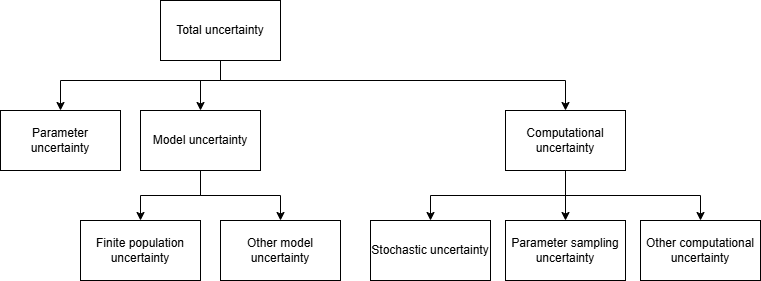

..
  Section title decorators for this document:
  
  ==============
  Document Title
  ==============
  Section Level 1
  ---------------
  Section Level 2
  +++++++++++++++
  Section Level 3
  ~~~~~~~~~~~~~~~
  Section Level 4
  ^^^^^^^^^^^^^^^
  Section Level 5
  '''''''''''''''

  The depth of each section level is determined by the order in which each
  decorator is encountered below. If you need an even deeper section level, just
  choose a new decorator symbol from the list here:
  https://docutils.sourceforge.io/docs/ref/rst/restructuredtext.html#sections
  And then add it to the list of decorators above.

.. _vivarium_best_practices_uncertainty:

=======================
Uncertainty in Vivarium
=======================

.. contents::
   :local:
   :depth: 2

Conceptual framing
------------------

What is uncertainty?
++++++++++++++++++++

"Uncertainty" refers to all the reasons we don't know something.

To make this concrete, we use a guiding example.
Suppose we are interested in the impact of 70% coverage of iron and folic acid (IFA) supplementation (versus none) on anemia during pregnancy
in Kazakhstan in 2027.

Perfect knowledge would be knowing exactly what the anemia prevalence during pregnancy would be in Kazakhstan in 2027 under each scenario.
We would never actually have this, but *in principle* if we had total and complete control over IFA implementation and adherence and also had a time machine, we could know it.
We would stop all IFA supplementation in Kazakhstan, go to 2027, measure anemia during pregnancy (with perfect tools, sampling every pregnant person in the country), and then go back to the present and repeat the process for the 70% scenario.
Then we could compare the numbers we obtained and say something like "the impact of 70% coverage of IFA on anemia prevalence during pregnancy in Kazakhstan in 2027 is a reduction of 2.3 percentage points."

Instead of doing that impossible thing, what we actually do is replace the time machine, perfect control, and perfect measurements with a Vivarium microsimulation model.
We won't describe the entirety of how the hypothetical model works here,
but let's say it uses the GBD 2023 estimates of hemoglobin exposure in pregnancy
and then applies a constant additive effect of IFA supplementation from a meta-analysis.

What are some limits on our knowledge that cause us not to know exactly that 2.3 percentage point number,
when we have the Vivarium model standing in for the time machine, perfect control, and perfect measurements?

Here are a few:

1. We only have an imperfect *estimate* of the prevalence of maternal anemia in Kazakhstan in 2023.
2. The meta-analysis on the effect of IFA supplementation on hemoglobin has limited sample size.
3. Our model oversimplifies by assuming that the effect of IFA supplementation in the meta-analysis study population would be the same in the pregnant population in Kazakhstan in 2027.
4. Our model oversimplifies by assuming that that the pregnant hemoglobin situation has not changed/will not change between 2023 and the beginning of 2027.
5. Our model oversimplifies by assuming that the effect of IFA supplementation is to increase everyone's hemoglobin by a constant amount.
6. We ran our simulation with a limited number of simulants, creating some computational error in our result -- we could have gotten a more precise answer by running a larger simulation.
7. We ran our simulation with a limited number of "draws" or samples of the parameter distributions, creating some computational error in our result -- we could have gotten a more precise answer by running more draws.
8. There is a specific person with an abnormally low hemoglobin level in Kazakhstan, and we don't know if that person will be pregnant in 2027 or not.
9. ...

This is not an exhaustive list by any means.

Categories of uncertainty
+++++++++++++++++++++++++

Just from the few examples we've enumerated in the previous section, we can start to see some *categories* emerge.

Items 1 and 2 are examples of **parameter uncertainty** --
uncertainty about the values of parameters to put into the model.

Items 3-5 are examples of **structural** or **model uncertainty** --
they arise from simplifications and assumptions in the model structure itself.
This can also include the inclusion or exclusion of certain attributes or causal effects in the model.

Items 6-7 are examples of **computational uncertainty** -- this is uncertainty that
is caused by the finite computational resources we use, not the real-world data we
have or the way we structure our model.
Item 6 is called **stochastic uncertainty** -- it arises from our use of (pseudo-)randomness in the simulation process.
Item 7 is called **parameter sampling uncertainty** -- it arises from our use of a finite number of samples of the parameter distributions in the simulation process.

Item 8 is an example of **finite-population uncertainty** -- a specific type of **model uncertainty** that arises
from an assumption implicit in our models that a population is an infinite distribution of individuals,
and therefore that no specific individual matters to the population-level outcome.
This is clearly incorrect (a population is truly a finite set of individuals),
but it is a reasonable approximation for large populations and makes modeling easier,
so both the GBD and Vivarium models make this assumption.

.. note::

  Sometimes finite-population uncertainty is referred to as "aleatory uncertainty" or "irreducible uncertainty" to claim that it is inherent in the world and unrelated to our knowledge.
  This isn't true, because in principle it would be possible to make
  a model that included each actual individual, but this is so far
  beyond the data we are able to obtain that for *practical* purposes it is irreducible here.

.. note::

  If you are wondering whether item 8 and item 3 overlap, the vague term "situation" in item 3
  was a shorthand way to refer to the continuous *distribution* of hemoglobin in a hypothetical infinite population,
  which is what GBD actually estimates about 2023.

Parameter, model, and computational uncertainty collectively cover *all* our uncertainty.
Parameter and model uncertainty cover how our model *design* differs from the real world.
Computational uncertainty is how the model we run on a real computer differs from its idealized design.

In diagram form, here is the hierarchical taxonomy we have created:

.. note::

  Some aspects of this taxonomy are derived from `Briggs et al. <https://www.sciencedirect.com/science/article/pii/S1098301512016592>`__,
  but we have adapted it.

The connection between parameter and model uncertainty
++++++++++++++++++++++++++++++++++++++++++++++++++++++

Parameter and model uncertainty are more closely related than you might initially think.
We actually *choose* when designing the model which aspects of our uncertainty to put in which
category.
To see this, consider the example item 5 above: "Our model oversimplifies by assuming that the effect of IFA supplementation is to increase everyone's hemoglobin by a constant amount."
It would be *exactly equivalent* for our model to assume that the effect of IFA supplementation
is, instead of a constant, a normally distributed random variable, with a standard deviation of **zero**.
With the model parameterized this way, we could have sought out data about the standard deviation of the effect,
and found an estimate with uncertainty about this parameter instead of assuming it is any fixed value.
In so doing, we would have transferred the question of individual heterogeneity of effect from model uncertainty to parameter uncertainty.

In this light, model uncertainty is simply the uncertainty we have chosen not to quantify within our model;
it is the uncertainty we have *ignored* by making fixed modeling assumptions rather than
adding more parameters.
This doesn't mean that model uncertainty is bad.
There is a real cost to us of making our model more complex, and our model **always** must make
some assumptions.
When we add more parameters, as in the above example, we also add even more (but smaller) structural
assumptions, such as that the individual-level effect is normally distributed.
If we went further to avoid this assumption and modeled the distribution as an ensemble of possible distributions,
we would be making structural assumptions about which distributions are possible parts of the ensemble.
This continues on ad infinitum -- eliminating any assumption will simply replace it with more, smaller ones.

Note that we sometimes (often!) make assumptions that we are not only unsure about, but know are *definitely* not true.
Finite-population uncertainty is an example of this; we know for sure that the population is finite.
It is okay if our modeling structure cannot represent the *true* model, so long as it is
a good approximator for the quantity of interest to us.

Our goals
+++++++++

TODO: write this section. I want to say something like "we want to minimize our uncertainty (sharpness), and we also want to communicate it well. Part of that communication is quantitative uncertainty intervals, but in order for those to be effective, we need to be clear about what is included and what is not included in them. We also need to make sure that our quantitative uncertainty intervals (if total?) are calibrated -- sharpness subject to calibration"

Our typical approach
--------------------

Reporting uncertainty
+++++++++++++++++++++

.. note::
  This section describes our typical approach as of August 2026.
  We know that this approach has some issues, see the "What does this actually calculate?" subsection.
  It is a record of what we do now, and we may update it as our practices evolve.

Our typical approach to quantifying uncertainty centers around `Monte Carlo methods <https://en.wikipedia.org/wiki/Monte_Carlo_method>`__.
Monte Carlo methods use repeated random sampling.
In our case, that means repeatedly running the simulation with different input parameters.

The GBD also uses Monte Carlo methods, calling the resulting samples "draws" -- you can learn more about draws `here <https://hub.ihme.washington.edu/pages/viewpage.action?pageId=406389120&spaceKey=ICKB&title=Draws>`__.
We inherit this concept and apply it to all parameters in our simulation, not just draw-level parameters from the GBD,
in order to capture parameter uncertainty.
For example, draw 0 of our simulation will utilize the draw 0 value for all GBD parameters used in the simulation.

For non-GBD parameters from literature sources or for GBD covariate estimates, it is unlikely that draw-level estimates will be available and that results are reported as mean estimates with 95% confidence intervals instead. In these cases, we must specify *how* to sample from within a distribution of uncertainty about the parameter values. To do this, we must define some distribution of uncertainty (:ref:`discussed on this page <vivarium_best_practices_statistical_distributions>`) including the type of distribution (such as normal, uniform, lognormal, etc.) and distribution parameters (such as mean/standard deviation, min/max, etc.). Then, for each draw of the Vivarium simulation, a single value will be randomly sampled from this distribution of uncertainty.
This assumes independence between parameters.

We *also* use different randomness between draws in addition to different parameter values,
which means that results differ between draws due to both parameter uncertainty and stochastic uncertainty.

For each result we are interested in, we calculate it separately for each draw.
We only summarize final results across all draws as the *last* step before visualization/reporting (see also the :ref:`results processing tips page <vivarium_best_practices_results_processing>`).

For continuous (real-valued) results, we present the mean across draws as our point estimate,
and use the empirical 2.5th and 97.5th percentiles across draws (using linear interpolation) as our 95% uncertainty interval.
For discrete outputs (e.g. which intervention is most cost effective), we approximate the posterior probability distribution by presenting the percent of draws in which the output took each value.

We sometimes also conduct sensitivity analyses in which we vary parameters or assumptions about which we are uncertain but do not have a distribution of uncertainty, setting them
to fixed alternate values (perhaps from another source, or based on a plausible range)
and report the resulting change in simulation outputs.

We typically do not provide clients with much information about how to interpret our quantitative uncertainty or what is included.
We address uncertainty qualitatively by:
* Listing our assumptions and limitations in the model documentation and in any publications describing the model
* Comparing our results to those of other models in the literature to qualitatively assess how differences in model structure may be impacting results

.. todo::
  Sections below here have not been updated.
  We should have a section on CRN and how it reduces stochastic uncertainty in the current practice above.
  We should consolidate (and simplify?) advice on selecting simulated population size, and the "random seed" stuff should likely be its own section.
  Then, include a section with a proposal for how to improve our current practice, which I think of as having multiple paths forward:
  
  * Short-term: what do our uncertainty intervals mean now? Basically, a parameter uncertainty and an overestimate of stochastic uncertainty.
    Add parameter sampling uncertainty.
    Is this useful or meaningful to our clients? What should we communicate?
  * Medium-term: with cross-scenario communication, correctly quantify stochastic uncertainty.
  * Long-term: out-of-sample validation to directly quantify total uncertainty;
    does this obviate everything we've already done, or will we use our
    parameter + computational uncertainty as a predictor?

Stochastic uncertainty
----------------------

We can do this by increasing the number of simulants in our simulation, **per draw** (remember, we need to run a simulation for each draw).
The only downside of more simulants is more computational cost.
Vivarium also utilizes a technique called :ref:`common random numbers <vivarium:crn_concept>` to reduce stochastic uncertainty (for a given population size).

This overstates our stochastic uncertainty because each draw has a smaller population size
than the total population size across all draws.
A simulation that splits its population across more draws will appear to have more stochastic uncertainty
than a simulation that splits the same total population across fewer draws,
even though the total number of random events informing our estimate is the same.

What is a random seed?
++++++++++++++++++++++

A `random seed <https://en.wikipedia.org/wiki/Random_seed>`__ is a number used to initialize a (pseudo-)random number generator.
Given the same seed, the same sequence of random numbers will be generated.
Random seeds serve two practical purposes for us:

1. Ensure that we can reproduce random events (multiple times for the same scenario as well as across scenarios, as discussed in the Vivarium documentation)

2. Act as a tool that enables us to run subsets of a simulated Vivarium population in parallel on the cluster

With respect to the second point, imagine we have a simulated population of 100,000 individuals.
It may take a lot of time to calculate and record what happens to all 100,000 simulants at each timestep of the simulation in a single cluster job.
Therefore, *as long as individuals don't interact*, it may be preferable to split this population into 10 groups of 10,000 individuals and run each group in its own cluster job *in parallel.*
This could allow us to finish calculating and recording what happens to all 100,000 simulants in approximately 1/10th of the time!
As we split our simulated population size into subgroups, each subgroup will utilize a different random seed
(we would functionally be simulating the *same* simulants if all subgroups shared the same random seed!).

Therefore, you may hear software engineers or researchers discussing "how many seeds" to include in a given simulation run *per draw*. While this is useful shorthand from a simulation implementation standpoint, researchers should always consider it in tandem with **simulated population size per draw**.

Simulated population size per draw will directly affect the impact of stochastic uncertainty in simulation results. You can think of this like stochastic uncertainty in coin flip experiments. If you flip a coin a small number of times, you may not be surprised if you see tails more or less than 50% of the time. However, if you flip a coin *many* times, you will expect that you will see tails pretty close to 50% of the time. In this same way, if we have a small number of simulants in our population, we should not be suprised if we simulation outputs vary from expected population rates due to random chance (stochastic variation). However, as we increase the population size, we should expect that simulation outputs will be generally closer to expected population rates.

Interaction between random seeds and simulated population sizes
~~~~~~~~~~~~~~~~~~~~~~~~~~~~~~~~~~~~~~~~~~~~~~~~~~~~~~~~~~~~~~~~

Generally, a researcher should communicate to the engineers the desired simulated population size per draw for a given simulation (see below for how to select an appropriate value for this parameter). Then, the engineers (perhaps with input from the researchers!) will determine an appropriate number of subgroups to divide this population across to optimize the balance between the amount of cluster nodes/memory as well as the simulation's run time. 

Generally, as the number of random seeds increases and the associated population size per parallel cluster job decreases for a set population size per draw (say 10 random seeds with population size of 10,000 per draw as opposed to 1 random seed with population size of 100,000 per draw):

- Overall run time will decrease
- Required memory per cluster job will decrease
- Amount of cluster jobs/nodes required will increase

Decisions on the degree of parallelization will depend on cluster availability, intensity of resource requirements to run the simulation, and project timelines. For example, if there is not much space on the cluster and a simulation is launched at the end of the day and will be run over night and not checked until morning, it may be preferable to run over fewer random seeds for a longer duration of time. However, if there is a lot of available space on the cluster and the model will be launched in the morning, it may be preferable to run over more random seeds so that it will be ready to view in a shorter amount of time.

Specifying Vivarium Uncertainty Parameters
------------------------------------------

The appropriate population size and number of draws may vary between simulations based on:

- **the degree of parameter uncertainty**: fewer draws may be more acceptable in situations with smaller degrees of parameter uncertainty
- **outcome of interest rarity**: greater population sizes may be needed for rare outcomes of interest
- **simulation computational intensity**: if simulation is run for many locations, scenarios, and/or years, there increasing population size and/or the number of draws will require more computational resources

Signs that population size may be too small:

- As outcomes are stratified by additional parameters of interest (age, year, etc.) estimates become unstable and "wiggle" around their V&V targets
- At the draw level, there are "bands" or "groupings" of outcomes (example: 0, 1, or 2 death counts averted by scenario across draws with a mean of 1.5. Would be preferable to have 15, 16, 13, 14, etc. deaths averted instead!)
- Ask the engineers to stratify the count data result by random seed so that you can make a `plot like the one in this notebook <https://github.com/ihmeuw/vivarium_research_iv_iron/blob/main/validation/maternal/child%20seeds%20and%20draws%20analysis.ipynb>`_ for a key outcome(s) of interest in your simulation (the most rare outcome of interest is likely the best to select!). If the results are really wiggly all the way to the end, then you likely need a larger population size. If the mean estimate and the width of the uncertainty interval do not change much after a certain point, then you may be able to decrease the population size. NOTE: stratifying count data results by random seed will cause the count data files to be really huge! It will require a lot of memory and time to load and transform. Consider making these plots just for a subset of draws included in the simulation rather than across all draws.

Signs that the simulation has too few draws:

- Simulation outputs match V&V targets for subset of draws included in the simulation significantly better than they match all draws 
- Create `a plot like the one in this notebook <https://github.com/ihmeuw/vivarium_research_iv_iron/blob/main/validation/maternal/child%20seeds%20and%20draws%20analysis.ipynb>`_ for key outcomes of interest. If the results are really wiggly all the way to the end, then you likely need more draws.

Some potentially reasonable starting points:

- 50 input draws
- 100,000 population size per draw

To reduce computational intensity throughout model development, it may be desirable to run with a smaller population size and/or smaller number of draws (say 25) throughout the iterative V&V process and then increase these parameters for final production runs.
