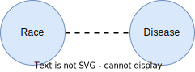
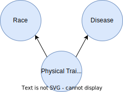
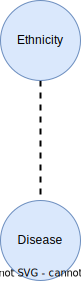
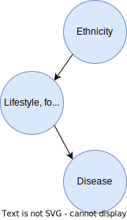
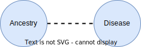

..
  Section title decorators for this document:

  ==============
  Document Title
  ==============

  Section Level 1 (#.0)
  +++++++++++++++++++++

  Section Level 2 (#.#)
  ---------------------

  Section Level 3 (#.#.#)
  ~~~~~~~~~~~~~~~~~~~~~~~

  Section Level 4
  ^^^^^^^^^^^^^^^

  Section Level 5
  '''''''''''''''

  The depth of each section level is determined by the order in which each
  decorator is encountered below. If you need an even deeper section level, just
  choose a new decorator symbol from the list here:
  https://docutils.sourceforge.io/docs/ref/rst/restructuredtext.html#sections
  And then add it to the list of decorators above.

.. _race_ethnicity:

============================================
Inclusive Health Metrics: Race and Ethnicity
============================================

Overview
+++++++++++++++++++++

On this page you will find ...

.. todo::

    Fill out this section to describe what this guide will include.

If you have any questions or comments about the content on this page - please reach out! You can
contact us directly `on GitHub <https://github.com/ihmeuw/vivarium_research/issues?q=is%3Aopen+is%3Aissue+label%3Abliss>`_ or anonymously
on our `feedback form <https://docs.google.com/forms/d/e/1FAIpQLSeCED9TFQsH-1u4QkFxJvno4WaEDz6h9rhJeyFlAlqyG7MAJg/viewform>`_.

.. list-table:: **What this is vs. What this isn't**
   :header-rows: 1

   * - This is...
     - This isn't...
   * -
     -

Guiding principles
------------------

.. todo::

    Fill out table with some guiding principles for this guide. Can refer to same table in the sex and gender guide.

Introduction to race and ethnicity
------------------------------------------

Race, ethnicity, and ancestry are complex, interrelated social
constructs that have significant impacts on individuals' lives and
health outcomes. Despite the importance of race and ethnicity in
understanding health disparities and developing health interventions,
there are significant gaps in the academic treatment of these concepts.

In the context of simulation science, and health metrics more broadly,
we are often using data collected and analyzed by others. As such, we
need to understand and adapt to the choices that they have made
regarding race and ethnicity. This requires carefully examining the data
sources, the categories used, and the potential limitations and biases
inherent in the data. By doing so, we can make informed decisions about
how to interpret and apply the data in our simulations.

As we work towards building more inclusive health metrics, it is crucial
to recognize the complexities of race, ethnicity, and ancestry and to
develop approaches that accurately capture the experiences and needs of
diverse populations. This requires ongoing collaboration between
researchers, policymakers, and communities to ensure that our
understanding of these concepts evolves alongside societal changes and
scientific advancements.

1.0 Research considerations
++++++++++++++++++++++++++++

Before beginning with your research, there are some crucial considerations to
take as you read through our recommendations. Determining precisely how
concepts of race and ethnicity fit into your research question is a critical
first step. For instance, the following are some examples of questions you may
ask yourself in the early stages of your research: “Why are race and/or
ethnicity important to my research question?”, “What is gained by considering
race and/or ethnicity in my research project?”, and “Is race, ethnicity, or
some combination of the two the appropriate measure for my analysis?”. An
`IHME-created guide to diversity, equity, and inclusion research considerations <https://hub.ihme.washington.edu/display/DEI/DEI+and+Research+Considerations>`_
is a resource that may be useful in providing a framework to think through
these sorts of questions in addition to the remainder of this guide.

Another important consideration to take throughout the process is an
understanding of your specific context and audience. For instance, relevant
race and ethnicity categories and associations will vary by population; you
should be sure to have an understanding of the dynamics of the population
relevant to your research and remember that racial and ethnic categories used
in one setting may not be appropriate in others. Seeking guidance from experts
and existing resources in the field specific to your setting is encouraged!

There are three main challenges in considering race and ethnicity in biomedical
research that have been proposed by [Kaplan-and-Bennet-2003]_ and we encourage
you to keep them in mind throughout your work. These challenges are listed
below and discussed in more detail in the referenced paper and will also be
expanded upon throughout the remainder of this guide.

    1.  To account for the limitations of racial/ethnic data
    2.  To distinguish between race/ethnicity as risk factor or as risk marker
    3.  To avoid contributing to the racial/ethnic division of society

Finally, make sure to be aware of your target journal’s policies regarding race
and ethnicity. Many journals have specific established guidelines that must be
adhered to.

Taking these considerations into account in your work before and while
implementing this guide’s recommendations will help to ensure that your research
is not only respectful and sensitive to the complexities of race and ethnicity
but also adherent to relevant guidelines and meaningful to your intended
audience.

1.1 Research question
---------------------

When you’re designing a research question, it’s important to consider both if race,
ethnicity, and/or ancestry are relevant, and, if so, what the causal pathways might be. Spending
time considering the causal pathways will help you consider what exactly you are
investigating and might identify more relevant proxy measures.

First, let’s consider this hypothetical research question: how much would expanding access
to clean water impact diarrhea rates in Nigeria?

Is race, ethnicity, and/or ancestry relevant here? Race/ethnicity are a much less
common marker used in disease measurement in Nigeria, compared to the US. We don't have
any data to indicate that race, ethnicity, or ancestry impact diarrhea rates, or rates
of access to clean water. Therefore, in this example we might choose NOT to include race.

For the rest of this section, let’s consider a different research question: how will
the rates of cardiovascular disease (CVD) change over the next 5 years in the US?

First, let’s consider if including race, ethnicity, and/or ancestry is relevant to
the research question. It’s commonly known that CVD rates vary with race, and that
racial demographics are changing within the US. Understanding how different groups’
CVD rates are changing differently might lead us to make a better forecast for
the future. So, it seems relevant to include race here.

Second, let’s think about if this will lead to changes in policies. Here again,
it seems plausible that if we see a sharper increase  in CVD incidence among some
racial groups, decision-makers might deploy racially aware intervention strategies.
So here, including something about race, ethnicity, and/or ancestry seems relevant.

Last, let’s think through the possible causal pathways and decide what metric(s)
we want to include.

Below, we have drawn several causal diagrams. These are designed to show the
pathways between inputs and impacts. In our diagrams, the solid arrows indicate
causal pathways (x directly causes y), the dotted lines indicate correlation (x is
related to y, but doesn't necessarily cause it), and the red arrows indicate false
causal pathways (x leads to y due to society and history but does not need to
cause it in a better world).

**Option 1: Race**

We stated above that it's commonly known that CVD rates vary with race. This is
well documented and true. We know is that there is a correlation between race and
CVD, so we can draw the below diagram with a correlation line included. Now, let's
more closely examine what might be causing this correlation.

**Option 1a: Race**

One option is race “leads” to experiences of racism which in turn leads
to the disease. We put “leads” in quotes as we don’t want to imply that existing with
certain physical characteristics “causes” racism, but rather that racism is the result
of years of history defining groups based on physical characteristics.

.. image:: race_b_v1.svg

This causal pathway is unfortunately quite common, and seems applicable to our example with CVD.
However, considering the exact pathway here is important. We list a few possible pathways for
CVD based on race. Note that these do overlap with ethnicity in some cases. This is
because discrimination can impact culture/ethnic practices. These are often
rooted in racism.

- Historical red lining leading to African Americans living in food deserts, having less available green space, or living in neighborhoods with fewer social services
- Historical racism leading to lower wealth in some communities, reduced access to health insurance, or limited access to quality medical care
- Microaggressions experienced by non-white individuals leading to elevated blood pressure
- Racism in healthcare settings leading to delayed treatment once a person seeks care

**Option 1b: Race**

Since race is related to physical characteristics.
We might naively assume that the physical characteristics are causing the disease itself.

There might be a few cases where this causal pathway is correct, but they are limited
in scope. For example, lighter skinned individuals tend to get skin cancer at higher
rates. In this case, the physical characteristic which leads to racial categorization impacts the disease. However,
this is quite uncommon.

There isn't any known reason why skin color or other physical characteristics are
tied to CVD, so we can dismiss this option for our research question.

**Option 2: Ethnicity**

A second correlation often observed is between ethnicity and disease. Again,
we can draw a diagram that connects ethnicity and disease with a correlation line.

**Option 2a: Ethnicity**

Next, we might examine whether there is a plausible causal pathway between ethnicity and
the disease. Here, there are some compelling arguments that this relationship could be causal for CVD.

For example, the Mediterranean diet has
been shown to lower risk of cardiovascular disease. So ethnic groups that
tend to follow this type of diet might have lowered risk of CVD.

However, this is not the only potential explanation for correlation with ethnicity,
which can be greatly affected by circumstance and history.

**Option 2b: Ethnicity**

Here is a more complete picture of the same causal diagram which includes history and
discrimination. One example of how history impacts ethnicity can be seen by comparing
immigrant populations' CVD rates with their counterparts who did not immigrate. As immigrants tend
to assimilate to “western” lifestyles, which often involve more processed and
fatty foods, they tend to have higher rates of CVD. Here, the outside force is changes in environment and cultural norms,
leading to changes in lifestyle and food choices, which in turn to lead to
differences in CVD rates.

.. image:: ethnicity_b_v1.svg

Some other examples include:

- Discrimination against people who do not speak English leading to inferior care
- Ethnic foods being labeled as "unhealthy" and leading to physician discrimination
- Incorrect assumption of cultural practices or lack of understanding of differences in household, family, or cultural norms

If you want to study ethnicity’s effect on a disease, it’s important to think
about why some practices might exist and to approach different cultures with
respect and curiosity instead of judgement.

**Option 3: Ancestry**

To start, we can include the correlation diagram. Since ancestry overlaps with race
and ethnicity, this correlation also likely exists.

**Option 3a: Ancestry**

As defined above, ancestry is about the genetics of your ancestors. There are
a few cases where this causal diagram is correct, but they are limited.

.. image:: ancestry_v1.svg

For example:
- Sickle cell disease is more common in people whose ancestors lived in areas with endemic malaria prevalence
- Ashkenazi Jewish people are more likely to be carriers for some genetic conditions like Gaucher disease or cystic fibrosis

In our case, there isn’t a lot of known evidence to support a genetic link between
CVD and ancestry, so we can eliminate this causal pathway.

**Option 4: Combination**

In reality, a lot of this overlaps and compounds in individuals. There is also a
lot of historical context that overlays these diagrams. One version of a combined diagram
is above, though even this is very simplistic and could be expanded significantly.

.. image:: big_diagram_v1.svg

For our research question, there are lots of possible causal pathways. A lot of
the time, race/ethnicity gets used as a proxy for the wide range of possible
factors affecting outcomes. Sometimes, this makes sense when there’s limited
data or when our question might overlap with many pathways that are hard to
disentangle.

But, if our research shifted to possible interventions for CVD, we might want to
consider some of these pathways more directly instead of considering race/ethnicity
as a proxy. For example, we might try and directly measure green space, food deserts,
racism in healthcare, or others as the primary focus of our study, rather than using
race which can include all or none of these.

1.2 Risk factors vs. risk markers
---------------------------------

.. todo::

    In this section we'll discuss the question "Does/should my research look at race and ethnicity as risk factors or as risk markers?" and how a health
    metrics researcher would answer this question and use that answer to inform their research question.

2.0 Methodology
+++++++++++++++

2.1 Data sources
----------------

As noted above, the government provides standardized race and ethnicity
categories, though these do change over time. Currently, the race
categories are American Indian or Alaska Native, Asian, Black or African American,
Native Hawaiian or Other Pacific Islander, and White. The ethnicity
categories are Hispanic or Latino and Not Hispanic or Latino.

By having a set standard,
it improves the chance that multiple data sources will have the same
categories. However, this is not guaranteed. Here, we will go through
a few scenarios of how race and ethnicity categories might be misaligned
between datasets and the options for handling each.

Nested Categories
~~~~~~~~~~~~~~~~~

In this guide, we use nested categories to mean that one dataset has more granular
categories than another. For example, one dataset might report a race group
as simply "Asian" whereas another might have many categories that fit within
this group like Chinese, Filipino, Japanese, or Korean. In fact, the US goverment
often collects both the more granular and rolled up categories of data.

Granular data is usually better, as different groups within a single race
category can have very different experiences and needs. Try to keep the
most granular data possible. However, granular data can sometimes create
issues with statistical power or small sample size. Weigh the different
pros and cons as they relate to your project, centering people's
identities and needs in the conversation.

Non-Nested Categories
~~~~~~~~~~~~~~~~~~~~~

If you need to combine multiple datasets, you will likely have to combine
race and ethnicity categories that won't match up perfectly. One option
is to take the "least common denominator" approach, which essentially means
using the most granular race and ethnicity categories possible that still
capture the data fully.

Often this will end up being the US standard categories above. We strongly
recommend against using fewer categories than the US standard unless it
is impossible to do otherwise. Creating larger buckets ends up merging
individuals with diverse experiences, backgrounds, and identities. Consider
what there is to be gained from this analysis and if race and ethnicity are
important to include if you plan to use fewer categories than the US standard.

Another option is to attempt a crosswalking approach if one or more of your
input datasets use different categories than the standard. This would allow
you to retain all of the data inputs, while keeping some granularity in categories.

Multiracial Groups
~~~~~~~~~~~~~~~~~~

Part of the US standard approach is allowing people to select as many race and
ethnicity categories as they identify with. Many people have multiracial
identities and capturing this is important. However, it creates a statistical
issue without an easy answer - how do you handle overlapping groups?

Often, someone will have made the decision about how to handle
race/ethnicity categories and multiracial individuals before you
receive the data. In this case, try to find out what was assumed
and note it appropriately in your limitations as needed.

Below we outline some options for how to handle multiracial data.
To understand them more clearly, let's provide an example of a single
person who selected both "Black or African American" and "Asian" for
their race.

The first option is to include all
combinations of race/ethnicity groups. So for this example, you would have
groups for "Black or African American alone", "Asian alone", and "Both Black or African
American and Asian". If your dataset is large
enough to support having this level of granularity in groups, this
approach can work well. However, often this leads to issues with
small sample sizes.

The second option is to exclude everyone who selected multiple race
or ethnicity groups. So we would just not count our example individual. We do not
recommend this approach.

The third is to create a large, "multiracial" group. The resulting
groups would then be "Black or African American", "Asian", and "Multiracial". We also do
not recommend this approach as the resulting group is generally
too diverse to have any meaningful conclusions about.

The fourth is to count people in all race/ethnicity groups they
selected. Therefore in our example, the individual would be
counted twice - once in "Black or African American" and once in "Asian". This
can lead to double counting in the data which might be more or
less important depending on the size of the multiracial group
in the dataset and the type of analysis. This might be a reasonable option.

The fifth option is to run analyses with
both a more limited race/ethnicity group, and then with a larger,
multiracial group. For example, you would have categories of "Asian"
and "Asian alone" both existing. "Asian" would include anyone who
selected Asian, including the multiracial person in our example,
and "Asian alone" would be people who only identify as
Asian, excluding the example individual. Often people will present
anlyses for both of these groups. This is also a reasonable
option.

Last, you can attempt to crosswalk individuals into a single
race/ethnicity group. There have been multiple attempts to do
this based on studies that allow respondents to select all racial
categories they identify with and then to pick a single one they
most identify with. [Liebler_2008]_ Therefore, the example individual
would be placed in a single racial group - either "Black or African
American" or "Asian" based on their other data. If this is
feasible based on the data present, it is also a reasonable approach.

2.2 Considering prior adjustment for race and ethnicity
-------------------------------------------------------

.. todo::

    In this section we'll discuss the question "How do our data sources adjust for race and ethnicity and how does that affect how we adjust in our own models?" and how a health
    metrics researcher would answer this question and use that answer to inform their methods.

3.0 Results
+++++++++++

Communication of results
------------------------

In this section we’ll discuss how health metric researchers can talk about health research related to 
race and ethnicity without stigmatizing, othering, or otherwise causing harm to historically marginalized 
racial and ethnic groups. It is important to be aware of how we talk about race and racism, 
particularly in the field of health metrics sciences, as our goal is often to uncover and scrutinize the 
underlying factors contributing to health disparities.

One helpful framework for differentiating ways of communicating about race is that of *race-based research vs. race-conscious research* 
[Cerdeña_2020]_. Race-based research is characterized 
by race essentialism: the notion that race is a biological factor (rather than a sociopolitical construct). 
The practice of using race in this way has historically been the norm in US health research, and causes harm for 
historically marginalized and minoritized groups, thereby exacerbating the very health inequities the health 
research may be attempting to elucidate and alleviate. For examples of outdated race-based practices in medicine, 
and their race-conscious alternatives, see Table 1 from Cerdeña et al.’s 2020 paper [Cerdeña_2020]_. 
Race-conscious research, on the other hand, calls for a shift in focus from race to racism as a key determinant of 
illness and health.

Key recommendations from other sources
--------------------------------------

Here we have collected recommendations from various experts and guides advocating for new standards of communication 
regarding racial health disparities.

1. **Use a health equity lens when framing information about health disparities** [Calanan_2023]_.

    Rather than allowing dominant narratives around race, individualism, and meritocracy to limit our understanding of 
    the root causes of health inequities, it is important to center a health equity perspective in health metrics 
    research.  An equity lens allows us to recognize that systems of power and oppression (including white supremacy) 
    shape institutional policies and living conditions that systematically harm populations 
    [AMA_2021]_.

2. **Use person-first language, avoid unintentional blaming, and be as specific as possible about the group to which you're referring**. 
    
    For more elaboration on these tips, please see Advancing Health Equity: A Guide to Language, Narrative and Concepts 
    [AMA_2021]_.

3. **Explicitly define race during \[study\] design, and specify the reason for its use in the study** [Boyd_2020]_. 
    
    As is described in our earlier section, `1.1 Research question`_, you should review all relevant 
    social, environmental, and structural factors for which race may serve as a proxy measure when defining 
    race as it pertains to your research. "For the reader, these additional details enable careful interpretation 
    of study results and implications. But for authors, it engenders critical thinking about racial constructs that 
    prevent the reification of race as a biological entity." [Boyd_2020]_ 

    Health metrics researchers should embrace a critical race theory (CRT) framework, which provides "tools for conducting research and practice 
    [that] are intended to elucidate contemporary racial phenomena, expand the vocabulary with which to discuss complex racial concepts, and 
    challenge racial hierarchies" [Ford_Airhihenbuwa_2010]_. Embracing a CRT framework might entail
    some of the following: 

    - *Contextualization of research*: Contextualize health disparities within historical and systemic inequities. This involves understanding how policies, practices, and social conditions contribute to health outcomes across different racial groups.
    - *Intentional use of vocabulary*: Use language that accurately reflects the complexity of racial issues in health. This includes being precise about how terms like race, ethnicity, systemic racism, health equity, and social determinants of health are used and understood in research. It also involves recognizing the fluidity and socially constructed nature of racial categories and how they affect health outcomes.
    - *Incorporation of intersectionality*: Acknowledge that the impact of race and ethnicity on health is not uniform across different groups and that multiple forms of discrimination can compound health disparities. 
    - *Community engagement and participation*: Where possible, involve in your research process communities affected by health disparities. Instead of *studying about* these communities, health researchers should be *working with* them to identify priorities, interpret findings, and co-create interventions. By doing so, we ensure that research is grounded in the realities of those most impacted by health inequities.
    - *Policy advocacy*: Research informed by CRT should not only aim to understand and document disparities but also to drive change. This involves advocating for policies that address the root causes of racial disparities in health, such as economic inequality, housing, education, and access to healthcare. Researchers can play a role in informing policy, engaging in public discourse, and supporting community-led initiatives.
    - *Reflective practice*:  Engage in ongoing reflection about your own positions, biases, and the power dynamics in your work. This includes being open to critique, actively seeking diverse perspectives, and being committed to anti-racist practices both personally and professionally.
  

4. **Cite the experts, particularly scholars of color whose work forms the basis of the field’s knowledge on racism and its effects** 
[Boyd_2020]_.

Reporting results accurately
----------------------------

    Use recommendations from sex/gender guide to fill out this section. This section should include 
    a. Outline goals when we present our race/ethnicity-related findings
    b. General strategy (ie explain fully in standalone parts of paper, otherwise use shorthand) - Recs for detailed description of methods with examples and recs for abbreviated description with examples 

4.0 References
++++++++++++++

.. [AMA_2021]
    American Medical Assiociation. Advancing Health Equity: A Guide to Language, Narrative and Concepts. 2021. https://www.ama-assn.org/system/files/ama-aamc-equity-guide.pdf

.. [Boyd_2020]
    Boyd RW, Lindo EG, Weeks LD, McLemore MR. On Racism: A New Standard for Publishing on Racial Health Inequities. Health Affairs Blog. 2020 Jul. doi: https://doi.org/10.1377/forefront.20200630.939347

.. [Calanan_2023]
    Calanan RM, Bonds ME, Bedrosian SR, Laird SK, Satter D, Penman-Aguilar A. CDC’s Guiding Principles to Promote an Equity-Centered Approach to Public Health Communication. Prev Chronic Dis 2023;20:230061. DOI: http://dx.doi.org/10.5888/pcd20.230061

.. [Cerdeña_2020]
    Cerdena JP, Plaisime MV, Tsai J. The Lancet. 2020 Oct; 396(10257):1125-1128. doi: https://doi.org/10.1016/S0140-6736(20)32076-6

.. [Ford_Airhihenbuwa_2010]
    Ford CL, Airhihenbuwa CO. Critical Race Theory, Race Equity, and Public Health: Toward Antiracism Praxis

.. [Kaplan-and-Bennet-2003]
    Kaplan JB, Bennett T. Use of Race and Ethnicity in Biomedical Publication. JAMA. 2003;289(20):2709–2716. doi:10.1001/jama.289.20.2709

.. [Liebler_2008]
    Liebler CA, Halpern-Manners A. A practical approach to using multiple-race response data: a bridging method for public-use microdata. Demography. 2008 Feb;45(1):143-55. doi: 10.1353/dem.2008.0004. PMID: 18390296; PMCID: PMC2831381.