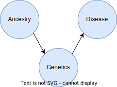

..
  Section title decorators for this document:

  ==============
  Document Title
  ==============

  Section Level 1 (#.0)
  +++++++++++++++++++++

  Section Level 2 (#.#)
  ---------------------

  Section Level 3 (#.#.#)
  ~~~~~~~~~~~~~~~~~~~~~~~

  Section Level 4
  ^^^^^^^^^^^^^^^

  Section Level 5
  '''''''''''''''

  The depth of each section level is determined by the order in which each
  decorator is encountered below. If you need an even deeper section level, just
  choose a new decorator symbol from the list here:
  https://docutils.sourceforge.io/docs/ref/rst/restructuredtext.html#sections
  And then add it to the list of decorators above.

.. _race_ethnicity:

============================================
Inclusive Health Metrics: Race and Ethnicity
============================================

.. contents::
   :depth: 2
   :local:
   :backlinks: none

Overview
+++++++++++++++++++++

On this page you will find our guiding principles,
an introduction to race and ethnicity from a scientific perspective,
a glossary of commonly used terms related
to race and ethnicity, recommendations for how to address race- and ethnicity-related limitations in external data
sources, discussion of the implications of imperfect proxy measures with regards to race and ethnicity,
examples of how our team has incorporated BLISS into our work process, and more! 

If you have any questions or comments about the content on this page - please reach out! You can
contact us directly `on GitHub <https://github.com/ihmeuw/vivarium_research/issues?q=is%3Aopen+is%3Aissue+label%3Abliss>`_ or anonymously
on our `feedback form <https://docs.google.com/forms/d/e/1FAIpQLSeCED9TFQsH-1u4QkFxJvno4WaEDz6h9rhJeyFlAlqyG7MAJg/viewform>`_.

.. list-table:: **What this is vs. What this isn't**
   :header-rows: 1

   * - This is...
     - This isn't...
   * - A ‘living’ document which will be regularly reviewed and updated to reflect evolving language and research practices. 
     - An immutable document that should be treated as all-knowing and final.
   * - An accessible guide intended for everyone’s use, regardless of your familiarity with inclusive language practices. 
     - An intimidating guide that is full of jargon and can only be used by DEI experts. 
   * - A safe space for people to make mistakes, ask questions, and learn new things! 
     - A space where people need to police what they are saying or how they are speaking for fear of judgment.
   * - Using our voice on the Simulation Science team to platform the terms we find most accurate and inclusive. 
     - Putting words into other people’s mouths (such as racial or ethnic categorizations in external data sources). 

Guiding principles
------------------

Our guiding principles for this document can be summarized in three points: 

**1. This work is important**

Inclusive research practices are important, and we want to begin by acknowledging the potential harm that using 
reductive and racialized research practices can create. People from racially and ethnically diverse backgrounds experience 
harm from oversimplified categorizations and other exclusionary research practices in several ways, including diminished access to 
healthcare, erasure in research, and perpetuation of stereotypes.

An accurate understanding of race and ethnicity improves the validity of our research methods and conclusions about 
all people, not only racial and ethnic minority groups. One example of the harms from racial categorization is in our 
understanding of lung cancer rates. If we use the overly homogenized group "Asian", rates of nonsmoking-related lung 
cancer appear to be low. But by separating this racial group into subcategories, we can see that Southeast Asians show higher 
rates of nonsmoking-related lung cancer, specifically in adenocarcinomas caused by the EGFR 
(epidermal growth factor receptor) genetic mutation [Noronha_2024]_. This is important information for cancer screening that otherwise 
would have been missed.

In an effort to work toward institution-wide Diversity, Equity, and Inclusion (DEI) goals and advance our team’s research 
and publications, we created this guide to explore the complexities of race and ethnicity in our work. We hope to inspire 
change by presenting our studies with inclusive language and modeling practices we believe in. For all of these 
reasons, we feel this guide is very important.

**2. This work is evolving**

Research practices are constantly evolving, so there is rarely a single “right” choice and the accepted 
choice may evolve over time. Therefore, this guide will be a living document that we will 
regularly review and update. We will hold ourselves accountable for aligning the guide with 
the current preferred language, terminology and approaches.  

While we hope this can be up-to-date and comprehensive, no guide can anticipate every use case, 
recognize every limitation, or be applicable to every research question. We aim to provide enough 
information that users can understand the spirit of the guide and apply that to their unique needs.

**3. This is work**

We acknowledge that there may be a cost associated with transitioning to more accurate and inclusive research practices. 
Although this transition requires intentional effort, we highlight here that there are many benefits to incorporating 
more thoughtful, equity-focused research practices into everyday public health research practices.

As human beings, we each have a lived experience of race and ethnicity—none of us are neutral outside observers. We have all 
unconsciously internalized ideas about race and ethnicity from our experiences interacting with other people and with society. 
These ideas may have helped us make sense of the world but may also have perpetuated biases and inequities. This guide asks us 
to take a step back and re-examine our assumptions, which requires effort and care.

Inclusive language can often be longer or more nuanced than standard terminology, but we believe specificity is more 
important than brevity. We seek to include all groups and identities in our language and practices, even if that means using additional words! 
For example, we would rather use terms like "Black, Indigenous, and People of Color (BIPOC)" while specifying subgroups when relevant 
than use overly simplistic terms like "minority groups," which can obscure differences and perpetuate stereotypes.

The ever-evolving nature of this work means that this guide is for everyone! You don’t have to be an expert; this is meant to be 
accessible for all people. Wherever you are in your learning journey, this guide is intended to be a clear and helpful resource. 

We’re not going to put words into other people’s mouths, but we will use our own voice to do the work and use the terms and practices we find 
most accurate and inclusive.

Introduction to race and ethnicity
----------------------------------

Why is this important?
~~~~~~~~~~~~~~~~~~~~~~

Race, ethnicity, and ancestry are complex, interrelated social
constructs that have significant impacts on individuals' lives and
health outcomes. Despite the importance of race and ethnicity in
understanding health disparities and developing health interventions,
there are significant gaps in the academic treatment of these concepts.

In the context of simulation science, and health metrics more broadly,
we are often using data collected and analyzed by others. As such, we
need to understand and adapt to the choices that they have made
regarding race and ethnicity. This requires carefully examining the data
sources, the categories used, and the potential limitations and biases
inherent in the data. By doing so, we can make informed decisions about
how to interpret and apply the data in our simulations.

As we work towards building more inclusive health metrics, it is crucial
to recognize the complexities of race, ethnicity, and ancestry and to
develop approaches that accurately capture the experiences and needs of
diverse populations. This requires ongoing collaboration between
researchers, policymakers, and communities to ensure that our
understanding of these concepts evolves alongside societal changes and
scientific advancements.

What are race, ethnicity, and ancestry?
~~~~~~~~~~~~~~~~~~~~~~~~~~~~~~~~~~~~~~~

.. note::

    Scientifically defining race, ethnicity, and ancestry can feel uncomfortable,
    particularly because of the history of scientific racism.
    Scientific racism used pseudo-scientific ideas, accepted in the scientific establishment at the time
    (18th Century through World War II),
    to justify racial inequities and essentialize race.
    **Racism is not scientific; scientific racism is bogus, in addition to being morally reprehensible.**
    Here, we define race, ethnicity, and ancestry from a scientific perspective and *debunk* scientific racism.

Ancestry
^^^^^^^^

Ancestry refers to the characteristics of one's ancestors:
parents, grandparents, great-grandparents, and so on.
Technically, these characteristics could be anything (which ancestors were farmers, for example),
but in the context of this guide we are focused on geographic ancestry.
Geographic ancestry generally means where one's ancestors lived a few hundred years ago,
since mobility was quite a bit lower before then, but there are exceptions.
People often have only a vague idea about their own ancestry!

It is common to quantify ancestry, e.g. "I'm 1/8th Italian" to mean that
1 out of 8 great-grandparents lived in Italy.
Strictly speaking, this is *genealogical* (geographic) ancestry, since it counts ancestors equally.
On the other hand, *genetic* (geographic) ancestry refers to the ancestors you inherited genes from;
due to the random nature of genetic inheritance, many distant ancestors
did not actually contribute anything to your genome.
Genetic ancestry is frequently operationalized in genetic research using
*genetic similarity* to modern-day populations as a proxy. [Mathieson_Scally_2020]_
The limitations of this proxy measure should not be ignored!
For example, there is huge inequity in which modern-day populations
have more genetic testing data available for comparison.

Humans have been globally widespread for only about 60,000 years --
an incredibly short timespan on an evolutionary scale!
We share 99.6%-99.9% of our DNA with each other, making us nearly identical.
That said, there are some small genetic differences between populations.
Some of these are probably random drift, but others are due to different traits
being advantageous in different geographic regions.
For example, sickle cell trait is protective against malaria,
so populations in regions where malaria is endemic are much more likely to have the gene for it.
Often, people use examples like this to claim that "race" is a biologically meaningful concept,
but it is really genetic ancestry that drives these differences,
and racial categories are only *correlated* with ancestry -- we discuss this further below.

Ethnicity
^^^^^^^^^

An ethnicity is a group *cultural identity*,
which can include language, food, art, religion, social norms, and so on.

Frequently, ethnicities are associated with an area of the world,
though this may or may not be a country.
There is a distinct French culture that roughly corresponds to the boundaries of France,
while Igbo culture is mostly found in just one part of Nigeria;
this is a legacy of European colonizers splitting Africa along arbitrary lines.

There are also ethnic groups, such as the Romani people,
that have a distinct cultural identity despite having been spread out geographically for centuries.
These groups often live among people of other ethnicities but preserve their unique culture.

When families immigrate from one place to another,
they frequently maintain some aspects of multiple ethnic identities,
for example speaking one language in public and another at home.
Over generations, their descendants may assimilate
(adopt the prevailing culture of the place they are now living)
completely, or only partially, maintaining a "hyphenated" cultural identity like Chinese-American.

Language is a particularly important aspect of ethnicity when it comes to health inequities,
as speaking a non-dominant language, or even speaking the dominant language of an area with a non-native accent,
can lead to others perceiving one's ethnicity and using that as an excuse for discrimination.
Limited proficiency in the dominant language spoken by healthcare professionals in an area
can also pose a substantial practical barrier to accessing the healthcare system.

Race
^^^^

Race is a social construct **with no inherent biological meaning** that categorizes people
primarily based on a few visible characteristics such as skin and eye color, hair, and facial features.
These highly visible characteristics are a tiny proportion of what we inherit genetically --
think about all the important biological traits such as blood type
that are invisible to us and were not even known to exist until a few hundred years ago!

For all of recorded history, people have noticed that some visible traits differ between populations.
At least as far back as the ancient Greeks, people have held stereotypes and made overgeneralizations
about other tribes or groups, based in part on appearance.

These overgeneralizations became dramatically stronger and more impactful roughly 500 years ago,
when colonists from Western Europe took the land and resources of Indigenous people in many places around the world
and began kidnapping and enslaving large numbers of people from Africa.
Colonialism and slavery created a widespread and enduring association between visible hereditary traits and social status.
This association reinforced stereotypes and prejudice, which in turn reinforced segregation, creating a vicious cycle.

Unfortunately, scientists also played a prominent role in legitimizing racism,
expounding theories of human evolution and biology that reinforced ideas of distinct human "races"
and justified inequities in society.
These theories, based on cherry-picked anecdotes and ascribing disparities to biology that were in fact created by social forces,
have been soundly debunked.
Modern science regards race as an **entirely social construct**.
The only reasons it is correlated with health outcomes are the impacts of racism
and the (very rough) correlation between race and genetic ancestry.

As racial categories are socially defined, they can and do change over time.
In the US, for example, people of Italian or Irish ancestry
started to be seen as White (and therefore not targets of racism) in the 20th century.
Jews were widely seen as a "non-White race" in pre-World War II Europe
but are not even considered a racial group in current European and North American classifications.

Despite changes in legal and political structures such as formal decolonization,
the abolition of slavery, and descendants of enslaved people gaining their civil rights,
the legacy of colonialism and slavery can be clearly seen today.
Racial discrimination and stereotypes persist,
de facto segregation in housing and education remain widespread,
and in most former colonies, large racial disparities exist across health and economic domains.

Though racial "categories" originally were based on visible characteristics,
racial prejudice extends beyond these, to things like names, dialect, or fashion,
when these are used by an observer to "categorize" someone into a racial group. [Bertrand_2004]_

The history and origins of racism are complex,
and sometimes contentious, topics.
We've provided a brief overview here, but there is much more to learn.
We recommend the following resources to deepen your understanding.

* *Stamped from the Beginning* by Ibram X. Kendi
* *The Wretched of the Earth* by Frantz Fanon
* *The History of White People* by Nell Irvin Painter
* *A People's History of the United States* by Howard Zinn
* `The 1619 Project <https://www.nytimes.com/interactive/2019/08/14/magazine/1619-america-slavery.html>`_
  by Nikole Hannah-Jones and others

.. note::

    Most of these come from a US-centric perspective,
    which reflects our own backgrounds but should not be taken as the only or most important perspective.
    The history of racism is global.

Race, ethnicity, ancestry
^^^^^^^^^^^^^^^^^^^^^^^^^

Though we can understand race, ethnicity, and ancestry as distinct concepts,
they are deeply *causally* entangled.

For example, cultural processes like assimilation are greatly impacted by racism
because they depend on the prevailing society's perception and acceptance of an ethnic group.
For example, the families of European immigrants to the United States were able to assimilate
and be considered "American" much more easily than those from other places in the world,
due to racial prejudice.
Outsiders might expect several ethnic groups to have similar cultures,
or mix up their cultural practices,
because they perceive members of those ethnic groups as being in the same racial category.
Racism can even create new ethnic identities, as in the case of African American culture,
which emerged because of racial segregation and shared experiences of oppression in the United States.

On the other hand, ethnicities can also become "racialized."
A good example of this is people of Puerto Rican ancestry in New York City --
though in most places in the US people of Puerto Rican ancestry are perceived as Hispanic/Latino,
in New York they are perceived as a distinct racial group
and there is racial prejudice against them specifically. [Grosfoguel_2004]_

Though we've focused on race, ethnicity, and ancestry here,
there are other concepts these are sometimes conflated with,
particularly **nationality** (country of residence or citizenship),
**national origin** (country of birth),
and **immigration status**.
While these are out of scope for the present guide,
that doesn't mean they are less important than race, ethnicity, and ancestry.
We may address these concepts in a future guide.

Glossary of General Terminology
-------------------------------
In this section, you will find a glossary of general terminology and acronyms that will be used 
throughout this style guide. 

.. list-table:: **Glossary**
   :header-rows: 1

   * - Term
     - Definition
   * - Race
     - A social construct with no inherent biological meaning that categorizes people primarily based on a few visible characteristics such as skin and eye color, hair, and facial features. 
   * - Ethnicity
     - Broad cultural group identities. These groups can share language, food, art, religion, social norms, and so on. 
   * - Ancestry
     - Broadly, characteristics of one’s ancestors. In this guide we refer to geographic ancestry, where your ancestors are from, or lived approximately 500 years ago.
   * - Racism
     - The belief that race reflects biological factors outside of the few visible characteristics listed above (skin color, hair, eye color, etc.), such as intelligence, abilities, or other qualities. Racism also refers to the ways in which individuals, communities, and systems of power oppress people in alignment with this belief (whether or not the belief is explicit or conscious).
   * - Scientific Racism
     - An attempt by scientists to prove racist theories in order to justify discrimination and allow for racist systems of inequality to continue. The science used was blatantly incorrect and has been debunked. These racist theories are especially dangerous as they can appear to be from valid sources, even though they are not valid science. 
   * - Institutional Racism
     - A form of systematic discrimination, based on race or ethnic group, in which societal policies or practices create an advantage for some groups and harm for others. Also known as structural, societal, or systemic racism.  
   * - Ethnic Discrimination
     - The belief that an ethnic group is inherently superior or inferior in some dimension of intelligence, abilities, or other qualities. Ethnic discrimination also refers to the ways in which individuals, communities, and systems of power oppress people in alignment with this belief (whether or not the belief is explicit or conscious).
   * - Unconscious Bias
     - Any biases that people have but are not consciously aware of. This can include things not related to individuals or groups such as confirmation bias, or being more receptive to information that aligns to their prior beliefs, and to biases towards individuals or groups, such as favoring people from their own race or ethnicity group, even if they don’t knowingly think that people who are different are inferior. 
   * - Race-essentialism
     - The belief that racial groups form discrete genetic categories; that individuals of the same racial category are biogenetically similar; and that different races are fundamentally different. 
   * - Race-based research
     - The use of race as a key marker in research or policy. This is built on a belief in race-essentialism. 
   * - Race-conscious research
     - A new approach to how research can include race. Race-conscious research attempts to be aware of the historic roots and the pervasive, systemic nature of oppression, in touch with social reality, and open to the importance of race, while understanding that race itself is a social construct without biological significance. Instead, it frames discrepancies seen between races as a result of historical context or racism.
   * - Social construct
     - Any idea or concept that doesn’t have its basis in objective reality but is real because society believes it to be so. Some examples might include what is fashionable currently (skinny or wide-leg jeans are only better because we believe it to be so) and the value of money (paper is not inherently valuable, it is valuable because society has collectively agreed that it is). Though they have tremendous impacts, racial groupings are social constructs.
   * - Health disparities
     - Differences in health outcomes, such as life expectancy, disease burden, or other adverse health conditions between different groups of people within a population. The term is often used to describe differences seen between racial or ethnic groups, but it can also be applied to differences observed across any individual characteristic including geographies, gender, sexual orientation or socioeconomic status.
   * - Risk factor
     - Attributes, characteristics, or exposures that biologically increase the likelihood that a person develops a disease or health disorder. Risk factors are diverse and can span attributes such as diet, physical activity, alcohol use, genetics, age, and experiences of discrimination.
   * - Risk marker
     - Similar to a risk factor but not thought to biologically cause  the development of a disease or health disorder. Race and its relationship to cardiovascular disease is an example. Some races have higher rates of cardiovascular disease but it is thought this is due to experiences of racism, either interpersonal or societal. Race itself is not thought to be causally linked with CVD except through these societal pathways.
   * - Nativity
     - The general definition refers to the occasion of one’s birth. However, it is used here to mean the country someone was born in. 
   * - Colonialism
     - The policy or practice of acquiring full or partial political control over another country, possibly occupying it with settlers, and exploiting it economically.
   * - Segregation
     - The general definition is the action or state of setting someone or something apart from others. However, it is used here to refer to racial or ethnic segregation. While numerous countries have separated individuals along racial, ethnic, or other lines throughout history, segregation in the context of the United States often refers to a period between the Civil War and the Civil Rights Movement when southern states enacted laws to forcibly separate Black and White individuals in all spaces. However, it is worth noting that segregation in other forms has taken place throughout all states and through multiple eras of history including the present. 
   * - Multiracial
     - People who have ancestors from more than one racial group. This can also be called biracial (specifically having ancestors in two racial groups) or mixed race.
   * - Multi-ethnic
     - People who have ancestors from more than one ethnic group.
   * - Critical race theory
     - A set of ideas holding that racial bias is inherent in many parts of western society, especially in its legal and social institutions, on the basis of those institutions having been primarily designed for and implemented by White people.

.. list-table:: **Acronyms Used**
   :header-rows: 1

   * - Acronym
     - Definition
   * - OMB
     - The Federal Office of Management and Budget. The federal organization that claimed authority over race and ethnic definitions and categories in US statistics and is in charge of these as of early 2025.
   * - MENA
     - Middle Eastern or North African
   * - BIPOC
     - Black, Indigenous, and People of Color
   * - AAPI
     - Asian American and Pacific Islander
   * - CRT
     - Critical Race Theory, definition included above. 

US Government Definitions
-------------------------

The definitions of race and ethnicity described above are intended to be global,
not specific to the US context.
However, our research institute is based in the US
and most of the research we have done thus far on race and ethnicity
has applied those concepts in the US context.
For this reason, it is especially important to compare our definitions
with those of the US government.

The US has an official Federal system for defining and measuring race and ethnicity.
It is common for scientific work, particularly in fields such as demography
where much of the data is collected by governments, to defer to
government definitions of race, ethnicity, and ancestry.
However, as this document demonstrates, we strive to maintain an independent, scientific perspective
on these definitions, rather than defer to any government definition.
In doing so, we strive to develop concepts and standards
with maximal construct validity and global relevance.

How the US government defines race, ethnicity, and ancestry 
~~~~~~~~~~~~~~~~~~~~~~~~~~~~~~~~~~~~~~~~~~~~~~~~~~~~~~~~~~~

Before 1977, the US Census Bureau was the *de facto* authority
on racial/ethnic/ancestral categorization
and changed its questions and categories numerous times.
Pew Research Center created `a helpful infographic <https://www.pewresearch.org/social-trends/feature/what-census-calls-us/>`_
on how the Decennial Census form categories have changed since 1790.

In 1977, the Federal Office of Management and Budget (OMB)
first published Race and Ethnic Standards for Federal Statistics and Administrative Reporting,
which apply to all federal agencies, including the Census Bureau.
As of early 2025, OMB is still the authority on these definitions
in the federal government.
Furthermore, the Federal system has substantial indirect control
over state and local levels via numerous funding and accreditation mechanisms,
and therefore the OMB standards also hold in general at those levels as well.

The OMB standards were revised in 1997 and in March 2024.
Note that all 3 versions were instituted during Federal Administrations
led by the Democratic party.
Implementation of OMB standards by various agencies inevitably lags their official publication.
In general, Republican-led states and local agencies tend to lag more, by as long as 20+ years.
Conversely, some Democratic-led local governments tend to
implement systems similar to the upcoming OMB standard,
even before its publication.
(For example, the "Middle Eastern and North African" group
added to the OMB 2024 standards has already been an option
in Washington State and University of Washington forms for at least several years.)

It is easiest to concretely understand the standards by reading the survey questions
asked in accordance with them.
The 1997 OMB standards were implemented in the 2020 Decennial Census
(below left, `source <https://www.census.gov/programs-surveys/decennial-census/technical-documentation/questionnaires.2020_Census.html>`__);
the 2024 OMB standards have yet to be implemented in a Decennial Census
but the directive contains an example survey question
(below right, `source <https://www.federalregister.gov/documents/2024/03/29/2024-06469/revisions-to-ombs-statistical-policy-directive-no-15-standards-for-maintaining-collecting-and>`__).

.. list-table::
   :width: 100%
   :class: borderless

   * - .. image:: 2020_census_questions.png
          :width: 100%
         
     - .. image:: omb_2024_example_question.png
          :width: 100%

Untangling race, ethnicity, and ancestry in US government data 
~~~~~~~~~~~~~~~~~~~~~~~~~~~~~~~~~~~~~~~~~~~~~~~~~~~~~~~~~~~~~~

**The biggest source of confusion when using US government data about
race, ethnicity, and ancestry is how "race" and "ethnicity" are defined.**
Since 1970, the Census Bureau has asked a "race" question
with categories like "Black" and "White" (but *without* a category for "Latine" or "Hispanic")
and a separate yes/no `"Hispanic origin" <https://www.census.gov/topics/population/hispanic-origin/about.html>`_ question.
When the OMB 1977 standards codified this approach,
they referred to the second question as "ethnicity,"
even though the word "ethnicity" has *never* appeared in the question
on the official Decennial Census forms (before or after 1977).
Consequently, the terms "ethnicity" and "Hispanic origin"
are often used synonymously in data products.

It is important to note that this status quo is the result of an overtly political process,
rather than a principled scientific one.
"Mexican" was included as a *race* in the 1930 Decennial Census
but removed by 1940
`due to political advocacy by Mexican American groups who felt that being classified as non-White would make them seem less American <https://www.npr.org/sections/codeswitch/2014/06/16/321819185/on-the-census-who-checks-hispanic-who-checks-white-and-why>`_.
This was a precursor to a much broader and still ongoing debate
about the extent to which Latine people are racialized versus
being folded into Whiteness as European immigrant groups have been in the past --
to this day, the way Hispanic and Latine people answer the standard "race" question
in practice is often politically motivated. [Dowling_2014]_
There was also political tension and debate between the terms "Hispanic" and "Latino/a"
during the adoption of "Hispanic" by the federal government:
"Hispanic" was associated with a pan-ethnic identity based in linguistic and cultural roots
and was seen as more conservative,
while "Latino/a," as well as related terms like "Chicano/a" (for Mexican American)
and "Boricua" (for Puerto Rican),
were associated with shared experiences of racialization and oppression,
an emphasis on Indigeneity, and a more activist stance. [Lacomba_2020]_

The OMB 1977/1997 split between "race" and "ethnicity" questions
is confusing to many respondents.
Many who indicate they have Hispanic origins are unsure how to answer the race question,
as evidenced by substantial amounts of non-response and "other" responses
on that question among this group in the 2010 and 2020 Censuses.
On the flip side, Afro-Latine groups have advocated for the two separate questions,
on the basis that Afro-Latine people identify along two separate axes
of culture/heritage and race simultaneously.
Lastly, people from Latin American countries where Spanish is not the majority language,
particularly Brazil, are officially excluded from the OMB's "Hispanic or Latino" definition.
This is sufficiently counter-intuitive that
`more than two-thirds of Brazilians indicate they are "Hispanic or Latino," <https://www.pewresearch.org/short-reads/2023/04/19/how-a-coding-error-provided-a-rare-glimpse-into-latino-identity-among-brazilians-in-the-u-s/>`_
a response which the Census Bureau reverses
if they also marked Brazil as their specific "Hispanic or Latino" origin.

From the perspective of the scientific definitions introduced above,
this confusion is a result of not precisely defining the constructs being measured,
a mismatch between the definitions and popular perception,
or not acknowledging that dimensions of race, ethnicity, and ancestry
can be conceptually distinct even when they are highly correlated.

Language is an aspect of ethnicity, and there are forms of discrimination
perpetuated against those speaking Spanish or Spanish-accented English in the US.
There are also forms of discrimination against those who appear Latine, *mestizo*,
or more colloquially "Brown," whether or not they speak Spanish.
People raised in Spain who pass as White would be impacted by the former but not the latter,
whereas many Brazilian Americans would be impacted by the latter but not the former.
Furthermore, the use of country names as sub-categories in survey questions
about race and ethnicity (e.g. "Vietnamese," "Pakistani," "Egyptian," "Irish")
without clarification can create the impression these questions are asking about ancestry,
nationality, or national origin.
As a result, it is likely that respondents answer these questions
with some unclear choice between (or undifferentiated combination of)
dimensions of their race, ethnicity, ancestry, and other factors.

The predominant response of social researchers and data analysts
to the "Hispanic or Latino" confusion has been to treat this "ethnicity"
as another racial category, overriding people's response to the race question
if they identified as "Hispanic or Latino."
2024 OMB standards switch to a single question
with "Hispanic or Latino" as one of the options;
therefore, people who identify as such will not be *required* to answer
a separate race question but *may* still select multiple responses
(e.g. to indicate Afro-Latine identity).
The 2024 standards also add a Middle Eastern or North African (MENA) category.
Though these welcome changes will address immediate issues causing non-response
among Hispanic and MENA people and bring OMB standards
into alignment with common research practices,
they will not address the conflation of race with language that we believe is inherent
in the phrase "Hispanic or Latino,"
nor clarify the distinctions between race, ethnicity, and ancestry for survey respondents
or data analysts.

1.0 Research considerations
++++++++++++++++++++++++++++

Before beginning with your research, there are some crucial considerations to
take as you read through our recommendations. Determining precisely how
concepts of race and ethnicity fit into your research question is a critical
first step. For instance, the following are some examples of questions you may
ask yourself in the early stages of your research: “Why are race and/or
ethnicity important to my research question?”, “What is gained by considering
race and/or ethnicity in my research project?”, and “Is race, ethnicity, or
some combination of the two the appropriate measure for my analysis?”. An
`IHME-created guide to diversity, equity, and inclusion research considerations <https://hub.ihme.washington.edu/display/DEI/DEI+and+Research+Considerations>`_
is a resource that may be useful in providing a framework to think through
these sorts of questions in addition to the remainder of this guide.

Another important consideration to take throughout the process is an
understanding of your specific context and audience. For instance, relevant
race and ethnicity categories and associations will vary by population; you
should be sure to have an understanding of the dynamics of the population
relevant to your research and remember that racial and ethnic categories used
in one setting may not be appropriate in others. Seeking guidance from experts
and existing resources in the field specific to your setting is encouraged!

There are three main challenges in considering race and ethnicity in biomedical
research that have been proposed by [Kaplan-and-Bennet-2003]_ and we encourage
you to keep them in mind throughout your work. These challenges are listed
below and discussed in more detail in the referenced paper and will also be
expanded upon throughout the remainder of this guide.

    1.  To account for the limitations of racial/ethnic data
    2.  To distinguish between race/ethnicity as risk factor or as risk marker
    3.  To avoid contributing to the racial/ethnic division of society

Finally, make sure to be aware of your target journal’s policies regarding race
and ethnicity. Many journals have specific established guidelines that must be
adhered to.

Taking these considerations into account in your work before and while
implementing this guide’s recommendations will help to ensure that your research
is not only respectful and sensitive to the complexities of race and ethnicity
but also adherent to relevant guidelines and meaningful to your intended
audience.

1.1 Research question
---------------------

When you’re designing a research question, it’s important to consider both if race,
ethnicity, and/or ancestry are relevant, and, if so, what the causal pathways might be. Spending
time considering the causal pathways will help you consider what exactly you are
investigating and might identify more relevant proxy measures.

First, let’s consider this hypothetical research question: how much would expanding access
to clean water impact diarrhea rates in Nigeria?

Is race, ethnicity, and/or ancestry relevant here? Race/ethnicity are a much less
common marker used in disease measurement in Nigeria, compared to the US. We don't have
any data to indicate that race, ethnicity, or ancestry impact diarrhea rates, or rates
of access to clean water. Therefore, in this example we might choose NOT to include race.

For the rest of this section, let’s consider a different research question: how will
the rates of cardiovascular disease (CVD) change over the next 5 years in the US?

First, let’s consider if including race, ethnicity, and/or ancestry is relevant to
the research question. It’s commonly known that CVD rates vary with race, and that
racial demographics are changing within the US. Understanding how different groups’
CVD rates are changing differently might lead us to make a better forecast for
the future. So, it seems relevant to include race here.

Second, let’s think about if this will lead to changes in policies. Here again,
it seems plausible that if we see a sharper increase  in CVD incidence among some
racial groups, decision-makers might deploy racially aware intervention strategies.
So here, including something about race, ethnicity, and/or ancestry seems relevant.

Last, let’s think through the possible causal pathways and decide what metric(s)
we want to include.

Below, we have drawn several causal diagrams. These are designed to show the
pathways between inputs and impacts. In our diagrams, the solid arrows indicate
causal pathways (x directly causes y), the dotted lines indicate correlation (x is
related to y, but doesn't necessarily cause it), and the red arrows indicate false
causal pathways (x leads to y due to society and history but does not need to
cause it in a better world).

**Option 1: Race**

We stated above that it's commonly known that CVD rates vary with race. This is
well documented and true. We know is that there is a correlation between race and
CVD, so we can draw the below diagram with a correlation line included. Now, let's
more closely examine what might be causing this correlation.

.. image:: race_v1.svg

**Option 1a: Race**

One option is race “leads” to experiences of racism which in turn leads
to the disease. We put “leads” in quotes as we don’t want to imply that existing with
certain physical characteristics “causes” racism, but rather that racism is the result
of years of history defining groups based on physical characteristics.

.. image:: race_b_v1.svg

This causal pathway is unfortunately quite common, and seems applicable to our example with CVD.
However, considering the exact pathway here is important. We list a few possible pathways for
CVD based on race. Note that these do overlap with ethnicity in some cases. This is
because discrimination can impact culture/ethnic practices. These are often
rooted in racism.

- Historical red lining leading to African Americans living in food deserts, having less available green space, or living in neighborhoods with fewer social services
- Historical racism leading to lower wealth in some communities, reduced access to health insurance, or limited access to quality medical care
- Microaggressions experienced by non-white individuals leading to elevated blood pressure
- Racism in healthcare settings leading to delayed treatment once a person seeks care

**Option 1b: Race**

Since race is related to physical characteristics.
We might naively assume that the physical characteristics are causing the disease itself.

There might be a few cases where this causal pathway is correct, but they are limited
in scope. For example, lighter skinned individuals tend to get skin cancer at higher
rates. In this case, the physical characteristic which leads to racial categorization impacts the disease. However,
this is quite uncommon.

There isn't any known reason why skin color or other physical characteristics are
tied to CVD, so we can dismiss this option for our research question.

**Option 2: Ethnicity**

A second correlation often observed is between ethnicity and disease. Again,
we can draw a diagram that connects ethnicity and disease with a correlation line.

.. image:: ethnicity_v1.svg

**Option 2a: Ethnicity**

Next, we might examine whether there is a plausible causal pathway between ethnicity and
the disease. Here, there are some compelling arguments that this relationship could be causal for CVD.

For example, the Mediterranean diet has
been shown to lower risk of cardiovascular disease. So ethnic groups that
tend to follow this type of diet might have lowered risk of CVD.

However, this is not the only potential explanation for correlation with ethnicity,
which can be greatly affected by circumstance and history.

**Option 2b: Ethnicity**

Here is a more complete picture of the same causal diagram which includes history and
discrimination. One example of how history impacts ethnicity can be seen by comparing
immigrant populations' CVD rates with their counterparts who did not immigrate. As immigrants tend
to assimilate to “western” lifestyles, which often involve more processed and
fatty foods, they tend to have higher rates of CVD. Here, the outside force is changes in environment and cultural norms,
leading to changes in lifestyle and food choices, which in turn to lead to
differences in CVD rates.

.. image:: ethnicity_b_v1.svg

Some other examples include:

- Discrimination against people who do not speak English leading to inferior care
- Ethnic foods being labeled as "unhealthy" and leading to physician discrimination
- Incorrect assumption of cultural practices or lack of understanding of differences in household, family, or cultural norms

If you want to study ethnicity’s effect on a disease, it’s important to think
about why some practices might exist and to approach different cultures with
respect and curiosity instead of judgement.

**Option 3: Ancestry**

To start, we can include the correlation diagram. Since ancestry overlaps with race
and ethnicity, this correlation also likely exists.

**Option 3a: Ancestry**

As defined above, ancestry is about the genetics of your ancestors. There are
a few cases where this causal diagram is correct, but they are limited.

For example:

* Sickle cell disease is more common in people whose ancestors lived in areas with endemic malaria prevalence
* Ashkenazi Jewish people are more likely to be carriers for some genetic conditions like Gaucher disease or cystic fibrosis

In our case, there isn’t a lot of known evidence to support a genetic link between
CVD and ancestry, so we can eliminate this causal pathway.

**Option 4: Combination**

In reality, a lot of this overlaps and compounds in individuals. There is also a
lot of historical context that overlays these diagrams. One version of a combined diagram
is above, though even this is very simplistic and could be expanded significantly.

.. image:: big_diagram_v1.svg

For our research question, there are lots of possible causal pathways. A lot of
the time, race/ethnicity gets used as a proxy for the wide range of possible
factors affecting outcomes. Sometimes, this makes sense when there’s limited
data or when our question might overlap with many pathways that are hard to
disentangle.

But, if our research shifted to possible interventions for CVD, we might want to
consider some of these pathways more directly instead of considering race/ethnicity
as a proxy. For example, we might try and directly measure green space, food deserts,
racism in healthcare, or others as the primary focus of our study, rather than using
race which can include all or none of these.

1.2 Risk factors vs. risk markers
---------------------------------

.. todo::

    In this section we'll discuss the question "Does/should my research look at race and ethnicity as risk factors or as risk markers?" and how a health
    metrics researcher would answer this question and use that answer to inform their research question.

2.0 Methodology
+++++++++++++++

2.1 Data sources
----------------

For self-reported data, the typical survey questions used
(including those standardized by the US Federal government as described above)
are unclear about which dimensions they are asking. 

There are alternative data collection approaches that hold promise
for differentiating dimensions of race, ethnicity, and ancestry.
For example, questions about "perceived" or "socially assigned" race
(also known as `"street race" <https://race.unm.edu/what-is-street-race.html>`_)
directly address the potential for racial discrimination based on appearance.
These have been used in a number of surveys, [White_2020]_
and when they are fielded alongside questions on self-identified race,
can be used to understand the interplay between identity and perception. [Vargas_2016]_ [Stepanikova_2016]_
Genetic ancestry can be analyzed in combination with race to tease apart the importance of different factors. [Cole_2021]_

US death certificates record an undifferentiated mixture of perceived race
and family-reported race, due to the complex process by which they are filled out
(typically by funeral directors). [Arias_2016]_

As noted above, the government provides standardized race and ethnicity
categories, though these do change over time. Currently, the race
categories are American Indian or Alaska Native, Asian, Black or African American,
Native Hawaiian or Other Pacific Islander, and White. The ethnicity
categories are Hispanic or Latino and Not Hispanic or Latino.

By having a set standard,
it improves the chance that multiple data sources will have the same
categories. However, this is not guaranteed. Here, we will go through
a few scenarios of how race and ethnicity categories might be misaligned
between datasets and the options for handling each.

Nested Categories
~~~~~~~~~~~~~~~~~

In this guide, we use nested categories to mean that one dataset has more granular
categories than another. For example, one dataset might report a race group
as simply "Asian" whereas another might have many categories that fit within
this group like Chinese, Filipino, Japanese, or Korean. In fact, the US goverment
often collects both the more granular and rolled up categories of data.

Granular data is usually better, as different groups within a single race
category can have very different experiences and needs. Try to keep the
most granular data possible. However, granular data can sometimes create
issues with statistical power or small sample size. Weigh the different
pros and cons as they relate to your project, centering people's
identities and needs in the conversation.

Non-Nested Categories
~~~~~~~~~~~~~~~~~~~~~

If you need to combine multiple datasets, you will likely have to combine
race and ethnicity categories that won't match up perfectly. One option
is to take the "least common denominator" approach, which essentially means
using the most granular race and ethnicity categories possible that still
capture the data fully.

Often this will end up being the US standard categories above. We strongly
recommend against using fewer categories than the US standard unless it
is impossible to do otherwise. Creating larger buckets ends up merging
individuals with diverse experiences, backgrounds, and identities. Consider
what there is to be gained from this analysis and if race and ethnicity are
important to include if you plan to use fewer categories than the US standard.

Another option is to attempt a crosswalking approach if one or more of your
input datasets use different categories than the standard. This would allow
you to retain all of the data inputs, while keeping some granularity in categories.

Multiracial Groups
~~~~~~~~~~~~~~~~~~

Part of the US standard approach is allowing people to select as many race and
ethnicity categories as they identify with. Many people have multiracial
identities and capturing this is important. However, it creates a statistical
issue without an easy answer - how do you handle overlapping groups?

Often, someone will have made the decision about how to handle
race/ethnicity categories and multiracial individuals before you
receive the data. In this case, try to find out what was assumed
and note it appropriately in your limitations as needed.

Below we outline some options for how to handle multiracial data.
To understand them more clearly, let's provide an example of a single
person who selected both "Black or African American" and "Asian" for
their race.

The first option is to include all
combinations of race/ethnicity groups. So for this example, you would have
groups for "Black or African American alone", "Asian alone", and "Both Black or African
American and Asian". If your dataset is large
enough to support having this level of granularity in groups, this
approach can work well. However, often this leads to issues with
small sample sizes.

The second option is to exclude everyone who selected multiple race
or ethnicity groups. So we would just not count our example individual. We do not
recommend this approach.

The third is to create a large, "multiracial" group. The resulting
groups would then be "Black or African American", "Asian", and "Multiracial". We also do
not recommend this approach as the resulting group is generally
too diverse to have any meaningful conclusions about.

The fourth is to count people in all race/ethnicity groups they
selected. Therefore in our example, the individual would be
counted twice - once in "Black or African American" and once in "Asian". This
can lead to double counting in the data which might be more or
less important depending on the size of the multiracial group
in the dataset and the type of analysis. This might be a reasonable option.

The fifth option is to run analyses with
both a more limited race/ethnicity group, and then with a larger,
multiracial group. For example, you would have categories of "Asian"
and "Asian alone" both existing. "Asian" would include anyone who
selected Asian, including the multiracial person in our example,
and "Asian alone" would be people who only identify as
Asian, excluding the example individual. Often people will present
anlyses for both of these groups. This is also a reasonable
option.

Last, you can attempt to crosswalk individuals into a single
race/ethnicity group. There have been multiple attempts to do
this based on studies that allow respondents to select all racial
categories they identify with and then to pick a single one they
most identify with. [Liebler_2008]_ Therefore, the example individual
would be placed in a single racial group - either "Black or African
American" or "Asian" based on their other data. If this is
feasible based on the data present, it is also a reasonable approach.

2.2 Considering prior adjustment for race and ethnicity
-------------------------------------------------------

.. todo::

    In this section we'll discuss the question "How do our data sources adjust for race and ethnicity and how does that affect how we adjust in our own models?" and how a health
    metrics researcher would answer this question and use that answer to inform their methods.

3.0 Results
+++++++++++

Communication of results
------------------------

In this section we’ll discuss how health metric researchers can talk about health research related to 
race and ethnicity without stigmatizing, othering, or otherwise causing harm to historically marginalized 
racial and ethnic groups. It is important to be aware of how we talk about race and racism, 
particularly in the field of health metrics sciences, as our goal is often to uncover and scrutinize the 
underlying factors contributing to health disparities.

One helpful framework for differentiating ways of communicating about race is that of *race-based research vs. race-conscious research* 
[Cerdeña_2020]_. Race-based research is characterized 
by race essentialism: the notion that race is a biological factor (rather than a sociopolitical construct). 
The practice of using race in this way has historically been the norm in US health research, and causes harm for 
historically marginalized and minoritized groups, thereby exacerbating the very health inequities the health 
research may be attempting to elucidate and alleviate. Race-conscious research, on the other hand, calls for a shift in 
focus from race to racism as a key determinant of illness and health. For examples of outdated race-based practices in medicine, 
and their race-conscious alternatives, see Table 1 from Cerdeña et al.’s 2020 paper [Cerdeña_2020]_. 

Reporting results accurately
----------------------------

We often need to be very concise, and can’t surface all the complexity of race and ethnicity every time we reference them. 
So, we take the following approach:

Somewhere in the paper/report, we explain in a fair amount of detail the race and ethnicity categorizations we used, why we used them that way, etc. 
For example, this could be in a methods appendix (as in the VEHSS papers) or a technical report that accompanies a PowerPoint presentation of results.

In each part that “stands alone” (e.g. each document or presentation; see next paragraph) we either:

- Define our resulting indicator the first time we reference it, then abbreviate it; the abbreviation does not need to entirely capture what the indicator means, but it should not be a common word/phrase that someone would likely assume has a different meaning.
- If the previous is not possible (e.g. in an abstract where words are extremely limited), we use the shortest term for our resulting indicator that both conveys its main limitations and does not need a definition.

A part “stands alone” if it is likely to be viewed/read separately from other parts, and a reader would expect it to be self-contained: referencing other resources where necessary, but not using terms or ideas from elsewhere without reference or explanation. 
Think of acronyms: it is acceptable to use an acronym in the discussion section of a journal article that was introduced in the methods section of that article, because it is part of the same document. 
But a journal editor would not allow you to use an acronym in the discussion section of a journal article that is only introduced in the supplementary material. 
Most journal editors also consider tables and figures to stand alone in this way (i.e. they cannot use acronyms from the main text), so we follow that convention with our race and ethnicity terminology.

The following section gives more concrete recommendations for the more detailed description of the race and ethnicity categorizations used in our research.

Key recommendations from other sources
--------------------------------------

Here we have collected recommendations from various experts and guides advocating for new standards of communication 
regarding racial health disparities. 
The detailed description of our methods regarding race and ethnicity can be centralized in one place, or spread throughout the paper or report. 
Wherever it is, it should include most of the considerations described in earlier sections of this guide: defining the variables of interest for our research question and noting the difficulty of disentangling factors from each other, giving details about the categorizations of race and ethnicity in the data sources used.

1. **Use a health equity lens when framing information about health disparities** [Calanan_2023]_.

    Rather than allowing dominant narratives around race, individualism, and meritocracy to limit our understanding of 
    the root causes of health inequities, it is important to center a health equity perspective in health metrics 
    research.  An equity lens allows us to recognize that systems of power and oppression (including white supremacy) 
    shape institutional policies and living conditions that systematically harm populations 
    [AMA_2021]_.

2. **Use person-first language, avoid unintentional blaming, and be as specific as possible about the group to which you're referring**.
    
     Remember that are many types of subpopulations, and it is important to specify the type of subpopulation you are referring to.
     For instance, avoid using generalized terms such as 'ethnic groups' or 'minorities'. Instead, be specific (e.g., 'Korean persons')
     and use person-first language if possible (e.g., 'people with undocumented status' rather than 'illegal immigrants'). For more elaboration 
     on these tips, please see Advancing Health Equity: A Guide to Language, Narrative and Concepts [AMA_2021]_.

3. **Cite the experts, particularly scholars of color whose work forms the basis of the field’s knowledge on racism and its effects** 
[Boyd_2020]_.

  If we are not able to present quantitative results for racially and/or ethnically marginalized populations, but have reason to believe that (any) racial and/or ethnic groups are especially impacted by the health issues we are studying, we can cite relevant quantitative or qualitative research about disparities, for example about a similar condition, risk factors, or healthcare access. 
  Unfortunately, we will have reason to believe this for just about any health condition in a US context, since, as described elsewhere on this page, there are well-documented racial and ethnic disparities across various outcomes and healthcare access. 
  If we can, cite some of the research that is cited in this guide! This gives curious readers a starting point to learn more, and gives credit to the researchers whose ideas we are building on.

4. **Explicitly define race during \[study\] design, and specify the reason for its use in the study** [Boyd_2020]_. 
    
    As is described in our earlier section, `1.1 Research question`_, you should review all relevant 
    social, environmental, and structural factors for which race may serve as a proxy measure when defining 
    race as it pertains to your research. "For the reader, these additional details enable careful interpretation 
    of study results and implications. But for authors, it engenders critical thinking about racial constructs that 
    prevent the reification of race as a biological entity." [Boyd_2020]_ 

    Health metrics researchers can embrace a critical race theory (CRT) framework. CRT "is an iterative methodology 
    for helping investigators remain attentive to equity" through providing "tools for conducting research and practice 
    are intended to elucidate contemporary racial phenomena, expand the vocabulary with which to discuss complex racial concepts, and 
    challenge racial hierarchies" [Ford_Airhihenbuwa_2010]_. Embracing a CRT framework might entail
    some of the following: 

    - *Contextualization of research*: Contextualize health disparities within historical and systemic inequities. This involves understanding how policies, practices, and social conditions contribute to health outcomes across different racial groups.
    - *Intentional use of vocabulary*: Use language that accurately reflects the complexity of racial issues in health. This includes being precise about how terms like race, ethnicity, systemic racism, health equity, and social determinants of health are used and understood in research. It also involves recognizing the fluidity and socially constructed nature of racial categories and how they affect health outcomes.
    - *Incorporation of intersectionality*: Acknowledge that the impact of race and ethnicity on health is not uniform across different groups and that multiple forms of discrimination can compound health disparities. 
    - *Community engagement and participation*: Where possible, involve in your research process communities affected by health disparities. Instead of *studying about* these communities, health researchers should be *working with* them to identify priorities, interpret findings, and co-create interventions. By doing so, we ensure that research is grounded in the realities of those most impacted by health inequities.
    - *Policy advocacy*: Research informed by CRT should not only aim to understand and document disparities but also to drive change. This involves advocating for policies that address the root causes of racial disparities in health, such as economic inequality, housing, education, and access to healthcare. Researchers can play a role in informing policy, engaging in public discourse, and supporting community-led initiatives.
    - *Reflective practice*:  Engage in ongoing reflection about your own positions, biases, and the power dynamics in your work. This includes being open to critique, actively seeking diverse perspectives, and being committed to anti-racist practices both personally and professionally.
  
4.0 References
++++++++++++++

.. [AMA_2021]
    American Medical Assiociation. Advancing Health Equity: A Guide to Language, Narrative and Concepts. 2021. https://www.ama-assn.org/system/files/ama-aamc-equity-guide.pdf

.. [Boyd_2020]
    Boyd RW, Lindo EG, Weeks LD, McLemore MR. On Racism: A New Standard for Publishing on Racial Health Inequities. Health Affairs Blog. 2020 Jul. doi: 10.1377/hblog20200630.939347

.. [Calanan_2023]
    Calanan RM, Bonds ME, Bedrosian SR, Laird SK, Satter D, Penman-Aguilar A. CDC’s Guiding Principles to Promote an Equity-Centered Approach to Public Health Communication. Prev Chronic Dis 2023;20:230061. doi:10.5888/pcd20.230061

.. [Cerdeña_2020]
    Cerdeña JP, Plaisime MV, Tsai J. The Lancet. 2020 Oct; 396(10257):1125-1128. doi:10.1016/S0140-6736(20)32076-6

.. [Ford_Airhihenbuwa_2010]
    Ford CL, Airhihenbuwa CO. Critical Race Theory, race equity, and public health: toward antiracism praxis. Am J Public Health. 2010 Apr 1;100 Suppl 1(Suppl 1):S30-5. doi: `10.2105/AJPH.2009.171058 <https://doi.org/10.2105/AJPH.2009.171058>`_. Epub 2010 Feb 10. PMID: `20147679 <https://pmc.ncbi.nlm.nih.gov/articles/PMC2837428/>`_; PMCID: PMC2837428.

.. [Kaplan-and-Bennet-2003]
    Kaplan JB, Bennett T. Use of Race and Ethnicity in Biomedical Publication. JAMA. 2003;289(20):2709–2716. doi:10.1001/jama.289.20.2709

.. [Liebler_2008]
    Liebler CA, Halpern-Manners A. A practical approach to using multiple-race response data: a bridging method for public-use microdata. Demography. 2008 Feb;45(1):143-55. doi: 10.1353/dem.2008.0004. PMID: 18390296; PMCID: PMC2831381.

.. [Bertrand_2004]
    Bertrand M, Mullainathan S. Are Emily and Greg More Employable Than Lakisha and Jamal? A Field Experiment on Labor Market Discrimination. American Economic Review. 2004;94(4):991-1013. doi:10.1257/0002828042002561

.. [Mathieson_Scally_2020]
    Mathieson I, Scally A (2020) What is ancestry? PLoS Genet 16(3): e1008624. https://doi.org/10.1371/journal.pgen.1008624

.. [Grosfoguel_2004]
    Grosfoguel, R. (2004). Race and Ethnicity or Racialized Ethnicities?: Identities within Global Coloniality. Ethnicities, 4(3), 315-336. https://doi.org/10.1177/1468796804045237

.. [Dowling_2014]
    Dowling JA. Mexican Americans and the question of race. University of Texas Press; 2014 Dec 31. https://utpress.utexas.edu/9781477307540/

.. [Lacomba_2020]
    Lacomba C. Hispanics and/or Latinos in the United States: The Social Construction of an Identity. Estudios Del Observatorio/Observatorio Studies. 2020. https://cervantesobservatorio.fas.harvard.edu/sites/default/files/65_en_hispanics_andor_latinos_in_the_united_states_the_social_construction_of_an_identity_4.pdf

.. [White_2020]
    White K, Lawrence JA, Tchangalova N, Huang SJ, Cummings JL. Socially-assigned race and health: a scoping review with global implications for population health equity. International journal for equity in health. 2020 Dec;19:1-4. https://equityhealthj.biomedcentral.com/articles/10.1186/s12939-020-1137-5

.. [Vargas_2016]
    Vargas N, Stainback K. Documenting contested racial identities among self-identified Latina/os, Asians, Blacks, and Whites. American Behavioral Scientist. 2016 Apr;60(4):442-64. https://journals.sagepub.com/doi/full/10.1177/0002764215613396

.. [Stepanikova_2016]
    Stepanikova I, Oates GR. Dimensions of racial identity and perceived discrimination in health care. Ethnicity & Disease. 2016;26(4):501. https://pubmed.ncbi.nlm.nih.gov/27773977/

.. [Cole_2021]
    Cole BS, Gudiseva HV, Pistilli M, Salowe R, McHugh CP, Zody MC, Chavali VR, Ying GS, Moore JH, O'Brien JM. The role of genetic ancestry as a risk factor for primary open-angle glaucoma in African Americans. Investigative Ophthalmology & Visual Science. 2021 Feb 1;62(2):28-. https://pmc.ncbi.nlm.nih.gov/articles/PMC7900887/

.. [Arias_2016]
    Arias E, Heron MP, Hakes JK. The validity of race and Hispanic origin reporting on death certificates in the United States: an update. https://pubmed.ncbi.nlm.nih.gov/28436642/
    
.. [Noronha_2024]
    Noronha V., Budukh A., Chaturvedi P., Anne S., Punjabi A., Bhaskar M., Sahoo T.P., Menon N., Shah M., Batra U., Nathany S., Kumar R., Shetty O., Pai Ghodke T., Mahajan A., Chakrabarty N., Hait S., Tripathi S.C., Chougule A., Chandrani P., Tripathi V.K., Jiwnani S., Tibdewal A., Maheshwari G., Kothari R., Patil V.M., Bhat R.S., Khanderia M., Mahajan V., Prakash R., Sharma S., Jabbar A.A., Yadav B.K., Uddin A.F.M.K., Dutt A., Prabhash K. Uniqueness of lung cancer in Southeast Asia. https://doi.org/10.1016/j.lansea.2024.100430.
