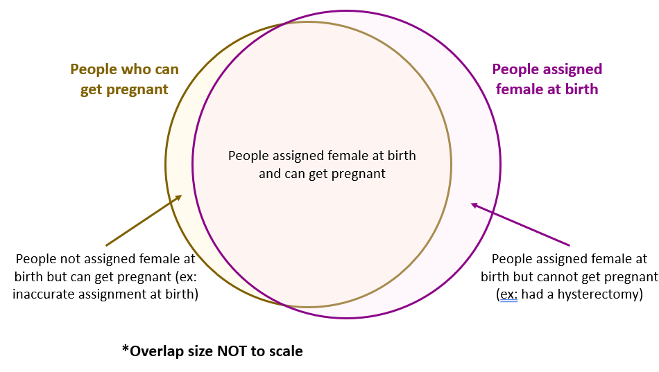
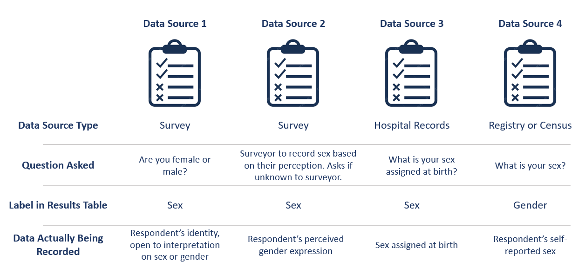
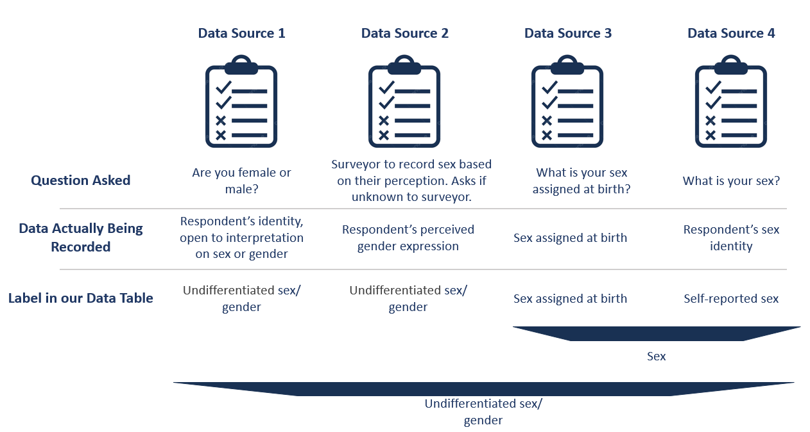

..
  Section title decorators for this document:

  ==============
  Document Title
  ==============

  Section Level 1 (#.0)
  +++++++++++++++++++++
  
  Section Level 2 (#.#)
  ---------------------

  Section Level 3 (#.#.#)
  ~~~~~~~~~~~~~~~~~~~~~~~

  Section Level 4
  ^^^^^^^^^^^^^^^

  Section Level 5
  '''''''''''''''

  The depth of each section level is determined by the order in which each
  decorator is encountered below. If you need an even deeper section level, just
  choose a new decorator symbol from the list here:
  https://docutils.sourceforge.io/docs/ref/rst/restructuredtext.html#sections
  And then add it to the list of decorators above.

.. sectnum::
  :depth: 3

.. _sex_gender:

========================================
Inclusive Health Metrics: Sex and gender
========================================

.. contents::
   :depth: 2
   :local:
   :backlinks: none

Overview
+++++++++

On this page you will find our guiding principles,
an introduction to sex and gender from a scientific perspective,
a glossary of commonly used terms related
to sex and gender, recommendations for how to address sex/gender-related limitations in external data
sources, discussion of the implications of imperfect proxy measures with regards to sex/gender,
examples of how our team has incorporated BLISS into our work process, and more! 

If you have any questions or comments about the content on this page - please reach out! You can
contact us directly `on GitHub <https://github.com/ihmeuw/vivarium_research/issues?q=is%3Aopen+is%3Aissue+label%3Abliss>`_ or anonymously 
on our `feedback form <https://docs.google.com/forms/d/e/1FAIpQLSeCED9TFQsH-1u4QkFxJvno4WaEDz6h9rhJeyFlAlqyG7MAJg/viewform>`_.  

.. list-table:: **What this is vs. What this isn't**
   :header-rows: 1

   * - This is...
     - This isn't...
   * - A ‘living’ document which will be regularly reviewed and updated to reflect evolving language and research practices. 
     - An immutable document that should be treated as all-knowing and final.
   * - An accessible guide intended for everyone’s use, regardless of your familiarity with inclusive language practices. 
     - An intimidating guide that is full of jargon and can only be used by DEI experts. 
   * - A safe space for people to make mistakes, ask questions, and learn new things! 
     - A space where people need to police what they are saying or how they are speaking for fear of judgment.
   * - Using our voice on the Simulation Science team to platform the terms we find most accurate and inclusive. 
     - Putting words into other people’s mouths (such as changing the gendered language in external data sources). 
   * - Gender inclusive.  
     - Gender neutral. We recognize that there are a variety of reasons why it is important to use person-first, inclusive language that does not invisibilize women in our conversations about public health. 

Guiding Principles
------------------

Our guiding principles for this document can be summarized in three points:  

This work is important
~~~~~~~~~~~~~~~~~~~~~~

Inclusive language use is important, and we want to begin by acknowledging the 
potential harm that using simplistic and gendered language can create.
People who are intersex, transgender, nonbinary, and/or 
have other gender-nonconforming identities experience harm from gendered language in a 
number of ways, including documented reductions in interactions 
with healthcare, not being included in research, and lost 
opportunities.

An accurate understanding of sex and gender improves the validity
of our research methods and conclusions about all people, not only
sexual and gender minority people.
As an example, past research about uterine cancer that used "women" as a proxy for people with a uterus
substantially underestimated incidence.
This underestimate was especially large for Black women,
who are more likely to have had a hysterectomy,
which lead to inaccurate conclusions about racial disparities. [Bauer_2022]_

In an effort to work toward institution-wide DEI goals and
advance our team’s research and publications, we created this guide to explore the
that involves these topics.
We hope to inspire change in other researchers by presenting our studies with gender 
inclusive language and model practices we believe in. For all of these reasons, we feel this 
guide is very important.

This work is evolving
~~~~~~~~~~~~~~~~~~~~~

Language is constantly evolving, so there is rarely a single “right” choice and the accepted 
choice may evolve over time. Therefore, this guide will be a living document that we will 
regularly review and update. We will hold ourselves accountable for aligning the guide with 
the current preferred language, terminology and approaches.  

While we hope this can be up-to-date and comprehensive, no guide can anticipate every use case, 
recognize every limitation, or be applicable to every research question. We aim to provide enough 
information that users can understand the spirit of the guide and apply that to their unique needs.  

This is work
~~~~~~~~~~~~

We acknowledge that there is a cost associated with a transition to gender inclusive language 
practices from standard, gendered language. Although using gender inclusive language is work, 
we highlight here that there are many benefits to incorporating more inclusive language into 
everyday public health research practices.

As human beings, we each have a lived experience of sex and gender -- none of us
are neutral outside observers.
We have all unconsciously internalized many ideas about sex and gender from our
experiences interacting with other people and with society.
These ideas may have served us well in some ways and helped us make sense of the world
around us.
This guide asks us to take a step back and re-examine our ideas, which requires effort and care.

Gender inclusive language can often be longer or more verbose than gendered language, but we 
believe specificity is more important than brevity. We seek to include all groups and identities 
in our language, even if that means using more words! For example, we would rather use terms like 
"women and people" to describe pregnancy related issues since this is inclusive of all who can get 
pregnant while not invisibilizing women.

The ever-evolving nature of the work means that this guide is for everyone! You don’t have to be 
an expert; this is meant to be accessible for all people. Wherever you are in the learning 
journey, this guide is intended to be a clear, helpful resource.  

We’re not going to put any words into other people’s mouths, but we will use our own voice to do 
the work and use the terms we find most accurate and inclusive.

Introduction to sex and gender
------------------------------

Most human fetuses have either two X chromosomes or one X and one Y chromosome.
A fetus' configuration of X and Y chromosomes influences a number of aspects of development,
such as hormones, gonads, and genitalia.
Then the child is born into a society with lots of pre-existing ideas about how bodies "should"
look and work, how people "should" behave, and how all these things "should" relate to one another.
Almost immediately, expectations and norms about identity and behavior are placed on the child,
based on their external genitalia at birth.
As that child grows up and throughout their life, societal pressures and norms impact their identity and behavior,
and their identity, behavior, and experiences have impacts in turn,
including on very "biological" factors such as hormone levels.
Meanwhile, their chromosomal makeup, hormones, etc. continue to have evolving impacts on their body,
which in turn can affect their identity and behavior, and how society views them.

This constellation of attributes is what we mean by "sex and gender."
It is an incredibly broad umbrella, spanning everything from
chromosomes to clothing styles to power structures.
Despite this range, it is difficult to tease apart the causal impacts of these factors from
one other, because all these factors are strongly correlated with each other.

The dominant culture in the West has historically seen sex and gender as synonymous and
binary.
According to this traditional view, a person is born either male or female,
and people born male "should" identify and behave like boys and men,
while people born female "should" identify and behave like girls and women.
This viewpoint treats the correlations between different aspects of sex and gender
as absolutes, marginalizing anyone who doesn't fit into one of the two prescribed options.

In the last few decades, the research community and the general public have moved toward an understanding
of "sex" and "gender" as separate terms, where "sex" refers to the biological and physical
characteristics in the constellation, while "gender" refers to the psychological and social ones.
The two need not align, so this framing is inherently more inclusive of transgender people,
who identify with a gender discordant with the sex assigned to them at birth.
Terms like "intersex" and "non-binary" have also gained wider recognition, raising counter-examples to formerly
assumed binaries of both sex and gender.

Recently, scholars have highlighted that sex and gender are **intertwined** and each **multi-dimensional**.

**Intertwined**: Just because there is a biological effect, like a disparity in deaths from cardiovascular disease,
does not mean we should rule out psychosocial causes such as care-seeking behavior or provider
perceptions of pain levels.
Sex and gender characteristics are a tangle of causal relationships and feedback loops. [Ritz_and_Greaves_2022]_

**Multi-dimensional**: Sex includes dimensions such as chromosomes, gonads, hormones, etc, while gender
includes dimensions of identity, presentation, perception, and societal roles.
To say that a person has "male sex" or "female gender" can be a useful shorthand
when most or all of the dimensions usually "align," but it ignores the complexities
of what happens when these dimensions don't align -- and nearly every imaginable
combination occurs at least some of the time.
Furthermore, stopping at observing a difference
between groups categorized like this does little to explain the underlying mechanism.
Many research questions can be more precisely stated in terms of a specific dimension or dimensions
of sex and/or gender. [Bauer_2022]_

It is important to distinguish conceptually between sex and gender,
and where possible between the different dimensions within each of them,
both to be inclusive of all people and to produce valid research.
However, it is also important not to assume that the causal relationships between
sex- and gender-related factors are simple or easy to determine.

There is a lot we still don't know about the science of sex and gender,
and lots of ongoing research about these topics.
However, this understanding of sex and gender as an intertwined collection
of factors spanning biology, psychology, and sociology is the foundation
upon which we build in this guide.

Glossary of General Terminology
-------------------------------
In this section, you will find a glossary of general terminology that will be used 
throughout this style guide. 

.. list-table:: **Glossary**
   :header-rows: 1

   * - Term
     - Definition
   * - Sex
     - *Sex* refers to biological attributes and functions associated with chromosomal makeup, 
       reproductive anatomy, and secondary sex characteristics [Ritz_and_Greaves_2022]_.
   * - Gender
     - *Gender*, on the other hand, is a social construct that refers to the culturally specific 
       expectations, behaviors, and institutions that shape any individual's access to power, 
       privilege, and resources. It can also refer to a gendered individual's internal sense of 
       identity [Ritz_and_Greaves_2022]_.
   * - Undifferentiated sex/gender measure
     - Undifferentiated sex/gender measure is a variable that indicates uncertainty 
       regarding what is being reported. This uncertainty can arise  due to unclearly defined variables 
       in an external data source (e.g., vague survey question that different respondents may interpret differently) 
       or from the compilation of many data sources with clear definitions of 'sex' or 'gender' into one 
       conglomerate sex/gender variable (e.g., GBD "sex" variable).
   * - Proxy measure
     - "An indirect measure of the desired outcome which is itself strongly correlated to that outcome" [GovEx_Johns_Hopkins]_.
       Unacknowledged use of a proxy measure for the output variable of interest can lead to inaccurate
       or harmful findings and should therefore be approached with caution. For example, [Bauer_2022]_
       discusses in their paper how the "unacknowledged use of a sex/gender proxy for a sexed dimension of interest
       (i.e., uterine status) resulted in decades of cancer research misestimating risks, racial disparities,
       and age trends".
   * - Sex assigned at birth
     - "Recorded on initial birth record; generally genital phenotype" [Bauer_2022]_.
   * - Intersex status
     - "Reported presence of intersex conditions generally or a specific condition" [Bauer_2022]_. 
   * - Gender identity
     - "Personally held sense of one’s gender as man/boy, woman/girl, another cultural gender, 
       trans, nonbinary, etc." [Bauer_2022]_.
   * - Gender role
     - "the different expectations that individuals, groups, and societies have of individuals based on their sex and based on each society's values and beliefs about gender" [Blackstone_2003]_.
   * - Sex- and gender-related factors
     - An umbrella term that refers to any and all characteristics related to sex and/or gender (e.g., 
       gamete size, hormone production, so-called 'secondary sex
       characteristics' such as body hair or breast tissue, gender identity, gender expression, gendered social roles, etc). 
   * - Intersex identity
     - "Personally held identification as intersex" [Bauer_2022]_.
   * - Sexual and gender minority (SGM) 
     - An umbrella term that includes (but is not limited to) individuals that are two-spirit, 
       intersex, lesbian, gay, bisexual, transgender, non-binary, asexual, or have other gender 
       non-conforming identities.

The Politics of Language
------------------------
The language we choose to use is inherently political and we are aware of that fact. 
This guide asserts that gender inclusive language is important and pushes for its 
wider use in public health research and dissemination. In doing so, we hope to 
advocate for SGM inclusion in this field.

However we also recognize that others, particularly those fighting for women's 
empowerment might choose to use different language to advocate for other groups. For example, 
there are places where women's inclusion in clinical trials or datasets is not 
guaranteed and they are still pushing for anyone other than cis-gendered men to be included 
in research. This is important and vital work. Additionally, some groups want to push 
back on male centric lanaguage - such as defaulting to masculine pronouns for 
a non-gendered person. This is also a worthy cause. We recognize and respect that the intentional 
use of language to further a goal might lead some to different language choices in certain situtions. 

Some of the people in women's empowerment groups might feel that including gender 
inclusive language is antagonistic, detrimental, or mutually exclusive to women's empowerment. Our group 
disagrees with this proposed dichotomy. Having more diverse and precise language 
options can benefit both cis-women and gender minorities. There are wide variations 
in bodies among cis-women and moving towards better measurements will force 
researchers to define what they are hoping to quantify outside of just "male" or "female". 
For example, considering "people with uteruses" instead of "women" when measuring uterine 
cancer rates would have helped better quantify incidence for all people [Bauer_2022]_.

Our hope is that someday, sex and gender are better 
measured and reported in data, leading to less friction between perspectives. 
As stated in [Rioux_2022]_ "as this becomes the norm, cis 
women-related terms and language inclusive of gender diversity will be able to 
better coexist" and they can both be applied more precisely. 

Research question
+++++++++++++++++

As much as possible, our research should be precise about the variables of interest.
For example, if we are modeling pregnancy, the variable we are interested in is the
ability to become pregnant.
This not only clarifies that we are interested in biological sex and not gender, but is even
more precise that it is this facet of biological sex that matters,
not another facet such as chromosomal makeup.

It is frequently not possible to be this precise;
we should try to at least determine whether our research question is about sex or gender.
In some cases, even this may not be clear, for example if we are researching an
association that could be mediated by any facet of sex or gender (or multiple),
which would mean that all sex- and gender-related factors are variables of interest.

Research considerations
-----------------------

Before beginning with your research, there are some crucial considerations to take as you read through
our recommendations. 

First, understanding your audience is key - both in terms of who will be reading your study, and the population 
your research affects or studies. For instance, if your work addresses global health, the cultural and 
geographical nuances of sex and gender may differ significantly from those in U.S. health contexts. 
Moreover, as covered in our section `The Politics of Language`_, if your research is focused on a specific subset
of health sciences, such as maternal or pregnancy-related health, you should be attuned to the political implications 
of sex and gender within your field.

As noted in the above section, you should also consider how central sex and gender are to your research question, and
whether you're most interested in sex, gender, or some combination of both in your research. If sex and gender are 
central to your research, it may necessitate a more careful and detailed approach to how you analyze and report sex- and gender-
related data - in which case, you hopefully will find the majority of this guide useful to you!

Lastly, make sure to be aware of your target journal’s policies regarding sex and gender. 
While it is currently not very common, certain journals may have established guidelines that must be adhered to.

Taking these considerations into account before implementing the guide's recommendations will help ensure that 
your research is not only respectful and sensitive to the complexities of sex and gender but also adherent to 
relevant guidelines and meaningful to your intended audience.

Proxy measures
--------------

When defining your research question, you might have to use proxy measures (e.g., due to a lack of availability of primary data - more
on this in Section 3.1 Data collection below.) 
A proxy measure is another variable that is highly correlated with the variable of interest,
which we use as a stand-in for it.
In the pregnancy example, we might use as a proxy whether `someone was assigned female sex at birth <https://en.wikipedia.org/wiki/Sex_assignment>`_
and is between the ages of 15 and 50.
This is an imperfect proxy for the ability to become pregnant. You can see how these 
measures overlap, but are not the same in the figure below. 

Whenever we use a proxy measure, we introduce a limitation into our research,
which we should acknowledge explicitly.
These limitations could lead to harm if they informed incorrect conclusions that
resulted in real-world decisions or policies.
This harm would be especially likely to impact those for whom the proxy measure and the
underlying variable of interest are not the same.
For example, if we use gender as a proxy measure for sex,
the people most likely to be left out of our conclusions are transgender, non-binary,
and intersex people.
We should always weigh these harms against the potential benefits of the research
before deciding to use a proxy measure.

Methodology
+++++++++++

Data collection
---------------

Our research doesn't generally involve primary data collection.
Therefore, the *input* data to our modeling process is almost always
the *output* of other research, such as a survey, which we don't have
control over.

A lot of the time, we are multiple steps removed from the original data.
For example, many of our models use Global Burden of Disease (GBD) outputs.
These outputs are the result of a modeling process which itself
uses published results from primary research.
GBD is a little bit special in that we have a pretty good understanding of
its inner workings; see section 3.2.1 Global Burden of Disease (GBD) below.

Frequently, upstream research does not report sex and/or gender in ways that
reflect the difference between, and complexity of, those concepts.
Since we are stuck with whatever is reported, we have to decide
both how to use the variables reported in our analysis, and how to acknowledge
the limitations introduced to our research by these issues in our
research outputs (presentations, reports, etc). 

Sex and gender variables in upstream research 
~~~~~~~~~~~~~~~~~~~~~~~~~~~~~~~~~~~~~~~~~~~~~

**We should not take the names of sex or gender variables in input data at
face value.**
Due to prevalent misunderstandings of sex and gender as distinct and complex concepts,
these variables are very likely to be mislabeled.

Instead, we should trace these variables back to their source when it is
feasible to do so.

This figure shows some example data sources and some of the common pitfalls. For example, 
data sources might mislabel their data (gender vs sex), might use misleading or 
difficult questions ("Are you male or female?" doesn't indicate sex vs gender and 
doesn't have options for gender non-conforming people), or might conflate different aspects of sex and 
gender (gender presentation might differ from identity). There are some cases where 
a more exact and defined metric is used though - such as sex assigned at birth. 

When it is not feasible to trace a sex or gender variable back to its source,
either because we are many steps removed from the original data or because
there is a lack of public documentation about a data source,
**we should assume that it is a non-differentiated sex/gender measure,**
unless there are clear signs of effort to construct a valid sex/gender measure.
Unfortunately, given current research practices, it is most common that a single binary variable
labeled either "gender" or "sex" actually represents a non-differentiated sex/gender measure.

Measurement error
~~~~~~~~~~~~~~~~~

In the evaluation of sex and/or gender as a variable in an epidemiologic study, error in
the measurement of these variables can lead to bias in study results. Measurement error
may be introduced through researchers assuming participants' gender rather than self-reporting,
or not asking questions in a way that allows participants to accurately report their sex
and/or gender.

In situations where sex and/or gender are being treated as an exposure variable relative to
some outcome (for instance, in a research question such as "what influence does sex have on
a given outcome?"), measurement error will bias the measure of effect, and the direction of 
the bias depends on whether or not the measurement error is differential or non-differential
with respect to the outcome. Each case is described below:

- Non-differential measurement error of the exposure is when the amount of exposure 
  misclassification does not vary by outcome level. In this case, the measure of effect of the
  exposure on the outcome will be biased towards the null.

- Differential measurement error of the exposure occurs when the amount of exposure 
  misclassification varies by the outcome level. For instance, a study design in which gender was
  ascertained from recorded sex in medical records for lung cancer cases, but was self-reported
  among control participants is likely to have differential rates of measurement error of gender
  by case versus control status. In this situation, the measure of effect of the exposure on the 
  outcome may be biased upwards or downwards.

In either case, measurement error of sex and/or gender can lead to biased results and care 
should be taken to minimize error in measuring these variables (as for all variables!) to 
minimize bias in study results. When we are using data published by others, it is important
to consider how results may be affected by potential measurement error and discuss any
relevant limitations accordingly.

Terminology
~~~~~~~~~~~

When we determine that a variable in an input data source reflects something different
than the name it was given by the upstream researchers, we should use the more
accurate terminology wherever possible, even when talking specifically about that
data source.

The only exception to this is that we should unambiguously state, somewhere in our
research outputs, the variable name we used from the input data file.
This should only need to be mentioned once.
This promotes clarity and reproducibility by ensuring that readers can find the
data we used.

For example, the first time we mentioned the sex/gender variable of the National Health and Nutrition Examination Survey (NHANES)
in the appendix of the VEHSS diabetic retinopathy paper: [VEHSS_DR]_

.. pull-quote::

  NHANES data report a variable named “gender,” but... [description of limitations]

  As such, this variable is best understood as a
  non-differentiated sex/gender measure, a proxy measure for both sex and gender that does
  not directly measure either.
  Hereafter, we refer to this variable as “sex/gender” to reflect
  this limitation.

Because we are deviating from the language of the upstream research authors, it is
a good idea to (concisely) justify why we think the original authors' language was inaccurate.
In the NHANES example, the full first sentence of the above quote was:

.. pull-quote::
  NHANES data report a variable named “gender,” but this reflects a survey question, “Is
  {NAME} male or female?,” which only allowed binary responses, was only asked by the
  interviewer if they hadn't already assumed the gender of the respondent, and could be
  interpreted as asking about biological sex.

Data Analysis
-------------

Global Burden of Disease (GBD)
~~~~~~~~~~~~~~~~~~~~~~~~~~~~~~

The GBD study is very complex and has many different data sources. Here, 
we provide a general overview of how the Demographics team works with the "sex" 
(later referred to undifferentiated sex/gender as this is more accurate) 
variable and some of the limitations (as of GBD 2021). To understand undifferentiated 
sex/gender in the context of a 
particular disease or risk factor, please reference the `GBD methods appendix <https://www.thelancet.com/journals/lancet/article/PIIS0140-6736(20)30925-9/fulltext#supplementaryMaterial>`_ to 
see the exact data sources used. 

The high level steps used for calculating population estimates for each 
country, year, age group and sex/gender are: 

  #. First, GBD uses fertility rate estimates from hospital records and surveys such as DHS to define the population. A standard sex ratio at birth is applied to all. 
  #. The population is then aged up from birth, with mortality. In the 0-5 age group, mortality estimates come from DHS surveys, vital registries and death records. 
  #. In older age groups, mortality estimates continue and are derived from vital registries and death records. 
  #. Next, fatal discontinuities such as war or natural disasters are added. 
  #. Lastly, the estimated population is then matched against census and other survey results and adjustments are made as needed. 

While it would be challenging to include how sex/gender is recorded in all data sources used, here are some examples: 

- In the DHS survey, women (unknown how "women" are identified or what might happen if a man were the birthing parent) are asked about their births and children, specifically they are asked about their "sons and daughters" or later "boys and girls". No option is included for intersex children and it is not clear how they would be recorded. 
- Death certificates are usually completed by a medical professional and therefore reflect a person's anatomy at death. The options are male, female or "unknown". Unknown is usually used only if a body is mutilated such that anatomy cannot be determined. There is not a box to include gender or identity. 
- The US Census asks "What is [person 1]'s sex?" with options for male and female only. They state that the question should be completed based on how that person currently identifies. 

These methods contain a few limitations: 

- Sex assigned at birth is used to create the population. Intersex people are not considered here and the full population is assigned to either male or female. 
- An implicit assumption of creating a population based on sex assigned at birth and then aging it up is that no one changes sex/gender during their lifetime. We know this to be untrue. 
- Additionally, different data sources track different data - anatomy at death might be different from a person's self-reported sex.
- More broadly, GBD does not attempt to include any category other than male or female. 
- Since there are so many different input data sources and they vary by country, it would be very difficult for GBD to have anything other than "undifferentiated sex/gender" in their final results. However, GBD still uses the language "sex" for its variable. 

More information on the methods can be found in the `demographics methods appendix <https://www.thelancet.com/journals/lancet/article/PIIS0140-6736(20)30977-6/fulltext#supplementaryMaterial>`_

Results
+++++++

Goals when Reporting Results
----------------------------

When we present our findings, we have two primary goals:

* Accurately convey the variables of interest, and what the causal structures might be.
  We should strive to be as precise as possible, and not rely on "common sense"
  to indicate which gender- and sex-related factors are related to a health outcome.
  Despite prevailing belief that sex affects gender but not vice versa, there is
  strong evidence for causal influence in both directions. [Ritz_and_Greaves_2022]_ [Springer_2012]_
  Even when we do think that a sex-related factor is most causally related to our outcome,
  we should still mention that some of its impact could be mediated through
  gender factors and that it is difficult to disentangle these.
* Highlight data limitations around sex and gender measures.
  We don't want our inclusive language to give the impression that we are able to make accurate
  conclusions about SGM populations when the data prevent us from doing this.
  Furthermore, drawing attention to the problems with how almost every data source currently
  captures sex and/or gender raises awareness that changes need to be made in primary data collection.

Strategy
--------

We often need to be very concise, and can't surface all the complexity
of sex and gender every time we reference them. So, we take the following
approach:

* Somewhere in the paper/report, we explain in a fair amount of detail the
  sex and gender measures we used, why we used them that way, etc.
  For example, this could be in a methods appendix (as in the VEHSS papers)
  or a technical report that accompanies a PowerPoint presentation of results.
* In each part that "stands alone" (e.g. each document or presentation; see next paragraph) we **either**:

  * Define our resulting indicator the first time we reference it, then abbreviate it;
    the abbreviation does not need to
    entirely capture what the indicator means, but it should
    not be a common word/phrase that someone would likely assume has a different meaning.
  * If the previous is not possible (e.g. in an abstract where words are extremely limited),
    we use the shortest term for our resulting
    indicator that both conveys its main limitations and does not need a definition.

A part "stands alone" if it is likely to be viewed/read separately from other parts, and a reader
would expect it to be self-contained: referencing other resources where necessary,
but not using terms or ideas from elsewhere without reference or explanation.
Think of acronyms: it is acceptable to use an acronym in the discussion
section of a journal article that was introduced in the methods section of that article,
because it is part of the same document.
But a journal editor would not allow you to use an acronym in the discussion section of
a journal article that is only introduced in the supplementary material.
Most journal editors also consider tables and figures to stand alone in this way (i.e. they cannot use
acronyms from the main text), so we follow that convention with our sex and gender terminology.

The following sections give more concrete recommendations for each part of results reporting.

Detailed description
--------------------

The detailed description of our methods regarding sex and gender can be centralized
in one place, or spread throughout the paper or report.
Wherever it is, it should include most of the considerations described in earlier
sections of this guide: defining the variables of interest for our
research question and noting the difficulty of disentangling factors from each other,
giving details about the sex- and gender-related measures in the data sources used,
and (usually) calling for better data to be collected.

Here are a few suggestions for the detailed description:

* If we can, cite some of the research that is cited in this guide!
  This gives curious readers a starting point to learn more,
  and gives credit to the researchers whose ideas we are building on.
  See the `Recommended Resources`_ section below.
* If we are not able to present quantitative results for SGM
  populations, but have reason to believe that (any of) these
  populations are especially impacted by the health issues we are studying,
  we can cite relevant quantitative or qualitative research
  about disparities, for example about a similar condition, risk factors, or healthcare access.
  Unfortunately, we will have reason to believe this for just about any health condition in a US context,
  since there are well-documented disparities across various outcomes and healthcare access
  for e.g. transgender people. [Brown_2016]_ [Baker_2019]_ [Grant_2011]_

Example 1: Pregnancy
~~~~~~~~~~~~~~~~~~~~

Let's consider the example of reporting a result about pregnancy.
In this case, while gender-related factors could play a role in e.g. pregnancy outcomes,
the sex- or gender-related factor with the most direct relevance is clearly the ability
to become pregnant.
In this case, we might say:

.. pull-quote::

  In health research on pregnancy, it is important to identify the group
  of people who can become pregnant.
  Typically, a proxy measure of "women of reproductive age" is constructed for
  this purpose, combining some indicator of female sex or gender with an age restriction
  such as 15-49 years.
  This measure does not account for infertility, for example by including people who
  have had hysterectomies.
  Additionally, when it is defined in a way that conflates sex with gender,
  it will be highly inaccurate among transgender people and other gender minority populations.

  To be more precise and inclusive in our language, we define our population of interest as
  women and birthing people of reproductive age (WBPRA): people ages 15-49 who were assigned
  female sex at birth.
  Note that this definition retains the limitation about infertility.

  Sex assigned at birth was not measured in any of our data sources,
  so we used proxy measures for this attribute.
  Notably, <source> and <source> only provided undifferentiated sex/gender measures,
  making it unclear how our conclusions generalize to transgender people and other gender minority populations.
  Due to these issues, our results are among WBPRA according to imperfect proxy measures.
  To address these limitations, data would need to be collected using more robust measures
  of sex- and gender-related factors. [Bauer_2017]_ [Nielsen_2021]_ [ABS_2021]_ [National_Academies_2022]_

Example 2: Descriptive epidemiology
~~~~~~~~~~~~~~~~~~~~~~~~~~~~~~~~~~~

In the previous example, we were able to define our variables of interest pretty precisely,
even if our data sources didn't measure them.

On the other hand, if we were doing descriptive epidemiology and didn't have even an educated
guess of what specific sex- and gender-related factors could be associated with our outcome,
we might say:

.. pull-quote::

  Sex and gender are multi-dimensional concepts.
  Collectively, they span a number of biological (sex-related) and sociocultural
  (gender-related) factors which are highly correlated and causally entangled with one other. [Bauer_2022]_ [Springer_2012]_
  Frequently in health research, differences are attributed wholly to sex-related factors, when
  in fact gender-related factors also play a part in those differences. [Ritz_and_Greaves_2022]_ [Springer_2012]_
  For example, gender-associated behaviors such as care-seeking and risk-taking can influence
  health outcomes,
  and structural or interpersonal sexism or cisnormativity can influence the quality of preventive health
  care received.
  Since prevalence of <outcome> could be influenced by sex- and/or gender-related factors,
  an ideal analysis would report prevalence by multiple of these factors.

  However, each data source used in this study reported only a single sex or gender variable,
  and many of these were binary as well as undifferentiated.
  Therefore, we have used each of these variables as proxies for the entire group of
  sex- and gender-related factors, and are only able to report prevalence in "male" and "female"
  groups.
  It is unclear how our conclusions would generalize to transgender people and other gender minority
  populations.
  To address these limitations, data would need to be collected using more robust measures
  of sex- and gender-related factors. [Bauer_2017]_ [Nielsen_2021]_ [ABS_2021]_ [National_Academies_2022]_

Result indicator definition
---------------------------

In *each* stand-alone document (paper, table, figure, etc) where we present results
that relate to sex and/or gender,
we should define our result indicator (or indicators, though we
usually won't be able to report more than one).

How an indicator should be defined depends on the data that informed it.
In general, we think of an indicator as the "least common denominator"
of the data that went into it.

Put another way, when the sex/gender-related factors we are reporting on are unclear - 
for example when we have assumed equivalence between different measures across 
data sources - we should use terms that reflect this uncertainty.

To understand this, we can look at our figure of hypothetical data sources
from above. There is now an additional row with how we would include
this data in our analysis. You can see the first two data sources would both be
undifferentiated sex/gender. This is due to ambiguity between sex and gender in
the question asked.

The latter two data sources more clearly reflect sex, although one is sex assigned
at birth and the other is self-reported sex. Therefore if you included only data sources
3 and 4, you might label your result as sex.

If you included one of the first two data sources as well, it is no longer clear
that sex is reported instead of gender and so you would
consider your resulting indicator to be undifferentiated sex/gender.

Result indicator abbreviation
-----------------------------

Frequently we will report many results related to sex and gender,
and we can't repeat our definition every time we do so.
Therefore, we need to abbreviate our result indicator.
Frequently, we will also need to abbreviate the *values* it can take.

The best abbreviation is a case-by-case decision, but the guidelines to follow
are:

* Do not use an abbreviation that is already a common term,
  such as "sex", "gender", "male", or "female".
  It's better to use an abbreviation our reader doesn't know
  than to use an abbreviation they *think* they know but don't.
* If the indicator spans aspects of sex and gender, neither or both of "sex" and "gender"
  should appear in the abbreviation.
  Using one without the other invites the reader to assume the indicator is better-defined
  than it is.

Again, these guidelines should be taken on a case-by-case basis, and there will certainly
be exceptions to these rules, depending on context. For example, in the above section
`Result indicator abbreviation`_, we provided an example where a researcher has two
data sources which report 'sex'. One source defines 'sex' as sex assigned at birth, and the 
other defines 'sex' as self-reported sex. Depending on how central the differences between these 
dimensions are to your research, it may be sufficient to refer to these collectively as 
'sex'. It's worth noting, however, that based on today's standards of sex and gender 
reporting, having any data source specify which dimension of sex was measured can be rare.
This demonstrates how improving our data reporting standards will allow researchers to more 
easily use language that accurately reflects the dimensions of sex and gender within their work [Rioux_2022].

Example 1: Pregnancy
~~~~~~~~~~~~~~~~~~~~

.. todo::

  Brainstorm the best abbreviation here; this should be considered a rough draft.

.. pull-quote::
  
  ... our results are among WBPRA according to imperfect proxy measures,
  henceforth "proxy WBPRA."

  ... the fertility rate was 14 per 1,000 person-years among proxy WBPRA ...

Example 2: Descriptive epidemiology
~~~~~~~~~~~~~~~~~~~~~~~~~~~~~~~~~~~

Continuing the "descriptive epidemiology" example from above,
this is a common case where our resulting indicator is
undifferentiated sex/gender, without any specificity about which
factors are at play.

Currently, we have been abbreviating this to simply "sex/gender" --
this could create the impression that we are saying sex
and gender are the same thing, but it should be unusual enough that
a curious reader looks at the definition, which explains that they are
different but can't be reported precisely.

.. note::

  When the abbreviation has to appear before the definition, as in
  a figure title that is only later clarified by a footnote,
  we use "undifferentiated sex/gender" as the
  abbreviation to address this ambiguity.

.. pull-quote:: 

  ... we estimate that prevalence was 7.8% among people with male sex/gender ...

An even more concise alternative is to capitalize "Male" and "Female" to indicate
that these are defined terms:

.. pull-quote::

  ... Henceforth, we refer to this indicator as "sex/gender" and to these categories
  as "Male" and "Female"...

  ... we estimate that prevalence was 7.8% among Male people, as defined previously...
  ... we estimate that prevalence was 4.5% among Female people...

BLISS in Action 
+++++++++++++++

Our team has been able to implement these BLISS guidelines in our own work. 
Here we chronicle guides, papers and presentations that include BLISS best 
practices, as well as some lessons learned. 

Examples of Our Work with BLISS
-------------------------------

#. A `BLISS guide for Topics Concerning Pregnancy <https://uwnetid.sharepoint.com/:w:/r/sites/ihme_simulation_science_team/_layouts/15/Doc.aspx?sourcedoc=%7B3E09642A-1A84-4D63-8690-EDA98E611295%7D&file=202204_Gender%20Neutral%20Language%20for%20Topics%20concerning%20Pregnancy.docx&action=default&mobileredirect=true>`_. This includes recommendations on gender inclusive language that can be used for topics of pregnancy and child birth. 
#. A presentation about IV iron at the `Institute of Disease Modeling symposium <https://uwnetid.sharepoint.com/:p:/r/sites/ihme_simulation_science_team/_layouts/15/Doc.aspx?sourcedoc=%7B141E4585-6A1B-414C-8DDE-2F075FEB1667%7D&file=20230501_IDM_Symposium_DRAFT_v0.2.pptx&action=edit&mobileredirect=true>`_. This presentation included many of the terms from our pregnancy guide implemented in practice.
#. A paper on the `prevalence of diabetic retinopathy <https://jamanetwork.com/journals/jamaophthalmology/article-abstract/2806093>`_ that includes a "nondifferentiated sex and gender measure" for data analysis and helpful explanation of what that means with respect to the specific primary data sources used. 

Lessons Learned
---------------

- Most people are willing and even enthusiastic about improving language to be more gender inclusive! 
- Changing language requires an explanation. It is important to explain the new language, why it is important and what it means.
- In situations where using gender-inclusive language changes established practices or definitions in the field (e.g., maternal mortality is a commonly understood term), we must take extra care to not confuse our audience and ensure all are able to understand and benefit from our work. 
- As secondary data analyzers, we are limited by the data we can find and the information included about its collection. As much as we want to, it it often impossible to decide if a variable represents sex or gender or who in a dataset might be being missed, or misclassified. 
- Acknowledging these limitations and considering their impact is an important part of this work. 

Recommended Resources
+++++++++++++++++++++

.. list-table:: **Recommended papers on sex and/or gender-related topics**
   :header-rows: 1

   * - You want to know more about...
     - So we recommend you check out... 
   * - How to be inclusive in pregnancy-related research
     - * *Men, trans/masculine, and non-binary people’s experiences of pregnancy loss: an international qualitative study* [Riggs_2020]_
       * *Gender-inclusive writing for epidemiological research on pregnancy* [Rioux_2022]_
   * - How sex and gender are multidimensional and interrelated
     - * *Sex and Gender Multidimensionality in Epidemiologic Research* [Bauer_2022]_
       * *Beyond a catalogue of differences: A theoretical frame and good practice guidelines for researching sex/gender in human health.* [Springer_2012]_
       * *Transcending the Male-Female Binary in Biomedical Research: Constellations, Heterogeneity, and Mechanism When Considering Sex and Gender.* [Ritz_and_Greaves_2022]_
   * - How to build an inclusive survey questionnaire
     - *Transgender-inclusive measures of sex/gender for population surveys: Mixed-methods evaluation and recommendations* [Bauer_2017]_

Other Gender-Inclusive Guides
-----------------------------

- DEI Research Guide
- Design team guidelines for discussing gender, sex, and sexuality
- Gates Foundation
- World Health Organization

References
++++++++++

.. [VEHSS_DR] Lundeen EA, Burke-Conte Z, Rein DB, et al. Prevalence of Diabetic Retinopathy in the US in 2021. JAMA Ophthalmol. Published online June 15, 2023. doi:10.1001/jamaophthalmol.2023.2289, `online version <https://jamanetwork.com/journals/jamaophthalmology/fullarticle/2806093>`_

.. [Bauer_2022]
    Bauer, G. (2022) Sex and Gender Multidimensionality in Epidemiologic Research. American Journal of Epidemiology, Oxford University Press, 30 September 2022, https://academic.oup.com/aje/article/192/1/122/6747669. 

.. [Ritz_and_Greaves_2022]
    Ritz, S. and Greaves, L. (2022) Transcending the Male-Female Binary in Biomedical Research: Constellations, Heterogeneity, and Mechanism When Considering Sex and Gender. International Journal of Environmental Research and Public Health, 30 March 2022, https://www.mdpi.com/1660-4601/19/7/4083.

.. [GovEx_Johns_Hopkins]
    https://centerforgov.gitbooks.io/benchmarking/content/

.. [Springer_2012]
    Springer, K., Stellman, J., Jordan-Young, R. (2012) Beyond a catalogue of differences: A theoretical frame and good practice guidelines for researching sex/gender in human health. Social Science & Medicine, June 2012, https://doi.org/10.1016/j.socscimed.2011.05.033

.. [Bauer_2017]
    Bauer, G.R., Braimoh, J., Scheim, A.I., Dharma, C. (2017) Transgender-inclusive measures of sex/gender for population surveys: Mixed-methods evaluation and recommendations. PLoS ONE 12(5): e0178043. https://doi.org/10.1371/journal.pone.0178043

.. [Blackstone_2003]
    Blackstone, A. (2003) Gender Roles and Society. In Human Ecology: An Encyclopedia of Children, Families, Communities, and Environments: pp.335-338.

.. [Nielsen_2021]
    Nielsen, M.W., Stefanick, M.L., Peragine, D. et al. Gender-related variables for health research. Biol Sex Differ 12, 23 (2021). https://doi.org/10.1186/s13293-021-00366-3

.. [ABS_2021]
    Standard for Sex, Gender, Variations of Sex Characteristics and Sexual Orientation Variables. Australian Bureau of Statistics. https://www.abs.gov.au/statistics/standards/standard-sex-gender-variations-sex-characteristics-and-sexual-orientation-variables/latest-release

.. [National_Academies_2022]
    Measuring Sex, Gender Identity, and Sexual Orientation. National Academies of Sciences, Engineering, and Medicine. https://nap.nationalacademies.org/catalog/26424/measuring-sex-gender-identity-and-sexual-orientation

.. [Riggs_2020] 
    Riggs, D., Pearce, R., Pfeffer, C., Hines, S., White, F.R., Ruspini, E. (2020) Men, trans/masculine, and non-binary people’s experiences of pregnancy loss: an international qualitative study`. BMC Pregnancy and Childbirth. https://bmcpregnancychildbirth.biomedcentral.com/articles/10.1186/s12884-020-03166-6  

.. [Rioux_2022]
    Rioux, C., Weedon, S., London-Nadeau, K., Pare, A., Juster, R.P., Roos, L., Freeman, M., Tomfohr-Madsen, L. (2022) Gender-inclusive writing for epidemiological research on pregnancy. J Epidemiological
    Community. 28 June 2022, http://dx.doi.org/10.1136/jech-2022-219172).

.. [Brown_2016]
    Brown, G. R., & Jones, K. T. (2016). Mental Health and Medical Health Disparities in 5135 Transgender Veterans Receiving Healthcare in the Veterans Health Administration: A Case-Control Study. LGBT health, 3(2), 122–131. https://doi.org/10.1089/lgbt.2015.0058

.. [Baker_2019]
    Baker, K. E. (2019). Findings from the behavioral risk factor surveillance system on health-related quality of life among US transgender adults, 2014-2017. JAMA Internal Medicine, 179(8), 1141-1144.

.. [Grant_2011]
    Grant, J. M., Mottet, L. A., Tanis, J. J., & Min, D. (2011). Transgender discrimination survey. National Center for Transgender Equality and National Gay and Lesbian Task Force: Washington, DC, USA.