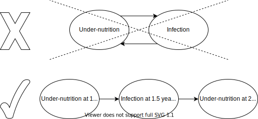
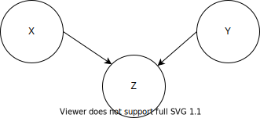
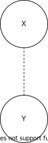
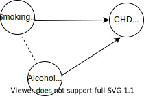
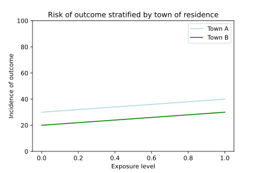
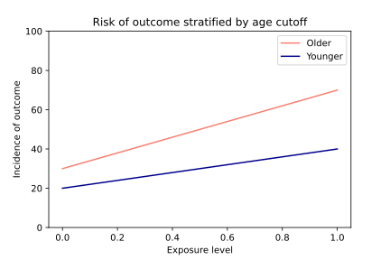
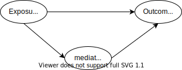
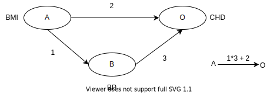

.. role:: underline
    :class: underline

..
  Section title decorators for this document:
  ==============
  Document Title
  ==============
  Section Level 1
  ---------------
  Section Level 2
  +++++++++++++++
  Section Level 3
  ~~~~~~~~~~~~~~~
  Section Level 4
  ^^^^^^^^^^^^^^^
  Section Level 5
  '''''''''''''''
  The depth of each section level is determined by the order in which each
  decorator is encountered below. If you need an even deeper section level, just
  choose a new decorator symbol from the list here:
  https://docutils.sourceforge.io/docs/ref/rst/restructuredtext.html#sections
  And then add it to the list of decorators above.

.. _general_dags:

===============
Casual Diagrams
===============

The purpose of this page is to document information on types of casual diagrams 
and how they are used. This includes background on the set of of different diagrams, 
cause vs correlation, mediation, and effect modification. 

.. contents::
	:local:

.. _DAGs:

Directed Acyclic Graphs (Causal Diagrams)
------------------------------------------

.. important::

  The figures represented in this section represent directed acyclic graphs/causal diagrams. These figures are distinct from compartamental model diagrams (such as SIR models). DAGs for causal diagrams are commonly represented as *circles* connected by arrows, and compartmental model diagrams are commonly represented as *squares* connected by arrows; we will follow this convention here.

  Additionally, for the purposes of directed acyclic graphs, variables will be labeled with capital letters (A, B, C, etc.) and arrows will be labeled with lower case letters (a, b, c, etc.).

Introduction to Directed Acyclic Graphs
+++++++++++++++++++++++++++++++++++++++

`Directed acyclic graphs <https://en.wikipedia.org/wiki/Directed_acyclic_graph>`_ (DAGs) are composed of variables (`nodes <https://en.wikipedia.org/wiki/Vertex_(graph_theory)>`_ of the graph) that are linked together by directional arrows (`arcs <https://en.wikipedia.org/wiki/Glossary_of_graph_theory_terms#edge>`_ of the graph), in such a way that the arrows do not form any `directed cycles <https://en.wikipedia.org/wiki/Cycle_graph#Directed_cycle_graph>`_. For our purposes here, DAGS will represent `causal diagrams <https://ftp.cs.ucla.edu/pub/stat_ser/r332.pdf>`_. Critically, the solid arrows in DAGs represent a causal relationship between an exposure variable (start of the arrow) and outcome variable (end of the arrow), representing the *directional* aspect of DAGs. Notably, a directional arrow in a DAG does not offer any information about whether the exposure causes an increased or decreased probability of the outcome, only that there is some causal relationship between the exposure and outcome. 

The *acyclic* nature of DAGs is that there cannot be feedback loops between any variables in the graph. In this way, the arrows in DAGs can be interpreted as the passage of time so that the exposure (cause) must always occur temporally *before* the outcome (effect). See the diagram below for an example of an inappropriate and appropriate DAG with regard to temporality.

.. note::

  The figure below represents a feedback loop between two variables; however feedback loops that involve more than two variables are also not appropriate for use in causal diagram DAGs.

Applications, Assumptions, and Limitations of Directed Acyclic Graphs
+++++++++++++++++++++++++++++++++++++++++++++++++++++++++++++++++++++

DAGs are used in epidemiology to represent a network of relationships between several variables, which in turn helps to guide the selection of variables that will need to be measured or considered in a given study/project. Further, the exact relationship between variables in a DAG will dictate *how* to treat or consider a specific variable in that study/project by helping to indentify potential confounding, intermediate, or mediating variables between a given exposure and outcome of interest (see the `Causal Relationships`_ section for definitions).

However, DAGs are limited in that they require *prior causal knowledge* about the variables that may be causally related to a given exposure and outcome of interest. Therefore, there may be uncertain, unmeasured, or unknown variables that cannot be represented in a given DAG. Further, DAGs do not allow for *easy* representation of whether a relationship is positive or negative, the magnitude of a causal relationship, or effect modification. Note that alternative formats may be utilized to represent these factors as needed, such as varying arrow weights, denoting :math:`+` and :math:`-` signs with arrows, etc.; however, these formats are not shown in this section.

For the purposes of this section of our documentation, we will assume that each DAG is completely accurate, represents **all** relevant variables in a given causal network and that there are no unrepresented variables.

Types of Pathways Within Directed Acyclic Graphs
++++++++++++++++++++++++++++++++++++++++++++++++

A path in a DAG is defined as any route drawn through arrows that link two variables **regardless of the direction of the arrows**.

Directed Paths
~~~~~~~~~~~~~~

Directed paths are those in which variables are connected through arrows that all flow in the same direction. See below for an example of a directed path between variables A and D.

.. image:: directional_dag.svg

**In the case of a directed path between two variables, those variables will be causally related.**

Undirected Paths
~~~~~~~~~~~~~~~~

Undirected paths are those in which variables are connected through arrows that do not all flow in the same direction. The two cases of undirected paths covered here include backdoor paths and colliders.

**In the case that there is an undirected path (and no directed path) bewteen two variables, those variables will NOT be causally related, although they may be associated in some way.**

Backdoor Paths
^^^^^^^^^^^^^^

Backdoor paths are those in which two variables are connected via a common cause. The simplest example of this is when two variables that are linked via a variable that has two arrows flowing *away* from it. See below for an example in which variables Y and Z are connected via a backdoor path through variable X.

.. image:: backdoor_path_dag.svg

Notably, if there were more variables between variables X and Y or variables X and Z, there would still be a backdoor path between variables Y and Z. 

**In the case of a backdoor path between two variables (and no directed path), there will be an association (due to a common cause between them), but no causal relationship between the two variables.**

Colliders
^^^^^^^^^

Colliders are variables that have more than one cause; in other words, where pathways collide and a variable has two arrows flowing *toward* it. See below for an example in which variable Z is a collider on the path between variables X and Y.

**In the case that two variables are linked through a path with a collider (and there is no directed or backdoor path between them), there will be no association or causal relationship between the two variables.** Paths bewteen two variables with a collider are referred to as a **"closed paths,"** while paths without colliders are referred to as **"open paths."**

Summary
~~~~~~~

.. list-table:: DAG Pathways
   :widths: 5 5 5 5 5
   :header-rows: 1

   * - Path Name/Term
     - Description
     - Direction
     - Open or closed
     - Association
   * - Directed path
     - Path with arrows flowing in same direction
     - Directed
     - Open
     - Causal relationship
   * - Open backdoor path
     - Path with arrows flowing in different directions without a collider
     - Undirected
     - Open
     - Non-causal association
   * - Closed path
     - Path with a collider
     - Undirected
     - Closed
     - No association

Identifying Confounding Using Directed Acyclic Graphs
+++++++++++++++++++++++++++++++++++++++++++++++++++++

As discussed previously in this documentation, confounding arises when a given exposure and outcome share a common cause (Confounding_). This section will help to identify potential confounding variables in a given causal network that may be less explicit than the example(s) presented in the Confounding_ section.

For the remainder of this section, we will focus on the relationship between a particular exposure (E), shown in blue, and a particular outcome (O), shown in purple.

In the context of DAGs, confounding may occur when there is an *open* backdoor pathway (*unblocked* backdoor pathway with no colliders) between an exposure and outcome of interest. Therefore, any variable that can be used to block an open backdoor path between a given exposure and outcome is a *confounder* with regard to the relationship between that exposure and outcome. 

"Blocking" an open backdoor path can be done via randomization of that variable between exposure groups in the context of a randomized controlled trial or via conditioning (adjustment via stratification or other methods) in the context of an observational study  on that variable. In the following diagrams, variables that are blocked in this way will be represented as squares rather than circles; when this is the case, assume that a pathway with a square variable is a *closed* pathway. Notably, it is not necessary to condition on all variables on a backdoor path; the path can be closed by conditioning on a minimal set of variables and there may be more than one possible minimal set of variables. See below for possible options for closing backdoor paths by conditioning a *minimal set* of variables (in this case a single variable).

.. image:: closed_backdoor_paths.svg

Finally, do not be fooled by the following situations for which there is no need to condition! The following examples represent DAGs for which there is no open backdoor path (backdoor paths are closed via colliders), or in other words, there is no causal pathway that affects both the exposure and the outcome. Therefore, there is no confouding with regard to the relationship between the exposure and the outcome and no need to condition on any confounding variable.

.. image:: paths_closed_by_colliders.svg

In fact, if we were to condition on a collider (i.e. variable Y in example 1 or variable X in example 2), we would introduce dependence between the colliding variable's parent variables (i.e. variables X and Z in example 1 and variables E and Y in example 2). In other words, conditioning on a collider between two variables *opens* the previously closed path between those variables and introduces bias in the evaluation of the causal relationship between them. Therefore, one should **not** condition on colliding variables between an exposure and outcome.

Denoting Non-Causal Associations
++++++++++++++++++++++++++++++++

So far in this section, we have only made use of solid arrows to represent explicit causal relationships. However, situations may arise in which there is an observed association between two variables for which the driving force behind that association may be unknown, although it is not believed to be (or there is insufficient evidence to conclude) a direct *causal* relationship between the two variables.

In this case, it may still be useful to represent this association in a DAG without drawing a direct causal relationship between these two variables. There are two potential ways to do so.

The first approach is to introduce an additional variable into the dag, termed "U", or "Unknown" that is causally related to the two associated variables, as shown below. Here, it can be seen that because variables A and B share a common cause (U), they will be associated, although they are not causally related. This approach allows us to use the DAG to identify confounding in the relationship between the exposure and outcome in the way described in this section above (identifying any open backdoor paths, which may flow through the variable U).

.. image:: unknown_var_association.svg

The second approach is to represent the association between the two variables with a *dashed* line. For our purposes, dashed lines in DAGs will represent a non-causal association between two variables as shown in the figure below. While this format does not allow us to easily identify open backdoor paths in the way described in this section, it still allows us to identify confounding using the definition provided in the Confounding_ section. Additionally, this method allows us to represent non-casual associations that we may want to model explicitly, such as a correlation coefficient between two variables.

For our purposes, the two approaches shown in this section for representing non-causal associations between two variables (a common cause of an unknown variable and a dashed connecting line) are  equivalent representations.

.. note:: 

  Dashed lines will represent non-causal associations as described above in all causal diagram DAGs in the Vivarium Research repository. 

.. _causal_relationships:

Causal Relationships
--------------------

In this context, causal relationships imply that there is a direct cause and 
effect relationship between two traits (generally an exposure and an outcome). 
Notably, we hope to differentiate *causal* relationships (which have a direct 
cause and effect relationship) from *correlated* relationships (which have a 
relationship, but it may be driven by something other than a direct cause and 
effect). As it turns out, distinguishing between correlation and causation can 
be quite a challenging task and many fields, including epidemiology, are 
devoted to the process of *causal inference,* or drawing a conclusion about a 
causal relationship based on the available evidence.

A term that is often used in causal inference is the **counterfactual**. The 
counterfactual refers to an alternate reality in which only a single variable 
has changed and all else has remained exactly the same. 

  For instance, suppose you've finished work and you're trying to determine 
  how to get down to the international district for dinner. You go to your 
  maps application and ask **What is the quickest route to my destination?** 
  It tells you that based on the current time, weather, day of the week, road 
  work conditions, etc. that you should take the light rail.

  So you leave the office, walk a few blocks to the westlake station, and 
  catch the train. Two stops in, your train gets stopped behind a broken down 
  bus. You decide to get off the train and walk the remaining distance. 
  Arriving ten minutes late to dinner, you think to yourself **Would I have 
  arrived on time if I took the bus instead?**

As illustrated here, by definition the counterfactual question is impossible 
to *directly* answer because it is a purely hypothetical question without 
direct supporting evidence; we can only use what we know to make a *guess* at 
what might have happened in the counterfactual scenario. Consider the 
following example:

  Say that we wanted to evaluate the causal realtionship between 
  smoking and lung cancer. Hypothetically, we could compare lung cancer rates 
  between 1954 when smoking was at its peak in the US and 2020 when smoking 
  rates in the US are lower. However, you can quickly imagine additional 
  differences between 1954 and 2020 US that may also impact the rates of lung 
  cancer, such as differences in air pollution due to automobiles and the rise 
  of electronic cigarettes. 

  Therefore, while the comparison between 1954 and 2020 US may be interesting 
  and useful, it is not a true counterfactual comparison. Instead, a 
  counterfactual scenario could be conceptualized as "what would the lung 
  cancer rate in the US be in 1954 *if no one smoked* and **all else was equal**?" 
  Then, we could evaluate the independent effect of smoking on lung cancer
  without interference from any other factors. 

  However, we cannot wave a magic wand and explore the lung cancer rate in 
  this alternative universe in 1954 to answer this question. Luckily, there 
  are several methods in the field of epidemiology that attempt to answer 
  conterfactual questions regarding causal relationships through randomized 
  controlled trials and other types of studies. 

One way in which causal inference is performed for a particular relationship 
between an exposure and outcome is assessment based on the Bradford Hill 
criteria for causation. The Bradford Hill criteria are a group of principles 
that may be used in evaluating the epidemiologic evidence of a causal 
relationship such that the more criteria that are satisfied, the more likely 
it is that a causal relationship exists. The criteria are listed below:

  - **Strength/Effect Size:** The larger the association, the more likely 
    that it is causal.
  - **Consistency/Reproducibility:** Consistent findings observed by different 
    people in different places increase the likelihood of causality.
  - **Specificity:** The more specific the association between a cause and an 
    effect, the more likely that it is causal.
  - **Temporality:** The effect **must** occur *after* the cause.
  - **Biological Gradient/Dose-Response Relationship:** Greater exposure should 
    generally lead to greater observed effect.
  - **Plausibility:** A plausible mechanism between cause and effect is helpful 
    (although limited by current knowledge).
  - **Coherence:** Coherence between epidemiological and laboratory findings 
    increases the likelihood of a causality.
  - **Experiment:** Experimental evidence between the cause and effect generally 
    supports a causal relationship.
  - **Analogy:** Analogies or similarities between the observed associations and 
    other associations exist generally support a causal relationship.
  - **Reversibility:** If the cause is deleted, the effect should also disappear.

A particularly relevant criterion listed above is **temporality**, which 
declares that in order for a relationship to be causal, the cause or exposure 
must occur *before* the effect or outcome chronologically. When this criterion 
is not satisfied, there is a risk for **reverse causalility**, in which the 
causal relationship occurs in the opposite direction as expected.

While these criteria are a useful guide for assessing whether there is 
sufficient evidence to conclude that a relationship is causal, there are 
several concepts that should be considered when thinking about causality 
between an  exposure and an outcome. Relationships that complicate our 
understanding of causality, including confounding, intermediates, effect 
modification, and mediation are discussed in the following subsections.

Notably, in the following sections, solid arrows are used to depict causal 
relationships directionally between a cause/exposure and effect/outcome. 

.. _confounding:

Confounding
+++++++++++

**What is confounding?**

**Confounding occurs when an estimate of the association between an exposure and a health outcome is mixed together with the effect of another exposure on the same health outcome, and the two exposures are associated**. The presence of a confounding exposure biases the estimate of the effect of the exposure of interest on the health outcome. 

The bias can be negative (resulting in underestimation of the exposure effect), or positive (overestimation of the exposure effect), or can even reverse the apparent direction of effect. Confounding should always be addressed when assessing causality and failure to account for confounding leads to incorrectly concluding that an effect or its magnitude is due to one, rather than another variable. 

In order for a factor to be a confounder (C), it must meet the following criteria:

  1. Must be a risk factor, or a surrogate measure of the risk factor, for the outcome (O) of interest in those who are unexposed to the exposure (E) being investigated.
  2. Must be correlated, positively or negatively, with the exposure (E). If the study population is stratified into exposed and unexposed groups, this means that (C) has a differential distribution in the two groups.
  3. In addition, (C) should not be an intermediate step on the causal pathway between the exposure (E) and outcome (O) being investigated. If this is the case, (C) may in fact be an `intermediate <intermediates>`_ or a `mediator <mediator>`_ . In other words, the exposure (E) should not cause the confounder (C).

.. note::

  Criteria 2 says that the confounder needs to be correlated to the exposure. `This means they can either be simply correlated, or they can have a causal relationship <https://www.theanalysisfactor.com/what-is-a-confounding-variable/>`__. If causal, the direction of the causal relationship has to be from the confounder (C) to the exposure (E) and not the other way round as noted in criteria 3. 

.. image:: confounding_triangle.svg

.. todo::
  we should also note how we will apply our knowledge of confounding in our models. like, when do we need to be careful of confounders? like only when we interpret our effect sizes from the literature? What about GBDs assumptions of confounding? Do all gbd models (the RRs for the risk cause-models) have assumptions of causal, with no confounding?

**An example**:
Imagine that you are interested in knowing whether smoking (our risk factor of interest) influences the risk of coronary heart disease (CHD) in men aged 18 to 64 years. You conduct a cohort study with an exposed group of male smokers in this age group from the general population, and compare their risk of CHD after a number of years to that of an unexposed group of non-smoking males in the same age group. You would expect to find a higher incidence of CHD among smokers. However, males who smoke are also likely to have a higher alcohol intake, which also increases the risk of CHD. Thus, the effect that you observe for the smoking-CHD association is **mixed-up/confounded by/confused with** with the effect of the association between alcohol intake and CHD. Without taking account of differences in alcohol intake between smokers and non-smokers, the magnitude of the smoking-CHD association estimated from the study may be higher than the **true** value, leading to incorrect conclusions.

The criteria for alcohol to be a confounding factor for the smoking-CHD relationship is met because:

  1. Alcohol intake is a risk factor for CHD in non-smokers. In other words the relationship between alcohol and CHD is not dependent on smoking status.  
  2. Smokers generally have a higher alcohol intake (in most populations). 
  3. Finally, alcohol intake is not on the causal pathway between smoking and CHD (smoking does not in itself cause people to drink more alcohol). 

Note that the dotted line between smoking and alcohol indicates that we do not expect a 'causal' link between the smoking and alcohol. Rather, it indicates that the two are associated in the population.

**How to identify confounding?**

We look for confounding by stratifying (splitting) the data according to the proposed confounding factor and then examining the measures of effect of the exposure on the outcome in the different strata separately. If the stratum-specific measures of effect are similar to each other, but different from the crude measure of effect, this is evidence for confounding. We can now consider a numerical example to demonstrate how you can look for confounding in data from an epidemiological study.

**An example**:
A report was published that made the novel claim that coffee consumption is associated with risk of cancer of the pancreas. Here, the exposure (E) is coffee consumption and the outcome (O) is cancer of the pancreas. The importance of this finding was disputed because it was pointed out that coffee consumption is associated with cigarette smoking, and smoking is known to be a risk factor for cancer of the pancreas. Thus, smoking may be confounding (C) the association between coffee consumption and risk of cancer of the pancreas.

(Smoking is a credible alternative explanation for the reported association between coffee and pancreatic cancer. While there are many other things that are associated with coffee drinking, for any of these things to provide a credible alternative explanation for the coffee-cancer relationship, they would have to be associated with cancer risk indepedent of coffee drinking [criteria 1].)

Suppose that the association between coffee consumption and pancreatic cancer was detected in a case-control study, where the basic data was as follows:

+---------+---------------+-----------------------+
|         | Drinks coffee | Does not drink coffee | 
+=========+===============+=======================+
| Cases   |      450      |          300          | 
+---------+---------------+-----------------------+
| Control |      200      |          250          |
+---------+---------------+-----------------------+
  
From this data, it seems that the odds of coffee consumption among cases (450/300 = 1.5) is higher than that among controls (200/250 = 0.8), giving an odds ratio of 1.9.

Suppose we now look at the association between coffee consumption and pancreatic cancer separately for smokers and non-smokers. This is known as stratification. 

The table below shows the data on coffee consumption and disease status for smokers and non-smokers (or stratified by smoking status):

+----------+---------------------------------------+---------------------------------------+
|          | Smokers                               | Non-smokers                           |
+==========+===============+=======================+===============+=======================+
|          | Drinks coffee | Does not drink coffee | Drinks coffee | Does not drink coffee |
+----------+---------------+-----------------------+---------------+-----------------------+
| Cases    |      400      |          200          |       50      |          100          |
+----------+---------------+-----------------------+---------------+-----------------------+
| Control  |      100      |          50           |      100      |          200          |
+----------+---------------+-----------------------+---------------+-----------------------+
|Odds ratio| (400/200)÷(100/50) = 1.0              | (50/100)÷(100/200) = 1.0              |
+----------+---------------------------------------+---------------------------------------+

If smoking had no influence on the association between coffee consumption and pancreatic cancer, then we would expect that the odds ratio would still be about 1.9, both in smokers and non-smokers. In fact, in our example, the odds ratio for both smokers and non-smokers is 1.0. In other words, after stratifying by smoking status, there appears to be no evidence of an association between coffee consumption and pancreatic cancer. The results support the suggestion that smoking confounded the association between coffee and risk of cancer of the pancreas. The statistical association between coffee drinking and cancer is still valid, but the explanation for this association is that it is largely due to unequal distribution of smoking behaviour among people who do, and do not, drink coffee.

Why should this be? We mentioned earlier that, in order for a factor to be a confounder, it must be associated with the risk factor under investigation. In our example, we can investigate whether this is true by examining the data from *controls*, since the distribution of all exposures in the control group should reflect the distribution of exposures in the population from which the cases originated. 

The table below shows the association between the exposure (E), coffee consumption, and the confounder (C), smoking, *among the controls* [criteria 2]:

+------------+---------------+-----------------------+
|            | Drinks coffee | Does not drink coffee | 
+============+===============+=======================+
|Smokers     | 100 (**50%**) |       50 (**20%**)    |  
+------------+---------------+-----------------------+
|Non-smokers |   100 (50%)   |       200 (80%)       |
+------------+---------------+-----------------------+
|Total       |  200 (100%)   |      250 (100%)       |
+------------+---------------+-----------------------+

We can see that, among coffee drinkers, 1 in 2 (50%) are smokers, whereas among those who do not drink coffee, only 1 in 5 (20%) are smokers. This observation satisfies the first criterion for a confounding factor, that it must be associated with the risk factor under investigation. The coffee drinkers and non-coffee drinkers are not comparable (similar) in their drinking habits. (* Note: In a cohort study, we could look at this association by constructing a similar table, but replacing the number of controls in each cell with the number of person-years at risk (or the number of persons at the start of follow-up if we are conducting an analysis of risks rather than rates)).

We also mentioned above that, for a factor to be a confounder, it should be a risk factor for the outcome and that this relationship is not dependent on exposure status [criteria 1]. In our example, we can confirm this by looking at the association between smoking and pancreatic cancer separately for those who drink coffee and those who do not:

+----------+---------------------------+---------------------------+
|          | Drinks coffee             | Does not drink coffee     |
+==========+=============+=============+=============+=============+
|          | Smoker      | Non-smoker  | Smokers     | Non-smokers |
+----------+-------------+-------------+-------------+-------------+
| Cases    |      400    |    50       |   200       |     100     |
+----------+-------------+-------------+-------------+-------------+
| Control  |      100    |    100      |   50        |     200     |
+----------+-------------+-------------+-------------+-------------+
|Odds ratio| (400/50)÷(100/100) = 8.0  | (200/100)÷(50/200) = 8.0  |
+----------+---------------------------+---------------------------+

The odds of pancreatic cancer are 8 times higher among individuals who smoke than among individuals who do not smoke regardless of whether or not they drink coffee. This then satisfies the first criterion that the factor must be a risk factor for the disease in those unexposed.

Finally, we can be confident that smoking is not on the causal pathway between coffee drinking and pancreatic cancer, so the third criterion for being a confounder is satisfied.

It should now be clearer why smoking acts as a confounder in the association between coffee consumption and pancreatic cancer. Smoking is itself a risk factor for pancreatic cancer, and smoking is also differentially distributed between those who drink and not drink coffee. Thus, when we first looked at the overall association between coffee consumption and pancreatic cancer, the effect of coffee consumption was **mixed up** with the effect of smoking (because there are proportionately more smokers among those who drink coffee than among those who do not). But once we accounted for smoking by looking at the data separately for smokers and non-smokers, it became clear that there is, in fact, no evidence for an association between coffee and pancreatic cancer.

Having established that smoking appears to confound the association between coffee consumption and pancreatic cancer, the final step is to combine, or pool, the data across strata of smoking to obtain a combined, or pooled, estimate of the effect of coffee consumption on pancreatic cancer adjusted for the confounding effect of smoking. This pooled estimate is an average of the effect across all strata of smoking weighted by the size of each stratum. There are statistical methods for obtaining such pooled estimates (e.g. Mantel-Haenszel, regression). There are a number of strategies to minimise or deal with confounding, both when designing a study and in the analysis phase.

.. note::

  as you can see, there is no real effect of coffee on cancer - coffee does NOT cause cancer! *PHEWWW- we can caffeine away!* This example showed that the purported relationship between coffee and cancer was in fact *spurious*. It was all because of smoking, smoking was the real culprit (isnt it always?)! It got 'mixed-up' with coffee cuz more coffee drinkers smoke so it made it *seem* like drinking coffee is a risk factor for smoking. 

  In vivarium, we should not have the need to be involved with proving causality. But we do need to make an assessment of whether the reported effect sizes we use from the literature are true estimates or they could be biased due to residual confounding that has not been fully addessed.    

.. todo::
  What we should look for re: confounding when assessing effect sizes

.. _general_dags_intermediates:

Intermediates
+++++++++++++

An intermediate variable as discussed in this section is defined as a variable 
between an exposure and outcome in a sequential causal chain, as demonstrated 
in the diagram below:

.. image:: basic_int_diagram.svg

An Example of an Uncomplicated Intermediate
~~~~~~~~~~~~~~~~~~~~~~~~~~~~~~~~~~~~~~~~~~~

A (simplified) example that can demonstrate such a causal pathway is the 
relationship between the exposure of cigarette smoking, which causes the intermediate variable of accumulated tar in lungs, which in 
turn causes lung cancer (note: for the purposes of this 
example, assume that there is no direct causal relationship between cigarette 
smoking and lung cancer other than through the intermediate variable of 
accumulated tar in lungs).

.. image:: smoking_intermediate_example.svg

Now, let's say that we plan to enact an advertising campaign to reduce smoking 
in hopes of reducing population lung cancer rates. Our expected causal pathway 
would look like this:

.. image:: smoking_intervention_example.svg

Therefore, as we increase intervention coverage (assuming the intervention is effective), we would expect a decrease in 
population lung cancer rates, as these two variables are located on the same 
causal pathway. 

An Example of a Complicated Intermediate
~~~~~~~~~~~~~~~~~~~~~~~~~~~~~~~~~~~~~~~~

Now, let's imagine that a brand new hypothetical medication was just 
created that dissolves tar in lungs that accumulates due to smoking and is now 
widely used in some areas. Our causal diagram would now look like this:

.. image:: medication_example.svg

Quickly, we can now see that the relationship we previously knew between 
smoking and lung cancer is now impacted by the use of this hypothetical 
medication that affects the intermediate variable between smoking and lung 
cancer. Therefore, we can only expect lung cancer rates to decrease *by 
the expected amount as a result of our marketing intervention* in areas 
that do not widely use this medication.

Notably, intermediate variables may be relevant in situations in which the 
variable located most proximal to the outcome in the causal pathway is 
difficult to measure. For instance, measuring the amount of tar in a person's 
lungs is an invasive procedure; measuring the amount of cigarettes a person 
smokes is much easier in comparison. Therefore, data availability may dictate 
that we model cigarette smoking rather than lung tar. Such variables are often 
referred to as **proxy variables** (variables that are not directly relevant, 
but serve in place of an unobservable or immeasurable relevant variable).

  Using cigarette smoking as a proxy variable for lung tar may be a reasonable 
  approach given that there is no interference on the intermediate variable of 
  lung tar by another exogenous variable (i.e. the medication). However, if 
  there *is* interference on the intermediate variable in the relationship 
  between the exposure and outcome (i.e. significant use of the medication), 
  then the previously measured relationship between smoking and lung cancer 
  will not apply to this population in the same way.

Now, let's say that some time has gone by and now this medication has become 
quite common. A new study measured the relationship between smoking and lung 
cancer in a study population in which 50% of smokers used the medication. Now, 
let's say that we are interested in using the data from that study on the 
relationship between smoking and lung cancer in a simulation for a different 
location. However, in the location we wish to model, the medication is not 
approved at a national level and therefore use of the medication is close to 
zero. However, since we know that the relationship between smoking and lung 
cancer as we've defined it in this example is affected by the use of this 
medication, applying the data from this new study to this model location would 
be inappropriate. Rather, we should use data that measured the relationship 
between smoking and lung cancer in a study population with a similar exposure 
to the exogenous variable (medication) on the intermediate variable.

Additional Considerations
~~~~~~~~~~~~~~~~~~~~~~~~~

Another example of when an intermediate variable might interfere with the 
relationship between an exposure and outcome is when a given intervention 
*decreases* the prevalence of an intermediate variable (that is related to an 
outcome), but the prevalence of that intermediate variable in a specific 
location is already zero and therefore cannot be decreased any further. The 
opposite example of an intervention that *increases* the prevalence of an 
intermediate variable that is already 100% prevalent also holds true.

  For instance, imagine the example of folic acid supplementation 
  (exposure), which *decreases* folic acid deficiency (intermediate), which
  causes neural tube birth defects (outcome). Notably, neural tube birth 
  defects are also caused through other causal pathways such as maternal diabetes. 
  Given that the causal pathway from folic acid fortification-->folic acid deficiency-->neural tube defects is true, we would expect an increase in 
  exposure to folic acid supplementation to decrease neural tube defects. 
  However, the maximum effect of increasing exposure to folic acid 
  supplementation is dependent on the prevalence of the intermediary, folic acid deficiency, in 
  the population. Notably, if folic acid deficiency is zero,
  increasing folic acid supplementation exposure will have no effect on neural tube defects (there is no folic acid deficiency in the population!).  We will need to act on other exposures to reduce neural tube defects in this population, assuming there are other causal pathways for neural tube defects (eg. maternal diabetes) 

The impact of interference by intermediate variables between a given exposure 
and outcome should be carefully considered when designing simulation models. 
Particularly, special consideration should be given to how a relationship 
between an exposure and outcome may differ in various populations based on the 
differing levels of the intermediate variables.

Notably, when the exact mechanism that drives the effect of an exposure on an 
outcome is not well understood, it is possible that there may be *unknown* or 
*unmeasured* intermediate variables on the causal pathway between the exposure 
and outcome. In this case, it is important to carefully consider the 
*generalizability* of data sources that measure the relationship between the 
exposure and outcome to the model population to which it will be applied; or 
in other words, consider key similarities and differences between between the 
study and model populations that may or may not cause the study data to 
accurately reflect the situation in the model population. Additionally, 
limitations of the model should be noted when appropriate.

Effect Modification
+++++++++++++++++++

A factor :math:`M` is said to be an effect modifier if the effect of the 
exposure :math:`E` on disease :math:`D` varies for different values of 
:math:`M`. Effect modification is sometimes also called *interaction*. We 
illustrate this relationship below.

.. figure:: effect_mod_arrow_diagram.svg
  :align: center

If :math:`M` is some dichotomous effect modifier, then :math:`B\neq C`, and :math:`A` does not encompass the entire picture of how :math:`E` acts on :math:`O`. Rather, :math:`A` was calculated from some population; for the sake of example, let's say that :math:`M=1` in :math:`\frac{1}{10}` of this population. Then we see that :math:`A` is tells us about the effect of :math:`E` on a new population if and only if the new population also has the same prevalence of :math:`M`. If we wish to understand how :math:`E` operates in some population where :math:`M` is prevalent in :math:`\frac{1}{3}` of the population, then we would need to know :math:`B` and :math:`C`.

Observe this is in direct contrast to confounding, in which the exposure and 
confounding factor *must not depend on one another* to determine the risk.

We note that effect modification is a statistical phenomenon which may or may 
not reflect a biological phenomenon. However, in the case of epidemiological 
modeling, following the Bradford-Hill criteria of *plausibility*, we would hope 
to be able to explain the effect modification when implementing an effect 
modifier in a model.

Consider asbestos dust as an exposure for lung cancer. Say that in a cohort 
study, we find the following:

.. list-table:: Death rate per 100,000py: asbestos exposure alone
  :widths: 10 10
  :header-rows: 0
  :stub-columns: 1

  * - No Asbestos exposure
    - 66.95
  * - Asbestos exposure
    - 470.85

We might now conclude that the effect of asbestos on lung cancer has a rate 
ratio for :math:`470.85/66.95\approx 7.0`. However, when we stratify by 
smoking, we find the following:

.. list-table:: Death rates per 100,000py: asbestos exposure stratified by smoking status
  :widths: 10 10 10
  :header-rows: 1
  :stub-columns: 1

  * - 
    - Non smokers
    - Smokers 
  * - No Asbestos exposure
    - 11.3
    - 122.6
  * - Asbestos exposure
    - 40.1
    - 901.6

This shows us that the rate ratios for the effect of asbestos on lung cancer 
vary according to smoking status: the rate ratio is :math:`40.1/11.3\approx 3.5` 
for non-smokers and :math:`901.6/122.6\approx 7.3` for smokers.

.. todo:: add citation to Nicole's textbook. Graphs below were reproduced from http://osctr.ouhsc.edu/sites/default/files/2020-02/Module8PartVNotes.pdf

We include below a graphical representation of a risk outcome stratified by sex, and by age. On the y-axis we have incidence of some outcome such as high blood pressure, and on the x-axis we have an exposure such as obesity.

.. todo::
   Format citations.

Observe that the difference in incidence of high blood pressure, between people from Town A versus Town B, is not *modified* by the exposure status. Thus the incidence ratio between exposed and unexposed groups, within this population, is not modified by town of residence.

Here, we see that the risk attributable to our exposure is higher in our older group than in our younger group; thus age is an effect modifier for this risk outcome.

Finally, we emphasize that when dealing with a confounding variable, in order to best understand the effects of our exposure, we seek to *remove* the influence of the confounder. By contrast, if variable B is an effect modifier for exposure A, then this interaction is an important property of the relationship between A and B, and their influence on the disease. Rather than remove, we thus try to *capture and describe* effect modification in the greatest detail possible. (Cite Nicole's textbook)

**Effect modification in GBD**

GBD models estimate globally, and almost all of GBD's relative risks are used universally across location, sex, age, and time. This means that GBD generally assumes that the study populations from which they calculate their relative risks are applicable universally, without adjustments for the different sexes, locations, or other potential effect modifiers. When using GBD risk factors in a Vivarium model, it is thus important to know what studies GBD used for their relative risk calculation. From these studies it is necessary to consider:

  - what the prevalence of various effect modifiers in these populations might have been

  - if we believe these are similar enough to the populations we are modeling to use GBD effect sizes

In the case that GBD effect sizes are *not* generalizeable and we are unable to find studies that supply relative risks and effect sizes stratified by the appropriate effect modifiers, it is also necessary to state the uncertainty that will derive from this lack of information.

Mediation
+++++++++

**Definition**:
Mediation analysis aims to disentangle the effect of an independent variable on an dependent variable explained (indirect effect) or 
unexplained (direct effect) by a given set of mediators. Rather than a direct causal relationship between the 
independent variable and the dependent variable, a mediating variable improves understanding the relationship between the independent and dependent variables.
The independent variable influences the mediating variable, which in turn influences the dependent variables. 

Generic Depiction: 

Example: 

**Direct versus indirect effects**:
In the example diagram shown above, the indirect effect is the product of path coefficients "1" and "3". 
The direct effect is the coefficient "2". The direct effect measures the extent to which the dependent variable 
changes when the independent variable increases by one unit and the mediator variable remains unaltered.
In contrast, the indirect effect measures the extent to which the dependent variable changes when the independent variable 
is held fixed and the mediator variable changes by the amount it would have changed had the independent variable increased by one unit.
In linear systems, the total effect is equal to the sum of the direct and indirect (2 + 1*3 in the model above). 
In nonlinear models, the total effect is not generally equal to the sum of the direct and indirect effects, but to a modified combination of the two.

**Multiple risk factors**: non-independent risk case (aka: mediation). If MF is mediation factor if Risk 2 through Risk 1
for a given cause

.. math:: RR_2 = (RR_2 - 1)(1 - MF_{2/1}) + 1

Generalized for multiple pathways of R1 through other RFs

.. math:: RR_i = (RR_i - 1)(1 - \prod_{j = 1}^n (1 - MF_{i/j})) + 1

This adjusted or non-mediated RR is then used to calculate a non-mediated PAF, with which we can assume independence across risk 
factors when aggregating

Here is `GBD mediator template <https://hub.ihme.washington.edu/display/gbd2017/Mediator+Template>`_ which belongs to GBD/risk factors causal criteria section

Causal Inference in the Global Burden of Disease Study
++++++++++++++++++++++++++++++++++++++++++++++++++++++

Notably, GBD researchers use an evidence scoring system that is based off of a 
subset of the Bradford Hill Criteria to evaluate the quality of evidence 
regarding causal relationships between risk-outcome pairs in GBD. 
Specifically, before computing the relative risks for a GBD risk factor, GBD 
researchers evaluate the *risk of bias* among individual studies that 
investigate the relationship between a risk-outcome pair. Then, GBD 
researchers additionally evaluate the strength (as a direct result of the 
relative risk curve they compute), consistency (through evaluating between 
study heterogeneity), and dose-response (through the shape of the relative 
risk curve) for the computed relative risks for a given risk factor. Using 
these criteria, GBD researchers create a quantitive quality of evidence score 
for each risk-outcome pair in GBD.

.. note::

  The formal evidence scoring system is planned to be used in GBD 2020 and 
  was not used in this systematic way for previous GBD rounds.

  Additional, this evaluation of the epidemiological evidence to support a 
  causal relationship between a risk-outcome pair is part of a large process 
  that GBD uses to select risk-outcome pairs to model, which includes an 
  evaluation of the importance of the risk factor to the outcome, data 
  availability, and generalizability.

Specifically, GBD researchers evaluate the risk of bias within individual 
studies based on the following characteristics:

1) Representativeness of the study population

2) Exposure measurement

  a) Individual versus population

  b) Objective versus self-report

  c) Multiple prospective versus baseline prospective versus retrospective

3) Outcome measurement

  a) Death certificatie/physician diagnosis/medical records versus self-report

  b) Blind outcome assessment versus not

4) Reverse causation: low, medium, high

5) Control for confounding 

  a) Randomized controlled trial

  b) Age, sex, tobacco, income, education, other critical determinants for a specific outcome not on the causal pathway

  c) Age, sex, tobacco, other critical determininants for a specific outcome not on the causal pathway

  d) Age, sex

6) Selection bias

  a) High follow-up (95%), not opportunity for selection

  b) Moderate follow-up (85-95%), limited opportunity for selection

  c) Low follow-up (<85%), considerable opportunity for selection

Parameters related to evidence quality are then accounted for in the assessment
of the relationship of the risk-outcome pair through MR-BRT analyses.

.. note::

  This information was obtained from a science seminar presented by Ryan 
  Barber and Chris Murray on March 11, 2020; a recording is available `here <https://hub.ihme.washington.edu/display/GBD2020/GBD+Science+Seminar+series>`__. Documentation for GBD's evidence scoring system is available `here <https://hub.ihme.washington.edu/display/GBD2020/Evidence+score>`__.

