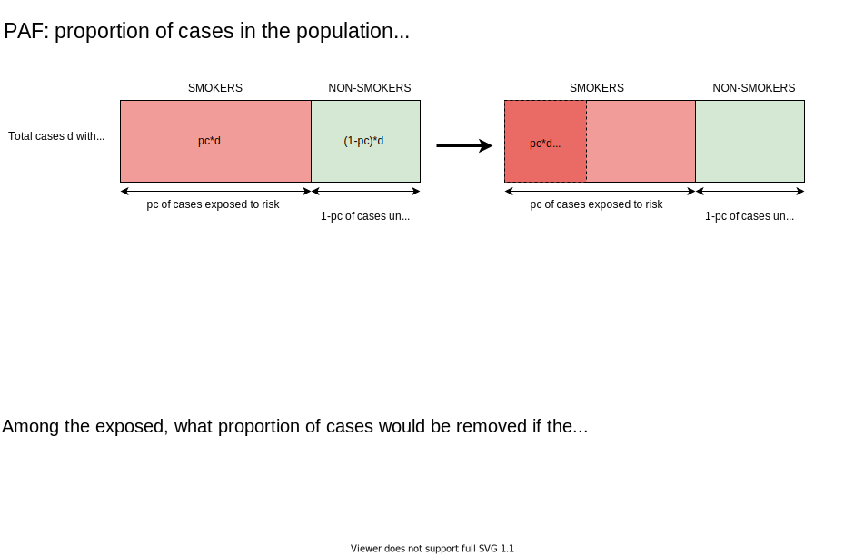

.. role:: underline
    :class: underline

.. _measures_of_risk:

================================
Measures of risk in epidemiology
================================

The purpose of this page is to provide reference material on measures of occurrence, effect, and impact and their definitions. These measures are used in modeling :ref:`causes <models_cause>` and :ref:`risk effects <models_risk_effect>` in vivarium. The information on this page is not a comprehensive source on these topics and may be supplemented with general epidemiology references such as textbooks, [Measure_of_effect]_, etc.

.. contents::
	:local:

Measures of occurrence
^^^^^^^^^^^^^^^^^^^^^^^

This is a recap: Epidemiology is the study of the distribution and determinants of disease frequency in human populations. Simply put, it is the study of the *occurrence* of illness. Measures of disease frequency are tools to describe how common an illness is (or outcome of an event) with reference to the size of the population at risk. They are used to count cases, in relation to a population and to a measure of time. Outcomes can be infection, disease, disability, death, other risk-exposures, recovery or usage of health care.

There are two main measures of disease occurrence/frequency: **prevalence** and **incidence**. Incidence quantifies the occurrence of new cases of disease whereas prevalence, a measure of status rather than newly occurring disease, quantifies existing cases. New cases are called **incident cases** and existing cases are called **prevalent cases**.

.. todo::

  link to the other doc on incidence and prevalence? how do we thin this down?

  :ref:`prevalence and incidence <models_cause>`

Example:

  * Measure of incidence: 124.2 out of 100,000 women developed breast cancer in the USA in 2016.
  * Measure of incidence: A study of 3000 children in selected rural areas of Ethiopia looked at the levels of disease and death caused by diarrhoea. It found 4 deaths of diarrhoea per 1,000 children per year. The same study found 360 episodes of diarrhoea per 100 children per year.
  * Measure of prevalence: 20.7% of women attending antenatal care at rural clinics Siaya county, western Kenya were HIV positive in 2015

Prevalence
^^^^^^^^^^
Prevalence focuses on existing states. Prevalence of a state (such as the 'with condition state') at a point in time may be defined as the proportion of a population in that state at that time; thus prevalence is the proportion of persons in a defined population that have the outcome under study in a defined period of time. Prevalence is a proportion and has no time units. However, the point in time to which it refers must always be specified. The term ‘prevalence rate’ is often wrongly used instead of ‘prevalence’. Prevalence is, by definition, a proportion not a rate.

*Point prevalence* is the number of current cases (new and pre-existing) at a defined instant in time. The denominator is the population at the same defined instant in time. This measure is called point prevalence because it refers to a single point in time. It is often referred to simply as prevalence.

Examples:

    * the percentage of people with schistosomiasis parasites in the blood in a village in Kenya in a survey on 12th  December 2019
    * the proportion of people who have diabetes in China today
    * The proportion of the population experiencing a diarrhoea day (3 or more loose or liquid stools per day) at the time of interest, e.g. the day of a surveillance visit or the day before.

+------------------------+-----------------------------------------------+
|   Measure              | Math                                          |
+------------------------+-----------------------------------------------+
| Point prevalence       |:math:`\frac{\text{number of current cases in  |
|                        |a defined population at a point in time}}      |
|                        |{\text{number of people in the defined         |
|                        |population at the same time point}}`           |
+------------------------+-----------------------------------------------+

*Period prevalence* is the proportion of persons in the population who have the disease (new and pre-existing cases) over a defined period of time. The denominator is the average or mid-period population. This measure is used when the condition is recurrent and non-fatal.

Examples:

    * The proportion of women who have used oral contraceptives at any time during the 12-month period preceding the day of the survey.
    * The proportion of the population experiencing at least 1 day with diarrhoea over a pre-defined time window (recall period) prior to a given point in time, e.g. a surveillance visit by the study team.

+------------------------+-----------------------------------------------+
|   Measure              | Math                                          |
+------------------------+-----------------------------------------------+
| Period prevalence      |:math:`\frac{\text{number of current cases in  |
|                        |a defined population at over a period of time}}|
|                        |{\text{average or mid-period population}}`     |
+------------------------+-----------------------------------------------+

Because of these dynamic changes, the magnitude of the prevalence varies from one point in time to another as illustrated by the following diagram:

    .. image:: prevalence_diagram.svg

.. note::

    In our vivarium models, we estimate the **period prevalence** of condition as

            :math:`\frac{\text{person-time in with-condition state}}{\text{total person time for age, sex, location, year}}`

The *prevalence pool* is the subset of the population who is in the given state (such as the 'with-condition state'). A person who dies from the state is removed from the prevalence pool: death decreases prevalence. People can also exit the prevalence pool by recovering from the state (remission) or emigrating from the population. Diseases with high incidence rates may have low prevalence if they are rapidly fatal or quickly cured. Conversely, diseases with low incidence rates may have substantial prevalence if they are nonfatal but incurable.

.. note::

    Prevalence is seldom of direct interest in etiological applications of epidemiological research because it reflects both incidence rate and duration of disease. However, for congenital diseases, prevalence is the measure usually employed. This the birth prevalence. The incidence of the condition that causes the congenital condition would have occurred in the pregnant mother, which only becomes apparent when the baby is born.

Incidence
^^^^^^^^^
The number of cases of a condition present in a population at a point in time depends not only on the frequency with which new cases occur and are identified, but also on the average duration of the condition (i.e.remission, mortality). As a consequence, prevalence may vary from one population to another solely because of variations in duration of the condition. Prevalence is therefore not the most useful measure when attempting to establish and quantify the determinants of disease; for this purpose, a measurement of the flow of new cases arising from the population is more informative. Incidence focuses on new cases. There are three main measures of incidence: **risk**, **rate**, and **odds**.

Risk
****

**Incidence risk**, also called *incidence proportion*, *attack rate*, or *cumulative incidence* is the probability of occurrence of disease among a disease free, at risk, population during a specified time period. It is the number of new cases of disease during a defined period of time divided by the population at the start of the time period. Like any proportion, risk has no time units but the time period to which it applies must be specified, otherwise it is not interpretable. The survival proportion is 1 minus incidence proportion.

+------------------------+-----------------------------------------------+
|   Measure              | Math                                          |
+------------------------+-----------------------------------------------+
|| Incidence risk        |:math:`\frac{\text{new cases of disease during |
|| Incidence proportion  |time period}}{\text{disease free, at risk,     |
|| Attack rate           |population at the start of the time period}}`  |
|| Cumulative incidence  |                                               |
+------------------------+-----------------------------------------------+

Example:

  * A group of 5000 healthy women aged 45–75 years was identified at the beginning of 1981 and followed up for five years. During this period, 20 new cases of breast cancer were  detected. Hence, the risk of developing breast cancer in this population during this five-year period was 20/5000 = 0.4%.
  * A total of 13 264 lung cancer cases in males were diagnosed in a certain population in 1971. These cases were followed up for five years. At the end of this follow-up period, only 472 cases were still alive. The probability of surviving during this five-year period was 472/13 264 = 3.6%. Thus, the probability of dying during the period was 100% – 3.6% = 96.4%.

In the second example, the measures are risks, as they represent the proportion of lung cancer cases who were still alive (or who died) at the end of the follow-up period out of all cases diagnosed at the beginning of the study. These calculations assume that all individuals were followed up for the entire five-year period (or until death if it occurred earlier). These measures are often called survival and fatality ‘rates’; this is incorrect as, by definition, they are proportions. Risk is a measure commonly used to quantify the survival experience of a group of subjects.

Odds
****

Another measure of disease occurrence or frequency is odds of disease, which is the ratio of the total number of cases to the total number of persons who remained disease free over the study period.

+------------------------+-----------------------------------------------+
|   Measure              | Math                                          |
+------------------------+-----------------------------------------------+
|  Incidence odds        |:math:`\frac{\text{new cases of disease during |
|                        |time period}}{\text{people who remained disease|
|                        |-free during the time period}}`                |
|                        +-----------------------------------------------+
|                        |can be derived to become :math:`\frac{\text    |
|                        |{risk}}{\text{1-risk}}`                        |
+------------------------+-----------------------------------------------+

.. note::
  Risk and odds of disease use the same numerator (number of new cases) but different denominators. In the calculation of risk, the denominator is the total number of disease-free individuals at the beginning of the study period, whereas when calculating the odds of disease, it is the number of individuals who remained disease-free at the end of the period.

Rate
****

**Incidence rate** has the same numerator as incidence risk, that is the appearance of new cases. In contrast to risks, which relate the number of new cases to the size of the population at risk in the beginning of the period studied, rates relate the number of new cases to the person-time (Y) at risk, a measure that takes into account changes in the size of the population at risk during the follow-up period. The rate takes into account the fact that some people who start at risk do not remain at risk during the whole period, because they develop the disease, or die, or leave the population by migrating, refusing to continue to participate in the study etc. Others may join the population at risk after the beginning of the period, through birth, migration into the area, recruitment into the study, etc. The denominator in a rate (Y) is thus the sum of the time each person in the study population remained at risk during the study period. This is called the person-time experience at risk, and is expressed in units of person-time: person-years at risk, person-days at risk, baby-weeks at risk etc.

For rare diseases, risk and rates are numerically similar.

.. todo::

  example of how this is so

+------------------------+-----------------------------------------------+
|   Measure              | Math                                          |
+------------------------+-----------------------------------------------+
| | Incidence rate       |:math:`\frac{\text{new cases of disease during |
| | Incidence density    |time period}}{\text{total person-time at       |
| | Force of morbidity or|risk during time period}}`                     |
| | mortality            |                                               |
+------------------------+-----------------------------------------------+

.. todo::

   James says: give example and how the time period needs to be specified.
   Has this been addressed in the examples?

Relationship between rate and risk
**********************************

Risk depends on both the incidence rate and on the duration of the at-risk period. In vivarium, we apply the incidence rate to each simulant at each time step to estimate the risk of developing disease where the duration of the period is the duration of the time-step:

    Risk = :math:`1 – e^\text{( –incidence rate × duration of the period at risk)}`

For disease that have a low incidence rate or when the period at risk is short, the following approximation can be used:

    Risk = incidence rate × duration of the period at risk.

Example:

  * The incidence rate of a particular condition in a population is 50 per 100 000 person-years. The risk for an individual in this population of developing this condition during a five-year period (assuming no other causes of death) is given by

      - 5-year risk = :math:`1 – e^\text{( –0.0005 per person-year × 5 years)}` = 0.25%
        | The simplified equation can yield the same result
      - 5-year risk=0.0005 per person-year X 5 years = 0.25%
  * Consider now a common condition with an incidence rate of 300 per 1000 person-years

      - 5-year risk = :math:`1 – e^\text{( –0.3 per person-year × 5 years)}` = 78%
        | The simplified equation does not yield the same result
      - 5-year risk = 0.3 per person-year X 5 years = 150%

Measures of effect
^^^^^^^^^^^^^^^^^^

Measures of effect are used to compare the frequency of outcome between specified populations. When one population group is exposed to a risk factor and the other is not, measures of effect can be used to study associations between frequency of disease and the risk factor. They reflect the increase or decrease in frequency of disease in one population in comparison with another. Frequency measures (e.g. risks, rates) can be compared by estimating their *ratios* or *differences*.

Ratio measures
**************
Ratio measures estimate how many times more common a disease is in one population compared with another; they provide a measure of the *magnitude* of the effect of a risk factor on incidence of disease. The effect of the risk factor can be also be measured on cause-specific mortality, or all cause-mortality.

It is possible to compare any type of measure of frequency (e.g. risks, rates) between two populations. For example, the rate ratio (RR) compares the rate of disease between two groups. Similarly, the risk ratio and the odds ratio (OR) compare risks and odds between two groups respectively. For rare diseases, risks and rates tend to be numerically similar, so rate ratios and risk ratios tend also to be numerically very similar. The term ‘relative risk’ is often used to mean either the rate ratio or risk ratio (or sometimes even the odds ratio). However, it is always better to be specific about which ratio measure you are using, to avoid confusion.

In GBD, relatives risks are usually ratio of incidence rates of causes in those exposed vs unexposed to the risk factor. However, there are exceptions as in the low birth rate short gestation (LBWSG) risk factor where the relative risks are ratios of all-cause mortality rates. It is best practice to always check with the risk appendix or the GBD modeller what the relative risks refer to each risk-outcome pair.

.. todo::

      write down numerator and denominator. Has this been adequately addressed with the equations written out below?

For example (hypothetical- cite my brain), a study was conducted to measure the effect of vitamin A food fortification on incidence of measles in children under 5. GBD defines risk factors to be malignant. Hence, the exposed group (exposed to poor nutrition) are those who are not covered by food fortification while those unexposed are covered by food fortification. The table below shows the results:

+----------+----------+--------------+-----------------+
|          | Incident | Person-years | Rate per 100,000|
|          | cases    | at risk      | person-years    |
+----------+----------+--------------+-----------------+
|Exposed   |     2    |  2000        |     100         |
+----------+----------+--------------+-----------------+
|Unexposed |     1    |  2500        |     40          |
+----------+----------+--------------+-----------------+

| :math:`rate_{1}` is the rate disease in the exposed group (no fortified foods)
| :math:`rate_{0}` is the rate of disease in the unexposed group (with fortified foods)
| The **rate ratio** is thus :math:`\frac{rate_1}{rate_0} = \frac{100}{40} = 2.5`

This is interpreted as: 'children who do not eat foods fortified by vitamin A food are 2.5 times more likely to get measles than children who eat vitamin A enriched foods'.

Alternatively, we can compute the risk ratio for a disease as follows:

+----------------+---------+----------+----------+
|                | Exposed |Unexposed | Total    |
+----------------+---------+----------+----------+
|With disease    |  a      |  b       | a+b      |
+----------------+---------+----------+----------+
|Without disease |  c      |  d       | c+d      |
+----------------+---------+----------+----------+
|                | a+c     | b+d      | a+b+d+c  |
+----------------+---------+----------+----------+

| :math:`risk_{1}` is the risk of having disease in the exposed: :math:`\frac{a}{a+c}`
| :math:`risk_{0}` is the risk of having disease in the unexposed: :math:`\frac{b}{b+d}`
| The **risk ratio** is thus :math:`\frac{risk_1}{risk_0} = \frac{a/(a+c)}{b/(b+d)}`

This is interpreted as: 'there are X times more cases of measles among children who do not eat vitamin A fortified foods than those who eat vitamin A fortified foods'

We might need to use the odds ratio to measure effect of an exposure on rare diseases using a case-control design. Because the disease is rare, we will need to follow a lot of people for a long time before we see an incident cases. It would be easier to actively find the rare cases and then look at whether they have been exposed or not.

If we want to compute the odds ratio:

| :math:`odds_{1}` is the odds of disease in the exposed: :math:`\frac{a}{c} = \frac{risk_1}{1-risk_1}`
| :math:`odds_{0}` is the odds of disease in the unexposed: :math:`\frac{b}{d} = \frac{risk_0}{(1-risk_0)}`
| The **odds ratio** is thus: :math:`\frac{ad}{bc} = \frac{risk_1/(1-risk_1)}{risk_0/(1-risk_0)}`

If the disease is rare and not recurrent, then the risk ratio, the rate ratio and the odds ratio are numerically similar. Odds ratios are often derived from case-control studies in which people with and without the outcome of interest are compared for their exposure. Depending on how the controls were sampled the odds ratio in a case control study can be equivalent to the risk of rate ratios that would have been obtained if the whole population had been studied.

.. todo::

  give example how they are similar
  DISCUSS CASE-CONTROL STUDIES- should we do another section on study designs?

To summarize, relative risks can be:

  1. Risk ratio: probability of disease in exposed/probability of disease in unexposed
  2. Rate ratio: incidence rate of disease in exposed/ incidence rate of disease in unexposed
  3. Odds ratio: odds of disease in exposed/odds of disease in unexposed

  If the relative risk is >1, the exposure is harmful. If the relative risk is <1, the exposure is protective. In GBD, we define risks as harmful and so we always use >1 relative risks.

Difference measures
*******************

Difference measures are used to estimate the *excess* risk of disease caused by a risk factor *among the exposed group*. That is, difference measures of effect estimate how much of the
disease in the exposed group was due to the risk factor of interest. Two commonly used difference measures of effect are the risk difference and the risk difference percent.

*Risk difference* (RD) is the absolute difference between two risks. This is calculated by subtracting the risk in the unexposed group :math:`risk_{0}` from the risk in the exposed group :math:`risk_{1}`:

    Risk difference (RD) = risk in exposed :math:`risk_{1}` - risk in unexposed :math:`risk_{0}`

Similarly, the rate difference is calculated by subtracting the rate in the unexposed from the rate in the exposed.

Example:

  A study measured the risk of HIV infection among children born to HIV-infected mothers,according to whether the babies were breastfed or not. Among non-breastfed children of HIV infected mothers, the risk of HIV infection was 150 infections per 1000 children. Among breastfed babies, the risk was 280 infections per 1000 children. The risk difference was thus 130 infections per 1000 children (130 = 280 - 150). The interpretation is that the risk factor, in this case breastfeeding, was responsible for the infection of 130 of every 1000 children born to, and breastfed by, HIV-infected mothers. Notice that the risk difference retains the same units as the original risks used to calculate it. Thus, if the risk in the exposed and unexposed groups is measured in ‘cases per 1000 persons’, then the risk difference will have the same units.

In most situations, where disease is not very common, risk differences and rate differences will be numerically similar. (Note that in the above example, HIV infection was common among study participants, so risk and rate differences would be unlikely to be similar.) In the literature, the risk difference is sometimes called the *attributable risk* or *excess risk*. Similarly, the terms attributable rate or excess rate are sometimes used to mean the rate difference.

The *risk difference percent* (RD%) measures the proportion of cases in the exposed group that are due to the exposure. That is, the RD% is the excess risk among the exposed expressed as a proportion (or percentage) of the risk in the exposed group. It is calculated by dividing the risk difference by the risk among the exposed:

    Risk difference % = :math:`\frac{risk_1-risk_0}{risk_1}`

For example, the RD% from the above example is :math:`\frac{(280/1000) - (150/1000)}{280/1000} = 0.46` or 46%

We interpret this by saying breastfeeding was responsible for 46% of HIV infections among children born to, and breastfed by, HIV-infected mothers (the exposed). Note that this does not mean that breastfeeding is responsible for 46% of HIV infections among children born to HIV-infected mothers. Measures of effect tell us only about the additional risk of disease among exposed individuals (here, children of HIV-infected mothers who were breastfed) compared with unexposed individuals. In order to estimate how important breastfeeding is as a risk factor for HIV in the target population (here, children born to HIV-infected mothers), we would also need to have information on how common the risk factor is in the population (i.e., what proportion of children born to HIV-infected mothers are breastfed), see next section. The RD% is sometimes also called the *attributable fraction in the exposed*, or the *aetiologic fraction in the exposed*.

Ratios versus differences: which is more appropriate?
*****************************************************

Ratio measures and difference measures tell us very different things. Ratio measures are used to summarise the strength of association between a risk factor and an outcome. Difference measures, on the other hand, are used to summarise how much more disease is experienced by a group exposed to a risk factor of interest compared to an unexposed group. Assuming that the association between risk factor and disease is causal, difference measures can be used to estimate how much of a disease among the exposed can be attributed to exposure, or could be prevented by eliminating the risk factor. Note these measures only relate to the exposed group.

Difference measures relating to the whole population tend to be more useful and thus more widely used. These population difference measures, also called measures of impact. It is important to realise that ratios and differences can result in very different interpretations. For example, if an association between a risk factor and disease outcome is very strong in a particular group (high relative risks), but the outcome is relatively uncommon in this group, a big increase in risk will result in a modest increase in cases. Alternatively, if the outcome is common among a group, a small relative risk can lead to a large increase in cases. Ratio measures are most useful for determining which risk factors are most strongly associated with disease, whereas difference measures are more useful for estimating the public health importance of different risk factors.

.. _measures_of_impact:

Measures of impact
^^^^^^^^^^^^^^^^^^

Measures of population impact estimate the expected health impact on a population *if* the distribution of risk factors that cause disease in that population were changed or removed. Measures of impact take into account both the **strength of the effect** and the **distribution of the risk factor in the population**.
Measures of impact assume that we have established a *causal* effect of the exposure on the outcome. Population impact estimates measure how much of the disease in the population is caused by the suspected risk factor.

The population attributable fraction (PAF) is one measure of population impact, and is the one reported by GBD.
Intuitively, it is the *proportion* of the disease in the population that is caused by the risk factor.
It equals (O − E)/O, where O and E refer to the observed number of cases and the expected number of cases under a minimum exposure level, respectively.

As an example, in early 1950, using the Doll and Hill case-control study of smoking and lung cancer deaths throughout England and Wales,
Doll derived O = 11189 (observed number of cases in a population distributed with smokers and non-smokers)
and E = 1875 (expected number of cases in a population of non-smokers).
Therefore the smoking PAF for lung cancer deaths was (11189 − 1875)/11189 = 83%.
That is, 83% of lung cancer deaths were caused by smoking; if no one had smoked, there would have been 83% fewer lung cancer deaths.

The choice of the minimum exposure level is arbitrary, and the PAF is sensitive to this choice.
In GBD, a theoretical minimum risk exposure level (TMREL, see TMREL section) is used.

It is important to remember that measures of population impact are **specific to the population studied**, and can **only be generalised to populations with exactly the same distribution of risk factors**. Also note that risk factors that have strong effects but which are rare, like being exposed to an X-ray in pregnancy and leukaemia in childhood, may have a large measure of effect but small measure of impact.

The PAF is not the only measure of population impact; another measure common in epidemiological studies, the population attributable risk (PAR),
is discussed first here.

Population attributable risk (PAR)
**********************************

Example 2x2 risk table:

+----------------+--------------+--------------+---------------------+
|                | Exposed      | Unexposed     | Total              |
+----------------+--------------+--------------+---------------------+
|With disease    |  a           |  c           | a+c                 |
+----------------+--------------+--------------+---------------------+
|Without disease |  b           |  d           | b+d                 |
+----------------+--------------+--------------+---------------------+
|Total           | a+b          | c+d          | a+b+d+c             |
+----------------+--------------+--------------+---------------------+
|Risk            | r1 = a/(a+b) | r0 = c/(c+d) | r = (a+c)/(a+b+c+d) |
+----------------+--------------+--------------+---------------------+

The PAR is the absolute difference between the risk/rate in the whole population (r) and the risk/rate in the unexposed group (r0).

Population attributable risk (PAR) is calculated as

  PAR = r - r0
  Relative risk RR = r1/r0

  *Note* that the risk difference (RD) in the earlier section contrasts the rate/risk in the exposed group (r1) and the rate/risk in the unexposed group (r0 = r1-r0).

If we know the risks among the exposed (r1) and unexposed (r0), and the prevalence of exposure in the population ( :math:`p_p` )

.. math:: PAR = p_p (r1-r0)

where

.. math:: p_p = \frac{a+b}{a+b+c+d}

.. code-block:: Python

  The prevalence of exposure in the population is

  It can be shown that

  PAR = r - r0
      = (a+c)/(a+b+c+d) - c/(c+d)
      = (ad-bc)/[(a+b+c+d)(c+d)]

  PAR =  .. math:: p_p (r1-r0)
      = (a+b)/(a+b+c+d) x [(a/(a+b) - c/(c+d)]
      = (ad-bc)/[(a+b+c+d)(c+d)]

Population attributable risk fraction (PAF)
*******************************************

The population attributable fraction is a quantification of the proportion of a given cause outcome, such as cases, deaths, or DALYs, that could be eliminated by removing a risk exposure. It is the proportion of all cases in the whole study population (exposed and unexposed) that may be attributed to the exposure, assuming a causal association. The population attributable risk fraction (PAF) is estimated by dividing the population attributable risk by the risk in the total population (r).

   PAF = PAR/r

       = (r - r0) / r

When only the risk ratio (RR) and the **prevalence of exposure in the population** are known, PAF can also be written as:

.. math:: \text{PAF}=\frac{p_p(RR-1)}{1+p_p(RR-1)} ...(a)

Note that the PAF increases with the rate ratio θ, but also with the prevalence of exposure p. It will therefore vary between populations, depending on how common the
exposure is.

It is important to note the PAF in equation (a) will give us an accurate representation of the porportion of cases occuring in the total population that would be avoided if the exposure were removed only if the assumptions that 1) the observed association between exposure and disease is causal, and that 2) it is free from confounding and bias.

.. todo::

  I'm wondering if it is it possible to illustrate this using DAGs? or visually? I'll have a think

Although equation (a) is the best-known formula for the PAF and the one used in GBD PAF calculations, there is an alternative formulation which can be useful when we wish to take account of confounders and joint effects

If you know the **prevalence of exposure among cases** (:math:`p_c`) there is a very useful formula for PAF which can be used with risk or rate ratios that have been adjusted for confounding:

.. math:: \text{PAF}=\frac{p_c(RR_{adj}-1)}{RR_{adj}} ...(b)

The following diagram illustrates how the PAF is derived intuitively from the **prevalence of exposure among cases** (:math:`p_c`)

However, it is not always possible to find the *prevalence of exposure among cases* (:math:`p_c`) and so equation (a) is often used, introducing bias. The following section talks about the bias that occurs.

Bias in PAF Calculation
***********************

The PAF can be calculated using the following formula:

.. math::
  :label: exposed_cases_paf_eq

  \text{PAF}=\frac{p_c(RR_{adj}-1)}{RR_{adj}}

In which we define :math:`p_c` to be the proportion of cases (individuals who
possess the outcome of interest) that are exposed, and :math:`RR_{adj}` has been adjusted for confounding and effect modification.

There is the a second PAF equation, which can be used *in the absence of
confounding or effect modification:*

.. math:: \text{PAF}=\frac{p_p(RR_{cr}-1)}{1+p_p(RR_{cr}-1)} =\frac{p_p(RR_{adj}-1)}{1+p_p(RR_{adj}-1)}
  :label: exposed_population_paf_eq

Note that here, the crude relative risk :math:`(RR_{cr})` is equivalent to the adjusted :math:`(RR_{adj})`. We define :math:`p_p` to be the proportion of the entire
population that is exposed.

This is typically easier to conceptualize if we break the population down as
follows:

.. list-table:: Exposure x Cases
  :widths: 1 1 1
  :header-rows: 1
  :stub-columns: 1
  :align: center

  * -
    - Cases
    - Non-cases
  * - Exposed
    - a
    - b
  * - Unexposed
    - c
    - d

Observe that the above table is a full partition of our population. We can see
then that the proportion of cases that are exposed is given by:

..  math:: p_c=\frac{a}{a+c}

And the proportion of the entire population that is exposed is given by:

.. math:: p_p = \frac{a+b}{a+b+c+d}

It can be shown that when the fraction of cases in the unexposed times the
relative risk :math:`\left( \frac{c}{c+d} \cdot RR_{adj} \right)` equals the fraction
of cases in the exposed :math:`\left( \frac{a}{a+b} \right)`, i.e., when there
are no confounders or effect modifiers, equation :eq:`exposed_cases_paf_eq` equals equation :eq:`exposed_population_paf_eq`.

However, when :math:`\frac{c}{c+d} \cdot RR_{adj} \neq \frac{a}{a+b}`,
equation :eq:`exposed_cases_paf_eq` does *not* equal equation :eq:`exposed_population_paf_eq`. Intuitively, we can imagine
a confounder that is positively associated with
our exposure, holding all else constant. Then there will be a
disproportionately high number of cases among the exposed, and
:math:`\frac{c}{c+d} \cdot RR_{adj} < \frac{a}{a+b}`.

This can be solved via weighting equation :eq:`exposed_population_paf_eq` per stratum of our confounder or
effect modifier, yielding equation :eq:`stratified_paf_eq`:

.. math:: \text{PAF} = \sum_{i=1}^z W_i \frac{p_i(RR_i-1)}{1+p_i(RR_i-1)}
  :label: stratified_paf_eq

Here, for each stratum :math:`i` of our confounder or effect modifier,
:math:`p_i` is the proportion of the stratum that is exposed, :math:`W_i` is
the proportion of the cases in the stratum, and :math:`RR_i` is the
stratum-specific adjusted *RR*. Note that in the case of a confounder,
:math:`RR_{i}` will be equal across strata, and in the case of effect
modification, there will be a different :math:`RR_{i}` per stratum. More
information on confounding and effect modification can be found
in the section on :ref:`causal relationships<causal_relationships>`.

While we know equation :eq:`exposed_population_paf_eq` to be biased, we have had to use it in Vivarium
modeling due to insufficient data for use of equation :eq:`exposed_population_paf_eq` or :eq:`stratified_paf_eq`.

The following is a high-level summary of a the paper *Confounding and Bias in the
Attributable Fraction* by [Darrow]_, which examines the direction and
magnitude of this bias for different scenarios. This was achieved by generating synthetic
data with varying degrees of exposure prevalence, confounding, relative
risk for the disease (or cause), and prevalence of the confounder in the exposed
and unexposed groups. These scenarios were all examined for one dichotomous
confounder; however, Darrow then showed these results generalize to two
dichotomous confounders.

We consider PAF bias primarily in terms of the following ratio:

.. math:: \frac{\text{biased PAF}}{\text{unbiased PAF}}

Where the biased PAF is calculated using equation :eq:`exposed_population_paf_eq`, and the unbiased PAF is
calculated using equation :eq:`stratified_paf_eq`.

Direction
+++++++++

The direction of this bias was found to be fully determined by the confounding
risk ratio:

..  math:: \frac{RR_{crude}}{RR_{adj}}

Here, :math:`RR_{adj}` is the Mantel-Haensel adjusted RR. A positive *counfouding RR* (:math:`>1.0`) resulted in a negative
PAF bias, and a negative *confounding RR* (:math:`<1.0`) resulted in a positive
PAF bias.

Furthermore, the direction of the *confounding RR* is fully determined by :eq:`exposed_cases_paf_eq` the
direction of the association between the confounder and the exposure, and :eq:`exposed_population_paf_eq`
the direction of the association between the confounder and disease (or cause).

This relationship is captured as follows:

.. list-table:: Direction of Bias in the PAF
  :widths: 4 4 3 3
  :header-rows: 1

  * - Confounder-exp \n assoc.
    - Confounder-cond'n assoc.
    - Confouding ratio
    - PAF bias
  * - :math:`+`
    - :math:`+`
    - :math:`>1.0` :math:`(+)`
    - :math:`-`
  * - :math:`-`
    - :math:`-`
    - :math:`>1.0` :math:`(+)`
    - :math:`-`
  * - :math:`-`
    - :math:`+`
    - :math:`<1.0` :math:`(-)`
    - :math:`+`
  * - :math:`+`
    - :math:`-`
    - :math:`<1.0` :math:`(-)`
    - :math:`+`

Magnitude
+++++++++

The magnitude of the PAF bias was shown to **increase** with:

  - lower exposure prevalence

  - smaller :math:`RR_{adj}` for the disease (or cause)

  - magnitude of the *confounding RR*

The first two factors are intuitive: observe that in our measure of bias,
:math:`\frac{\text{biased PAF}}{\text{unbiased PAF}}`, a smaller exposure
prevalence will lead to a smaller true PAF in the denominator, amplifying the
bias. Similarly, a smaller :math:`RR_{adj}` will also result in a smaller true PAF, again
amplifing the bias.

However, when examining the absolute difference between the biased and unbiased
PAFs, note that Darrow did not find that lower exposure prevalence necessarily
caused a larger *absolute* PAF bias.

For the *confounding RR*, we note that by "magnitude" we mean distance from
*confounding RR* =1. That is, as a *confouding RR* <1 decreases, it causes an
increased **overestimation** of the PAF, and as a *confounding RR*>1 increases,
it causes an increased **underestimation** of the PAF.

Darrow states that the amount of bias under most realistic scenarios is on the
order of 10%-20%. Note that this percentage describes the percentage difference
between the biased and unbiased PAF. That is, if the true PAF is 50%, and the
biased PAF is 40%, we characterize this as a 20% negative bias.

Below we include graphs from the paper illustrating PAF bias as a function of
exposure prevalence and RR.

    .. image:: darrow_confounding_figures.jpg

Other sources of bias
+++++++++++++++++++++

Darrow concludes by noting that the PAF is highly sensitive to the relative
risk, exposure prevalence, and distribution of confounders. Thus when relative
risk and exposure prevalence data is collected from published papers, if one
tries to apply these measures to a target population with different population
characteristics and without sufficient data to correctly calculate the PAF, the
bias caused by the differing distributions between the study and target
populations can result in vastly more bias than that of using the wrong PAF
equation.

Estimation of the PAF in epidemiological studies
************************************************

.. todo::

  detail this section more and give modified PAF for each study design

Cohort studies: Simplest situation, since disease rates in exposed and unexposed can be measured directly
Cross-sectional studies: Prevalence of a disease state is measured, rather than its incidence.
Unmatched case-control studies: Ratio of two proportions, given independent samples
Matched case-control studies: Can use alternative equation in this case, providing the cases can be regarded as a representative sample of all cases.
Exposure with multiple levels: Estimate the proportion of cases attributable to each level of exposure, the proportion of cases that would be avoided if the rate of disease in each exposure group were reduced to that in the unexposed (or baseline) group.
There are some caveats to the cohort studies estimation of PAF, if exposed and unexposed cohorts have been sampled separately for the study. A separate estimate of p or p’ will be required.

In cross-sectional studies, this is also known as the proportion of prevalent cases in the population. There are some potential issues this type of study of interpreting prevalence rather than incidence cases. If an exposure is associated with increased prevalence of disease, it could be because the exposure increases the risk of developing the disease, or because it increases the amount of time a person has the disease, or even because it increases survival from the disease.

This use of PAF is recommended for chronic disease states.

References
^^^^^^^^^^

.. [Measure_of_effect] Measures of Effect: Relative Risks, Odds Ratios, Risk Difference, and 'Number Needed to Treat'
   Retrived 19 March 2020.
   https://pubmed.ncbi.nlm.nih.gov/17653136/

.. [Darrow] Confounding and bias in the attributable fraction, Jan 2011
  https://www.ncbi.nlm.nih.gov/pubmed/20975564