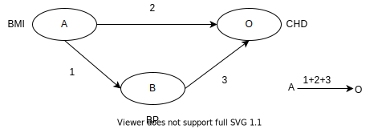
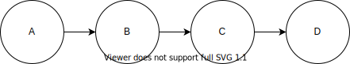
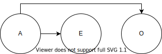
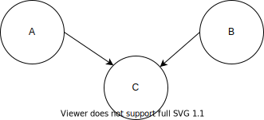
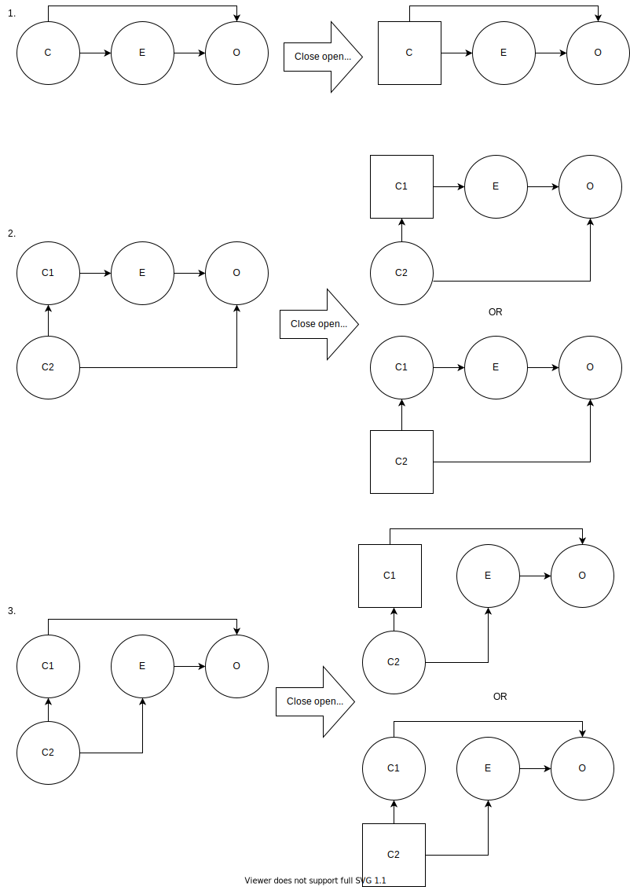
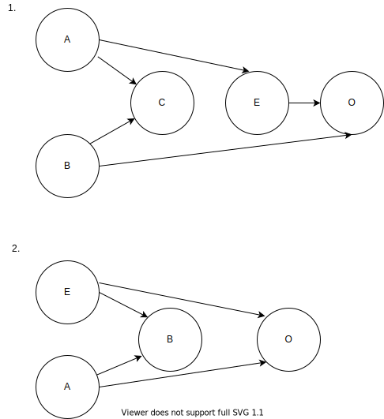

.. role:: underline
    :class: underline

..
  Section title decorators for this document:
  ==============
  Document Title
  ==============
  Section Level 1
  ---------------
  Section Level 2
  +++++++++++++++
  Section Level 3
  ~~~~~~~~~~~~~~~
  Section Level 4
  ^^^^^^^^^^^^^^^
  Section Level 5
  '''''''''''''''
  The depth of each section level is determined by the order in which each
  decorator is encountered below. If you need an even deeper section level, just
  choose a new decorator symbol from the list here:
  https://docutils.sourceforge.io/docs/ref/rst/restructuredtext.html#sections
  And then add it to the list of decorators above.

.. _general_research:

===============================================================
General Epidemiology Research Considerations and Best Practices
===============================================================

The purpose of this page is to document information that is relevant to conducting research on the simulation science team as it relates to Vivarium simulation model design. This page contains information that does not directly apply to Vivarium models, but is useful to understand the factors that affect the design behind them. This page is arranged in no particular order and topics can be added as they are encountered. The sections may be filled in as simulation science team members investigate the issues in their own projects and can include text from or links to existing documents that may address the topic.

.. contents::
	:local:

.. _causal_relationships:

Causal Relationships
--------------------

In this context, causal relationships imply that there is a direct cause and 
effect relationship between two traits (generally an exposure and an outcome). 
Notably, we hope to differentiate *causal* relationships (which have a direct 
cause and effect relationship) from *correlated* relationships (which have a 
relationship, but it may be driven by something other than a direct cause and 
effect). As it turns out, distinguishing between correlation and causation can 
be quite a challenging task and many fields, including epidemiology, are 
devoted to the process of *causal inference,* or drawing a conclusion about a 
causal relationship based on the available evidence.

A term that is often used in causal inference is the **counterfactual**. The 
counterfactual refers to an alternate reality in which only a single variable 
has changed and all else has remained exactly the same. 

  For instance, suppose you've finished work and you're trying to determine 
  how to get down to the international district for dinner. You go to your 
  maps application and ask **What is the quickest route to my destination?** 
  It tells you that based on the current time, weather, day of the week, road 
  work conditions, etc. that you should take the light rail.

  So you leave the office, walk a few blocks to the westlake station, and 
  catch the train. Two stops in, your train gets stopped behind a broken down 
  bus. You decide to get off the train and walk the remaining distance. 
  Arriving ten minutes late to dinner, you think to yourself **Would I have 
  arrived on time if I took the bus instead?**

As illustrated here, by definition the counterfactual question is impossible 
to *directly* answer because it is a purely hypothetical question without 
direct supporting evidence; we can only use what we know to make a *guess* at 
what might have happened in the counterfactual scenario. Consider the 
following example:

  Say that we wanted to evaluate the causal realtionship between 
  smoking and lung cancer. Hypothetically, we could compare lung cancer rates 
  between 1954 when smoking was at its peak in the US and 2020 when smoking 
  rates in the US are lower. However, you can quickly imagine additional 
  differences between 1954 and 2020 US that may also impact the rates of lung 
  cancer, such as differences in air pollution due to automobiles and the rise 
  of electronic cigarettes. 

  Therefore, while the comparison between 1954 and 2020 US may be interesting 
  and useful, it is not a true counterfactual comparison. Instead, a 
  counterfactual scenario could be conceptualized as "what would the lung 
  cancer rate in the US be in 1954 *if no one smoked* and **all else was equal**?" 
  Then, we could evaluate the independent effect of smoking on lung cancer
  without interference from any other factors. 

  However, we cannot wave a magic wand and explore the lung cancer rate in 
  this alternative universe in 1954 to answer this question. Luckily, there 
  are several methods in the field of epidemiology that attempt to answer 
  conterfactual questions regarding causal relationships through randomized 
  controlled trials and other types of studies. 

One way in which causal inference is performed for a particular relationship 
between an exposure and outcome is assessment based on the Bradford Hill 
criteria for causation. The Bradford Hill criteria are a group of principles 
that may be used in evaluating the epidemiologic evidence of a causal 
relationship such that the more criteria that are satisfied, the more likely 
it is that a causal relationship exists. The criteria are listed below:

  - **Strength/Effect Size:** The larger the association, the more likely 
    that it is causal.
  - **Consistency/Reproducibility:** Consistent findings observed by different 
    people in different places increase the likelihood of causality.
  - **Specificity:** The more specific the association between a cause and an 
    effect, the more likely that it is causal.
  - **Temporality:** The effect **must** occur *after* the cause.
  - **Biological Gradient/Dose-Response Relationship:** Greater exposure should 
    generally lead to greater observed effect.
  - **Plausibility:** A plausible mechanism between cause and effect is helpful 
    (although limited by current knowledge).
  - **Coherence:** Coherence between epidemiological and laboratory findings 
    increases the likelihood of a causality.
  - **Experiment:** Experimental evidence between the cause and effect generally 
    supports a causal relationship.
  - **Analogy:** Analogies or similarities between the observed associations and 
    other associations exist generally support a causal relationship.
  - **Reversibility:** If the cause is deleted, the effect should also disappear.

A particularly relevant criterion listed above is **temporality**, which 
declares that in order for a relationship to be causal, the cause or exposure 
must occur *before* the effect or outcome chronologically. When this criterion 
is not satisfied, there is a risk for **reverse causalility**, in which the 
causal relationship occurs in the opposite direction as expected.

While these criteria are a useful guide for assessing whether there is 
sufficient evidence to conclude that a relationship is causal, there are 
several concepts that should be considered when thinking about causality 
between an  exposure and an outcome. Relationships that complicate our 
understanding of causality, including confounding, intermediates, effect 
modification, and mediation are discussed in the following subsections.

Notably, in the following sections, solid arrows are used to depict causal 
relationships directionally between a cause/exposure and effect/outcome. 

Confounding
+++++++++++

**What is confounding?**

**Confounding occurs when an estimate of the association between an exposure and a health outcome is mixed together with the effect of another exposure on the same health outcome, and the two exposures are associated**. The presence of a confounding exposure biases the estimate of the effect of the exposure of interest on the health outcome. 

The bias can be negative (resulting in underestimation of the exposure effect), or positive (overestimation of the exposure effect), or can even reverse the apparent direction of effect. Confounding should always be addressed when assessing causality and failure to account for confounding leads to incorrectly concluding that an effect or its magnitude is due to one, rather than another variable. 

In order for a factor to be a confounder (C), it must meet the following criteria:

  1. Must be a risk factor, or a surrogate measure of the risk factor, for the outcome (O) of interest in those who are unexposed to the exposure (E) being investigated.
  2. Must be correlated, positively or negatively, with the exposure (E). If the study population is stratified into exposed and unexposed groups, this means that (C) has a differential distribution in the two groups.
  3. In addition, (C) should not be an intermediate step on the causal pathway between the exposure (E) and outcome (O) being investigated. If this is the case, (C) may in fact be an :ref:`intermediate <intermediates>` or a :ref:`mediator <mediator>` . In other words, the exposure (E) should not cause the confounder (C).

.. note::

  Criteria 2 says that the confounder needs to be correlated to the exposure. `This means they can either be simply correlated, or they can have a causal relationship <https://www.theanalysisfactor.com/what-is-a-confounding-variable/>`__. If causal, the direction of the causal relationship has to be from the confounder (C) to the exposure (E) and not the other way round as noted in criteria 3. 

.. image:: confounding_triangle.svg

.. todo::
  we should also note how we will apply our knowledge of confounding in our models. like, when do we need to be careful of confounders? like only when we interpret our effect sizes from the literature? What about GBDs assumptions of confounding? Do all gbd models (the RRs for the risk cause-models) have assumptions of causal, with no confounding?

**An example**:
Imagine that you are interested in knowing whether smoking (our risk factor of interest) influences the risk of coronary heart disease (CHD) in men aged 18 to 64 years. You conduct a cohort study with an exposed group of male smokers in this age group from the general population, and compare their risk of CHD after a number of years to that of an unexposed group of non-smoking males in the same age group. You would expect to find a higher incidence of CHD among smokers. However, males who smoke are also likely to have a higher alcohol intake, which also increases the risk of CHD. Thus, the effect that you observe for the smoking-CHD association is **mixed-up/confounded by/confused with** with the effect of the association between alcohol intake and CHD. Without taking account of differences in alcohol intake between smokers and non-smokers, the magnitude of the smoking-CHD association estimated from the study may be higher than the **true** value, leading to incorrect conclusions.

The criteria for alcohol to be a confounding factor for the smoking-CHD relationship is met because:

  1. Alcohol intake is a risk factor for CHD in non-smokers. In other words the relationship between alcohol and CHD is not dependent on smoking status.  
  2. Smokers generally have a higher alcohol intake (in most populations). 
  3. Finally, alcohol intake is not on the causal pathway between smoking and CHD (smoking does not in itself cause people to drink more alcohol). 

.. image:: smoking_triangle.svg

Note that the dotted line between smoking and alcohol indicates that we do not expect a 'causal' link between the smoking and alcohol. Rather, it indicates that the two are associated in the population.

**How to identify confounding?**

We look for confounding by stratifying (splitting) the data according to the proposed confounding factor and then examining the measures of effect of the exposure on the outcome in the different strata separately. If the stratum-specific measures of effect are similar to each other, but different from the crude measure of effect, this is evidence for confounding. We can now consider a numerical example to demonstrate how you can look for confounding in data from an epidemiological study.

**An example**:
A report was published that made the novel claim that coffee consumption is associated with risk of cancer of the pancreas. Here, the exposure (E) is coffee consumption and the outcome (O) is cancer of the pancreas. The importance of this finding was disputed because it was pointed out that coffee consumption is associated with cigarette smoking, and smoking is known to be a risk factor for cancer of the pancreas. Thus, smoking may be confounding (C) the association between coffee consumption and risk of cancer of the pancreas.

(Smoking is a credible alternative explanation for the reported association between coffee and pancreatic cancer. While there are many other things that are associated with coffee drinking, for any of these things to provide a credible alternative explanation for the coffee-cancer relationship, they would have to be associated with cancer risk indepedent of coffee drinking [criteria 1].)

Suppose that the association between coffee consumption and pancreatic cancer was detected in a case-control study, where the basic data was as follows:

+---------+---------------+-----------------------+
|         | Drinks coffee | Does not drink coffee | 
+=========+===============+=======================+
| Cases   |      450      |          300          | 
+---------+---------------+-----------------------+
| Control |      200      |          250          |
+---------+---------------+-----------------------+
  
From this data, it seems that the odds of coffee consumption among cases (450/300 = 1.5) is higher than that among controls (200/250 = 0.8), giving an odds ratio of 1.9.

Suppose we now look at the association between coffee consumption and pancreatic cancer separately for smokers and non-smokers. This is known as stratification. 

The table below shows the data on coffee consumption and disease status for smokers and non-smokers (or stratified by smoking status):

+----------+---------------------------------------+---------------------------------------+
|          | Smokers                               | Non-smokers                           |
+==========+===============+=======================+===============+=======================+
|          | Drinks coffee | Does not drink coffee | Drinks coffee | Does not drink coffee |
+----------+---------------+-----------------------+---------------+-----------------------+
| Cases    |      400      |          200          |       50      |          100          |
+----------+---------------+-----------------------+---------------+-----------------------+
| Control  |      100      |          50           |      100      |          200          |
+----------+---------------+-----------------------+---------------+-----------------------+
|Odds ratio| (400/200)÷(100/50) = 1.0              | (50/100)÷(100/200) = 1.0              |
+----------+---------------------------------------+---------------------------------------+

If smoking had no influence on the association between coffee consumption and pancreatic cancer, then we would expect that the odds ratio would still be about 1.9, both in smokers and non-smokers. In fact, in our example, the odds ratio for both smokers and non-smokers is 1.0. In other words, after stratifying by smoking status, there appears to be no evidence of an association between coffee consumption and pancreatic cancer. The results support the suggestion that smoking confounded the association between coffee and risk of cancer of the pancreas. The statistical association between coffee drinking and cancer is still valid, but the explanation for this association is that it is largely due to unequal distribution of smoking behaviour among people who do, and do not, drink coffee.

Why should this be? We mentioned earlier that, in order for a factor to be a confounder, it must be associated with the risk factor under investigation. In our example, we can investigate whether this is true by examining the data from *controls*, since the distribution of all exposures in the control group should reflect the distribution of exposures in the population from which the cases originated. 

The table below shows the association between the exposure (E), coffee consumption, and the confounder (C), smoking, *among the controls* [criteria 2]:

+------------+---------------+-----------------------+
|            | Drinks coffee | Does not drink coffee | 
+============+===============+=======================+
|Smokers     | 100 (**50%**) |       50 (**20%**)    |  
+------------+---------------+-----------------------+
|Non-smokers |   100 (50%)   |       200 (80%)       |
+------------+---------------+-----------------------+
|Total       |  200 (100%)   |      250 (100%)       |
+------------+---------------+-----------------------+

We can see that, among coffee drinkers, 1 in 2 (50%) are smokers, whereas among those who do not drink coffee, only 1 in 5 (20%) are smokers. This observation satisfies the first criterion for a confounding factor, that it must be associated with the risk factor under investigation. The coffee drinkers and non-coffee drinkers are not comparable (similar) in their drinking habits. (* Note: In a cohort study, we could look at this association by constructing a similar table, but replacing the number of controls in each cell with the number of person-years at risk (or the number of persons at the start of follow-up if we are conducting an analysis of risks rather than rates)).

We also mentioned above that, for a factor to be a confounder, it should be a risk factor for the outcome and that this relationship is not dependent on exposure status [criteria 1]. In our example, we can confirm this by looking at the association between smoking and pancreatic cancer separately for those who drink coffee and those who do not:

+----------+---------------------------+---------------------------+
|          | Drinks coffee             | Does not drink coffee     |
+==========+=============+=============+=============+=============+
|          | Smoker      | Non-smoker  | Smokers     | Non-smokers |
+----------+-------------+-------------+-------------+-------------+
| Cases    |      400    |    50       |   200       |     100     |
+----------+-------------+-------------+-------------+-------------+
| Control  |      100    |    100      |   50        |     200     |
+----------+-------------+-------------+-------------+-------------+
|Odds ratio| (400/50)÷(100/100) = 8.0  | (200/100)÷(50/200) = 8.0  |
+----------+---------------------------+---------------------------+

The odds of pancreatic cancer are 8 times higher among individuals who smoke than among individuals who do not smoke regardless of whether or not they drink coffee. This then satisfies the first criterion that the factor must be a risk factor for the disease in those unexposed.

Finally, we can be confident that smoking is not on the causal pathway between coffee drinking and pancreatic cancer, so the third criterion for being a confounder is satisfied.

It should now be clearer why smoking acts as a confounder in the association between coffee consumption and pancreatic cancer. Smoking is itself a risk factor for pancreatic cancer, and smoking is also differentially distributed between those who drink and not drink coffee. Thus, when we first looked at the overall association between coffee consumption and pancreatic cancer, the effect of coffee consumption was **mixed up** with the effect of smoking (because there are proportionately more smokers among those who drink coffee than among those who do not). But once we accounted for smoking by looking at the data separately for smokers and non-smokers, it became clear that there is, in fact, no evidence for an association between coffee and pancreatic cancer.

Having established that smoking appears to confound the association between coffee consumption and pancreatic cancer, the final step is to combine, or pool, the data across strata of smoking to obtain a combined, or pooled, estimate of the effect of coffee consumption on pancreatic cancer adjusted for the confounding effect of smoking. This pooled estimate is an average of the effect across all strata of smoking weighted by the size of each stratum. There are statistical methods for obtaining such pooled estimates (e.g. Mantel-Haenszel, regression). There are a number of strategies to minimise or deal with confounding, both when designing a study and in the analysis phase.

.. note::

  as you can see, there is no real effect of coffee on cancer - coffee does NOT cause cancer! *PHEWWW- we can caffeine away!* This example showed that the purported relationship between coffee and cancer was in fact *spurious*. It was all because of smoking, smoking was the real culprit (isnt it always?)! It got 'mixed-up' with coffee cuz more coffee drinkers smoke so it made it *seem* like drinking coffee is a risk factor for smoking. 

  In vivarium, we should not have the need to be involved with proving causality. But we do need to make an assessment of whether the reported effect sizes we use from the literature are true estimates or they could be biased due to residual confounding that has not been fully addessed.    

.. todo::
  What we should look for re: confounding when assessing effect sizes

Intermediates
+++++++++++++

An intermediate variable as discussed in this section is defined as a variable 
between an exposure and outcome in a sequential causal chain, as demonstrated 
in the diagram below:

.. image:: basic_int_diagram.svg

An Example of an Uncomplicated Intermediate
~~~~~~~~~~~~~~~~~~~~~~~~~~~~~~~~~~~~~~~~~~~

A (simplified) example that can demonstrate such a causal pathway is the 
relationship between the exposure of cigarette smoking, which causes the intermediate variable of accumulated tar in lungs, which in 
turn causes lung cancer (note: for the purposes of this 
example, assume that there is no direct causal relationship between cigarette 
smoking and lung cancer other than through the intermediate variable of 
accumulated tar in lungs).

.. image:: smoking_intermediate_example.svg

Now, let's say that we plan to enact an advertising campaign to reduce smoking 
in hopes of reducing population lung cancer rates. Our expected causal pathway 
would look like this:

.. image:: smoking_intervention_example.svg

Therefore, as we increase intervention coverage (assuming the intervention is effective), we would expect a decrease in 
population lung cancer rates, as these two variables are located on the same 
causal pathway. 

An Example of a Complicated Intermediate
~~~~~~~~~~~~~~~~~~~~~~~~~~~~~~~~~~~~~~~~

Now, let's imagine that a brand new hypothetical medication was just 
created that dissolves tar in lungs that accumulates due to smoking and is now 
widely used in some areas. Our causal diagram would now look like this:

.. image:: medication_example.svg

Quickly, we can now see that the relationship we previously knew between 
smoking and lung cancer is now impacted by the use of this hypothetical 
medication that affects the intermediate variable between smoking and lung 
cancer. Therefore, we can only expect lung cancer rates to decrease *by 
the expected amount as a result of our marketing intervention* in areas 
that do not widely use this medication.

Notably, intermediate variables may be relevant in situations in which the 
variable located most proximal to the outcome in the causal pathway is 
difficult to measure. For instance, measuring the amount of tar in a person's 
lungs is an invasive procedure; measuring the amount of cigarettes a person 
smokes is much easier in comparison. Therefore, data availability may dictate 
that we model cigarette smoking rather than lung tar. Such variables are often 
referred to as **proxy variables** (variables that are not directly relevant, 
but serve in place of an unobservable or immeasurable relevant variable).

  Using cigarette smoking as a proxy variable for lung tar may be a reasonable 
  approach given that there is no interference on the intermediate variable of 
  lung tar by another exogenous variable (i.e. the medication). However, if 
  there *is* interference on the intermediate variable in the relationship 
  between the exposure and outcome (i.e. significant use of the medication), 
  then the previously measured relationship between smoking and lung cancer 
  will not apply to this population in the same way.

Now, let's say that some time has gone by and now this medication has become 
quite common. A new study measured the relationship between smoking and lung 
cancer in a study population in which 50% of smokers used the medication. Now, 
let's say that we are interested in using the data from that study on the 
relationship between smoking and lung cancer in a simulation for a different 
location. However, in the location we wish to model, the medication is not 
approved at a national level and therefore use of the medication is close to 
zero. However, since we know that the relationship between smoking and lung 
cancer as we've defined it in this example is affected by the use of this 
medication, applying the data from this new study to this model location would 
be inappropriate. Rather, we should use data that measured the relationship 
between smoking and lung cancer in a study population with a similar exposure 
to the exogenous variable (medication) on the intermediate variable.

Additional Considerations
~~~~~~~~~~~~~~~~~~~~~~~~~

Another example of when an intermediate variable might interfere with the 
relationship between an exposure and outcome is when a given intervention 
*decreases* the prevalence of an intermediate variable (that is related to an 
outcome), but the prevalence of that intermediate variable in a specific 
location is already zero and therefore cannot be decreased any further. The 
opposite example of an intervention that *increases* the prevalence of an 
intermediate variable that is already 100% prevalent also holds true.

	For instance, imagine the example of folic acid supplementation 
	(exposure), which *decreases* folic acid deficiency (intermediate), which
	causes neural tube birth defects (outcome). Notably, neural tube birth 
	defects are also caused through other causal pathways such as maternal diabetes. 
	Given that the causal pathway from folic acid fortification-->folic acid deficiency-->neural tube defects is true, we would expect an increase in 
	exposure to folic acid supplementation to decrease neural tube defects. 
	However, the maximum effect of increasing exposure to folic acid 
	supplementation is dependent on the prevalence of the intermediary, folic acid deficiency, in 
	the population. Notably, if folic acid deficiency is zero,
	increasing folic acid supplementation exposure will have no effect on neural tube defects (there is no folic acid deficiency in the population!).  We will need to act on other exposures to reduce neural tube defects in this population, assuming there are other causal pathways for neural tube defects (eg. maternal diabetes) 

The impact of interference by intermediate variables between a given exposure 
and outcome should be carefully considered when designing simulation models. 
Particularly, special consideration should be given to how a relationship 
between an exposure and outcome may differ in various populations based on the 
differing levels of the intermediate variables.

Notably, when the exact mechanism that drives the effect of an exposure on an 
outcome is not well understood, it is possible that there may be *unknown* or 
*unmeasured* intermediate variables on the causal pathway between the exposure 
and outcome. In this case, it is important to carefully consider the 
*generalizability* of data sources that measure the relationship between the 
exposure and outcome to the model population to which it will be applied; or 
in other words, consider key similarities and differences between between the 
study and model populations that may or may not cause the study data to 
accurately reflect the situation in the model population. Additionally, 
limitations of the model should be noted when appropriate.

Effect Modification
+++++++++++++++++++

A factor :math:`M` is said to be an effect modifier if the effect of the 
exposure :math:`E` on disease :math:`D` varies for different values of 
:math:`M`. Effect modification is sometimes also called *interaction*. We 
illustrate this relationship below.

.. figure:: effect_mod_arrow_diagram.svg
  :align: center

If :math:`M` is some dichotomous effect modifier, then :math:`B\neq C`, and :math:`A` does not encompass the entire picture of how :math:`E` acts on :math:`O`. Rather, :math:`A` was calculated from some population; for the sake of example, let's say that :math:`M=1` in :math:`\frac{1}{10}` of this population. Then we see that :math:`A` is tells us about the effect of :math:`E` on a new population if and only if the new population also has the same prevalence of :math:`M`. If we wish to understand how :math:`E` operates in some population where :math:`M` is prevalent in :math:`\frac{1}{3}` of the population, then we would need to know :math:`B` and :math:`C`.

Observe this is in direct contrast to confounding, in which the exposure and 
confounding factor *must not depend on one another* to determine the risk.

We note that effect modification is a statistical phenomenon which may or may 
not reflect a biological phenomenon. However, in the case of epidemiological 
modeling, following the Bradford-Hill criteria of *plausibility*, we would hope 
to be able to explain the effect modification when implementing an effect 
modifier in a model.

Consider asbestos dust as an exposure for lung cancer. Say that in a cohort 
study, we find the following:

.. list-table:: Death rate per 100,000py: asbestos exposure alone
  :widths: 10 10
  :header-rows: 0
  :stub-columns: 1

  * - No Asbestos exposure
    - 66.95
  * - Asbestos exposure
    - 470.85

We might now conclude that the effect of asbestos on lung cancer has a rate 
ratio for :math:`470.85/66.95\approx 7.0`. However, when we stratify by 
smoking, we find the following:

.. list-table:: Death rates per 100,000py: asbestos exposure stratified by smoking status
  :widths: 10 10 10
  :header-rows: 1
  :stub-columns: 1

  * - 
    - Non smokers
    - Smokers 
  * - No Asbestos exposure
    - 11.3
    - 122.6
  * - Asbestos exposure
    - 40.1
    - 901.6

This shows us that the rate ratios for the effect of asbestos on lung cancer 
vary according to smoking status: the rate ratio is :math:`40.1/11.3\approx 3.5` 
for non-smokers and :math:`901.6/122.6\approx 7.3` for smokers.

.. todo:: add citation to Nicole's textbook. Graphs below were reproduced from http://osctr.ouhsc.edu/sites/default/files/2020-02/Module8PartVNotes.pdf

We include below a graphical representation of a risk outcome stratified by sex, and by age. On the y-axis we have incidence of some outcome such as high blood pressure, and on the x-axis we have an exposure such as obesity.

.. todo::
   Format citations.

.. image:: without_em_illustration.svg
  :width: 400

Observe that the difference in incidence of high blood pressure, between people from Town A versus Town B, is not *modified* by the exposure status. Thus the incidence ratio between exposed and unexposed groups, within this population, is not modified by town of residence.

.. figure:: with_em_illustration.svg
  :width: 400

Here, we see that the risk attributable to our exposure is higher in our older group than in our younger group; thus age is an effect modifier for this risk outcome.

Finally, we emphasize that when dealing with a confounding variable, in order to best understand the effects of our exposure, we seek to *remove* the influence of the confounder. By contrast, if variable B is an effect modifier for exposure A, then this interaction is an important property of the relationship between A and B, and their influence on the disease. Rather than remove, we thus try to *capture and describe* effect modification in the greatest detail possible. (Cite Nicole's textbook)

**Effect modification in GBD**

GBD models estimate globally, and almost all of GBD's relative risks are used universally across location, sex, age, and time. This means that GBD generally assumes that the study populations from which they calculate their relative risks are applicable universally, without adjustments for the different sexes, locations, or other potential effect modifiers. When using GBD risk factors in a Vivarium model, it is thus important to know what studies GBD used for their relative risk calculation. From these studies it is necessary to consider:

  - what the prevalence of various effect modifiers in these populations might have been

  - if we believe these are similar enough to the populations we are modeling to use GBD effect sizes

In the case that GBD effect sizes are *not* generalizeable and we are unable to find studies that supply relative risks and effect sizes stratified by the appropriate effect modifiers, it is also necessary to state the uncertainty that will derive from this lack of information.

Mediation
+++++++++

**Definition**:
Mediation analysis aims to disentangle the effect of an independent variable on an dependent variable explained (indirect effect) or 
unexplained (direct effect) by a given set of mediators. Rather than a direct causal relationship between the 
independent variable and the dependent variable, a mediating variable improves understanding the relationship between the independent and dependent variables.
The independent variable influences the mediating variable, which in turn influences the dependent variables. 

Generic Depiction: 

.. image:: risk_factors_mediation_diagram.svg

Example: 

**Direct versus indirect effects**:
In the example diagram shown above, the indirect effect is the product of path coefficients "1" and "3". 
The direct effect is the coefficient "2". The direct effect measures the extent to which the dependent variable 
changes when the independent variable increases by one unit and the mediator variable remains unaltered.
In contrast, the indirect effect measures the extent to which the dependent variable changes when the independent variable 
is held fixed and the mediator variable changes by the amount it would have changed had the independent variable increased by one unit.
In linear systems, the total effect is equal to the sum of the direct and indirect (2 + 1*3 in the model above). 
In nonlinear models, the total effect is not generally equal to the sum of the direct and indirect effects, but to a modified combination of the two.

**Multiple risk factors**: non-independent risk case (aka: mediation). If MF is mediation factor if Risk 2 through Risk 1
for a given cause
 .. math:: RR_2 = (RR_2 - 1)(1 - MF_{2/1}) + 1
Generalized for multiple pathways of R1 through other RFs
 .. math:: RR_i = (RR_i - 1)(1 - \prod_{j = 1}^n (1 - MF_{i/j})) + 1
This adjusted or non-mediated RR is then used to calculate a non-mediated PAF, with which we can assume independence across risk 
factors when aggregating

Here is `GBD mediator template <https://hub.ihme.washington.edu/display/gbd2017/Mediator+Template>`_ which belongs to GBD/risk factors causal criteria section

Causal Inference in the Global Burden of Disease Study
++++++++++++++++++++++++++++++++++++++++++++++++++++++

Notably, GBD researchers use an evidence scoring system that is based off of a 
subset of the Bradford Hill Criteria to evaluate the quality of evidence 
regarding causal relationships between risk-outcome pairs in GBD. 
Specifically, before computing the relative risks for a GBD risk factor, GBD 
researchers evaluate the *risk of bias* among individual studies that 
investigate the relationship between a risk-outcome pair. Then, GBD 
researchers additionally evaluate the strength (as a direct result of the 
relative risk curve they compute), consistency (through evaluating between 
study heterogeneity), and dose-response (through the shape of the relative 
risk curve) for the computed relative risks for a given risk factor. Using 
these criteria, GBD researchers create a quantitive quality of evidence score 
for each risk-outcome pair in GBD.

.. note::

	The formal evidence scoring system is planned to be used in GBD 2020 and 
	was not used in this systematic way for previous GBD rounds.

	Additional, this evaluation of the epidemiological evidence to support a 
	causal relationship between a risk-outcome pair is part of a large process 
	that GBD uses to select risk-outcome pairs to model, which includes an 
	evaluation of the importance of the risk factor to the outcome, data 
	availability, and generalizability.

Specifically, GBD researchers evaluate the risk of bias within individual 
studies based on the following characteristics:

1) Representativeness of the study population

2) Exposure measurement

  a) Individual versus population

  b) Objective versus self-report

  c) Multiple prospective versus baseline prospective versus retrospective

3) Outcome measurement

  a) Death certificatie/physician diagnosis/medical records versus self-report

  b) Blind outcome assessment versus not

4) Reverse causation: low, medium, high

5) Control for confounding 

  a) Randomized controlled trial

  b) Age, sex, tobacco, income, education, other critical determinants for a specific outcome not on the causal pathway

  c) Age, sex, tobacco, other critical determininants for a specific outcome not on the causal pathway

  d) Age, sex

6) Selection bias

  a) High follow-up (95%), not opportunity for selection

  b) Moderate follow-up (85-95%), limited opportunity for selection

  c) Low follow-up (<85%), considerable opportunity for selection

Parameters related to evidence quality are then accounted for in the assessment
of the relationship of the risk-outcome pair through MR-BRT analyses.

.. note::

  This information was obtained from a science seminar presented by Ryan 
  Barber and Chris Murray on March 11, 2020; a recording is available `here <https://hub.ihme.washington.edu/display/GBD2020/GBD+Science+Seminar+series>`_. Documentation for GBD's evidence scoring system is available `here <https://hub.ihme.washington.edu/display/GBD2020/Evidence+score>`_.

Biases in Epidemiology Studies
++++++++++++++++++++++++++++++

.. todo::

	Intro

Selection Bias
~~~~~~~~~~~~~~

.. todo::

	This section

Confounding Bias
~~~~~~~~~~~~~~~~

.. todo::

	This section

Information/Measurement Bias
~~~~~~~~~~~~~~~~~~~~~~~~~~~~

.. todo::

	This section

Others
~~~~~~

.. todo::

	This section

Generalizability
++++++++++++++++

.. todo::

	This section

Epidemiology Study Designs
--------------------------

In **randomized experimental studies**, the process of randomising individuals (or groups) to different exposures generally ensures that the different groups are equally balanced with respect to all relevant factors that might influence the risk of the outcome. In such randomised studies, 'exposure' usually refers to a treatment or other intervention that is being compared to another, or to no intervention. Randomisation ensures that every treatment group has a similar risk of the outcome at the beginning of the study. Provided the study is conducted rigorously and is sufficiently large, if we see a difference in the incidence of the outcome between treatment groups at the end of the study, then we can conclude that this difference is caused by the treatment. For this reason, experimental studies provide the strongest evidence of a causal association between an exposure and disease.

In **observational studies**, however, it is rarely possible for individuals to be randomly assigned to an exposure. Often, individuals who share a particular risk factor have other characteristics in common that influence their risk of disease. Individuals who do not share this particular risk factor may also differ in other important ways that influence their risk of disease. So we cannot be sure that those with and without the risk factor of interest (exposed and unexposed individuals) are similar, or comparable, with respect to all other relevant factors. This makes it difficult to determine if the association we observe between disease and our risk factor of interest is real, or whether it is influenced by other factors.

Intervention Studies
++++++++++++++++++++

Randomized Controlled Trials
~~~~~~~~~~~~~~~~~~~~~~~~~~~~

Randomized Controlled Trials (RCTs) are a type of epidemiologic study design 
in which researchers randomly divide a study population into two or more 
groups and experimentally expose one (or more) of those group to a given 
exposure(s) while the remaining group serves as a control population. The goal 
of RCTs is to measure the potential causal relationship between a given 
exposure (or intervention) and a given outcome or outcomes without the 
influence of counfounding variables and they require exposures that can be 
experimentally administered to study subjects in an ethical manner.

Randomization is a critical aspect of RCTs. The goal behind randomizing study 
subjects to exposure groups is to ensure that any potential confounders, both 
known and unknown, between the exposure and outcome are evenly distributed 
between groups; in other words, to eliminate any association between the 
confounder and the exposure (a necessary condition for Confounding_). When 
equal distribution of confounding variables across exposure groups is achieved 
via randomization, **there will be no bias due to confounding in the 
measurement of the association between the exposure and outcome.** This means 
that there is no need to identify and control for potential confounding 
variables when conducting RCTs and makes **RCTs the gold standard study design 
for measuring causal relationships.** 

RCTs are longitudinal in nature in that study subjects are tracked over time 
following administration of the exposure or treatment. Selection of study 
participants are required to be at-risk for the outcome (note that the outcome 
may be *remission* from a condition, requiring study subjects to be infected 
at study enrollment).

Of note, another type of RCTs is a *cluster* randomized trial. In cluster 
randomized trials, *groups* of study subjects are treated as the unit for 
randomization rather than individual study subjects. Example: An elementary 
school with 20 classrooms randomizes 10 classrooms to a standard recess length 
(unexposed) group and 10 classrooms to an increased recess length (exposed) 
group. Student test scores are measured as the outcome of interest. Cluster 
randomized trials require additional analytic protocols and may require larger 
sample sizes than non-cluster RCTs, but otherwise are similar to RCTs with 
regard to their strengths and limitations.

Other sub-types of RCTs include *non-inferiority*, *equivalence*, and 
*superiority* trials. At a high level, the aim of non-inferiority trials is to 
prove that a given exposure is *not worse than* the comparative exposure; the 
aim of an equivalence trial is to prove that a given exposure is *as good as* 
the comparative exposure; and the aim of a superiority trial is to prove that 
a given exposure is *better than* the comparative exposure. While the overall 
design of these trials will be similar, they differ with respect to their 
*null hypotheses* and therefore will have different appropriate statistical 
analytic protocols. Notably equivalence trials will use two-sided statistical 
tests, whereas non-inferiority and superiority trials will use one-sided 
statistical tests. See `here <https://pubmed.ncbi.nlm.nih.gov/18537788/>`_ 
for more reading. 

Potential Biases
^^^^^^^^^^^^^^^^

Although randomization minimizes the potential for confounding bias, it may 
still occur if randomization of study subjects to exposure groups does not 
achieve equal distribution of confounding variables across groups. This may 
occur due to random chance and is more likely to occur when the study size is 
small. For this reason, RCTs generally report the distribution of demographic 
and other variables across exposure groups to evaluate if randomization 
achieved reasonably equal distributions.

Another source of potential bias in RCTs arises from lack of blinding of 
exposure groups. For instance, if a study subject was aware that they were 
assigned to take a status quo version of a drug rather than a new formulation 
of a drug, they may be less likely to comply with the treatment algorithm than 
a study subject who knew they were taking the new formulation. Further, study 
administrators may differentially treat patients in either the experimental or 
control groups, which could differentially affect outcomes. For this reason, 
**single-blinded** (blinding of exposure groups to study subjects OR study 
administrators), or more preferentially **double-blinded** (blinding of 
exposure groups to study subjects AND study administrators) RCTs are less 
subject to bias than non-blinded RCTs. The **placebo effect** (or lack 
thereof) is an example of a phenomenon that can bias study results when study 
subjects are not blinded to their treatment group. See 
`here <https://www.ncbi.nlm.nih.gov/pmc/articles/PMC2947122/>`_ for more 
reading. 

Another concern with RCTs is the degree to which they can be generalized to 
the general population. RCTs often have strict inclusion criteria 
(requirements for study subject eligibility), which may make the study 
population of RCTs non-representative of the general population of interest. 
For instance, if an RCT that recruited healthy study subjects finds that a 
treatment is safe and effective in its study population, it does *not* mean 
that the treatment is also safe and effective for use in populations with 
significant comorbidities, which may have the potential for significant
`Effect Modification`_. Further, it is possible that the administration of the 
treatment in a formal and controlled RCT setting may differ from typical 
administration of the treatment in the real world. Therefore, a treatment that 
has proven effective in an RCT setting may not be as effective in the real 
world due to issues related to compliance, sub-par administration, etc. 

Attrition bias is an additional concern in RCTs that may arise when study 
subjects drop out of the study at differential rates by treatment group. This 
may occur in situations in which one treatment group is experiencing worse 
symptoms than others.

Ethical Concerns
^^^^^^^^^^^^^^^^

Because study administrators must intentionally expose study subjects to the 
experimental exposure in RCTs, it is an ethical requirement that RCTs are only 
used for exposures that are reasonably believed to be beneficial and not 
harmful to study subjects. For this reason, measures of effect that come from 
RCTs are generally protective measures (relative risks less than one).

Additionally, it is also an ethical requirement that study administrators may 
not withhold treatments that are known to be beneficial from study subjects. 
Therefore, in situations in which a new treatment is being investigated but a 
status-quo treatment already exists, the control group in an RCT must be 
administered the status-quo treatment instead of placebo. 

Non-Randomized Controlled Trials
~~~~~~~~~~~~~~~~~~~~~~~~~~~~~~~~

As discussed above, *randomization* to exposure groups is a critical aspect of 
randomized controlled trials that controls for the influence of confounding. 
However, experimental studies may still be conducted in the absence of 
randomization. These studies are often referred to as non-randomized 
controlled trials (NRCTs). NRCTs can be used in situations in which individual 
study subjects' needs and/or preferences are given priority in treatment group 
assignment. While NRCTs are very similar to RCTs, because study subjects are 
not randomly assigned to exposure groups in NRCTs, they are subject to 
confounding bias and must be analyzed with this in mind.

Controlled Before and After Studies
~~~~~~~~~~~~~~~~~~~~~~~~~~~~~~~~~~~

Controlled before and after studies are a type of intervention study that 
assesses a study population at a baseline measurement in time, delivers some 
type of intervention or exposure to that study population, and then 
re-assesses the study population at a later time point. In these studies, the 
unexposed and exposed groups are the same study subjects, just before 
(unexposed) and after (exposed) the administration of an intervention. 

While the unexposed group and exposed group are hypothetically the same in 
controlled before and after studies, potential for bias due to differences 
between these groups arise if the time between baseline and follow-up 
measurements is long (potential for significant differences in the population 
to arise due to factors other than the intervention) and if there is high loss 
to follow up of study subjects between the baseline and follow-up 
measurements. Loss to follow up of study subjects is a concern especially when 
it occurs differentially by a potential confounding variable (for instance, 
when more females drop out than males between baseline and follow-up 
measurements). Additionally, generalizability is an important consideration 
with this type of study design. 

Notably, controlled before and after studies are typically used in the context 
of administering a policy change or other type of large scale intervention to 
a population; for example, assessing population level vitamin A deficiency 
prevalence before and after implementation of a vitamin A fortification 
initiative. In these cases, the exposed and unexposed groups do not 
necessarily need to be the same individual study subjects, but rather could be 
a sample of the population at different time points. 

Intent to Treat Versus As-Treated Analytic Protocols
~~~~~~~~~~~~~~~~~~~~~~~~~~~~~~~~~~~~~~~~~~~~~~~~~~~~

There are two analytical protocols in experimental studies that have 
significant implications for how to interpret the results and potential 
biases: intent to treat (ITT) and as-treated. Intent to treat analytic 
protocols considers each study subject in their assigned exposure group as 
exposed, regardless of whether they fully complied with the treatment 
protocol. In this case, the measured treatment effect from the study may be 
less effective than if all study subjects were 100% compliant with the 
treatment protocol, but bias will be avoided.

On the other hand, the as-treated analytic protocol allows for censoring or 
reclassification of exposure status of study subjects based on their treatment 
protocol compliance. While the as-treated analytic protocol may allow for 
measurement of treatment effect specific to a certain level of treatment 
protocol compliance, it may introduce bias into the study by nullifying 
exposure group randomization if treatment compliance is associated with any 
possible known or unknown confounding variables. Therefore, if an RCT is 
analyzed via an as-treated analytic protocol, control for confounding 
variables may be necessary to to avoid confounding bias. 

Cohort Studies
++++++++++++++

Overview
~~~~~~~~

Cohort studies can tell us about the relationship between an exposure and an 
outcome. For an exposure of interest, we might consider :math:`k` exposure levels. 
Groups of study subjects are selected for each exposure level, and then
folloewd for a predetermined period of time, after which the outcome is measured 
in each exposure group.

The :math:`k` exposure levels can be :math:`k=2`, with exposed and unexposed (or drug A and drug B), or :math:`k=5`, with several levels of exposure. For :math:`k>2`, 
which we call a **polytomous** exposure, note these exposures can be ordered or 
unordered. For example, if the strata represent different ranges of pack-years of 
cigarettes, more pack-years will put subjects at a strictly higher risk for lung 
cancer. However, if the different exposures are different occupations, the 
strata won't necessarily be ordered.

Cohort studies are particularly useful for when interested in:

  - Rare exposures. Note that this is because we are selecting study groups by exposure status, allowing us to seek out the (potentially rare) exposure, and then wait to see how outcomes develop in each group. This is in contrast to case control studies, in which study groups are selected for their outcomes. Case control studies are thus better for rare outcomes, and can pose accuracy issues for rare exposures.

  - Multiple outcomes for one exposure. For example, we could look at people who exercise in differing amounts per week, and then look at blood pressure, BMI, and depression in the subjects as three different outcomes.

Cohort studies also have the advantage of the exposure being measured 
before incidence of the outcome, helping to mitigate bias arising from 
the outcome(s).

The main disadvantages of cohort studies are:

  - Bias is introduced when subjects are lost to follow-up over the course of the study. This could be through moving away, dying, or other factors. When the exposure of interest has stronger correlation with a factor that causes loss to follow-up, the bias increases.

  - Cohort studies are expensive and take time.

Note that with a longer latency period of the disease or outcome under 
investigation, potential for loss to follow-up increases, along with the time
and cost of the study

Study design
~~~~~~~~~~~~

When selecting study subjects for each exposure group, it is essential that the 
groups resemble one another with respect to all variables that are potential confounders. This will likely include age and sex, in addition to any exposure-specific confounders. In the event that it is not possible for each 
exposure group to have the same distribution of each confounder, it is 
important to measure the prevalence of the confounders in each exposure group 
at the start of the study, so the results can be adjusted for confounding at 
the close of the study.

It is also important that follow-up methods are identical between groups, 
to help ensure that the measurement of differential outcomes in the exposure 
groups is attributable strictly to different exposures.

Study analysis
~~~~~~~~~~~~~~

At the end of the follow-up period, the outcome(s) of interest are measured in 
the different exposure groups. From this measurement, we can either calculate 
a risk of the outcome, using the entire exposure group at the outset of the 
study as a denominator, or a rate of the outcome, using person-time at risk. 
Notably a rate takes loss to follow-up into account; however, this is not 
to be confused with adjusting for the bias that losing subjects introduces. From 
these measurements, we can then calculate a risk ratio or a rate ratio for 
each exposure group, adjusting for confounders if able and applicable.

Historical cohort studies
~~~~~~~~~~~~~~~~~~~~~~~~~
Cohort studies are *prospective studies*, because we start with the exposure, 
moving forward in time towards the outcome. However, cohort studies can also be 
constructed as historical cohort studies.

Historical cohort studies use historical records, and can be conducted using a 
set of records that contains sufficient data, or using separate datasets with 
exposure and outcome measurements, if it is possible to link the records.
Historical cohort studies can be conducted with significantly less time and 
cost than real-time cohort studies; however, the data for such studies will 
typically have been collected for an unrelated purpose, potentially resulting in 
incomplete or inaccurate data.

These studies are most commonly conducted in the context of occupational data. 
For example, examining how long individuals worked in mining, as a risk for 
respiratory disease.

Cross-Sectional Studies
+++++++++++++++++++++++

.. todo::

	This section

Case-Control Studies
++++++++++++++++++++

Case-control studies are *analytical studies*. In case-control studies, individuals are selected on the basis of their disease status. The starting point for this type of study is the identification of :underline:`cases` - **individuals suffering from a particular disease or condition**. These are compared with a group of :underline:`controls` - **individuals who do not have the disease or condition** . The exposure history in the cases and controls is then compared.

.. image:: case_control_design_visual.svg 

The main advantage of the case-control approach is that it reduces the number of people we need to study because we (usually) study all of the people who develop the disease, but only
a sample of the people who don’t. So for example, if there is a population of 20,000 people who are followed over a period of two years, and there are 200 new cases of the outcome of
interest during this time, we might just study the 200 cases and 200 controls, rather than having to interview or take blood samples from all 20,000.

Thus, a case-control study recruits some people because they have the disease/outcome of interest and some people because they don't (usually). **The key feature of a case-control
study is that the probability of being recruited into the study differs between individuals with and without the disease of interest**. In practice we usually try and recruit all of the incident
cases of disease during the risk periods so the probability of recruitment for the individuals with the disease is 100%, whereas it is much lower for those who don’t have the disease.

Source population
~~~~~~~~~~~~~~~~~

It is useful to consider that there is a population underlying every case-control study:

   - cases are individuals in the population who have developed the disease of interest and 
   - controls are a representative sample of individuals without the disease from the same population. 

This population is sometimes called the base or the source population. Exposure is ascertained for cases and controls only (not for the whole population), and the population does not have to be followed up to see who develops the disease. Therefore, this is an *efficient study design*. Notably, as individuals are selected on the basis of their disease status, it is particularly useful for studying rare diseases and diseases of long latency.

Case-control design
~~~~~~~~~~~~~~~~~~~

  1. What is the study question? 
    *  The specific question the study is designed to answer must be clearly stated. It usually takes the form of “Is this exposure associated with this outcome?” Failure to do this can lead to poor design and problems in the interpretation of results.
  2. Who are the **cases**? 
    * :underline:`Definition`: There needs to be a precise case definition that all cases fulfil. This may be histological, a clinical pattern or may be the result of a coding exercise (for example, death certificate diagnoses).
    * :underline:`Source`: The source of the cases needs to be clearly defined. In a population-based study, cases might be all possible individuals with the disease arising within a defined population within a fixed period of time. In this situation the ‘base’ is the defined population, and there might be multiple sources of cases - surveillance, death certificates, pathology records etc. Alternatively, the study may be hospital-based – the source of cases might be all patients fulfilling the case definition who attend one or more specific hospitals. In this example the cases in the study may arise from a more selective population, because cases who attend these hospitals may not be representative of all cases who fulfil the case definition in the study area: issues to consider include cases’ access to health services and referrals to specialist hospitals. In general, population-based studies are easier to interpret than hospital-based studies but are more difficult to conduct.
    * :underline:`Incident or prevalent cases`: An important distinction is whether only incident or also prevalent cases are included. Incident cases are new cases appearing with the condition within a fixed period of time, whereas prevalent cases are all patients with the condition at a specific point in time. Prevalent cases will include individuals who may have had the disease for some time and who have not died. If prevalent cases are studied then any associations identified in the study may not just be related to developing the disease but also to surviving with the disease. Also, prevalent cases who have had the disease for some time may have changed their exposure because of their disease, and this may lead to incorrect ascertainment of exposure information.
  3. Who are the **controls** (this is the most difficult decision in designing a case-control study)?
    * :underline:`Definitions`: As a rule, the controls must fulfil all the eligibility criteria defined for the cases apart from those relating to the diagnosis of the disease. Further, the controls should represent the same population, from which the cases are drawn, i.e., they should provide an estimate of the exposure prevalence in the population from which the cases arise. If not, the results of the study are likely to be distorted because of selection bias. 
    * :underline:`Source of controls`: Controls must be a representative sample of individuals without the disease of interest, taken from the population from which the cases arose. Therefore, the source of controls depends on the source of the cases. If the cases are a population-based sample of all incident cases over a specific time period then the most appropriate source of controls is a random sample of individuals without the disease from the same population during this time period. On the other hand, if the cases are ascertained through hospital admissions or other health facilities, the choice of controls is less straightforward. If all cases from a defined population end up in a specific hospital then the base is the defined population and a population sample of controls is best. However, if only selected cases reach the hospital (for example, those with greater access to health services), then the population that gave rise to the cases is less clear and it may be more appropriate to select controls who have undergone a similar selection process – from amongst other hospital patients who have diseases of similar severity to the cases. This presents another problem. The controls should not be biased in terms of the exposure of interest. For example, if you are studying the possibility that a disease is related to alcohol you would not want controls with conditions also related to alcohol (such as patients involved in accidents, who often have a higher level of alcohol consumption than the general population). The selection of controls presents problems of judgement, as well as the fact that appropriate selection is dependent on knowledge of the aetiology of other disease, which is probably incomplete. Alternative sources of controls are relatives, neighbours and people nominated by the case. Each of these may present problems – for example, they may be more similar to the case with respect to exposure than the population at large.
    * :underline:`Will the controls be matched to the case?`: Matching refers to the procedure whereby one or more controls are selected for each case on the basis of similarity for certain characteristics other than the factor under investigation. Common matching variables are age and sex, but others might be place of residence, socio-economic status or parity. The characteristics chosen for matching are those that are thought to be potential confounders. Cases may be individually matched to one (or more) controls or frequency matched to controls (i.e. during recruitment investigators ensure that there are equal number of cases and controls in each level of a matching variable, such as age). Matching is a way of increasing the efficiency of the study, but the controls selected are different from those who would have been selected in an unmatched study, and this must be taken into account by adjusting for the matching factors (e.g. age or gender) in the analysis of a frequency matched study or by carrying out a matched analysis in an individually matched study. In general, matching may offer some gain in efficiency by matching on a few variables but it becomes increasingly difficult to match on more and more variables. So, most studies limit it to age and sex.
    * :underline:`How many control groups?`: It may be tempting to include more than one control group. For example, if the cases are all dead then it may be unclear as to whether the controls should be dead or alive. However, if we choose two separate control groups and they produce different answers then it may be unclear which the correct answer is. On the other hand it may be possible to examine more than one hypothesis by choosing different control groups. For example, if we have a group of healthy controls and a group of cirrhotic controls in a study of liver cancer, it is possible to examine whether risk factors act by leading to cirrhosis or are independent of this pathway. However, this must be explicit in the hypotheses being tested.
    * :underline:`How many controls per case?`: The statistical precision of the estimate of exposure prevalence depends on the number of individuals studied, and so precision can be improved by increasing the number of individuals in the study. The number of cases available is usually limited but this does not apply to controls. We can therefore improve the statistical power of the study by increasing the number of controls per case. However, there will be logistic constraints in terms of how easy it is to find and interrogate controls. In general, the increase in power when we go beyond four controls per case is limited and does not justify the effort.

Estimating exposure in cases and controls
~~~~~~~~~~~~~~~~~~~~~~~~~~~~~~~~~~~~~~~~~

Data on exposure can be gathered in many ways: by personal, postal or telephone interview, by examining medical, occupational or other records, or by taking biological samples. The important issue is to *minimise bias*. Information bias is 

  - **Recall bias**: Having a disease may influence the answers to questions. 
  - **Observer bias**: If the interviewer knows who is a case and who is a control they may be influenced in the way they gather information. 

So, gathering of information must be done as similarly as possible for cases and controls. In addition, the exposure data may be affected by the disease itself. This is a particular problem in case-control studies in which measurement of exposure is done *after* the disease is established. The only situation in which this is not so is when the exposure cannot be affected by the disease (for example, a genetic trait). 

.. todo::
  discuss recall and observer bias more

Nest-case control studies
~~~~~~~~~~~~~~~~~~~~~~~~~

In this type of study, cases occur as a cohort is followed up. These cases become the cases of the nested case-control study and a sample of unaffected cohort members are selected as controls. Once the cases and controls have been selected, further exposure information on them can be collected as required. This is an efficient design and more than one case-control study can be ‘nested’ within a cohort. Also, the 'base' is the cohort and so we know that the controls are representative of the source population that produced the cases.

Analysis for unmatched study
~~~~~~~~~~~~~~~~~~~~~~~~~~~~

CASE-CONTROL STUDIES CANNOT DIRECTLY ESTIMATE DISEASE INCIDENCE UNLESS ALL CASES IN A DEFINED POPULATION ARE OBTAINED (or in the rare circumstance that the "sampling fraction" is known for both cases and controls).

In the analysis of a case-control study, the exposure of cases and controls is compared. The measure of effect obtained from a case-control study is the **odds ratio**.

In an *unmatched* case-control study, the numbers of exposed and unexposed cases and controls can be entered into a 2x2 table as follows:

+-----------+---------+----------+----------+
|           | Cases   | Controls | Total    |
+-----------+---------+----------+----------+
| Exposed   |  a      |  b       | a+b      |
+-----------+---------+----------+----------+
| Unexposed |  c      |  d       | c+d      |
+-----------+---------+----------+----------+
|           | a+c     | b+d      | a+b+d+c  |
+-----------+---------+----------+----------+ 

| The odds of exposure among cases: a/c
| The odds of exposure among controls: b/d
| Ratio of these odds: OR = :math:`\frac{a/c}{b/d}` = :math:`\frac{ad}{bc}`

However, our main question of interest is really whether the frequency (odds) of disease is greater or less among people who are exposed compared to people who are not exposed. The ‘odds ratio of exposure’ among people with and without disease (above) can be interpreted as the ‘odds ratio of disease’ among those with and without exposure. (:math:`\frac{a/b}{c/d}` = :math:`\frac{ad}{bc}`)

.. important::

  Note that it would be **wrong** to say that the risk/prevalence of disease among the exposed is :math:`\frac{a}{a+b}` or the risk/prevalence of disease in unexposed is :math:`\frac{c}{c+d}` from a case-control study. This is because in a case-control study, a+b or c+d may not represent the whole pool of exposed or unexposed population. In other words, it is because it is likely that **all** the cases were recruited (a and c) whereas only a **sample** of controls were recruited (b and d)

Let's take an example of an exposure that causes harm. We can’t directly estimate what proportion of people who were exposed became ill with the disease (cases). What we can say (ignoring the issue of sampling variation for the time being) is that a somewhat higher proportion of cases than controls had been exposed. Another way of putting this is that "exposure is more common among the cases". While this statement can be made directly from the the 2x2 table, the sort of statement which we are interested in making is something along the lines of "disease is more/less/equally common among those exposed".

Which of these three options – more/less/equally – is the correct one? The answer is that, in the absence of selection bias, "disease is more common among the exposed"
implies that "the exposre is more common among those with disease". This "flip" in logic is fundamental to the interpretation of a case-control study and it is important that you feel comfortable with it. If you don’t feel happy with this, try making up some simple numerical examples to convince yourself that it is true.

.. todo::

  Give more formal proof/numerical that the exposure odds is the same as the disease odds

.. note::
  This odds ratio is the same as that obtained from a cohort study following exposed and unexposed individuals to see if they develop disease over time. 

Rare-disease assumption
~~~~~~~~~~~~~~~~~~~~~~~

If the study is appropriately designed, in particularly, that sampling of cases and controls is independent of their exposure status, and the disease is rare (incidence of the outcome of interest is <10% in the study population, see :download:`Zhang (1998) What's the Relative Risk? <Zhang_1998_What_is_a_relative risk>` then the odds ratio provides an estimate of the risk ratio or the rate ratio. This is because when the disease is rare in the study population, the odds ratio, risk ratio and rate ratio are all very similar **numerically**.

The risk ratio of a :underline:`cohort study` is given by the following 2x2 table

+-----------+---------+----------+----------+
|           | with    | without  | Total    |
|           | disease | disease  |          |
+-----------+---------+----------+----------+
| Exposed   |  a      |  b       | a+b      |
+-----------+---------+----------+----------+
| Unexposed |  c      |  d       | c+d      | 
+-----------+---------+----------+----------+
|           | a+c     | b+d      | a+b+d+c  |
+-----------+---------+----------+----------+ 

| Risk of disease in the exposed: :math:`\frac{a}{a+b}` 
| Risk of disease in the unexposed: :math:`\frac{c}{c+d}`
| The **risk ratio** is thus :math:`\frac{a/(a+b)}{c/(c+d)}`

If the disease is rare, a and c are very small compared to b and d, and so contribute very little to the denominators (a + b) and (c + d). 

| So RR = :math:`\frac{a/(a+b)}{c/(c+d)}` ~ :math:`\frac{a/b}{c/d}` = :math:`\frac{ad}{bc}`

Common-diseases
~~~~~~~~~~~~~~~

When the disease is common, which measure (risk ratio, rate ratio or odds ratio) the odds ratio estimates will depend on how controls are sampled. 

.. todo:: 

  discuss common disease estimates

Analysis for matched study
~~~~~~~~~~~~~~~~~~~~~~~~~~

 .. todo::

PAF for unmatched case-controls
~~~~~~~~~~~~~~~~~~~~~~~~~~~~~~~

Consider a simple unmatched case-control study in which we have a representative sample of cases, together with controls chosen as a random sample of the source population. Then θ can be estimated as usual by the odds ratio, while p or p' can be estimated as the proportion of controls or cases who are exposed:

+-----------+---------+----------+----------+
|           | Cases   | Controls | Total    |
+-----------+---------+----------+----------+
| Exposed   |  a      |  b       | m_1      |
+-----------+---------+----------+----------+
| Unexposed |  c      |  d       | m_0      |
+-----------+---------+----------+----------+
|           | n_1     | n_0      | N        |
+-----------+---------+----------+----------+ 

 | OR = :math:`\frac{ad}{bc}` = θ (relative risk)
 | p(proportion exposed in the control population) = :math:`\frac{b}{n_0}`
 | p'(proportion exposed among cases) = :math:`\frac{a}{n_1}`

Substituting the above into the PAF equation (2) *<---link this to the PAF page*

PAF= :math:`\frac{p'(θ-1)}{θ}`

| PAF = p'(θ - 1)/ θ
| PAF = 1 - :math:`\frac{c/n_1}{d/n_0}`

The second half of the formula is just the ratio of the proportion of cases unexposed to the proportion of controls unexposed.

Because this is just the ratio of two proportions, and because independent samples of cases and controls were selected, a simple formula is available for an approximate confidence interval for the PAF in this simple case. We work in terms of (1 - PAF) = :math:`\frac{c/n_1}{d/n_0}`, and multiply and divide this by the following error factor (derivation not given):

  Error factor = exp{1.96 x √[a/(bn1) + c/(dn0)]} 

Then subtracting from 1 gives a 95% confidence interval for the PAF. Note that this error factor can only be used in the simple case of an unmatched case-control study with a binary exposure.

Ecologic Studies
++++++++++++++++

.. todo::

	This section

Meta-Analyses and Meta-Regressions
++++++++++++++++++++++++++++++++++

Meta-Analyses and Meta-Regressions are two similar study designs that allow researchers to combine and summarize findings from several individual studies that investigated the same association between an exposure and outcome. Studies included in meta-analyses and meta-regressions are typically identified using systematic literature searchers (see `Conducting Systematic Literature Searches/Reviews`_) and chosen for inclusion based on a set of inclusion and exclusion criteria for that particular meta-analysis or -regression. While each study in a meta-analysis or meta-regression should have the same exposure and outcome of interest, they may differ with respect to study design, study populations, and confounding bias. Briefly, meta-analysis summarizes study findings without formal control for differences between individual studies while meta-regression allows for flexible formal control for these differences. Details are discussed below.

Measures of Effect
~~~~~~~~~~~~~~~~~~

Meta-analyses can be performed for dichotomous, polytonomous, and continuous outcomes. For dichotomous and polytonomous outcomes, the measure of effect is typically risk ratios or odds ratios; for continous outcomes the measure of effect is typically standardized mean differences.

Fixed Versus Random Effects Assumptions
~~~~~~~~~~~~~~~~~~~~~~~~~~~~~~~~~~~~~~~

There are two main hypotheses regarding meta-analysis, referred to as fixed effects and random effects assumptions, discussed below.

In **fixed effects** analysis, it is assumed that the *true* effect size is the same in all studies, although they may vary slightly due to random sampling error. Therefore, a summary meta-analysis effect size in fixed effects analysis will be an *estimate of the* **one common** *effect size.* 

  In fixed effects analysis, weighting of studies included in a meta-analysis is therefore performed proportionately to study sample size such that the largest studies (which have less sampling error) will be given more weight than smaller studies (which have more sampling error).

  Fixed effects analysis should be chosen if two conditions are met:

    #. It is believed that all studies included in the meta-analysis are functionally identical.

    #. The goal of the meta-analysis is to compute the common effect size for an identified population and is not intended to be generalized to another population.

  An example of an appropriate application of fixed effects analysis might be a drug trial intended to include 1,000 study subjects, but that must be conducted in sub-trials of around 100 study subjects at a time due to resource constraints. Fixed effects analysis may be used to estimate a summary effect of all of the sub-trials.

In **random effects** analysis, it is assumed that the *true* effect size varies from one study to the next due to population heterogeneity. Therefore, a summary meta-analysis in random effects analysis will be an *estimate of the* **mean** *of these effects.* 

  In contrast to fixed effects analysis, weighting protocols in random effects analysis gives greater weight to small studies, even if they are imprecise, because it is assumed that each study provides information about a different effect size and should be represented in the study estimate.

  Random effects analysis should be chosen in situations in which studies included in a meta-analysis were conducted by different researchers with different study populations for which one common effect size cannot be assumed. Generally, the use of random effects analysis is more easily justified than fixed effects analysis.

    Note: A common practice is to start with the assumption of fixed effects and then update the assumption to random effects if a statistical *test of heterogeneity* (which assesses if the effect sizes from the included studies are significantly heterogeneous) proves significant. However, it may be preferred that the decision to use fixed or random effects analysis is based on underlying research assumptions rather than statistical tests of heterogeneity. 

Additionally, some meta-analyses may use custom weighting schemes that are neither fixed effects analysis nor random effects analysis. Such custom weighting schemes may rely on systemtatic quantitivative measures of study quality and will weight higher quality studies with lower potential for bias more heavily than lower quality studies. 

.. todo::

	Include more in-depth descriptions of how random effects/fixed effects meta-analysis models work (with equations and weighting schemes)

Network Meta-Analyses
~~~~~~~~~~~~~~~~~~~~~

Network meta-analyses are a type of meta-analysis that allow for the comparison between two exposures that were not directly compared in a primary study. For instance, let's consider three different exposures:

  A: Placebo/no-treatment

  B: Status quo drug

  C: New drug

Let's say that there are several trials that compared treatment B to treatment A and several trials that compared treatment B to treatment C. However, there may be little or no trials that compared treatments A and C directly. Network meta-analyses allow for estimation of the summary effect of treatment C compared to treatment A using the studies that directly measured the effects of treatment B compared to treatment A and treatment C compared to treatment B.

Network meta-analyses provide a formal methodology to compare exposures that are not directly compared in primary studies and can also increase statistical precision. 

Forest Plots
~~~~~~~~~~~~

Meta-analysis results are most often presented as forest plots. Below is an example of a forest plot for a meta-analysis that was conducted for the :ref:`Large Scale Food Fortification project <2017_concept_model_vivarium_conic_lsff>`. 

.. image:: iron_meta.png

In forest plots, each study included in the meta-analysis is typically given a row in the plot and the effect size from that study will be marked as a square at the appropriate point on the X-axis. The size of the square represents the *weight* given to that study in the meta-analysis and the bars coming out of the square represent the uncertainty interval of the effect size from that specific study. The effect sizes and weights of each study are generally listed on the forest plot as well (see the right side of the plot above). The diamond at the bottom of the forrest plot represents the *summary effect size* with the top and bottom vertices of the diamond placed on effect size value on the x-axis and the left and right vertices of the diamond placed at the uncertainty ranges for the effect size. 

.. note:: 

  The forest plot shown above uses random effects analysis and the included studies are all given relatively similar weights, so the boxes for each study are very similar in size.

  If fized effects analysis were to be used, there would be more variation in the weights and box sizes for each study.

Publication Bias - Funnel Plots
~~~~~~~~~~~~~~~~~~~~~~~~~~~~~~~

An important consideration when conducting meta-analyses is the possibility of publication bias. Publication bias occurs when the outcome of a research study or trial influences the decision to publish. For instance, researchers who find a significant association between a treatment and outcome may be more likely to publish their findings than researchers who find no association between a treatment and outcome because it may be interpreted as a "non-finding." Further, if researchers find a result that was the *opposite* of the expected finding, they may choose not to publish the results due to the perception that the results may not be valid.

Publication bias can lead to bias in using meta-analysis to estimate a summary effect. Consider the following scenario:

  Let's say that there is interest in the news about whether eating fruit is associated with clinical depression. Let's also say that there are 30 nutritional epidemiologists who have large datasets available on nutritional habits and mental health who see this news and think, "wow, I should investigate this association in my data." Ten of the epidemiologists find a positive association between fruit and clinical depression and think, "wow, I should publish these results!" and do. Another ten of the epidemiologists find no association and the remaining ten find a negative association and think, "huh, must have been nothing to those news stories" and do not publish thier findings. 

  Then, another researcher notices that several studies have reported an association between fruit consumption and clinical depression and decides to perform a meta-analysis on the available studies. That researcher collects the 10 published studies and finds that there is a significant positive association! However, if all 30 of the studies *conducted* had been published and available for inclusion in the meta-analysis, the researcher would have likely found no association! 

One way to assess for the presence of publication bias is to make a **funnel plot**. The x-axis of a funnel plot is effect size and the y-axis is the confidence in the effect size (standard error, plotted from high to low). Each study eligible for inclusion in a meta-analysis is then plotted on these axes. 

  If no publication bias is present, the points on the plot should be arranged in a pyramid (or inverted funnel) shape such that the studies with the most precision (high on the y-axis) will fall close to the center of the pyramid (average effect size) and studies with lower precision (lower on the y-axis) may fall farther from the center of the pyramid, *with* **equal** *distribution on either side**.

  If the points on a funnel plot show significant asymmetry, it is likely that publication bias may be present. 

Notably, funnel plots are a rather crude assessment of publications bias and may also represent other potential biases in the studies (ex: small studies may be more subject to selection bias that may result in systematic under- or over-estimation of the effect size).

.. todo::

  Include exmaple funnel plot

Correlation
-----------

.. todo::

	Define different measures of correlation

Conducting Systematic Literature Searches/Reviews
-------------------------------------------------

.. todo::

	- When do we need to conduct?
	- GBD resources for conducting, including templates
	- Yongquan will also share presentation (link to google drive)
	- Beatrix has created a guide for mesh terms that she will share :) 

Directed Acyclic Graphs (Causal Diagrams)
------------------------------------------

.. important::

  The figures represented in this section represent directed acyclic graphs/causal diagrams. These figures are distinct from compartamental model diagrams (such as SIR models). DAGs for causal diagrams are commonly represented as *circles* connected by arrows, and compartmental model diagrams are commonly represented as *squares* connected by arrows; we will follow this convention here.

  Additionally, for the purposes of directed acyclic graphs, variables will be labeled with capital letters (A, B, C, etc.) and arrows will be labeled with lower case letters (a, b, c, etc.).

Introduction to Directed Acyclic Graphs
+++++++++++++++++++++++++++++++++++++++

`Directed acyclic graphs <https://en.wikipedia.org/wiki/Directed_acyclic_graph>`_ (DAGs) are composed of variables (`nodes <https://en.wikipedia.org/wiki/Vertex_(graph_theory)>`_ of the graph) that are linked together by directional arrows (`arcs <https://en.wikipedia.org/wiki/Glossary_of_graph_theory_terms#edge>`_ of the graph), in such a way that the arrows do not form any `directed cycles <https://en.wikipedia.org/wiki/Cycle_graph#Directed_cycle_graph>`_. For our purposes here, DAGS will represent `causal diagrams <https://ftp.cs.ucla.edu/pub/stat_ser/r332.pdf>`_. Critically, the solid arrows in DAGs represent a causal relationship between an exposure variable (start of the arrow) and outcome variable (end of the arrow), representing the *directional* aspect of DAGs. Notably, a directional arrow in a DAG does not offer any information about whether the exposure causes an increased or decreased probability of the outcome, only that there is some causal relationship between the exposure and outcome. 

The *acyclic* nature of DAGs is that there cannot be feedback loops between any variables in the graph. In this way, the arrows in DAGs can be interpreted as the passage of time so that the exposure (cause) must always occur temporally *before* the outcome (effect). See the diagram below for an example of an inappropriate and appropriate DAG with regard to temporality.

.. image:: acyclic_dags.svg

.. note::

	The figure below represents a feedback loop between two variables; however feedback loops that involve more than two variables are also not appropriate for use in causal diagram DAGs.

Applications, Assumptions, and Limitations of Directed Acyclic Graphs
+++++++++++++++++++++++++++++++++++++++++++++++++++++++++++++++++++++

DAGs are used in epidemiology to represent a network of relationships between several variables, which in turn helps to guide the selection of variables that will need to be measured or considered in a given study/project. Further, the exact relationship between variables in a DAG will dictate *how* to treat or consider a specific variable in that study/project by helping to indentify potential confounding, intermediate, or mediating variables between a given exposure and outcome of interest (see the `Causal Relationships`_ section for definitions).

However, DAGs are limited in that they require *prior causal knowledge* about the variables that may be causally related to a given exposure and outcome of interest. Therefore, there may be uncertain, unmeasured, or unknown variables that cannot be represented in a given DAG. Further, DAGs do not allow for *easy* representation of whether a relationship is positive or negative, the magnitude of a causal relationship, or effect modification. Note that alternative formats may be utilized to represent these factors as needed, such as varying arrow weights, denoting :math:`+` and :math:`-` signs with arrows, etc.; however, these formats are not shown in this section.

For the purposes of this section of our documentation, we will assume that each DAG is completely accurate, represents **all** relevant variables in a given causal network and that there are no unrepresented variables.

Types of Pathways Within Directed Acyclic Graphs
++++++++++++++++++++++++++++++++++++++++++++++++

A path in a DAG is defined as any route drawn through arrows that link two variables **regardless of the direction of the arrows**.

Directed Paths
~~~~~~~~~~~~~~

Directed paths are those in which variables are connected through arrows that all flow in the same direction. See below for an example of a directed path between variables A and D.

**In the case of a directed path between two variables, those variables will be causally related.**

Undirected Paths
~~~~~~~~~~~~~~~~

Undirected paths are those in which variables are connected through arrows that do not all flow in the same direction. The two cases of undirected paths covered here include backdoor paths and colliders.

**In the case that there is an undirected path (and no directed path) bewteen two variables, those variables will NOT be causally related, although they may be associated in some way.**

Backdoor Paths
^^^^^^^^^^^^^^

Backdoor paths are those in which two variables are connected via a common cause. The simplest example of this is when two variables that are linked via a variable that has two arrows flowing *away* from it. See below for an example in which variables Y and Z are connected via a backdoor path through variable X.

Notably, if there were more variables between variables X and Y or variables X and Z, there would still be a backdoor path between variables Y and Z. 

**In the case of a backdoor path between two variables (and no directed path), there will be an association (due to a common cause between them), but no causal relationship between the two variables.**

Colliders
^^^^^^^^^

Colliders are variables that have more than one cause; in other words, where pathways collide and a variable has two arrows flowing *toward* it. See below for an example in which variable Z is a collider on the path between variables X and Y.

**In the case that two variables are linked through a path with a collider (and there is no directed or backdoor path between them), there will be no association or causal relationship between the two variables.** Paths bewteen two variables with a collider are referred to as a **"closed paths,"** while paths without colliders are referred to as **"open paths."**

Summary
~~~~~~~

.. list-table:: DAG Pathways
   :widths: 5 5 5 5 5
   :header-rows: 1

   * - Path Name/Term
     - Description
     - Direction
     - Open or closed
     - Association
   * - Directed path
     - Path with arrows flowing in same direction
     - Directed
     - Open
     - Causal relationship
   * - Open backdoor path
     - Path with arrows flowing in different directions without a collider
     - Undirected
     - Open
     - Non-causal association
   * - Closed path
     - Path with a collider
     - Undirected
     - Closed
     - No association

Identifying Confounding Using Directed Acyclic Graphs
+++++++++++++++++++++++++++++++++++++++++++++++++++++

As discussed previously in this documentation, confounding arises when a given exposure and outcome share a common cause (Confounding_). This section will help to identify potential confounding variables in a given causal network that may be less explicit than the example(s) presented in the Confounding_ section.

For the remainder of this section, we will focus on the relationship between a particular exposure (E), shown in blue, and a particular outcome (O), shown in purple.

In the context of DAGs, confounding may occur when there is an *open* backdoor pathway (*unblocked* backdoor pathway with no colliders) between an exposure and outcome of interest. Therefore, any variable that can be used to block an open backdoor path between a given exposure and outcome is a *confounder* with regard to the relationship between that exposure and outcome. 

"Blocking" an open backdoor path can be done via randomization of that variable between exposure groups in the context of a randomized controlled trial or via conditioning (adjustment via stratification or other methods) in the context of an observational study  on that variable. In the following diagrams, variables that are blocked in this way will be represented as squares rather than circles; when this is the case, assume that a pathway with a square variable is a *closed* pathway. Notably, it is not necessary to condition on all variables on a backdoor path; the path can be closed by conditioning on a minimal set of variables and there may be more than one possible minimal set of variables. See below for possible options for closing backdoor paths by conditioning a *minimal set* of variables (in this case a single variable).

Finally, do not be fooled by the following situations for which there is no need to condition! The following examples represent DAGs for which there is no open backdoor path (backdoor paths are closed via colliders), or in other words, there is no causal pathway that affects both the exposure and the outcome. Therefore, there is no confouding with regard to the relationship between the exposure and the outcome and no need to condition on any confounding variable.

In fact, if we were to condition on a collider (i.e. variable Y in example 1 or variable X in example 2), we would introduce dependence between the colliding variable's parent variables (i.e. variables X and Z in example 1 and variables E and Y in example 2). In other words, conditioning on a collider between two variables *opens* the previously closed path between those variables and introduces bias in the evaluation of the causal relationship between them. Therefore, one should **not** condition on colliding variables between an exposure and outcome.

Denoting Non-Causal Associations
++++++++++++++++++++++++++++++++

So far in this section, we have only made use of solid arrows to represent explicit causal relationships. However, situations may arise in which there is an observed association between two variables for which the driving force behind that association may be unknown, although it is not believed to be (or there is insufficient evidence to conclude) a direct *causal* relationship between the two variables.

In this case, it may still be useful to represent this association in a DAG without drawing a direct causal relationship between these two variables. There are two potential ways to do so.

The first approach is to introduce an additional variable into the dag, termed "U", or "Unknown" that is causally related to the two associated variables, as shown below. Here, it can be seen that because variables A and B share a common cause (U), they will be associated, although they are not causally related. This approach allows us to use the DAG to identify confounding in the relationship between the exposure and outcome in the way described in this section above (identifying any open backdoor paths, which may flow through the variable U).

.. image:: unknown_var_association.svg

The second approach is to represent the association between the two variables with a *dashed* line. For our purposes, dashed lines in DAGs will represent a non-causal association between two variables as shown in the figure below. While this format does not allow us to easily identify open backdoor paths in the way described in this section, it still allows us to identify confounding using the definition provided in the Confounding_ section. Additionally, this method allows us to represent non-casual associations that we may want to model explicitly, such as a correlation coefficient between two variables.

.. image:: dashed_association.svg

For our purposes, the two approaches shown in this section for representing non-causal associations between two variables (a common cause of an unknown variable and a dashed connecting line) are  equivalent representations.

.. note:: 

	Dashed lines will represent non-causal associations as described above in all causal diagram DAGs in the Vivarium Research repository. 

Selecting Appropriate Data Sources
----------------------------------

.. todo::

	- When can we reasonably conclude an association is causal?
	- When can we reasonably conclude a measure of effect is generalizable?
	- When can we reasonably conclude a study is or is not biased?
 
