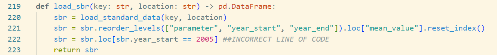
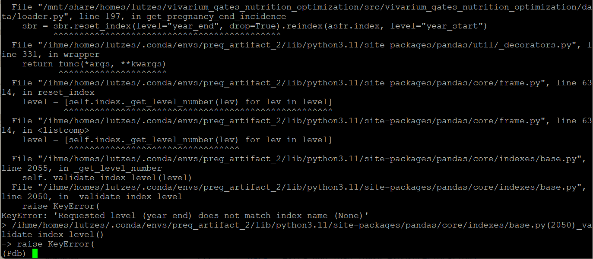
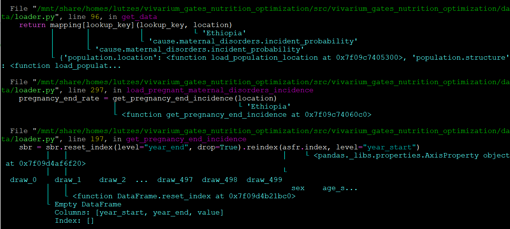
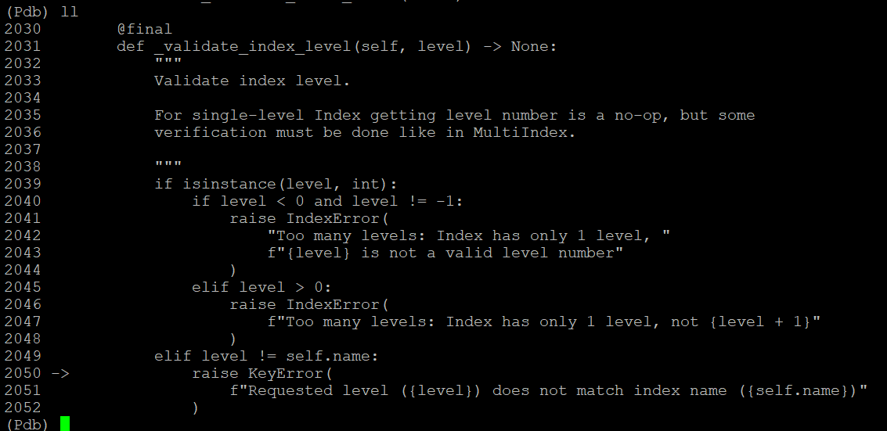
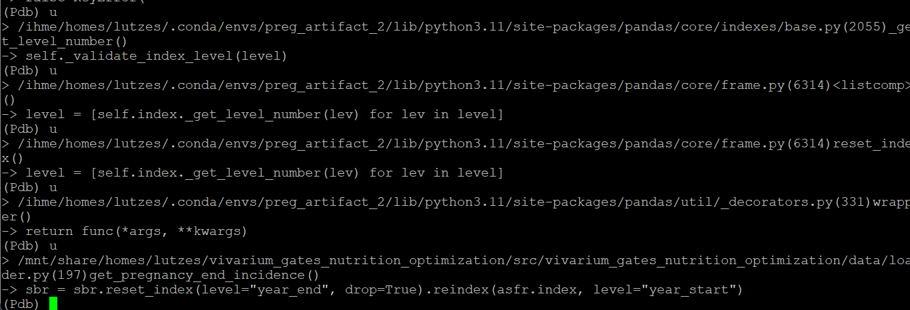
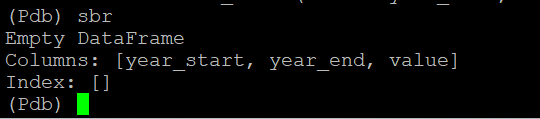
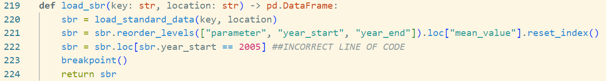

..
  Section title decorators for this document:
  
  ==============
  Document Title
  ==============
  Section Level 1
  ---------------
  Section Level 2
  +++++++++++++++
  Section Level 3
  ~~~~~~~~~~~~~~~
  Section Level 4
  ^^^^^^^^^^^^^^^
  Section Level 5
  '''''''''''''''

  The depth of each section level is determined by the order in which each
  decorator is encountered below. If you need an even deeper section level, just
  choose a new decorator symbol from the list here:
  https://docutils.sourceforge.io/docs/ref/rst/restructuredtext.html#sections
  And then add it to the list of decorators above.

.. _debugging_rt:

===============
Basic Debugging
===============

.. contents::
   :local:
   :depth: 2

Debugging is an art and science that we couldn't hope to cover on this 
single page. Rather than attempt such foolishness, we review a few simple 
techniques in the context of a targeted example here. If you find your 
bug to be outside the scope of this page, it's likely time to ask an 
engineer for help.

For the purpose of this debugging example, we will be working with 
an intentionally set error to see how the error messages appear 
and how to read them.

Say we are building an artifact (more information on the :ref:`artifact 
building page <artifact_building_rt>`) and working on the function 
:code:`load_sbr` 
in the :code:`loader.py` file (more information about file types can be found in the 
:ref:`overview of engineering files page <engineering_files_rt>`). In this 
function, a line of code we edit filters a dataset incorrectly. 

You can see in the photo above, we have added line 222, where we incorrectly 
added a line filtering the dataset to the year 2005. This will lead to the 
returned dataset being empty, since the year 2005 is not present in the data. 

Let's see how this might show up in the code, and how we'd debug it. 

Making Sense of the Stack Trace
-------------------------------

When the model runs into an error, it outputs a "stack trace" 
or "traceback" along with the error message. 
The stack trace shows what Python was doing when it encountered the error. 
Often the immediate line of code that generated the error will be 
significantly removed from the line of code that will need to be changed 
to fix the error. 

For our example, let's look at two photos of the stack trace 
output. The first is the immediate output you see. This is quite 
difficult to read, and as you can see, the bottom lines of the traceback, 
which are the most immediate code that failed, just show an error within
pandas code. Above that, we can start to see the error 
being traced through calls in the :code:`loader.py` file. 

The second photo is a formatted version of the stack trace that 
might be outputted based on your terminal and version of python. 
It contains most of the same information, but with nicer coloring and 
added information on the 
parameters used at each point in the call, and notably includes 
more relevant information - the lines of code in :code:`loader.py` 
that failed. If this doesn't appear, try updating python, or explore 
new terminal options.

Sometimes, it will be apparent from the stack trace where the bug 
in the code is. However, sometimes it won't be. Here, we see that the 
line of code we know is wrong (line 222 from the intro) isn't listed 
anywhere in the stack trace. 

Different errors might produce different outputs. You might see lines in the stack trace
from pandas functions, other functions in :code:`loader.py`, or 
functions from other packages, like :code:`vivarium_research` or :code:`vivarium_public_health`. 

As you can see from this example, the stack trace can be both helpful and unhelpful. 
In general, look through the files to see if you can get back to something 
you wrote or edited - like the :code:`loader.py` file. If so, this is a good 
place to start looking for issues, and the stack trace will provide the line 
number of the code that caused the error. 

Otherwise, see the next section for how to use the Python debugger. 

Navigating the Python Debugger
------------------------------

In all of the commands used to make artifacts, run simulations, or make results, the 
flag :code:`--pdb` is used, which means that when an error 
occurs, you will be placed into the Python debugger. 

Let's continue with the example above, where we got an error 
in a pandas checking function. 

The Python debugger places you at the end of the stack trace - 
so we are currently sitting in a pandas error message function. 
We can check this by typing :code:`l` or :code:`ll` which prints 
the code around the current line (l), or a longer version of this 
print out (ll). This will let you see what the code surrounding the 
error is. In our example, typing :code:`ll` will show the photo below, 
which is a pandas checking function showing an error with levels in the 
data frames. 

Next, you can move up or down the call stack with :code:`u` or 
:code:`d` respectively. The stack is the code you're currently 
running, and what function called the current one, and what 
function called that one, and so on, all the way up the top. It 
should match what is printed for you in the stack trace. The "trace" 
is the output when the error is found. 

Since we start at the bottom of the stack, we will move up first. 
By entering :code:`u`, we move through the pandas functions 
until finally we reach the line in our :code:`loader.py` function. 

Note: it can 
often take several times entering :code:`u` to get to a useful 
point in the code. Don't be surprised if you need to move up a lot!

Now in the debugger, we are "located" in the :code:`loader.py` function 
that started this error. Since the debugger is "in" this line of code, 
the objects at that point in the code are able to be called. For example, 
we can print or manipulate the dataframes being worked with. The code 
for this in the Python debugger is the same as used in 
a Jupyter notebook. By printing the :code:`sbr` dataframe, we 
discover that it is empty - and the issue is more clear! 

From there, we can look at the code generating the empty dataframe. 
Maybe you see the error quickly. But if not, we'll probably 
want to add a breakpoint. 

To quit the Python debugger, enter :code:`quit`. 

Adding Breakpoints
------------------

So, we have identified the issue is an empty dataframe. Let's keep 
debugging! The dataframe in question is generated 
in a function not in our stack trace. This means we'll have trouble 
getting to it with the Python debugger. We'll need to set a breakpoint. 

A breakpoint is a line of code :code:`breakpoint()` that "breaks" 
the code. So when this line is read, the model will drop you into a 
Python debugger at that point in the code. So in our example, we might 
set a breakpoint in the function which creates the empty dataframe. 
Since we know that the :code:`sbr` dataframe is empty, we can look at 
the :code:`load_sbr` function and add a breakpoint, see the image below.

Once in the Python debugger, we can use a similar process to the above. 
Start by printing the dataframe. If it's empty, the issue is earlier 
in the code. If the dataframe is still correct, the issue is later. 
You can use up and down to see functions calling the current one, 
as in the debugger. You can also step forward (:code:`s`) to run 
the next line of code and then drop back into the debugger. 
In this manner, you can check what your dataframes look like before and after each
line runs and find which line is the issue. From there, you can investigate the line 
and fix the bug. 

If you need to use multiple breakpoints, you can also use the 
command :code:`c` for continue, to move until the next breakpoint. 

Assessing Outputs While Debugging
---------------------------------

It is often helpful to check outputs you receive while coding to ensure 
that they are correct. The above information only applies to bugs that 
throw errors. What if we didn't use our empty dataframe again, and so 
instead of receiving an error message, we just accidentally saved the empty 
dataframe to the artifact? We might not notice until we got incorrect 
results from a simulation run! 

It would be helpful to check some of these outputs along the way to catch 
these types of errors earlier and be able to fix them. To do this, we 
recommend having a file, or Jupyter notebook open to run some basic 
checks.

Information on working in VS Code with the cluster `is available here <https://stash.ihme.washington.edu/projects/CCGUTS/repos/script_utils/browse/bin/submit_vscode_server.py>`_ and there 
is more in-depth information in the Onboarding Resources section of 
Vivarium Research, you can run Jupyter notebooks while creating 
the artifact from the command line. This will allow you to run active 
checks on outputs as you create them. 

.. todo::
    
    Add in link to onboarding docs where VS Code set-up lives once that section is written. 

Additionally, if you find an error in an artifact key, this will 
allow you to remove it, fix the code, and rerun the artifact generation 
for that key quickly and efficiently. Here is an example of an `artifact checking notebook <https://github.com/ihmeuw/vivarium_research_nutrition_optimization/blob/e24190c9c2ceae9bbd5990819c974e98f6af450c/verification_and_validation/child_model/artifact_vv_subnational.ipynb>`_. 
This file assess the artifact keys for missing data, incorrect 
parameters and other basic items that would cause errors in the sim.

Continued Learning
------------------

Debugging is a very complex skill. Should you wish to continue your 
learning more generally, here are some resources: 

#. Docs for the Python debugger with additional commands: https://docs.python.org/3/library/pdb.html 
#. A software carpentry module on testing and debugging: https://paris-swc.github.io/python-testing-debugging-profiling/index.html 

