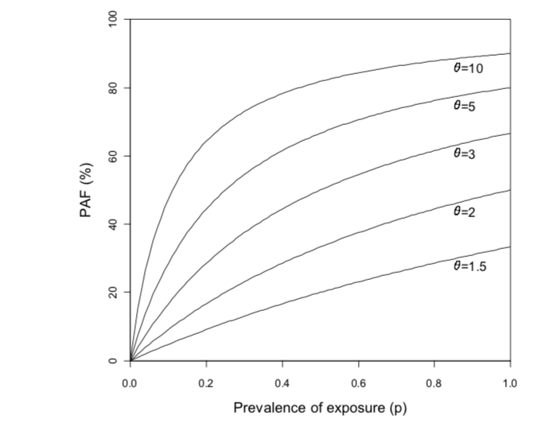

Relative Risk (RR)
++++++++++++++++++

Population Attributable Fraction (PAF)
++++++++++++++++++++++++++++++++++++++

Description
+++++++++++

PAF in GBD 2017 (operationally)
+++++++++++++++++++++++++++++++

Defintion of PAF
++++++++++++++++

The population attributable fraction (PAF) represents the proportion of risk that would be reduced in a given year if the exposure to a risk factor in the past were reduced to an ideal exposure scenario. This is defined for a continuous risk factor as:

PAF measures the contribution of a single exposure to the overall rate of disease. PAF, like the Population Attributable Risk (PAR), is a measure of population impact.

The PAF is subject to the same caveats and is the proportion of cases of disease occurring in the total population that would be avoided if the exposed were removed. 

According to PAF can also be defined as the fraction of all cases of a particular disease or other adverse conditions in a population that is attributable to a specific exposure. 

PAF equals (O − E)/O, where O and E refer to the observed number of cases and the expected number of cases under no exposure, respectively. The term “attributable” has a causal interpretation: PAF is the estimated fraction of all cases that would not have occurred if there had been no exposure. As an example, in early 1950, Doll derived O = 11189 and E= 1875 using the Doll and Hill case-control study of smoking and lung cancer deaths throughout England and Wales, so the smoking PAF for lung cancer deaths was (11189 − 1875)/11189= 83%. 

Using a cohort study, following Miettinen, we can estimate the PAF from the estimated relative risk (RR) for the exposure andthe prevalence of exposure among cases (pc), as PAF = pc(1 −1/RR). Suppose that a particular exposure doubles the risk of a certain outcome (that is, RR = 2). If the prevalence of exposureamong cases is 0.6, then PAF = 0.6(1 − 0.5) = 0.3 (that is, 30%). PAF depends not only on the increased risk associated with the exposure but is also directly related to the prevalence of exposure. PAF is usually expressed as a percentage.

The PAF increases with the rate ratio but also with the prevalence of exposure p. Therefore, it varies between populations, depending on how common the exposure is, as demonstrated in the following plot. 

[BMJ-Population-Attributable-Fraction]_

.. todo::
  Decide if the below should be removed from this section of documentation. Does it provide more information and is useful or is it difficult to understand?

Below is more detailed information on calculating specific variables, and alternative ways to consider PAF.
To calculate PAF, consider the simplest situation where we wish to examine the impact of a single binary exposure on the incidence of a disease in a defined study population. Let:

* p = Proportion exposed in the study population 
* λ1 = Incidence rate in the exposed
* λ0 = Incidence rate in the unexposed 

so that the rate ratio is θ = λ1/ λ0.

The attributable fraction (AF) in the exposed (E) is given by 
:math:`AF_{E} = (λ1 - λ0)/ λ1 = (θ - 1)/ θ`

the rate in the total population (λT ), would be reduced from λT to λ0, this is given by 
:math:`PAF = (λT - λ0)/ λT`

The the total rate of disease in the population can also be written as 
:math:`λT = p λ1 + (1 - p) λ0 = pθλ0 + (1 - p) λ0 = [p(θ - 1) + 1] λ0` 

so that the PAF can be written as
:math:`PAF = p(θ - 1)/[p(θ - 1) + 1]`

Estimation of the PAF in epidemiologicl studies
+++++++++++++++++++++++++++++++++++++++++++++++

* Cohort studies: Simplest situation, since disease rates in exposed and unexposed can be measured directly
* Cross-sectional studies: Prevalence of a disease state is measured, rather than its incidence.
* Unmatched case-control studies: Ratio of two proportions, given independent samples
* Matched case-control studies: Can use alternative equation in this case, providing the cases can be regarded as a representative sample of all cases. 
* Exposure with multiple levels: Estimate the proportion of cases attributable to each level of exposure, the proportion of cases that would be avoided if the rate of disease in each exposure group were reduced to that in the unexposed (or baseline) group. 

There are some caveats to the cohort studies estimation of PAF, if exposed and unexposed cohorts have been sampled separately for the study. A separate estimate of p or p’ will be required.

In cross-sectional studies, this is also known as the proportion of prevalent cases in the population. There are some potential issues this type of study of interpreting prevalence rather than incidence cases. If an exposure is associated with increased prevalence of disease, it could be because the exposure increases the risk of developing the disease, or because it increases the amount of time a person has the disease, or even because it increases survival from the disease. 

This use of PAF is recommended for chronic disease states.

Adjustment for confounding
++++++++++++++++++++++++++

We make the strong assumptions that there is no bias in the study design and data analysis; in particular, that the estimated effect is adjusted for all confounders. In addition, we assume that removing the exposure does not affect other risk factors. This assumption may not be true in practice; for example, removing smoking may decrease alcohol consumption, making
interpretation of smoking PAF for coronary deaths difficult. Also, PAF assumes that there is a perfect intervention which eradicates the exposure. [BMJ-Population-Attributable-Fraction]_

Below are ways to adjust for confounding: 

* Stratified analysis
* Logistic Regression analysis
* Confidence intervals for adjusted PAF (*)
* Joint effects of several exposures

.. todo::
  Add information about adjustment for confounding and link to adjustment for bias (open PR)

References
----------

.. [BMJ-Population-Attributable-Fraction]
   `Mansournia, Mohammad Ali, and Douglas G. Altman. "Population attributable fraction." Bmj 360 (2018): k757.`
