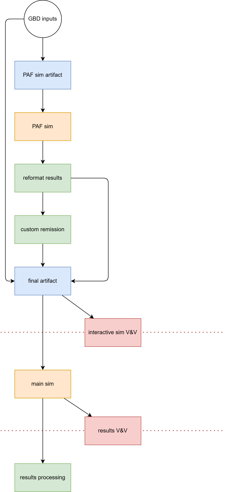

..
  Section title decorators for this document:
  
  ==============
  Document Title
  ==============
  Section Level 1
  ---------------
  Section Level 2
  +++++++++++++++
  Section Level 3
  ~~~~~~~~~~~~~~~
  Section Level 4
  ^^^^^^^^^^^^^^^
  Section Level 5
  '''''''''''''''

  The depth of each section level is determined by the order in which each
  decorator is encountered below. If you need an even deeper section level, just
  choose a new decorator symbol from the list here:
  https://docutils.sourceforge.io/docs/ref/rst/restructuredtext.html#sections
  And then add it to the list of decorators above.

.. _modeling_workflow_automation:

.. role:: underline
    :class: underline

=========================================================
Modeling workflow automation
=========================================================

.. contents::
   :local:
   :depth: 2

Current practice
----------------

Consider the simple example simulation from the `tutorial <../../../onboarding_resources/tutorial/index.ipynb>`__,
with the following concept model diagram:

.. graphviz:: ../../../onboarding_resources/tutorial/concept_model.dot

Rather than working in a notebook, as we did in the tutorial, we will presume that we have built this model using
the typical file structure defined by `our template <https://github.com/ihmeuw/vivarium-suite/tree/main/tools/model-template>`__.
Furthermore, we follow some best practices currently emerging in the MNCNH model:

* Including all data processing steps in the model repository
* Including all V&V notebooks in the model repository
* Including results processing notebooks/scripts in the model repository

So, concretely, we have a file structure that looks like this (some things are omitted for brevity)::

    src/tutorial/
        components/
            sqlns_intervention.py
        constants/
        data/
            loader.py
            ...
        model_specifications/
            model_spec.yaml
            branches/
                scenarios.yaml
        results_processing/
            results_processing.ipynb
        ...
    tests/
        interactive/
            interactive_vnv.ipynb
        results/
            results_vnv.ipynb
    .gitignore
    Makefile
    environment.sh
    pyproject.toml
    ...

Let's assume the code is all complete (not shown here), and the environments have already been created using the ``environment.sh`` script,
but we have not run any of the workflow steps yet.
The steps to generate results would be:

1. Come up with a name or number to identify the run (e.g., ``first_run``).
2. Build artifacts (using the artifact environment) with the ``make_artifacts`` command (once for each location),
   saving to a named location in the team directory (something like ``/mnt/team/simulation_science/pub/models/tutorial/artifacts/first_run/ethiopia.hdf``)
3. Run the simulation (using the simulation environment) with the ``psimulate`` command (once for each location),
   passing the path to the newly built artifact to the command. (It may also be wise to update the ``model_spec.yaml`` with a new artifact path.)
   The output directory for the simulation results will also be in the team directory, something like
   ``/mnt/team/simulation_science/pub/models/tutorial/results/first_run/``
4. Execute the notebooks in ``tests/`` to check that the model is working as intended.
5. Generate the final figures etc. for the client using the notebook in ``src/tutorial/results_processing``.

Now let's add one wrinkle, which is that we want to calculate our own population-attributable fraction (PAF)
of child wasting on diarrheal disease, rather than using GBD's.
We'll do this using a Vivarium simulation.
We make a separate model specification, and add a custom component to observe the PAF.

.. code::
    :emphasize-lines: 4, 7-8

    src/tutorial/
        components/
            sqlns_intervention.py
            paf_observer.py
        constants/
        data/
            custom_paf/
                paf_model_spec.yaml
            loader.py
            ...
        model_specifications/
            model_spec.yaml
            branches/
                scenarios.yaml
        results_processing/
            results_processing.ipynb
        ...
    tests/
        interactive/
            interactive_vnv.ipynb
        results/
            results_vnv.ipynb
    .gitignore
    Makefile
    environment.sh
    pyproject.toml
    ...

We also update the loader.py code to read the custom PAF rather than calling ``vivarium_inputs`` for this key.

Now additional steps have been added when we want to do a full re-run of the project.
Between steps 1 and 2 above, we now must:

1. Build artifacts using the ``make_artifacts`` command, but **skipping** the PAF key in those artifacts,
   which we can do with careful use of the ``-r`` flag to select the keys we want.
   We can save this initial artifact to the team directory, something like 
   ``/mnt/team/simulation_science/pub/models/tutorial/artifacts/second_run/ethiopia_no_paf.hdf``.
2. Run the PAF simulation using ``simulate`` or ``psimulate``, making sure to pass the path to the custom PAF model specification and the artifact generated in the previous step.
   We will pass an output directory for the PAF simulation results, also in the team directory, something like
   ``/mnt/team/simulation_science/pub/models/tutorial/results/second_run/paf_simulation/``.
3. Copy the results from the PAF simulation into a standard location for the artifact to pull from,
   such as within the repo, or update a constant in the artifact generation code to point to the new PAF simulation output location.

The rest of the process continues unchanged.

Next, we will add one more custom process for demonstration purposes, one that does not use a Vivarium model.
We've decided that we do not want to use the remission rate data from GBD for diarrheal diseases, but instead
want to calculate a custom remission rate based on a compartmental model calibrated to a literature source,
and which uses our custom PAF.
We write some custom Python code to do this calculation for a given location, and place it within the ``data`` directory:

.. code::
    :emphasize-lines: 9-12

    src/tutorial/
        components/
            sqlns_intervention.py
            paf_observer.py
        constants/
        data/
            custom_paf/
                paf_model_spec.yaml
            custom_remission/
                custom_remission.py
                results/
                    ethiopia.csv
            loader.py
            ...
        model_specifications/
            model_spec.yaml
            branches/
                scenarios.yaml
        results_processing/
            results_processing.ipynb
        ...
    tests/
        interactive/
            interactive_vnv.ipynb
        results/
            results_vnv.ipynb
    .gitignore
    Makefile
    environment.sh
    pyproject.toml
    ...

We also update the ``loader.py`` to take the remission from the saved CSV file rather than from GBD.

This now adds an additional step to our re-run process, which is running ``custom_remission.py``,
after the PAF simulation but before generating final artifacts.

Note that it is necessary to manually execute these steps for *each* location being modeled.
If we add a new location, we will need to complete all these steps again.
This is quite time-consuming to do manually, and is prone to errors.
Furthermore, this doesn't include V&V or results processing, and represents a fairly simple data pipeline
compared to our real models.

We also need to manually track what *needs* to be re-run, or do a (wasteful) full re-run every time.
If we update our PAF sim, we need to re-run
the custom remission step, but if we update the custom remission script, we don't need to re-run the PAF simulation.

Design
------

We would like the process described in the previous section to be accomplished with a single command.
The net result is that you could, for example, add a new location in one metadata file,
add data for that location only in the places it is manually provided,
and with a single command, generate results for that new location.
It would also be possible to run the workflow only up to a point,
for example only up to the artifact step, and then pause for manual review.

Notably, this command would **cache** unchanged steps, so it would not always re-run the entire pipeline;
more details below.

Furthermore, there would no longer be a need for model numbers or names, as all results including simulation results and artifacts would be versioned and branched
alongside the code using Git (details on this below).

The workflow would need to be specified in a Python file at the root of the project.
This is what the workflow would look like for the example project discussed above:

.. literalinclude:: workflow.py
   :language: python

In addition to automating the workflow, this file also replaces the ``loader.py`` file
(all custom loading logic is moved to a separate Python step),
as well as the branches files, which are now incorporated into the arguments to the simulation steps.

A separate command will open up an interactive display of the workflow's directed acyclic graph (DAG), showing the dependencies between different steps.
This would live-reload as edits are saved to the ``workflow.py`` file.
Here is a mockup of how this might look.

Git tracking of data files
++++++++++++++++++++++++++

As mentioned above, all inputs, intermediates (including artifacts), and outputs are tracked using Git.
In order to make this feasible, we would use **Git LFS**, which we already use in the model archival process, throughout development.
Specifically, we would use a Git LFS adapter that stores files larger than a certain size in our team directory on the cluster
(**not** on GitHub).
From a user's perspective, this would be pretty seamless: when running a ``git push`` command, the small files would be pushed to GitHub
and the large files would be pushed to the team directory, automatically.

Capacity management
~~~~~~~~~~~~~~~~~~~

If we ran out of space in the team directory, or perhaps periodically, we would run a tool (that we would develop internally) that would follow this pattern
to delete files we are least likely to want in the future:

1. Delete all files that are generated by explicit steps in the workflow, before deleting any files that are top-level inputs to the workflow or come straight from GBD.
2. Within each of those categories, delete all files that are not referenced by any commit with a branch or tag pointing to it, before deleting any files that are referenced by a branch or tag.
3. Within each of those categories, delete files in order from oldest to newest, based on the date of the last commit that references them.
4. Break ties by deleting larger files first.

This process only continues until the Git LFS store for the model in the team directory is beneath a target size.

Caching and selective re-running
++++++++++++++++++++++++++++++++

In the example above, if a change was made to the SQ-LNS intervention component, and that component was not included in the PAF sim,
then only the main sim, V&V notebooks, and results processing would re-run, without re-running the PAF sim or the artifact generation.

If a refactor was made to any step that changed its code but not its outputs, *only* that step would re-run.

The cache is **shared** between users, so if you check out another person's branch and run the workflow, nothing will happen if everything
is already up to date.

There will be a manual override to force re-running a specific step, even if the cache thinks it already knows the output.
There will also be an override in the other direction, to mark that a step's output would not change with changes you have made.
These overrides will update the global cache.