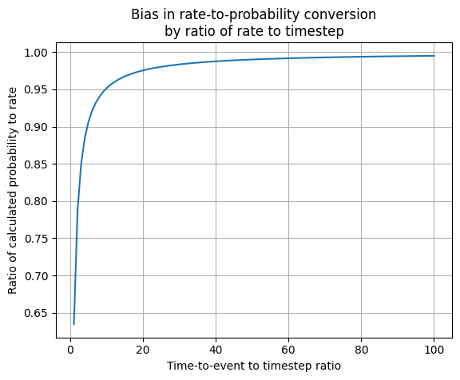
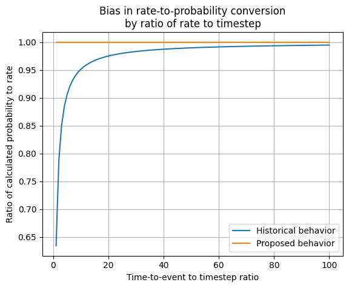

..
  Section title decorators for this document:
  
  ==============
  Document Title
  ==============
  Section Level 1
  ---------------
  Section Level 2
  +++++++++++++++
  Section Level 3
  ~~~~~~~~~~~~~~~
  Section Level 4
  ^^^^^^^^^^^^^^^
  Section Level 5
  '''''''''''''''

  The depth of each section level is determined by the order in which each
  decorator is encountered below. If you need an even deeper section level, just
  choose a new decorator symbol from the list here:
  https://docutils.sourceforge.io/docs/ref/rst/restructuredtext.html#sections
  And then add it to the list of decorators above.

.. _rate_timestep_adjustment:

.. role:: underline
    :class: underline

=========================================================
Timestep adjustment in rate to probability conversion
=========================================================

.. contents::
   :local:
   :depth: 2

Background and Motivation
--------------------------

Historical behavior in vivarium
++++++++++++++++++++++++++++++++

Vivarium relies on the following approximation to convert a rate :math:`r` to a probability of an event during some timestep :math:`dt`:

.. math::

  1 - e^{-r \times dt} \approx r \times dt

Where :math:`r \times dt` represents the timestep-scaled rate and :math:`1 - e^{-r \times dt}` represents the timestep-scaled probability.

.. note::

  What’s going on is that we’re thinking of rate :math:`r` as an exponentially distributed continuous random variable. But in Vivarium this random variable gets discretized into a geometric random variable, I believe with parameter :math:`p = 1 - e^{-r \times dt}`. The mean of the exponential random variable is :math:`r`, whereas the mean of the geometric random variable, converted from time steps back to days, is :math:`dt/p`.

.. todo::

  Add more detail on why this is the case from an implementation stand point?

However, when :math:`r >> dt`, this approximation becomes less accurate. When this approximation does not hold (when a given rate is much larger than the simulation timestep), the rates from Vivarium simulation outputs will not accurately reflect the desired rates in the Vivarium simulation inputs (model verification will not be successful).

Notably, while this approximation may hold at the population level, it is important to remember that rates are heterogeneous at the individual level in Vivarium simulations, so it may not validate for particular subgroups with higher outcome rates due to their high-risk exposures, which may still cause model verification to be unsuccessful.

Theoretically, in the case of modeling high rates, a small enough timestep (:math:`dt`) may be selected to achieve verification criteria. However, this may not be desireable for as smaller timesteps will lead to longer run times and more demands for computational resources. Therefore, the following solutions may be considered:

Problem space
+++++++++++++

So this then raises the question of what ratio of :math:`r : dt` is sufficient in order for the :math:`1 - e^{-r \times dt} \approx r \times dt` approximation to hold. 

For a given rate :math:`r`, the average time to event for that rate can be represented as :math:`1/r`. We have tested how the :math:`1 - e^{-r \times dt} \approx r \times dt` approximation performs under various timestep sizes, as shown in the figure below. Timestep sizes were defined by the ratio of the average time to event :math:`1/r` to timestep :math:`dt`. Note that these tests are independent of the size of rate :math:`r`.

.. note::

  The y-axis in this plot is equal to :math:`\frac{1 - e^{-r \times dt}}{r \times dt}`. 

Notably, this figure indicates that when a timestep is more than approximately 1/10th of the average time-to-event for a given rate (ratio of time-to-event to timestep < 10), then we will systematically underestimate that rate in our simulation by a degree of 5% or more. This may require us to select very small timesteps when our simulations model high rates and even if we further decrease the timestep relative to the rate, we will continue to systematically underestimate the rate in our simulation. 

Proposal
--------------

Our proposal to address this problem is to modify the equation used to convert a rate to a probability as a function of the simulation timestep to account for this systematic bias.

For a rate :math:`r`:

.. math::

  r' = (-1/dt) \times ln(1 - dt \times r)

  probability = 1 - e^{-r' \times dt}

So then:

.. math::

  probability \approx r \times dt 

.. note::

  Rate :math:`r` defined here should ideally be the individual-level rate after modifications from risk effects or other causes are applied rather than the population level rate :math:`r`.

When this adjustment is applied, we then see that the approximation between calculated probability and rates holds regardless of the relative scale of :math:`1/r` to :math:`dt`.

This will allow us to model longer timesteps (and therefore decreasing the run-time of our simulations) without systematically biasing our simulation transition rates.

.. note::

  For reference, here is the code used to produce the plots included in this page.

  .. code-block::

    import pandas as pd
    import numpy as np
    import matplotlib.pyplot as plt

    r = 5
    df = pd.DataFrame()
    df['scalar'] = np.linspace(1.01, 100, 100)
    df['dt'] = (1/r) / df.scalar
    df['r_dt'] = r * df.dt
    df['r_prime'] = (-1 / df.dt) * np.log(1 - df.dt * r)
    df['prob'] = 1 - np.exp(-r * df.dt)
    df['prob_prime'] = 1 - np.exp(-df.r_prime * df.dt)
    df['ratio'] = df.prob / df.r_dt 
    df['ratio_prime'] = df.prob_prime / df.r_dt 

    plt.plot(df.scalar, df.ratio)
    plt.plot(df.scalar, df.ratio_prime)
    plt.grid()
    plt.legend(['Historical behavior','Proposed behavior'])
    plt.xlabel('Time-to-event to timestep ratio')
    plt.ylabel('Ratio of calculated probability to rate')
    plt.title('Bias in rate-to-probability conversion\nby ratio of rate to timestep')