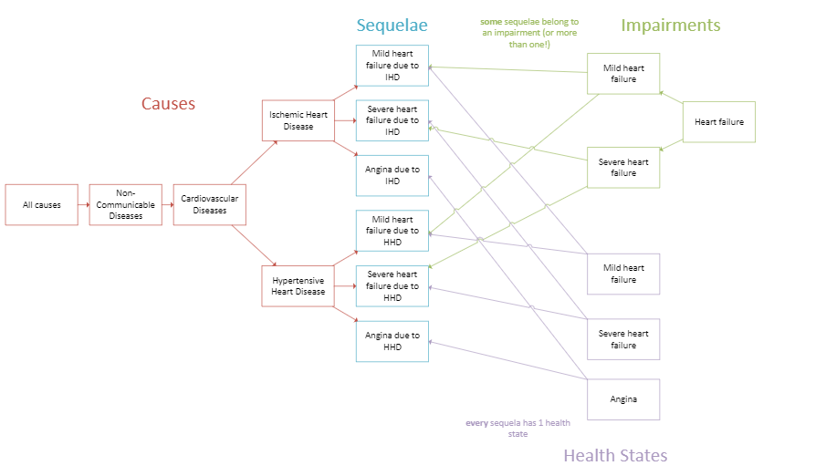

..
  Section title decorators for this document:
  
  ==============
  Document Title
  ==============
  Section Level 1
  ---------------
  Section Level 2
  +++++++++++++++
  Section Level 3
  ~~~~~~~~~~~~~~~
  Section Level 4
  ^^^^^^^^^^^^^^^
  Section Level 5
  '''''''''''''''

  The depth of each section level is determined by the order in which each
  decorator is encountered below. If you need an even deeper section level, just
  choose a new decorator symbol from the list here:
  https://docutils.sourceforge.io/docs/ref/rst/restructuredtext.html#sections
  And then add it to the list of decorators above.

.. _GBD_disease_health:

=================================================
Understanding GBD's Disease and Health Categories
=================================================

.. contents::
  :local:

This document seeks to clarify a few different disease and health concepts in 
GBD. These are: a cause, a sequela, a health state and an impairment. First, we 
will explain these different concepts conceptually. The official GBD definitions 
can be found at the bottom of the page. 

Conceptual Definitions within the GBD Hierarchy Context
-------------------------------------------------------

To understand these overlapping defintions, it is helpful to think of them 
in the context of a specific example. We will use cardiovascular disease for this. 
In particular, we will examine: 

- Causes: ischemic heart disease (IHD) and hypertensive heart disease (HHD) 
- Health states: medically managed, mild, moderate and severe heart failure 
- Impairments: heart failure 
- Sequelae: numerous, including "severe heart failure due to IHD" and "AMI first 2 days" among others 

To help with understanding some of the below information, a diagram of the heart failure impairment is provided: 

Causes
++++++

The cause hierarchy diagram for IHD and HHD is included here as a reference. 

.. image:: cause_hierarchy_ihd_hhd.svg

As you can see, the cause hierarchy slowly breaks down cause groups into more specific 
diseases, moving from all non-communicable diseases to specific types of cardiovascular 
disease. At each level (labeled), the cause hierarchy is mutually exclusive and 
collectively exhaustive - meaning all disease and death can be placed into a group at 
each level of the diagram. A cause is anything that causes death or disability. 

Both IHD and HHD are within the more general cardiovascular disease cause (c_491). IHD and HHD 
are "causes" within GBD. 

Sequelae
++++++++

Once you have selected a specific cause - for example, IHD - you can then identify the 
sequelae within that cause. These are all of the items listed below IHD and HHD in the 
diagrams above. Sequelae are almost like the last level of the cause hierarchy, but are 
not modeled with the same complexity as causes. Sequelae are only used in GBD non-fatal 
estimates; deaths are attributed to a cause but not to a sequela within that cause.

Sequelae detail a specific medical condition associated with 
a cause. For example, IHD has medical conditions like acute myocardial infarction 
(a heart attack) and angina (chest pain) as associated sequelae. These are the things 
a patient might be experiencing, or a doctor might identify. The differentiation between 
a cause and a sequela might sometimes be arbitrary and based on a modelers 
discretion based on doctor's opinions and available data. 

Sequelae often contain a level of severity for that condition - for example, mild and moderate 
angina are both sequelae within IHD. 

Health States
+++++++++++++

A health state is the state of health within a sequelae. This is summarized as the amount 
of disability with a single value called the disability weight. More information on this can be found in `this section of the cause model page <https://vivarium-research.readthedocs.io/en/latest/model_design/vivarium_model_components/causes/index.html#disability-weights>`_. A health state for a sequelae and its disability weight can be 
found in the GBD methods appendix. 

Using our above sequelae (acute myocardial infarction and angina) as an example - 
the amount of health lost while experiencing an acute 
myocardial infarction is quite high! You're likely hospitalized and in a lot of pain. 
The health state here is called 'Acute myocardial infarction, days 1-2' and the disability weight is 0.432. 
However, the health lost from angina might be less significant. You're likely at home and 
might only experience discomfort when under stress. The health state is called 'Angina pectoris, mild' and 
the disability weight is 0.033. 

Each sequela has exactly one health state associated with it. If you are experiencing multiple 
symptoms, such as "headache and chest pain", your health state contains all of these losses to 
health in one "health state". 

One important note is that health states can be shared across sequelae - and even shared 
between sequelae of different causes. For example, severe heart failure due to IHD and 
severe heart failure due to HHD have the same amount of health loss associated with them. 
Severe heart failure feels the same to a patient no matter the cause. Therefore, we would 
say that the health state and therefore the disability weight is the same for both sequelae. 

Impairments
+++++++++++

Sometimes, GBD has a lot of information about an overall condition - such as heart failure in the 
example above - that the modelers want to utilize. However, in the process of normal GBD 
modeling, this wouldn't be possible. Usually, information is calculated at the cause level first 
(deaths, incidence, prevalence, etc.) and then divided into sequelae. This would make 
it impossible to use information about heart failure generally. 

Therefore, to use this valuable information about a condition, GBD created a new 
category called impairments. An impairment is a medical condition that GBD has extra 
data on, but can't be included in the cause hierarchy since it has more than one 
cause. Again, deciding what is a cause that can fit in the hierarchy and what is an 
impairment is often a result of historical context and modeler decisions. 

An easy example to grasp is blindness. There is a lot of data available about blindness, but 
it can be caused by a lot of different things. Therefore, it is difficult to place in the 
cause hierarchy, but we want to include all the rich data we have. Hence, it is an 
impairment. 

To include the extra information about an impairment, GBD modelers first find the total 
amount of the impairment - heart failure - and then divide it between causes. This 
creates the sequelae of "heart failure due to IHD" and "heart failure 
due to HHD" for example. These are included in blue in the diagram above. 

There can even be impairment hierarchies. For example, mild heart failure is an impairment, 
but it also fits under the larger impairment of heart failure. 

Further information the GBD calculations can be found on the `Impairments 101 Hub page <https://hub.ihme.washington.edu/display/GBD2016/Impairments+101>`_. 

To learn more about how to model impairments in Vivarium, check out this :ref:`page on modeling impairments <impairments>`. 

Official GBD Definitions
------------------------

These definitions and others can be found on the `glossary Hub page <https://hub.ihme.washington.edu/pages/viewpage.action?spaceKey=INTRANET&title=IHME+Glossary>`_. 

.. list-table:: GBD definitions of terms 
  :widths: 15 15 15 15
  :header-rows: 1

  * - Term 
    - Definition
    - Notes
    - Example 
  * - Cause
    - A cause of death or disability. Includes injuries, diseases, and conditions. 
    - See cause list for more details 
    - Ischemic heart disease
  * - Cause List 
    - The list of all causes in GBD. It is a mutually exclusive and collectively exhaustive list of hierarchical categories that does not ignore any cause of death. All death and disability within GBD can be found within the cause list. 
    - 
    - N/A
  * - Health State 
    - The current state of health associated with a given cause and sequela.
    - Each sequela has one health state associated with it. This might be combination of symptoms "Mild abdominal pain with mild anemia", but it is defined as a single "health state". 
    - Heart failure, mild 
  * - Impairment
    - The symptoms of a disease, such as vision loss as a result of diabetes. Clinically the same as sequelae. 
    - GBD calculates these very differently than sequelae despite them being clinically the same. 
    - Heart failure 
  * - Sequela or Sequelae 
    - The medical conditions that can occur among people who contract a disease or suffer an injury. In other words, the negative health effects of a cause that are associated with certain health states. For example, chronic kidney disease can be a sequela of diabetes, neck pain can be a sequela of whiplash, and foot ulcers is a sequela of diabetes.
    - "Sequela" is singular. "Sequelae" is plural. There are asymptomatic sequelae. They are distinct, mutually exclusive categories of health consequences that can be directly attributed to a cause. 
    - Mild heart failure due to ischemic heart disease 
