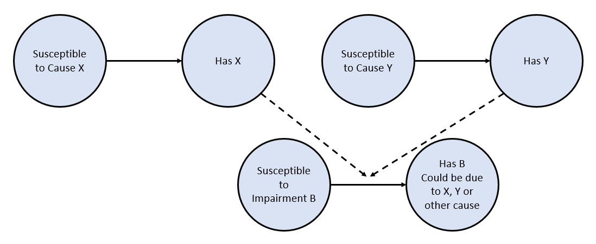

..
  Section title decorators for this document:

  ==============
  Document Title
  ==============
  Section Level 1
  ---------------
  Section Level 2
  +++++++++++++++
  Section Level 3
  ~~~~~~~~~~~~~~~
  Section Level 4
  ^^^^^^^^^^^^^^^
  Section Level 5
  '''''''''''''''

  The depth of each section level is determined by the order in which each
  decorator is encountered below. If you need an even deeper section level, just
  choose a new decorator symbol from the list here:
  https://docutils.sourceforge.io/docs/ref/rst/restructuredtext.html#sections
  And then add it to the list of decorators above.

.. _impairments:

=================================
Modeling Impairments
=================================

.. contents::
  :local:

What is an "impairment" and why might you model one?
----------------------------------------------------

Understanding the definition of an impairment can be difficult,
especially since it's an artifact of data availability in the GBD modeling
process. A more in depth definition for impairments and how this relates to other GBD
terms defining disease can be found on this :ref:`GBD health page <GBD_disease_health>`.

In short, sometimes GBD has a lot of information about an overall condition that
the modelers want to utilize. However, the information typically couldn't be included in the
cause hierarchy since the impairment has more than one cause. Therefore, modelers
include it as an impairment.

An easy example to grasp is blindness. There is a lot of data available about blindness, but
it can be caused by a lot of different things. Therefore, it is difficult to place in the
cause hierarchy, but we want to include all the rich data we have. Hence, it is an
impairment.

Modeling impairments can be important for a simulation depending on the research questions.
Continuing the blindness example above, if you wanted to include an intervention that
targets blindness generally, you would ideally want to include blindness, but
wouldn't necessarily want to include all of the possible causes for blindness.
Hence the need to model the impairment instead of all causes of the impairment. Including
all of the causes would unnecessarily complicate the model and include information
not relevant to our research question.

On the other hand, if we were investigating an intervention that targets diabetes,
we might not need to include blindness as an impairment. Instead we could just track
the sequela "blindness due to diabetic mellitus" since we are only concerned about
blindness due to a single cause.

It is important to think through your research question and what is being affected
by your interventions to determine if including an impairment is needed.

Comparing and Contrasting Impairment and Cause Models
-----------------------------------------------------

In general, modeling impairments is similar to modeling causes - they are
both medical conditions simulants can experience. Therefore, most of
the :ref:`cause modeling page <models_cause>` is still applicable and
should generally be used for modeling impairments.

However, there are a few important differences between modeling causes
and impairments that we will cover here. These differences largely
pertain to data sources and availability.

Disease Models
++++++++++++++

The GBD data availability differs by impairment significantly. For
example, heart failure has an incidence, prevalence, excess
mortality rate, and disability weights. Therefore, you could create a heart
failure model more of less exactly as you might make a cause model.

On the other hand, anemia does NOT have an incidence or any mortality
associated with it. It does have a prevalence and disability weight.
Therefore, other methods might be needed in order to have a dynamic
anemia model. You can see one example of this based on simulant's hemoglobin
levels in the :ref:`hemoglobin, anemia and iron deficiency model <2019_hemoglobin_anemia_and_iron_deficiency>`.

Another option would be to derive the needed values from cause level data.
You could aggregate incidence or another needed variable from all their
causes, weighted by prevalence of their sequelae in the impairment. This
might require working with the relevant GBD team to get any data available
on sequelae included in the impairment and proportion of each cause.

Risk Models
+++++++++++

GBD does NOT include relative risks or PAFs connecting risk factors
to impairments. Therefore, if you need to model the impact of a risk
factor to an impairment you will need to use literature values for
relative risks. These values
might have limitations. For example, check the study population used to
find relative risks to ensure it is applicable to the full range of
risk factor values - sometimes you might need to cap the relative risks
if the study does not apply to very high risk factor values.

After you have defined the relative risks you plan to use, you will need
to recalculate the PAFs to include this new "cause" in the
model. More information on PAFs and how to find them can be found
on the :ref:`PAF vivarium page <pafs>`.

Once you have a completed model design, take care to include model updates
one step at a time with V&V between each step. Mixing data sources and
generating model data can introduce opportunities for error, so checks
along the process are important for success.

Techniques for Modeling Impairments and Causes Together
-------------------------------------------------------

The above section goes through the basics of adding an impairment to
your model. But what happens if you want to include both a cause
and impairment that overlap?

Let's return to our blindness example from above. What if you want to include
both blindness as an impairment AND diabetes as a cause? We can imagine a
few possible solutions, each of which has pros and cons. The "right"
answer for how to model impairments in your simulation will depend on the requirements
and data available.

Include Both Cause and Impairment Separately
++++++++++++++++++++++++++++++++++++++++++++

One solution would be to include the cause and impairment
as separate model components. However in this case blindness and diabetes
overlap - they both include the sequela "blindness due to diabetes mellitus" in their
GBD prevalence and incidence rates. So including both separately would
double count this sequala.

If they overlap is small - say diabetes only causes 1% of all blindness -
this might be an acceptable limitation of the model. However, usually this
would not be favorable modeling plan.

Since you can define the size of the overlap, it is a sequela with data
after all, you might try and "subtract out" the overlap from one model or
the other. For example, you could include diabetes as listed in GBD, and define
blindness as "blindness due to other causes", removing the part that overlaps
with diabetes.

This would help, but you still have an issue because causes in Vivarium (and impairments!) are
assumed to be independent. Therefore, it is possible for a simulant to have both
"blindness due to diabetes" and "blindness due to other causes" simultaneously,
which should be impossible in the GBD structure.

This would lead to undercounting the total amount of blindness in the population
since causes that should be mututally exclusive are not. Again, depending on the
size of the overlap this might be an acceptable limitation. It may also depend
on risk effects included for both models - if the same simulants are at high
risk for diabetes and blindness, the issue would be more exacerbated than if
different risk factors caused each.

One example of this can be seen in our IV Iron Simulation and more specifically
in modeling :ref:`anemia <2019_anemia_impairment>` and :ref:`maternal hemorrhage <2019_cause_maternal_hemorrhage_incidence>`. In this case, YLDs for maternal hemorrhage
were not counted due to overlap with anemia YLDs. The anemia YLDs included both those due to
both maternal hemorrhage and other causes.

Include All Possible Causes
+++++++++++++++++++++++++++

Another solution might be to include all of the causes that touch blindness,
which would therefore include all of the blindness sequelae that make
up the impairment. In this approach you would not model "blindness" as an impairment,
but could get all of the same data from sequelae.

For the case of blindness, there are approximately 15 separate causes, not including
all neonatal causes. This would mean having 15 cause models included! This is
likely to be a lot of work, and would probably not provide much extra information.

Furthermore, you still have the issue that cause models are independent in Vivarium.
Simulants could still get blindness due to multiple causes, leading to the same undercounting
of total blindness.

For practical and logistic reasons, this approach is not recommeneded.

Include a Hybrid Cause & Impairment Model
+++++++++++++++++++++++++++++++++++++++++

Another option is to include a single cause model that includes both the cause
and impairment. One example of this is in the CVD model where IHD and Heart Failure
are included in the same :ref:`cause model <2019_cause_ihd>`.

By including both the cause and impairment in a single modeling component,
they are no longer independent which solves our prior problems of overlap.
In addition, you can define part of the model to overlap - for example states
could include diabetes, blindness due to diabetes, and blindness due to other
causes.

Including cause models structured in this way does sometimes lead to strange "predictive"
qualities for simulants. For example, a simulant with blindness from other
causes might not be able to develop diabetes to avoid overlap with blindess
due to diabetes. In real life, these conditions exist separately, but can't in
the model.

This approach should not create bias in your model and generally works well.
However, if you want to include many causes that overlap with an impairment
(e.g., including diabetes, meningitis, glaucoma, and vitamin A deficiency, all of
which cause blindness)
using this approach would make an extremely complex single "cause" model that
likely wouldn't be feasible to create or V&V.

Therefore, considering your modeling situation and the requirements is important
in choosing your modeling approach.

Have Causes Act as "Risks"
++++++++++++++++++++++++++

.. note::

  While we think this methodology will work well, it has not been tested in a
  model up to this point. Therefore the implemenation remains theoretical, and
  some details to the approach would need to be finalized before it could be
  used.

Another option is to have cause models that act as "risks" on the
impairment model. In effect, we would adjust the incidence of the impairment
to remove the impact of all modeled causes. This is very similar to how we currently
include mortality in our models.

For mortality, a simulant can die due to all cause mortality at any point, or
they can die due to a specific cause in our model. Therefore, we decrease the
background all cause mortality rate in the model to account for the presence of causes
with increased mortality rates. For more information on the math behind this, see
:ref:`the mortality hazards section of the cause model page <models_cause>`.

A similar principle can be used here. Referring to the figure below, we can see
that two causes, X and Y, act on the incidence of an impairment, B. Since
simulants can get impairment B through the causes X and Y, we need to decrease the
overall incidence of B to account for the other model factors.

The amount that the incidence of B is impacted will depend on the causes
present in the model and the amount of B caused by modeled causes vs
other factors. The math for this will largely follow the math for mortality,
but has not been designed or tested in a model. If the adjustments are done
correctly, this approach shouldn't create bias in the model and is a good
option if you need to include more cause models in the simulation.

If the impairment needs to include remission (e.g., an SIS model instead
of an SI model), the analogy to mortality breaks down, and this approach
might not be appropriate.
