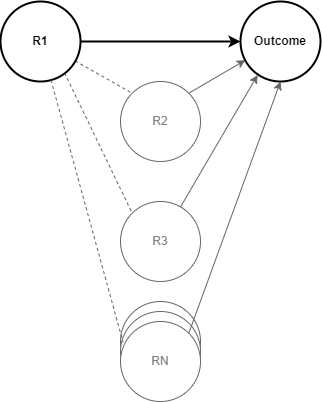
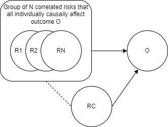

.. _residual_confounding:

=====================
Residual confounding
=====================

.. contents::
  :local:

Background and motivation
-------------------------

As discussed on the :ref:`risk-risk correlation page <risk_correlation>`, risk exposures 
are frequently correlated at the individual level, with vulnerable populations often 
experiencing a disproportionate share of risk exposure across several risk factors. 
Examples include high body mass index and high fasting plasma glucose, tobacco smoking 
and alcohol use, and childhood height and weight.

Therefore, if we are interested in the effect of a given risk factor (R1) on an outcome, 
there are often many other risk factors (R2, R3, ... RN) that may be correlated with R1 
and also have an effect on the outcome (as shown in the figure below). Notably, these 
"other" risk factors (R2 through RN) meet the definitions of confounding factors in the 
association between R1 and the outcome (see :ref:`the general DAGs page <general_dags>` 
for more information on confounding).

.. note::

  Some of the R2 through RN risk factors may be known, measured, and documented in the 
  literature. However, many likely remain unknown, unmeasured, and/or undocumented. 
  Remember that the burden of proof for causality is high and many such associations may 
  exist but have not yet been studied thoroughly enough to meet such a threshold. Such 
  unknown risks still represent important factors with regard to residual confounding.

The presence of such factors that are associated with R1 and the outcome causes the 
*observed* association between R1 and the outcome in a population (sometimes referred to 
as correlation, crude association, or unadjusted association) to be different from the 
*causal* association between R1 and the outcome (sometimes referred to as the adjusted 
association). 

In other words, if we were to stratify a population based on R1 risk exposure, the 
difference in the outcome rates between the exposed and unexposed groups would not 
equal the difference in outcome rates that would be observed among the exposed 
population at baseline and if we were to entirely remove their exposure, making them 
unexposed (perhaps through some hypothetical "cure" for the exposure). 

  For example, perhaps we are interested in the association between body mass index (BMI)
  and cardiovascular disease. In the United States, there is a greater rate of high BMI 
  exposure in rural than urban areas. However, there are also several other factors that
  vary between rural and urban areas (and therefore are associated with high BMI exposure)
  that affect cardiovascular disease mortality risk. For example, air pollution, which 
  tends to be greater in urban areas, is a risk factor for cardiovascular disease mortality. 
  Therefore, we can see that the difference in cardiovascular disease mortality rates 
  among those with high BMIs relative to those without high BMIs cannot be entirely explained
  by the difference in their BMIs alone. Rather, it is a function of the difference in their
  BMIs as well as the difference in their air pollution exposure and the differences in 
  all other known and unknown risk exposures that affect cardiovascular disease mortality.

As discussed on the :ref:`population attributable fraction page <pafs>`, a situation in 
which the crude association between a risk and an outcome is not equal to the causal 
association between that risk and outcome can cause 
a biased estimate of the PAF of R1 on O. If we are modeling one or more of the R2 
through RN risk factors that are associated with R1 and affect O, then we may avoid the 
bias attributable to that risk factor by calculating the joint PAF of R1 and these 
modeled risk factor(s) as instructed on the :ref:`risk-risk correlation page 
<risk_correlation>`. 

However, it is unlikely that we will ever model the complete set of R2 through RN risk 
factors that are associated with our risk factor of interest and causally affect our 
outcome of interest. In fact, it is highly unlikely that the complete set of such risk 
factors is even known, documented, measured, or yet measurable in the literature! It is 
likely that residual confounding (unaccounted for factors that are associated with the 
exposure and outcome of interest) will always be present to some degree.

Therefore, we will represent residual confounding moving forward as the "RC" variable 
in the diagram below. Here, R1 through RN represent a group of *modeled* risk factors 
that affect outcome O with *modeled* correlation between them. RC represents the 
aggregate impact of all other unmodeled (including known and unknown) factors that are 
associated with risks R1 through RN and have an influence on outcome O. 

.. todo::

  Determine if this is the ideal way to represent residual confounding after discussing
  possible approaches. We may update this diagram to be more in line with our approach
  if we determine that an alternative approach is more appropriate.

.. note:: 

  The nature and influence of the RC factor depends on the risks included in the risk 
  set of R1 through RN: as we remove the Nth risk from this set, its influence will be 
  included in the RC factor and as we add an Nth + 1 factor to the set, its influence 
  will be removed from the RC factor.

Whether we are modeling just one or many risk factors in our R1 through RN risk set, 
the presence of RC can have a significant influence on our models, through the 
following mechanisms:

  1. Bias in estimating the PAF of modeled risk factors on an outcome of interest. The 
  influence of this type of bias is described on the :ref:`population attributable 
  fraction page <pafs>`.

  2. Bias in estimating the absolute change in an outcome rate caused by a change 
  in risk exposure. The influence of this type of bias is described in the following 
  section.

  3. Bias in estimating the outcome rate among a population subgroup with a particular 
  risk exposure for the purposes of targeting an intervention to that group. The 
  influence of this type of bias is described in the following section.

Therefore, we should carefully evaluate these potential biases (See the 
`The potential impact of residual confounding`_ section) and consider incorporating the 
influence of such residual confounding in our model (See the 
`Modeling the influence of residual confounding`_) in order to minimize such biases.

The potential impact of residual confounding
---------------------------------------------------

.. todo::

  Fill in this section

Modeling the influence of residual confounding
----------------------------------------------

How to estimate the direction and magnitude of residual confounding
+++++++++++++++++++++++++++++++++++++++++++++++++++++++++++++++++++++

.. todo::

  Fill in this section

How to model residual confounding in a vivarium simulation
+++++++++++++++++++++++++++++++++++++++++++++++++++++++++++

.. todo::

  Fill in this section