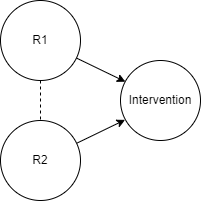
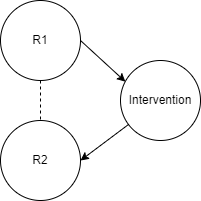
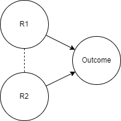
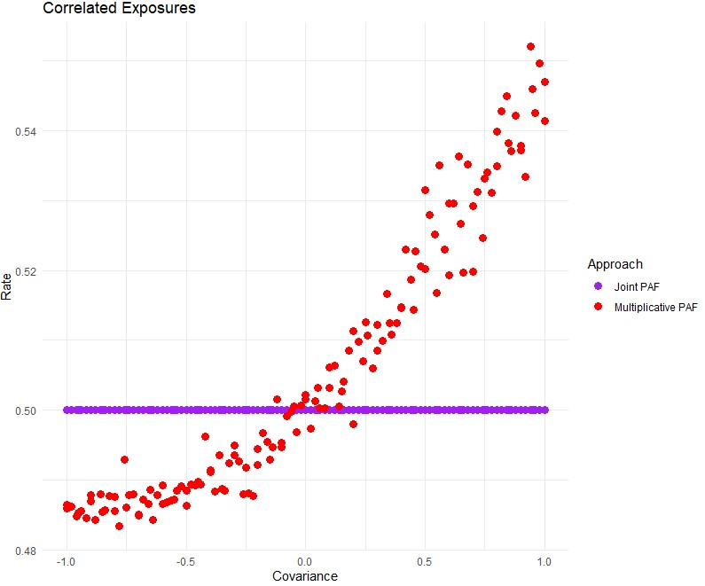

.. _risk_correlation:

================
Risk Correlation
================

.. contents::
  :local:

Background and motivation
-------------------------

At the individual level, risk exposures are frequently correlated.
Examples include high body mass index and high fasting plasma glucose,
tobacco smoking and alcohol use, and childhood height and weight.

Usually, Vivarium assigns each risk exposure independently to simulants, such that
each one follows the desired population-level univariate distribution, which frequently comes from GBD.
In the common case of a dichotomous exposure, this means that each simulant (in the same age/sex/location group) has the same
probability of exposure, which is equal to the prevalence in that population.

The correlation of risk exposures can be important to simulation results,
especially when the risks affect the same outcome, when results are stratified
by one of the risks, and/or when interventions are targeted based on one
of the risks.

.. todo::
  Add a more detailed description of when to include risk correlation, including
  which results are biased by the omission of a risk correlation and
  how to assess size/acceptability of the bias.

.. _risk_correlation_when_important:

When modeling risk correlation may be important
------------------------------------------------

There are certain situations in which correlation between modeled risk factors is important to include
in our simulations to avoid biased results. Assessing whether failure to consider correlation between
modeled risk factors will result in bias depends on the independent (most often intervention coverage) 
and dependent variables (most often DALYs averted) in the research question at hand and how the 
correlated risks relate to those variables. Further, in addition to assessing whether failing to 
consider the correlation between modeled risk factors will cause biased model results, it is also
important to consider the expected magnitude of that bias, as small biases may be acceptable model
limitations.

There are three common situations in which modeling correlation between two risk factors may be 
important in our simulations, including:

1. When there is correlation between two factors that each influence eligibility for the intervention. 
In this situation, modeling the correlation between these risks will influence the proportion of the 
population who is eligible to receive the intervention.

2. When a risk that influences intervention eligibility is correlated with a risk affected by the 
intervention. In this situation, modeling the correlation between these risks will influence the risk 
profile of the population who receives the intervention, thereby influencing the potential impact of 
the intervention (given that the intervention will presumably have a greater impact when delivered to 
a higher-risk population).

3. When there is correlation between two risks that affect the same outcome. In this situation, the 
correlation between these risks will influence the PAF calculation of these risks on the outcome, as 
discussed later on this page. If an intervention affects R1 and/or R2 in this situation, the 
estimation of the impact of the intervention on the outcome will also be affected.

The `Jupyter notebook linked here <https://github.com/ihmeuw/vivarium_research/blob/af1dd1706c617a12364f7bd8e9a9015c03411d43/docs/source/model_design/vivarium_model_components/risk_factors/risk_correlation/bias_quantification.ipynb>`_
contains more details on each of these situations and provides functions to estimate
the potential magnitude of bias associated with failing to consider the correlation between
risk factors may have that can be applied/adapted to specific research questions in order
to aid in determining whether to model risk-risk correlation in a vivarium simulation.

.. todo::

  Link to future page on residual confounding?

Risk exposure correlation
-------------------------

Instead of sampling from a univariate distribution for each risk exposure at initialization,
Vivarium can sample multiple exposures simultaneously from a multivariate distribution.
For example, given a correlation coefficient between two continuous exposures, it can sample from a bivariate normal distribution
instead of two independent univariate normal distributions.
Or, it can sample one of the exposures first and then sample a second categorical exposure
using probabilities conditional on the first exposure (as in
`this example from the IV iron simulation <https://vivarium-research.readthedocs.io/en/latest/models/risk_exposures/maternal_bmi_hgb/index.html#vivarium-modeling-strategy>`_).

We generally cannot get multivariate distributions from the GBD;
instead, we seek out auxiliary data sources.
These may report summary statistics such as a correlation coefficient, or
have full microdata we can use to summarize the joint distribution ourselves.
No matter how we characterize the relationship, we prefer to continue to validate to the GBD risk exposure distributions,
since we trust them more than any single data source.
One way to do this is to extract (a summary of) the joint distribution's `copula <https://en.wikipedia.org/wiki/Copula_\(probability_theory\)>`_ from the
auxiliary data source and combine that copula with the univariate distributions from GBD -- more on this in the next section.

This plot shows data from a joint distribution reflecting the variance and covariance between height and weight for infants at age one month using
data from a cohort study.
The top panel shows the values for the height and weight z-scores and the bottom panel shows the quantile ranks (propensity values)
within the distributions -- i.e., the bottom panel shows the copula of the joint distribution.

.. image:: gaussian_copulae.jpg

Maintaining correlation over time
---------------------------------

Maintaining the correlation is tricky when the risk exposures for a single simulant change over time.
In general, we have done this by sampling correlated *quantile ranks* at initialization and then keeping those *quantile ranks*
static throughout a simulant's life.
These quantile ranks, also known as propensities, are applied to different distributions as the simulant changes age group,
which means that a simulant's risk exposure in one age group and the next are perfectly auto-correlated.

For example, a simulant might have their propensities for height and weight sampled at birth from a
bivariate distribution in which the two components are correlated and are each uniformly distributed (i.e., a bivariate `copula <https://en.wikipedia.org/wiki/Copula_\(probability_theory\)>`_).
If the simulant receives a propensity of 0.85 (85th percentile rank) in height and 0.80 (80th percentile rank) in weight,
they are initially assigned the height and weight values at those percentiles among newborns.
But when they age into the next age group, they are assigned the values at those same percentiles in their new
age group, and so on throughout their life.
In this way, their height and weight can change over time, but the correlation introduced in the initial sampling
of propensities remains.

PAFs for correlated risks
-------------------------

When we introduce correlation between two risk factors that have effects on the same outcome, we have to
be especially careful about calculating the amount of that outcome attributable to these risks.

One way to think about this is in terms of the population attributable fraction (PAF), which is defined as the proportion of
the outcome that would disappear if everyone in the population was at the lowest-risk level of the risk
exposure -- also known as the theoretical minimum risk exposure level (TMREL).
We want to determine the "joint" PAF of our two correlated risk factors -- the proportion of
the outcome that would disappear if everyone in the population was at the lowest-risk level of **both**
risk exposures.

By default, Vivarium uses GBD-calculated PAFs for each risk-outcome pair and combines them using
a multiplicative approach (described below).
This is correct when risks are all independent, but it has two problems in the presence of correlated risks:

* The GBD approach to calculating PAFs is biased in the presence of any confounding,
  **even though the relative risks are adjusted for confounding**.
  This issue is explained in more detail :ref:`on the PAFs page <pafs>`.
  If we are choosing to model correlated risk exposures with effects on the same outcome,
  that means we believe there is **at least** one confounding variable in each PAF calculation.
  If risks (with RR > 1) are positively correlated, the GBD approach will underestimate the PAF of each.
* The multiplicative approach to combining PAFs (which is also used within GBD to calculate joint PAFs, e.g. for higher-level causes)
  does not take into account the fact that positively correlated risks will have more overlap in their attributable
  burden than uncorrelated risks.
  If risks (with RR > 1) are positively correlated, the multiplicative combination approach will overestimate the joint PAF.
  This issue is explained in more detail in the next section.

These issues cut in opposite directions, but they do not cancel each other out.
While they could be addressed individually, it is much simpler
to directly calculate the joint PAF from information about the joint distribution of risk exposures.
Methods to do this are described in the "Calculation of joint PAFs in presence of correlation" section.

Multiplicative PAF combination approach (Vivarium default)
^^^^^^^^^^^^^^^^^^^^^^^^^^^^^^^^^^^^^^^^^^^^^^^^^^^^^^^^^^

Each individual risk-outcome pair has a PAF that represents a counter-factual:
the proportion of the outcome that would be eliminated if that risk was reduced to the TMREL.
However, it is important to note that for two risks on the same outcome, **there is overlap in
the attributable burden**.
This can be seen most clearly when two risks each have a PAF >50% for the same outcome.
It is not possible to eliminate >100% of the burden, but there is nothing contradictory about
the PAFs summing to >100% because some of the same burden eliminated by setting one risk to its TMREL
would also be eliminated by setting another risk to its TMREL.

The multiplicative approach to calculating a joint PAF from the PAFs of two risk-outcome pairs
is simple and acknowledges that overlap is possible, ensuring that the resulting joint PAF is bounded by 0 and 1:

.. math::
  PAF_{r1,r2 \rightarrow O} = 1 - (1 - PAF_{r1 \rightarrow O}) * (1 - PAF_{r2 \rightarrow O})

GBD uses this approach when aggregating PAFs.

Vivarium also uses this approach by default when there are multiple risk effects on the same outcome.
This is consistent with our usual default that risk factors are uncorrelated with each other, but **when
we introduce correlation into the simulation, we should never use the multiplicative approach, or the
population-level outcome will not validate to the GBD estimate.**

Example
"""""""

To see why, let's consider the extreme case of two perfectly correlated dichotomous risk exposures.
50% of the population is exposed to both r1 and r2, and 50% is exposed to neither.
Each risk exposure has an RR of 2 on the incidence rate of disease X.

In this example, we assume that there are no *additional* confounders besides r1 and r2 --
if there are other risk factors on the incidence of disease X, they are uncorrelated with r1 and r2.
We also assume no effect modification/there are no interaction effects, which is a common assumption
in our simulations.
This means that the incidence rate of disease X for a specific simulant is :math:`X = X_{unexposed} * RR_{r1} * RR_{r2}`,
where :math:`RR_{r1}` and :math:`RR_{r2}` are the relative risks of the simulant's r1 and r2 exposures respectively,
and :math:`X_{unexposed}` is the incidence rate when unexposed to both risks.

For this example, suppose :math:`X_{unexposed}` is 0.01 per person-year.
Because half of the population is unexposed to both risks and has a rate of 0.01/person-year and the other half
is exposed to both risks and has a rate of 0.01 * 2 * 2 = 0.04/person-year, the population rate is 0.025.

If you were to set everyone to be unexposed to r1, the first group would be unaffected, since they were already
unexposed to both risks.
The second group would now only be exposed to r2 and have a rate of 0.01 * 1 * 2 = 0.02/person-year.
Therefore, the population rate would be 0.015.

The **true** PAF (not using the GBD approach to PAF calculation, which we consider a separate source of bias)
of r1 on X is:

.. math::
  PAF_{r1 \rightarrow X} = \frac{0.025 - 0.015}{0.025} = 0.4

The PAF of r2 on X is the same, because the situation is symmetrical between the two risks.

If you were to set everyone to be unexposed to both risks, the population rate would be 0.01, since
everyone would now have the :math:`X_{unexposed}` rate.
Therefore, the true joint PAF is :math:`\frac{0.025 - 0.01}{0.025} = 0.6`.
However, when we calculate the multiplicative PAF using the individual PAFs:

.. math::
  PAF_{r1,r2 \rightarrow X} = 1 - (1 - 0.4) * (1 - 0.4) = 0.64

This discrepancy is because the risk effects are multiplicative (relative risks) and not additive (risk differences).
Setting one risk to its TMREL at a time, we eliminate 40% of the incidence.
However, when we set r2 to its TMREL *having already set r1 to its TMREL* we do not eliminate as
much of the incidence.
The incidence among those exposed to r2 has already been *disproportionately* decreased,
because that group is identical to those exposed to r1,
and a 40% reduction in this decreased incidence has less absolute effect than a 40% reduction in the original incidence.

.. note::
  Even if we use additive risk differences, this problem does not entirely go away, at least if we enforce that a rate
  cannot be negative.

.. todo::
  Add a generalized version of this example showing that the multiplicative approach is always an overestimate of PAF.

Total bias
^^^^^^^^^^

Since the bias discussed in the previous section causes an overestimate of the joint PAF (for positively-correlated, RR > 1 risks),
and the :ref:`bias in the GBD calculation method for individual PAFs in the presence of confounders <pafs>`
causes an underestimate of each PAF (for positively-correlated, RR > 1 risks),
it is reasonable to wonder if these factors cancel each other out and lead to accurate PAFs.

Anecdotally, bias in the GBD calculation method for individual PAFs is typically
on the order of 10%-20%, as reported on :ref:`the PAFs page <pafs>`.
In the example above of bias from multiplicative combination, we found a
6.7% overestimated PAF.

Proof that biases do not cancel out, given some assumptions
"""""""""""""""""""""""""""""""""""""""""""""""""""""""""""

If we assume that there is no effect modification/there are no interaction effects,
as we typically do, **and** we assume that there are no *additional* confounders besides
r1 and r2,
these effects **do not** cancel out.
Under these conditions, the bias in the calculation of the individual PAFs is always greater,
leading to an overall underestimate.

In this situation, the true population attributable fraction for the combined effect of two risk factors,
:math:`r1` and :math:`r2`, on an outcome :math:`O` such as a mortality rate is:

.. math::
  O = O_{tmrel} * RR_{r1} * RR_{r2}

.. math::
  PAF_{true} = \frac{E(O) - E(O_{tmrel})}{E(O)} = 1 - \frac{O_{tmrel}}{E(O_{tmrel} * RR_{r1} * RR_{r2})} = 1 - \frac{1}{E(RR_{r1} * RR_{r2})}

where :math:`O_{tmrel}` is a constant representing the outcome (e.g. incidence rate) among those at the
theoretical minimum risk exposure level for both risk factors.

In the default configuration of Vivarium, using GBD PAFs with the multiplicative approach:

.. math::
	PAF_{vivarium} = 1 - (1 - PAF_{r1}) * (1 - PAF_{r2}) = 1 - \frac{1}{E(RR_{r1})} * \frac{1}{E(RR_{r2})}

When :math:`RR_{r1}` and :math:`RR_{r2}` are independent, :math:`E(RR_{r1}) * E(RR_{r2}) = E(RR_{r1} * RR_{r2})`
so :math:`PAF_{true} = PAF_{vivarium}`.
When :math:`RR_{r1}` and :math:`RR_{r2}` have positive covariance (e.g. if the risk exposures are positively correlated
and have RR > 1), :math:`E(RR_{r1}) * E(RR_{r2}) < E(RR_{r1} * RR_{r2})`,
so :math:`PAF_{true} > PAF_{vivarium}`.
The reverse is true with negative covariance.
The bias gets larger the more correlated the risks are, and the larger the true PAF is.

Below is an example of how the population-level rate from GBD (0.5 in this case) will not match our simulation
result when two normally-distributed risk factors with RR > 1 are correlated
(have non-zero covariance) and the default Vivarium method for calculating the joint PAF is used.
On the right side of this graph, the PAF is underestimated, which means that the population-level rate is overestimated.
The overestimate of the rate, as a proportion of the true rate, is :math:`\frac{PAF_{true} - PAF_{used}}{1 - PAF_{true}}`.

.. todo::
  Replace this example with Python, in a form we can easily re-run (e.g. Jupyter notebook) and where
  the parameters used are documented.
  The R code (incomplete and untested) is at :download:`correlated_exposures_sim.R`.

.. todo::
  More work on the relationship between PAF error and outcome
  error is in :download:`this document <Why_is_getting_the_paf_right_.pdf>`.
  This should be merged into the contents of this page when we get more rigorous about quantifying these biases.

.. _joint_paf_calculation:

Calculation of joint PAFs in presence of correlation
^^^^^^^^^^^^^^^^^^^^^^^^^^^^^^^^^^^^^^^^^^^^^^^^^^^^

Instead of the default Vivarium approach, in the case of correlated risk factors it is simplest to
directly estimate :math:`E(RR_{r1} * RR_{r2})` using our joint distribution between
:math:`r1` and :math:`r2`.
This generally needs to be performed for each combination of age, sex, and location.
We can then calculate the joint PAF, again assuming that there is no effect modification
and no *additional* confounders:

.. math::
  PAF_{r1,r2 \rightarrow O} = 1 - \frac{1}{E(RR_{r1 \rightarrow O} * RR_{r2 \rightarrow O})}

.. todo::
  Is this usually/always calculated within the simulation, or is it sometimes done on the research side?
  Is there shared code or components that implement this on the engineering side?
  If the latter were true, we could simplify this section to "tell engineering to use the correlation-corrected
  joint PAF calculation" and put the mathematical details in the documentation for that shared code.

For two categorical risks, the value is:

.. math::
  E(RR_{r1} * RR_{r2}) = \sum_{v1 \in r1}\sum_{v2 \in r2}{p(v1, v2) * RR_{r1}(v1) * RR_{r2}(v2)}

where :math:`p(v1, v2)` is the PDF of the joint distribution.

For two continuous risks with RRs **per unit increase** the value is:

.. math::
  E(RR_{r1} * RR_{r2}) = \int_{r1} \int_{r2} p(r1, r2) * (RR_{r1})^{(r1 - \text{tmrel}_{r1})} * (RR_{r2})^{(r2 - \text{tmrel}_{r2})} dr1 dr2

This can be approximated by sampling from the joint distribution, calculating
:math:`RR_{r1}(v1) * RR_{r2}(v2)` for each pair of exposures drawn, and taking the average
of those values.

This approach extends naturally to a group of more than 2 correlated risk factors.
If all factors are categorical and the number of categories is low enough to make it feasible, you could calculate:

.. math::
  E(\prod_{r \in R}{RR_{r}}) = \sum_{v \in R_1 \times R_2 \times ...}{p(v) * \prod_{r \in R}{RR_{r}(v_r)}}

or you could sample from the joint distribution, calculate :math:`\prod_{r \in R}{RR_{r}(v_r)}`
for each set :math:`v` of exposure values drawn, and take the average of those values.

For more details on the calculation of PAFs in the presence of correlated risks,
see `this example from the BEP project <https://github.com/ihmeuw/vivarium_research_bep_notebooks/blob/main/Correlation/2020_02_11a_correlation_and_paf.ipynb>`_.