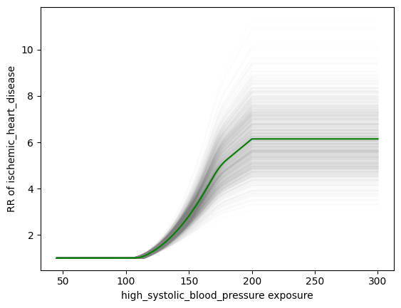

.. _models_risk_effect:

=====================
Risk Effects
=====================

.. contents::
  :local:

What is a risk effect?
++++++++++++++++++++++

A risk effect is a measure of how some variable (the risk factor) causally impacts
some outcome variable. 

Generally, we will use risk effects models to represent 
a causal effect of one variable on another and 
:ref:`risk correlation models <risk_correlation>` to represent *non-causal* 
associations between two variables (see the :ref:`causality <general_dags>`
documentation page for more information on causality). It is important to note
that for any two variables that are causally related to one another, there is 
likely also additional non-causal correlation between them through additional
variables and shared common causes.

There are several attributes of a risk effect that are important to consider, 
including the 

- direction (ex: positive or negative effect of increased exposure), 
- shape (ex: linear, U-shaped, etc.), 
- magnitude (ex: large or small), 
- and statisical certainty 

of the effect the risk factor has on the outcome. 

The risk effect may be measured in both absolute (ex: risk difference) or 
relative terms (ex: relative risk). See the 
:ref:`measures of risk page <measures_of_risk>` for more 
information on such measures.

To implement a risk effect in simulation we also need to know how to
*delete* that effect from baseline population-level rates of the outcome.
This is done with a :ref:`measure of population impact <measures_of_impact>`.

Risk effect in GBD
^^^^^^^^^^^^^^^^^^

GBD reports risk effects using relative risks (RRs) and population attributable fractions (PAFs).
A relative risk describes the *multiplier* on the risk of the outcome
caused by exposure.

For GBD risk factors with categorical risk exposures,
GBD reports an estimated relative risk for each level of risk exposure,
relative to the TMREL for that risk.

For most GBD risk factors with continuous risk exposures (see below for exceptions starting in GBD 2021),
GBD reports an estimated relative risk *per unit increase* in risk exposure above the TMREL.
This unit increase may be more than a single unit change in risk
exposure, so it is important to clarify this with the GBD modeler.

.. todo::

    Determine if there is a data source that documents these units

GBD risk effects are typically estimated by meta-analysis of epidemiologic studies that assess
how different levels of :ref:`risk exposures <risk_exposure>` affect some 
outcome variable such as an incidence or mortality rate.
There are several factors that may bias the quantification of a risk effect
in epidemiologic studies (including influence by confounding), 
and causal inference from such studies may be inhibited by such limitations.
See the page on :ref:`causality <general_dags>` for more information on the topic.

The GBD-estimated relative risks are assumed to represent the *causal* effect of the 
risk on the outcome, as they are calculated in the absense of confounding factors and 
the evidence is assessed to ensure it meets criteria for causality.
See the :ref:`causality documentation page <general_dags>` for more information 
on the topic. GBD has begun to quantify the quality of evidence for causality between
risk-outcome pairs they model in an effort termed "the burden of proof," summarized
in publications such as [Zheng-et-al-2022]_ and 
`this webpage <https://vizhub.healthdata.org/burden-of-proof/>`_. Additionally, the 
GBD-estimated relative risks represent the *total* effect of the risk on the outcome, 
including any mediated effects. See the :ref:`mediation documentation page <risk_mediation>` 
for more information on the topic.

While relative risks in GBD are typically age- and sex-specific, they are assumed 
not to vary by location or year. GBD applies risk effects to either YLDs, YLLs, or both.
Importantly, a risk factor could affect YLDs due to a given condition by affecting
its incidence rate, remission rate, or severity of disease. Therefore, it is important
to discuss reasonable assumptions with subject matter experts to determine the
most appropriate measure to which to apply the GBD risk effects in our vivarium
simulations.

Starting in GBD 2021, some continuous risk exposures were modeled with general
relationships between the exposure level and the relative risk (going
beyond the log-linear relationship assumed for previous iterations).
Interpreting the GBD estimates is straightforward, once you have
chased down all of the necessary definitions.  The relevant estimates
include a column for exposure level, as well as columns for 500 draws
of relative risk values at each exposure level.
These represent points on the continuous curve, which can then be approximated
by interpolating these points.
The GBD 2021 PAF
calculator often selected a TMREL for each draw from a uniform
distribution, but for some risk factors, analysts provided draws for
the TMREL as well.  The precise calculation to go from exposure levels
and GBD-recorded risks to a function suitable for use as
:math:`f_{rr}` as defined below are perhaps most clearly represented
as python code:

.. code-block:: python

  import numpy as np
  import scipy.interpolate
  import matplotlib.pyplot as plt
  import gbd_mapping, vivarium_gbd_access.gbd

  # Replace with your risk of interest
  risk = gbd_mapping.risk_factors.high_systolic_blood_pressure
  # Replace with your cause of interest
  cause = gbd_mapping.causes.ischemic_heart_disease
  age_group_id = 20 # 75 to 79
  sex_id = 1 # Male
  year_id = 2021

  relative_risk_data = vivarium_gbd_access.gbd.get_relative_risk(
      risk.gbd_id,
      1, # Global
      year_id=year_id,
  )

  # Subset to cause, age, and sex of interest
  # If interested in multiple, would loop through them
  relative_risk_data = relative_risk_data[
      (relative_risk_data.cause_id == cause.gbd_id) &
      (relative_risk_data.age_group_id == age_group_id) &
      (relative_risk_data.sex_id == sex_id)
  ].sort_values('exposure')

  relative_risk_functions = {}

  # Do calculation at the draw level
  for draw_id in range(1_000):
      relative_risk_draw = relative_risk_data[f'draw_{draw_id}']
      # interpolate a continuous function between the points,
      # and extrapolate outside the range with the endpoints
      raw_relative_risk_function = scipy.interpolate.interp1d(
          relative_risk_data.exposure,
          relative_risk_draw,
          kind='linear',
          bounds_error=False,
          fill_value=(
              relative_risk_draw.min(),
              relative_risk_draw.max(),
          )
      )

      # pick a tmrel between tmred.min and tmred.max and calculate relative risk at tmrel
      # for certain risk factors, the modeling team uploads a model for this with TMREL draws --
      # those should be used instead of this, when available!
      tmrel = np.random.uniform(risk.tmred.min, risk.tmred.max)
      rr_at_tmrel = raw_relative_risk_function(tmrel)
      normalized_relative_risk_draw = relative_risk_draw / rr_at_tmrel

      # This clipping is what the GBD PAF calculator does, but it is not clear that it makes
      # sense conceptually.
      # A single risk factor can have positive (protective) and negative (harmful) effects on
      # different causes, and the TMREL can then be a balance between them, which doesn't necessarily
      # imply it is the ideal exposure when looking at either cause individually.
      # TODO: Revisit this.
      clipped_normalized_relative_risk_draw = np.clip(normalized_relative_risk_draw, 1.0, np.inf)

      relative_risk_function = scipy.interpolate.interp1d(
          relative_risk_data.exposure,
          clipped_normalized_relative_risk_draw,
          kind='linear',
          bounds_error=False,
          fill_value=(
              clipped_normalized_relative_risk_draw.min(),
              clipped_normalized_relative_risk_draw.max(),
          )
      )

      relative_risk_functions[draw_id] = relative_risk_function

  # Plot the relative risk functions
  x_values = np.linspace(relative_risk_data.exposure.min() * 0.5, relative_risk_data.exposure.max() * 1.5, 500)
  mean = np.zeros_like(x_values)

  for i, function in enumerate(relative_risk_functions.values()):
      y_values = function(x_values)
      plt.plot(x_values, y_values, color="gray", alpha=0.01)
      mean += y_values

  mean = mean / len(relative_risk_functions)
  plt.plot(x_values, mean, color="green")
  plt.gca().set_xlabel(f'{risk.name} exposure')
  plt.gca().set_ylabel(f'RR of {cause.name}')
  plt.show()

This code generates a separate function/curve for each *draw*, as seen in the plot:

We've validated that using this approach, we can get approximately the same result
as the GBD PAF calculator.
The relevant code in the PAF calculator is `on Stash <https://stash.ihme.washington.edu/projects/CCGMOD/repos/ihme_cc_paf_calculator/browse/src/ihme_cc_paf_calculator/lib/math.py>`_;
the clipping is implemented `here <https://stash.ihme.washington.edu/projects/CCGMOD/repos/ihme_cc_paf_calculator/browse/src/ihme_cc_paf_calculator/lib/math.py#171-207>`_.
This is demonstrated in `this notebook <https://github.com/ihmeuw/vivarium_data_analysis/blob/edae08c5f034efa84d33413b923b1edcdf692538/pre_processing/nonlinear_risk_factors/nonlinear_risk_salt_stomach_cancer.ipynb>`_.

Finally, it is important to note that because the GBD relative risks represent
the *causal* impact between and risk and an outcome, they cannot represent
the non-causal association between a given risk and an outcome or other risk factors.
Desired correlation between two variables will need to be accounted for separately; see
the :ref:`risk correlation page <risk_correlation>` for more details.

Risk effect in Vivarium
^^^^^^^^^^^^^^^^^^^^^^^

Materials related to risk effects models in Vivarium:

- :ref:`Existing risk effects models <risk_effects_models>`
- :ref:`Risk effect model document template <risk_effects_model_template>`

Generally, we will use risk effects models to represent *causal* associations
between two variables and risk correlation models to represent *non-causal*
associations between two variables in vivarium.

A risk effects model for a given risk-outcome pair must document:

- Relative risk as a function of risk exposure
- Instructions for how to delete the baseline effect,
  that is, the effect of the risk exposure on the outcome
  that is already baked into the baseline population-level rates of the outcome.

In vivarium, we build the risk-outcomes component in order to study the
impact of desired outcomes contributed by given risk exposure. The outcome might
be a cause (e.g. ischemic heart disease attributable to high body-mass index)
or a intermediate outcome (e.g. systolic blood pressure associated with BMI).
For a risk-cause pair, simulation model would link the incidence (or other measure
such as excess mortality rate) of that cause to the relative risk from GBD or
external data sources like literature evidence.

The mathematical expressions are mainly fall into two categories:
 - risk exposure is categorical distributed:
     - :math:`i_{exposed} = i \times (1-PAF) \times RR`
     - :math:`i_{unexposed} = i \times (1-PAF)`
     - :math:`PAF = \frac{E(RR_e)-1}{E(RR_e)}`
     - :math:`E(RR_e) = p \times RR + (1-p)`
 - risk exposure is continuous distributed:
     - risk effect has a log-linear "dose-response" relationship with exposure:
         - :math:`i_{\text{simulant}} = i \times (1-PAF) \times rr^{max(e_{\text{simulant}}-tmrel,0)/scalar}`
         - :math:`PAF = \frac{E(RR_e)-1}{E(RR_e)}`
         - :math:`E(RR_e) = \int_{lower}^{upper}rr^{max(e-tmrel,0)/scalar}p(e)de`
     - risk effect has a non-log-linear relationship with exposure:
         - :math:`i_{\text{simulant}} = i \times (1-PAF) \times f_{rr}(e_{\text{simulant}})`
         - :math:`PAF = \frac{E(RR_e)-1}{E(RR_e)}`
         - :math:`E(RR_e) = \int_{lower}^{upper}f_{rr}(e)p(e)de`

Where,
 - :math:`e` stands for risk exposure level
 - :math:`i` stands for incidence rate
 - :math:`p` stands for proportion of exposed population
 - :math:`RR` stands for relative risk or incidence rate ratio
 - :math:`PAF` stands for population attributable fraction (:ref:`described in detail here <measures_of_impact>`)
 - :math:`E(RR_e)` stands for expected relative risk at risk exposure level e 
 - :math:`tmrel` stands for theoretical minimum risk exposure level
 - :math:`lower` stands for minimum exposure value
 - :math:`upper` stands for maximum exposure value
 - :math:`rr` is the base of the exponent in an exponential relative risk model
 - :math:`scalar` is a numeric variable used to convert risk exposure level to 
   a desired unit
 - :math:`p(e)` is probability density function used to calculate the probability 
   of given risk exposure level e
 - :math:`f_{rr}(e)` is function capturing the relationship between the exposure level and the relative risk at that exposure level (for log-linear relative risks, :math:`f_{rr}(e) = rr^{max(e-tmrel,0)/scalar}`)
   of given risk exposure level e

We can refer to the outcome rate multiplied by (1 - PAF) as the "risk-deleted outcome rate."

Using RRs and PAFs from GBD
---------------------------

While GBD reports RRs and PAFs, they are often not suitable for use in Vivarium models.
This is because we typically model GBD causes as dynamic state-transition models,
and are interested in applying RRs and PAFs to *transitions* in the model.

GBD reports RRs and PAFs for years of life lost (YLLs) and years lived with disability (YLDs).
YLLs are the number of deaths (due to a cause) multiplied by the average remaining life expectancy
(which is a constant for a given age and sex group).
YLDs are the number of prevalent cases of a cause multiplied by the disability weight
of that cause, which is a constant for a given cause.
Therefore

.. math::

  RR_\text{prevalence} = RR_\text{YLDs}

  PAF_\text{prevalence} = PAF_\text{YLDs}

  RR_\text{CSMR} = RR_\text{YLLs}

  PAF_\text{CSMR} = PAF_\text{YLLs}

where CSMR is the cause-specific mortality rate for a given cause.

However, if we have a dynamic SIS model for a cause, we are interested in applying risk effects to
the transitions in this diagram:

.. graphviz::

  digraph {
    rankdir=LR
    node [shape=box]
    S [label="Susceptible"]
    I [label="Infected"]
    D [label="Dead"]
    S -> I [label="Incidence rate"]
    I -> S [label="Remission rate"]
    I -> D [label="Excess mortality rate"]
  }

The RR and PAF we have on prevalence (aka the number of people in the infected state)
might apply to either of the incidence and remission rates, or some combination.
Intuitively, the fact that more people with the risk exposure have the disease might be because
more of them *get* the disease, or because it takes longer for them to *recover* from it.

.. note::

  Technically, mortality also matters: if the risk exposure causes people to die more quickly
  if they have the disease,
  that will lower the effect of the risk exposure on prevalence (since people who die are no
  longer prevalent cases).
  However, this effect is small when the mortality rate overall is small.
  See TODO below to make this precise.

We typically apply the risk effect to the incidence rate, but this is a modeling choice.
With this choice:

.. math::

  RR_\text{remission} = 1

  PAF_\text{remission} = 0

  RR_\text{incidence} = RR_\text{prevalence}

  PAF_\text{incidence} = PAF_\text{prevalence}

The RR and PAF we have on CSMR doesn't directly fit anywhere into our diagram, because CSMR is a mortality rate among
the total population, and our mortality transition only applies to the infected population.
Intutively, the CSMR measures *overlap* with the prevalence measures; there could be more deaths among
people with the risk exposure because they are more likely to have the disease, even if
they are no more likely to die from it once they have it.

We've developed a simple equation to adjust the CSMR RR to apply to the excess mortality rate:

.. math::
  
  RR_\text{excess mortality} = \frac{RR_\text{CSMR}}{RR_\text{incidence}}

The PAF has no such closed-form solution, so should be recalculated from the new RR
using equations above (see also :ref:`joint_paf_calculation` for a more explicit description
of this process, including the note about not yet having a standard computational approach
to calculating our own PAFs).

.. todo::

  Make this precise.
  I believe that this is heuristic and not quite correct.
  The :ref:`child growth failure risk effects page <2021_risk_effect_cgf>` includes a notebook that approximately checks it
  numerically, and a Word document that concludes with an "almost identical"
  equation that seems importantly different.
  Also, the Word doc appears to be about a risk factor that affects mortality,
  rather than a risk factor that affects a disease that affects mortality?
  So I think something has been lost here.
  See https://jira.ihme.washington.edu/browse/SSCI-2160.

.. todo::

    Add a note about bias this introduces...

        PAF relies on exposure in the population, not the "at-risk" group for the outcome. This bias is larger when the at-risk population is small relative to the total population.

        But maybe this belongs in the PAF section?

    Relevant ticket in backlog: https://jira.ihme.washington.edu/browse/SSCI-1152

Restrictions
^^^^^^^^^^^^

As with cause models, risk effects models may include restrictions, which answer
the questions: Who does this apply to? For which population groups (e.g., age or sex group)
is this risk effect not valid? 

It is worth noting that although risk effect and risk exposure both are related to risk factors,
restrictions for these two elements function differently. Risk exposure restrictions do
not include outcome restrictions (i.e., YLL only or YLD only), however risk effect
restrictions do. Due to the nature of the relationship between risk exposure and risk 
effects, risk effects restrictions will always be within restrictions for risk exposure. 
To illustrate, if a risk exposure restriction for a given risk factor is male only, then 
the risk effects model will also be restricted to male only. 

For example, GBD 2019 modeled low-birthweight and short gestation (LBWSG) relative
risks with age and outcome restrictions. See the table below for details. 

.. list-table:: Age, Sex, and Outcome Restrictions for LBWSG Relative Risks in GBD 2019
  :widths: 15 15 20
  :header-rows: 1

  * - Restriction Type
    - Value
    - Notes
  * - Male only
    - False
    -
  * - Female only
    - False
    -
  * - YLL only
    - True
    - Except for Neonatal preterm birth; see :ref:`note <note_on_preterm_birth_DALYs>` below
  * - YLD only
    - False
    -
  * - Age group start
    - Early neonatal (0-7 days, age_group_id = 2)
    -
  * - Age group end
    - Late neonatal (7-28 days, age_group_id = 3)
    - Except for Neonatal preterm birth; see :ref:`note <note_on_preterm_birth_DALYs>` below

.. _note_on_preterm_birth_DALYs:

.. note::

  GBD attributes 100% of the DALYs due to Neonatal Preterm Birth to the LBWSG
  risk factor. In particular, the attribution includes YLDs as well as YLLs, and
  the age restrictions for the LBWSG-attributable DALYs are the same as the age
  restrictions for Neonatal Preterm Birth.

  * **YLLs due to Neonatal preterm birth**, 100% attributable to LBWSG:

    - Age group start = 2 (Early neonatal, 0-7 days)
    - Age group end = 5 (1 to 4)

  * **YLDs due to Neonatal preterm birth**, 100% attributable to LBWSG:

    - Age group start = 2 (Early neonatal, 0-7 days)
    - Age group end = 235 (95+)

  Note that this attribution of DALYs is **not** based on the relative risks for
  all-cause mortality, but instead is based on the logic that all preterm births
  are due to short gestation by definition. Thus, if we include Neonatal Preterm
  Birth in our models, the relative risks likely must be handled differently for
  this cause.

.. todo::

    Follow up about assumptions that GBD uses to apply relative risk to YLLs and
    YLDs.
