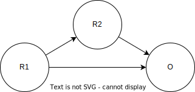
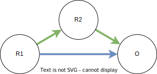
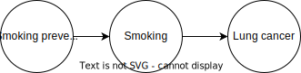
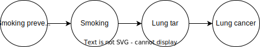
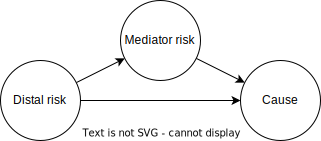

..
  Section title decorators for this document:
  
  ==============
  Document Title
  ==============
  Section Level 1
  ---------------
  Section Level 2
  +++++++++++++++
  Section Level 3
  ~~~~~~~~~~~~~~~
  Section Level 4
  ^^^^^^^^^^^^^^^
  Section Level 5
  '''''''''''''''

  The depth of each section level is determined by the order in which each
  decorator is encountered below. If you need an even deeper section level, just
  choose a new decorator symbol from the list here:
  https://docutils.sourceforge.io/docs/ref/rst/restructuredtext.html#sections
  And then add it to the list of decorators above.

.. _risk_mediation:

=========
Mediation
=========

.. contents::
  :local:

What is mediation?
------------------

In epidemiology, mediation is when an exposure (e.g. a risk factor or treatment)
has an effect on an outcome (e.g. incidence of a disease or mortality)
*through* a mediating factor.
For example, in this :ref:`causal diagram <general_dags>`, the risk factor R1 has an effect on the outcome O,
but that effect is (completely) mediated by another risk factor R2.

.. image:: mediation.drawio.svg

.. note::
  This diagram is so simple it may not always be described as "mediation."
  For example, on our :ref:`Causal Diagrams page <general_dags>` page we call this an
  :ref:`"intermediate." <general_dags_intermediates>`
  However, it can be useful to analyze this situation as a special case of mediation;
  for example, this
  causal structure of GBD risks would report a mediation factor
  (see :ref:`the GBD section <mediation_gbd>` for more on this).

.. note::

  In our work, we typically run into mediation with risk factors.
  Throughout this page, we will use risk factor examples.
  Most of this page would equally apply to other exposure/outcome pairs;
  only :ref:`the GBD section <mediation_gbd>` is specific to risk factors.

Such a simple situation doesn't pose any major modelling challenges.
To see how things can start to get tricky, consider this slight change
to the diagram:

Now, in addition to having an effect on R2, R1 has an effect on O *directly*.
This means that there are two causal **pathways** by which R1 affects O.
Here, the green arrows form the pathway mediated through R2, while the
blue arrow is the direct pathway:

Let's define some terms. Each pathway has an **effect**, which could be
expressed as e.g. a relative risk (RR).
This tells you how much the outcome O is affected *through that pathway*
when R1 increases.
For example, if the mediated (green) pathway in the diagram above had an RR
of 1.5, that would mean that each 1-unit increase in R1 would increase O by 50%
*via the mechanism of increasing R2*.
Note that this is distinct from either of the two effect arrows that make up
the pathway: one of these relates R2 to R1 and one relates O to R2, while the
**pathway**'s effect relates R1 all the way to O.
The pathway's effect is a kind of aggregation of the individual effects that make
it up: if R1 doesn't have much impact on R2, or if R2 doesn't have much impact on O,
the mediated pathway's effect will be small.

The **total effect** is the effect R1 has on O through all pathways.
When there is only one pathway, of course, this is the same as that pathway's effect.
In the example above, since there are two pathways, the total effect of R1 on O
is the *combination* of the effect via increasing R2 and the direct effect,
since increasing R1 will have *both* of those effects (assuming they don't
modify each other, which is our standard assumption and implicit throughout
this page).

Mediation can get more complex than this example. A pathway may pass through
several mediating factors (multi-layer mediation), and there may be
more than two pathways.

.. image:: mediation-complex.drawio.svg

In this diagram, there are *three* pathways by which R1 affects O:

* There is a pathway mediated through R2 *and* R3 (R1→R2→R3→O)
* There is a pathway mediated through R4 (R1→R4→O)
* There is a direct (unmediated) pathway (R1→O)

Modeling mediation can be tricky, *especially* when there are multiple
pathways.
It is critical to use the appropriate effect sizes
to avoid double-counting effects, and risk deletion also requires
special care in the presence of multiple pathways.
This page discusses how to approach these challenges.

What *isn't* mediation?
+++++++++++++++++++++++

The definition of mediation above may seem hopelessly broad.
For example, let's say we are making a simulation of smoking and
lung cancer. We start with this super simple causal diagram:

However, we could poke holes in this: smoking doesn't *directly*
cause lung cancer, because there are mediators/intermediates of this
effect. For simplicity let's say the effect is mediated completely by tar in the lungs,
so this causal diagram is a bit more accurate:

Does this mean we now have to model lung tar and seek out data about how
smoking affects lung tar, and how lung tar affects lung cancer? **No.**
When we talk about modeling mediation, we mean between **modeled**
factors.
**Just because a mediator is present in the real world does not mean it needs
to be modeled.**
It is perfectly fine to ignore mediators, as long as they don't need to
be modeled for some other reason (for example, being affected directly
by an intervention).

.. todo::

  We don't yet have very precise/rigorous guidance on when it is necessary
  to model a risk factor or cause.

  When we do, we should reference that here.

  Broadly speaking, a key question is: is this risk factor/cause on a causal
  pathway between an intervention (a thing we change between scenarios)
  and an outcome (a result we report as differing between scenarios)
  that *doesn't* pass through an already-modeled factor/pathway?

  Sometimes, we also model risk factors or causes when they aren't strictly necessary,
  because it is more convenient to find the relevant data
  (e.g. effect sizes of risk to mediator and mediator to outcome
  instead of risk to outcome directly).

Another way to think about this is that we *have* to ignore some mediators.
Even if we did model lung tar in the smoking example, we could just as easily
say that the effect of lung tar on lung cancer is mediated by DNA mutations
in lung cells, and so on.
It is also frequently the case that an effect has multiple mechanisms.
By increasing the detail of the causal diagram, it is always possible to find
one or more mediators of any causal effect.

Since we can ignore one mediator, we can also ignore a cluster of mediators with arbitrary complexity,
so long as none of them need to be modeled:

.. image:: unnecessary-mediators.drawio.svg

The ignored mediator(s) will be implicitly included in any measured association between the risk and the outcome.

Therefore, we often construct causal diagrams that are sufficient
to answer our research questions without including any complex
mediation situations.

When do I need to model mediation?
++++++++++++++++++++++++++++++++++

Let's say there is definitely mediation in the real world between factors
that are (or must be) modeled in our simulation.
In some cases, it can still be an acceptable limitation to model only
some of the causal effects/pathways involved,
which can simplify our modeling process.

Very roughly speaking, if any of the effects involved are so small as to
be negligible, they can probably be excluded from the model without
introducing any large bias in the results.

.. todo::

  There are other scenarios where we intuitively feel that ignoring some causal effects
  (or modeling them as only a non-causal correlation) is a small/acceptable limitation.
  These mostly have to do with causal structures: how a particular effect
  does or doesn't fit into pathways between interventions and outcomes.
  We have yet to formalize this.

  A related (though different) question is explored :ref:`on the Risk Correlation page <risk_correlation_when_important>`.

Splitting and combining pathway effects
---------------------------------------

When we model multiple causal pathways between a risk and an outcome,
we need to watch out for double-counting effects.
If there are multiple pathways in the model, an estimate of the
total effect should not be used to inform the direct effect!
Instead, we have to split the total effect into its constituent
parts: the effect of each mediated pathway, with the direct effect
being whatever is left over.

.. note::

  The idea of "splitting" an effect fundamentally relies on the assumption
  that there is no effect modification, i.e. that the total effect is just
  applying each of the constituent effects in turn and that they don't
  amplify each other or interact more complexly.
  This is our standard assumption and is implicit throughout this page.

In our simulations to date, most causal pathways have had effects measured in RRs.
These are also called "log-linear" effects, since for each unit change in the independent
variable, there is a multiplicative factor applied to the dependent variable --
which is equivalent to a constant change in its *logarithm*.

Combining the effects of multiple pathways that each have RRs is straightforward.
We simply multiply the RRs of each pathway to determine the RR of the total effect.
Going back to this simple diagram:

we can say that

.. math::

  RR_\text{R1→O,total} = RR_\text{R1→O,direct} \times RR_\text{R1→R2→O}

This equation can be used in either direction, depending on what we have
data about.
If the total effect is known, we can split it;
if it is not known, we can infer what it is by combining
the effects of each pathway.

Another case in which combining and splitting are straightforward
is when all the pathways have additive, or "linear," effects.
These can simply be added to obtain the total effect.
For example, if a 1 unit increase in R1 in the diagram above caused a 2.2 unit increase in O
through R2, and also caused a 1.3 unit increase in O directly, the total
effect would be :math:`2.2 + 1.3 = 3.5` units of increase in O per unit increase in R1.

If pathways have different kinds of effect measures, it will generally not
be so easy to split or combine effects, and the combination of effects may not be invariant
with respect to the initial values of the risk exposures and outcome.

Splitting pathways in observational data
----------------------------------------

When we are extracting data from literature or other non-GBD sources,
those data will frequently be presented more in terms of how they were measured/calculated
than what they imply about causal relationships.
In these cases, we have to do a bit of causal inference to figure out how the
effect measures we are extracting map (or don't map) to arrows in our causal diagram.

When we use GBD, the causal interpretations of the results are more clearly given to us.
However, it can be useful to understand the process GBD used to arrive at these causal
interpretations from the source data, especially because in many cases we suggest
back-calculating some of the inputs to the GBD.
See the GBD section below for more about this.

Causal inference is quite a complex topic that we may write a dedicated page
about in the future; for now, we touch on a few key points relevant to mediation.

As always, experimental data (e.g. from an RCT) is the gold standard for determining causality.
And as always, it is very hard to come by.
In many cases it is simply impossible to isolate certain causal pathways by
experiment.
For example, consider this diagram.

The only way to experimentally isolate the direct pathway here would be to randomly
assign R1 exposures in such a way that they **don't** have their typical effect on R2.
Often, this link cannot be broken; when it isn't, the random assignment of R1 is separating
the total effect from non-causal associations such as :ref:`confounding <confounding>`, but can't split the
pathways within the total effect from each other.

The general rule of thumb for splitting pathways when they can't be split experimentally is:
an observed association adjusted for all confounders reflects the combined effects of all
pathways that do not contain a factor for which that association is adjusted.

Let's break this down.

* The "adjusted for all confounders" part is not specific to mediation: an observational association
  should be adjusted for any known confounders before it is interpreted as causal,
  as described in much more detail on :ref:`the page about confounding <confounding>`.
  The reason experimental evidence is the gold standard is that it adjusts for *all* confounders,
  known and unknown.
* If the association is adjusted *only* for confounders, it is simply a measure of the total effect.
* However, if the association is adjusted for some mediators in addition to all (known) confounders,
  each of the mediators it is adjusted for "blocks" the pathway(s) it is on.
  The association then reflects the combination (as described in the previous section) of all
  the *remaining/unblocked* pathways.
  If at least one mediator on every mediated pathway is adjusted for, all that is left is the direct
  pathway, and the association can be considered the direct effect.

It is key to understand that the definition of a "direct effect" depends on what mediators
we are modeling.
The direct effect arrow in our causal diagram should be informed by an association measure adjusted
for the mediators that we model, but *not* adjusted for mediators we do not model.

Combining this understanding with the simple cases of combining and composing log-linear and linear effects discussed
in the previous sections, we can say the following about an effect adjusted for the set of
mediated pathways :math:`M`:

.. math::

  RR_\text{r→o,adjusted for M} = \frac{RR_\text{r→o,total}}{\prod_{m \in M}{RR_\text{r→o, via m}}}

in the log-linear case, and

.. math::

  \Delta_\text{r→o,adjusted for M} = \Delta_\text{r→o,total} - \sum_{m \in M}{\Delta_\text{r→o, via m}}

in the linear case.

Composing pathway effects from individual causal effects
--------------------------------------------------------

While thinking in terms of causal pathways is helpful in analyzing how to split
or combine multiple pathways, the effect of an entire pathway
never appears in our simulation.
It is each individual link in the chain -- the causal effect between just two factors
at a time -- that we model.
Frequently, we will have data about the individual effects in the chain, and will want to calculate
the effect of the whole pathway.
We call this "composing" the effects, because it turns out that the way this works is
mathematical function composition.
(More rarely, we may start from a pathway effect and decompose it, which is the same
operation, just in reverse.)

We will discuss two common and easy cases here, and leave the more general principles
to be fleshed out in the future.

Case 1
++++++

.. image:: composition-case-1.drawio.svg

The first case is when there are two arrows in the pathway, and the first has a linear
effect (represented by a plus) while the second has a log-linear effect (represented by a multiplication symbol).
Or, equivalently, the first arrow is
described with an additive effect or delta, while the second arrow is described with
a multiplicative effect or RR.

The hollow downward arrow means that the top diagram is equivalent to the bottom
one.
In this case, if we think about the pathway as a single effect, that effect is
**multiplicative**.
Specifically, if the additive effect of R1→R2 is :math:`\Delta_\text{R1→R2}` and
the multiplicative effect of R2→O is :math:`\text{RR}_\text{R2→O}`,
then the pathway's RR is :math:`(\text{RR}_\text{R2→O})^{\Delta_\text{R1→R2}}`.

Intuitively, you can see why by imagining that the first, additive effect
is 2.
If R1 increases by one unit, R2 therefore increases by two units.
Increasing R2 by two units is the same thing as increasing it by one unit
*twice* -- so the log-linear effect of R2 on O gets applied twice.
:math:`O_\text{after} = RR_\text{R2→O} \times RR_\text{R2→O} \times O_\text{before}`,
so :math:`RR_\text{path} = \frac{O_\text{after}}{O_\text{before}} = (RR_\text{R2→O})^2`.
This is squared (power 2) because our delta is 2, and this result generalizes to any delta.

Case 2
++++++

.. image:: composition-case-2.drawio.svg

The second case is when there are two arrows in the pathway, and they both have linear
effects.

In this case, the effect of the pathway is **additive**. Specifically, if
the effect of R1→R2 is :math:`\Delta_\text{R1→R2}` and the effect of R2→O is
:math:`\Delta_\text{R2→O}`, then the pathway's additive effect or delta is the product:
:math:`\Delta_\text{R1→R2} \times \Delta_\text{R2→O}`.

Intuitively, you can see why by imagining that the first (additive) effect is 2.
If R1 increases by one unit, R2 therefore increases by two units.
Increasing R2 by two units is the same thing as increasing it by one unit
*twice* -- so the linear effect of R2 on O gets applied twice.
:math:`O_\text{after} = \Delta_\text{R2→O} + \Delta_\text{R2→O} + O_\text{before}`,
so :math:`\Delta_\text{path} = O_\text{after} - O_\text{before} = 2 \times \Delta_\text{R2→O}`.
This has coefficient 2 because our first (R1→R2) delta is 2, and this result generalizes to any delta.

Longer pathways
+++++++++++++++

These two building blocks can be used to reason about longer pathways.
In the following diagram, there are four individual causal links in the pathway,
but by repeated application of our second case above, we can compose the first
three into a single additive effect, which we can then compose with the final
multiplicative effect.

.. image:: composition-longer.drawio.svg

.. _mediation_gbd:

Risk-risk effects and mediation in GBD
--------------------------------------

.. todo::
  This section only covers mediation methods from GBD 2019.
  In GBD 2021, there are substantial added complications: risk effects
  can be arbitrary functions of the exposure, and not only log-linear RRs
  above a TMREL.
  We have yet to model any mediation using GBD 2021 but will need to expand this
  to cover new methods.

Framing
+++++++

GBD never models effects between causes, but it does model effects of risk factors
on causes, and some effects of risk factors on other risk factors.
These last two kinds of effects create the possibility of mediation in GBD:
when one risk factor affects another, which affects a cause in turn.
GBD calls the upstream risk factor the "distal risk."

GBD may model any number of mediators between a single risk factor-cause pair,
in addition to a direct effect.

.. note::

  GBD currently models every risk factor-mediator-cause triple separately,
  which means its results can imply multiple conflicting values for the same effect in
  this diagram, and that pathways are not always coherent --
  for example, there can be a triple A->B->C and a triple X->B->Y
  but no triple A->B->Y even though both of those arrows are implied
  by the other triples.

  We have yet to decide on a general strategy for how to deal with logical
  inconsistencies.

GBD does not directly report effect sizes for risk-risk effects, but it
does estimate them.
It models all risk-risk effects as linear, additive shifts.
That is, for each 1 unit increase in R1, there is a fixed amount by which R2 increases/decreases.
We (and GBD) refer to this effect size as a "delta" or :math:`\Delta_\text{r→m}`
where :math:`r` is the risk factor and :math:`m` is the mediator.
  
.. note::
  This only makes sense if both the distal risk and the mediator are continuous values.
  Since all of the mediation GBD has modeled so far has been between continuous
  risk factors, they haven't yet explored how to make different assumptions.

.. note::
  This ignores the concept of a TMREL below which the RR does not apply and risk
  is constant.
  This seems to be ignored throughout the GBD's descriptions of its mediation methods, although
  some risks that are mediators in GBD, such as BMI, clearly have non-zero TMRELs.

GBD also does not report **direct** risk-outcome effect sizes
that exclude effects through mediated pathways.
We can back-calculate both the risk-risk effect sizes and the direct effect sizes
from what the GBD does report, which are the total effect sizes
for each risk-cause pair
and a **mediation factor** for each risk-mediator-cause triple.

Mediation factors
+++++++++++++++++

A mediation factor is defined as the proportion of the *excess* risk between a risk and
a cause -- the amount the risk-cause RR is greater than 1 -- that is mediated by an intermediate risk.

In other words, a mediation factor describes how to decompose
a total RR between a risk and a cause into two parts: the RR of the pathway that goes through
the mediator in question, and the RR of all the other pathways combined.

Mediation factors for GBD 2019 and 2021 can be found `on this HUB page <https://hub.ihme.washington.edu/display/GBD2020/GBD+2021+Risk+factors+mediation>`_.
GBD mediation factors:

* Do not vary by location, age, sex, or year.
* Never exceed 1; if the calculated value is greater than 1 it
  will be truncated to exactly 1 (this truncation happens at the draw level).
* May be exactly 1 by definition, because
  there is no direct/unmediated effect.
  For example, lead exposure's effect on ischemic heart disease is entirely mediated by
  high systolic blood pressure, so the mediation factor for this triple is 1.
* May have draws where they are negative, which represents the direct pathway
  and the mediated pathway having different effect directions.
  However, if more than 50 of the 1,000 draws were negative, that mediation
  pathway was excluded from GBD.

.. note::
  Excluding when more than 50 of the 1,000 draws are negative is a kind of "significance" test.
  However, it assumes that a significant *negative* mediation factor
  (direct and mediated pathways have opposite effect directions) could never occur;
  therefore GBD never models such mediation situations.

Inconsistency with RR application
~~~~~~~~~~~~~~~~~~~~~~~~~~~~~~~~~

A key challenge with using GBD mediation results in simulation is that
**the excess risk approach to pathway effect splitting that GBD takes
is inconsistent with the multiplicative application of RRs.**

We can see this with a simple example.

Let's say GBD reports that R1 has an RR of 2.3 on O.
The standard RR reported by GBD is the **total effect**
through all pathways.
As we see in the diagram, some of this total effect goes through a direct
pathway, and some goes through a pathway mediated by R2.

A total RR of 2.3 implies an
*excess* risk of :math:`2.3 - 1 = 1.3`.
If GBD reported a mediation factor for this triple (where R1
is the distal risk, R2 is the mediator, and O is the cause)
of 0.538, the interpretation would be that the RR of the mediated
pathway is 1.7, since :math:`0.538 \times 1.3 \approx 0.7` is the
amount of the *excess* (above 1) risk that is assigned to that pathway.
Since there are no other mediators, the "rest" of the excess risk (0.6)
is assigned to the direct/unmediated pathway,
making the RR for the direct R1→O effect equal 1.6.

However, if we replicate all of this faithfully in our simulation,
we'll see something strange.
With the standard, default way we apply RRs, a simulant
who has a 1-unit increase in R1 will end up getting their value
for O multiplied by the RRs for *both* pathways.
Whatever their value before the R1 increase, it will be
:math:`1.7 \times 1.6 = 2.72` times as high afterwards --
which is significantly more than the 2.3 total RR we started with!

Unfortunately, this fundamental inconsistency between GBD mediation
and how RRs are applied means that we need to choose whether to
validate to the total effects reported by GBD or to match the mediation factors
(assuming we don't change how we apply RRs).
In the past we have tended to apply the mediation factors as designed,
but going forward we advise preferring to validate to the total effects by
using an undo-then-redo approach to GBD mediation.
Both approaches are described below.

Approach 1: consistent with RR application, inconsistent with GBD mediation
+++++++++++++++++++++++++++++++++++++++++++++++++++++++++++++++++++++++++++

In this approach, we work backwards from the result reported by GBD (the mediation factor)
to an underlying data point we can use to create an internally-consistent set of causal effects.
It is an "undo and redo" approach: we undo the calculations GBD did using excess risk to infer
the data they used as inputs, then do a completely different calculation on those data with the splitting and combination methods described above.

To do this, we have to know whether the mediation factor for the pathway in question was calculated
with the adjusted RR method ("Comparing crude RR versus mediator-adjusted RR"
in `the GBD risk factors methods appendix [supplementary appendix 1] <https://www.thelancet.com/journals/lancet/article/PIIS0140-6736(20)30752-2/fulltext#supplementaryMaterial>`_) or
the delta method ("Estimating the mediation factor by pathway of the effect").
Unfortunately, this information is not stored in the mediation matrix.
In general, mediation factors that existed prior to GBD 2021 were mostly calculated
with the adjusted RR method, while those that were created for GBD 2021
were calculated with the delta method.
The Math Sciences team, Future Health Scenarios team, and GBD research teams
can be asked for help in determining how a specific mediation factor was
calculated.

.. todo::

  Add an enhanced mediation matrix that lists what round mediation factors
  were added and what team calculated them (if known).

Adjusted RR method
~~~~~~~~~~~~~~~~~~

In this case, GBD's data were a pair of RRs for the risk-outcome pair,
one adjusted for the mediator and one not.
We presume that the unadjusted RR is (approximately) equal to the total RR
GBD reports for the risk-outcome pair.
Therefore, we manipulate this equation from the GBD methods appendix:

.. math::

  MF = \frac{RR_\text{r→o,unadjusted for m} - RR_\text{r→o,adjusted for m}}{RR_\text{r→o,unadjusted for m} - 1}

to solve for :math:`RR_\text{r→o,adjusted for m}`:

.. math::

  RR_\text{r→o,adjusted for m} = RR_\text{r→o,total} - MF \times (RR_\text{r→o,total} - 1)

:math:`RR_\text{r→o,adjusted for m}` is the underlying data point.
We can use it to calculate a delta, an (assumed linear) increase in the mediator
per unit increase in the mediated risk, with the knowledge that
:math:`RR_\text{r→o,adjusted for M} = \frac{RR_\text{r→o,total}}{\prod_{m \in M}{RR_\text{r→o, via m}}}`
as described in the composition section above:

.. math::

  \Delta_\text{r→m} = \frac{\log(RR_\text{r→o,total}) - \log(RR_\text{r→o,adjusted for m})}{\log(RR_\text{m→o,total})}

Every mediation pathway that begins with the same primary risk
and mediator will give us the information we need to calculate such a linear
risk-risk effect.
For example, BMI→SBP→IHD and BMI→SBP→Stroke both imply delta values for BMI→SBP.
However, the calculated values from different mediation pathways
may be inconsistent, since GBD does not enforce consistency.
We can only use one value in our simulation;
for future models, we recommend averaging all the values,
or averaging a subset of values that we believe are informed by higher-quality data.
In the past, we have sometimes chosen an arbitrary pathway as the source
of the simulation value.

Once we select a single delta for each risk-mediator pair,
these deltas are used to inform the risk to mediator arrows in our causal diagram.
The only thing that remains is to find the RR of the direct effect,
by combining the equations
:math:`RR_\text{r→o,adjusted for M} = \frac{RR_\text{r→o,total}}{\prod_{m \in M}{RR_\text{r→o, via m}}}`
and
:math:`RR_\text{path} = (\text{RR}_\text{R2→O})^{\Delta_\text{R1→R2}}`:

.. math::

  RR_\text{r→o,direct} = \frac{RR_\text{r→o,total}}{\prod_{m \in M} (RR_\text{m→o})^{\Delta_\text{r→m}}}

.. note::
  We may calculate a direct RR below 1.
  This is not logically incoherent (a risk factor could have a protective direct effect
  that is counteracted by harmful indirect/mediated effects), but it may
  also indicate problems in the GBD mediation estimation, particularly if a
  protective effect doesn't make sense given domain knowledge about the
  risk factor.

  We'll deal with these situations on a case-by-case basis.

Delta method
~~~~~~~~~~~~

If GBD used the delta method, there are fewer steps.
We simply solve the GBD equation:

.. math::

  MF = \frac{(RR_\text{m→o})^{\Delta_\text{r→m}} - 1}{RR_\text{r→o,total} - 1}

for :math:`\Delta_\text{r→m}`:

.. math::

  \Delta_\text{r→m} = \frac{\log(MF \times (RR_\text{r→o,total} - 1) + 1)}{\log(RR_\text{m→o})}

Having arrived at :math:`\Delta_\text{r→m}`, the remaining steps are the same as
in the previous section.

Approach 2: consistent with GBD mediation, inconsistent with RR application
+++++++++++++++++++++++++++++++++++++++++++++++++++++++++++++++++++++++++++

In this approach, we use GBD's mediation factors as they were intended to be used,
but this is not consistent with the multiplicative application of RRs.
If we take this approach, we will **not** match population-level prevalence
rates -- Approach 1 is preferred, but this is described for completeness.

Instead of being based in the composition, splitting, and combining methods
described in this document, all the equations for this approach are
derived by reshuffling equations reported in the GBD methods.

We still need to assume a linear effect of the risk on the mediator, and we
calculate this like so:

.. math::

  \Delta_\text{r→m} = \frac{MF \times (RR_\text{r→o,total} - 1) + 1}{\log(RR_\text{m→o})}

As in Approach 1, this can result in multiple different delta values for the same risk-mediator
pair; we have to choose one or aggregate them somehow.

With this approach, we calculate the RR of the direct effect using the equation

.. math::

  RR_\text{r→o,direct} = 1 + (RR_\text{r→o,total} - 1) \times (1 - MF_m)

when there is only one mediator :math:`m`, as described in the methods appendix, or

.. math::

  RR_\text{r→o,direct} = 1 + (RR_\text{r→o,total} - 1) \times \prod_{m \in M}{(1 - MF_m)}

when there are multiple mediators, which is used internally by GBD (e.g. when calculating PAFs).
For more on this, see the `PAF calculator documentation <https://scicomp-docs.ihme.washington.edu/ihme_cc_paf_calculator/current/mediation.html#total-mediation-factor>`_.

.. note::
  This multiplicative combination of multiple mediation factors is hard to interpret -- it implies
  that mediators *overlap* in what they mediate, which seems to contradict the idea of
  a causal effect.

  This additional inconsistency is another reason to prefer Approach 1.

Using non-GBD sources
---------------------

When we use primary sources that haven't gone through the GBD modeling
framework, some things are easier and others are harder.
We are quite likely to find risk-risk effects directly reported
in other sources, instead of having to back-calculate them as we
do with GBD results.
However, we need to be much more careful to avoid double-counting
effects.
Essentially, whenever we need to inform a direct effect,
we need to make sure the effect measure we use was
adjusted for at least one factor on each of our modeled mediated pathways,
in *addition* to any confounders,
as described in the observational data section above.

For example, consider this diagram of modeled causes and risks,
inspired by the cardiovascular disease simulation:

.. image:: bmi-sbp-mediation.drawio.svg

BMI here is body mass index, SBP is systolic blood pressure, and IHD
is ischemic heart disease.
We see that BMI has an effect on IHD mediated by SBP, but also has
a direct effect.

Imagine we found studies describing a linear effect of BMI on SBP
and relative risks (log-linear effects) for each of BMI→IHD and SBP→IHD.
To inform the direct BMI→IHD arrow, we'd need the RR of BMI
on IHD to be adjusted for SBP, in order to isolate the direct effect.
If we used an RR of BMI on IHD that was not adjusted for SBP, the mediated
part of the effect would be double-counted in our model: once in the direct
path and once in the mediated path.
This logic extends naturally to the situation where
there are multiple mediated pathways in addition to a direct effect:
for the direct effect, we need an RR adjusted for **all** mediated pathways.

Risk deletion (PAFs) in the presence of mediation
-------------------------------------------------

We generally perform risk deletion by calculating a population-attributable fraction (PAF):
the proportion of an outcome that is attributable to all our modeled risk factors.
Then, we delete this proportion of the observed outcome to obtain the
risk-deleted value.

When we perform risk deletion, we should use **the same** causal
diagram that we model.
For example, when our diagram has a direct pathway separate from
mediated pathways, we should use those pathways and their **pathway**
effects in the risk deletion calculation, not the total effect.

In order to accurately perform risk deletion in the presence of mediation,
we must use the correct risk-outcome effects, as described in the previous sections,
**and** we must account for the correlation between risks caused by risk-risk effects.

Because R1 has a direct causal effect on R2 in this diagram,
they will certainly be correlated.
They may also be correlated due to one or more confounders (C).

.. image:: mediation-with-confounder.drawio.svg

Therefore, this correlation should be accounted for in the PAF calculation,
as described on the :ref:`risk correlation page <joint_paf_calculation>`.
This calculation requires a joint distribution of R1 and R2.

In order to validate to our target population-level rate of O, the joint
distribution R1 and R2 will have **in the simulation's baseline scenario**
should be calculated, accounting for the direct causal effect and any
**modeled** confounders.

Typically we would simply initialize a large
population of simulants and observe the joint distribution in this
population.
This will work as long as there is no time-lag to any of the causal relationships,
and differential mortality doesn't significantly change the joint distribution among
living simulants as the simulation progresses.
The latter issue would create problems beyond inaccurate risk deletion.

This extends naturally to multiple mediators: we calculate the joint distribution of R
and **all** the mediators of its effect on O, and use that joint distribution to
calculate the PAF.

Multi-layer mediation
---------------------

Throughout this page, we have discussed how to analyze the pathways
between a risk and an outcome with simplified causal diagrams.
What happens when the diagrams get more tangled, pathways have
sub-pathways, and mediators have mediators?

.. todo::
  Fill in this section, and possibly add details about multi-layer
  mediation to other sections.

  It is still pretty unclear what GBD does here.

  It seems like, aside from data sourcing, the main answer here is
  pleasantly simple: just treat multi-layer mediation as a bunch
  of individual single-layer mediations, and deal with each one
  accordingly.

.. note::
  Much of this content was adapted from :download:`this PowerPoint <Risk-Risk Correlation.pptx>`.
  It still contains some content that is not yet represented anywhere else about modeling
  feedback loops, although it doesn't fully describe how to model such loops.
