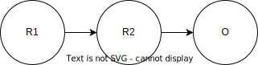
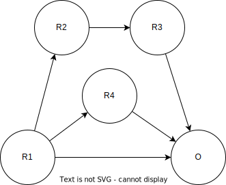
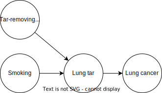
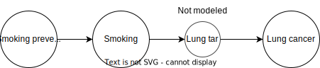
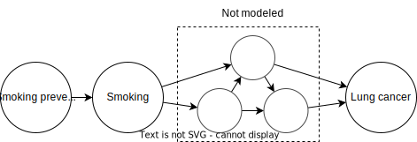
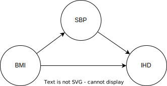
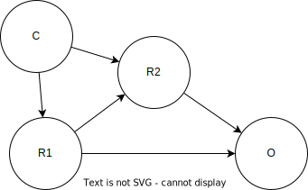

..
  Section title decorators for this document:
  
  ==============
  Document Title
  ==============
  Section Level 1
  ---------------
  Section Level 2
  +++++++++++++++
  Section Level 3
  ~~~~~~~~~~~~~~~
  Section Level 4
  ^^^^^^^^^^^^^^^
  Section Level 5
  '''''''''''''''

  The depth of each section level is determined by the order in which each
  decorator is encountered below. If you need an even deeper section level, just
  choose a new decorator symbol from the list here:
  https://docutils.sourceforge.io/docs/ref/rst/restructuredtext.html#sections
  And then add it to the list of decorators above.

.. _risk_mediation:

=================================
Risk factor mediation
=================================

.. contents::
  :local:

What is mediation?
------------------

Risk factor mediation is when one risk factor affects an outcome through another risk factor.

For example, in this causal diagram, the risk factor R1 has an effect on the outcome O,
but that effect is (completely) mediated by another risk factor R2.

.. note::
  This diagram is so simple it may not always be described as "mediation."
  For example, on our :ref:`Causal Diagrams page <general_dags>` page we call this an
  :ref:`"intermediate." <general_dags_intermediates>`
  However, it can be useful to analyze this situation as mediation; for example, this
  causal structure of GBD risks would report a mediation factor
  (see GBD section for more on this).

However, a diagram involving mediation can be more complex:
a risk effect may be mediated through multiple (chains of) mediating risk factors,
and there may be a non-mediated effect as well.

At the top of this diagram, we see multi-layer mediation through the chain
of R1→R2→R3→O.
Starting from the end of the chain:

* R3 has a direct effect on O
* R2 has an effect on O mediated through R3
* R1 has an effect on O mediated through R2 **and** R3

Additionally, R1 has another effect on O mediated through R4,
and the bottom arrow in the diagram represents another, direct (non-mediated) causal
effect.

When is it necessary to model mediators?
----------------------------------------

**Just because mediation is present in the real world does not mean it needs
to be modeled.**

All effects are mediated, and we usually ignore this.
For example, the effect of smoking on lung cancer is mediated by tar in the lungs,
the effect of tar in the lungs on lung cancer is mediated by DNA mutations
in lung cells, and so on.
It is also frequently the case that an effect has multiple mechanisms.
By increasing the detail of the causal diagram, it is always possible to find
mediators of any causal effect.

When we are modeling the impact of an intervention,
mediators **must** be modeled when they are part of a causal path
between the intervention (the thing we change between scenarios) and an outcome
(a result we report as differing between scenarios),
**and** that path does not include the already-modeled risk factor.

For example, in a hypothetical smoking simulation, if one of our interventions
could directly remove tar from the lungs after someone had smoked, we would need
to model lung tar.

But if our interventions only affect smoking itself, there is no need to model lung tar;
it is implicit between smoking and lung cancer.

There are some potential reasons to model a mediator, even when it is not strictly necessary
according to these criteria.
For example, it could be an outcome worth reporting in its own right, or the relevant effect
sizes could be easier to find
(risk to mediator and mediator to outcome instead of risk to outcome directly).

If we can ignore one mediator, we can also ignore a cluster of mediators with arbitrary complexity,
so long as none of them are being acted on by our intervention (except through the modeled risk):

Risk effects in the presence of mediation
-----------------------------------------

When mediation is modeled **alongside a direct, non-mediated effect**,
the direct risk effect must be adjusted for the mediator to avoid
double-counting.
If there is no direct effect (the entire effect is mediated by a modeled factor),
nothing special needs to be done.

For example, consider this diagram of **modeled** causes and risks,
inspired by the cardiovascular disease simulation:

BMI here is body mass index, SBP is systolic blood pressure, and IHD
is ischemic heart disease.
We see that BMI has an effect on IHD mediated by SBP, but also has
a direct effect.

Imagine we found studies describing the effects in this diagram
by reporting relative risks (RRs).
To inform the direct BMI→IHD arrow, we'd need the RR of BMI
on IHD to be adjusted for SBP, in order to isolate the direct effect.
If we used an RR of BMI on IHD that was not adjusted for SBP, the mediated
part of the effect would be double-counted in our model: once in the direct
path and once in the mediated path.
This logic extends naturally to the situation where
there are multiple mediated pathways in addition to a direct effect:
for the direct effect, we need an RR adjusted for **all** mediated pathways.

As always when we use risk effects, whether or not mediation is involved,
the effects should be causal; they should exclude :ref:`confounding <confounding>`.
In an observational study, this means they should be adjusted for known
confounders/common causes (factors affecting both our risk and our outcome),
**in addition** to adjusting for the modeled mediator when calculating the direct RR.
Crucially, in this case, the RR of SBP→IHD **must be adjusted for BMI** since
that is a confounder of this effect.

Note that while the ideal would be evidence from a randomized controlled trial,
therefore controlling for *all* confounders (known and unknown), that frequently isn't possible,
including in this example:
there isn't a way to randomly assign people BMIs or SBPs since these variables
are not directly manipulable.

GBD-modeled mediation
+++++++++++++++++++++

.. todo::
  This section only covers mediation methods from GBD 2019.
  It appears that substantial aspects of mediation may change in GBD 2021.
  We have yet to model any mediation using GBD 2021 but will need to expand this
  to cover new methods.

In a mediation situation where the primary risk and mediator are both GBD-modeled risks
and the outcome is a GBD-modeled cause, GBD may report a "mediation factor" for the pathway.
(If it does not, that means that one or more of the causal effects in the mediation diagram
were not modeled by GBD.)
Mediation factors for GBD 2019 and 2021 can be found `on this HUB page <https://hub.ihme.washington.edu/display/GBD2020/GBD+2021+Risk+factors+mediation>`_.
GBD mediation factors do not vary by location, age, sex, or year.
They are not allowed to exceed 1; if the calculated value is greater than 1 it
will be truncated to exactly 1 (this truncation happens at the draw level).
Some mediation pathways have a mediation factor of exactly 1 by definition, because
there is no direct effect.
For example, lead exposure's effect on ischemic heart disease is entirely mediated by
high systolic blood pressure.
Draws of the mediation factor are allowed to be negative, which represents the direct pathway
and the mediated pathway having different effect directions.
However, if more than 50 of the 1,000 draws were negative, that mediation
pathway was excluded from GBD.

.. todo::
  Why does GBD exclude due to negative draws?

This "mediation factor" can be used to calculate values for each of the causal effects represented by arrows
in the diagram in one of two ways; the following sections describe how to do this.

Unfortunately, GBD mediation factors are inconsistent with the multiplicative application of RRs.
This is because mediation factors are defined as proportions of the *excess* risk -- the amount the RR is
greater than 1.
In effect, GBD's mediation methods can split e.g. an RR of 2.2 into an RR of 1.7 and an RR of 1.6 (since 0.7 + 0.6 = 1.2, which
is the overall RR's excess risk).
However, if we apply these two RRs, we end up with an RR of of 1.7 * 1.6 = 2.72, which is higher than
we started with.
For this reason, we have to decide whether to be consistent with how we apply RRs
(and therefore stay calibrated to overall prevalence),
or to be consistent with GBD's mediation methodology.
In past models, we have mostly done the latter; we recommend doing the former in future models.
Both approaches are described below.

.. todo::

  We don't totally understand why GBD models *excess* risk -- while there is a possibility that
  there is a good reason behind it, we haven't been able to find that reason, so we prefer
  Approach 1 for now.

If GBD does not report a mediation factor, it may still report one or more of the effects in the diagram.
The rest can be filled in with external sources.

.. note::
  Be careful not to interpret GBD RRs as *direct* RRs -- unless there is a mediation factor,
  the GBD RR will not be adjusted for any mediators.

All our multiplicative math is based on this equation describing how RRs are applied:

.. math::

  RR_\text{r→o} = RR_\text{r→o,direct} * \prod_{m \in M} (RR_\text{m→o})^{\Delta_\text{r→m}}

where :math:`M` is the set of mediators that mediate the relationship between risk :math:`r`
and outcome :math:`o` and :math:`\Delta_\text{r→m}` is the (assumed linear) increase in :math:`m`
caused by a one-unit increase in :math:`r`.

.. note::
  This ignores the concept of a TMREL below which the RR does not apply and risk
  is flat.
  This seems to be ignored throughout the GBD's descriptions of its mediation methods, although
  some risks that are mediators in GBD, such as BMI, clearly have non-zero TMRELs.

.. note::
  :math:`\Delta_\text{r→m}` only makes sense if both the risk and the mediator are continuous values.
  Since all of the mediation we have modeled so far has been between continuous
  risk factors, we haven't yet explored how to make different assumptions (neither has GBD).

Approach 1: consistent with RR application, inconsistent with GBD mediation
~~~~~~~~~~~~~~~~~~~~~~~~~~~~~~~~~~~~~~~~~~~~~~~~~~~~~~~~~~~~~~~~~~~~~~~~~~~

In this approach, we work backwards from the result reported by GBD (the mediation factor)
to an underlying data point we can use to create an internally-consistent set of causal effects.
It is an "undo and redo" approach: we undo the calculations GBD did in additive space to infer
the data they used as inputs, then do a completely different calculation on those data in multiplicative space.
To do this, we have to know whether the mediation factor for the pathway in question was calculated
with the adjusted RR method ("Comparing crude RR versus mediator-adjusted RR"
in `the GBD risk factors methods appendix [supplementary appendix 1] <https://www.thelancet.com/journals/lancet/article/PIIS0140-6736(20)30752-2/fulltext#supplementaryMaterial>`_) or
the delta method ("Estimating the mediation factor by pathway of the effect").

.. todo::

  Where should someone look to find this out?

Adjusted RR method
^^^^^^^^^^^^^^^^^^

In this case, GBD's data were a pair of RRs for the risk-outcome pair,
one adjusted for the mediator and one not.
We presume that the unadjusted RR is (approximately) equal to the total RR
GBD reports for the risk-outcome pair.
Therefore, we manipulate this equation from the GBD methods appendix:

.. math::

  MF = \frac{RR_\text{r→o,unadjusted for m} - RR_\text{r→o,adjusted for m}}{RR_\text{r→o,unadjusted for m} - 1}

to solve for :math:`RR_\text{r→o,adjusted for m}`:

.. math::

  RR_\text{r→o,adjusted for m} = RR_\text{r→o,total} - MF * (RR_\text{r→o,total} - 1)

:math:`RR_\text{r→o,adjusted for m}` is the underlying data point, but it
isn't particularly useful to us, as it doesn't necessarily show up
anywhere in our causal diagram.
We can use it to calculate a delta, an (assumed linear) increase in the mediator
per unit increase in the mediated risk:

.. math::

  \Delta_\text{r→m} = \frac{log(RR_\text{r→o,total}) - log(RR_\text{r→o,adjusted for m})}{log(RR_\text{m→o,total})}

Every mediation pathway that begins with the same primary risk
and mediator will give us the information we need to calculate such a linear
risk-risk effect.
For example, BMI→SBP→IHD and BMI→SBP→Stroke both imply delta values for BMI→SBP.
However, the calculated values from different mediation pathways
may be inconsistent, since GBD does not enforce consistency.
We will have to choose one or aggregate them, depending on the situation:
it could be that we trust the GBD modeling of one of the mediation pathways
more than the others, or that the values are all similar so it doesn't matter
much what we do.

Once we select a single delta for each risk-mediator pair,
these deltas are used to inform the risk to mediator arrows in our causal diagram.
The only thing that remains is to find the RR of the direct effect:

.. math::

  RR_\text{r→o,direct} = \frac{RR_\text{r→o,total}}{\prod_{m \in M} (RR_\text{m→o})^{\Delta_\text{r→m}}}

.. note::
  We may calculate a direct RR below 1.
  This is not logically incoherent (a risk factor could have a protective direct effect
  that is counteracted by harmful indirect/mediated effects), but it may
  also indicate problems in the GBD mediation estimation, particularly if a
  protective effect doesn't make sense given domain knowledge about the
  risk factor.

  We'll deal with these situations on a case-by-case basis.

Delta method
^^^^^^^^^^^^

If GBD used the delta method, there are fewer steps.
We simply solve the GBD equation:

.. math::

  MF = \frac{(RR_\text{m→o})^{\Delta_\text{r→m}} - 1}{RR_\text{r→o,total} - 1}

for :math:`\Delta_\text{r→m}`:

.. math::

  \Delta_\text{r→m} = \frac{MF * (RR_\text{r→o,total} - 1) + 1}{log(RR_\text{m→o})}

Having arrived at :math:`\Delta_\text{r→m}`, the last steps are the same as
in the previous section.

Approach 2: consistent with GBD mediation, inconsistent with RR application
~~~~~~~~~~~~~~~~~~~~~~~~~~~~~~~~~~~~~~~~~~~~~~~~~~~~~~~~~~~~~~~~~~~~~~~~~~~

In this approach, we use GBD's mediation factors as they were intended to be used,
but this is not consistent with the multiplicative application of RRs.
If we take this approach, we will **not** match population-level prevalence
rates -- Approach 1 is preferred, but this is described for completeness.

We still need to assume a linear effect of the risk on the mediator, and we still
calculate this like so:

.. math::

  \Delta_\text{r→m} = \frac{MF * (RR_\text{r→o,total} - 1) + 1}{log(RR_\text{m→o})}

As before, this can result in multiple different delta values for the same risk-mediator
pair; we have to choose one or aggregate them somehow.

With this approach, we calculate the RR of the direct effect using the equation

.. math::

  RR_\text{r→o,direct} = 1 + (RR_\text{r→o,total} - 1) * (1 - MF_m)

when there is only one mediator :math:`m`, as described in the methods appendix, or

.. math::

  RR_\text{r→o,direct} = 1 + (RR_\text{r→o,total} - 1) * \prod_{m \in M}{(1 - MF_m)}

when there are multiple mediators, which is used internally by GBD (e.g. when calculating PAFs).

.. todo::
  Find a good citation for GBD's methods here.
  Currently the best we have is this code file: https://stash.ihme.washington.edu/projects/CCGMOD/repos/paf/browse/mediate_rr.R?until=2af3bdeabcfce96ea48a0d77e3e24e6edd2f287a&untilPath=mediate_rr.R

.. note::
  This multiplicative combination of multiple mediation factors is hard to interpret -- it seems
  to imply that mediators *overlap* in what they mediate, which seems to contradict the idea of
  a causal effect.

Risk deletion (PAFs) in the presence of mediation
-------------------------------------------------

In order to accurately perform risk deletion in the presence of mediation,
we must use the correct risk effects, as described in the previous section,
**and** we must account for the correlation between risks and their mediators.
We generally perform risk deletion by calculating a population-attributable fraction (PAF):
the proportion of an outcome that is attributable to all our modeled risk factors.
Then, we delete this proportion of the observed outcome to obtain the
risk-deleted value.

Because R1 has a direct causal effect on R2 in this diagram,
they will certainly be correlated.
They may also be correlated due to one or more confounders (C).

Therefore, this correlation should be accounted for in the PAF calculation,
as described on the :ref:`risk correlation page <joint_paf_calculation>`.
This calculation requires a joint distribution of R1 and R2.

In order to validate to our target population-level rate of O, the joint
distribution R1 and R2 will have **in the simulation's baseline scenario**
should be calculated, accounting for the direct causal effect and any
**modeled** confounders.

Typically we would simply initialize a large
population of simulants and observe the joint distribution in this
population.
This will work as long as there is no time-lag to any of the causal relationships,
and differential mortality doesn't significantly change the joint distribution among
living simulants as the simulation progresses.
The latter issue would create problems beyond inaccurate risk deletion.

This extends naturally to multiple mediators: we calculate the joint distribution of R
and **all** the mediators of its effect on O, and use that joint distribution to
calculate the PAF.

.. todo::
  We don't currently have anything on this page about how to handle multi-layer mediation.
  This is something we largely haven't tackled (and can't be informed entirely by GBD).

.. note::
  Much of this content was adapted from :download:`this PowerPoint <Risk-Risk Correlation.pptx>`.
  It still contains some content that is not yet represented anywhere else about modeling
  feedback loops, although it doesn't fully describe how to model such loops.
