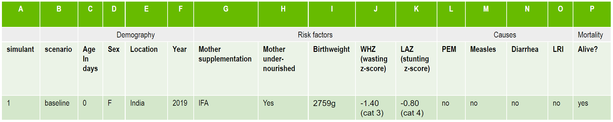

..
  Section title decorators for this document:
  
  ==============
  Document Title
  ==============
  Section Level 1
  ---------------
  Section Level 2
  +++++++++++++++
  Section Level 3
  ~~~~~~~~~~~~~~~
  Section Level 4
  ^^^^^^^^^^^^^^^
  Section Level 5
  '''''''''''''''

  The depth of each section level is determined by the order in which each
  decorator is encountered below. If you need an even deeper section level, just
  choose a new decorator symbol from the list here:
  https://docutils.sourceforge.io/docs/ref/rst/restructuredtext.html#sections
  And then add it to the list of decorators above.

.. _vivarium_best_practices_vivarium_and_other_models:

=========================================================
What is Vivarium Good For?
=========================================================

.. contents::
   :local:
   :depth: 1

What is microsimulation?
------------------------

Vivarium, a platform developed by the IHME Simulation Science team, enables individual-based modeling or **microsimulation**.
This is a technique for combining information about attributes of individuals in a population (such as demographics, risk factors,
disease occurrence, and intervention coverage) and relationships between these attributes, to estimate health outcomes in a simulated environment over time.
The goal of the IHME microsimulation framework is ultimately to investigate outcomes related to health intervention scenarios to provide decision-makers with 
guidance on how best to allocate resources to maximize health gains. 

Microsimulation models incorporate relevant characteristics, including: 

- Basic demographics (e.g., age, sex/gender, race/ethnicity)
- Exposure to risk factors
- Disease incidence 
- Healthcare visit frequency
- Treatment (i.e., timing, duration, frequency, adherence, and known/assumed treatment effects)
- Adverse events
- Mortality rate/life expectancy 

The above table provides an illustration of the simulant attributes that might be included in a Vivarium microsimulation. This particular example is pulled from a microsimulation of 
antenatal nutritional supplementation effects on birthweight and child-growth failure. As you can see, the simulant listed here has attributes covering demography, risk factors (e.g., 
*did the mother/birthing person received iron and folic acid (IFA) supplementation during pregnancy?*), causes (e.g., *what is the probability of child simulant having protein energy malnutrition (PEM)?*),
and mortality (e.g., *is the simulant alive or dead at this given timestep?*).

By using microsimulation, we probabilistically assign the above attributes heterogeneously across individuals within the simulated population. 
Taken in aggregate, these attributes match real-world population-level data, derived from IHME's Global Burden of Disease (GBD) databases and other sources. 
Over the duration of a given microsimulation run, simulant attributes are dynamically updated.

.. image:: microsim_visual.PNG

Simulation components are interdependent, and relationships between attributes are also based on best available real-world 
evidence. For example, disease progression is a function of simulant characteristics and treatment; survival depends on stage of disease and other characteristics. 

As the simulation proceeds, various simulant attributes change and these changes are recorded through observers (to read more about observers, visit [insert link here])

.. note::

  Are you feeling confused by some of the vocabulary on this page? Please visit our `Vivarium glossary <https://vivarium-research.readthedocs.io/en/latest/glossary/index.html>`_ 
  for some definitions of microsimulation vocabulary!

What are the advantages and disadvantages of microsimulations?
-------------------------------------------------------------------------------

Advantages of microsimulation
+++++++++++++++++++++++++++++

Microsimulations allow us to model population health dyanmics at the individual level! With this, we can incorporate useful complexities into our models.

These include: 

- Stochastic uncertainty in effect sizes
- Correlation between risk exposures
- Time-varying rates dependent on multiple factors (ex: multiple myeloma)

Disadvantages of microsimulation
++++++++++++++++++++++++++++++++

- Resource-intensive: requires the use of a super-computer to run 
- If we're not modeling the sort of complexity that microsimulation enables... perhaps a multiplication model would suit us just as well?

.. todo::

  Fill out this section with strengths and weakness of microsimulation. Could also add context about how microsim compares to agent-based simulation and the broader umbrella term of IBM.

  Explanation of relationships between macroscopic population-level measures such as incidence rate and the corresponding microscopic hazard rates we use in our simulations, and how these relationships might affect our model design and V&V.
  

How does Vivarium compare with other microsimulation tools?
-----------------------------------------------------------

.. todo::

 - Versus decision tree or other types of models?
 - Different types of agent-based models (mini lit review) 
 - What differential equations underly these different types of models?

References
----------

Sorensen et al. (2017). `Microsimulation models for cost-effectiveness analysis: a review and introduction to CEAM.` SummerSim '17: Proceedings of the Summer Simulation Multi-Conference, Society for Computer Simulation International, https://dl.acm.org/doi/10.5555/3140065.3140097. 

Allen et al. (2019). `Enabling Model Complexity Through an Improved Workflow.` Healthy Algorithms, https://healthyalgorithms.files.wordpress.com/2021/05/2019-enabling-model-complexity-through-an-improved-workflow-mws_paper-christine-allen.pdf. 