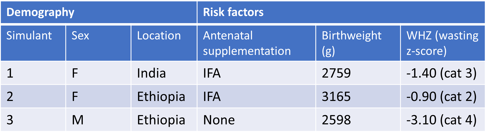
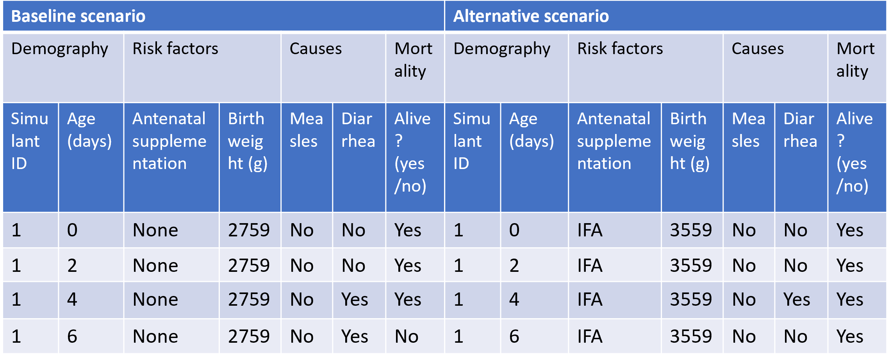
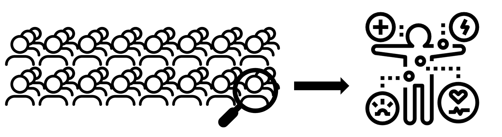
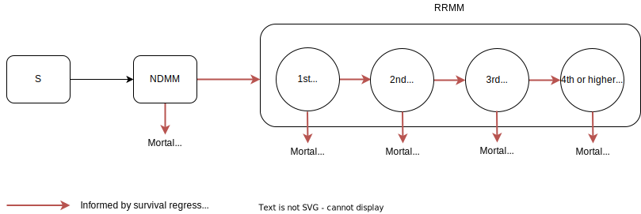
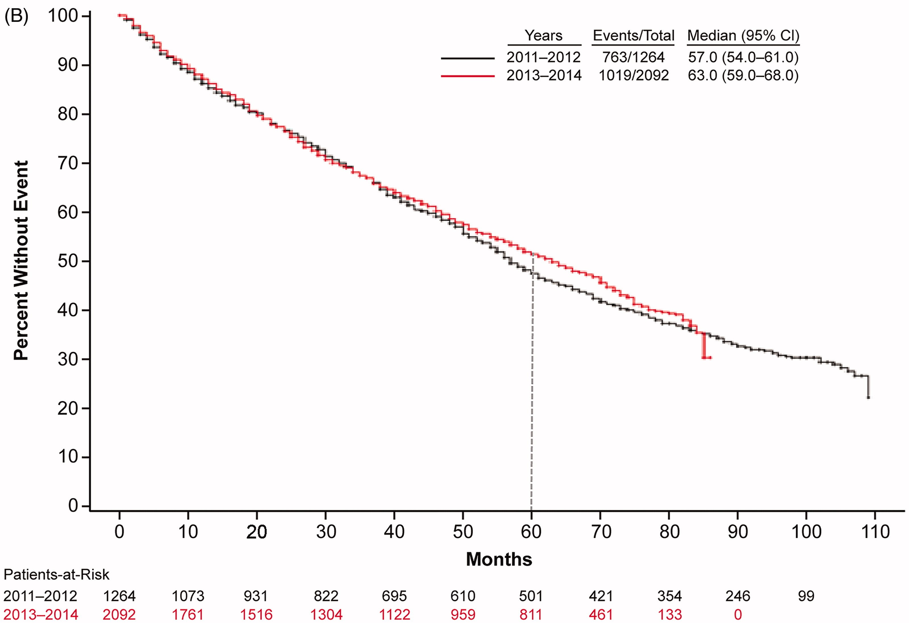

..
  Section title decorators for this document:
  
  ==============
  Document Title
  ==============
  Section Level 1
  ---------------
  Section Level 2
  +++++++++++++++
  Section Level 3
  ~~~~~~~~~~~~~~~
  Section Level 4
  ^^^^^^^^^^^^^^^
  Section Level 5
  '''''''''''''''

  The depth of each section level is determined by the order in which each
  decorator is encountered below. If you need an even deeper section level, just
  choose a new decorator symbol from the list here:
  https://docutils.sourceforge.io/docs/ref/rst/restructuredtext.html#sections
  And then add it to the list of decorators above.

.. _vivarium_best_practices_vivarium_and_other_models:

=========================================================
What is Vivarium Good For?
=========================================================

.. contents::
   :local:
   :depth: 1

What is microsimulation?
------------------------

Vivarium, a platform developed by the IHME Simulation Science team, enables **microsimulation**, a technique for combining information about attributes of 
individuals in a population (such as demographics, risk factors, disease occurrence, and intervention coverage) and relationships between these attributes, 
to estimate health outcomes in a simulated environment over time. The goal of the IHME microsimulation framework is ultimately to investigate outcomes related 
to health intervention scenarios to provide decision-makers with guidance on how best to allocate resources to maximize health gains. 

Microsimulation models incorporate relevant characteristics, including: 

- Basic demographics (e.g., age, sex/gender, race/ethnicity)
- Exposure to risk factors
- Disease incidence 
- Healthcare visit frequency
- Treatment (i.e., timing, duration, frequency, adherence, and known/assumed treatment effects)
- Adverse events
- Mortality rate/life expectancy 

The below tables provide a simplified illustration of what is included in a Vivarium microsimulation. Both tables are based on a microsimulation of 
antenatal nutritional supplementation effects on birthweight and child growth failure. 

This first table outlines some of the simulant attributes we can include in our microsimulations. The simulants listed here have demographic attributes
such as sex and location, as well as risk factors (e.g., *did the mother/birthing person received iron and folic acid (IFA) supplementation during pregnancy?*).

This second table demonstrates our ability to simulate different intervention scenarios and compare outcomes. In this case, the baseline scenario 
entailed no antenatal supplementation for the simulant's mother/birthing person, which meant the simulant had a low birthweight. This caused the simulant
to be more susceptible to get diarrhea and not recover, which ultimately led to the simulant's death by day 6. In the alternative scenario, the simulant's 
mother/birthing person received antenatal supplementation, which led to the simulant's healthier birthweight and, subsequently, their higher likelihood of 
recovering from diarrhea and surviving past day 6. 

By using microsimulation, we probabilistically assign the above attributes heterogeneously across individuals within the simulated population. 
Taken in aggregate, these attributes match real-world population-level data, derived from IHME's Global Burden of Disease (GBD) databases and other sources. 
Over the duration of a given microsimulation run, simulant attributes are dynamically updated.

Simulation components are interdependent, and relationships between attributes are also based on best available real-world 
evidence. For example, disease progression is a function of simulant characteristics and treatment; survival depends on stage of disease and other characteristics. 

As the simulation proceeds, various simulant attributes change and these changes are recorded through observers (to read more about observers, visit [insert link here]).

.. todo::

  Add link to observers page ('Types of Vivarium Model Components') once it is created. 

.. note::

  Are you feeling confused by some of the vocabulary on this page? Please visit our `Vivarium glossary <https://vivarium-research.readthedocs.io/en/latest/glossary/index.html>`_ 
  for some definitions of microsimulation vocabulary!

What are the advantages and disadvantages of microsimulations?
--------------------------------------------------------------

Microsimulation, described above, is a special kind of model that falls under the broader umbrella of **individual-based modeling (IBM)**. This section
expands on what differentiates IBM, including microsimulation, from other types of statistical models such as compartmental models or multiplication models.

Advantages of microsimulation
+++++++++++++++++++++++++++++

Event tracking
~~~~~~~~~~~~~~

One advantage of microsimulation (as opposed to some form of non-individual-based simulation) is the ability to record events as they occur to each simulant. Depending on the
microsimulation, there are different ways these events are recorded. Read more about the advantages and disadvantages of different forms of event tracking in a later section,
`Type of event simulation`_. 

Each of the microsimulations that our team has developed include this advantage, but we can use our microsimulation of multiple myeloma as an
example. Multiple myeloma is a kind of plasma cell cancer, characterized by end organ damage—renal impairment, hypercalcemia, lytic bony lesions, and anemia. The below causal diagram 
shows how we split multiple myeloma into five disease states: newly-diagnosed multiple myeloma (NDMM); and 4 separate states for the first four relapses of relapsed and/or refractory multiple myeloma (RRMM). Simulants are affected differently by being in each of these states;
for example, later relapses happen faster and have higher associated mortality risk.
Tracking the individual events allows us to model treatment for each relapse in a highly detailed way.

Correlation between risk exposures
~~~~~~~~~~~~~~~~~~~~~~~~~~~~~~~~~~

At the individual level, risk exposures are frequently correlated. Examples include high body mass index and high fasting plasma glucose, tobacco smoking and alcohol use, 
and childhood height and weight. Microsimulation methods allow us to assign a risk exposure value independently to simulants, such that each one follows the desired population-
level univariate distribution (which frequently comes from the GBD in our microsimulations).

Our cardiovascular disease (CVD) microsimulation offers a useful example of how risk exposure correlation typically looks in microsimulations. There are several correlated 
risk factors that affect CVD outcomes, including: body mass index (BMI), systolic blood pressure (SBP), low-density lipoprotein cholesterol levels (LDL-C), and fasting 
plasma glucose (FPG). Using NHANES survey data, we calculated correlation coefficients for these relationships, which we used to generate values for all
simulants. As such, the correlation coefficients remain constant as simulants age and their risk exposure values change. You can read more about our modeling strategy for 
these risk factor correlations :ref:`on this page <2023_sbp_ldlc_fpg_bmi>`.

Continuous values
~~~~~~~~~~~~~~~~~

Additionally, microsimulation allows the modeling of continuous values, something which is not as straightforward (if possible) with categorical data characteristic of 
compartmental models.

For example, in our intravenous (IV) iron intervention microsimulation, we model precise hemoglobin levels as a continuous risk exposure that varies as simulants age and move 
through the pregancy model states, as low hemoglobin levels (or anemia) are associated with poor health outcomes for both mother/birthing parent and child. Read more about the 
modeling strategy we used to generate precise hemoglobin levels for each simulant :ref:`here <2019_hemoglobin_anemia_and_iron_deficiency>`.

Time-varying rates dependent on multiple factors
~~~~~~~~~~~~~~~~~~~~~~~~~~~~~~~~~~~~~~~~~~~~~~~~

Another complexity enabled by microsimulation is the inclusion of time-varying rates dependent on multiple factors. A good example of this is in our microsimulation of multiple myeloma, 
which allowed relapse and mortality hazard rates to vary over time since treatment line initiation, in addition to being impacted by the line of treatment, demographic covariates, and treatment regimen. 
Read more about how we calculated these rates :ref:`here <calc_mortality_relapse_hazard>`.

The figure below demonstrates how survival rates in multiple myeloma patients differ based on the time since treatment line initiation. This figure was produced by
researchers at Amgen, Inc, and you can read the paper in which it was published `here <https://www.tandfonline.com/doi/full/10.1080/10428194.2020.1827253>`__. [Braunlin-MM-2020]_ 

Surfacing limitations
~~~~~~~~~~~~~~~~~~~~~

Another benefit of microsimulations in general is that they can surface complications or limitations that are obscured in non-individual-based models, such as compartmental models.

We can revisit our IV iron intervention microsimulation to illustrate. The graph below depicts individual hemoglobin concentration over time, which as described earlier, is an
important risk exposure variable in this model. When examining this curve, you may notice minute discrepancies from what you would expect to see in the real world. For instance,
in this plot you can see hemoglobin concentrations change drastically very quickly (e.g., the drop from ~115 g/L Hb to ~90 g/L Hb once a simulant reaches six weeks postpartum). In 
reality, these changes in hemoglobin concentration would likely be less steep than this. These are limitations in our model that become more evident due to the high resolution 
of our microsimulation. Importantly, these same limitations could be in a population-based model, but because there is no individual level detail, we wouldn't come face-to-face with them. 

.. image:: hemoglobin_plot.png

Another example that illustrates this is our microsimulation of a full-scale United States population. 350 million simulants in this population have 
names, family members, addresses, employers, and other similar individual characteristics, and over time, they experience life events, such as migration, 
employment change, and death. There are limitations in our model that are only visible at this level of detail, such as how we simulate household structure.
For instance, in an earlier iteration of the simulation, it was possible for children (i.e., under 18 years old) to be married, stemming from a limitation in how we perturbed age with
regard to relationship type. Fortunately, this limitation has since been resolved and our model was thereby improved! Again, such a limitation may well be present in a model that does not output
individual-level data, but because this information is aggregated, the limitation won't be surfaced and improved upon. 
Read more about this project :ref:`here <vivarium_census_prl_synth_data>`.

Disadvantages of microsimulation
++++++++++++++++++++++++++++++++

Resource requirements
~~~~~~~~~~~~~~~~~~~~~

Our microsimulations typically require a substantial amount of computational resources to run. For example, our microsimulation of a full-scale
United States population was made possible through the use of a high performance computing cluster and used 334 parallel runs, each requiring approximately 55 gigabytes of memory over a runtime of 21.5 
hours.

The demanding resource needs of microsimulations may require we use a smaller simulant population (that can, post-simulation, be up-scaled to better reflect the 
real-world target population), thus presenting limitations related to sample size and stochastic uncertainty. 

Data requirements
~~~~~~~~~~~~~~~~~

As we highlighted above in our section on `Surfacing limitations`_, microsimulations enable the modeling of complexities otherwise
difficult or impossible to replicate. Unfortunately, these complexities require a significant amount of detailed data to accurately represent individual behaviors and the relationships between them.
Obtaining these data can be challenging and time-consuming, and there may be privacy concerns associated with using such detailed personal data. This is particularly true given the nature of
what we on the Simulation Science team investigate in our microsimulations: accurately modeling the effects of health interventions at an individual-level likely requires access to medical 
records, medication histories, and other highly personal information.  

If we're not interested in the complexities described in the section above, then it is likely a less data- and resource-intensive alternative, such as a multiplication model, is a suitable modeling 
strategy.

Residual confounding
~~~~~~~~~~~~~~~~~~~~

Another limitation or disadvantage of microsimulations is that getting realistic, individual-level characteristics from population-level data is difficult, and 
creates opportunity for residual confounding. 

You can read more about residual confounding and how our team accounts for it :ref:`here <residual_confounding>`.

.. todo::

  Cite [Allen-et-al-2019]_ and [Sorensen-et-al-2017]_ somewhere.

  Elaborate on this in approachable/jargon-free language.
  

How does Vivarium compare with other microsimulation tools?
-----------------------------------------------------------

In this section, we will elaborate on what differentiates Vivarium, our team's microsimulation platform, from other methods of microsimulation and IBM. 

Leveraging the Global Burden of Disease (GBD) Study
+++++++++++++++++++++++++++++++++++++++++++++++++++

Vivarium is uniquely positioned to access population-level estimates from the Global Burden of Disease (GBD) study. 
These estimates are stratified by age, sex, time, and location, allowing us to simulate a population that mirrors the relevant 
qualities of a given real-world population of interest.  Vivarium researchers extract relevant input parameters from the vast 
repository of GBD population health data that are explicitly structured to quantify uncertainty by representing estimates as 
draws from Bayesian-derived joint posterior distributions.

Simulant agency
+++++++++++++++

Unlike agent-based models, microsimulations do not necessarily program agency into individual simulants. This removes some of the real-world likeness of these models in favor 
of reflecting realistic population-level dynamics that would be more difficult to program in agency-based simulation. The Vivarium simulations that might be described as having 
the most simulant agency would be our microsimulation of the entire US population, which you can read more about at `<vivarium_census_prl_synth_data>`_, as well as
our simulation of cardiovascular disease, which you can read more about at `<2019_cause_ihd>`_. In the prior simulation, simulants are programmed with propensities to migrate into and out of the 
country, change addresses and employment, have babies, and more. In the latter, simulants are initiated into the population with different adherence rates to medications and likelihoods of discontinuing
said medications - in turn, this affects their level of risk for moving to a disease state.

HPVsim, part of the Starsim series, provides an example of an agent-based simulation where individual simulants exhibit different sexual behaviors, leading to varied risk profiles for HPV and its related 
conditions. This highlights the core principle of agent-based models, where individual entities (i.e., agents) have distinct characteristics and decision-making capabilities that influence their 
interactions and outcomes within the simulation environment. Read more about HPVsim `here <https://www.medrxiv.org/content/10.1101/2023.02.01.23285356v1>`__.

Reducing variance between scenarios
+++++++++++++++++++++++++++++++++++

Like other microsimulation frameworks such as the Starsim series, Vivarium utilizes randomly generated numbers to incorporate stochastic uncertainty into our simulations. 
However, unlike most other microsimulation frameworks, the IHME microsimulation platform additionally reduces variance between scenarios by appropriately controlling 
stochastic uncertainty through a common-random-numbers approach. In this procedure, for each simulant, the same randomly generated number is used in both baseline and 
intervention scenarios to dictate change or maintenance of health status across time steps. The only difference between scenarios, then, is the presence or absence of 
health interventions.

Computational needs
+++++++++++++++++++

To date, all vivarium simulations require supercomputers or high-performance clusters due to their complexity and computational demands. In contrast, frameworks such as the Starsim series focus on 
computational ease. HPVsim, for example, utilizes features that improve computational efficiency and accessibility, allowing simulations to run on a wider range of computing resources, from personal 
computers to cloud-based and HPC systems. Key features of HPVsim include: 

- The “MultiSim” class for managing and analyzing multiple simulations.
- The “Scenario” class for comparing simulations with varying input parameters, including different interventions.
- The “Sweep” class for conducting parameter sweeps and generating heatmaps of outcomes.

These features enable parallel runs of simulations, making it feasible to conduct both small and large-scale simulations without requiring supercomputing resources. Read more about HPVsim
`here <https://www.medrxiv.org/content/10.1101/2023.02.01.23285356v1>`__.

Type of event simulation
++++++++++++++++++++++++

The way simulants undergo events (i.e. move from one state to another) can be recorded in different ways, depending on microsimulation methods. These divergent methods are referred 
to as discrete time simulation (simulants progress at fixed time increments, and it is recorded if they experienced an event) and discrete event simulation (simulants
move from event to event based on sampled timing of those events occuring). There are advantages and disadvantages related to each of these disparate methods of event simulation,
which we elaborate upon below. 

Discrete time simulation
~~~~~~~~~~~~~~~~~~~~~~~~

Currently, Vivarium runs in discrete time increments, and at each time step, it is determined whether simulants experience one or more events. Discrete time simulation 
can also be thought of as continuous event simulation. Advantages associated with this type of event simulation include: 
  
- Discrete time simulation can produce results that are statistically equivalent to those generated by discrete event simulation, assuming appropriate handling of time steps and event probabilities. 
- Can be simpler to implement for scenarios where time steps align closely with the natural progression of events or states.

There are, however, some disadvantages associated with discrete time simulation, such as: 

- All simulants stay in each state for the same amount of time, which may not accurately reflect the variability seen in real-world scenarios.
- Can be less computationally efficient compared to discrete event simulation, especially for large-scale models, because it requires evaluating the state of all simulants at each time step, regardless of whether events occur. 

To read more about how we select the length of time steps in our simulations, please see `<vivarium_best_practices_time_steps>`_.

Discrete event simulation 
~~~~~~~~~~~~~~~~~~~~~~~~~

On the other hand, discrete event simulation allows simulants to move from event to event, with the timing of these events determined by sampling from probability distributions. For this reason,
discrete event simulation is synonymous with continuous time simulation; and could also be thought of as using a global clock. For an example of a microsimulation that uses discrete event simulation, 
see the `Starsim series <https://www.ncbi.nlm.nih.gov/books/NBK293948/#:~:text=Discrete%20event%20simulation%20(DES)%20is,life%20process%2C%20facility%20or%20system>`_. As with discrete time simulation,
there are some advantages and disadvantages associated with this type of event simulation.

Advantages include: 

- Can more accurately model the variability in time that simulants spend in different states, as the timing of transitions is based on sampled events rather than fixed intervals. 
- Can be more computationally efficient for many scenarios, as computations are only performed when events occur, rather than at every time step. This efficiency can be particularly significant in models where events are infrequent relative to the chosen time step in a discrete time simulation. 

Disadvantages include:

- Requires knowledge of the maximum rate or the sum of all rates leading out of a state to calculate valid transition probability. This can complicate model setup, especially in models with complex state transition dynamics.
- Managing and debugging the event queue (which tracks the order and timing of future events) can be more complex than the relatively straightforward time-stepping approach in discrete time simulation. 

Overall, the choice between discrete time and discrete event simulation depends on the specific requirements and constraints of the model being developed. Discrete event simulation offers advantages in
terms of computational efficiency and realistic modeling of state durations but comes with increased complexity in model design and implementation. Conversely, discrete time simulation may be easier to
implement and understand but can be less efficient and less flexible in representing variable state durations. As such, our team has had an ongoing discussion regarding updating Vivarium methods from 
discrete time to discrete event simulation as we continue to seek more accurate and efficient ways to model complex systems.

Calibration
+++++++++++

Vivarium microsimulations are retrospectively assessed for quality through a process we refer to as verification and validation (or V&V). This process is crucial in ensuring our models match the 
target values they were developed to replicate, and that our models are sensible and reflect trends in real-world data not used in model development. Target values come from input data (often from GBD
estimates, but also other data sources) and typically include population age and sex/gender structure, risk factor exposures and effects, all-cause mortality rates, cause-specific parameters, 
intervention coverages, and more. If any of these checks fail, we debug and go through the process again until model results behave as expected. To read more about our team's V&V process, see 
`<vivarium_best_practices_results_processing>`_.

In contrast, the Framework for Reconstructing Epidemiological Dynamics (FRED) (an agent-based model) has a calibration process that is directly integrated into the simulation's runtime, 
allowing the model to adjust its parameters dynamically to ensure a better fit with empirical data. Unlike the separate V&V process, where models are developed and then retrospectively compared and 
adjusted based on data, FRED's integrated calibration allows for a more dynamic and responsive approach to fitting model outputs to real-world evidence. You can read more about FRED 
`here <https://bmcpublichealth.biomedcentral.com/articles/10.1186/1471-2458-13-940>`__.

.. note:: 

  Although the authors of FRED do not explicitly name it as a microsimulation, they refer to it as an agent-based modeling system that represents every individual in a specific geographic region. 
  Their use of a built-in calibration mechanism provides a useful contrast to the retrospective and iterative process utilized by Vivarium researchers.

Correlation
+++++++++++

When developing a Vivarium simulation, we typically overlay population-level statistic generated through the GBD onto individual simulants, rather than using individual-level input data such 
as hospital records or registry data. This approach involves taking broad, aggregated data and distributing its implications onto the simulated individuals to approximate their health status, risks, and 
progression within the model's context. This modeling strategy is not ubiquitous across all public health microsimulations, nor even all Vivarium microsimulations. For instance, our aforementioned
microsimulation of cardiovascular disease (`<2019_cause_ihd>`_) uses inpatient hospital and claims data to inform the burden of heart failure due to each of the underlying causes of heart failure. These
data sources include vital registry data from Mexico, Brazil, Taiwan, Colombia, and the US; inpatient admissions from Friuli Venezia, Italy; and linked vital registry data from Friuli Venezia, Italy.

References
----------

.. [Sorensen-et-al-2017]

    View `Sorensen et al. 2017 <https://dl.acm.org/doi/10.5555/3140065.3140097>`_

      Sorensen et al. (2017). `Microsimulation models for cost-effectiveness analysis: a review and introduction to CEAM.` SummerSim '17: Proceedings of the Summer Simulation Multi-Conference, Society for Computer Simulation International. 

.. [Allen-et-al-2019]

    View `Allen et al. 2019 <https://healthyalgorithms.files.wordpress.com/2021/05/2019-enabling-model-complexity-through-an-improved-workflow-mws_paper-christine-allen.pdf>`_

      Allen et al. (2019). `Enabling Model Complexity Through an Improved Workflow.` Healthy Algorithms. 

.. [Braunlin-MM-2020]

    Braunlin et al. (2020) `Trends in the multiple myeloma treatment landscape and survival: a U.S. analysis using 2011–2019 oncology clinic electronic health record data`.
    Leukemia & Lymphoma, 62:2, 377-386, DOI: https://doi.org/10.1080/10428194.2020.1827253

.. todo:: 
  Add citation to Vivarium Technical Document 2019
  Add citations to all the other microsims compared to vivarium (e.g. https://www.medrxiv.org/content/10.1101/2023.02.01.23285356v1)