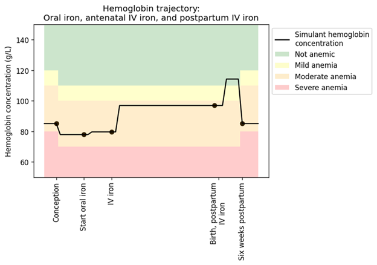

..
  Section title decorators for this document:
  
  ==============
  Document Title
  ==============
  Section Level 1
  ---------------
  Section Level 2
  +++++++++++++++
  Section Level 3
  ~~~~~~~~~~~~~~~
  Section Level 4
  ^^^^^^^^^^^^^^^
  Section Level 5
  '''''''''''''''

  The depth of each section level is determined by the order in which each
  decorator is encountered below. If you need an even deeper section level, just
  choose a new decorator symbol from the list here:
  https://docutils.sourceforge.io/docs/ref/rst/restructuredtext.html#sections
  And then add it to the list of decorators above.

.. _vivarium_best_practices_vivarium_and_other_models:

=========================================================
What is Vivarium Good For?
=========================================================

.. contents::
   :local:
   :depth: 1

What is microsimulation?
------------------------

Vivarium, a platform developed by the IHME Simulation Science team, enables **microsimulation**, a technique for combining information about attributes of 
individuals in a population (such as demographics, risk factors, disease occurrence, and intervention coverage) and relationships between these attributes, 
to estimate health outcomes in a simulated environment over time. The goal of the IHME microsimulation framework is ultimately to investigate outcomes related 
to health intervention scenarios to provide decision-makers with guidance on how best to allocate resources to maximize health gains. 

Microsimulation models incorporate relevant characteristics, including: 

- Basic demographics (e.g., age, sex/gender, race/ethnicity)
- Exposure to risk factors
- Disease incidence 
- Healthcare visit frequency
- Treatment (i.e., timing, duration, frequency, adherence, and known/assumed treatment effects)
- Adverse events
- Mortality rate/life expectancy 

The below tables provide a simplified illustration of what is included in a Vivarium microsimulation. Both tables are based on a microsimulation of 
antenatal nutritional supplementation effects on birthweight and child growth failure. 

.. image:: microsim_example_table_3.png

This first table outlines some of the simulant attributes we can include in our microsimulations. The simulants listed here have demographic attributes
such as sex and location, as well as risk factors (e.g., *did the mother/birthing person received iron and folic acid (IFA) supplementation during pregnancy?*).

.. image:: microsim_example_table_4.PNG

This second table demonstrates our ability to simulate different intervention scenarios and compare outcomes. In this case, the baseline scenario 
entailed no antenatal supplementation for the simulant's mother/birthing person, which meant the simulant had a low birthweight. This caused the simulant
to be more susceptible to get diarrhea and not recover, which ultimately led to the simulant's death by day 6. In the alternative scenario, the simulant's 
mother/birthing person received antenatal supplementation, which led to the simulant's healthier birthweight and, subsequently, their higher likelihood of 
recovering from diarrhea and surviving past day 6. 

By using microsimulation, we probabilistically assign the above attributes heterogeneously across individuals within the simulated population. 
Taken in aggregate, these attributes match real-world population-level data, derived from IHME's Global Burden of Disease (GBD) databases and other sources. 
Over the duration of a given microsimulation run, simulant attributes are dynamically updated.

.. image:: microsim_visual.PNG

Simulation components are interdependent, and relationships between attributes are also based on best available real-world 
evidence. For example, disease progression is a function of simulant characteristics and treatment; survival depends on stage of disease and other characteristics. 

As the simulation proceeds, various simulant attributes change and these changes are recorded through observers (to read more about observers, visit [insert link here]).

.. todo::

  Add link to observers page ('Types of Vivarium Model Components') once it is created. 

.. note::

  Are you feeling confused by some of the vocabulary on this page? Please visit our `Vivarium glossary <https://vivarium-research.readthedocs.io/en/latest/glossary/index.html>`_ 
  for some definitions of microsimulation vocabulary!

What are the advantages and disadvantages of microsimulations?
--------------------------------------------------------------

Microsimulation, described above, is a special kind of model that falls under the broader umbrella of **individual-based modeling (IBM)**. This section
expands on what differentiates IBM, including microsimulation, from other types of statistical models such as compartmental models or multiplication models.

Advantages of microsimulation
+++++++++++++++++++++++++++++

Event tracking
~~~~~~~~~~~~~~

One advantage of microsimulation (as opposed to some form of cohort analysis) is the ability to record events as they occur to each simulant. Depending on the
microsimulation, there are different ways these events are recorded. Read more about the advantages and disadvantages of different forms of event tracking in a later section,
`Type of event simulation`_. 

Correlation between risk exposures
~~~~~~~~~~~~~~~~~~~~~~~~~~~~~~~~~~

At the individual level, risk exposures are frequently correlated. Examples include high body mass index and high fasting plasma glucose, tobacco smoking and alcohol use, 
and childhood height and weight. Microsimulation methods allow us to assign a risk exposure value independently to simulants, such that each one follows the desired population-
level univariate distribution (which frequently comes from the GBD in our microsimulations).

Our cardiovascular disease (CVD) microsimulation offers a useful example of how risk exposure correlation typically looks in microsimulations. There are several correlated 
risk factors that affect CVD outcomes, including: body mass index (BMI), systolic blood pressure (SBP), low-density lipoprotein cholesterol levels (LDL-C), and fasting 
plasma glucose (FPG). Using NHANES survey data, we calculated correlation coefficients for these relationships, which we used to generate values for all
simulants. As such, the correlation coefficients remain constant as simulants age and their risk exposure values change. You can read more about our modeling strategy for 
these risk factor correlations :ref:`on this page <2023_sbp_ldlc_fpg_bmi>`.

Continuous values
~~~~~~~~~~~~~~~~~

Additionally, microsimulation allows the modeling of continuous values, something which is not as straightforward (if possible) with categorical data characteristic of 
compartmental models.

For example, in our intravenous (IV) iron intervention microsimulation, we model precise hemoglobin levels as a continuous risk exposure that varies as simulants age and move 
through the pregancy model states, as low hemoglobin levels (or anemia) are associated with poor health outcomes for both mother/birthing parent and child. Read more about the 
modeling strategy we used to generate precise hemoglobin levels for each simulant :ref:`here <2019_hemoglobin_anemia_and_iron_deficiency>`.

Time-varying rates dependent on multiple factors
~~~~~~~~~~~~~~~~~~~~~~~~~~~~~~~~~~~~~~~~~~~~~~~~

Another complexity enabled by microsimulation is the inclusion of time-varying rates dependent on multiple factors. A good example of this is in our microsimulation of multiple myeloma, 
which allowed relapse and mortality hazard rates to vary over time since treatment line initiation, in addition to being impacted by the line of treatment, demographic covariates, and treatment regimen. Read more about how we calculated these rates :ref:`here <calc_mortality_relapse_hazard>`.

The figure below demonstrates how survival rates in multiple myeloma patients differ based on the time since treatment line initiation. This figure was produced by
researchers at Amgen, Inc, and you can read the paper in which it was published `here <https://www.tandfonline.com/doi/full/10.1080/10428194.2020.1827253>`_. [Braunlin-MM-2020]_ 

Surfacing limitations
~~~~~~~~~~~~~~~~~~~~~

Another benefit of microsimulations in general is that they can surface complications or limitations that are obscured in non-individual-based models, such as compartmental models.

We can revisit our IV iron intervention microsimulation to illustrate. The graph below depicts individual hemoglobin concentration over time, which as described earlier, is an
important risk exposure variable in this model. When examining this curve, you may notice minute discrepancies from what you would expect to see in the real world. These are 
limitations in our model that become more evident due to the high resolution of our microsimulation. Importantly, these same limitations could be in a population-based model, but 
because there is no individual level detail, we wouldn't come face to face with them. 

Another example that illustrates this is our microsimulation of a full-scale United States population. 350 million simulants in this population have 
names, family members, addresses, employers, and other similar individual characteristics, and over time, they experience life events, such as migration, 
employment change, and death. There are limitations in our model that are only visible at this level of detail, such as how we simulate migration: we assume
that 100% of people who move change employment. Due to data availability, we have not been able to calculate a more accurate rate, but we know that this limitation
exists and therefore can make improvements, i.e. by finding a new data source. Such a limitation may well be present in a model that does not include individual output 
data, but because this information is aggregated, the limitation won't be surfaced and improved upon. 
Read more about this project :ref:`here <vivarium_census_prl_synth_data>`.

.. todo:: 
  
  Better explain discrepancies between hemoglobin plot and real life. 
  Use a better example from PRL (household structure).

Disadvantages of microsimulation
++++++++++++++++++++++++++++++++

Resource requirements
~~~~~~~~~~~~~~~~~~~~~

Our microsimulations typically require a substantial amount of computational resources to run. For example, our microsimulation of a full-scale
United States population was made possible through the use of a high performance computing cluster and used 334 parallel runs, each requiring approximately 55 gigabytes of memory over a runtime of 21.5 hours.

The demanding resource needs of microsimulations may require we use a smaller simulant population (that can, post-simulation, be up-scaled to better reflect the 
real-world target population), thus presenting limitations related to sample size and stochastic uncertainty. 

Data requirements
~~~~~~~~~~~~~~~~~

As we highlighted above in our section on `Surfacing limitations`_, microsimulations enable the modeling of complexities otherwise
difficult or impossible to replicate. Unfortunately, these complexities require a significant amount of detailed data to accurately represent individual behaviors and the relationships between them.
Obtaining these data can be challenging and time-consuming, and there may be privacy concerns associated with using such detailed personal data. This is particularly true given the nature of
what we on the Simulation Science team investigate in our microsimulations: accurately modeling the effects of health interventions at an individual-level likely requires access to medical 
records, medication histories, and other highly personal information.  

If we're not interested in the complexities described in the section above, then it is likely a less data- and resource-intensive alternative, such as a multiplication model, is a suitable modeling strategy.

Residual confounding
~~~~~~~~~~~~~~~~~~~~

Another limitation or disadvantage of microsimulations is that getting realistic, individual-level characteristics from population-level data is difficult, and 
creates opportunity for residual confounding. 

You can read more about residual confounding and how our team accounts for it :ref:`here <residual_confounding>`.

.. todo::

  Cite [Allen-et-al-2019]_ and [Sorensen-et-al-2017]_ somewhere.

  Elaborate on this in approachable/jargon-free language.
  

How does Vivarium compare with other microsimulation tools?
-----------------------------------------------------------

In this section, we will elaborate on what differentiates Vivarium, our team's microsimulation platform, from other methods of microsimulation and IBM. 

.. todo::

  Fill out the following sections under 'How does Vivarium compare with other microsimulation tools' subheading.

Leveraging the Global Burden of Disease (GBD) Study
+++++++++++++++++++++++++++++++++++++++++++++++++++

Vivarium is uniquely positioned to access population-level estimates from the Global Burden of Disease (GBD) study. 
These estimates are stratified by age, sex, time, and location, allowing us to simulate a population that mirrors the relevant 
qualities of a given real-world population of interest.  Vivarium researchers extract relevant input parameters from the vast 
repository of GBD population health data that are explicitly structured to quantify uncertainty by representing estimates as 
draws from Bayesian-derived joint posterior distributions.

Simulant agency
+++++++++++++++

Unlike agent-based models, microsimulations do not necessarily program agency into individual simulants. This removes some of the real-world likeness of these models...

.. todo:: 
  
  -  The Vivarium simulation with the most simulant agency is our synthetic population simulation for PRL. [explain how in 1 sentence]
  - HPVsim (along with others in Starsim series) provides example of agent-based simulation (eg different simulants have different sexual patterns leading to different risks)
  - Cite definition of agent-based simulation 

Reducing variance between scenarios
+++++++++++++++++++++++++++++++++++

Like other microsimulation frameworks [[add example and citation]], Vivarium utilizes randomly generated numbers to incorporate stochastic uncertainty into our simulations. 
However, unlike most other microsimulation frameworks, the IHME microsimulation platform additionally reduces variance between scenarios by appropriately controlling 
stochastic uncertainty through a common-random-numbers approach. In this procedure, for each simulant, the same randomly generated number is used in both baseline and 
intervention scenarios to dictate change or maintenance of health status across time steps. The only difference between scenarios, then, is the presence or absence of 
health interventions.

.. todo:: 
  
  Example of microsim that uses random numbers but not common random numbers? 

Computational needs
+++++++++++++++++++

To date, all Vivarium simulations require a super-computer (such as a high-performance cluster) to run. [[refer to previous section on details]] Other microsimulation frameworks may have prioritized computational ease, such as starsim...  

.. todo:: 
  
    Elaborate on HPVsim's inclusion of ways to run simulations in parallel: 
    - the “MultiSim” class for running, summarizing, and plotting an arbitrary collection of simulations; the “Scenario” class for running, summarizing, and plotting a collection of simulations that specifically differ according to their input parameters, including interventions; the “Sweep” class for running 2+ dimensional sweeps over parameter values and producing automated heatmaps of the resulting outcomes of interest. 
    - All of these can be used on personal computers to run a small number of simulations in parallel, or to run very large numbers of simulations on cloudbased or HPC computing resources

Type of event simulation
++++++++++++++++++++++++

The way simulants undergo events (i.e., move from one state to another) can be recorded in different ways, depending on microsimulation methods. These divergent methods are referred to as discrete time simulation (simulants progress at fixed time increments, and it is recorded if they experienced an event) and discrete event simulation (simulants
move from event to event based on sampled timing of those events occuring). There are advantages and disadvantages related to each of these disparate methods of event simulation,
which we elaborate upon below. 

.. todo:: 

  Discrete time simulation (continuous event): e.g. Vivarium (https://vivarium-research.readthedocs.io/en/latest/model_design/designing_vivarium_model/choosing_appropriate_time_step/index.html?highlight=choosing%20an%20appropriate#choosing-an-appropriate-time-step) 
    
  - Advantages: results in the same distribution as with discrete event 
  - Disadvantages: staying in each state for the same amount of time, less computationally efficient
  - Note that we have been discussing updating these methods and switching to discrete event with a global clock
  
  Discrete event simulation (continuous time): e.g. Starsim https://www.ncbi.nlm.nih.gov/books/NBK293948/#:~:text=Discrete%20event%20simulation%20(DES)%20is,life%20process%2C%20facility%20or%20system. 

  - Advantages: can use rates to determine varying amounts of time in different states (e.g. in rainy for longer than in cloudy, due to statistical probability). More computationally efficient
  - Disadvantages: Need to know the maximum rate (or, if you have multiple states that you could go to, the sum of all the rates) in order to get a valid probability distribution In non-sink states (e.g., mortality is a sink state)

Calibration
+++++++++++

.. todo:: 

    Describe how some microsimulations automatically fit to data as opposed to being retroactively checked against data like we do on SimSci with a separate V&V process. Read more about our V&V process
    here [[insert link]]

Correlation
+++++++++++

.. todo:: 

    Describe how we overlay population-level statistics (e.g. GBD estimates) onto individuals rather than using individual-level data (e.g. hospital records) - can use CVD as an example of the latter.

References
----------

.. [Sorensen-et-al-2017]

    View `Sorensen et al. 2017 <https://dl.acm.org/doi/10.5555/3140065.3140097>`_

      Sorensen et al. (2017). `Microsimulation models for cost-effectiveness analysis: a review and introduction to CEAM.` SummerSim '17: Proceedings of the Summer Simulation Multi-Conference, Society for Computer Simulation International. 

.. [Allen-et-al-2019]

    View `Allen et al. 2019 <https://healthyalgorithms.files.wordpress.com/2021/05/2019-enabling-model-complexity-through-an-improved-workflow-mws_paper-christine-allen.pdf>`_

      Allen et al. (2019). `Enabling Model Complexity Through an Improved Workflow.` Healthy Algorithms. 

.. [Braunlin-MM-2020]

    Braunlin et al. (2020) `Trends in the multiple myeloma treatment landscape and survival: a U.S. analysis using 2011–2019 oncology clinic electronic health record data`.
    Leukemia & Lymphoma, 62:2, 377-386, DOI: https://doi.org/10.1080/10428194.2020.1827253

.. todo:: 
  Add citation to Vivarium Technical Document 2019