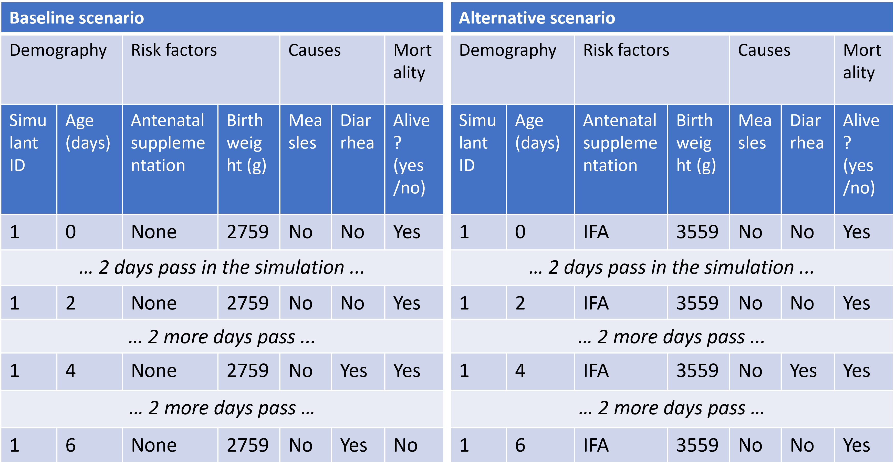

..
  Section title decorators for this document:
  
  ==============
  Document Title
  ==============
  Section Level 1
  ---------------
  Section Level 2
  +++++++++++++++
  Section Level 3
  ~~~~~~~~~~~~~~~
  Section Level 4
  ^^^^^^^^^^^^^^^
  Section Level 5
  '''''''''''''''

  The depth of each section level is determined by the order in which each
  decorator is encountered below. If you need an even deeper section level, just
  choose a new decorator symbol from the list here:
  https://docutils.sourceforge.io/docs/ref/rst/restructuredtext.html#sections
  And then add it to the list of decorators above.

.. _vivarium_best_practices_vivarium_and_other_models:

=========================================================
What is Vivarium Good For?
=========================================================

.. contents::
   :local:
   :depth: 1

What is microsimulation?
------------------------

Vivarium, a platform developed by the IHME Simulation Science team, enables **microsimulation**, a technique for combining information about attributes of 
individuals in a population (such as demographics, risk factors, disease occurrence, and intervention coverage) and relationships between these attributes, 
to estimate health outcomes in a simulated environment over time. The goal of the IHME microsimulation framework is ultimately to investigate outcomes related 
to health intervention scenarios to provide decision-makers with guidance on how best to allocate resources to maximize health gains. 

Microsimulation models incorporate relevant characteristics, including: 

- Basic demographics (e.g., age, sex/gender, race/ethnicity)
- Exposure to risk factors
- Disease incidence 
- Healthcare visit frequency
- Treatment (i.e., timing, duration, frequency, adherence, and known/assumed treatment effects)
- Adverse events
- Mortality rate/life expectancy 

The below tables provide a simplified illustration of what is included in a Vivarium microsimulation. Both tables are based on a microsimulation of 
antenatal nutritional supplementation effects on birthweight and child growth failure. 

.. image:: microsim_example_table_3.png

This first table outlines some of the simulant attributes we can include in our microsimulations. The simulants listed here have demographic attributes
such as sex and location, as well as risk factors (e.g., *did the mother/birthing person received iron and folic acid (IFA) supplementation during pregnancy?*).

This second table demonstrates our ability to simulate different intervention scenarios and compare outcomes. In this case, the baseline scenario 
entailed no antenatal supplementation for the simulant's mother/birthing person, which meant the simulant had a low birthweight. This caused the simulant
to be more susceptible to get diarrhea and not recover, which ultimately led to the simulant's death by day 6. In the alternative scenario, the simulant's 
mother/birthing person received antenatal supplementation, which led to the simulant's healthier birthweight and, subsequently, their higher likelihood of 
recovering from diarrhea and surviving past day 6. 

By using microsimulation, we probabilistically assign the above attributes heterogeneously across individuals within the simulated population. 
Taken in aggregate, these attributes match real-world population-level data, derived from IHME's Global Burden of Disease (GBD) databases and other sources. 
Over the duration of a given microsimulation run, simulant attributes are dynamically updated.

.. image:: microsim_visual.PNG

Simulation components are interdependent, and relationships between attributes are also based on best available real-world 
evidence. For example, disease progression is a function of simulant characteristics and treatment; survival depends on stage of disease and other characteristics. 

As the simulation proceeds, various simulant attributes change and these changes are recorded through observers (to read more about observers, visit [insert link here]).

.. todo::

  Add link to observers page ('Types of Vivarium Model Components') once it is created. 

.. note::

  Are you feeling confused by some of the vocabulary on this page? Please visit our `Vivarium glossary <https://vivarium-research.readthedocs.io/en/latest/glossary/index.html>`_ 
  for some definitions of microsimulation vocabulary!

What are the advantages and disadvantages of microsimulations?
--------------------------------------------------------------

Microsimulation, described above, is a special kind of model that falls under the broader umbrella of **individual-based modeling (IBM)**. This section
expands on what differentiates IBM, including microsimulation, from other types of statistical models such as compartmental models or multiplication models.

Advantages of microsimulation
+++++++++++++++++++++++++++++

Correlation between risk exposures
~~~~~~~~~~~~~~~~~~~~~~~~~~~~~~~~~~

At the individual level, risk exposures are frequently correlated. Examples include high body mass index and high fasting plasma glucose, tobacco smoking and alcohol use, 
and childhood height and weight. Microsimulation methods allow us to assign a risk exposure value independently to simulants, such that each one follows the desired population-
level univariate distribution (which frequently comes from the GBD in our microsimulations).

Our cardiovascular disease (CVD) microsimulation offers a useful example of how risk exposure correlation typically looks in microsimulations. There are several correlated 
risk factors that affect CVD outcomes, including: body mass index (BMI), systolic blood pressure (SBP), low-density lipoprotein cholesterol levels (LDL-C), and fasting 
plasma glucose (FPG). Using NHANES survey data, we calculated correlation coefficients for these relationships, which we used to generate values for all
simulants. As such, the correlation coefficients remain constant as simulants age and their risk exposure values change. You can read more about our modeling strategy for 
these risk factor correlations :ref:`on this page <2023_sbp_ldlc_fpg_bmi>`.

Continuous values
~~~~~~~~~~~~~~~~~

Similarly, microsimulation allows the modeling of joint distribution between continuous values, something which is not as possible with categorical data characteristic of 
multiplication models.

For example, in our intravenous (IV) iron intervention microsimulation, we model the joint distribution of pre-pregnancy/first trimester BMI and hemoglobin levels, as two risk 
exposures associated with poor health outcomes for both mother/birthing parent and child. We treat hemoglobin as a continuous risk exposure that varies as simulants age and move 
through the pregancy model states, while pre-pregnancy/first trimester BMI is a categorical risk exposure conditional on hemoglobin status (i.e., above or below 100 g/L) at the 
start of the pregnancy. Read more about the modeling strategy we used for this joint distribution :ref:`here <2019_risk_exposure_maternal_bmi_hgb>`.

Time-varying rates dependent on multiple factors
~~~~~~~~~~~~~~~~~~~~~~~~~~~~~~~~~~~~~~~~~~~~~~~~

Another complexity enabled by microsimulation is the inclusion of time-varying rates dependent on multiple factors. A good example of this is in our microsimulation of Multiple Myeloma, 
which allow relapse hazard rates to vary over time since treatment line initiation. Read more about how we calculated relapse hazard rates :ref:`here <calc_mortality_relapse_hazard>`.

.. todo:: 

    Elaborate on example from Multiple Myeloma model

Incorporating uncertainty
~~~~~~~~~~~~~~~~~~~~~~~~~

Microsimulation methods provide a useful approach to modeling stochastic uncertainty in a conceptually valid manner because chance – that is, reliance on randomly generated numbers – 
is used to govern movement between health states for individual simulants from a single computer-generated population, as opposed to comparing the role of chance across multiple 
populations with differing characteristics.

In the context of healthcare estimates typically characterized by considerable variance across quantities of interest, the use of Monte Carlo methods to run simulations using iterative 
draws from probability distributions provides an effective means of incorporating parameter uncertainty. 

Simulation methods have the added advantage of reducing confounding variance between different scenarios by ensuring that the simulated population is identical across all scenarios analyzed. 
The only difference between scenarios, then, is the presence or absence of health interventions. By incorporating heterogeneity at the level of the individual simulant, microsimulations are 
able to provide an additional degree of flexibility and detail (such as stratifying results according to demographic or epidemiological attributes) not available in population-level models. 

Allowing other complexities
~~~~~~~~~~~~~~~~~~~~~~~~~~~

Another benefit of microsimulations in general is that they can surface complications or limitations that are obscured in non-individual-based models, such as compartmental models.

.. todo:: 
  
  Elaborate on example of this from previous work: examining hemoglobin on curve on an individual level and seeing the discrepancies from real life that would also be present in a 
  model that doesn't go to the level of detail we do in microsim. 

Disadvantages of microsimulation
++++++++++++++++++++++++++++++++

Resource requirements
~~~~~~~~~~~~~~~~~~~~~

Our microsimulation models require a significant amount of detailed data to accurately represent individual behaviors and the relationships between them. 
Obtaining this data can be challenging and time-consuming, and there may be privacy concerns associated with using such detailed personal data. If we're 
not interested in the complexities described in the section above, then it is likely that a less resource-intensive alternative, such as a multiplication model,
is a suitable modeling strategy.

Residual confounding
~~~~~~~~~~~~~~~~~~~~

Another limitation or disadvantage of microsimulations is that getting realistic, individual-level characteristics from population-level data is difficult, and 
creates opportunity for residual confounding. 

You can read more about residual confounding and how our team accounts for it :ref:`here <residual_confounding>`.

.. todo::

  Cite [Allen-et-al-2019]_ and [Sorensen-et-al-2017]_ somewhere.
  

How does Vivarium compare with other microsimulation tools?
-----------------------------------------------------------

In this section, we will elaborate on what differentiates Vivarium, our team's microsimulation platform, from other methods of microsimulation and IBM. 

.. todo::

  Fill out the following sections under 'How does Vivarium compare with other microsimulation tools' subheading.

Leveraging the Global Burden of Disease (GBD) Study
+++++++++++++++++++++++++++++++++++++++++++++++++++

Based on GBD population-level estimates stratified by age, sex, time, and location, the IHME microsimulation framework creates a simulated population that mirrors the relevant qualities of a given real-world population of interest. Each individual simulant in the population is assigned health and demographic attributes that specify characteristics such as age, sex, disease, and risk factor status (for example, diabetes diagnosis, systolic blood pressure level, or body-mass index). In any given microsimulation analysis, there can be thousands, millions, or, theoretically, billions of simulants. Although the assigned health and demographic attributes are heterogeneous across individuals within the simulated population, when taken in aggregate they match the relevant real-world population-level data supplied by the GBD.

The IHME platform is uniquely positioned to extract relevant input parameters from the vast repository of GBD population health data that are explicitly structured to quantify uncertainty by representing estimates as draws from Bayesian-derived joint posterior distributions.

The IHME microsimulation platform, unlike most other microsimulation frameworks, additionally reduces variance between scenarios by appropriately controlling stochastic uncertainty through a common-random-numbers approach. In this procedure, for each simulant, the same randomly generated number is used in both baseline and intervention scenarios to dictate change or maintenance of health status across time steps.

.. todo::

 - Versus decision tree or other types of models?
 - Different types of individual-based models (mini lit review) 
 - What differential equations underly these different types of models?

Simulant agency
~~~~~~~~~~~~~~~

Unlike agent-based models, microsimulations do not necessarily program agency into individual simulants. This removes some of the real-world likeness of these models...

.. todo:: 
  
  Expand upon how microsim is different from agent-based modeling here. 

References
----------

.. [Sorensen-et-al-2017]

    View `Sorensen et al. 2017 <https://dl.acm.org/doi/10.5555/3140065.3140097>`_

      Sorensen et al. (2017). `Microsimulation models for cost-effectiveness analysis: a review and introduction to CEAM.` SummerSim '17: Proceedings of the Summer Simulation Multi-Conference, Society for Computer Simulation International. 

.. [Allen-et-al-2019]

    View `Allen et al. 2019 <https://healthyalgorithms.files.wordpress.com/2021/05/2019-enabling-model-complexity-through-an-improved-workflow-mws_paper-christine-allen.pdf>`_

      Allen et al. (2019). `Enabling Model Complexity Through an Improved Workflow.` Healthy Algorithms. 

.. todo:: 
  Add citation to Vivarium Technical Document 2019