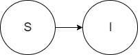

.. _models_cause:

===============
Modeling Causes
===============

What is included in this chapter: models of causes that are represented as
finite-state Markov chains (this chapter will also explain what a finite state
Markov chain is!)

There are models of things that you might consider causes which are outside of
the scope of this chapter, because they do not fit into the Markov approach.
This chapter does not include :ref:`PAF of 1 <models_risk_attributable_cause>`
causes, like
:ref:`protein-energy malnutrition <2017_cause_pem>`. It also does not include
things that are sometimes considered diseases but are deemed
:ref:`risk factors <models_risk>` by the :term:`Global Burden of Disease`
(GBD), such as :ref:`obesity <2017_risk_bmi_adults>`.
:ref:`Unsafe water <2017_risk_unsafe_water>` would not fit into the cause model
paradigm either---it is a cause of
:ref:`diarrheal disease <2017_cause_diarrhea>`, but it is a risk factor in the
GBD taxonomy.  :ref:`Latent tuberculosis <2017_cause_latent_tb>` infection
(LTBI) does fit into this chapter, but just barely.

.. contents::
   :local:

What is a "cause" and what is a cause model?
--------------------------------------------

When we say "cause" in simulation modeling with `vivarium`, we often mean a
disease.

There is a reason for this potentially confusing terminology: a “cause of
death”, as might be included as the bottom line of the
top half of a death certificate, is often a disease but sometimes an injury.
And we extend this to also refer to causes of nonfatal health loss, too.

.. image:: death_certificate.png

A cause model is a simplification of a cause of death or disease for the
purposes of simulation modeling.  It is always an idealization of the messy
complexity of reality, and is designed to be acceptable to outside experts on
the cause, as well as be parsimonious with the data available from the GBD
that might inform the model.

.. todo::

   Link to GBD hierarchies for production of YLLs and YLDs.  Add discussion
   of the discrepancy between our cause models (unified dynamic models of
   prevalence, incidence, mortality & morbidity) and GBD models (separate
   statistical models of mortality & morbidity only, with intermediate (e.g.
   dismod) unified models). Note where this might cause modeling issues!

   Might be better as a separate section.

Learning objectives
-------------------

After reading this chapter, learners should be able to:

1. Develop an understanding of how the GBD, literature, and experts think
   about a cause. [[to come]]
2. Build :term:`internally consistent <Internally Consistent Model>` cause
   models which are :term:`sufficiently complex <Sufficiently Complex Model>`
   given larger modeling goals. [[to come]]

   a. Models that are as simple as possible, but no simpler.
   b. Models that agree with withheld data.
   c. Models that captures the outcomes of interest. (Which is really the same
      as “but no simpler” in (a))

3. Document the models in a way software engineers can build and
   :term:`verify <Verification>` it, and document their understanding
   comprehensively for future researchers (including their future selves) who
   are faced with related modeling challenges.

How is a cause model incorporated into a larger model?
------------------------------------------------------

Our modular structure is designed to layer cause models into the
:term:`entity component system <Entity Component System>` that has a
demographic model.  Sometimes an intervention model will be layered in on top
of this and directly change transition rates in one or more cause models.  But
to date, it has been more common to have one or more risk factor models layered
in to affect the incidence rates in the cause model, and then have an
intervention model shift the risk exposure levels defined by the risk factor
model.

It can be useful to consider two separate ways that a cause models fits into
a larger model: (1) how does a cause model affect other parts of the model?
and (2) how is a cause model affected by other parts of the model?

[[More details on this to come]]

Why do we want a document that describes each cause model?
----------------------------------------------------------

* Because a lot of work goes into gaining understanding and developing an
  appropriately complex model, and we don’t want to repeat that work.
* Because we (researchers) need to communicate clearly and precisely with
  software engineers, data scientists, and each other about what the model
  must do and what data must inform it.
* Because we will need to communicate to an outside audience, including
  critics, how we generated substantive results of interest, and that will
  include readers who want to know exactly how we modeled the diseases
  included in our work.

What does a model document look like?
-------------------------------------

.. todo:

   replace this section with a template or just links to examples + discussion
   of the sections. Likely need a whole section on cause model diagrams with
   a concrete description of how we represent different kinds of states
   and transitions. A common diagram language will make communication a
   million times easier.

* Title which is descriptive
* Cause model diagram

  - Set of states that are “mutually exclusive and collectively
    exhaustive”---a single agent is in exactly one of these states at any
    point in time.
  - Set of transitions between states.

* Definition of model and states.
* Restrictions: who does this apply to?
* How to initialize the states? (prevalence data)
* Definition of transitions in terms of states they connect.
* Transition criteria (rates, durations, deterministic, etc.)
* How does this model connect to other models.  That is, what outcomes this
  disease influences? (e.g. disability, mortality, or incidence)
* What data informs those connections?
* “Theory of disease” meaning is this a “susceptible-infected” model (SI), is
  a recurrent MI model, etc?  This prose should match and complement the cause
  model diagram.
* Validation criteria
* Assumptions about the model

[[to be updated based on experience from LTBI cause model document, and
generalization thereof]]

Basic Cause Model Structures
----------------------------

.. todo:: 

	Link to examples of cause model documents

Common basic cause model structures are described in the following table and 
dicussed in further detail below. Notably, cause models are almost always more 
complicated than the basic structures discussed in this section. The following 
basic structures should be considered as basic guiding concepts, and not as 
templates that are appropriate for all (or even most) cause models. Examples 
of more complicated cause model structures are discussed in the `Other Cause 
Model Structures`_ section afterward.

.. list-table:: Basic Cause Model Structures
	:widths: 20 20 20
	:header-rows: 1

	* - Model
	  - States
	  - Description
	* - SI_
	  - Susceptible-Infected
	  - Simulants never recover from the infected (with condition) state
	* - SIS_
	  - Susceiptible-Infected-Susceptible
	  - Simulants can recover from the infected (with condition) state and can become infected again after recovery
	* - SIR_
	  - Susceptible-Infected-Recovered
	  - Simulants can recover from the infected (with condition) state and cannot become infected after recovery

SI
++

In this cause model structure, simulants in the susceptible state can 
transition to the infected state, where they will remain for the remainder of 
the simulation. 

This cause model structure is appropriate for chronic conditions from which 
individuals can never recover.

Examples of conditions potentially appropriate for an SI cause model structure 
include Alzheimer’s disease and other dementias.

SIS
+++

.. image:: SIS.png

In this cause model structure, simulants in the susceptible state can 
transition to the infected state and simulants in the infected state can 
transition to the susceptible state. Notably, this cause model allows for
simulants to enter the infected state more than once in a simulation. 

This cause model structure is appropriate for conditions for which individuals 
can have multiple cases over their lifetimes.

Examples of conditions potentially appropriate for an SIS cause model 
structure include :ref:`diarrheal diseases <2017_cause_diarrhea>`.

SIR
+++

.. image:: SIR.png

In this cause model structure, simulants in the susceptible state can 
transition to the infected state and simulants in the infected state can 
transition to a recovered state where they will remain for the remainder
of the simulation. Notably, the cause model allows individuals to become 
infected only once in a simulation.

This cause model structure is appropriate for conditions for which individuals 
can only have a single case, but do not stay in the with condition state 
forever.

An example of a condition potentially appropriate for an SIR cause model 
structure is :ref:`measles <2017_cause_measles>`.

.. _`Other Cause Model Structures`:

Other Cause Model Structures
++++++++++++++++++++++++++++

It is common that a particular cause may not fit well into one of the common 
basic cause model structures discussed above. Examples of situations that may 
require custom cause model structures are listed below:

- Cause models with severity splits
- Joint cause models (multiple closely related causes represented in a single cause model)
- Neonatal/Congenital cause models
- Other scenarios required by the specifics of a given cause

Data Sources for Cause Models
-----------------------------

Once a cause model structure is specified, data is needed to inform its states
and transitions. For our purposes, cause models generally have the following
data needs:

`Cause Model Initialization`_

  Which cause model state will a simulant begin the simulation in?

`Cause Model Transitions`_

  How and when does a simulant move between cause model states?

`Mortality Impacts`_

  How and when does a simulant die and how does this differ depending on the
  specific cause model state that the simulant occupies?

`Morbidity Impacts`_

  How does a simulant experience morbidity and how does this differ depending
  on the specific cause model state that the simulant occupies?

`Restrictions`_

  For which population groups (e.g. age and sex groups) is this cause model
  not valid?

Our cause models use approximately instantaneous, individual-based
probabilities to make decisions about how an individual simulant moves about
a cause model. Because we cannot possibly predict the exact moment a specific
individual will get sick or die, we use population-level estimates as our
best-guess predictors for individual-level estimates.

  For instance, we don't know if Jane Doe will die in the next year, however,
  we can use information on the overall rate of death in Jane Doe's
  population to make a guess on the probability that Jane Doe will die in the
  next year.

  We can increase the quality of this guess by adding detail to the model we
  use to make our guesses. For instance, if we know Jane Doe has HIV, we can
  use the rate of death among individuals with HIV to make a better guess at
  the probability Jane Doe will die in the next year.

There are several common population-level data sources that are used to
inform our cause models. These data sources are outlined in the table below
and discussed in more detail afterward.

.. list-table:: Data Definitions
   :widths: 20 30 30 30
   :header-rows: 1

   * - Measure
     - Definition
     - Model Application
     - Specific Use
   * - `Prevalence`_
     - Proportion of population with a given condition.
     - Initialization
     - Represents the probability that a simulant will begin the simulation
       in a with-condition cause model state.
   * - `Birth Prevalence`_
     - Proportion of all live births born with a given condition.
     - Initialization
     - Represents the probability that a simulant born during the simulation
       will be born into a with-condition cause model state.
   * - `Incidence Rates`_
     - Number of new cases of a given condition per person-year of the at-risk
       population.
     - Transition rates
     - Once scaled to simulation time-step, represents the probability a
       simulant will transition from infected to recovered.
   * - `Remission Rates`_
     - Number of recovered cases from a given condition per person-year of the
       population with the condition.
     - Transition rates
     - Once scaled to simulation time-step, represents the probability a
       simulant will recover from the with-condition state.
   * - `Duration`_
     - Length of time a condition lasts.
     - Transition rates
     - Amount of time a simulant remains in a given state
   * - `Progression`_
     -
     - Transition rates
     -
   * - `Severity Splits`_
     -
     - Transition Rates
     -
   * - `Restrictions`_
     - List of groups that are not included in a cause.
     - General
     - List of population groups for which the cause model does and
       does not apply.
   * - `Disability Weights`_
     - Proportion of full health not experienced due to disability associated
       with a given condition.
     - Morbidity impacts
     - Rate at which an individual accrues years lived with disability due to
       the state in the cause model.
   * - `Cause-specific Mortality`_
     -
     -
     -
   * - `Excess Mortality`_
     -
     -
     -

Cause Model Initialization
++++++++++++++++++++++++++

Prevalence
^^^^^^^^^^

Prevalence is defined as the **proportion of a given population that possesses
a specific condition or trait** at a given time-point.

  For example, the prevalence of diabetes mellitus in the United States was
  approximately 6.5% in 2017.

	Notably, GBD prevalence estimates for a given year (e.g. 2017) are meant 
	to represent the point prevalence at the *midpoint* of that year (e.g. 
	7/1/17).

Prevalence data can be used to **initialize cause model states** and
represents the **probability that a simulant will begin the simulation in a
given state.**

  For example, the probability that a simulant in a model of diabetes 
  mellitus in the United States beginning in 2017 will begin the simulation 
  with diabetes is 0.065, or 6.5%. 

Notably, prevalence is used to initialize cause model states in the following 
scenarios:

- A simulant enters the simulation at the start of the simulation
- A simulant enters the simulation due to immigration to the simulated 
  location
- A simulant enters the simulation by *aging* into the simulation

	Prevalence is **not** used to initialize cause model states when a 
	simulant is *born* into a simulation. See the below section on birth 
	prevalence for how cause model states are initialized in this scenario.

GBD results of cause prevalence are estimates of *point* prevalence at the year 
midpoint. Notably, Vivarium assumes that the prevalence of a given cause is 
*constant* across the entire year that it represents. This is likely an
appropriate assumption in cases where prevalence is relatively constant over
time and over age groups, although it may be limited in cases where it is not. 

Birth Prevalence
^^^^^^^^^^^^^^^^

Birth prevalence is defined as the **proportion of live births in a given
population that possess a given condition or trait at birth.**

  For example, the birth prevalence for cleft lip in the United States in 2006
  was 10.6 per 10,000 live births, or 0.106%.

Birth prevalence data can be used to **initialize neonatal cause model
states** and represent the **probability that a simulant who is born during
the simulation will be born into a given neonatal cause model state.**

  For example, the probability that a simulant born during a simulation of
  cleft lip in the United States in 2006 is 0.00106, or 0.106%.

Cause Model Transitions
+++++++++++++++++++++++

.. todo::

	Enhance blurb to beginning of cause model transition section about how we use probabilies to inform cause model transitions (to come in next commits)
  
  Limitations/assumptions of incidence rates section
	
  Detail remaining transition rate data sources (remission, duration, severity splits, deterministic)

Vivarium uses probabilities to make decisions about how and when simulants 
move between cause model states. 

Incidence Rates
^^^^^^^^^^^^^^^

Generally, incidence is a measure of new cases of a given condition that occur 
in a specified timeframe and population. The count value of new cases of the 
condition of interest will always be the numerator of incidence measures. The 
denominator of incidence measures is somewhat more complex and is critical to 
ensuring an accurate data source to inform cause model transition rates. 

Two incidence measures relevant to cause model transition rate data sources 
using GBD results are discussed in this section, including measures we refer 
to as **incidence in the total population** (as estimated by the GBD study) 
and **incidence in the susceptible** (or *at-risk*) **population.** These 
measures are defined using the following key concepts:

  **Person-time:** person-time is a measure of the number of individuals 
  multiplied by the amount of time they individually occupy the population 
  of interest. Notably, the population of interest varies depending on context 
  and can be defined by age group, sex, location, time, disease status, etc.

    For example, if one individual is occupies the population of interest for 
    two years, they contribute two person-years. If another individual is in 
    our population of interest for 6 months, they contribute 0.5 person-years.
    Together, these two individuals contribute a total of 2.5 person-years.

  **Susceptible or At-Risk Population:** the susceptible population, also 
  referred to as the at-risk population, is defined as the population that *
  does not* have the condition of interest; in other words, the susceptible 
  population that is at risk of developing the condition. Notably, the number 
  of individuals in this population will change over time as the following 
  events occur:

     - Members of the at-risk population develop the condition and are no 
       longer susceptible
     - Members of the at-risk population die and are no longer susceptible 
     - Individuals are born or age into the at-risk population and become 
       susceptible
     - Individuals age out of the at-risk population and are no longer susceptible
     - Individuals with the condition recover from the condition and re-enter 
       the at-risk population as susceptible (in the case of conditions with 
       remission)

**Total Population Incidence Rate** is estimated by the Global Burden of 
Disease Study by estimating the number of incident cases that occur in one 
year and scaling this value per 100,000 individuals of a specified population.

.. math::

  \frac{n_\text{incident cases}}{\text{person-time}_\text{total population}}

Because the denominator of this measure is not specific to a particular cause 
model state, it is **not** an appropriate data source for cause model 
transition rates between states. 

.. note:: 

  GBD estimates of total population incidence rate require transformation 
  prior to use as a cause model transition probability data source (see below 
  for more detail).

**Susceptible/At-Risk Population Incidence Rate** as discussed here is also 
referred to as incidence density rate, person-time incidence rate, and in some 
cases may simply be referred to as the incidence rate. It is defined as:

.. math::

  \frac{n_\text{incident cases}}{\text{person-time}_\text{susceptible population}}

Because the denominator for the susceptible population incidence rate is 
person-time in the at-risk population, this incidence rate can be used to 
compute the probability of a new case of the condition occuring in an individual 
without the condition in a given time frame. Therefore, it can be used to compute 
the probability that a simulant will transition from a susceptible to infected 
cause model state in a given timestep.

  For instance, consider an example in which the global susceptible population 
  incidence rate of injuries in 2017 was 6,800 cases per 100,000 person-years, 
  or 0.068 cases per person-year. In this example, 6,800 new injuries occurred 
  among 100,000 person-years of observation among the non-injured population.

  Now, consider a cause model with a susceptible (not injured) state and an 
  infected (injured) state with a simulation timestep of 1 year. In this case, 
  the probability that a simulant will transition from the susceptible to 
  infected state within a single timestep (i.e. the transition probability) 
  would be represented as 0.068.

  Notably, in order to represent the transition probability for a single 
  simulant within a single timestep, the cumulative incidence value needs to 
  be scaled so that the person-time denominator is equal to the simulation 
  timestep. Therefore, if the timestep of the cause model considered above 
  were six months instead of one year, the transition probability would be 
  0.034 (0.034 cases per 0.5 person-years). 

.. note::

  Because GBD estimates total population incidence rates, Vivarium 
  automatically transforms GBD results into susceptible population incidence 
  rates that can be used as an appropriate data source for cause model 
  transition probabilities. 

  This transformation from total population incidence rate to an approximation 
  of the susceptible population incidence rate is performed with the following 
  calculation:

  .. math::

    \frac{\text{Total Population Incidence Rate}}{(1-\text{Condition Prevalence})}

There are several key assumptions and limitations to the approach of using GBD 
incidence rates as data sources for cause model transition rates, disscussed 
below.

.. todo::

    Add discussion of transformation of GBD estimates of total population to 
    susceptible population incidence rates

    Add discuission about assumption that transition probability is constant 
    over time frame and link to hazard rates page for when this might be an 
    issue. Include formulas about how we are approximating hazard rate. 

    Add discussion about how cause model transition probabilities are 
    state-specific and not necessarily cause-specific. Cannot use cumulative 
    incidence of disease to represent the transition probability from 
    susceptible to moderate disease directly, for example. (maybe use LTBI as 
    an example here)
    

Remission Rates
^^^^^^^^^^^^^^^

**Definition**

Remission is a measure of cases that recover from a with-condition state, given 
a specified population and time period. Just as with incidence, the numerator is 
given by the count of recovered (or *remitted*) cases, and the denominator is 
the cumulative person-time [link to person-time definition in incidence 
section] during which cases are able to go into remission.

  For example, consider diarrhea cases in the Philippines in 2017. Say there
  were 1 million prevalent cases of diarrhea over the course of 2017, and each
  case remitted after an average of 5 days. Note that here we are using *period
  prevalence*; however, we typically mean *point prevalence* when we say
  prevalence, and point prevalence is also what GBD uses. The way we then define
  this remission rate depends on the denominator we choose; some examples
  include:

    .. math::
    	
    	\frac{\text{1/5 case}}{\text{1 person-days}}=\frac{365/5\text{ cases}}{\text{1
       person-year}}=73\text{ cases/person-year}

  We also note that in this setting, if we consider a one-year timestep (as
  GBD does), as diarrheal diseases have such a high remission rate relative to
  one year, *period prevalence* is effectively the same as incidence. We can
  see how this would not be the case if the remission rate were low enough,
  relative to the timestep, such that an incident case in one year is still
  a prevalent case the following year, and thus prevalent cases for any given
  year contain more than just the incident cases from the same year.

  To illustrate this idea, say that there were 142,794 prevalent cases of
  diabetes in Moldova amongst males in 2017. Here we could refer either to the
  point prevalence on either January 1 2017, or the mid-year point prevalence 
  (as GBD estimates), or we could consider the period prevalence, as we expect 
  these to be approximately the same. Say that of those 142,794 cases, 509
  remitted in 2017. This gives us the following rate:

  .. math::

    \frac{\text{509 cases}}{\text{142,794 person-years}} =
    \frac{\text{0.0036 cases}}{\text{1 person-year}} = \frac{\text{1 case}}{
    \text{280 person-years}}

  It is clear why we wouldn't ever talk about someone remitting from diabetes
  after 280 years.
 
Note that when we refer to remission rates, we are typically considering
a rate within the infected or with-condition population. This is true both in
general, and in the context of GBD--unlike with incidence.

**Remission within GBD**

Most nonfatal models in GBD are run using DisMod [link to DisMod page]. DisMod 
estimates compartmental models of disease, which includes an estimate of 
remission in terms of **{remitted cases in the with-condition population} per 
{person-year}**. Thus DisMod's estimates of various measures (prevalence, 
incidence, remission, excess mortality rate, etc.) are internally consistent for 
any given model.

GBD's final outputs, however, are in the form of YLLs, YLDs, and DALYs. To 
calculate these measures such that they are consistent across different causes, 
GBD runs standardizing processes on estimates of prevalence, incidence, and 
estimated mortality rate. Note then that these final estimates are no longer 
consistent with the DisMod estimates. However, as remission is not needed to 
calculate YLDs, the latest-stage estimate of remission produced by GBD comes 
from DisMod models.

**Implementing remission rates in cause models**

As with incidence, as remission is a rate within the with-condition population, 
it can be used to compute the probability of a simulant transitioning from an 
infected or with-condition state to a susceptible or free-of-condition state in 
a given timestep.

Duration-Based Transitions
^^^^^^^^^^^^^^^^^^^^^^^^^^

Deterministic or Triggered Transitions
^^^^^^^^^^^^^^^^^^^^^^^^^^^^^^^^^^^^^^

Progression Transitions
^^^^^^^^^^^^^^^^^^^^^^^

Severity Splits
^^^^^^^^^^^^^^^

Mortality Impacts
+++++++++++++++++

Cause-Specific Mortality
^^^^^^^^^^^^^^^^^^^^^^^^

Excess Mortality
^^^^^^^^^^^^^^^^

Morbidity Impacts
+++++++++++++++++

Disability Weights
^^^^^^^^^^^^^^^^^^

Restrictions
++++++++++++
