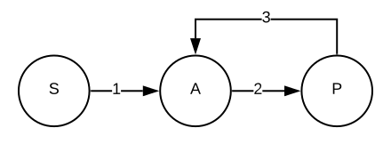

.. _2017_cause_ischemic_heart_disease:

================================
Ischemic Heart Disease: GBD 2017
================================

Disease Description
-------------------

Ischemic heart disease (IHD) is a non-communicable cardiovascular disease
which occurs when the arteries of the heart cannot deliver enough oxygen-rich
blood to the heart. Since 1990, this disease has been a leading cause of
global Years of Life Lost (YLL). GBD 2017 listed IHD as the leading cause of
YLLs globally, with a mean percentage increase in 3.9% in all-age YLL rate
since 2007. According to NIH_, IHD is also known as Coronary Artery Disease,
Coronary Heart Disease, Coronary Microvascular Disease. Symptoms and
complications can vary by person, even if they have the same type of ischemic
heart disease. Reported symptoms vary whether a person is experiencing an
acute coronary event, such as a heart attack, or has chronic IHD. Symptoms may
get worse as the buildup of plague continues to narrow the coronary arteries.

Acute coronary events may cause symptoms such as angina, cold sweats,
dizziness, nausea, neck pain, shortness of breath, sleep disturbances, or
weakness.

Chronic ischemic heart disease can cause signs and symptoms such as angina,
anxiety or nervousness, fatigue, or neck pain.

.. _NIH: https://www.nhlbi.nih.gov/health-topics/ischemic-heart-disease

GBD 2017 Modeling Strategy
--------------------------

GBD 2017 models fatal and non-fatal IHD estimates separately. GBD 2017 models
IHD using Myocardial infarction (MI) sequelae to estimate the prevalence of
IHD, due to the challenges of disease detection and varying symptoms across
the population.

Myocardial infarction (MI) in GBD 2017
++++++++++++++++++++++++++++++++++++++

The case definition can be found below and is stratified by two
sections: 'Acute myocardial infarction (MI)' and 'Chronic IHD'. The case
definition for non-fatal IHD modeling can be found in both sections of the
case definition. The case definition for fatal IHD modeling can be found in
section 1 below.

1. Acute myocardial infarction (MI): Definite and possible MI according to
   the third universal definition of myocardial infarction:

    When there is clinical evidence of myocardial necrosis in a clinical
    setting consistent with myocardial ischemia or detection of a rise and/or
    fall of cardiac biomarker values and with at least one of the following:

      - symptoms of ischemia,
      - new or presumed new ST-segment-T wave changes or new left bundle
        branch block,
      - development of pathological Q waves in the 277 ECG,
      - imaging evidence of new loss of viable myocardium or new regional
        wall motion abnormality, or
      - identification of an intracoronary thrombus by angiography or autopsy.
      - Sudden (abrupt) unexplained cardiac death, involving cardiac arrest or
        no evidence of a noncoronary cause of death.
      - Prevalent MI is considered to last from the onset of the event to
        28 days after the event and is divided into an acute phase (0–2 days)
        and subacute (3–28 days).

2. Chronic IHD

      - Angina; clinically diagnosed stable exertional angina pectoris or
        definite angina pectoris according to the Rose Angina Questionnaire,
        physician diagnosis, or taking nitrate medication for the relief of
        chest pain.
      - Asymptomatic ischemic heart disease following myocardial infarction;
        survival to 28 days following incident MI. The GBD study does not use
        estimates based on ECG evidence for prior MI, due to its limited
        specificity and sensitivity.

For GBD 2017 IHD fatal model, the type of model input data included data from
vital registration and verbal autopsy data. The fatal model outliered verbal
autopsy data in countries and subnational locations where high-quality vital
registration data were also available. The fatal model also outliered
non-representative subnational verbal autopsy data points, ICD8 and ICD9 BTL
data points which were inconsistent with the rest of the data and created
implausible time trends, and data in a number of Indian states identified by
experts as poor-quality. For the fatal model, estimates for YLLs were
calculated by pulling CoD data and location-level covariates, running this
data through CODEm models and CodCorrect, and adjusting for deaths at the
location/year/age/sex stratification.
[GBD-2017-YLL-Capstone-Appendix-1-Ischemic-Heart-Disease]_

For GBD 2017 IHD non-fatal model, the type of model input data included epi
data from a systematic review, vital registration, and verbal autopsy data.
For the non-fatal model, the proportion of MI is calculated by pulling in CoD
data and pre-redistribution of CoDCorrect data and loading into Dismod. Acute
IHD CSMR is calculated through a custom process which includes post-CodCorrect
IHD deaths. MI prevalence and incidence results are estimated through standard
Dismod model. MI prevalence estimates are then used to calculate severity
splits of acute MI and chronic IHD. Asymptomatic IHD prevalence is estimated
through pulling data from Dismod and then making adjustments to avoid
double-counting heart failure due to IHD and Angina due to IHD. Angina due to
IHD is estimated using a standard Dismod model. These estimates are then used
for severity splits of angina due to IHD. YLLS, DALYs, and
comorbidity-adjusted YLDs are estimated by pulling in all unadjusted results
of prevalence and incidence (MI, acute IHD, IHD following MI, angina due to
IHD) and weighing for disability.
[GBD-2017-YLD-Capstone-Appendix-1-Ischemic-Heart-Disease]_

Cause Hierarchy
+++++++++++++++
.. image:: cause_hierarchy_ihd.svg

Restrictions
++++++++++++

The following table describes any restrictions in GBD 2017 on the effects of
this cause (such as being only fatal or only nonfatal), as well as
restrictions on the ages and sexes to which the cause applies.

.. list-table:: GBD 2017 Cause Restrictions
   :widths: 15 15 20
   :header-rows: 1

   * - Restriction Type
     - Value
     - Notes
   * - Male only
     - False
     -
   * - Female only
     - False
     -
   * - YLL only
     - False
     -
   * - YLD only
     - False
     -
   * - YLL age group start
     - 15
     - [15, 20), age_group_id=8
   * - YLL age group end
     - 125
     - [95, 125 years), age_group_id=235
   * - YLD age group start
     - 15
     - [15, 20), age_group_id=8
   * - YLD age group end
     - 125
     - [95, 125 years), age_group_id=235

Vivarium Modeling Strategy
--------------------------

Scope
+++++

The aspects of the disease this cause model is designed to simulate are the
states, transitions, and sequelae. The Vivarium model of IHD has been of a
similar design to GBD 2017 by modeling IHD using MI sequelae to estimate the
prevalence of IHD. Like GBD 2017, Vivarium's design includes two states: one
that is defined by myocardial infarction ('Acute MI') and one state defined
by a chronic state that is duration-based ('Post-MI'). Vivarium's design of
'Acute MI' is modeled exactly after GBD 2017's 'Acute MI' case definition.
Vivarium's design of 'Post MI' is modeled exactly after GBD 2017's
'Chronic IHD' case definition.

Model Assumptions and Limitations
+++++++++++++++++++++++++++++++++

Apart from inpatient hospital and inpatient claims data, GBD 2017 did not
include any data from sources other than the literature for myocardial
infarction. Given this information, the assumption is that MI is the best
and only estimator for the IHD model. The limitation of this assumption and
approach is the exclusion of non-MI data sources could be underestimating the
IHD model. In the Vivarium Modeling Strategy, the limitation of the IHD model
is we do not initial 'Acute MI' state in the first 28 days, and assume that
prevalence = 0.

The risk factor of SBP affects the transition rates 1 and 3 listed below, through the GBD measure of incidence_c493.

Cause Model Diagram
--------------------

Data Description
----------------

State and Transition Data Tables
++++++++++++++++++++++++++++++++

.. list-table:: State Definitions
   :widths: 1, 10, 15
   :header-rows: 1

   * - State
     - State Name
     - Definition
   * - S
     - **S**\ usceptible
     - Susceptible to IHD
   * - A
     - **A**\ cute Myocardial Infarction (MI)
     - Simulant that experiences acute MI symptoms
   * - P
     - **P**\ ost-MI IHD
     - Simulant that experiences angina and asymptomatic ischemic heart
       disease following myocardial infarction; survival to 28 days following
       incident MI

.. list-table:: State Data
   :widths: 5 10 10 20
   :header-rows: 1

   * - State
     - Measure
     - Value
     - Notes
   * - All
     - cause-specific mortality rate
     - :math:`\frac{\text{deaths_c493}}{\text{population}}`
     -
   * - P
     - excess mortality rate
     - emr_m15755
     -
   * - A
     - excess mortality rate
     - emr_m1814
     -
   * - S
     - excess mortality rate
     - 0
     -
   * - P
     - disability weight
     - :math:`\frac{1}{\text{prevalence_c493}} \times \sum\limits_{s \in post-mi-sequelae} \text{disability_weight}_s \cdot \text{prevalence}_s`
     -
   * - A
     - disability weight
     - :math:`\frac{1}{\text{prevalence_c493}} \times \sum\limits_{s\in acute-sequelae} \text{disability_weight}_s \cdot \text{prevalence}_s`
     -
   * - S
     - disability weight
     - 0
     -
   * - P
     - prevalence
     - :math:`\sum\limits_{s\in post-mi-sequelae} \text{prevalence}_s`
     -
   * - A
     - prevalence
     - :math:`\sum\limits_{s\in acute-sequelae} \text{prevalence}_s`
     -
   * - S
     - prevalence
     - 1-prevalence_493
     - simulants not prevalent with IHD

.. list-table:: Transition Data
   :widths: 10 10 10 10 10
   :header-rows: 1

   * - Transition
     - Source State
     - Sink State
     - Value
     - Notes
   * - 1
     - S
     - A
     - incidence_c493
     -
   * - 2
     - A
     - P
     - 28 days
     - duration-based transition from acute state then progress into post state
   * - 3
     - P
     - A
     - incidence_493
     -

.. list-table:: Data Sources and Definitions
   :widths: 10 10 20 20
   :header-rows: 1

   * - Variable
     - Source
     - Description
     - Notes
   * - prevalence_c493
     - como
     - prevalence of ischemic heart disease
     -
   * - deaths_c493
     - codcorrect
     - Count of deaths due to chronic kidney disease
     -
   * - population
     - demography
     - Mid-year population for given sex/age/year/location
     -
   * - prevalence_s{sid}
     - como
     - Prevalence of sequela with id {id}
     -
   * - disability_weight_s{sid}
     - YLD appendix
     - Disability weight of sequela with id {id}
     -
   * - incidence_493
     - como
     - Incidence of ischemic heart disease
     -
   * - emr_m15755
     - dismod-mr
     - excess-mortality rate of post-MI ischemic heart disease
     -
   * - emr_m1814
     - dismod-mr
     - excess-mortality rate of MI due to ischemic heart disease
     -
   * - acute-sequelae
     - model assumption
     - {s378, s379}
     -
   * - post-mi-sequelae
     - model assumption
     - {s380, s381, s382, s383, s384, s385, s953, s1040, s5726}
     -

Validation Criteria
-------------------

.. todo::

   Describe tests for model validation.

At the IHD cause level:

1. Is CSMR close to pre

References
----------

.. [GBD-2017-YLD-Capstone-Appendix-1-Ischemic-Heart-Disease]
   Supplement to: `GBD 2017 Disease and Injury Incidence and Prevalence
   Collaborators. Global, regional, and national incidence, prevalence, and
   years lived with disability for 354 diseases and injuries for 195 countries
   and territories, 1990–2017: a systematic analysis for the Global Burden of
   Disease Study 2017. Lancet 2018; 392: 1789–858`
   (pp. 335-341)

.. [GBD-2017-YLL-Capstone-Appendix-1-Ischemic-Heart-Disease]
   Supplement to: `GBD 2017 Causes of Death Collaborators. Global, regional,
   and national age-sex-specific mortality for 282 causes of death in 195
   countries and territories, 1980–2017: a systematic analysis for the Global
   Burden of Disease Study 2017. Lancet 2018; 392: 1736–88`
   (pp. 203-204)

