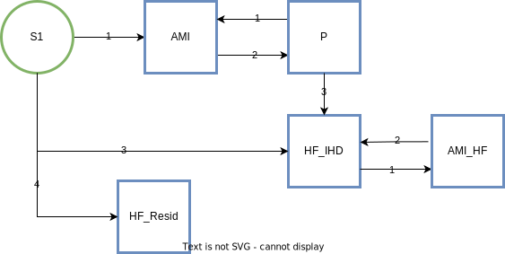

.. _2019_cause_ihd:

===================================================
Ischemic Heart Disease and Heart Failure: GBD 2019
===================================================

In the GBD, IHD and heart failure are separated. IHD is a cause and heart failure is 
considered an impairment, without deaths directly attributed to it. For this project, 
we are modeling HF in two parts: due to ischemic heart disease and residual, both of which are 
represented on this page. 

.. contents::
   :local:
   :depth: 1

.. list-table:: Abbreviations
   :widths: 15 15 15
   :header-rows: 1

   * - Abbreviation
     - Definition
     - Notes
   * - IHD
     - Ischemic heart disease
     - 
   * - MI
     - Myocardial infarction
     - 
   * - AMI
     - Acute myocardial infarction
     - 
   * - HF
     - Heart failure 
     - 

Disease Overview
----------------

**Ischemic Heart Disease** 

Ischemic heart disease (IHD) is a non-communicable cardiovascular disease which occurs when the arteries of the heart cannot deliver enough oxygen-rich blood to the heart. IHD is also referred to as coronary artery disease or coronary heart disease and is often caused by the buildup of plaque, a waxy substance, inside the lining of larger coronary arteries. This buildup can partially or totally block blood flow in the large arteries of the heart. Some types of this condition may be caused by disease or injury affecting how the arteries work in the heart.

Symptoms of coronary heart disease may be different from person to person even if they have the same type of coronary heart disease. Acute coronary events may cause symptoms such as angina, cold sweats, dizziness, nausea, neck pain, shortness of breath, sleep disturbances, or weakness. Chronic ischemic heart disease can cause signs and symptoms such as angina, anxiety or nervousness, fatigue, or neck pain. Symptoms may get worse as the buildup of plaque continues to narrow the coronary arteries. However, because many people have no symptoms, they do not know they have coronary heart disease until they have chest pain, a heart attack, or sudden cardiac arrest. 

Coronary microvascular disease is another type of coronary heart disease. It occurs when the heart’s tiny blood vessels do not work normally.

[NIH_IHD]_

**Heart Failure** 

Heart failure is a condition in which the heart can't pump enough blood to meet the body's needs. In some cases, the heart can't fill with enough blood, while in others, the heart can't pump blood to the rest of the body with enough force. Some people have both problems. 

Heart failure develops over time as the heart's pumping action grows weaker. It can affect one or both sides of your heart. Right-side heart failure occurs if the heart can't pump enough blood to the lungs to pick up oxygen. Left-side heart failure occurs if the heart can't pump enough oxygen-rich blood to the rest of the body. Left-sided and right-sided heart failure may have different causes. Right-side heart failure may cause fluid to build up in the feet, ankles, legs, liver, abdomen, and the veins in the neck. Right-side and left-side heart failure also may cause shortness of breath and fatigue (tiredness). 

The leading causes of heart failure are diseases that damage the heart. Examples include ischemic heart disease, high blood pressure, and chronic obstructive pulmonary disease. 

[NHLBI]_
[AHA_IHD]_

GBD 2019 Modeling Strategy
--------------------------

GBD 2019 Non-Fatal Modeling Strategy
++++++++++++++++++++++++++++++++++++

**Case definitions:**\

1. Acute myocardial infarction (MI): Definite and possible MI according to the fourth universal definition of myocardial infarction:
  
  a. When there is clinical evidence of myocardial necrosis in a clinical setting consistent with myocardial ischaemia or
  b. Detection of a rise and/or fall of cardiac biomarker values and with at least one of the following: i) symptoms of ischaemia, ii) new or presumed new ST-segment-T wave changes or new left bundle branch block, iii) development of pathological Q waves in the ECG, iv) imaging evidence of new loss of viable myocardium or new regional wall motion abnormality, or v) identification of an intracoronary thrombus by angiography or autopsy.
  c. Sudden (abrupt) unexplained cardiac death, involving cardiac arrest or no evidence of a non-coronary cause of death
  d. Prevalent MI is considered to last from the onset of the event to 28 days after the event and is divided into an acute phase (0-2 days) and subacute (3-28 days).

2. Chronic IHD:
  
  a. Asymptomatic ischaemic heart disease following myocardial infarction; survival to 28 days following incident MI. The GBD study does not use estimates based on ECG evidence for prior MI, due to its limited specificity and sensitivity.
  b. Heart failure due to ischemic heart disease; The GBD case definition for heart failure impairment data sources includes studies in which heart failure was diagnosed clinically using structured criteria such as the Framingham or European Society of Cardiology criteria. Beginning in GBD 2016, we used ACC/AHA Stage C and above to capture both persons who are currently symptomatic and those who have been diagnosed with heart failure but are currently asymptomatic. 

[Framingham]_
[Cardiology]_

3. Heart Failure: 
Heart failure was diagnosed clinically using structured criteria such as the Framingham or European Society of Cardiology criteria. Previous iterations of GBD modelled symptomatic (i.e., NYHA Class II and above) episodes of HF only. Beginning in GBD 2016, we used ACC/AHA Stage C and above to capture both persons who are currently symptomatic and those who have been diagnosed with heart failure but are currently asymptomatic. 

Framingham Criteria: Must fulfill two major criteria or one major and two minor criteria.

Major criteria: Paroxysmal nocturnal dyspnoea, neck vein distention, rales, radiographic cardiomegaly, acute pulmonary oedema, S3 gallop, increased central venous pressure (>16 cm H\ :sub:`2`\O at right atrium), hepatojugular reflux; weight loss >4.5 kg in 5 days in response to treatment

Minor criteria: bilateral ankle oedema, nocturnal cough, dyspnoea on ordinary exertion, hepatomegaly, pleural effusion, decrease in vital capacity by one-third from maximum recorded, tachycardia (heart rate>120 beats/min).  
[Framingham]_

European Society of Cardiology: Typical signs (elevated jugular venous pressure, pulmonary crackles and peripheral oedema) and symptoms (eg, breathlessness, ankle swelling, and fatigue) caused by a structural and/or functional cardiac abnormality, resulting in a reduced cardiac output and/or elevated intracardiac pressures at rest or during stress. 
[Cardiology]_

**Input data:**\

**Ischemic Heart Disease** 

Other than inpatient hospital and inpatient claims data, we did not include any data from sources other than the literature for myocardial infarction. 

The primary input for the asymptomatic ischaemic heart disease following myocardial infarction model are 28-day survivors calculated from the excess mortality estimates for the myocardial infarction model. We included data for excess mortality and standardised mortality ratio to inform the estimates of survival after myocardial infarction.

**Heart Failure** 

We used literature data plus inpatient hospital data and claims to model the overall heart failure envelope. Additionally, we used the following data sources to estimate the proportion of heart failure attributable to each etiology: Vital Registry data from Mexico, Brazil, Taiwan, Colombia, and the US; Inpatient admissions from Friuli Venezia, Italy; and Linked Vital Registry data from Friuli Venezia, Italy. 

**Modelling strategy:**\

To estimate the burden of heart failure due to each of the underlying causes 
of heart failure, we first estimated the overall prevalence of heart failure 
and then the proportion of heart failure that could be attributed to each cause. 
The latter process includes an initial assessment of the fraction of heart 
failure cases attributable to each of six high‐level parent cause groupings, 
followed by further division into the detailed causes within each of these groupings. 

Etiological fraction estimation:

To estimate the proportion of heart failure attributable to each cause, we used Equation 1 to calculate the prevalence of heart failure due to each etiology, which was then scaled into a proportion. 

Equation 1:
:math:`\text{Prevalence}_{HF due to aetiology} = \frac{\text{Cause Specific Mortality Rate}_{HF due to aetiology}}{\text{Excess Mortaltiy Rate}_{HF due to aetiology}}`

First, we calculated the Cause Specific Mortality Rate (CSMR) for heart failure due to each etiology. We used age-, sex-, and location-specific CSMR (post CoDCorrect) for each etiology, multiplied by the fraction of deaths that also involved heart failure (Equation 2). This fraction was a modeled quantity, informed by person-level vital registry (VR) data from the United States, Mexico, Brazil, Taiwan, and Colombia, data sources which contained the underly­­ing cause of death as well as all codes in the causal chain. From these sources, we calculated the fraction of underlying deaths from each etiology in which heart failure was coded in the causal chain. These data were modeled in MR-BRT to generate age- and sex-specific estimates of this proportion. For Hypertensive Heart Disease, Alcoholic Cardiomyopathy, and Other Cardiomyopathy, we set the proportion to be 1, as all deaths due to these causes involve heart failure.  

Equation 2: 
:math:`\text{CSMR}_{HF due to aetiology} = \text{CSMR}_{aetiology} \times \text{Proportion deaths with HF}_{aetiology}`

Next, we estimated the Excess Mortality Rate (EMR) for heart failure due to each etiology. We used uniquely identified person-level hospital discharge data for the entire Italian region of Friuli Venezia Giulia, linked to all death records from the region. Inpatient data contained all primary and non-primary diagnoses associated with the visit, and mortality data contained the underlying cause of death as well as all codes in the causal chain. We identified patients with heart failure due to each etiology as individuals with hospital coded heart failure concurrent or after a hospital code of the etiology. Excess Mortality Rate for heart failure due to each etiology was calculated by subtracting the background mortality rate from the mortality rate of persons with heart failure due to that etiology. We modelled this quantity in MR-BRT to generate age- and sex-specific estimates of this value. Due to small number of deaths in younger ages, we assumed equal EMR across etiologies for ages under 45. 

We calculated the prevalence of Heart Failure due to each etiology using Equation 1. These were scaled to sum to one, generating the estimated proportions of Heart Failure due to each etiology.

These proportions, along with literature data, were used to inform DisMod models for the six broadest and mutually exclusive and collectively exhaustive cause groupings: ischemic heart disease, hypertensive heart disease, cardiomyopathy and myocarditis, rheumatic heart disease, cardiopulmonary disease, and other cardiovascular and circulatory diseases. An exception to this approach was made for sub-Saharan Africa, where we excluded the proportion estimates generated from death data, relying instead on published literature to determine the proportions of heart failure etiologies. This decision was based on expert opinion that local patterns differed significantly from what would have been determined from death data. The THESUS‐HF study, a large-scale, prospective, echocardiographic study of heart failure etiologies in multiple African countries, provided these proportions.  
[THESUS]_

The results of these six proportion models were scaled to sum to one.  

For heart failure due to cardiopulmonary disease, heart failure due to cardiomyopathy and myocarditis, and heart failure due to other causes, we calculated the proportion for each sub-cause according to the proportion of that cause within each larger aggregate group. 

**Severity split inputs:**\

Acute myocardial infarction was split into two severity levels by length of time since the event – days 1 and 2 versus days 3 through 28. Disability weights were established for these two severities using the standard approach for GBD. 

.. list-table:: Severity distribution for acute myocardial infarction
   :widths: 15 25 12
   :header-rows: 1

   * - Severity level
     - Lay description
     - DW (95% CI)
   * - Acute myocardial infarction, days 1-2
     - Has severe chest pain that becomes worse with any physical activity. The person feels nauseated, short of breath, and very anxious
     - 0.432 (0.288–0.579)
   * - Acute myocardial infarction, days 3-28 
     - Gets short of breath after heavy physical activity, and tires easily, but has no problems when at rest. The person has to take medication every day and has some anxiety. 
     - 0.074 (0.049–0.105)

Asymptomatic ischaemic heart disease following myocardial infarction was all assigned to the asymptomatic severity level. No disability weight is assigned to this level. 

.. list-table:: Severity distribution for asymptomatic ischaemic heart disease following myocardial infarction
   :widths: 15 25 12
   :header-rows: 1

   * - Severity level
     - Lay description
     - DW (95% CI)
   * - Asymptomatic ischaemic heart disease
     - 
     - 0.0

Heart failure from IHD was split into medically managed, mild, moderate, and severe groups. Disability weights were established for these severities and are in the table below. 

.. list-table:: Severity distribution for heart failure from IHD 
   :widths: 15 25 12
   :header-rows: 1

   * - Severity level
     - Lay description
     - DW (95% CI)
   * - Medically managed heart failure due to IHD 
     - 
     - 0.0
   * - Mild heart failure due to IHD
     - Has chest pain that occurs with strenuous physical activity, such as running or lifting heavy objects. After a brief rest, the pain goes away.
     - 0.033 (0.02–0.052)
   * - Moderate heart failure due to IHD
     - Has chest pain that occurs with moderate physical activity, such as walking uphill or more than half a kilometer (around a quarter-mile) on level ground. After a brief rest, the pain goes away.
     - 0.08 (0.052–0.113)
   * - Severe heart failure due to IHD
     - Has chest pain that occurs with minimal physical activity, such as walking only a short distance. After a brief rest, the pain goes away. The person avoids most physical activities because of the pain.
     - 0.167 (0.11–0.24)

Residual heart failure was split into: treated (same as controlled or medically managed); mild; moderate; and severe heart failure based on an analysis of MEPS data. 

.. list-table:: Severity levels for Heart Failure in GBD 2019 and the associated disability weight (DW)
   :widths: 15 25 12
   :header-rows: 1

   * - Severity level
     - Lay description
     - DW (95% CI)
   * - Treated (also seen as controlled, medically managed)
     - Has been diagnosed with clinical heart failure, a chronic disease that requires medication every day and causes some worry but minimal interference with daily activities. 
     - 0.049 (0.031-0.072)
   * - Mild
     - Is short of breath and easily tires with moderate physical activity, such as walking uphill or more than a quarter‐mile on level ground. The person feels comfortable at rest or during activities requiring less effort.  
     - 0.041 (0.026-0.062)
   * - Moderate
     - Is short of breath and easily tires with minimal physical activity, such as walking only a short distance. The person feels comfortable at rest but avoids moderate activity.  
     - 0.072 (0.047-0.103)
   * - Severe
     - Is short of breath and feels tired when at rest. The person avoids any physical activity, for fear of worsening the breathing problems.  
     - 0.179 (0.122-0.251)

[endemic]_

[GBD-2019-Capstone-Appendix-IHD]_

GBD 2019 Fatal Modeling Strategy
++++++++++++++++++++++++++++++++

**Input data:**\

Vital registration and verbal autopsy data were used to model ischaemic heart disease.

[GBD-2019-Capstone-Appendix-IHD]_

In GBD, heart failure is an impairment; deaths coded to heart failure by the reporting organization are reassigned to the underlying etiology by a process of redistribution. No estimates of mortality due to heart failure are produced by CODEm or CoDCorrect.

For this simulation, as simulants will be assigned to the heart failure state with an associated EMR, there will be deaths due to heart failure. This does not have a direct GBD comparison and should be validated carefully to ensure it matches expectations. 

Cause Hierarchy
+++++++++++++++
.. image:: cause_hierarchy_ihd.svg

Restrictions
++++++++++++

The following table describes any restrictions in GBD 2019 on the effects of
this cause (such as being only fatal or only nonfatal), as well as restrictions
on the ages and sexes to which the cause applies.

.. list-table:: GBD 2019 Cause Restrictions
   :widths: 15 15 20
   :header-rows: 1

   * - Restriction Type
     - Value
     - Notes
   * - Male only
     - False
     -
   * - Female only
     - False
     -
   * - YLL only
     - False
     -
   * - YLD only
     - False
     -
   * - YLL age group start
     - 15
     - [15, 20), age_group_id=8
   * - YLL age group end
     - 125
     - [95, 125 years), age_group_id=235
   * - YLD age group start
     - 15
     - [15, 20), age_group_id=8
   * - YLD age group end
     - 125
     - [95, 125 years), age_group_id=235

Vivarium Modeling Strategy
--------------------------

Scope
+++++

The aspects of the disease this cause model is designed to simulate are the states, transitions, and sequelae. The Vivarium model of IHD has been of a similar design to GBD 2019 by modeling IHD using MI sequelae to estimate the prevalence of IHD. In addition, the full heart failure cause model is included here. Like GBD 2019, Vivarium's design includes several states:

  a) Acute myocardial infarction ('Acute MI' or AMI) is captured by two GBD sequelae and simulants should have myocardial infarction at the GBD IHD cause-level incidence rate. Vivarium's design of 'Acute MI' is modeled exactly after GBD 2019's 'Acute MI' case definition and informed by the GBD 2019 "Myocardial infarction due to ischemic heart disease - EMR comparison" DisMod model and sequelae.
  b) Post-MI is a state entered by survivors of AMI. Vivarium's design of 'Post MI' is modeled after part B of GBD 2019's 'Chronic IHD' case definition, which is captured in GBD as the "Asymptomatic Ischemic Heart Disease following myocardial infarction" DisMod model and sequelae.
  c) Heart failure due to IHD, also known as ischemic cardiomyopathy is modeled in GBD as part of IHD. For this simulation, it is a state that can be entered based on the incidence of heart failure due to IHD. It is included in the same cause model as myocardial infarction as these patients are also elgible for AMI. 
  d) Heart failure residual, is a state that can be entered based on the incidence of heart failure NOT due to IHD. It is included in the same cause model as myocardial infarction and heart failure from IHD to enforce mutual exclusivity. 

Assumptions and Limitations
+++++++++++++++++++++++++++

The risk factor of BMI, SBP, LDL cholesterol, smoking, FPG, physical inactivity, total alcohol intake, processed meats, and sugar sweetened beverage could all affect the transition rates 1, 3, and 4, listed below, through the measures of incidence described in the table.

The excess mortality for all simulants with HF will be the EMR of the HF envelope, undifferentiated by etiology.  

Cause Model Diagram
+++++++++++++++++++

MI and HF 
"""""""""""

State and Transition Data Tables
++++++++++++++++++++++++++++++++

Definitions
"""""""""""

.. list-table:: State Definitions
   :widths: 1, 10, 15
   :header-rows: 1

   * - State
     - State Name
     - Definition
   * - S1
     - **S**\ usceptible
     - Susceptible to IHD; S1 used in the AMI cause diagram, currently do not model natural history for IHD so do not track how people enter the AMI state (e.g. as first clinical event or following a diagnosis of angina)
   * - T1
     - **T**\ ransition
     - Transition from susceptible to IHD; due to high incidence rates, we use a transition state to first determine if a simulant will have an event on that time step and then have the simulant experience either MI or HF; this happens within a single time step so no person time will occur in this state 
   * - T2
     - **T**\ ransition
     - Transition from post MI to other IHD; due to high incidence rates, we use a transition state to first determine if a simulant will have an event on that time step and then have the simulant experience either MI or HF; this happens within a single time step so no person time will occur in this state 
   * - AMI
     - **A**\ cute **M**\ yocardial **I**\ nfarction (AMI)
     - Simulant that experiences acute MI symptoms
   * - P
     - **P**\ ost-MI IHD
     - Simulant that experiences angina and asymptomatic ischemic heart
       disease following myocardial infarction; survival to 28 days following
       incident MI
   * - HF_IHD
     - **H**\ eart **F**\ailure IHD 
     - Simulant that experiences symptoms of heart failure as a result of IHD 
   * - AMI_HF
     - **A**\ cute **M**\ yocardial **I**\ nfarction (AMI) with Heart Failure 
     - Simulant that experiences acute MI symptoms while also having heart failure 
   * - HF_Resid 
     - **H**\ eart **F**\ailure **R**\esidual 
     - Simulant that experiences symptoms of heart failure NOT as a result of IHD 

States Data
"""""""""""

.. list-table:: State Data
   :widths: 5 10 10 20
   :header-rows: 1

   * - State
     - Measure
     - Value
     - Notes
   * - All
     - cause-specific mortality rate
     - :math:`[\text{prevalence_m2412} \cdot emr_m2412] + [\sum\limits_{s\in acute-sequelae} \text{prevalence}_s \cdot emr_m24694] + [\sum\limits_{s\in post-mi-sequelae} \text{prevalence}_s \cdot emr_m15755]` 
     - Tested the CSMR in this `workbook <https://github.com/ihmeuw/vivarium_research_nih_us_cvd/blob/main/HF_CSMR.ipynb>`_ and found that the summed value was different than the IHD GBD value. Using the summed value will affect validation with GBD. 
   * - S1
     - prevalence
     - :math:`\text{1−(prevalence_s378 + prevalence_s379 + ((1 - prevalence_m2412} \times \text{propHF_IHD)} \times \text{prevalence_s1040) + prevalence_m2412)}`
     - Simulants without prevalent AMI, PostMI or heart failure
   * - T1
     - prevalence
     - 0 
     - No prevalent simulants exist in the T1 state 
   * - T2
     - prevalence
     - 0 
     - No prevalent simulants exist in the T2 state 
   * - AMI
     - prevalence
     - :math:`\text{(1−(prevalence_m2412} \times \text{propHF_IHD))} \times \sum\limits_{s\in acute-sequelae} \text{prevalence}_s`
     - There are two acute sequelae
   * - AMI 
     - excess mortality rate
     - emr_m24694
     -
   * - AMI
     - disability weight
     - :math:`\frac{1}{\text{prevalence_s378 + prevalence_s379}} \cdot \sum\limits_{s\in acute-sequelae} \text{disability_weight}_s \cdot \text{prevalence}_s`
     -
   * - AMI_HF
     - prevalence
     - :math:`\text{(prevalence_m2412} \times \text{propHF_IHD)} \cdot \sum\limits_{s\in acute-sequelae} \text{prevalence}_s`     
     - There are two acute sequelae
   * - AMI_HF
     - excess mortality rate
     - emr_m24694
     -
   * - AMI_HF
     - disability weight
     - :math:`\frac{1}{\text{prevalence_s378 + prevalence_s379}} \cdot \sum\limits_{s\in acute-sequelae} \text{disability_weight}_s \cdot \text{prevalence}_s`
     -
   * - P
     - prevalence
     - :math:`\text{(1−(prevalence_m2412} \times \text{propHF_IHD))} \cdot \sum\limits_{s\in post-mi-sequelae} \text{prevalence}_s`
     - this is the prevalence generated after exclusivity adjustment 
   * - P
     - excess mortality rate
     - emr_m15755
     -
   * - P
     - disability weight
     - :math:`\frac{1}{\text{prevalence_s1040}} \cdot \sum\limits_{s\in post-AMI-sequelae} \text{disability_weight}_s \cdot \text{prevalence}_s`
     - this is zero, per the GBD estimates
   * - HF_IHD
     - prevalence
     - :math:`\text{prevalence_m2412} \times \text{propHF_IHD}`
     - this is the prevalence generated from the sum of IHD HF sequela 
   * - HF_IHD
     - excess mortality rate
     - emr_m2412
     - Excess mortality rate of the overall HF envelope
   * - HF_IHD
     - disability weight
     - :math:`\frac{1}{\text{prevalence_m2412} \times \text{propHF_IHD}} \cdot \sum\limits_{s\in hf-sequelae} \text{disability_weight}_s \cdot \text{prevalence}_s`
     - 
   * - HF_Resid
     - prevalence
     - :math:`\text{prevalence_m2412} \times \text{propHF_RESID}`
     - Proportion of prevalence from the overall HF envelope due to the residual category
   * - HF_Resid
     - excess mortality rate
     - emr_m2412
     - Excess mortality rate of the overall HF envelope
   * - HF_Resid
     - disability weight
     - :math:`\frac{1}{\text{prevalence_m2412} \cdot \text{propHF_RESID}} \cdot \sum\limits_{s\in hf-sequelae} \text{disability_weight}_s \cdot \text{prevalence}_s` 
     - 

Transition Data
"""""""""""""""

.. list-table:: Transition Data
   :widths: 10 10 10 10 10
   :header-rows: 1

   * - Transition
     - Source State
     - Sink State
     - Value
     - Notes
   * - 1
     - S1, P or HF_IHD
     - AMI or AMI_HF 
     - :math:`\frac{\text{incidence_m24694}}{1-\text{(prevalence_s378 + prevalence_s379 + prevalence_m2412} \times \text{propHF_RESID)}}`
     - 
   * - 2
     - AMI
     - P or HF_IHD
     - 28 days
     - duration-based transition from acute state then progress into post state
   * - 3
     - S1 or P 
     - HF_IHD
     - :math:`\frac{\text{incidence_m2412} \times \text{propHF_IHD}}{1-\text{(prevalence_m2412 + prevalence of AMI)}}` 
     - 
   * - 4
     - S1  
     - HF_Resid
     - :math:`\frac{\text{incidence_m2412} \times \text{propHF_RESID}}{\text{prevalence of S1}}`
     - Prevalence of S1 is defined above 

.. note::
  The above table includes individual incidences for causes. However, the cause model diagram uses combinations of these to find the probability of transition. The first transition to T1 or T2 will include the sum of all possible incidences converted into a rate. Once a simulant is in T1 or T2 they **will** have an event that time step. The event is determined based on the proportion of the incidences. 

Data Sources
""""""""""""

.. list-table:: Data Sources and Definitions
   :widths: 10 10 20 20
   :header-rows: 1

   * - Variable
     - Source
     - Description
     - Notes
   * - population
     - demography
     - Mid-year population for given sex/age/year/location
     -
   * - prevalence_s{sid}
     - como
     - Prevalence of sequela with id {id}
     -
   * - disability_weight_s{sid}
     - YLD appendix
     - Disability weight of sequela with id {id}
     -
   * - :math:`\frac{\text{incidence_m24694}}{(1-\text{(prevalence_s378 + prevalence_s379)})}`
     - dismod-mr, como
     - Incidence of MI due to ischemic heart disease
     - 
   * - :math:`\frac{\text{incidence_m2412} \times \text{propHF_IHD}}{1-\text{(prevalence_s5726 + prevalence_s383 + prevalence_s384 + prevalence_s385)})}`
     - dismod-mr, como
     - Incidence of HF due to ischemic heart disease
     - 
   * - propHF_IHD
     - CVD team
     - Proportion of HF that is due to IHD 
     - Proportion file here /ihme/costeffectiveness/artifacts/vivarium_nih_us_cvd/raw_data/hf_props_2022_10_28.csv
   * - propHF_RESID
     - CVD team
     - Proportion of HF that is due to the residual category
     - Proportion file here /ihme/costeffectiveness/artifacts/vivarium_nih_us_cvd/raw_data/hf_props_2022_10_28.csv
   * - prevalence_m2412
     - como
     - Prevalence of HF
     - All HF-related sequelae
   * - incidence_m2412
     - como
     - Incidence of overall HF
     -
   * - emr_m15755
     - dismod-mr
     - excess-mortality rate of post-MI ischemic heart disease
     -
   * - emr_m2412
     - dismod-mr 2.1
     - excess mortality rate of heart failure
     - This is the EMR value for the overall HF envelope
   * - emr_m24694
     - dismod-mr
     - excess-mortality rate of MI due to ischemic heart disease
     -
   * - AMI sequelae
     - model assumption
     - {s378, s379}
     -
   * - PostMI sequelae
     - model assumption
     - {s1040}
     -
   * - Heart Failure from IHD sequelae
     - model assumption
     - {s5726, s383, s384, s385}
     -
   * - Heart Failure Residual sequelae 
     - model assumption 
     - List of HF sequelae’s for all etiologies other than IHD 
     - /ihme/costeffectiveness/artifacts/vivarium_nih_us_cvd/raw_data/HF_sequela.csv 

Post Processing
+++++++++++++++

While heart failure residual will operate as a single box in the cause model as 
shown above, there is a desire to have separate counts for incidence, prevalence,
and deaths separated into two categories: residual heart failure from hypertensive 
heart disease, and residual heart failure from other causes. 

As these causes are identical in all capacities, we think it is easier to make 
this designation in post processing rather than in the model itself. The rates of 
each group (HHD vs other) can be found in this csv file /ihme/costeffectiveness/artifacts/vivarium_nih_us_cvd/raw_data/hf_props_hhd_perc.csv 
. Note that this is different than the above proportions 
file. It is designed to give the percent of heart failure to assign to HHD in post 
processing from the residual heart failure cause ONLY. The IHD heart failure cause 
will not be adjusted in post processing. 

In all outcome tables that are separated by cause, the residual heart failure cause should be 
split in two causes. 

Assumptions
+++++++++++

#. To find the prevalence of AMI with and without HF, we assume it is distributed according to the prevalence of HF in the population. This is likely not true, but with the burn in, will have an opportunity to correct itself. 
#. We calculate a new IHD CSMR based on the EMRs and prevalences used. This is different than the GBD value which might lead to effects on the ACMR as well. 
#. Angina is no longer included in the model. This decision was made with input from Greg, who felt that the pain associated with angina was now being covered by heart failure, and post MI. The angina cause is spread across multiple states in the state table, as it overlaps with other causes. 
#. AMI with heart failure and AMI without heart failure have the same disability weights in the model. This is an oversimplification as AMI with heart failure might well experience some additional disability. However, AMI disabilty weights are already high and the time in the state is only 28 days maximum, so it will be unlikely to impact the model significantly. 
#. We do not separate heart failure from IHD into those who are post MI and those who are not post MI. This decision was made following discussions with Greg. The disability weight for heart failure is greater than for post MI, there is a significant overlap in symptoms, and it was decided that being post MI did not meaningfully increase the disability experienced by a patient. 
#. We found several residual heart failure sequelae to be missing or not able to be pulled into vivarium. The list of missing sequelae can be `found here <https://github.com/ihmeuw/vivarium_research_nih_us_cvd/blob/main/all_missing_hf_sequelae.csv>`_ We alerted Greg to this issue and decided that they contributed a very small amount to the overall heart failure envelop and the missingness was acceptable. We might undercount YLDs as a result of this assumption. 

Validation Criteria
+++++++++++++++++++

At the IHD cause level:

  - Validate that the simulation comes up with rates close to the GBD estimates for age-/sex-specific incidence, prevalence, excess mortality, and all-cause mortality rates
  - Compare the CSMR with GBD values, understanding that this might be significantly different 

References
----------

.. [NIH_IHD] Coronary Heart Disease. National Health Lung and Blood Institute, U.S. Department of Health.
   Retrieved 28 June 2021.
   https://www.nhlbi.nih.gov/health-topics/coronary-heart-disease.

.. [Framingham] McKee et al. N Engl J Med 1971; 285:1441-1446.

.. [Cardiology] Eur Heart J 2016; 37 (27): 2129-2200.

.. [endemic] Sabino EC, Ribeiro AL, et al, 
   Ten-year incidence of Chagas cardiomyopathy among asymptomatic Trypanosoma cruzi-seropositive former blood donors. Circulation. 2013 Mar 12;127(10):1105-15. Ribeiro AL et al. Brain natriuretic peptide and left ventricular dysfunction in Chagas' disease.  Lancet. 2002 Aug 10;360(9331):461-2. Ribeiro AL, personal communication. NYHA Class Information in a Cohort of Chagas dilated cardiomyopathy; Hospital das Clínicas da UFMG. Ribeiro AL, personal communication. Cohort of patients  attending the Chagas’ disease outpatient clinic of Evandro Chagas Hospital (Oswaldo Cruz Foundation, Rio de Janeiro, Brazil).

.. [GBD-2019-Capstone-Appendix-IHD]
   Appendix_ to: `GBD 2019 Diseases and Injuries Collaborators. Global burden of 369 diseases and injuries in 204 countries and territories, 1990–2019: a systematic analysis for the Global Burden of Disease Study 2019. The Lancet. 17 Oct 2020;396:1204-1222`

.. _Appendix: https://www.thelancet.com/cms/10.1016/S0140-6736(20)30925-9/attachment/deb36c39-0e91-4057-9594-cc60654cf57f/mmc1.pdf

.. [NHLBI] Heart Failure. National Health Lung and Blood Institute, U.S. Department of Health.
   Retrieved 13 August 2021.
   https://www.nhlbi.nih.gov/health-topics/heart-failure#:~:text=Heart%20failure%20is%20a%20condition,Some%20people%20have%20both%20problems

.. [AHA_IHD] What is Heart Failure? www.heart.org, American Heart Association.
   Retrieved 13 August 2021.
   https://www.heart.org/en/health-topics/heart-failure/what-is-heart-failure

.. [THESUS] Damasceno, A., Mayosi, B. M., Sani, M., Ogah, O. S., Mondo, C., Ojji, D., ... & Sliwa, K. (2012). 
   The causes, treatment, and outcome of acute heart failure in 1006 Africans from 9 countries: results of the sub-Saharan Africa survey of heart failure. Archives of internal medicine, 172(18), 1386-1394.
   https://jamanetwork.com/journals/jamainternalmedicine/fullarticle/1356531