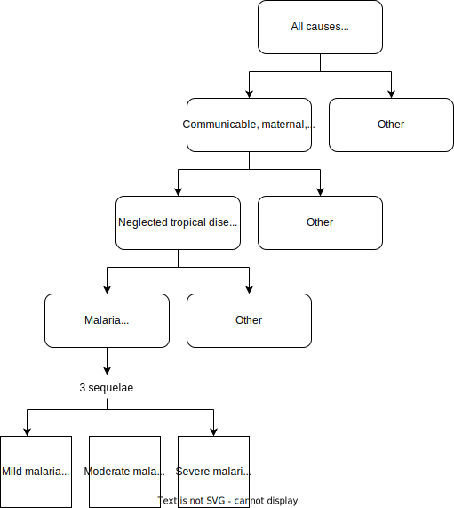

.. _2021_cause_malaria:

=================
Malaria: GBD 2021
=================

Disease Description
-------------------

Malaria is a life-threatening disease spread to humans by some types of 
mosquitoes. It is mostly found in tropical countries. There are medications 
for prevention and treatment, but these are not always accessible. 

An individual with uncomplicated malaria experiences one to two weeks of persistent fever, 
chills/shivering, sweating, joint pains, and headache. The individual will 
likely be lethargic and feverish, causing loss of daily function during the 
attack. Individuals with an untreated P. falciparum infection may develop 
severe malaria, which includes the symptoms of uncomplicated malaria but may 
also involve swelling, difficulty breathing, unconsciousness, and potentially 
death. Microscopy is considered the gold-standard diagnostic approach for the 
purposes of GBD. The relevant ICD-10 codes are B50-B54. [GBD-2019-Capstone-Appendix-Malaria-2021]_

According to the latest world malaria report, there were 247 million cases of 
malaria in 2021 compared to 245 million cases in 2020. The estimated number of 
malaria deaths stood at 619,000 in 2021 compared to 625,000 in 2020.

Four African countries accounted for just over half of all malaria deaths 
worldwide: Nigeria (31.3%), the Democratic Republic of the Congo (12.6%), 
United Republic of Tanzania (4.1%) and Niger (3.9%). [WHO-Malaria-2021]_

Modeling Malaria in GBD 2021
----------------------------

Malaria is modeled separately for inside versus outside sub-Saharan Africa in GBD 2021. 
However, Ethiopia is modeled as outside sub-Saharan Africa since it exhibits 
epidemiological trends and has data availability and quality more akin to non-African 
settings. 

For countries in sub-Saharan Africa (Nigeria in the nutrition optimization model) 
the PfPR surveys by the Malaria Atlas Project (MAP) were used to predict malaria 
rates for both the non-fatal and fatal models. 

For countries outside of sub-Saharan Africa (Ethiopia and Pakistan in this project) surveillance 
systems tend to be stronger and so national and subnational case reports are the 
primary data source for the nonfatal model. 

Nonfatal modeling in all countries combined data sources to generate rasterized predictions 
of clinical incidence rates  on a 5 km by 5 km grid. These predications were 
combined with high-resolution gridded population 
data to estimate total cases per pixel-year. These were then aggregated to GBD 
national/ subnational areas. 

For the fatal model, MAP data was used to estimate the cause specific mortality rate. 
This was then combined with the incidence rate from the nonfatal model in order to 
find estimates for case fatality rate. This in turn was used to find annual mortality 
rates for each location. [GBD-2019-Capstone-Appendix-Malaria-2021]_

.. todo::

   GBD 2021 includes COVID shocks. We need to decide if and how we want to include this information. 

A systematic review of malaria severity was conducted, from which simple 
severity splits were obtained and applied across all cases:

.. list-table:: Malaria severity splits
	:widths: 5 50 5
	:header-rows: 1
	
	* - Severity level
	  - Lay description
	  - Disability weight
	* - Mild
	  - Has a low fever and mild discomfort but no difficulty with daily activities.	
	  - 0.006 (0.002–0.012)
	* - Moderate
	  - Has a fever and aches and feels weak, which causes some difficulty with daily activities. 
	  - 0.051 (0.032–0.074)
	* - Severe
	  - Has a high fever and pain and feels very weak, which causes great difficulty with daily activities. 
	  - 0.133 (0.088–0.19)

GBD Hierarchy
-------------

Cause Model Diagram
-------------------

.. image:: malaria_cause_model.svg

S: **S**\ usceptible to malaria

I: **I**\ nfected and currently experiencing malaria

Model Assumptions and Limitations
---------------------------------

Malaria has been modeled extensively by other teams. For this model, 
we will not be including any information on vectors and so it is not 
appropriate for interventions targetting malaria prevention or treatment 
directly. 

There is evidence that people living in malaria endemic areas do gain immunity over 
their lifetimes. We assume this is represented in prevalence and incidence rates from 
GBD. We do not include in this model any gains in malaria resistance from prior exposure. 

For the nutrition optimization work, our model is focused on child growth failure 
and its effects. Therefore, malaria is included to capture CGF's effects on malaria, 
but does not include additional detail not relevant for this model. 

Our rate based recovery method will approximate the duration seen in GBD, but might 
have simulants with improbably high or low durations due to random chance. In the 
future, we might consider a time based duration that would more accurately replicate 
the 14-28 day duration from GBD. We do not expect this limitation to have a 
significant impact on our results. 

Because DisMod estimated an unrealistically high birth prevalence, the modelers 
set birth prevalence to zero. Consequently, the birth prevalence, incidence, 
and prevalence available from get_outputs are incongruous with one another.

.. todo::

   Continue to add to this section as needed 

Data Description
----------------

.. list-table:: State Definitions
	:widths: 5 10 10
	:header-rows: 1
	
	* - State
	  - State name
	  - Definition
	* - S
	  - **S**\ usceptible
	  - Simulant does not currently have malaria disease
	* - I
	  - **I**\ nfected
	  - Simulant currently has malaria

.. list-table:: State Data
	:widths: 5 10 10 20
	:header-rows: 1
	
	* - State
	  - Measure
	  - Value
	  - Notes
	* - S
	  - prevalence
	  - 1-prevalence_calculated
	  - 
	* - S
	  - birth prevalence
	  - 1 
	  - Not applicable, age start = 1 month
	* - S
	  - emr
	  - 0
	  -
	* - S
	  - disability weight
	  - 0
	  -
	* - I
	  - prevalence_calculated 
	  - incidence_rate_c345 * duration_c345 
	  - 
	* - I
	  - birth prevalence
	  - 0 
	  - Not applicable, age start = 1 month
	* - I
	  - excess mortality rate
	  - :math:`\frac{\text{deaths_c345}}{\text{population} \,\times\, \text{prevalence_calculated}}`
	  - 
	* - I
	  - disability weight
	  - :math:`\displaystyle{\sum_{s\in \text{sequelae_malaria}}} \scriptstyle{\text{disability_weight}_s \,\times\, \text{prevalence}_s}`
	  - Malaria sequelae are: 121, 122, 123
	* - All
	  - cause-specific mortality rate
	  - :math:`\frac{\text{deaths_c345}}{\text{population}}`
	  -

We calculate prevalence using the equation prevalence = incidence * duration. 
(See assumptions and limitations for the need to replace GBD's prevalence).
This is appropriate because malaria has a short and relatively uniform duration of 
14-28 days [GBD-2019-Capstone-Appendix-Malaria-2021]_. This assumption is valid under 
steady state conditions.

.. list-table:: Transition Data
	:widths: 10 10 10 10 10
	:header-rows: 1
	
	* - Transition
	  - Source State
	  - Sink State
	  - Value
	  - Notes
	* - i
	  - S
	  - I
	  - :math:`\frac{\text{incidence_rate_c345}}{1-\text{prevalence_calculated}}`
	  - Equivalent to "load standard data" Vivarium public health function for incidence rates ("susceptible-population" incidence rate). Incidence in GBD are estimated for the total population. Here we transform incidence to be a rate within the susceptible population.
	* - r
	  - I
	  - S
	  - :math:`\frac{1}{\text{duration_c345}}`
	  - 

.. list-table:: Data Sources and Definitions
	:widths: 1 3 10 10
	:header-rows: 1
	
	* - Value
	  - Source
	  - Description
	  - Notes
	* - prevalence_calculated
	  - Calculated from incidence (como) and duration (literature/gbd)
	  - Duration-based calculation of malaria prevalence
	  -
	* - deaths_c345
	  - codcorrect
	  - Deaths from malaria
	  -
	* - duration_c345
	  - Uniform distribution between 14 and 28 days
	  - Obtained from [GBD-2019-Capstone-Appendix-Malaria-2021]_
	  - This value should not vary by age group
	* - incidence_rate_c345
	  - como
	  - Incidence of malaria within the entire population
	  - 
	* - population
	  - demography
	  - Mid-year population for given age/sex/year/location
	  -
	* - prevalence_s{`sid`}
 	  - como
	  - Prevalence of sequela with id `sid`
	  - Sequela used here are 121, 122, and 123 
	* - disability_weight_s{`sid`}
	  - YLD appendix
	  - Disability weight of sequela with id `sid`
	  - Sequela used here are 121, 122, and 123 

.. list-table:: Restrictions
	:widths: 15 15 20
	:header-rows: 1

	* - Restriction type
	  - Value
	  - Notes
	* - Male only
	  - False
	  -
	* - Female only
	  - False
	  -
	* - YLL only
	  - False
	  -
	* - YLD only
	  - False
	  -
	* - YLL age group start
	  - 28 days (post neonatal/1-5 months)
	  - age_group_id = 4/388; [0-7 days)
	* - YLL age group end
	  - 95 plus
	  - age_group_id = 235; 95 years +
	* - YLD age group start
	  - Early neonatal
	  - age_group_id = 2; [0-7 days)
	* - YLD age group end
	  - 95 plus
	  - age_group_id = 235; 95 years +

.. note:: 

	**A note on the age start parameter:**

		This Vivarium modeling strategy sets the cause model age start to the 1 month of age (post neonatal age group for GBD 2019 and 1-5 month age group for GBD 2021) despite the GBD age start parameter being the early neonatal age group (0 to 6 days). We exclude the early and late neonatal age groups from the cause model as a strategy that allows us to increase the timestep of our cause models.

		The rationale behind this modeling decision is related to the *Relationship between timesteps and modeled rates in Vivarium* as described on the :ref:`Choosing an Appropriate Time Step page <vivarium_best_practices_time_steps>`. Essentially, high EMR in the neonatal age groups may require a smaller time step to meet validation criteria, which we did not meet for the neonatal age groups in initial versions of the model.

		Notably, there are no risk factors that affect malaria during the neonatal age groups in the nutrition optimization model, so not modeling malaria among these age groups will not affect our model. However, mortality due to malaria should be included in mortality due to other causes for the early and late neonatal age groups. 

Validation Criteria
-------------------

Simulation results should replicate the GBD 2021 cause-specific mortality rate, 
excess mortality rate, incidence rate, and prevalence for all age/sex/location 
groups. Notably, these measures should be tracked over time in the simulation 
to ensure that simulation rates do not deviate from GBD rates as the simulation 
progresses.

References
----------

.. [GBD-2019-Capstone-Appendix-Malaria-2021]
  Appendix to: `GBD 2019 Diseases and Injuries Collaborators. Global burden of
  369 diseases and injuries in 204 countries and territories, 1990–2019: a 
  systematic analysis for the Global Burden of Disease Study 2019. The Lancet. 
  17 Oct 2020;396:1204-1222` 

.. [WHO-Malaria-2021] Malaria Fact Sheet. World Health Organization.
   Retrieved 14 July 2023.
   https://www.who.int/news-room/fact-sheets/detail/malaria
