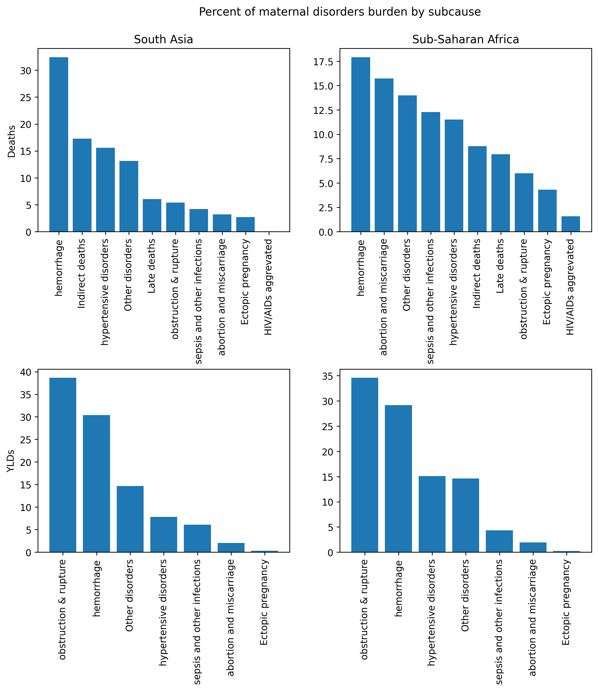

.. _2019_cause_maternal_disorders:

==============================
Maternal disorders: GBD 2019
==============================

.. contents::
   :local:
   :depth: 1

.. list-table:: Abbreviations
  :widths: 15 15 15
  :header-rows: 1

  * - Abbreviation
    - Definition
    - Note
  * - MMR 
    - Maternal mortality ratio
    - 
  * - WRA 
    - Women of reproductive age
    - 

Disease Overview
----------------

Maternal mortality related to obsetrics is a relatively rare but consequential outcome. Maternal morbidity related to obsetrics may be longlasting and significant. There are several factors that are associated with risk of obstetric mortality and morbidity, mainly related to access to health care. Proper antenatal care services and in-facility delivery are associated with lower maternal disorder burden. Additionally, factors such as maternal age and BMI are additional parameters that may be associated with maternal disorder burden.

GBD 2019 Modeling Strategy
--------------------------

In GBD, deaths due to maternal disorders (maternal deaths) comprise all deaths due to obstetric complications (direct maternal deaths) or concurrent disorders exacerbated by pregnancy (indirect maternal deaths) up to one year after the end of the pregnancy, irrespective of the method by which pregnancy ended and excluding accidental and incidental deaths. [GBD-2019-Capstone-Appendix-Maternal-Disorders]_, page 184.

Maternal disorders nonfatal estimation includes disability due to seven of ten maternal subcauses,
including 1) Abortion and miscarriage; 2) Ectopic pregnancy; 3) Obstructed labour and uterine rupture;
4) Maternal haemorrhage; 5) Maternal sepsis and other maternal infections; 6) Maternal hypertensive
disorders; and 7) Other [direct] maternal disorders. Indirect maternal disorders, late maternal deaths,
and maternal deaths aggravated by HIV/AIDS did not have any estimated disability based on the premise
that it is captured in the respective underlying causes. [GBD-2019-Capstone-Appendix-Maternal-Disorders]_ page 744.

YLDs were estimated for other [direct] maternal disorders YLD-to-YLL ratio approach where the ratio of
YLD:YLL were pooled for all the causes in the list above and multiplied by the YLL for other [direct]
maternal disorders. For other subcauses of maternal disorders, including late maternal death, indirect
maternal disorders, and maternal death complicated by HIV/AIDS, we did not estimate any nonfatal
burden based on the premise that the associated disability is captured in the respective causes. [GBD-2019-Capstone-Appendix-Maternal-Disorders]_ page 745.

Cause Hierarchy
+++++++++++++++

- All causes (c_294)

  - Communicable, maternal, neonatal, and nutritional diseases (c_295)

    - Maternal disorders and neonatal disorders (c_962)

      - **Maternal disorders (c_366)**

        - Maternal hemorrhage (c_367)

          - Mild anemia due to maternal hemorrhage (s_182)

          - Moderate anemia due to maternal hemorrhage (s_183)

          - Severe anemia due to maternal hemorrhage (s_184)

          - Maternal hemorrhage with less than 1 liter blood loss (s_180)

          - Maternal hemorrhage with greater than 1 liter blood loss (s_181)

        - Maternal sepsis and other maternal infections (c_368)

          - Infertility due to puerperal sepsis (s_675)

          - Other maternal infections (s_938)

          - Puerperal sepsis (s_937)

        - Maternal hypertensive disorders (c_369)

          - Long term sequelae of severe pre-eclampsia (s_677)

          - Long term sequelae of eclampsia (s_677)

          - Other hypertensive disorders of pregnancy (s_676)

          - Severe pre-eclampsia (s_185)

          - Eclampsia (s_186)

        - Maternal obstructed labor and uterine rupture (c_370)

          - Obstructed labor, acute event (s_188)

          - Rectovaginal fistula (s_189)

          - Vesicovaginal fistula (s_190)

        - Abortion and miscarriage (c_995)

          - Maternal abortive outcome (s_191)

        - Ectopic pregnancy (c_374)

          - Ectopic pregnancy (s_5165)

        - Indirect maternal deaths (c_375)

        - Late maternal deaths (c_376)

        - Maternal deaths aggrevated by HIV/AIDs (c_741)

        - Other maternal disorders (c_379)

          - Other maternal disorders (s_192)

Subcause definitions
""""""""""""""""""""""""""""

- **Abortion** is defined as elective or medically-indicated termination of pregnancy at any gestational age and **miscarriage** is defined as spontaneous loss of pregnancy before 24 weeks of gestation with complications requiring medical care.
- **Ectopic pregnancy** is defined as any pregnancy occurring outside of the uterus.
- **Obstructed labour and uterine rupture**

  - Acute event includes failure to progress (no advance of the presenting part of the fetus despite strong uterine contractions), cephalopelvic disproportion (foetal size that is too large for maternal pelvic dimensions), non-vertex foetal positioning during labour (any foetal position besides head down during labour; excludes non-vertex positioning during antepartum period), and uterine rupture during labour (non-surgical breakdown of uterine wall during labour and delivery). Perineal lacerations without any of the above conditions are excluded from the case definition.

  - Fistula is defined as an abnormal connection between either vagina and large intestine (rectovaginal fistula) or between vagina bladder (vesicovaginal fistula). Fistula YLDs are included in YLDs for obstructed labour; estimation is described in a separate appendix section on “Fistula – impairment.”

- **Maternal haemorrhage** (including placental disorders) – includes both postpartum (>500 ml for vaginal delivery and >1,000 ml for cesarean delivery) and antepartum haemorrhage vaginal bleeding from any cause at or beyond 20 weeks of gestation and prior to onset of labour). This also includes placental disorders with haemorrhage regardless of blood volume lost or timing of bleeding event. Placental disorders without haemorrhage are included with other [direct] maternal disorders.

- **Maternal sepsis** and other maternal infections:

    - Maternal sepsis is defined as a temperature <36°C or >38°C and clinical signs of shock including systolic blood pressure <90 mmHg and tachycardia >120 bpm 

    - Other maternal infections are defined as any maternal infections excluding HIV, sexually transmitted infections, or are not believed to have epidemiologic relationship with pregnancy. Examples include urinary tract infections, mastitis, candidiasis, and bacterial vaginosis during pregnancy.

- **Hypertensive disorders** of pregnancy – overall category defined as having blood pressure (BP) >140/90 based on multiple measurements in persons who were not hypertensive prior to pregnancy.

- **Other [direct] maternal disorders** include a variety of different obstetric complications. The most common of these in ICD-10 coded vital registration sources in terms of number of deaths include O88 (obstetric embolism), O26 (Maternal care for other conditions predominantly related to pregnancy), O90 (Complications of the puerperium, not elsewhere classified), O75 (Other complications of labor and delivery, not elsewhere classified), C58 (Malignant neoplasm of placenta), and O36 (Maternal care for other fetal problems).

Subcause burden
""""""""""""""""""""""

Restrictions
++++++++++++

The following table describes any restrictions in GBD 2019 on the effects of
this cause (such as being only fatal or only nonfatal), as well as restrictions
on the ages and sexes to which the cause applies.

.. list-table:: GBD 2019 Cause Restrictions
   :widths: 15 15 20
   :header-rows: 1

   * - Restriction Type
     - Value
     - Notes
   * - Male only
     - False
     -
   * - Female only
     - True
     -
   * - YLL only
     - False
     - False for maternal disorders (c_366), True for subcauses including indirect maternal deaths (c_375), late maternal deaths (c_376), and maternal deaths aggravated by HIV/AIDs (c_741)
   * - YLD only
     - False
     -
   * - YLL age group start
     - 10 to 14 (ID=7)
     -
   * - YLL age group end
     - 50 to 54 (ID=15)
     - (See the AgeGroupNote_ for how to handle births that occur in the 55-59 age group)
   * - YLD age group start
     - 10 to 14 (ID=7)
     -
   * - YLD age group end
     - 50 to 54 (ID=15)
     - (See the AgeGroupNote_ for how to handle births that occur in the 55-59 age group)

.. note::

  GBD defines both the fertile age range and the age range of maternal disorders as 10 to 54 years. This implicitly assumes that there are no cases of someone becoming pregnant at age 54 and experiencing a maternal disorder death or disability at the age of 55 years or older.

Vivarium Modeling Strategy
--------------------------

We will convert the maternal disorders deaths and disability as estimated by GBD in terms of an annual rate among women of reproductive age to events *per birth* (including stillbirths) for use in our :ref:`simulation of IV iron <2019_concept_model_vivarium_iv_iron>`. Births among women of reproductive age in our simulation will be informed by the :ref:`pregnancy model document <other_models_pregnancy>`.

Scope
+++++

We will model maternal disorders a single cause related to birth as informed through the :ref:`pregnancy model document <other_models_pregnancy>`. This model will not distinguish between morbidity and mortality related to specific subcauses or sequelae of maternal disorders. This cause model will be affected by the :ref:`iron deficiency risk factor <2019_risk_effect_iron_deficiency>`, which is assumed to affect maternal disorders mortality and morbidity equally.

We will not model maternal disorders as a dynamic transition model, but rather as discrete events that occur at birth. The probability of maternal disorder deaths will be informed by a maternal mortality ratio derived from GBD data; YLLs will be measured based on the mother's age at birth. The rate of YLDs due to maternal disorders will be based on a ratio of incident maternal disorders per birth and assigned the annual value of YLDs per incidence maternal disorder case.

Assumptions and Limitations
+++++++++++++++++++++++++++

- We assume that all maternal disorders deaths occur at birth. For deaths due to late maternal disorders, this will result in earlier maternal deaths in our model than in reality, which may overestimate the impact of maternal mortality on infant outcomes such as breastfeeding behaviors/orphanhood when we model maternal-child dyads. We may overestimate YLLs due to late maternal deaths and underestimate YLLs due to abortions, miscarriages, and ectopic pregnancies.

- We assume that all maternal disorders morbidity *begins* at birth and persists for one year after birth (but is accrued during a single week). Morbidity due to hypertensive disorders and maternal sepsis may occur prior to when we model it. For sequelae that persist for longer than one year (ex: long term sequelae of eclampsia, infertility, fistula), we will underestimate YLDs.

- We will assume that mothers experience mortality due to maternal disorders also experience associated morbidity. This may not be a logical assumption for subcauses with long term sequelae, including maternal hemorrhage, maternal hypertensive disorders, and obstructed labor and uterine rupture; however, it is likely a logical assumption for other maternal disorders subcauses including maternal sepsis, abortion and miscarriage, and acute sequelae of the other maternal disorder subcauses.

- Our strategy of subtracting anemia sequelae YLDs from maternal disorders YLDs assumes no comorbidity status between anemia due to maternal hemorrhage and other sequelae of maternal disorders. This assumption will result in an underestimation of maternal disorder YLDs other than anemia due to maternal hemorrhage.

- See the note in the `Data Tables`_ section below for two additional important limitations.

Cause Model Diagram
+++++++++++++++++++

Not applicable.

Data Tables
++++++++++++++++++++++++++++++++

Ratios of maternal disorder mortality and incidence are defined in the table below. These values should represent the probability that a simulant experiences a death or incident case of maternal disorders at birth in our simulation. This cause model should be implemented such that each simulant who experiences deaths due to maternal disorders also experiences an incident case of maternal disorders.

.. list-table:: Ratios per birth
   :widths: 5 5 20
   :header-rows: 1

   * - Event
     - Value
     - Note
   * - Maternal disorder deaths
     - csmr_c366 / (incidence_p * prevalence_np)
     - 
   * - Incident maternal disorders
     - incidence_rate_c366 / (incidence_p * prevalence_np)
     - **Post-maternal disorder state persists for one timestep** (one week, as implemented).

.. note::

  GBD incident cases of the maternal disorders parent cause is equal to the *sum* of the incident cases of each maternal disorders sub-causes rather than a count of individuals who experience at least one maternal disorder cause during gestation/birth/postpartum. Therefore, for some demographic groups with high maternal disorders burdens (particularly older age groups), it is possible that the above ratio is greater than one.

  As currently implemented, the incident maternal disorders ratio per birth was not clipped at 1 in the input data and was used as-is in the simulation as it did not violate Vivarium processes to have values above one for this parameter.

  Notably, this strategy has important implications:

    - If there are particular demographic groups that have incident maternal disorders ratios per birth greater than one, then we will underestimate total incident maternal disorder cases (and associated YLDs) for that group in our simulation. For the IV iron simulation, while we underestimated incident maternal disorders cases for high risk groups (older ages), this did not have a large impact on the popuation-level incident maternal disorder cases because fertility rates were low in these groups.

    - Our modeling strategy assumes that maternal disorders cases and YLDs are spread widely across the population of PLW rather than being more concentrated among a subset of individuals with other individuals experiencing little to no YLDs. Because of GBD COMO processes, our simulation should accurately estimate maternal disorder YLDs at the population level in the baseline scenario (in the absence of the above limitation) despite this limitation. Additionally, for not targeted interventions, this limitation should not substantially impact our estimation of intervention impact on maternal disorders cases and YLDs. However, for interventions that are targeted to high-risk groups, we will likely *underestimate* intervention impact as a result.

.. note::

  The duration of the post-maternal disorder state in which maternal disorder YLDs are accrued was set to one week for the IV iron simulation. This parameter is currently a barrier to increasing the timestep of the maternal IV iron simulation from one week to two weeks.

The following table defines the parameters used in the calculation of maternal disorder ratios per birth.

.. list-table:: Data values
   :header-rows: 1

   * - Parameter
     - Definition
     - Value or source
     - Note
   * - csmr_c366
     - Maternal disorder cause-specific mortality rate
     - deaths_c366 / population
     - 
   * - deaths_c366
     - count of deaths due to maternal disorders
     - codcorrect, decomp_step='step5'
     - 
   * - population
     - population count
     - get_population, decomp_step='step5'
     - Specific to a/s/l/y demographic group
   * - incidence_rate_c366
     - incidence rate of maternal disorders
     - como, decomp_step='step5'
     - 
   * - ylds_non_fatal_maternal_disorder_case
     - Number of YLDs attributable to a single non-fatal maternal disorder case
     - See `Years lived with disability`_ section
     - 
   * - ylds_c366
     - Annual rate of maternal disorder YLDs among WRA
     - como, decomp_step='step5'
     - 
   * - ylds_{s182,s183,s184}
     - Annual rate of YLDs attributable to anemia due to maternal hemorrhage among WRA
     - como, decomp_step='step5'
     - 
   * - incidence_p
     - Pregnancy incidence rate
     - Defined on the :ref:`pregnancy model document <other_models_pregnancy>`
     - 
   * - prevalence_np
     - Prevalence of the non-pregnant state
     - Defined on the :ref:`pregnancy model document <other_models_pregnancy>`
     - 
     
.. _AgeGroupNote:

.. note::

  In our simulation, a simulant may become pregnant at the age of 54 and give birth at the age of 55. However, there are not GBD data for the 55-59 age group for maternal disorders. Therefore, for simulants who become pregnant in the 50-54 year age group and give birth in the 55-59 age group, the maternal disorder rates specific to the 50-54 year age group should be used.

Years of life lost
"""""""""""""""""""

Years of life lost (YLLs) should be assigned to simulants who experience a death due to maternal disorders based on their age and theoretical minimum risk life expectancy at the time of death.

Years lived with disability
""""""""""""""""""""""""""""

Simulants who experience an incident case of maternal disorders and occupy the post-maternal disorders state following the incident case and will remain there for a single timestep. The disability weight for the post-maternal disorders time-step long state will then be the number of YLDs per case (defined below) divided by :math:`\text{time step duration in days} / 365`, such that the disability weight multiplied by the duration spent accruing disability is equal to the total YLDs per case (defined below). Notably, for simulations that evaluate disability due to anemia through the :ref:`hemoglobin/anemia model <2019_hemoglobin_anemia_and_iron_deficiency>` such as the :ref:`IV iron simulation <2019_concept_model_vivarium_iv_iron>`, the disability due to anemia sequelae should not be counted as part of YLDs due to maternal disorders as they will be tracked separately as YLDs due to anemia (this is reflected in the equation below).

.. note::

  The equation shown below is inconsistent with the approach we implemented of accumulating all maternal disorders YLDs in a single timestep rather than over the course of 1 year. With maternal disorders YLDs accumulated in a single timestep, the equation should be: 

  .. math::

    \text{YLDs per non-fatal maternal disorders case} = 
    

    \frac{\text{ylds}_{c366} - \text{ylds}_\text{s182,s183,s184}}{\text{incidence_rate}_{c366} - \text{csmr}_\text{c366}}

  This equation has been updated for the :ref:`2021 maternal disorders cause model document <2021_cause_maternal_disorders>` and will be implemented in the nutrition optimization simulation. The erroneous equation implemented in IV iron is kept below for reference. Note that the impact of this discepency will be quite small given the small magnitude of the ACMR parameter.

.. math::

  \text{YLDs per non-fatal maternal disorders case} = 
  

  \frac{\text{ylds}_{c366} - \text{ylds}_\text{s182,s183,s184}}{\text{incidence_rate}_{c366} - (ACMR - csmr_\text{c366}) * \text{incidence_rate}_\text{c366} - csmr_\text{c366}}

.. warning::

  A previous version of the above equation yielded a negative value in initial attempts. We've implementated the following placeholder (which may result in an underestimation of maternal disorder YLDs):

  .. math::

    \text{YLDs per non-fatal maternal disorders case} = \frac{\text{ylds}_{c366} - \text{ylds}_\text{s182,s183,s184}}{\text{incidence_rate}_{c366}}

  The equation may eventually be updated to the resolved version in the main section above, although it is approximately 98-99% of the temporary fix, so it is a low priority for implementation.

  For reference, the previous version of the equation that yielded a negative rate was as follows:

  .. math::

    \frac{\text{ylds}_{c366} - \text{ylds}_\text{s182,s183,s184}}{\text{incidence_rate}_{c366} - (ACMR - csmr_\text{c366} + csmr_\text{c366} / \text{incidence_rate}_\text{c366})}

.. todo::

  Because these YLDs are assigned in a unique manner, special consideration should be paid to the estimation of YLDs due to multiple causes (ex: YLDs due to maternal disorders and anemia concurrently). 

    Reminder: :math:`DW_\text{overall} = 1 - \prod_{n=1}^{n} 1 - DW_n`

  Since we are attributing all maternal disorder YLDs to a single timestep rather than over an annual period, we will need to quantify and document the bias introduced in the overestimation of total YLDs among the population with concurrent maternal disorders and anemia for the :ref:`IV iron maternal simulation <2019_concept_model_vivarium_iv_iron_maternal_sim>` (todo item for Ali).

Validation Criteria
+++++++++++++++++++

- The maternal disorders incidence, mortality, YLL, and YLD rate per person-year among women of reproductive age in the simulation should validate to estimates from GBD (the simulation may slightly underestimate YLDs due to the removal of anemia sequlae from maternal disorder YLDs as they are counted separately).
- Maternal disorders deaths and incidence should occur among pregnant women only

References
----------

.. [GBD-2019-Capstone-Appendix-Maternal-Disorders]
  Appendix to: `GBD 2019 Diseases and Injuries Collaborators. Global burden of
  369 diseases and injuries in 204 countries and territories, 1990–2019: a 
  systematic analysis for the Global Burden of Disease Study 2019. The Lancet. 
  17 Oct 2020;396:1204-1222` 
