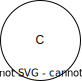

.. _other_causes:

======================================================================
Background morbidity for the nutrition optimization pregnancy model
======================================================================

This cause model document is meant to represent residual morbidity and mortality for all causes other than specific modeled causes of interest. 

.. contents::
   :local:
   :depth: 2

Disease Overview
----------------

For a discussion of the importance of modeling background morbidity, see the :ref:`background morbidity page <other_causes_ylds>`. 

Vivarium Modeling Strategy
--------------------------

Scope
+++++

This cause model document serves as an interim solution to these issues specific discussed in the :ref:`background morbidity page <other_causes_ylds>`, specifically designed for the :ref:`nutrition optimization pregnancy model <2021_concept_model_vivarium_nutrition_optimization_pregnancies>`.

Cause Model Diagram
+++++++++++++++++++

There is only a single state in this cause model diagram that contains all simulants. Therefore there are no transitions in this cause model diagram.

State and Transition Data Tables
++++++++++++++++++++++++++++++++

Definitions
"""""""""""

**With-Condition and Free of Condition Model**

.. list-table:: State Definitions
   :widths: 1, 5, 10
   :header-rows: 1

   * - State
     - State Name
     - Definition
   * - C
     - With **C**\ ondition
     - Born with "other causes"

States Data
"""""""""""

.. list-table:: States Data
   :widths: 20 25 30 30
   :header-rows: 1
   
   * - State
     - Measure
     - Value
     - Notes
   * - C
     - prevalence
     - 1
     - 
   * - C
     - birth prevalence
     - 1
     - 
   * - C
     - excess mortality rate
     - 0
     - 
   * - C
     - disabilty weight
     - all_cause_yld_rate - anemia_yld_rate - population_maternal_disorders_yld_rate 
     - See extended note below

.. note::

  Note that we are assuming the YLD rate due to all causes other than maternal disorders (including YLDs due to anemia) do not significantly vary between the pregnant/postpartum not pregnant/postpartum populations. We do rescale the rate of maternal disorders from the general population of women of reproductive age to the rate among the pregnant/postpartum population in this equation. 

  Note that we are excluding YLDs due to maternal disorders in YLDs due to background morbidity, despite that YLDs due to maternal disorders in the nutrition optimization model are modeled separately and are never comorbid with other conditions. This limits us in that we therefore do not capture:

    1. any increase in maternal disorders YLDs due to reductions in anemia YLDs through the COMO adjustment,
    2. any increase in anemia YLDs due to reductions in maternal disorders YLDs through the COMO adjustment, 
    3. any increase in background morbidity YLDs due to reductions in maternal disorders, nor
    4. COMO adjustments in YLDs due to anemia and other causes from comorbidity with maternal disorders. 

  All of these limitations are expected to cause us to overestimate the magnitude of YLDs averted in our simulation. However, this overestimate will be lower in magnitude than failing to include background morbidity in any capacity. Additionally, the alternative strategy of including YLDs due to maternal disorders in background morbidity would resolve limitations #4, partially address limitation #1 (although it would then be slightly biased in the opposite direction), limitations #2 and #3 would remain, and it would introduce the additional limitation of double-counting YLDs due to maternal disorders among averted deaths in our simulation, which would result in an underestimate of DALYs averted.

  For more information on how we are modeling YLDs due to maternal disorders, see the :ref:`maternal disorders cause model document <2021_cause_maternal_disorders>` and for more information regarding the rationale behind these strategies, see the :ref:`discussion on the nutrition optimization pregnancy concept model document <MDYLDNote>`

Data Sources
""""""""""""

This table contains the data sources for all the measures. 

.. list-table:: Data Sources
   :widths: 20 25 25 25
   :header-rows: 1
   
   * - Measure
     - Sources
     - Description
     - Notes
   * - all_cause_yld_rate
     - cause_id=294, source=como, decomp_step='step5', metric_id=3
     - Rate of YLDs due to all causes
     - 
   * - anemia_yld_rate
     - rei_id=192, source='como', decomp_step='step5', metric_id=3
     - Rate of YLDs due to anemia
     - Note, must select value for cause_id==294 (all causes)
   * - population_maternal_disorders_yld_rate
     - ylds_c366 - ylds_s182 - ylds_s183 - ylds_s184
     - Rate of YLDs due to maternal disorders (excluding disability due to anemia caused by maternal hemorrhage) among the general population
     - Anemia sequelae are excluded from this parameter because they are included in the YLDs due to the anemia impairment

Validation Criteria
+++++++++++++++++++

Our simulation should replicate GBD estimates of all-cause mortality, YLL, and YLD rates in the baseline scenario. Additionally, we should continue to meet all modeled cause-specific verification and validation criteria.

Assumptions and Limitations
+++++++++++++++++++++++++++

1. Our estimation of the disability weight of background morbidity (which should be equal to the YLD rate for all causes other than modeled causes, COMO adjusted for all causes other than modeled causes) is an approximation of the true value that slightly underestimates the true value. Therefore, we will slightly overestimate COMO-adjusted YLDs due to modeled causes and therefore slightly overestimate YLDs averted. However, this underestimation should be very slight given that YLDs_modeled << YLDs_background. Additionally, this resulting overestimation is much smaller in magnitude that the overestimation of YLDs averted due to not considering background mortality in our model.

2. We assume that all simulants have the same morbidity and mortality rates due to other causes with no individual-level heterogeneity. When modeled interventions avert deaths in the alternative scenario relative to the baseline scenario, it is possible that these simulants experience *greater* than average background morbidity and mortality rates due to their vulnerable status in the baseline scenario, which could cause us to slightly overestimate the impact of our interventions on DALYs by underestimating the magnitude of DALYs experienced in the alternative scenario following the averted deaths.