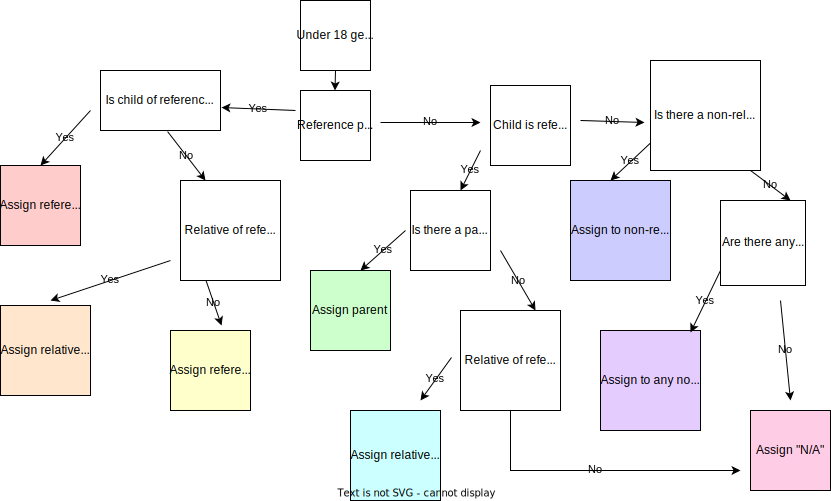
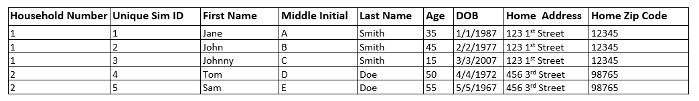
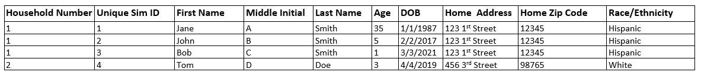
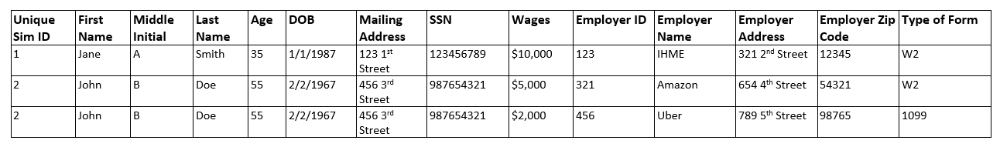
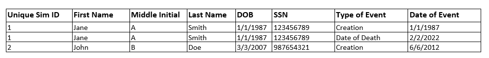

.. role:: underline
    :class: underline

..
  RST needs unique labels for its reference targets (the things you make with
  ".. my_link_name:").  This document has several pre-defined reference target
  templates you should do a find and replace on when you copy this document.
  They are {YOUR_MODEL_TITLE} which you should replace with a title-case version
  of your model name, {YOUR_MODEL_UNDERSCORE} which you should replace with an
  underscore-separated all lowercase version of your model name, and
  {YOUR_MODEL_SHORT_NAME} which you should replace with an abbreviation of your
  model title.  For instance, if you were doing a model of severe acute malnutrition
  for the Children's Investment Fund Foundation based on GBD 2019, we might have

    YOUR_MODEL_TITLE = Vivarium CIFF Severe Acute Malnutrition
    YOUR_MODEL_UNDERSCORE = 2019_concept_model_vivarium_ciff_sam
    YOUR_MODEL_SHORT_NAME = ciff_sam

..
  Section title decorators for this document:

  ==============
  Document Title
  ==============

  Section Level 1 (#.0)
  +++++++++++++++++++++

  Section Level 2 (#.#)
  ---------------------

  Section Level 3 (#.#.#)
  ~~~~~~~~~~~~~~~~~~~~~~~

  Section Level 4
  ^^^^^^^^^^^^^^^

  Section Level 5
  '''''''''''''''

  Section Level 6
  """""""""""""""

  The depth of each section level is determined by the order in which each
  decorator is encountered below. If you need an even deeper section level, just
  choose a new decorator symbol from the list here:
  https://docutils.sourceforge.io/docs/ref/rst/restructuredtext.html#sections
  And then add it to the list of decorators above.

.. _{vivarium_census_prl_synth_data}:

==================================
Vivarium Census PRL Simulated Data
==================================

.. contents::
  :local:

+----------------------------------------------------+
| List of abbreviations                              |
+=======+============================================+
| ACS   | American Communities Survey                |
+-------+--------------------------------------------+
| AIAN  | American Indian and Alaskan Native         |
+-------+--------------------------------------------+
| NHOPI | Native Hawaiian and Other Pacific Islander |
+-------+--------------------------------------------+
| PRL   | Probabilistic Record Linkage               |
+-------+--------------------------------------------+
| USCB  | United States Census Bureau                |
+-------+--------------------------------------------+

.. _{census_prl}1.0:

1.0 Background
++++++++++++++

Probabilistic Record Linkage (PRL) typically uses sensitive data
containing information such as name, address, date of birth, and
sometimes even Social Security Number, and the restrictions on access
to such data has been a barrier to developing and testing new methods
and software for PRL.  By creating realistic, but simulated, data
which includes these attributes, we can make PRL research and
development easier for ourselves and others.

We are certainly not the first to attempt such a data synthesis
project.  Prior approaches include FEBRL, GeCO from UQ, and UALR's
`synthetic occupancy generator (SOG) approach
<https://www.researchgate.net/profile/John-Talburt/publication/215991472_SOG_A_Synthetic_Occupancy_Generator_to_Support_Entity_Resolution_Instruction_and_Research/links/5546986d0cf23ff71686d81f/SOG-A-Synthetic-Occupancy-Generator-to-Support-Entity-Resolution-Instruction-and-Research.pdf?origin=publication_detail>`_.
There is also relevant work from Chris Dibben, who developed `an R
package for producing synthetic data
<https://www.synthpop.org.uk/index.html>`_, and from Robin Linacre,
who developed `synthetic data for testing splink
<http://github.com/moj-analytical-services/splink_synthetic_data>`_.

The unique elements of our work will rely on Vivarium: our simulated
data will be informed by the United States Census Bureau (USCB) needs
and publicly released USCB data (such as the American Community
Survey [ACS]).  By using Vivarium, we will represent some realistic
dynamics of household and family structure at large scale and with
relevant geographies.  In the longer term, I hope that this work will
also be easily extendable because of our modular framework, for
example, I hope it will be somewhat straightforward to have a mash-up
of the PRL sim with the cancer detection models we completed a
year ago, to help PRL researchers in the cancer surveillance space.

.. _{census_prl}1.1:

1.1 Project overview
--------------------

All simulants have :ref:`demographic characteristics informed by ACS data <census_prl_age_sex_etc>`.
They also have :ref:`names <census_prl_names>` and
:ref:`identification numbers <census_prl_ssn_itin>`
(Social Security Number/Individual Taxpayer Identification Number).
Simulants have :ref:`employers <census_prl_employment>` and :ref:`income <census_prl_income>`.

Simulants live in either residential households or group quarters (GQ),
with residential household structure informed by ACS data.
Residential households and GQs have geographic locations as well as :ref:`physical <census_prl_physical_address>`
and :ref:`mailing <census_prl_mailing_address>` street addresses,
which may be different: some residential households will receive mail at a PO box.

During the simulation, there is both :ref:`fertility <census_prl_fertility>`
and :ref:`mortality <census_prl_mortality>`.
There is also migration: :ref:`within the US <census_prl_domestic_migration>`,
:ref:`into the US <census_prl_international_immigration>`,
and :ref:`out of the US <census_prl_international_emigration>`.

Our simulated data are the results of :ref:`periodic simulated censuses,
surveys, and administrative data collections <census_prl_observers>`.
These observations build on the modeled population dynamics (for example, using
income to determine tax filing).
Simulated data collection is subject to :ref:`various kinds of omission, duplication,
and data noise <census_prl_noise>`, which help create realistic PRL challenges.

Among other simplifications,
our simulation does not currently include gender (only biological sex),
and does not model people having ties to multiple households (e.g. moving back and forth),
except in the case of some young simulants who are assigned :ref:`guardians <census_prl_guardians_init>`.

.. _census_prl_components:

2.0 Vivarium modelling components
+++++++++++++++++++++++++++++++++

.. _census_prl_concept_model:

2.1 Vivarium concept model
--------------------------

.. note:: vivarium concept model diagram to come (TK)

.. _census_prl_age-sex-etc:

2.2 Demographics and Simulation Parameters
------------------------------------------

.. _census_prl_pop_descr:

2.2.1 Population description
~~~~~~~~~~~~~~~~~~~~~~~~~~~~

Unlike most of our health-related simulations, this simulation does not use a population structure derived from the
Global Burden of Disease (GBD) study.
The construction of a custom population is described in the "Components" section of this document, primarily in the
:ref:`section on the initialization of demographic factors <census_prl_age_sex_etc>`.

.. _census_prl_location:

2.2.2 Location description
~~~~~~~~~~~~~~~~~~~~~~~~~~

Our model is primarily intended to simulate the entire United States.
However, each component also describes how to run for subsets of the United States, e.g.
a single state, if any change needs to be made at all in this case.
The changes are mostly using a subset of the relevant US-level input data,
though the few inputs from GBD may also change by location.
Some inputs which have been custom-calculated for use in the simulation,
such as domestic migration rates, have only been provided here at the United States level
and are used unchanged if running in a subset of the United States.

We have used single-state runs so far as a form of small-scale testing.
We may want to generate final simulation outputs at the state level, or other smaller
geographic areas, in the future; the specifics are to be determined.

.. _census_prl_population_size:

2.2.3 Population size
~~~~~~~~~~~~~~~~~~~~~

Our final data outputs will be at the scale of the real United States population.
In order to make this computationally feasible, we will split this population into some number of independent
"shards," such that simulants can only interact with other simulants within their shard.
This independence allows these shards to be run in parallel.
The size of each shard is to be determined based on computational constraints.

.. todo::
  Define exactly the full population size at which we will run the simulation.

.. _census_prl_models:

2.3 Components
--------------

.. _census_prl_age_sex_etc:

2.3.1 Age, date of birth, sex, race/ethnicity, nativity, US state, PUMA, household ID, and relationship
~~~~~~~~~~~~~~~~~~~~~~~~~~~~~~~~~~~~~~~~~~~~~~~~~~~~~~~~~~~~~~~~~~~~~~~~~~~~~~~~~~~~~~~~~~~~~~~~~~~~~~~

These attributes are initialized by sampling from
the 2016-2020 American Communities Survey (ACS) Public Use Microdata Sample (PUMS) [PUMS]_
and creating simulants based on the rows sampled.

The PUMS provides a households file as well as a persons file.
The meanings for numeric codes in the PUMS files can be found in the PUMS' data dictionary. [PUMS_Data_Dictionary]_

As described in the next section, some sampling is done at the household level and some at the person
level, but the result of sampling is a set of PUMS person rows that we map one-to-one to
simulants in our initial population.
Each PUMS-informed attribute of a new simulant is set based on the corresponding person row.
How these attributes are generated from PUMS columns is described below.

Sampling from the PUMS allows us to replicate not only the univariate distribution of each attribute
but also joint distributions of arbitrary complexity between the attributes,
while also preserving structure within sampled household units.
However, by creating multiple simulants who are based on the same PUMS person row,
we risk making them more similar to one another than would be expected
in the real population.
We address this issue through the use of :ref:`perturbation <census_prl_perturbation>`
of age, as well as state and PUMA.

Sampling approach
^^^^^^^^^^^^^^^^^

ACS PUMS data used for sampling should be subset to the simulated area.
For example, if running the simulation in Florida only, the PUMS should be filtered to
only those rows where the :code:`ST` column is 12 (the code for Florida).

We use a two-step process to sample ACS PUMS:

#. First, we sample, with replacement, entire non-GQ ("residential") households using the ACS household weights.
   Each sampled household creates a simulant for each person contained within it in the PUMS person file.
#. Then, we sample, with replacement, GQ individuals from the persons file using the ACS person weights for those individuals.

Our target is that 3% of the population should be living in GQ.
We do not exactly hit this target, because when sampling household units we cannot guarantee
an exact number of people sampled.
Instead, we sample as many non-GQ households as we can without *exceeding* 97% of the simulated population size,
then fill in the rest of the population size with GQ individuals.
The largest household size in the PUMS data is 17, so the number
of simulants initialized in households may be less than the target by 1-16.

.. todo::
  We should use a data source, e.g. the person weights in ACS PUMS, to refine this 3% value.

Age and date of birth
^^^^^^^^^^^^^^^^^^^^^

Age is reported in the PUMS (:code:`AGEP` column) in floored integer years, but our simulation uses precise ages,
including fractional years.
Simulants are assigned a uniform-randomly
chosen precise age consistent with the age in PUMS.
Their date of birth is defined to be consistent with that precise age.

.. note::
  Date of birth, in reality, is not evenly spread throughout the year.
  We do not model this.

We perturb the age attribute as described in the
:ref:`perturbation section <census_prl_perturbation>`.

Sex
^^^

Sex in PUMS (:code:`SEX` column) is binary (male/female) and initialized as-is for the simulant.

Race/ethnicity
^^^^^^^^^^^^^^

We map separate PUMS indicators of race and ethnicity to a single composite "race/ethnicity"
indicator, with the following exhaustive and mutually exclusive categories:

* White
* Black
* Latino
* American Indian and Alaskan Native (AIAN)
* Asian
* Native Hawaiian and Other Pacific Islander (NHOPI)
* Multiracial or Some Other Race

This combination of race and ethnicity into a single indicator is similar to what the US Counties BoD team
within IHME does.
However, because we use ACS data and aren't limited by the categories present on death certificates,
we separate NHOPI from Asian and include a Multiracial or Some Other Race category, unlike in their
life expectancy work. [Life_Expectancy_Race_Ethnicity]_

To assign the race/ethnicity indicator, the steps are, in order:

* If the PUMS person has a value in the :code:`HISP` column indicating that they are "Spanish/Hispanic/Latino",
  they are assigned to our "Latino" category, regardless of the values in other race-related columns.
* If the PUMS person has a value of "Two or More Races" or "Some Other Race alone" in the :code:`RAC1P` column,
  they are assigned to our "Multiracial or Some Other Race" category.
* If the PUMS person has any of the three values of :code:`RAC1P` indicating American Indian and Alaskan Native
  race, they are assigned to our AIAN category.
* Otherwise, they are assigned to a category matching their :code:`RAC1P` value; a value of "White alone"
  indicates the "White" category, and so on.

Nativity
^^^^^^^^

"Nativity" means whether or not someone was born in the United States.
The PUMS has more information on the specific country of birth, but we do not use this level of granularity.
The :code:`NATIVITY` column in PUMS provides the binary categorization.

US state and PUMA
^^^^^^^^^^^^^^^^^

We perturb the state and PUMA attributes from PUMS (:code:`ST` and :code:`PUMA` columns),
as described in the :ref:`perturbation section <census_prl_perturbation>`, before assigning them.

Household ID
^^^^^^^^^^^^

Non-GQ households
'''''''''''''''''

Each non-GQ PUMS household sampled is given a unique household ID,
which is shared between the simulants generated from the persons in that household.
Note that because households are sampled with replacement, there may be multiple unique
household IDs in the simulation that were based on the same household unit in the PUMS file.

GQ individuals
''''''''''''''

PUMS does not provide any information about GQ household structure.

In the future, we may want to model the geographic locations and sizes of
different group quarters establishments.
For now, we initialize six GQ "households," one for each of the six
types of GQ that we wish to represent.
These can be split into two categories: institutional and non-institutional.
The types of institutional GQ that we model are carceral, nursing homes, and other institutional;
the types of non-institutional GQ that we model are college, military, and other non-institutional.
Each GQ type, being a single "household," is assigned a single US state and PUMA combination
(sampled uniformly at random) and a single address.
All simulants living in the same GQ type will therefore have the same address, state, and PUMA,
which is a limitation of this approach.

ACS does not identify which type of group quarters
each individual resides in, however, and only provides information on
whether it is institutional or non-institutional GQ (in the TYPE
variable: 2 = Institutional; 3 = Non-institutional).
We choose a GQ type/"household" uniformly at random for each simulant out of the
three types consistent with their institutional/non-institutional status.

Relationship
^^^^^^^^^^^^

Non-GQ people have a relationship to the reference person of their household, set based on the PUMS'
:code:`RELSHIPP` column.
We map the numeric :code:`RELSHIPP` codes to the relationship values
listed in the PUMS data dictionary, [PUMS_Data_Dictionary]_ except that we abbreviate some relationships,
and replace gender-binary terms such as "husband/wife" and "son or daughter"
with gender-neutral terms such as "spouse" and "child".

We perturb the PUMA and age attributes of the sampled households, as described in the
:ref:`perturbation section below <census_prl_perturbation>`.

**Verification and validation strategy**: to verify this approach, we
can use an interactive simulation in a Jupyter Notebook to check that
the marginal distribution for each attribute looks as expected: age, sex,
race/ethnicity, household size, and relationship to reference person.
The group quarters population should be approximately 3% of the total.
I will also verify that the household
relationships are logical --- every household should have a reference
person, and at most one spouse/partner.

.. _census_prl_guardians_init:

Initializing Guardian(s) for All Simulants
^^^^^^^^^^^^^^^^^^^^^^^^^^^^^^^^^^^^^^^^^^

To help with the development of observers, it is useful to have
simulants receive a "guardian". Please note that this is
distinct from "parents" and "tracked mothers". This concept is
used in the tax observer to define who claims dependents and is used
to create noise in other observers; however it has limited use as
an independent concept in the model. There are a maximum of 2 guardians
per simulant.

This person will be listed as ["Guardian"]. By design, most will be
parents, but some may be a grandparent or other relative.

There are two groups that need to have guardians initialized
and we will address those separately: children under the age of 18, and
those who are below 24 and in GQ for college (defined above).

Note: "N/A" for the purposes of this simulation means that a
guardian cannot be identified. For tax purposes, no one will claim
this person as a dependent.

**For simulant under 18 and NOT living in GQ:**

"Assign" in this context means "assign as the guardian".

- Child is a biological, adopted, foster or step child to reference person
    * Assign reference person
- Child is any other relative to reference person (NOT roommate/housemate or other nonrelative)
    * Assign a relative of the reference person (anyone who is NOT a roommate/housemate or other nonrelative in the same house) who is between 18 and 45 years older than the child. If there are multiple, assign at random.
    * If there is not a relative of the appropriate age available, assign the reference person
- Child is non-relative (roommate or other nonrelative) to reference person
    * Assign another non-relative of the reference person (roommate/housemate or other nonrelative in the same house) who is between 18 and 45 years older than the child. If there are multiple, assign at random.
    * If there is not a non-relative of the appropriate age available, assign to a non-relative who is older than 18 (select at random if multiple)
    * If there are no non-relatives 18 or older, make "N/A"
- Child is the reference person
    * If someone has a defined parent (or parent-in-law) relationship, assign them as guardian. If there is >1, assign one at random.
    * Otherwise, assign another relative (anyone who is NOT a roommate/housemate or other nonrelative in the same house) who is between 18 and 45 years older than the child. If there are multiple, assign at random.
    * If there are no other relatives in the house, make "N/A"
- Child is the spouse of the reference person
    * Make "N/A"

This can be seen visually in the flowchart below:

Once a guardian is assigned, if there is a spouse or unmarried partner
for the guardian simulant (reference person and spouse/unmarried partner ONLY), then
include both as guardians. Otherwise only include the one as a guardian. If
there are multiple spouse/unmarried partner options, select one at random.

**For a simulant who is below 24 and in GQ at college:**

Simulant will be randomly assigned to a guardian based on the below rules:

- Match to a person aged 35 to 65 years old anywhere in the US
- If child is not "Multiracial or Some Other Race", match guardian's race. If child is "Multiracial or Some Other Race", then assign to a guardian of any race
- Assign to reference people, according to statistics in [NCES_Family_Characteristics]_
    * 23% female reference people without a listed spouse
    * 5% male reference people without a listed spouse
    * Remainder to people with spouses, include both parents
- If there are no simulants matching the desired race/spousal status, find any simulant of the correct age to assign. We expect this to happen never or almost never when the full population is run.
- If there are no simulants of the correct age, do not assign a guardian. This would only happen with extremely small population sizes.

**Limitations**

#. The foster care system is complex. We have the foster kid assigned within the house they are currently living. If we model the foster care system in more detail, we might improve this at some point.
#. We have "parents" fall at set ages. This is an oversimplification. Some parents (especially men) fall outside of this range. Also some age gaps are more common than others.
#. The only people who are seen as "in college" are in GQ in college. Plenty of people attend college from home, but we do not track education so are not accounting for this.
#. We assign GQ college folks to "guardians" within an age limit. Some are likely supported by a grandparent or other person outside of our qualifications, but this is not included.
#. For GQ college folks, we select only reference people to be guardians, making some simulants ineligible and oversimplifying.
#. Because each GQ type has only a single location (state and PUMA), we allow college students' guardians to be anywhere in the US.
   In reality, 78.5% of college students should have a guardian in the same state where they go to college. [Own_State_Enrollment]_
   This could be included in a future version with multiple college locations.

Guardian(s) on Time Steps
^^^^^^^^^^^^^^^^^^^^^^^^^

For those who had a guardian initialized at the start of the
simulation, that assignment will not change. If the guardian
moves, they will remain as the guardian. If they die, the
simulant will not have a living guardian.

A person cannot "age out" of their guardian when they become
an adult or have their own children. Therefore it is possible
to both HAVE a guardian and BE a guardian.

However, for simulants born in the simulation, they receive a
tracked mother (term for the person that births them, regardless
of gender).

The tracked mother will be assigned as a guardian. In addition, if
the tracked mother has a spouse or unmarried partner (reference person
and spouse/unmarried partner ONLY), the spouse/partner will
also be assigned as a guardian. If there are multiple spouse/unmarried
partner options, select one at random.

.. _census_prl_fertility:

2.3.2 Fertility
~~~~~~~~~~~~~~~~~~~~~~~~~~~~

This component follows the basic approach of the age-specific
fertility model that we have had for a long time, but never used
seriously.
Each female simulant has a
probability of having a birth event at each time step, derived
from the age-specific fertility rate for the USA.
Code for pulling GBD ASFR appears in `the recent Maternal IV Iron model
<https://github.com/ihmeuw/vivarium_gates_iv_iron/blob/67bbb175ee42dce4536092d2623ee4d83b15b080/src/vivarium_gates_iv_iron/data/loader.py#L166>`_.

.. note::
  In this version of the model, only one female parent is identified;
  this represents the simulant who gave birth.
  In a future version of the model, we may wish to identify the other
  biological parent.

The birth event is considered to occur at a randomly chosen time
during the timestep, which informs the date of birth and age of
the simulants born.
**4\%** of birth events will be the birth of twins (two newborn simulants),
while the rest will add a single newborn simulant.
The inclusion of twins creates the PRL challenge of simulants
with the same last name, at the same address, with the same date of birth.

.. note::
  We have not yet found a data source for the probability of twins.
  Also, an additional PRL challenge is not captured here: twins may
  be more likely to have similar *first* names (e.g. first initial).

We copy the household, race/ethnicity, and last name attributes from parent to newborn.
The nativity of children born in the sim is set to reflect that they were born in the US;
therefore, all children born in the simulation are assigned an SSN.

.. note::
  This approach does not consider situations such as adoption at birth,
  since all newborn simulants are placed in the same household as their parent.

Additionally, newborns are assigned a relationship to the reference person
which is based on that of their parent, using the following mapping:

+--------------------------------------------------+----------------------------------------+
| Parent relationship to reference person          | Child relationship to reference person |
+==================================================+========================================+
| Reference Person                                 | Biological child                       |
+--------------------------------------------------+----------------------------------------+
| Opposite-sex husband/wife/spouse                 | Biological child                       |
+--------------------------------------------------+----------------------------------------+
| Opposite-sex unmarried partner                   | Biological child                       |
+--------------------------------------------------+----------------------------------------+
| Same-sex husband/wife/spouse                     | Biological child                       |
+--------------------------------------------------+----------------------------------------+
| Same-sex unmarried partner                       | Biological child                       |
+--------------------------------------------------+----------------------------------------+
| Biological son or daughter                       | Grandchild                             |
+--------------------------------------------------+----------------------------------------+
| Adopted son or daughter                          | Grandchild                             |
+--------------------------------------------------+----------------------------------------+
| Stepson or stepdaughter                          | Grandchild                             |
+--------------------------------------------------+----------------------------------------+
| Brother or sister                                | Other relative                         |
+--------------------------------------------------+----------------------------------------+
| Father or mother                                 | Brother or sister                      |
+--------------------------------------------------+----------------------------------------+
| Grandchild                                       | Other relative                         |
+--------------------------------------------------+----------------------------------------+
| Parent-in-law                                    | Other relative                         |
+--------------------------------------------------+----------------------------------------+
| Son-in-law or daughter-in-law                    | Grandchild                             |
+--------------------------------------------------+----------------------------------------+
| Other relative                                   | Other relative                         |
+--------------------------------------------------+----------------------------------------+
| Roommate or housemate                            | Other nonrelative                      |
+--------------------------------------------------+----------------------------------------+
| Foster child                                     | Grandchild                             |
+--------------------------------------------------+----------------------------------------+
| Other nonrelative                                | Other nonrelative                      |
+--------------------------------------------------+----------------------------------------+
| Institutionalized group quarters population      | Institutionalized GQ population        |
+--------------------------------------------------+----------------------------------------+
| Noninstitutionalized group quarters population   | Noninstitutionalized GQ population     |
+--------------------------------------------------+----------------------------------------+

Newborns are always assigned (at least) one guardian: the simulant who gave birth to them.
In addition, a second guardian may be assigned; the logic for doing so is included in the
:ref:`guardian assignment section <census_prl_guardians_init>`.

After initializing a newborn during the sim, we make sure the parent doesn't have
another child for at least 9 months.

.. note::
  When we initialize a household at the start of the sim that includes a
  reference person who likely recently gave birth (e.g. an age 32 female
  reference person and an age 0 biological child) we currently don't
  mark the reference person as having had a child, and so they are
  eligible to give birth again the next month. We could make this more
  complicated in the future.

**Verification and validation strategy**: to verify this approach, we
can use an interactive simulation in a Jupyter Notebook to check that
new simulants are being added at the expected rate, and with
attributes that match the parent.

.. _census_prl_mortality:

2.3.3 Mortality
~~~~~~~~~~~~~~~~~~~~~~~~~~~~

This component will use the standard approach from our Vivarium Public
Health sims, and take data from the age-/sex-specific forecast of
all-cause mortality for USA as produced by the FBD team.

In the future, we may wish to switch to something derived from the
work of the US County BoD team, which is preparing race/ethnicity
specific estimates of all-cause mortality at the county level.

https://vivarium-research.readthedocs.io/en/latest/model_design/cause.html#all-cause-mortality

GBD has state-level all-cause mortality, does FBD forecast at the US
state level yet? Not necessary right now, but good to know for the
future.

When a simulant who is the reference person in a non-GQ household dies,
the oldest remaining simulant in their household is assigned to be the reference person.
All other simulants in the household are assigned a new relationship with these steps:

#. If the new reference person is this simulant's tracked parent
   (i.e. this simulant was born during the simulation from a fertility event on the new reference person),
   the simulant is assigned 'Biological child.'
#. Otherwise, the simulant is assigned the value in the :code:`relationship_to_new_reference_person`
   column in the CSV data file below, from the row where the
   :code:`relationship_to_old_reference_person` column matches this simulant's current relationship
   attribute and the :code:`new_reference_person_relationship_to_old_reference_person` column
   matches the previous relationship attribute of the new reference person.
#. If there is no such row in the file (which would only happen with very strange combinations,
   e.g. a person having two spouses), the simulant is assigned 'Other nonrelative.'

:download:`reference_person_update_relationship_mapping.csv`

Assumptions/limitations in the creation of this file:

* There is not always sufficient information to uniquely determine a new relationship. We err
  toward the most likely scenario.
* We assume that any children of people with current partners or spouses are also children of
  the partner or spouse, unless told otherwise.
* For some combinations, we rely on the parent tracking in step 1, and assume that
  after step 1 has been applied, simulants will primarily not have children relationships
  in situations where other relationships are possible.
* We use Census' definition that a relative
  "is someone related... by birth, marriage, or adoption" [Census_ACS_Instructions]_ and that this is a transitive property
  (the relative of my relative is my relative).
  Data quality note: these instructions are only available on the ACS website and as tooltips for
  those taking ACS online, so different ACS respondents may have substantially different interpretations
  of the relationship categories.

More notes on the assumptions and specifically where they were used are included in the CSV.

**Verification and validation strategy**: to verify this approach, we
can use an interactive simulation in a Jupyter Notebook to check that
simulants are dying at the expected rates.

.. _census_prl_domestic_migration:

2.3.4 Domestic Migration
~~~~~~~~~~~~~~~~~~~~~~~~~~~~~~~~~~~~~

Background/Importance
^^^^^^^^^^^^^^^^^^^^^

One reason PRL may be difficult is that people do not stay in the same place
within the United States.
When any blocking on location is used, this will make it harder to find a match.
The more time that has elapsed between the two datasets being matched, the more
people will have moved.

Moving into and out of GQ is an especially interesting case that overlaps with other
PRL difficulties.
College is likely
to be the tough one in Census applications -- Census will have SSN for
most military and incarcerated, Medicare for most nursing home, but
people living in dorms, especially who don't file their own tax
returns might not have a protected identification key (PIK).

Data sources
^^^^^^^^^^^^

All data comes from ACS PUMS.
We use the standard columns about demographics, household structure, etc.
We also use some that are specifically relevant to moving:

* What PUMA the person lives in now (:code:`ST` and :code:`PUMA`).
* Whether they moved domestically in the last 12 months (:code:`MIG` and :code:`MIGSP`).
* If they moved, what "migration PUMA" (MIGPUMA) they lived in 12 months ago (:code:`MIGSP` and :code:`MIGPUMA`).

MIGPUMAs are geographic entities created for this purpose.
They are similar to PUMAs and many are exactly identical to a PUMA.
However, some individual PUMAs had too few people moving from them, so they were grouped together
with neighboring PUMAs into a single MIGPUMA for disclosure avoidance reasons.
66.7% of MIGPUMAs are identical to a PUMA, 78.7% contain 2 or fewer PUMAs, and the mean number of
PUMAs per MIGPUMA is 2.4.

Data analysis
^^^^^^^^^^^^^

Move type
'''''''''

.. note::

  We only know about living arrangement (GQ or not, household structure) *after* a move.
  The ACS does not ask people who moved about their living situation one year ago.

We can split almost all moves in ACS PUMS into four types:

#. **Household move**: An entire household (of more than one person) moving as a unit, preserving structure.
#. **New-household move**: An individual moving out of their current situation (GQ or household)
   and establishing a new one-person household.
#. **GQ person move**: An individual moving out of their current situation (GQ or household) into GQ.
#. **Non-reference person move**: An individual moving out of their current situation (GQ or household)
   and joining an existing non-GQ household *as a non-reference person*.

We do not consider subsets of households that move together, or people who join
an existing household and become the reference person of that household.

The one situation in ACS PUMS that is not explainable by these types is when the
reference person moved in the last year but there are others in the same household who did not.
In this situation, we act as though the reference person established the household
in the last year, even though we know this cannot be the case.

Stratification
''''''''''''''

There are a huge number of attributes that could explain moving behavior, and they may interact
in complex ways in the real world.
Given data availability, sample size, computational, and simulation complexity constraints, we
chose to model the following relationships:

* Households/people move in each of the above types depending on their demographics (age, sex, race/ethnicity).
* People who move into GQ, move into a GQ category (institutional or non) that depends on their demographics.
* People who join an existing household, join with a relationship that depends on their demographics.
* People who move, are more likely to move to certain PUMAs (primarily close by) depending on the MIGPUMA they currently live in.

All other correlations do not exist.
For example:

* Whether or not people move is unaffected by their current living arrangement.
* The location people move to is unaffected by their demographics.
* The location people move to is independent of the living arrangement they move into.
* People who do not move to one of the most likely PUMAs according to their MIGPUMA
  move to a PUMA totally independent of their current location.
* And so on.

Move rates by type
''''''''''''''''''

We calculate the rate of household moves per household-year, stratified by the demographics
of the reference person.

Likewise, we calculate the rate of each individual move type (GQ person, new household, non-reference person)
per person-year, stratified by demographics.

Relationship
''''''''''''

We use ACS data to inform movers' relationships to the reference person
(or their GQ type if they are in GQ) **after** moving.

In household moves, relationships are unchanged.
In new-household moves, the relationship in the new household is always "reference person."
Therefore, there are two move types that require a choice of post-move relationship attribute:
GQ moves (where the relationship attribute represents institutional vs non-institutional),
and non-reference person moves.

For each of these move types, we calculate **the proportion of movers of that type** who
have each relationship after moving, stratified by individual demographics -- age group, sex, and race/ethnicity.
We consider these to represent probabilities that future movers, with the same demographics and move type,
will have that relationship in their post-move living arrangement.

To address sample size issues, which are present especially for the less-common relationships in the smallest
race/ethnicity groups, we perform a smoothing procedure on these probabilities for each move type
in each demographic group, defined by an age group,
a sex, and a race/ethnicity.
There are two "passes" in this smoothing procedure -- the first uses the corresponding group by move type, age, and sex only, and the second
uses the corresponding group by move type and age only.
The general goal is to inform each relationship's proportion using the most specific group for which
we have sufficient sample size.

.. note::

  We never smooth using a group that is not age-specific,
  because there are logical relationships between age and relationship -- for example,
  children should never be spouses.

  We never smooth using a group that is not move-type-specific,
  because the set of relationships appropriate after a GQ person move (institutionalized GQ person,
  noninstitutionalized GQ person) is disjoint from the set of relationships appropriate after
  a non-reference-person move.

To make this more concrete, we'll consider non-reference-person moves among
the group of 0-15 year old females with NHOPI race/ethnicity.
Let's imagine that there are 65 ACS respondents in this group;
after the move:

* 30 of them have the relationship "Biological child"
* 30 of them have the relationship "Adopted child"
* 3 have the relationship "Other relative"
* 2 have the relationship "Stepchild"

.. note::

  This information is not sufficient to calculate the probabilities,
  because those are calculated using the survey weights.
  The list above is of the actual number of ACS respondents,
  which is what we use in smoothing since it represents the quality of the information
  about a group in ACS.

Based on this and our arbitrarily chosen sample size cutoff of **30**,
we "trust" the probabilities of biological and adopted children among non-reference-person movers in this group.
However, we don't believe that all of the rest of the probability should be
on "Other relative" and "Stepchild," with no possibility of any other
relationship.
This is likely an artifact of small sample size.

Our first pass uses the corresponding group by age and sex only: 0-15 year old female
non-reference-person movers (of any race/ethnicity).
We calculate the probabilities in *this* group of the relationships we don't "trust" in
the fully-stratified group -- that is, all relationships other than "Biological child" and "Adopted child."
Then, we re-distribute the probabilities in the original group for these relationships
according to the probabilities in the larger group.
Specifically, without changing our originally calculated probabilities of "Biological child" and "Adopted child",
we find the probabilities for the rest of the relationships that satisfy these two conditions:

#. The sum of probabilities across all relationships (including "Biological child" and "Adopted child") is 1.
#. The probabilities of the *smoothed* (not "Biological child" or "Adopted child") relationships
   are proportional to those probabilities in the larger group, i.e.
   :math:`P_\text{smoothed}(\cdot|\text{0-15,F,NHOPI}) \propto P_\text{raw}(\cdot|\text{0-15,F})`.
   In other words,
   :math:`P_\text{smoothed}(a|\text{0-15,F,NHOPI}) / P_\text{smoothed}(b|\text{0-15,F,NHOPI}) = P_\text{ACS}(a|\text{0-15,F}) / P_\text{ACS}(b|\text{0-15,F})`
   where :math:`a` and :math:`b` are any two relationships other than "Biological child" or "Adopted child."

After this smoothing, the quality of our evidence for the smoothed relationships is improved.
Imagine that in the larger group of non-reference-person movers who are 0-15 years old and female,
there are 550 ACS respondents:

* 250 have the relationship "Biological child"
* 250 have the relationship "Adopted child"
* 32 have the relationship "Other relative"
* 14 have the relationship "Stepchild"
* 14 have the relationship "Foster child"

After this smoothing pass, we consider our sample size for the smoothed relationships to be that of
the smoothed relationships **in the larger group we smoothed from.**
For example, we now consider our sample size for the smoothed probability of the relationship "Other relative"
among 0-15 year old female non-reference-person movers with NHOPI race/ethnicity to be 32.

The second pass repeats this exact procedure, smoothing the output of the first pass using the
even larger group of all 0-15 year old non-reference-person movers (regardless of sex and race/ethnicity).
**In our example, "Other relative" will not be smoothed again in this second pass,** because it now has
sufficient sample size (>30).

The only additional case is what happens when very little probability is eligible for smoothing according
to sample size.

Imagine we now turn to smoothing the relationship probabilities of non-reference-person moves among
0-15 year old **males** with NHOPI race/ethnicity.
In this group, there are 60 ACS respondents:

* 30 of them have the relationship "Biological child"
* 30 of them have the relationship "Adopted child"

If we used only the sample size criterion to smooth, 100% of the probability in this group
would already be accounted for and smoothing would have no effect.
This is undesirable because we want non-zero probabilities of other relationships in this group.

To account for this, we add an additional step in *each* pass if sample-size-based smoothing
in that pass re-distributes less than **5%** probability.
In this case, we re-distribute the difference (5% minus the total probability already re-distributed by sample-size-based smoothing)
according to the probabilities of *all* relationships in the larger group.
That is, for each relationship :math:`r`,

.. math::

  \begin{multline}
  P_\text{smoothed}(r|\text{0-15,M,NHOPI}) = \\
  (1 - (0.05 - \text{already re-distributed})) * P_\text{after sample-size-based smoothing}(r|\text{0-15,M,NHOPI}) + \\
  (0.05 - \text{already re-distributed}) * P_\text{ACS}(a|\text{0-15,M})
  \end{multline}

This ensures that for all groups, each pass re-distributes **at least** 5% probability.

Location
''''''''

We calculate the **proportions of movers from each MIGPUMA** who now live in each
PUMA.

In practice, nearly all combinations will have very small or 0 sample size.
To address this, we apply the same smoothing procedure described in the Relationship section
above, with these adaptations:

* Instead of probabilities of relationships conditional on move type and demographics, we calculate probabilities
  of destination PUMAs (the PUMAs that people move to) conditional on source location.
* The initial probabilities are the ACS probabilities of each destination PUMA conditional
  on source MIGPUMA.
* The two passes use (1) the corresponding group stratified only by source **state**,
  and (2) the entire universe of ACS movers.

Finally, after smoothing, we replicate the destination distribution of each MIGPUMA identically
in each of its component PUMAs.
We do not model any affinity for staying in the same PUMA within a MIGPUMA due to lack of
data on this affinity.

Simulation strategy
^^^^^^^^^^^^^^^^^^^

Domestic migration events are modeled as happening to an at-risk population at a certain rate.
They are constant across time in the simulation.

Household moves
'''''''''''''''

The at-risk population for household moves is non-GQ households **with more than one person**
(or, equivalently, the reference people of such households).
This at-risk population should be stratified by age group, sex, and race/ethnicity
**of the household's reference person**.
On each time step, within each stratum, the corresponding household migration rate **per household-year** should be applied to determine
the households that should move.

A new state and PUMA should be selected for the household according to the proportions
in the "Destination PUMA proportions by source PUMA" input file **where the state and PUMA columns
match the household's current state and PUMA**.
(If the simulation's catchment area is only certain states/PUMAs, this file should
be filtered to only the sources and destinations in the simulation catchment area.)
The household should be assigned new physical and mailing addresses, with the same procedure used at initialization.

All simulants in the household that are of working age should change employment,
with the same procedure used for a spontaneous employment change event.

All other attributes of the household and simulants (including relationship to reference person)
should be unchanged by this event.

Individual moves
''''''''''''''''

The following applies to all three types of individual moves.
Additional details are in the following subsections for each type.

The at-risk population for individual moves is all simulants.
This at-risk population should be stratified by age group, sex, and race/ethnicity.
On each time step, within each stratum, the corresponding migration rates **per person-year** should be applied to determine
the simulants that should move with each move type.
Simulants can only have a single individual migration event per time step -- they
cannot do both a new-household move and a GQ person move in the same time step.

If a simulant selected to move is currently the reference person in a non-GQ household,
the reference person of that household should be updated using the same
procedure as if the moving simulant had died (as described in the Mortality component).

If the simulant is of working age and not moving into military GQ, they should change employment,
with the same procedure used for a spontaneous employment change event.
If the simulant is moving into military GQ, they should be assigned the military employer.

*New-household moves*
"""""""""""""""""""""

In addition to the above logic common to all individual moves:

The simulant should be assigned a new household ID not shared
by any other simulants.
The new household's physical and mailing addresses should also be assigned at random,
in the same manner as at initialization.

A new state and PUMA should be selected for the simulant according to the proportions
in the "Destination PUMA proportions by source PUMA" input file **where the state and PUMA columns
match the simulant's current state and PUMA**.
(If the simulation's catchment area is only certain states/PUMAs, this file should
be filtered to only the destinations in the simulation catchment area.)

Their relationship attribute should be set to "reference person."

*GQ person moves*
"""""""""""""""""

In addition to the above logic common to all individual moves:

An institutional/non-institutional "relationship" attribute should be sampled
for the simulant according to the proportions in the "Relationship proportions for GQ person moves" input file
**where the age, sex, and race/ethnicity columns match those attributes of the simulant**.

Then, a GQ type "household" should be randomly assigned according to the
institutional/non-institutional status, as is done at initialization.

*Non-reference person moves*
""""""""""""""""""""""""""""

In addition to the above logic common to all individual moves:

A new state and PUMA should be selected for the simulant according to the proportions
in the "Destination PUMA proportions by source PUMA" input file where **both**:

* The state and PUMA columns match the simulant's current state and PUMA.
* There is at least one non-GQ household already in the simulation in the destination PUMA.

(If the simulation's catchment area is only certain states/PUMAs, this file should
be filtered to only the destinations in the simulation catchment area.)

The simulant selected should be added to (given the same household ID as) a random non-GQ household,
which is not already their household,
in their new state and PUMA.

.. note::
  In the rare case where it is not possible to meet these requirements because there are no non-GQ
  households (except for the simulant's own) present in the simulation, the move is not performed.
  This would only happen with extremely small population sizes.

A relationship attribute should be sampled for the simulant according to the proportions in
the "Relationship proportions for non-reference person moves" input file
**where the age, sex, and race/ethnicity columns match those attributes of the simulant**.

The following post-processing rules should be applied to the relationship after sampling:

* If the sampled relationship is one of the four spouse or partner relationships, and there
  is already a simulant in the household the simulant is joining with one of those four relationships, the moving
  simulant's relationship is updated to "Other relative."
* If the sampled relationship is "Parent" and there are already >=2 simulants in the household the simulant is joining
  with the "Parent" relationship, the moving simulant's relationship is updated to "Other relative."

.. note::

  These post-processing rules prevent only the **most** illogical situations:
  counts of a single relationship in a single household that are impossible.
  See the Limitations section for some of the strange situations that can still result.

Simulation inputs
^^^^^^^^^^^^^^^^^

:download:`Household domestic migration rates <household_domestic_migration_rates.csv>`

:download:`Individual domestic migration rates by type <individual_domestic_migration_rates.csv>`

:download:`Relationship proportions for GQ person moves <gq_person_move_relationship_proportions.csv>`

:download:`Relationship proportions for non-reference person moves <non_reference_person_move_relationship_proportions.csv>`

Destination PUMA proportions by source PUMA (200MB): :code:`J:\Project\simulation_science\prl\data\puma_to_puma_proportions_2022_11_15.csv`

Limitations
^^^^^^^^^^^

#. We assume that domestic migration does not change over time.
   In effect, we replay the average yearly domestic migration between 2016-2020
   in each future year of the simulation.
#. In real life, people probably tend to move close to home, far below the granularity
   of a MIGPUMA.
   We do not have data to inform this.
#. We assume that 100% of people who move change employment.
   Notably, this means that all unemployed people who move become employed.
   A more accurate rate cannot be
   calculated from the ACS, as it does not ask about employment changes,
   but other data sources probably exist about this question.
#. We do not include those moving from Puerto Rico in domestic migration.
   We also do not include those moving from Puerto Rico in international immigration,
   so these moves are effectively missed.
#. We do not consider household sub-structure.
   For example, in our sim a parent may move out of a household without their child,
   or someone may move without their spouse.
#. We choose the household that people move into at random.
   In reality, certain households are probably much more likely to have someone
   move into them, and this will be highly correlated with the relationship of that person.
#. Selected relationships for non-reference-person movers may not be logically consistent with age,
   such as someone moving with a child or grandchild relationship into a household where the reference
   person is younger than them.
#. Selected relationships for non-reference-person movers may not be logically consistent with previous
   relationships or tracked parent IDs in the simulation.
   For example, someone may move out of a household where they have two parents (according to
   relationship and/or tracked parent IDs), into
   a different household and still be assigned the "Biological child" relationship.
#. We do not have information about the sorts of living arrangements that people
   move out of.
   Current living arrangement will be correlated with moving only through demographics.
#. We only model migration within the sim catchment area (this component)
   and to/from other countries (next two components).
   When the simulation only includes part of the US, there is no domestic
   migration into or out of this region.
   However, *rates* of domestic migration stay the same, so everyone who would have
   moved somewhere else in the country moves within the catchment area instead.
#. When a household moves, we will create a new address for them. No
   one will move back into that old address.
#. We assume that mailing address as well as physical address changes on every
   move event.
   In real life, some short moves may allow someone to continue to use the same PO box.

V&V strategy
^^^^^^^^^^^^

To verify this approach, we
can use an interactive simulation in a Jupyter Notebook to check that
simulants are moving at the expected rates.

We can also check that relationship distributions look reasonable, and
check that people are preferentially moving along more common PUMA-to-PUMA
flows (perhaps by checking a few of the largest).

.. _census_prl_international_immigration:

2.3.5 International Immigration (In-Migration)
~~~~~~~~~~~~~~~~~~~~~~~~~~~~~~~~~~~~~~~~~~~~~~~~~~~~~~~~~~~

Background/Importance
^^^^^^^^^^^^^^^^^^^^^

New simulants are added by migration into the US from other countries.
This may be a PRL challenge, especially when a 1-to-1 match is generally expected;
people who have newly immigrated to the country will not have a true match in
a data set collected before their immigration.

Simulation strategy
^^^^^^^^^^^^^^^^^^^

Simulants immigrating to the US are sampled from the 2016-2020
ACS PUMS, like at population initialization.
Instead of sampling from the full PUMS, they are sampled from the subset who had immigrated to the US in
the year before they were surveyed.
This is informed by the ACS' "residence one year ago" question;
a value of 2 for variable :code:`MIG` indicates that a respondent lived outside the US one year ago
(which we call being a "recent immigrant"), while any other value indicates that they lived within the US (not a recent immigrant).
Our assumption is that the **number (per year) and characteristics** of recent immigrants
in the 2016-2020 ACS PUMS will be replicated in all future years of the simulation.

.. note::

    All ACS PUMS data used in this component should be subset to the simulation's catchment area, e.g. Florida.

Move type
'''''''''

We simulate three kinds of immigration: household moves, GQ person moves,
and non-reference-person moves.

.. note::

  These move types are not defined identically to those used in the domestic migration section!

#. A **household move** is when an entire non-GQ household (which may be a single-person household) enters from outside the country as a unit,
   preserving relationships within the unit.
#. A **GQ person move** is when an individual enters from outside the country and joins an existing GQ type.
   These moves have no relationship structure, because GQ people do not have tracked relationships in PUMS or our simulation.
#. A **non-reference-person move** is when an individual enters from outside the country and joins an existing non-GQ household,
   with some relationship other than "reference person."
   Non-reference-person moves are independent, single-person events that do not preserve relationship structure.

Though in reality, immigration can be much more complicated than these three types, we assign all recent immigrants
in ACS PUMS to one of the three types:

#. Any recent immigrant living in a non-GQ household where the reference person is a recent immigrant,
   including the reference person themselves, is considered to have entered the US in a household move.
#. Any recent immigrant living in GQ is considered to have entered the US in a GQ person move.
#. Any recent immigrant living in a non-GQ household where the reference person is **not** a recent immigrant
   is considered to have entered the US in a non-reference-person move.

.. note::

  These rules are clearly incorrect in two cases, which we ignore for simplicity.

  When a recent immigrant is living with a recent immigrant reference person who immigrated from a different country,
  it isn't possible that they immigrated together as a household, but we assign them both to that move type.

  When a household has a recent immigrant reference person but also has other household members who have not moved at all
  (internationally or domestically) in the last year, it is clear that the reference person must have joined an existing
  household, but we consider it to be a household move.

We assume that all recent immigrants are still living in the place they initially moved to in the US (have not moved domestically
since immigrating).

Immigration rate
''''''''''''''''

From the simulation's perspective, immigration is not an event happening to an "at-risk population," because
the people who are "at-risk" for immigrating are those who live outside the US and are not present in
the simulation.

For this reason, the term "immigration rate" here refers to a rate *over time*, not a rate
*over person-time at risk*.

The yearly rate at which immigration events of each move type occur is given by
the weighted number of "recent immigration" events of that type in the ACS PUMS:
the weights of each row in the ACS PUMS are the number of people/households in the full population
represented by that person/household,
and the question asked (residence one year ago) defines the denominator as one year.

Each *household* that immigrates is considered one household immigration event,
while each *person* that immigrates is considered one event for the other two move types;
PUMS household weights are used in the former case and PUMS person weights in the latter
to determine the number of events.

To transform these rates into events per time step, we:

#. Rescale the rates proportionally to the ratio between the total PUMS person weight
   (which is the total population of our simulation's catchment area) and our simulation's configured
   population size.
   One way to think about this is that our simulation is like a 1:1,000 scale model
   (with the ratio determined by the configured size of our simulated population)
   and immigration is scaled down accordingly.
#. Rescale the rates to a time step, instead of year, denominator.

We do not model the seasonal or random fluctuation of immigration rates between time steps.
However, since these rates are not integers and we want to avoid bias due to rounding,
we stochastically round each rate to an integer number of events on each time step.
[Stochastic_Rounding]_

Sampling new simulants
''''''''''''''''''''''

The following subsections explain the sampling rules for each move type.
All attributes not explicitly described below (e.g. names) are set
using the same method as population initialization for those attributes.

*Household moves*
"""""""""""""""""

PUMS households with reference people who are recent immigrants are sampled with replacement **using household weights**
until the desired number of household immigration events is reached.
In households that are selected, household members who are not recent immigrants are excluded.

Sampled households may have age and/or PUMA perturbed, as described in the :ref:`perturbation section below <census_prl_perturbation>`.
They are assigned a new household ID and new physical/mailing addresses, as is done at population initialization.

*GQ person moves*
"""""""""""""""""

PUMS recent immigrants consistent with GQ person moves are sampled using person weights with replacement until the
desired number of simulants added in GQ person moves is reached.

Sampled individuals may have age perturbed, as described in the :ref:`perturbation section below <census_prl_perturbation>`.
They are assigned to a randomly-selected GQ type "household" matching
their institutional/non-institutional status, as is done at population initialization.

*Non-reference-person moves*
""""""""""""""""""""""""""""

PUMS recent immigrants consistent with non-reference-person moves are sampled using person weights with replacement until the
desired number of simulants added in non-reference-person moves is reached.

Sampled individuals may have age and/or PUMA perturbed, as described in the :ref:`perturbation section below <census_prl_perturbation>`.

Simulants added by a non-reference-person move join a randomly-selected existing non-GQ household matching their PUMA.
If there is no such household in the simulation, their PUMA is perturbed with 100% probability using the PUMA replacement process described in the
:ref:`perturbation section <census_prl_perturbation>`, but ensuring that their new PUMA has existing non-GQ households.
Then, they are matched in the new PUMA.

.. note::
  In the rare case where it is not possible to meet these requirements because there are no non-GQ households in *any* PUMA in the simulation,
  a new household is created and the immigrant is assigned as the reference person of that new household.
  This would only happen with extremely small population sizes.

The simulant's relationship attribute is unchanged from sampling, except that "Father or mother" and "Parent-in-law" become "Other relative" and
all spouse/partner relationships (same-sex or opposite-sex, married or unmarried) become "Other nonrelative."
These changes are necessary to avoid impossible situations (more than two parents or parents-in-law, more than one spouse/partner).

Limitations
^^^^^^^^^^^

#. We assume that immigration does not change over long-run time or seasonally.
#. All households are equally likely to receive non-reference-person immigrants.
#. This approach to relationships can create some impossible situations, e.g. grandchildren of 10-year-olds
   or children older than their parent.
#. We never move simulants who previously emigrated back into the US.
   We may want to add this in a future model iteration.

V&V strategy
^^^^^^^^^^^^

To verify this approach, we
can use an interactive simulation in a Jupyter Notebook to check that
simulants are immigrating at the expected rates for each move type.

.. _census_prl_international_emigration:

2.3.6 International Emigration (Out-Migration)
~~~~~~~~~~~~~~~~~~~~~~~~~~~~~~~~~~~~~~~~~~~~~~~~~~~~~~~~~~~~

Simulants may leave the US to live in other countries.
As with immigration, there are three types of emigration events that can occur:

#. Household moves, when an entire household moves out of the US as a unit.
#. GQ person moves, when a GQ person moves out of the US individually.
#. Non-reference-person moves, when a single non-GQ person leaves their household to move out of the US.

Data sources and analysis
^^^^^^^^^^^^^^^^^^^^^^^^^

We use the Net International Migration (NIM) estimates from the Census
Bureau's Population and Housing Unit Estimates (PopEst) program to determine the
number of emigrants per year. [Census_PopEst]_
Specifically, we use the 2018-2019 annual estimates, in the assumption that this
(pre-COVID) year's emigration can be applied to each future year in the simulation.

We subtract out immigration, which we estimate from the ACS PUMS'
migration question as described in the previous section, to isolate emigration.
Specifically, these three quantities are related by the equation
:math:`\text{NIM} = \text{immigration} - \text{emigration}`.

The NIM estimates are made by the PopEst team by combining information
about immigration from ACS with information about emigration from demographic analysis
(for those born outside the US) and analysis of foreign censuses (for those born in
the US). [Census_PopEst_Methodology]_
Without access to the source data, we cannot replicate these methods, which is why we
use the published NIM values instead of directly estimating emigration.

The NIM values are not published fully stratified.
Out of the available stratifications, we chose to use the values stratified
by (broad categories of) race/ethnicity, because these are most likely to have
PRL implications.

Inspired by the methodology of the PopEst team at the Census Bureau,
we further stratify emigration by assuming that **emigrants** have the same
characteristics as **immigrants**.
There are clear reasons why this assumption would not be correct
(e.g. the fact that the US is one of the wealthiest countries in the world means
it is unlikely to have symmetric characteristics of incoming and outgoing migration)
but it does likely capture some of the ways in which people with different characteristics
have different propensities for international migration, regardless of origin/destination.

First, we distribute emigration by move type, replicating the distribution of
move type in each broad race/ethnicity group (non-Hispanic White alone, Hispanic, all other)
found in ACS PUMS recent immigrants.

Then, we distribute emigration within each race/ethnicity and move type by further demographics,
according to the distributions of these demographics in a resample of the corresponding ACS immigrant population,
with perturbation as described in the :ref:`perturbation section below <census_prl_perturbation>`.
Note that in the case of household moves, these are the demographics **of the immigrant's household's reference person**,
while for the other two types they are demographics of the immigrant themselves.

Finally, we calculate the rates of people emigrating per year of person-time "at risk":

* The "at risk" population for household moves is people living in non-GQ households.
* The "at risk" population for GQ person moves is people living in GQ.
* The "at risk" population for non-reference-person moves is people living in non-GQ households who
  are not the reference person in their household.

In order to mitigate the sampling noise in ACS PUMS stratified by all of these demographic characteristics,
we calculate the denominator for the rate from a resample of the "at risk" population, with perturbation.

Simulation strategy
^^^^^^^^^^^^^^^^^^^

Emigration events are modeled as happening to an at-risk population at a certain rate.
They are constant across time in the simulation.

Households and individuals selected to have emigration events should no longer be tracked
in the simulation; they will not be returned by any future observers.

.. todo::
  In a future version of the model, we may want simulants to leave and later re-enter the US.
  In that case, we would need to continue to track simulants living abroad so that aging, mortality, fertility,
  etc would apply to them there.

Household moves
'''''''''''''''

The household move emigration rates are calculated as person-moves per year of person-time,
stratified by demographics **of the simulant's household's reference person**.
However, we cannot apply these rates to all simulants independently, because we want to sample
at the household level for this move type.

Instead, we apply these rates to an at-risk population of non-GQ **reference people only**,
stratified by age group, sex, race/ethnicity, nativity (born in or outside the US), and US state.
We then emigrate all members of households where the reference person was selected for this event.
This ensures that the same number of simulants emigrate in each stratum, in expectation, as if we had applied the
rate to the whole stratum, while also emigrating households as indivisible units.

GQ person moves
'''''''''''''''

The at-risk population for GQ person moves is all simulants living in GQ.
This at-risk population should be stratified by age group, sex, race/ethnicity, nativity (born in or outside the US),
and US state.
On each time step, within each stratum, the corresponding GQ person move emigration rate **per year of person-time**
should be applied to sample simulants to emigrate.

.. note::
  Currently, GQ people are clustered in only six households, in at most six unique states,
  so emigration rates stratified by state applied to this population will not replicate the national
  rate.

Non-reference-person moves
''''''''''''''''''''''''''

The at-risk population for non-reference-person moves is all simulants living in non-GQ households, except for those who are a household reference person.
This at-risk population should be stratified by age group, sex, race/ethnicity, nativity (born in or outside the US),
and US state.
On each time step, within each stratum, the corresponding non-reference-person move emigration rate **per year of person-time**
should be applied to sample simulants to emigrate.
The simulant is removed from the household (they may be given a blank or placeholder household ID) and the
rest of the household is unaffected by this event.

Simulation inputs
^^^^^^^^^^^^^^^^^

:download:`Household emigration rates <household_emigration_rates.csv>`

:download:`GQ person emigration rates <group_quarters_person_emigration_rates.csv>`

:download:`Non-reference-person emigration rates <non_reference_person_emigration_rates.csv>`

Limitations
^^^^^^^^^^^

#. We assume that emigration is either whole-household or totally independent at the individual level.
   In reality, it is likely that subfamilies emigrate together more frequently than would be expected under this assumption.
#. We assume that relationship does not affect emigration rates.
   In reality, people with certain relationships (e.g. boarder) likely emigrate more than others (e.g. spouse),
   even after accounting for demographics.
#. We use a single GQ person emigration rate, even though emigration likely varies by GQ type.

V&V strategy
^^^^^^^^^^^^

To verify this approach, we
can use an interactive simulation in a Jupyter Notebook to check that
there are simulants outside the US, check that the number of simulants who
move out of the US each year is approximately correct,
and check that the characteristics of simulants who move out of the US are
similar to the characteristics of simulants who move into the US,
for each broad race/ethnicity category.

.. _census_prl_physical_address:

2.3.7 Physical Address
~~~~~~~~~~~~~~~~~~~~~~~~~~~~~~~~~~~~~~~

Background
^^^^^^^^^^

The Python package faker (https://github.com/joke2k/faker) can generate structurally valid but
meaningless street addresses and ZIP codes.

Some additional libraries that function similarly to ``faker`` are https://github.com/ropensci/charlatan
and https://github.com/paulhendricks/generator.

In order to make addresses internally consistent (e.g. city with state), it's necessary to use real address
data to generate them.
Such data has already been collected by address parsing libraries such as libpostal.
For our purposes, we will use the training data of libpostal, as repackaged by the
deepparse project: https://github.com/GRAAL-Research/deepparse-address-data.

In order to make addresses consistent with arbitrary geographic entities like PUMAs,
we'd need to do geocoding/reverse geocoding.
It is not clear how important it is to have housing unit address
correspond to geography, so we have not pursued this more complicated approach.

Data sources and analysis
^^^^^^^^^^^^^^^^^^^^^^^^^

We base our street addresses on the deepparse address data for the US.
We preprocess this data on the research side to get it into a tabular format.

To make PUMA correspond to ZIP code, we use a crosswalk generated by the
`GeoCorr 2014 tool <https://mcdc.missouri.edu/applications/geocorr2014.html>`_
which allows us to map 2010 Census-based PUMAs (used for ACS 2016-2020) to
2010 ZCTAs.
We use the weighting variable of housing units, which means that the
calculated crosswalk is the proportion of housing units in each PUMA that
belong to each ZCTA.

ZCTAs are technically a bit different than ZIP codes.
For example, they rely on the most common ZIP code within each Census block.
They may not include some ZIP codes at all if very few addresses use them (e.g.
ZIP codes that are designated for a single organization). [Census_ZCTAs]_

Some ZIP codes have changed since 2010, and more will change in the future.
For now, we ignore these issues and use 2010 ZCTA/ZIPs for all years.

Simulation strategy
^^^^^^^^^^^^^^^^^^^

Each household, which includes both residential households and group quarters "households" (one per GQ type),
should be associated with a physical address.

Whenever a new household is initialized or moves such that it needs a new physical address,
the following process will be used to generate one:

#. A street number, street name, and unit will each be independently sampled from the
   deepparse address data and concatenated with spaces.
#. Then, a municipality (city) and province (state) **combination** will be sampled
   from the deepparse address data filtered to the household's US state.
   The combination will be separated by a comma and appended to the result of the previous step.
#. Finally, a ZIP code will be sampled from the "PUMA to ZIP" input file below according to
   the weights in the :code:`proportion` column, filtered to the household's US state and
   PUMA (the state and PUMA values of the household members, which should all be the same).

The physical address for each GQ type is fixed for the duration of the simulation.
(See the domestic migration section, where household moves are only applied to residential households.)

Simulation inputs
^^^^^^^^^^^^^^^^^

The compressed CSV form of the deepparse address data can be found at :code:`J:\Project\simulation_science\prl\data\deepparse_address_data_usa.csv.bz2`.

:download:`PUMA to ZIP <puma_to_zip.csv>`

Limitations
^^^^^^^^^^^

#. We never re-use previously vacated addresses, so there are no
   distinct households which have had the same physical address at
   different times.
   We hypothesize that this will present a relevant
   challenge for PRL methods in practice.
#. While the city and state of the address correspond with each other and with the
   US state attribute of the simulant, and the ZIP code and PUMA attributes
   correspond with each other, the city does not correspond with the ZIP
   code and PUMA attributes.
#. The street name, number, and unit are completely independent of each other
   and of the city, state, and PUMA.
   This may lead to some implausible combinations, such as an apartment unit
   number 500 in a rural town.
   We think this is not likely to be important to PRL.
   Making the correspondence better would be difficult without using real addresses,
   which would present some privacy questions.
   (If we went this route, perhaps using business addresses would be safer.)
#. We use 2010 ZIPs for all years of the simulation.
   We do not simulate any PRL difficulty arising from ZIP codes changing over time.
#. We assign all households a physical ZIP.
   As discussed in the next section on mailing addresses, not all households receive
   mail delivery and it is unclear if these households would have a physical ZIP in practice.
#. We use a single physical address for each GQ **type**, so e.g. everyone in the US who is in college has
   the same address.
   This will make PRL more difficult than it would be in reality.

**Verification and validation strategy**: to verify this approach, we
can manually inspect a sample of 10-100 addresses; features to
examine: does everyone in a household have the same address?  does the
ZIP code match the PUMA?  does the street conform to typical
expectations?

.. _census_prl_mailing_address:

2.3.8 Mailing Address
~~~~~~~~~~~~~~~~~~~~~~~~~~~~~~~~~~~~~~~

Background
^^^^^^^^^^

Administrative records usually contain a mailing address.
The Census Bureau, on the other hand, enumerates people at the address
where they actually live.
These are frequently the same and can be matched with one another in
PRL, but there are situations where they are not the same.
For example, people in rural areas may receive mail at a PO Box
or a Rural Route address, instead of the actual address of their residence.

`This report <https://www.census.gov/content/dam/Census/library/publications/2012/dec/2010_cpex_247.pdf>`_
about linking the 2010 Decennial Census to administrative records found (p. 31) that rural areas
are difficult to link, presumably due mostly to address issues.

Data sources and analysis
^^^^^^^^^^^^^^^^^^^^^^^^^

There are no readily available data sources for exactly what we want -- i.e. the proportion
of households that have a mailing address different from their physical address.

Existing art: address-based sampling
''''''''''''''''''''''''''''''''''''

Researchers who use address-based sampling to get a representative sample of the US are
concerned with this issue.
They may include Rural Route addresses and some PO boxes in the sampling frame if
they don't need the addresses to be "locatable" --
that is, they don't need to send anyone to the physical residence for follow-up.

Researchers typically only include PO boxes if they
determine them to be the "only way to get mail" for a household. [ABS]_
For example, a report in this field found about 1.1 million PO boxes in the US being used this way. [PO_Box_OWGM]_
I haven't been able to find anything that reports the total number of non-city-style addresses.

There is USPS data, which is not freely available, that identifies certain ZIP codes as
being PO box only.
But it is non-trivial to map ZIP codes to geography, and it's unclear whether such ZIP
codes would even appear as ZCTAs.

Existing art: Census enumeration types
''''''''''''''''''''''''''''''''''''''

The Decennial Census also faces the address mismatch problem when mailing out Census forms.
In areas where most housing units either do not receive mail at the physical residence
or have mailing addresses that cannot be "verified," [TEA_2000_2020]_
it sends people to physically deliver the forms to the household units instead of relying on
postal delivery.
This is called "Update Leave" enumeration (there are also "Update Enumerate" and "Remote Alaska"
enumeration types, but we ignore them here).
Update Leave enumeration is not only used in areas with mailing vs physical address discrepancies:
it is also used for everyone in Puerto Rico,
in areas affected by natural disasters,
and possibly other locations evaluated on a case-by-case basis. [Census_Rural_Remote]_
We believe that the plan for enumeration type by area published in March 2020 did not reflect any natural disasters, [Update_Leave_2020]_
but overall it is likely that Update Leave includes slightly more households
(even outside Puerto Rico) than actually have a different mailing address
from their physical address.

In the 2020 Census plan, 6.8 million housing units were in Update Leave enumeration areas, including all 1.6 million
in Puerto Rico. [Update_Leave_2020]_ [Census_PR]_
Outside of Puerto Rico, that works out to **3.50%** of households -- this number informs our simulation strategy below.

Unfortunately, geographic data about *where* Update Leave is used is
not available in an easy-to-use format.
The "type of enumeration areas" are available on an interactive map,
but not as a data file. [TEA_2020_Map]_

.. note::
  The use of Update Leave has been decreasing rapidly since 2000, for reasons that are not immediately clear. [TEA_2000_2020]_
  It could be that the Census Bureau is changing its thresholds and policies
  for designating an area Update Leave, or
  rural addresses are being converted to city-style addresses to improve 911 services. [LACS_Link]_

Simulation strategy
^^^^^^^^^^^^^^^^^^^

Residential households
''''''''''''''''''''''

Each household should be associated 1-to-1 with a mailing address.
For each household, there is a 96.50% probability that the mailing address is
the same as the physical address and the mailing ZIP code is the same as the physical ZIP code.

Otherwise, the mailing address is a PO box, which should be "PO Box"
followed by a random integer between 1 and 20,000 -- e.g. "PO Box 12345." [PO_Box_Format]_
Additionally, a mailing ZIP should be generated (independent of physical ZIP)
based on PUMA using the same procedure described in the physical address section.

Group quarters
''''''''''''''

Each GQ type should be associated 1-to-1 with a mailing address.
This address should **always** be identical to the physical address for that GQ type.

Limitations
^^^^^^^^^^^

#. We do not concentrate PO boxes in rural areas.
   This means that this PRL challenge will not overlap with other factors (e.g. race/ethnicity)
   in a realistic way.
#. We do not include other unusual mailing addresses besides PO boxes, e.g. Rural Route addresses.
   The specific format likely does not matter much for PRL purposes.
#. We assign mailing ZIP using the same ZCTA data used for physical ZIP --
   ZIP codes that would actually be used by PO boxes may not appear as ZCTAs at all or not be covered by the right PUMA.
   This may make it too likely that ZIP is the same between a residence and a PO box,
   but independently sampling the two ZIP values will bias us in the other direction,
   so it is hard to know the overall direction of bias.
#. We assume group quarters always receive mail at their physical location.

.. _census_prl_names:

2.3.9 Names
~~~~~~~~~~~~~~~~~~~~~~~~~

**Last names**

Last names in USA by race
https://www2.census.gov/topics/genealogy/2010surnames/surnames.pdf
https://www.census.gov/topics/population/genealogy/data/2010_surnames.html

Note: RAND used something like this for their BISG project
https://www.rand.org/pubs/external_publications/EP20090611.html
https://www.rand.org/health-care/tools-methods/bisg.html

Last names should be sampled from the data at :code:`J:\Project\simulation_science\prl\data\Names_2010Census.csv`.
We ignore the "All other names" row (about 10% of the population) and only assign names that are explicitly listed
in that dataset.
The "count" column contains the weight associated with each name;
however, we want to stratify this sampling by race/ethnicity, so a separate set of weights should be
calculated for each race/ethnicity category.
The sampling weights for Hispanic simulants should be the "count" column multiplied by the
"pcthispanic" column, and so on for the other race/ethnicity categories.
The simulation's Asian and NHOPI categories both use the "pctapi" column, since those are combined in the name data.
For some names, the percentage with some race/ethnicities is suppressed -- in this case, the total percentage
suppressed for that name should be evenly divided among the race/ethnicities that were suppressed.

Last names sometimes also include spaces or hyphens, and I have come
up with race/ethnicity specific space and hyphen probabilities from an
analysis of voter registration data (from publicly available data from
North Carolina, filename VR_Snapshot_20220101.txt; see
2022_06_02b_prl_code_for_probs_of_spaces_and_hyphens_in_last_and_first_names.ipynb
for computation details.)
Last names selected for a space/hyphen should be constructed by sampling two last
names from the Census data and concatenating them with a space/hyphen.

For now, assign all simulants initialized into the same household who are
relatives of the reference person (including the reference person themselves) the same last name.
This excludes "roommate/housemate" and "other nonrelative" to the
reference person.
Simulants initialized into group quarters will not be assigned matching last names.
Immigrating simulants are assigned the same last name
as the reference person when they join a household with a relative relationship.
Simulants born during the simulation inherit the last name of their biological mother.

The race/ethnicity used to sample last name is the race/ethnicity of
the oldest simulant (i.e. the simulant with the earliest date of birth, not the simulant who lives to be the oldest),
out of those with that last name, **ever observed by any observer**.

.. note::
  We only consider observed simulants in determining the race/ethnicity to use because
  last name sampling happens outside the simulation, based on observer outputs.
  This is a limitation of our approach, but it is unlikely to make much difference.

.. note::
  In a future version of the model, we might want to have matching last names even between
  households, e.g. for college simulants with guardians.

**First and middle names**

First names from babies:
https://www.ssa.gov/oact/babynames/limits.html ; this page links to a
data file of State-specific birth certificate frequencies for first
names https://www.ssa.gov/oact/babynames/state/namesbystate.zip

How to get realistic race/ethnicity for first and middle names?  And
is that important? We could use ecological approach to back out
race/ethnicity from state-to-state variation in first names.  To test,
we would take (for example) a traditionally Black first name and see
if the state-to-state rate is correlated with the percent of Black
babies --- can use state random effects to include data from multiple
years to be increase predictive validity.

Use middle names from same distribution as first names (?). It would
be nice to get some of the national/ethnic challenges right, like
people from South America with many names getting their middle names
used as different last names. For the minimum model, assume all
simulants have exactly 1 middle name. This could be an area for
further complexity in future versions.

We might want to eventually include nicknames and suffixes like Jr. and III.

.. sourcecode:: python

    # first and middle names
    # strategy: calculate year of birth based on age, use it with sex and state to find a representative name
    df_ssn_names = pd.read_csv('/home/j/Project/simulation_science/prl/data/ssn_names/FL.TXT',
                               names=['state', 'sex', 'yob', 'name', 'freq'])
    df_ssn_names['age'] = 2020 - df_ssn_names.yob
    df_ssn_names['sex'] = df_ssn_names.sex.map({'M':1, 'F':2})
    g_ssn_names = df_ssn_names.groupby(['age', 'sex'])
    def random_names(age, sex, size):
        t = g_ssn_names.get_group((age, sex))
        p = t.freq / t.freq.sum()
        return np.random.choice(t.name, size=size, replace=True, p=p)
    for (age,sex), df_age in df_population.groupby(['age', 'sex']):
        df_population.loc[df_age.index, 'first_name'] = random_names(age, sex, len(df_age))
        df_population.loc[df_age.index, 'middle_name'] = random_names(age, sex, len(df_age))

Note that if someone is born after 2020, their first name is sampled
from first names in 2020, while for individuals born earlier their
name is sampled from first names of birth year.

It could be valuable to include correlation between first and last
names.  There will be a little from the strategy described above, but
we could develop a strategy to more explicitly model it.  One approach
is outlined here, but we will not use it in our minimal model.  With a
large corpus of full names, (1) derive an empirical correlation matrix
of soundex of first name and soundex of last name; and then use the
sources described above to create conditional samplers for first name
and last name based on soundex.  Perhaps measure of success is to look
at entropy of character n-gram distribution.

To simulate naming after a parent or family member, we would like ~5% of
children to have the same name as a relative. This can be separated into two
groups:

**People born in the simulation**

For 5% of simulants, they will be assigned a name based on these steps:

#. Female simulants will have the same first name as their mother (who is known)
#. Male simulants, if their mother is the reference person and has an opposite-sex spouse, they will receive that spouse's first name
#. Otherwise, if the mother is the reference person or is related to the reference person, the new simulant will be assigned the first name of a randomly selected male in the household who is related to the reference person, if one exists
#. If none of these are available, assign a random name

**People initialized in the simulation**

For 5% of simulants, they will be assigned a name based on these steps:

#. For anyone who is the reference person, assign the first name of any "parent" relationship of the same sex in the house, if not available then any "child" relationship name, then randomly assign any other relative of the same sex first name if available
#. For anyone who has a child relationship attribute ("biological child", "adopted child") and is the same sex as the reference person, they are assigned the same first name as the reference person
#. For anyone who has a "parent" relationship attribute and is the same sex as the reference person, they are assigned the same first name as the reference person
#. For anyone who has a child relationship attribute ("biological child", "adopted child") and is the opposite sex as the reference person: if there is someone in the household with relationship "opposite-sex spouse", they are assigned the same first name as the spouse
#. For anyone else, if they have a relative relationship attribute (any except "roommate/housemate" and "other nonrelative"), they are assigned the same first name as another randomly-selected person in the household who also has a relative relationship attribute and the same sex. If there is no such person, skip to the next step.
    #. If there are 2 or more simulants in this step that are selected for matched naming, beginning naming with the oldest simulant first
#. For anyone else, they will be assigned a random name

Note that for same sex couples, whoever is the reference person will pass their name instead of their spouse.

**Verification and validation strategy**: to verify this approach, we
can manually inspect a sample of 10-100 names; we can also look at the
frequency of common first and last names, as well as the frequency of
common last names stratified by race/ethnicity.  There will likely be
funny combinations of first and last names for certain race groups
(e.g. South Asian first names with East Asian last names) but we are
not expecting to get that right.

Hyphenated last names are merged together from samples of random last
names (by race/ethnicity). This likely creates some strange last
names, so have a careful look at this in validation, and decide if
refinement is needed.

.. _census_prl_ssn_itin:

2.3.10 Social Security Number (SSN) and Individual Taxpayer Identification Number (ITIN)
~~~~~~~~~~~~~~~~~~~~~~~~~~~~~~~~~~~~~~~~~~~~~~~~~~~~~~~~~~~~~~~~~~~~~~~~~~~~~~~~~~~~~~~~~~~~~~~~~~~~~~

Background
^^^^^^^^^^

Social Security Numbers (SSNs) and Individual Taxpayer Identification Numbers (ITINs)
are as close as it gets to a unique identifier for individuals in the US.
One of the key challenges of PRL (in Census Bureau applications) is that these are reported on taxes but not
in the census itself.
It is quite a bit easier to link taxes-to-taxes than taxes-to-census because of the
presence of this identifier.

Not everyone in the United States has an SSN -- only those with legal authorization to
work in the US.
People not eligible for an SSN may still file taxes; they will generally use an ITIN to do so.
In some cases people may file taxes with someone else's SSN (identity theft) or a non-existent
SSN, but this should be much less common than using the ITIN system.

On the other hand, use of another person's SSN or a non-existent SSN will be fairly common in
*employer*-filed tax documents.
We do not handle that in this component; see the tax observer.

SSNs are used to assign protected identification keys (PIKs).
According to `this report
<https://www.census.gov/content/dam/Census/library/publications/2012/dec/2010_cpex_247.pdf>`_,
"There were 308.7 million persons in the 2010 Census, and 279.2
million were assigned a protected identification key"

The ``faker`` Python library has `an SSN generation module <https://github.com/joke2k/faker/blob/master/faker/providers/ssn/en_US/__init__.py#L219-L222>`_,
which is based on the SSA's algorithm for generating SSNs:
https://www.ssa.gov/kc/SSAFactSheet--IssuingSSNs.pdf

Before 2011, SSNs
corresponded to location: https://www.ssa.gov/employer/stateweb.htm.
We
might want to integrate this in the future, although I'm not sure if
any PRL methods rely on the link between SSN and location.

.. note::

  In real life, people only get ITINs when they need them, i.e. when they file taxes for the first time.
  In our simulation, we will initialize them right away and only observe them when the simulant files taxes,
  which is essentially equivalent.

Data sources and analysis
^^^^^^^^^^^^^^^^^^^^^^^^^

The two non-trivial values are the SSN coverage among the foreign-born population
of the US, and the SSN coverage among new foreign-born immigrants to the US.

For both calculations, we make the simplifying assumption that undocumented immigrants
do not have SSNs, and documented immigrants do have SSNs.
In reality, both parts of this are not quite right:

* Documented immigrants may not be authorized to work in the US.
* Undocumented immigrants may have erroneously received an SSN, especially before
  a reform to the process in 2001.

For population initialization coverage, we use the ACS PUMS to estimate the
foreign-born population of the United States,
and a DHS report estimating the undocumented population in 2018. [DHS_Unauthorized]_

For coverage at immigration, we use the ACS PUMS to estimate the
foreign-born population who entered in the last year,
and a demographic modeling analysis [Fazel-Zarandi_2018]_ estimating the yearly inflow of undocumented immigrants
in 2017 (the most recent year reported).
We assume that all undocumented immigrants are foreign-born.

Simulation strategy
^^^^^^^^^^^^^^^^^^^

At all times in the simulation, all simulants have either an SSN **or** an ITIN.
A simulant should never have both.

SSN and ITIN should remain constant for a given simulant for their entire lifespan.

We never switch someone who has an ITIN to have an SSN.

.. note::

  An SSN and an ITIN should not be treated like the same thing.
  Logic in the taxes observer depends on which one a simulant has.

SSN generation
''''''''''''''

**SSNs should be unique**.
The same SSN should not be assigned to two different simulants.

Following the `SSA algorithm <https://www.ssa.gov/kc/SSAFactSheet--IssuingSSNs.pdf>`_,
the steps to generate an SSN are as follows:

#. Generate a zero-padded integer between 1 and 899 (inclusive) to use as
   the first three digits.
   666 is not allowed; this can be never sampled or assigned to another arbitrary
   number.
#. Append a dash.
#. Generate a zero-padded integer between 1 and 99 (inclusive) to use as
   the next two digits.
#. Append a dash.
#. Generate a zero-padded integer between 1 and 9999 (inclusive) to use as
   the last four digits.

ITIN generation
'''''''''''''''

**ITINs should be unique**.
The same ITIN should not be assigned to two different simulants.

ITIN generation is similar to SSN generation, using these steps:

#. Generate a zero-padded integer between **900 and 999** (inclusive) to use as
   the first three digits.
#. Append a dash.
#. Generate a zero-padded integer between **50 and 65, 70 and 88, 90 and 92, or 94 and 99** (inclusive) to use as
   the next two digits.
#. Append a dash.
#. Generate a zero-padded integer between 1 and 9999 (inclusive) to use as
   the last four digits.

Slides from the IRS on the ITIN format can be found here: https://www.irs.gov/pub/irs-pdf/p4757.pdf

Population initialization
'''''''''''''''''''''''''

At population initialization, we follow these rules to initialize an SSN or ITIN for every simulant:

#. If the ACS person sampled was born in the United States (according to the :code:`NATIVITY` column),
   the new simulant is assigned an SSN.
#. Otherwise, the simulant is assigned an SSN **74.3%** of the time, and an ITIN the remainder of the time.

Fertility
'''''''''

When a simulant is born during the sim,
they are **always** assigned an SSN.

Immigration
'''''''''''

When new simulants are created via immigration into the US, we follow these rules to initialize an SSN or ITIN for every simulant:

#. If the ACS person sampled was born in the United States (according to the :code:`NATIVITY` column),
   the new simulant is assigned an SSN.
#. Otherwise, the simulant is assigned an SSN **62.5%** of the time, and an ITIN the remainder of the time.

Limitations
^^^^^^^^^^^

#. We assume that all people born in the US have an SSN.
   In reality, some people, especially the very old, may not have one.
   We think this is a minor issue.
#. We do not correlate having an SSN with any other characteristics, e.g. demographics or
   location, among the foreign-born population.
#. We calculated SSN assignment percentages at population initialization and immigration
   using the assumption that all documented immigrants to the US have an SSN, and all undocumented
   immigrants do not.
#. We do not allow those with ITINs to switch to SSNs during their life, which can happen in real life
   at e.g. naturalization.
#. We never expire ITINs; in real life they expire after three years of non-use.
   This means tax-to-tax matching with ITINs may be unrealistically easy.

Verification and validation strategy
^^^^^^^^^^^^^^^^^^^^^^^^^^^^^^^^^^^^

To verify this approach, we
can manually inspect a sample of 10-100 SSNs,
confirm that none are missing among US-born people,
and confirm that the
expected number are missing among foreign-born people.

.. _census_prl_observers:

2.3.11 Periodic observations of attributes through survey, census, and registry
~~~~~~~~~~~~~~~~~~~~~~~~~~~~~~~~~~~~~~~~~~~~~~~~~~~~~~~~~~~~~~~~~~~~~~~~~~~~~~~~~~~~~~~~~~~~~

The following sections describe the simulated datasets that can be generated by :code:`pseudopeople`,
and the noise functions that can be applied.
Observers should be implemented so that it is possible to generate these datasets.
The simulant attributes to sample (listed in the "What to Sample" section for each dataset),
except for those marked "for noise functions only," should be the columns present in :code:`pseudopeople` outputs.
In those outputs, the columns should be **in the order they are listed here**.

In most cases, we have not actually seen the data files we are simulating,
because they are confidential.
The schemas we define below are based on a combination of guesswork/assumptions and any
public documentation we can find about the data files or the data collection process.
For example, we have described most date columns to be formatted MM/DD/YYYY in the absence
of specific information, because this is a common American format for dates.
We have also omitted many columns that would truly be present, since we are focused
only on those columns that would be most relevant to record linkage.

.. todo::
  Move this documentation to the :code:`pseudopeople` repository.

Census
^^^^^^

**When to Sample**

- The sample will be taken on the first time step that hits April of each decade (2010, 2020, 2030)
- The sample will be taken on a single time step

**What to Sample**

.. list-table:: Simulant Attribute to Sample
  :widths: 20
  :header-rows: 0

  * - Unique simulant ID (for PRL tracking)
  * - Unique household ID consistent between observers (for PRL tracking)
  * - First name
  * - Middle initial
  * - Last name
  * - Age (floored to integer years **before** noise is applied)
  * - Date of Birth (stored as a string in MM/DD/YYYY format)
  * - Physical Address Street Number
  * - Physical Address Street Name
  * - Physical Address Unit
  * - Physical Address City
  * - Physical Address State
  * - Physical Address ZIP Code
  * - Housing Type ("Household" for an individual household, or one of the six different types of group quarters)
  * - Relationship to Reference Person
  * - Sex (binary; "Male" or "Female")
  * - Race/Ethnicity
  * - Tracked Guardian(s) (for noise functions ONLY)
  * - Tracked Guardian Address(es) (for noise functions ONLY)

.. note::

  In the final version of the observers, following the noise functions, please have all data as strings. Age must be rounded down to a whole number before applying noise.

**Who to Sample**

All living simulants are eligible for sampling; note
that this means they must be listed as 'alive' at the time the census
is taken. Based on race/ethnicity, age, and sex, simulants will be assigned a
probability of being missed in the census. Based on this
probability, simulants will be randomly selected for inclusion. We decided
to use additive effects rather than multiplicitive which is often used
in simulations.
All "Percent Omitted" data below is from the Census Post-Enumeration Survey. [Census_PES]_

.. list-table:: Simulant Omission by Race/Ethnicity
  :widths: 20 10 10
  :header-rows: 1

  * - Race/Ethnicity
    - Percent Omitted
    - Additive Risk Effect on Omission (% points)
  * - US Total (all races)
    - 0.24
    - 0 (reference)
  * - White
    - -1.64
    - -1.88
  * - Black
    - 3.3
    - 3.06
  * - Asian
    - -2.62
    - -2.86
  * - American Indian and Alaskan Native
    - 0.91
    - 0.67
  * - Native Hawaiian and Pacific Islander
    - -1.28
    - -1.52
  * - Other Races or Multiracial
    - 4.34
    - 4.1
  * - Hispanic/Latino
    - 4.99
    - 4.75

.. list-table:: Simulant Omission by Age/Sex
  :widths: 20 10 10
  :header-rows: 1

  * - Age/Sex
    - Percent Omitted
    - Additive Risk Effect on Omission (% points)
  * - US Total (all ages and sexes)
    - 0.24
    - 0 (reference)
  * - 0-4, all sexes
    - 2.79
    - 2.55
  * - 5-9, all sexes
    - 0.1
    - -0.14
  * - 10-17, all sexes
    - 0.21
    - -0.03
  * - 18-29, male
    - 2.25
    - 2.01
  * - 18-29, female
    - 0.98
    - 0.74
  * - 30-49, male
    - 3.05
    - 2.81
  * - 30-49, female
    - -0.1
    - -0.34
  * - 50+, male
    - -0.55
    - -0.79
  * - 50+, female
    - -2.63
    - -2.87

Using the tables above, a probability of omission is calculated for
each simulant. The table below includes a few examples of this
process.

.. list-table:: Calculating Simulant Omission
  :widths: 10 10 10 20
  :header-rows: 1

  * - Simulant
    - Race/Ethnicity
    - Age/Sex
    - Probability of Omission (%)
  * - 1
    - White
    - 0-4, female
    - 0.24 + (-1.88) + (2.55) = **0.91%**
  * - 2
    - Black
    - 30-49, male
    - 0.24 + (3.06) + (2.81) = **6.11%**
  * - 3
    - Asian
    - 50+, female
    - 0.24 + (-2.86) + (-2.87) = -5.49 is < 0 so **0%**

Please note that for simulants with a net undercount less than 0,
they have a 0% chance of being missed. We are not including
duplicates at this time.

**Date Subsetting Options**

The end user of pseudopeople should supply a Census year for which to get data
from this observer.
They should receive the data observed in that year in the simulation.
For example, if they request 2020 data, they will receive the data observed in April 2020.
This must be a year in which a Census was actually performed -- otherwise they will
get an error.

.. todo::
  Move information about date subsetting to the pseudopeople documentation.

**Limitations and Possible Future Adds**

#. Sampling on a single time step is not representative of the true census. People might move houses, change names, have babies, or have loved ones die during the census leading to additional noise in the census not modeled here
#. Our model will underestimate total census coverage as we are not including net overcounts for certain population segments
#. Here we model a net undercount rather than modeling duplications and omissions separately. In reality, simulants are both duplicated and omitted within each race/age/sex group which leads to additional noise in the data
#. There are multiple other factors that contribute to omission rate including: tenure in a home, state/geography, and having a SSN (as a proxy for citizenship) [Elliot_2021]_. These are not currently included in our model
#. There is some evidence that young children are missed in the post enumeration survey and therefore are missed more than accounted for here [OHare_2019]_
#. It is assumed that race and age/sex are independent, do not have interaction, and combine additively

Household Surveys
^^^^^^^^^^^^^^^^^

There are many different types of household surveys that we might want to include
in the model. Therefore, this documentation reflects a general framework for
household surveys. The research team would then be responsible for providing the
additional inputs for an individual survey.

**When to Sample**

There are two types of sampling plans:

1. A new random sample of the population at a defined time interval (e.g., sample 5% of the households each month for a year)

- The sample will be taken at set time intervals (monthly, annually) that the research team will communicate in terms of time steps
- The total duration of the survey will be specified
- Each subsequent sample is assumed to be independent of the prior samples

2. A longitudinal sample will sample the **same** population on defined time steps (e.g., sample the same 5% of households each month for 6 months)

- The sample will be taken at set time intervals (monthly, annually) that the research team will communicate in terms of time steps
- The total duration of the survey will be specified
- The sample will be taken and kept the same for all households

**What to Sample**

.. list-table:: Simulant Attribute to Sample
  :widths: 20
  :header-rows: 0

  * - Unique simulant ID (for PRL tracking)
  * - Unique household ID consistent between observers (for PRL tracking)
  * - Survey date (stored as a string in MM/DD/YYYY format)
  * - First name
  * - Middle initial
  * - Last name
  * - Age (floored to integer years **before** noise is applied)
  * - DOB (stored as a string in MM/DD/YYYY format)
  * - Physical Address Street Number
  * - Physical Address Street Name
  * - Physical Address Unit
  * - Physical Address City
  * - Physical Address State
  * - Physical Address ZIP Code
  * - Sex (binary; "Male" or "Female")
  * - Race/ethnicity
  * - Tracked Guardian(s) (for noise functions ONLY)
  * - Tracked Guardian Address(es) (for noise functions ONLY)
  * - Housing Type (“Household” for an individual household, or one of the six different types of group quarters. Included in ACS, used for noise functions ONLY in CPS)
  * - Relationship to Reference Person (for ACS only)

.. note::

  In the final version of the observers, following the noise functions, please have all data as strings. Age must be rounded down to a whole number before applying noise.

Here is an example:

**Who to Sample**

All living simulants are eligible for sampling.
For surveys, there is a much more significant amount of non-response bias
compared to the annual census. Participation will be determined in a two
step process.

**Step 1:** Households will be randomly selected for participation at a rate
predetermined by the researcher. The selection should be stratified by state,
but no other variables. This will be a random sample.

**Step 2:** Simulants will be chosen to be non-responders and removed from
the sample. This step will vary significantly based on the mode of the survey.
There are three possible modes: mail/online (assumed to be the same for this
model), telephone, and personal visits.

The below table includes the percent of responses for each mode of survey by
race/ethnicity. These will be used to find the non-response based on the mode
of the survey.

This data is based on the ACS which uses all of these methods and tracks
the percent of respondents to each. [Jackson_2007]_ Since the ACS has an order to
their survey modes (mail -> telephone -> personal visit), this data should
not be used out of that order (e.g., we can **not** assume that a telephone only
interview would have an 11.9% response rate for white people).

The data for modes below is for respondents. We assume that the non-response
bias for ACS matches the census. Therefore, we will apply an additional omission
rate using the rates in the simulant omission tables in the decennial census
section above.

This data is available as a csv here: J:\Project\simulation_science\prl\data\survey_mode_percent.csv

.. list-table:: Simulant Response by Race/Ethnicity
  :widths: 20 10 10 10
  :header-rows: 1

  * - Race/Ethnicity
    - Mail/Online Percent of Response
    - Telephone Percent of Response
    - Personal Visit Percent of Response
  * - White
    - 62.5%
    - 11.9%
    - 25.6%
  * - Black
    - 29.7%
    - 15.1%
    - 55.2%
  * - Asian
    - 52.7%
    - 9.7%
    - 37.6%
  * - American Indian and Alaskan Native
    - 40.1%
    - 18.0%
    - 41.9%
  * - Native Hawaiian and Pacific Islander
    - 30.0%
    - 14.2%
    - 55.8%
  * - Other Races or Multiracial
    - 22.9%
    - 16.7%
    - 60.3%
  * - Hispanic/Latino
    - 25.9%
    - 15.1%
    - 58.8%

.. list-table:: Calculating Simulant Non-Response
  :widths: 5 10 10 10 10 10 10
  :header-rows: 1

  * - Sim
    - Race/Ethnicity
    - Age and Sex
    - Survey Modes Used
    - Census Omission Rate (%)
    - Probability of Non-Response (%)
    - Overall Missed Respondents (%)
  * - 1
    - White
    - 30-49, female
    - Mail/Online Only
    - 0%
    - 100% - 62.5% = 37.5% non-response
    - 37.5%  + 0% = **37.5%**
  * - 2
    - Black
    - 18-29, male
    - Mail/Online and Telephone
    - 5.31%
    - 100% - (29.7% + 15.1%) = 55.2% non-response
    - 55.2% + 5.31% = **60.51%**
  * - 3
    - Asian
    - 50+, female
    - Mail/Online, Telephone, and Personal Visits
    - 0%
    - 100% - (52.7% + 9.7% + 37.6%) = 0%
    - 0% + 0% = **0%**

For longitudinal surveys, assume that non-response is independent between
survey iterations.

**Limitations and Possible Future Adds**

#. Sampling on a single time step is not representative of most surveys. People might move houses, change names, have babies, or have loved ones die during the survey leading to additional noise not modeled here
#. Our model does not include an option for double counting or duplicating people
#. There are multiple other factors that contribute to non-response including: tenure in a home, state/geography, age, and having a SSN (as a proxy for citizenship) based on ACS data [Jackson_2007]_. These are not currently included in our model
#. Simulants who do not respond to one time point in a longitudinal survey are probably more likely to not respond moving forward. We assume independence here.
#. The ACS data is for a survey that has an unusually high response rate. This data was used as it could give an estimate for mail only or mail and telephone only data. However, this has limitations. Other surveys might have lower response rates and should be handled separately.
#. By replicating the census omission rate for the ACS observer, we are limiting the non-response rate below what we might expect. This will lead to overcounting in the ACS.

**Initial Survey - American Community Survey (ACS)**

The ACS will be used for V&V testing. It is defined as:

- To appoximate a monthly sample rate of 12,000 households nationwide using 28 day timesteps, we will sample (12,000 * 12)/(365.25/28) = 11039 households every 28 days
- Note: to avoid rerunning the simulation, please oversample by 2x to allow for improper inclusion
- **Not** longitudinal (independent samples)
- Includes mail/online, telephone, and personal visits

**Survey - Current Population Survey (CPS)**

The CPS is a survey run by the Census Bureau and gathers data about the
labor force, employment and unemployment, demographics, earnings, and
more information. It is an important survey and therefore is being
added here.

To create this survey:

- To appoximate a monthly sample rate of 60,000 households nationwide using 28 day timesteps, we will sample (60,000 * 12)/(365.25/28) = 55195 households every 28 days
- Note: to avoid rerunning the simulation, please oversample by 2x to allow for improper inclusion
- **Not** longitudinal (independent samples)
- This survey utilizes personal visits and phone calls. As this does not fit into the framework above, we will use the values for mail/online, telephone, and personal visits and then apply an overall non-response rate of 27.6%. This additional risk of non-response will be added to all simulants regardless of race/ethnicity, age, or sex

[Household_Rates_2022]_

**Date Subsetting Options**

The end user of pseudopeople should supply a year for which to get data
from this observer.
They should receive all the data observed in that year in the simulation.
For example, if they request 2023 data, they will receive the data observed in
January 2023, February 2023, and so on to December 2023.

.. todo::
  In a future version, we may want to allow single-month date subsetting, or
  five-year subsets to replicate the 5-year ACS data files.

.. todo::
  Move information about date subsetting to the pseudopeople documentation.

Note/limitations:

- Applying a uniform non-response rate limits the impact of race/ethnicity, age, and sex to affect the sampled population. This might make some aspects of PRL easier as it is less likely the same simulants will be missing from each sample.

Women, Infants, and Children (WIC)
^^^^^^^^^^^^^^^^^^^^^^^^^^^^^^^^^^

WIC is a government benefits program designed to support mothers and young
children. The main qualifications are income and presence of young children
in the home.

**When to Sample**

- Sample compiled on the time step containing Jan 1st of each year (the time step might end on Jan 2nd, Jan 15th, Jan 27th, etc.)

**What to Sample**

.. list-table:: Simulant Attribute to Sample
  :widths: 20
  :header-rows: 0

  * - Unique simulant ID (for PRL tracking)
  * - Unique household ID consistent between observers (for PRL tracking)
  * - First name
  * - Middle initial
  * - Last name
  * - DOB (stored as a string in MMDDYYYY format, as indicated by [WIC_Guide]_)
  * - Physical Address Street Number
  * - Physical Address Street Name
  * - Physical Address Unit
  * - Physical Address City
  * - Physical Address State
  * - Physical Address ZIP Code
  * - Sex (binary; "Male" or "Female")
  * - Race/ethnicity
  * - Tracked Guardian(s) (for noise functions ONLY)
  * - Tracked Guardian Address(es) (for noise functions ONLY)

Here is an example:

.. note::

  In the final version of the observers, following the noise functions, please have all data as strings. Age must be rounded down to a whole number before applying noise.

**Who to Sample**

Selection for the observer will be in 2 steps:

#. Eligibilty for WIC
#. Covered by WIC

Please note that multiple people in the same household can be selected. Selection is
usually independent, with one exception. If a tracked mother or guardian is selected
for WIC benefits, their infant (infant is defined as a less than 1 year old child)
must also be enrolled in WIC. In all other cases, selection is independent.

The main examples of independence are siblings (e.g., having one child in the household
on WIC does not mean a second child is or is not on WIC) and infant to tracked mother or
guardian (an infant being on WIC does not mean their tracked mother or guardian is or is
not on WIC). Inclusion is at the simulant level. Do not include others in the household
on the observer.

To account for these interdependencies, please follow the below steps:

#. Randomly select tracked mothers or guardians to enroll based on the coverage rate by race/ethnicity
#. Enroll ALL infants of these tracked mothers or guardians (as infants are defined as less than 1 year old, it should be rare but possible to have multiple infants for the same tracked mother or guardian)
#. Calculate the current coverage rate for infants (will be slightly higher than the coverage rate for tracked mothers/guardians)
#. Enroll more infants randomly, among those eligible but not already enrolled, until the overall infant coverage is met

Note: for Hispanic simulants, the rate of tracked mothers/guardians is higher than infants.
For this group, select the infants associated with the tracked mothers/guardians and
stop. This will leads to overselecting infants, which is a known limitation.

**Eligibility for WIC**

Eligibility for WIC is based on income and age/children in the house.
To qualify you must be both:

- A child under the age of 5 (0-4 years old)
- OR a tracked mother OR guardian of a child under the age of 1

And also:

- Have a total household income less than the limit below (based on number of people in the household)

Max income = $16,410 + ($8,732 * number of people in the household)

For example, a one person household would have a maximum income of $25,142 and
a two person household would have a maximum income of $33,874.

Source: [WIC_eligibility]_

**Covered by WIC**

Once someone is found to be eligible, they are then randomly assigned to be
covered or not covered by WIC. This is a random sample based on the age of
the participant.

.. list-table:: Coverage Rate by Age and Race/Ethnicity
  :widths: 10 10 10 10 10
  :header-rows: 1

  * - Age Bucket
    - Hispanic
    - Black only (Not hispanic)
    - White only (Not hispanic)
    - Other (include all other race groups here)
  * - Infants (less than age 1)
    - 98.4%
    - 98.4%
    - 77.98%
    - 98.4%
  * - Children Age 1
    - 76.1%
    - 69.6%
    - 51.4%
    - 67.6%
  * - Children Age 2
    - 56.8%
    - 52.0%
    - 38.4%
    - 50.5%
  * - Children Age 3
    - 51.2%
    - 46.9%
    - 34.6%
    - 45.5%
  * - Children Age 4
    - 28.7%
    - 26.3%
    - 19.4%
    - 25.5%
  * - Tracked Mothers and Guardians with Children
    - 99.3%
    - 90.9%
    - 67.1%
    - 88.2%

Source: [Coverage]_

**Date Subsetting Options**

The end user of pseudopeople should supply a year for which to get data
from this observer.
They should receive the data observed in the **next** year in the simulation.
For example, if they request a year of 2023, they should recieve the data recorded
in January 2024.
This is because the real WIC data would be updated continuously, and we approximate
the state of that data at the end of the year by observing at the start of the next.
See the final limitation below for more about this approximation.

.. todo::
  Move information about date subsetting to the pseudopeople documentation.

**Limitations and Possible Future Adds**

#. Currently the model does not track pregnant people, therefore they are not included despite being eligible
#. It is unclear if having one family member on WIC would increase or decrease the chance of having multiple family members on WIC. This could probably be improved upon with more data. Currently, a parent on WIC means that the infant will also be on WIC, but siblings are not affected.
#. Selection for WIC is random after eligibility. In practice, lower income individuals are more likely to sign up for WIC and the selection is therefore biased.
#. Some states use different income cutoffs, but the ones listed are used in the majority of cases and so are implemented here
#. Year over year WIC inclusion is independent - this is likely an oversimplification and will lead to higher rates of churn than are found in real life
#. The creation of race/ethnicity specific coverage by participate category is imperfect. We do not have granular data which includes this breakdown, so it is based on the overall coverage by race/ethnicity which is an assumption. Also, for infants this would lead to over 100% selection, so it is not changed (remains at 98.4% for most race/ethnicity groups)
#. We use a household ID. There will be cases in which a tracked mother/guardian does not live in the same household as their infant, this might be confusing in the resulting data.
#. Real WIC data includes dates of starting and ending eligibility. We assume that data is then rolled up over some time period, say a year, to include everyone eligible for that year. For our data, we approximate this by having everyone eligible at the first time point in the new year included in the dataset. This will exclude simulants who were eligible for some part of the prior year, but are not at the time of observation. Therefore, data sampled in Jan 2029 is the approximation of data from all of 2028.

Taxes
^^^^^

Taxes, as we all know, can contain many different forms and processes.
For this model, we will split the tax information into two main sections:
W2/1099 forms from employers; and 1040 forms from simulants. We will look
at these separately, starting with W2 and 1099 forms.

W2 and 1099 Forms
'''''''''''''''''

**When to Sample**

- Sample compiled on the time step containing Jan 1st of each year (the time step might end on Jan 2nd, Jan 15th, Jan 27th, etc.)
- However, we will want to track every job a simulant has had for any time step within a calendar year, which might require additional observers. If a simulant changes jobs in March of 2020, their tax documents on Jan 1st of 2021 will need to include both their current job, and their job from February of 2020. Jobs can be tracked for complete time steps, so through the last day of the time step containing Jan 1st.

**What to Sample**

.. list-table:: Simulant Attribute to Sample
  :widths: 20
  :header-rows: 0

  * - Unique simulant ID (for PRL tracking)
  * - Unique household ID consistent between observers (for PRL tracking)
  * - First name
  * - Middle initial
  * - Last name
  * - Mailing Address Street Number (blank for PO boxes)
  * - Mailing Address Street Name (blank for PO boxes)
  * - Mailing Address Unit (blank for PO boxes)
  * - Mailing Address PO Box (blank for not PO boxes)
  * - Mailing Address City
  * - Mailing Address State
  * - Mailing Address ZIP Code
  * - Social Security Number
  * - Wages (income from this job)
  * - Employer ID
  * - Employer Name
  * - Employer Address
  * - Employer ZIP Code
  * - Type of Tax Form (W2 or 1099)

.. note::

  In the final version of the observers, following the noise functions, please have all data as strings. Wages must be rounded to the nearest whole number before applying noise.

If a simulant does not have a social security number but is
employed, they will need this number to be filled in. If there
is a person in their household who has a SSN, use this number
instead. If there are multiple people with a SSN, choose at random.
If there is not a person in their household with a SSN
then fill in a new randomly generated SSN. This is designed to reflect
undocumented immigrants who might use fake or no longer
valid SSNs to obtain employment.

Please reselect or regenerate a new SSN for each observation.
If a simulant has had multiple jobs within the prior year, please
reselect or regenerate a SSN for each job (note: prior year refers to
the taxed year - so if taxes are filed in 2025, it would include all
jobs from 2024). This can overlap with
the prior selection (for example, if there is only one person in the
house to select an SSN from) but should be randomly rechosen each
time.

While this likely adds more variation than should be expected to the
SSNs in the model, we think it is better to have more variation than
less variation as it makes PRL more challenging.

.. note::

  Even if the simulant has an ITIN, it should not be included here!
  Instead, the described process should be used to fill an SSN.

For this observer, a new row should be made for each **employment**, not
each simulant. This means that a simulant can have multiple rows of
data, or just one row of data.

Note that "wages" is used per the census team's request, but is the same
value as "income" in our simulation.
In reality, the income data we used to sample simulants' income values
includes non-wage income, but we attribute it all to wages here.
This is likely to be a benign assumption from a PRL standpoint because
the continuous wage value won't be used for linking and there is no
income/wage cutoff for this observer.

Here is an example:

.. note::

  The above image is outdated and contains "Age" and "DOB" columns, but these
  should **not** appear in the W2/1099 dataset. The image is also *missing* the
  ground-truth "Household ID" column.

**Who to Sample**

Everyone who has had an employer listed within the current calendar year
will receive either a W2 or a 1099 form. For those with multiple jobs during
the year, they will be duplicated and receive multiple forms. We currently
will not model persistence from year to year on which type of form. The type
of form is selected per job, not per person. For a person with multiple jobs,
the form type is randomly selected each time.

The rate of the the types of forms are below. This data is
from a review of 2016 tax data by [Lim_2019]_ .

.. list-table:: Percent W2 versus 1099
  :widths: 10 10
  :header-rows: 1

  * - Form Type
    - Percent Receiving
  * - W2
    - 94.65%
  * - 1099
    - 5.35%

**Date Subsetting Options**

The end user of pseudopeople should supply a **tax** year for which to get data
from this observer.
They should receive the data observed in the **next** year in the simulation.
For example, if they request a tax year of 2023, they should recieve the data recorded
in January 2024.

.. todo::
  Move information about date subsetting to the pseudopeople documentation.

**Limitations and Possible Future Adds**

#. Sampling on a single time step is not representative of how tax documents are compiled.
#. Errors are made in W2s and 1099s by companies frequently, due to employees moving or changing information without communicating changes. These W2s can be reissued which leads to duplicates, or employees might not adjust them leading to different information between W2/1099s and 1040 forms. This is not currently modeled.
#. 1099 forms are often used by self-employed people or those with small businesses. These can contain errors related in employer information.
#. There are some employed people who do not receive a W2 or 1099, often for "under the table" work. This phenomenon might be easiest to include in the simulation as these individuals would not have a listed employer despite having an income. I chose to have all those that have an employer listed receive a W2/1099.
#. Many workers might have multiple jobs simultaneously and receive multiple forms. This is not included in the current model.
#. Elderly people can still have to file taxes based on social security payments, but would likely not have an employer in our model.
#. GQ simulants can "borrow" an SSN from anyone else in their GQ. This adds more variation than would be expected in real life. As it will increase the PRL challenge, we have accepted this as a reasonable limitation.

1040 Form
'''''''''

**When to Sample**

- Sample compiled on the time step containing April 15th of each year
- Sample on a single time step for now

**What to Sample**

.. list-table:: Simulant Attribute to Sample
  :widths: 20 20
  :header-rows: 1

  * - Simulant Attribute
    - Notes
  * - Unique simulant ID (for PRL tracking)
    -
  * - Unique household ID consistent between observers (for PRL tracking)
    -
  * - First name
    -
  * - Middle initial
    -
  * - Last name
    -
  * - Mailing Address Street Number (blank for PO boxes)
    -
  * - Mailing Address Street Name (blank for PO boxes)
    -
  * - Mailing Address Unit (blank for PO boxes)
    -
  * - Mailing Address PO Box (blank for not PO boxes)
    -
  * - Mailing Address City
    -
  * - Mailing Address State
    -
  * - Mailing Address ZIP Code
    -
  * - Social Security Number (if present)
    - ITIN if no SSN present
  * - Tracked Dependent(s) (for noise functions ONLY)
    -
  * - Tracked Dependent Address(es) (for noise functions ONLY)
    -
  * - Type of GQ (for noise functions ONLY)
    -
  * - Joint Filer
    - This row through 'dependent' are to be included if there is a joint filer ONLY
  * - First name
    -
  * - Middle initial
    -
  * - Last name
    -
  * - Social Security Number (if present)
    - ITIN if no SSN present
  * - Tracked Dependent(s) (for noise functions ONLY)
    -
  * - Tracked Dependent Address(es) (for noise functions ONLY)
    -
  * - Type of GQ (for noise functions ONLY)
    -
  * - Dependent
    - This columns through the end are to be included for each dependent on the tax filing, up to 4 dependents
  * - First name
    -
  * - Last name
    -
  * - Social Security Number (if present)
    - ITIN if no SSN present

.. note::

  In the final version of the observers, following the noise functions, please have all data as strings. Income must be rounded to the nearest whole number before applying noise.

.. todo::

  Add total income to this observer.

.. todo::

  Add a way to capture forms a simulant would file besides the 1040 (e.g. W2/1099 forms).

If a simulant does not have an SSN,
do **NOT** include a random SSN.
Leave the field blank.
This is designed to reflect undocumented immigrants, who primarily
file taxes under the ITIN system.

For this observer, we will have one row for each tax form filed. This
can be a bit complicated, so here are some examples:

- A single adult will have 1 row, regardless of the number of jobs they had
- Joint filers (a married couple) will have 1 row, regardless of the number of jobs
- A married couple with unemployed children will have 1 row for the whole family
- A married couple with an employed child might have 2 rows: one for the parents and child as a dependent, and a second for the child as an individual filing their own taxes

Here is a photo showing how this might look. Note that the three tables
are just 2 really long rows for two simulants.

.. image:: 1044_example.png

.. note::

  The above image is outdated and contains "Age" and "DOB" columns, but these
  should **not** appear in the 1040 dataset. The image is also *missing* the
  ground-truth "Household ID" column.

If a simulant had more than 4 employments in the tax year,
the 4 with the highest income values are included on the 1040; other employment information
is omitted.

If a simulant has more than 4 dependents,
4 of their dependents are chosen to be included on the 1040 and the rest are omitted.
This can be uniformly at random (preferred), or in another way if that is easier computationally.

.. note::
  Due to random sampling of a filer's dependents being more complicated to implement, the engineers have
  currently implemented this as the 4 dependents included in the 1040 observer as the first 4 of the filer,
  rather than 4 randomly selected dependents from both guardians in a joint filing row. In a later release,
  we can implement the random sampling!

**Who to Sample**

.. todo::

    Need to allow dependents (and possibly joint filing) with people outside the household. Key cases are college students, divorced parents, etc.

    Also need to address complex family structures

Not everyone who receives a W2 or 1099 will end up filing taxes. Please select a random 65.5% of the working-age population to file taxes (i.e., to show up in the
1040 observer). This value is based on the following sources: `eFile statistics <https://www.efile.com/efile-tax-return-direct-deposit-statistics/>`_
and `2020 Census data <https://www.census.gov/library/stories/2021/08/united-states-adult-population-grew-faster-than-nations-total-population-from-2010-to-2020.html>`_.

**Future Add**

As noted above, not everyone who is meant to file income taxes end up doing so. In a future version, we would like to implement the below
inclusion/exclusion criteria for who files taxes.

However, those who do not are concentrated in low incomes for whom
taxes are not required. Currently, we will choose to have all those
who are legally required to file taxes, file taxes. This is a
limitation and is listed below.

For simulants that receive below the minimum income, 42.14% will
still file taxes. [Cilke_1998]_ The remainder will not. The minimum
income is based on the household structure and is listed in the table below.
We will not model persistence year to year.

.. list-table:: Minimum Income
  :widths: 20 20
  :header-rows: 0

  * - Simulant Type
    - Minimum Income
  * - Single filing, under 65
    - $12,550
  * - Single filing, over 65
    - $14,250
  * - Married joint filing, both under 65
    - $25,100
  * - Married joint filing, one under 65
    - $26,450
  * - Married joint filing, both over 65
    - $27,800
  * - Married separate filing
    - $5

Based on the household structure, the following rules can be applied
for who files taxes:

- Assume that 95% of spouses file jointly, this can be randomly assigned. [Nolo]_ Others will file separately.
    * The only spouses we will recognize are [Reference person, Opp-sex spouse] and [Reference person, Same-sex spouse].
    * The reference person will submit the form, the spouse will be listed as the joint filer.
    * There does not need to be persistence in who files jointly, it can be re-drawn each year.
- All other non-married simulants in a household with a W2 or 1099 will file separately, based on the income rules above (e.g., a low-income earner in a house with other earners will be randomly assigned to file or not file, independent of others in the household). Please note that simulants can BOTH be claimed as a dependent AND file their own taxes.
- Simulants eligible to be dependents must qualify as ONE of the following:
    * Be under the age of 19 (less than or equal to 18)
    * OR be less than 24, in GQ in college, and earn less than $10,000
    * OR be any age, but earn less than $4300
- An eligible simulant will be claimed in the below order of options:
    * The defined "guardian" (Note: if there are two parents/guardians and they are not filing jointly, assign the simulant randomly to one)
    * Otherwise, if they are the reference person or a relative of the reference person (NOT roommate or non-relative) they will be randomly assigned to someone else in the household who is the reference person or a relative of the reference person (NOT roommate or non-relative)
    *  If there is no one found to claim them, they will remain unclaimed. This is most common for sims in GQ's or non-relatives in households but there might be other cases

**Date Subsetting Options**

The end user of pseudopeople should supply a **tax** year for which to get data
from this observer.
They should receive the data observed in the **next** year in the simulation.
For example, if they request a tax year of 2023, they should recieve the data recorded
in April 2024.

.. todo::
  Move information about date subsetting to the pseudopeople documentation.

**Limitations and Possible Future Adds**

#. Sampling on a single time step is not representative of how tax documents are compiled.
#. In reality, there are other dependents that live outside of the home. This can include divorced parents, college students, elderly parents, etc. These relationships are not modeled and oversimplifed in this data.
#. There are additional people who file taxes that are not included, mainly those living abroad, and those who have died in the past year.
#. The system for having the head of household claim all dependents does not work well for complex family structures. To see this, imagine two siblings living together with their spouses and children. In the current model, one person will claim all of the children as dependents, when more accurately, each sibling would claim their children only. This is a limitation of our model. Also, the other married couple would not file jointly since our model would not identify them as spouses.
#. As the reference person in a household is random, they might not be the one who should be claiming dependents.
#. See 'Future Add' above regarding how we'd like to simulate who files their taxes in a future implementation of this simulation.

Social Security Observer
^^^^^^^^^^^^^^^^^^^^^^^^

Social security information is kept and tracked for a range
of different actions. For simplicity, we will limit this
section to only creation and dates of death. Others could be
added later (not in the minimum viable model), if desired.

**When to Sample**

- A sample of qualifying events is taken on every time step
- At initialization, an observer including everyone's SSN creation will be generated

**What to Sample**

.. list-table:: Simulant Attributes to Sample
  :widths: 20
  :header-rows: 0

  * - Unique simulant ID (for PRL tracking)
  * - First name
  * - Middle initial
  * - Last name
  * - DOB (stored as a string in YYYYMMDD format, as indicated by [CARRA_SSA]_ Table 1)
  * - Sex (binary; "Male" or "Female")
  * - Social Security Number
  * - Type of event
  * - Date of event (stored as a string in YYYYMMDD format, as indicated by [CARRA_SSA]_ Table 1)

.. note::
  Unlike the other observers, there is no ground-truth unique household ID for PRL tracking in this observer.
  Many birth events occurred before the beginning of the simulation, so it is not clear how a household ID
  would be assigned to these events.

.. note::

  In the final version of the observers, following the noise functions, please have all data as strings.

Currently, we will only track 2 types of events:

#. Creation of a SSN
#. Date of death recorded

The creation of a SSN can be triggered by a birth or by immigration into
the US. Both will be listed as "Creation" and are not differentiated. This
event is only recorded for simulates that receive a SSN.
The date of event is either the date of birth or the date of immigration.

At initialization, a record of all SSNs creation will be generated.
Everyone who starts in the sim with a SSN will have a creation record made
with their date of birth. These records will match the structure of the
ones created on time steps.

The date of death is a recording of anyone who has died and has a SSN. The
date of the event is the date of death. This will be listed as "Date
of Death".

Here is an example:

Note that the top row is a simulate that received a SSN at birth. The
third row indicates someone who immigrated at age 5 and received their
SSN then.

**Who to Sample**

100% of simulants with a SSN and a qualifying event in that time step
will be recorded.

**Date Subsetting Options**

The end user of pseudopeople should supply a year for which to get data
from this observer.
They should receive all the events captured by this observer with a
"date of event" in the supplied year **or any previous year**.
For example, if they request 2023 SSA data, they will receive all
rows with a "date of event" on December 31st 2023 or earlier.

.. todo::
  If we add a lag to recording SSA events in the future, we will
  want to do this subsetting by date of recording, not date of event.

.. todo::
  Move information about date subsetting to the pseudopeople documentation.

**Items NOT Included in the Minimum Viable Model**

There are a significant number of other possible "events" that
could be included in the observer. These are either not implemented
in the larger simulation at this time, or more difficult and so
have not been included. These are:

#. Name changes - either first names (trans folks or others) or last names (commonly marriage or divorce). Not included in larger simulation
#. Sex-coding changes - not included in larger simulation
#. Correction of incorrect information - we would need to have noise functions in place and then add events to "correct" the intentional mistakes. This would be quite challenging to add.
#. Receipt of social security benefits - this could be an easy add here if we add it in employment
#. Receipt of disability benefits - similarly, could be an easy add if it is added in employment
#. New employment - it's unclear what percent of new jobs are actually recorded. Also this leads to complications with the tax observer where simulants can "borrow" a SSN.
#. Change of address - only applies if you tell USPS that you moved, which not everyone does. This would be more complex and so is not included right now.

**Limitations**

#. We sample 100% of events. This is likely unrealistic, but the percent is probably very high still.
#. There are errors in SSN data, which are not modeled here.

.. _census_prl_noise:

Noise Functions
^^^^^^^^^^^^^^^

In order to have a realistic challenge with PRL, it is essential to have
noise added to the data. We currently divide noise into two types:

#. **Column based noise:** errors in individual data entry, such as miswriting or incorrectly selecting responses
#. **Row based noise:** errors in the inclusion or exclusion of entire rows of data, such as duplication or omission

Noise should be added in the order below.

#. "Borrowed" SSN (happens in simulation NOT noise functions)
#. Omissions
#. Duplications
#. Missing Data
#. Incorrect Selection
#. Copy from Within Household
#. Month and day swaps (applies to dates only)
#. Zip Code Miswriting (applies to Zip Code only)
#. Age Miswriting (applies to age only)
#. Numeric miswriting
#. Nicknames
#. Fake names
#. Phonetic
#. OCR
#. Typographic

.. note::

  Not all noise functions apply to all observers and columns, but the subset of noise functions
  applied should always be applied in the order they appear in this list.

Column Noise
''''''''''''

To begin, we will start with defining column based noise. Some general rules
for all column based noise include:

- The row-level noise probability is the probability of selecting a row to have a particular type of noise added. For example, 0.01 row-level noise probability for incorrect selection on the "type of tax form" column means each row will have 0.01 (1%) probability to have the wrong value selected. In the case of OCR, phonetic, typographic, and numeric miswriting, it is not the case that every row selected will actually have any noise applied -- this is explained further below.
- Note that column noise is applied only to non-missing values in that column; or equivalently, all noise functions have no effect on missing values, so it does not matter whether or not noise is applied for these values.
- Token noise probability is a noise parameter that only applies to certain noise types and defines the probability of each *token* having an error, once a string is selected for noise. This parameter is also elaborated on below.
- A few noise types have additional parameters which can be specified by the user separately. This is elaborated on in the section on notes about inputs to the functions.
- The parameters of each type of noise are individually configurable for each column in each observer. This means that the end user can can specify, for example, that in the census, first names have a 0.02 row-level noise probability for typographic noise.
- Simulants are selected for noise at random. This is true for each type of noise, each column, and each observer. Selection is not based on any attributes and simulants do not have a higher or lower propensity for noise that would carry with them (e.g., there are not "messy" simulants who are more likely to make errors on all fields/forms).
- As noise functions for certain columns are common across observers, the table below is organized by column (e.g., first name). Below the table, there is further information and definition on each noise type.

.. list-table:: Types of Noise and Default Parameters for each Column
  :widths: 20 20 20 20 20 20
  :header-rows: 0

  * - Data in Observer
    - Observers Present
    - Default Row-Level Noise Probability
    - Default Token Noise Probability
    - Types of Noise
    - Notes
  * - First Name
    - Census, Household Surveys, WIC, Taxes (both), SSA
    - 0.01
    - 0.1
    - Missing data, nicknames, fake names, phonetic, OCR, typographic
    -
  * - Middle Initial
    - Census, Household Surveys, WIC, Taxes (both), SSA
    - 0.01
    - 0.1
    - Missing data, phonetic, OCR, typographic
    -
  * - Last Name
    - Census, Household Surveys, WIC, Taxes (both), SSA
    - 0.01
    - 0.1
    - Missing data, fake names, phonetic, OCR, typographic
    - The list of fake names will be different than the first names
  * - Age
    - Census, Household Surveys
    - 0.01
    - 0.1
    - Missing data, Copy from within Household, Age miswriting, OCR, typographic
    -
  * - Date of Birth
    - Census, Household Surveys, WIC, SSA
    - 0.01
    - 0.1
    - Missing data, copy from within household, swap month and day, numeric miswriting, OCR, typographic
    -
  * - Street Number for any Address (Home OR Mailing OR Employer)
    - Census, Household Surveys, WIC, Taxes (both)
    - 0.01
    - 0.1
    - Missing data, numeric miswriting, OCR, typographic
    - Noise for all types of addresses will work in the same way
  * - Street Name for any Address (Home OR Mailing OR Employer)
    - Census, Household Surveys, WIC, Taxes (both)
    - 0.01
    - 0.1
    - Missing data, phonetic, OCR, typographic
    - Noise for all types of addresses will work in the same way
  * - Unit Number for any Address (Home OR Mailing OR Employer)
    - Census, Household Surveys, WIC, Taxes (both)
    - 0.01
    - 0.1
    - Missing data, numeric miswriting, OCR, typographic
    - Noise for all types of addresses will work in the same way
  * - PO Box for Mailing Address
    - Taxes (both)
    - 0.01
    - 0.1
    - Missing data, numeric miswriting, OCR, typographic
    -
  * - City Name for any Address (Home OR Mailing OR Employer)
    - Census, Household Surveys, WIC, Taxes (both)
    - 0.01
    - 0.1
    - Missing data, phonetic, OCR, typographic
    - Noise for all types of addresses will work in the same way
  * - State for any Address (Home OR Mailing OR Employer)
    - Census, Household Surveys, WIC, Taxes (both)
    - 0.01
    - N/A
    - Missing data, incorrect select
    - Noise for all types of addresses will work in the same way
  * - Zip Code for any Address (Home OR Mailing OR Employer)
    - Census, Household Surveys, WIC, Taxes (both)
    - 0.01
    - 0.1
    - Missing data, zip code miswriting, OCR, typographic
    -
  * - Relationship to head of household
    - Census
    - 0.01
    - N/A
    - Missing data, incorrect select
    -
  * - Sex
    - Census, Household Surveys, WIC, SSA
    - 0.01
    - N/A
    - Missing data, incorrect select
    -
  * - Race/Ethnicity
    - Census, Household Surveys, WIC
    - 0.01
    - N/A
    - Missing data, incorrect select
    -
  * - SSN
    - Taxes (both), SSA
    - 0.01
    - 0.1
    - "Borrowed" SSN (W2 observer only), missing data, copy from within household (**not** on W2 observer), numeric miswriting, OCR, typographic
    - Note that not all types of noise apply to all observers, details below
  * - ITIN
    - Taxes 1040
    - 0.01
    - 0.1
    - Missing data, copy from within household, numeric miswriting, OCR, typographic
    - Note that not all types of noise apply to all observers
  * - Income / Wages
    - Taxes (both)
    - 0.01
    - 0.1
    - Missing data, numeric miswriting, OCR, typographic
    - Note that wages and income are on separate tax forms and noise is applied to each separately
  * - Employer ID
    - Taxes (both)
    - 0.01
    - 0.1
    - Missing data, numeric miswriting, OCR, typographic
    -
  * - Employer Name
    - Taxes (both)
    - 0.01
    - 0.1
    - Missing data, OCR, typographic
    -
  * - Type of Tax Form
    - Taxes (both)
    - 0.01
    - N/A
    - Missing data, incorrect select
    -
  * - Type of SSA Event
    - SSA
    - 0.01
    - N/A
    - Missing data, incorrect select
    -
  * - Date of SSA Event
    - SSA
    - 0.01
    - N/A
    - Missing data, month and day swap, numeric miswriting, OCR, typographic
    -

The below section further describes types of noise including any code
available and information for implementation. **Software engineering team - please alert the research team if any of the below looks to be particularly challenging for further discussion.**

**Notes on Inputs to Noise Function Parameters for OCR, Phonetic, Typographic and Numeric Miswriting**

The user will have the opportunity to change all parameters of the noise
functions from their default values.

The exact method for how a user will input the parameters has not been finalized. We
anticipate a nested parameter dictionary with the levels as: :code:`{observer}_{column}_{noise_function}_{param}`.

One limitation of having a row probability and then token probability is that
not all rows that are selected for noise will actually receive any noise.
Another limitation is that token error probability is not very intuitive for the end user.

At some point in the future, we might make this more user friendly. However, for the
sake of a minimum functional model, this is satisfactory.

Some functions have additional parameters. These parameters
are explained in more depth in the table below
and are (separately) configurable for each observer column affected
by that noise function.

.. list-table:: Additional Inputs and Default Values
  :widths: 20 20 20 20
  :header-rows: 0

  * - Noise Function Affected
    - Additional Input
    - Default Input Value
    - Notes
  * - Typographic Noise
    - Probability that a corrupted token is inserted before the original token (e.g., if typically e -> r, the probability that e -> re)
    - 0.1
    -
  * - Age miswriting
    - Possible perturbations of age (e.g., for [-1, 1] and age of 7, the possible "incorrect" results will be 6 and 8)
    - [-1, 1]
    - May be list of options, in which case the perturbation will be selected uniformly at random, or a dictionary where the keys are
      the integer perturbations and the values are the probability of that perturbation.
      **May not contain a perturbation option of zero (no change to age).**
  * - Zip code miswriting
    - Separate character-level error probabilities for first 2 digits, middle digit, and last 2 digits
    - First 2 digits: 0.04, middle digit: 0.2, last 2 digits: 0.36
    -

.. todo::

  Validate the default noise levels for token level noise

  Define that "tokens" are characters for some functions; see if starting noise level needs to change based on if it is a token or character noise level

**OCR**

Optical character recognition is when a string is misread for another string that
is visually similar. Some common examples are 'S' instead of '5' and 'm' instead of 'iii'.

.. todo::
  Both of these examples seem like they might be backward, though they come from the CSV below.
  Are we interpreting the CSV backward? Should it be commutative?

The possible OCR substitutions are given by `a CSV file <https://github.com/ihmeuw/vivarium_research_prl/blob/main/src/vivarium_research_prl/noise/ocr-variations-upper-lower.csv>`,
which originated from the GeCO project.
In the file, the first column is the real string (which we call a "token") and the second column is what it could be misread as (a "corruption").
The same token can be associated with multiple corruptions.

To implement this, we first select the rows to noise, as in other noise functions.
For those rows, each token in the relevant string which is a corruption-eligible token in the CSV is selected to be corrupted or not,
according to the token noise probability.
Each token selected for corruption is replaced with its corruption from the second column of the CSV
(choosing uniformly at random in the case of multiple corruption options for a single token),
**unless a token with any overlapping characters (in the original string) has already been corrupted**.
Tokens are corrupted in the order of the location of their first character in the original string, from beginning to end,
breaking ties (e.g. 'l' and 'l>' are both corruption-eligible tokens and may start on the same 'l') by corrupting longer tokens first.
Note that in an example :code:`abcd` where :code:`ab`, :code:`bc`, **and** :code:`cd` have **all** been selected to be corrupted,
the corruption of :code:`ab` prevents the corruption of :code:`bc` from occurring, which then allows :code:`cd` to be corrupted
even though it overlapped with :code:`bc`.

.. note::
  A Python implementation of this algorithm can be found `here <https://github.com/ihmeuw/vivarium_research_prl/blob/976b75f5fc62e1a2468a580a4d56e95fad00d7ce/src/vivarium_research_prl/noise/corruption.py#L46-L70>`.

As noted above, this approach does not guarantee that all strings selected for noise are actually changed;
in addition to the case where each token is independently selected to not be corrupted,
a string with no corruption-eligible tokens will never be affected by the OCR noise function.

**Phonetic**

Phonetic errors are when a character is misheard. This could similar sounding letters when
spoken like 't' and 'd' for example; or letters that make the same sounds within a word like 'o' and 'ou'.

This is implemented just like the OCR noise function, except with a different CSV of substitutions with slightly different structure:
in `the phonetic substitutions CSV <https://github.com/ihmeuw/vivarium_research_prl/blob/main/src/vivarium_research_prl/noise/phonetic-variations.csv>`
the second column is the real string (token) and the third column is what it could be misheard as (corruption).
This file also originated from the GeCO project.

.. todo::
  The CSV file also includes further fields that describe where in the string the corruptions may occur.
  We currently ignore these, but may want to respect them in a future version.

.. note::
  A Python implementation of this algorithm can be found `here <https://github.com/ihmeuw/vivarium_research_prl/blob/976b75f5fc62e1a2468a580a4d56e95fad00d7ce/src/vivarium_research_prl/noise/corruption.py#L85-L101>`.

Limitations:

- Certain observers might be more likely to include phonetic errors, such as the census where large amounts of data are gathered over the phone or in person. However, we do not include that level of specificity in the design of the noise function. The amount of noise can always be changed at the observer level when extracting data to account for this.

**Typographic**

Typographic errors occur due to mistyping information.
We define the probability of one character replacing, or being inserted before, another character according to the proximity of
the keys on a keyboard (assuming QWERTY layout).

We use `a CSV file <https://github.com/ihmeuw/vivarium_research_prl/blob/main/src/vivarium_research_prl/noise/qwerty-keyboard.csv>`
of a QWERTY keyboard layout (left-justified, which is not exactly accurate to most keyboards' half-key-offset layout) and accompanying number pad.
This CSV also originates from GeCO; however, we have made some changes to include capital letters and have a complete numberpad.
Note that as in the other CSVs, there are comments prefixed by :code:`#`, but also that the empty comment lines serve a purpose: the preceding
rows and following rows should not be considered adjacent.

First, rows are selected for typographic noise, as in other noise functions.
Within strings that are selected, each character that is present in the CSV (any alphanumeric character) is
selected to be corrupted or not according to the token noise probability (for typographic errors, individual characters are the "tokens").
For each character selected for corruption, a second random choice is made: either the corruption character will be inserted before the original character,
or it will replace the original character.
This second selection is according to the extra "probability that a corrupted token is inserted before the original token" parameter to the typographic noise function.
The corruption character to insert or replace with is uniformly selected from those that are either directly or diagonally adjacent to the original character in the CSV.
For example, if 'q' was the original character, one of 'w', 'a', and 's' would be selected.

.. note::
  A Python implementation of this algorithm can be found `here <https://github.com/ihmeuw/vivarium_research_prl/blob/976b75f5fc62e1a2468a580a4d56e95fad00d7ce/src/vivarium_research_prl/noise/corruption.py#L124-L142>`.

.. todo::

  Add other "keyboard errors", such as skipping a letter or swapping letters (teh instead of the). This would ideally be in the same typographic function.

**Fake Names**

For a variety of reasons, some repondents might choose to use a fake name rather
than their real name on official forms. To account for this, first select the sample
to have noise added. Then for everyone selected, replace their name with a random
selection from the `list of fake names here <https://github.com/ihmeuw/vivarium_research_prl/blob/main/src/vivarium_research_prl/noise/fake_names.py>`_.
Please note that the list is separated into first and last names.

Limitations:

- Many of the fake first names include some information about the simulant (daughter, child f, minor) all specify something about the simulant. We will not try to match this information, which might lead to illogical information (an older man being labeled as 'daughter') but will not impact PRL.
- Someone who is likely to use a fake name might well do so across multiple observers. This would likely increase PRL challenges but will not be included here.

**Nicknames**

Many people choose to use nicknames instead of their "real" names. A common example is an
Alexander who chooses to go by Alex. These individuals might write their nicknames on forms
which should be recorded. Here is a list of 1080 names and their `relevant nicknames <https://github.com/ihmeuw/vivarium_research_prl/blob/main/src/vivarium_research_prl/noise/nicknames.csv>`_. This was obtained from this `github repo <https://github.com/carltonnorthern/nicknames>`_.

Only those simulants with names in the csv above are eligible to recieve a nickname. First,
determine who is eligible for a nickname. Then select simulants for noise. Lastly, replace their
name with any of the nicknames included in the csv. If there are multiple options,
select at random.

Limitations:

- The list of nicknames above is hand-curated and almost definitely misses some nicknames. It is also likely that it misses nicknames in a bias way based on language of origin, personal history, etc.

.. note::

  If the process of determining elgibility prior to selecting simulants for noise is challenging, we can work on finding a simpler approach.

**Numeric Miswriting**

To implement this, select the strings eligible for noise,
and then select, for each digit character (0-9) in each eligible string, whether to change that character, according to the per-character error probability.
The digits that are changed should be replaced with a digit character selected uniformly at random.
Non-digit characters are not affected by this noise function.

.. todo::
  We would prefer to select the digit replacement only from the *other* digits (e.g. a 9 could not be replaced with a 9).
  This would make the character-level noise probability for this function more intuitive.
  However, this is not critical and we can stick to selecting *any* digit if it is easier to implement.

Limitations:

- This might lead to illogical data, especially for age and dates (e.g., a person who's birthday is 12/87/2000). It is more likely that someone lists an incorrect but still possible birthday/age. However, since the main goal is noise for PRL, we think this is still acceptable.

**Age Miswriting**

.. note::
  Age should be an integer (rounded down/floored from the exact number with fractional part) **before**
  noise functions are applied.
  Therefore, this noise function acts on integers.

To implement this, first select the rows for noise according to the row noise probability.
For each selected row, the age will be adjusted. The adjustment value will be
randomly selected from the configured possible perturbations,
according to the configured probabilities of selection (or uniform if a list without probabilities is configured).

For example, if the correct age is 28 and the possible perturbations parameter is
:code:`{-2: 0.2, -1: 0.3, 1: 0.3, 2: 0.2}`
then 28 will be adjusted to either 26, 27, 29, or 30, with a 0.2 probability for each of
26 and 30 and a 0.3 probability for each of 27 and 29.

If the age after adding the chosen perturbation is negative, reflect the sign to be positive (e.g. a -2 becomes 2).

If the resulting age is equal to the original age value, subtract 1 from the age.
(This will never result in a negative value because reflecting a negative value will never result in 0, and a perturbation of 0 is not permitted.)

**Zip code Miswriting**

To implement this, select the strings eligible for noise and apply
the zip code miswriting noise function to all strings with the user defined.
This code is similar to the numeric miswriting above, but has different
per-character error probability inputs for the first 2 digits, the middle digit and the last 2 digits of zip.

**Copy from within Household**

To allow for confusion between household members, noise will be included to copy data
for another person in the household.

To do this, first determine who is eligible for copying. This is simulants
with at least one other person in their household. Note that GQ is not eligible for this
type of noise.

From the eligble simulants, select the sample to have noise added. For those individuals,
copy the relevant piece of data from another person in the household.

Limitations:

- This oversimplifies some swapping of ages or birthdays between family members. However, it allows better control over the percent of simulants to receive incorrect information and will likely pose a similar PRL challenge.

**Month and Day Swap**

Month and day swaps apply to dates. For this, select the sample to have noise added.
For those selected, swap the month and day to be in the incorrect position (e.g., December 8, 2022
would be listed in MM/DD/YYYY format as 08/12/2022).

**Incorrect Select**

Incorrect select applies to a range of data types. For this, select the sample to
have noise added. For those selected, randomly select a new option. This is chosen
from the list of options in `this csv <https://github.com/ihmeuw/vivarium_research_prl/blob/main/src/vivarium_research_prl/noise/incorrect_select_options.csv>`_. Note that for relationship to head of household, this includes the full list of options, not just those seen in the household.

Please ensure that the new selection is in fact an incorrect selection and that the original
response was not randomly selected.

Limitations:

- For single person homes, incorrectly selecting relationship to head of household does not make as much sense. However, we continue with it here anyways.
- Incorrect selection likely takes place in a logical way, and might persist across observers (e.g., trans or nonbinary people "incorrectly" selecting a sex; confusion with different race/ethnicity groups; selecting a state from a prior address) however, we are not including this complexity.

.. note::

  The current version of the function written by Nathaniel on the research team does not enforce that the new selection is different than the original selection. This means that some rows designated for incorrect selection will not actually be incorrect. This will need to be corrected in the final version.

**"Borrowed" SSN**

Borrowing SSNs is defined in the simulation NOT in noise functions separately.
It will NOT be individually configurable by the end user. No further action is
needed in the noise functions for this component.

**Missing Data**

All data types have a probability of being missing. This could mean that the
input was left blank, that an answer was refused, or that the answer was illegible
or unintelligible. The function will remove the real data and replace it with N/A.

Limitations:

- Some users would likely have a significant amount of missing data instead of missed data being spread across all users. This could be due to privacy concerns, how the response was submitted, or user errors. We will not include this simulant level variation.
- With current versions of the census and many other forms online, there is less opportunity for missing data. It might be replaced with fake names or similar approaches, as outlined separately above. However, in mail-in forms or in person recording there is still an opportunity for missing data. We include it here despite these limitations.

.. todo::

  Improper inclusion, and data formatting noise to be added

Row Noise
'''''''''

Row based noise is defined as the inclusion or exclusion of entire rows of
data – which in practice is including or excluding simulants. This falls
into three buckets:

#. **Omissions:** not including simulants that should be included

#. **Duplicates:** including some simulants multiple times in the data. This could be identical rows of data, or the same simulant but with some differences in their data.

#. **Improper inclusion:** including simulants in the dataset that don’t qualify for inclusion. This only applies to observers which are not meant to include everyone. An example is a simulant being included in WIC that is above the maximum income level.

**Omissions:**

It is assumed that in any dataset, there are people missed. This
is important in PRL as the user will try to find a match for someone
that doesn’t exist. For simplicity, we will have pseudo-people end
users input one value: the overall omission rate. This value can
range from 0% (indicating NO omission or a perfect response) up
to 50% omission and will be defined at the observer level.

For the census and household surveys, where non-response is built
into the observer, the default omission rate will the equal to the
expected omission rate of that survey. For the census and ACS survey,
this is 1.45%. For the CPS survey, this is 29.05%. The other observers’
default rate is 0%.

The process for omitting simulants from the data will be divided into
two groups based on observer:

#. Simple omission will be used for: WIC, taxes and SSA

#. Targeted omission will be used for: census, household surveys

**Simple Omission:**

For simple omission, rows will be randomly removed at the rate specified
by the user. Removal will be entirely at random and not correlated to the
omission of others in the household or any other simulant attribute. The
default is set to 0% as we do not expect people to be "missing" from
administrative data.

**Targeted Omission:**

For the census and for household surveys, individuals are found to not
respond at different rates based on their age, sex, and race/ethnicity.
In order to preserve this underlying data structure while allowing for
a variable overall omission rate, the noise function must be more complex.

Census:

In the census observer, there is currently a net undercount applied only
to omissions and not duplicates. Therefore, we calculated the existing net
omission rate from the census to be 1.45% based on the population in the
simulation. We will need this value for further calculations.

Currently, an individual probability of omission is found for each simulant
based on their age, sex and race/ethnicity. To allow for higher or lower rates
of omission, we will then scale this individual omission risk based on the new
omission rate.

New individual omission risk = old individual omission risk * (user-inputted omission rate/ 1.45%)

Household surveys:

In general, the same logic as is outlined for the census can be applied to all household surveys. This is:

#. Find the overall omission rate at the default level

#. Calculate the simulant level omission rate based on the specific survey and simulant characteristics

#. Scale the simulant level omission rate based on the ratio of the user-inputted omission rate and the default omission rate

For the two surveys currently outlined in the model, the default rates are 1.45% for ACS, and 29.05% for CPS.

**Duplicates:**

Duplication is most relevant for the census, which has a significant
amount of known duplicates. Often, the first PRL task is to match within
the same dataset in order to remove duplicates.

As a simplifying assumption in our initial model, we will be including
duplicates in the census only and limiting it to guardian-based duplication.
In later models, we might choose to include other forms of duplication with
more parameters.

**Guardian-based duplication**

A known PRL challenge is children being reported multiple
times at different addresses. This can occur when family structures are
complex and children might spend time at multiple households. A related
challenge occurs with college students, who often are counted both at their
university and at their guardian’s home address.

To facilitate this type of error, we have simulants assigned to guardians
within the simulation. Sometimes, those guardians may move and live at
different addresses than their dependents. In this case, there is an
opportunity for duplication. Since this mechanism occurs within the
simulation, there is a natural maximum that we will impose in the
noise function.

Guardian-based duplication is applied to three mutually exclusive categories of
simulants based on age and GQ status: Simulants younger than 18  (<18) and not
in GQ; simulants 18-23 (18 <= age < 24) and not in GQ; and simulants under 24
(<24) and in GQ.

For each of the three categories of simulants, the maximum duplication rate will
be calculated based on those who have a guardian living at a different address
in the sim. Note that all simulants in *college* GQ are initialized with a
guardian living at a different address, but this is not true for simulants in
other types of GQ, so all three maximum duplication rates will be less than
100%.

The user can then pick a rate of duplication between 0 and 100% **for each of
the three categories of simulants**. A default duplication rate of 5% will be
selected for each of the three categories of simulants. That is, each simulant
under 24 is duplicated at a guardian's household with default probability 0.05,
and there should be three user parameters for overriding this probability, one
for each simulant category.
If the user selects a duplication rate that is higher than the calculated
maximum rate in the sim, a warning should be issued explaining that the selected
rate is greater than the maximum available, and the actual rate of duplication
should be set to the maximum for the specified simulant category. More
precisely, the conditional probability that a row in the specified category is
duplicated, given that the row is eligible for guardian-based duplication,
should be set to 1.

.. note::

    If finding the maximum rate proves too difficult to implement, we can reassess this approach

The duplicated row should have the same simulant-specific attributes as the
original, such as name and birth date, but different household-specific
attributes such as address fields and relation to reference person.
For simplicity, set "relation to reference person" equal to "Other relative" in
the duplicated row.

To create guardian-based duplicates, each duplicated simulant will be included
in the final dataset twice, once at their address of residence and once at their
guardian's address. If a simulant has more than 1 guardian living at a different
address, only duplicate them once, for a maximum of 2 occurences in the end
dataset. Select the guardian at random.

.. note::

  Currently, the order in which simulants appear in each dataset is an
  implementation detail that has not been specified by the research team.
  However, we may want to reassess this for duplicated rows. For example, if
  simulants in the census dataset are grouped together by household, then it
  would make sense to use the same strategy for rows subject to guardian-based
  duplication (i.e., the duplicate row should appear with rows for the
  guardian's household, not the duplicated simulant's household). If that is
  **not** the strategy currently used for ordering rows in the census, then some
  further specification may be necessary. For example, it is probabably
  undesirable for duplicated rows to always appear right after the original row,
  or for all duplicated rows to appear at the end of the dataset, so we would
  need a strategy to address this.

.. note::

    Currently, we have not included a more general duplication for other types of simulants. There are known rates for duplication that could be added at a later time.

.. note::

    The research team discussed having improper inclusion as a form of noise in the model. Some examples of this are deceased simulants in the census observer, or high income simulants on WIC. However, the decision was made to not include this in the minimum model.

    If it is relevant for a case study later, we can add this to the simulation at that time.

**Old Abie Work, to be deleted later**

For inspiration, here is the list of files that Census Bureau
routinely links:
https://www2.census.gov/about/linkage/data-file-inventory.pdf

Each of these observers must include a "unique simulant id" column so
that users can see how well they have done.

A master SSN list will be another important part of this, and perhaps
the largest of these files, including name, address, DOB, and SSN.
This list should be a linkage output, derived from annually simulated
tax return documents, which include accurate SSN values year over year
(but only for people who have household income over a certain
threshold).  The decennial census simulator will have a different
address than the tax return data for 9% of the population.

Surveys and registries capturing a simple random sample of the
population or some otherwise identified special subset (e.g. everyone
who gets cancer from a disease model that we layer on to this, at some
point down the road).

Adding noise to the fields in these observers will be another
important part of the art, but this can happen _after_ simulation.
Some existing projects with noise include
https://github.com/pinformatics/rlErrorGeneratoR and GeCo.  Or should
it perhaps be part of the simulation, since there are aspects of noise
that are better included during simulation (e.g. a child splitting
time between two households being reported at both addresses)?

GeCO distinguishes keyboard, transcription, and OCR error, and despite
being unsupported for 10 years, it seems to be the standard approach
among methods researchers, so we might aim for replicating it. The
fastLink article (APSR 2019) has five dimensions of data error: degree
of overlap, size balance, missingness mechanism, amount of missing
data, and measurement error. Some duplicates would be realistic too.

GeCO also has some capacity for including nicknames, which seems
relevant.  A NORC report titled *Assessment of the U.S. Census
Bureau's Person Identification Validation System* includes some common
non-names in an appendix, which would be good to use in simulated
survey responses and perhaps in the decennial census simulation as
well.

I also have an idea for audio distortion based on text-to-speech; use
Tacotron to generate spectragrams of names and then identify the names
that are similar in speech-space.  This could also be useful to run
backwards, as an update to metaphone and other algs.

Cancer surveillance registry -- there is an association that has
identified all common data elements used in cancer surveillance
linkage, this could provide some structure for data output:
https://www.naaccr.org/ ;
http://datadictionary.naaccr.org/default.aspx?c=10&Version=22#2350 is
an example entry in their ontology. As is
http://datadictionary.naaccr.org/default.aspx?c=10&Version=22#1830

Florida Cancer Registry uses https://www.accurint.com/ to confirm
potential matches. And this pdf shows the data elements they maintain:
https://fcds.med.miami.edu/downloads/datarequest/LinkageExample.pdf

Speaking of the Florida Cancer Registry experience, Alexandersson
suggests a mechanism for adding SSN noise: 1% of entries have some
transposed digits (e.g. wrongly typing 12 instead of 21 or 65 instead
of 56); 0.5% use wrong (e.g. spouse) SSN.

Anders Alexandersson suggests addresses with typographic errors would
be good (or is it phonetic errors?) A study of exact linkage on some
large databases relevant to voting in Texas identified address numeric
data as more accurate than the street name part.

To add noise to the DOB data, I will approximately follow the
frequencies that Buzz Campbell measured in his BHDS unduplication
work: Exact match for 96.11% of DOB, 2 of 3 fields exactly match for
3.20%, no match for 0.26%, missing for 0.24%, day and month fields
transposed for 0.18%. For future flexibility, I make all of these
values configurable options.

.. _census_prl_income:

2.3.12 Income
~~~~~~~~~~~~~

Background/Importance
^^^^^^^^^^^^^^^^^^^^^

Income is important to PRL primarily because it affects which
datasets a person will show up in -- in our simulation, the taxes and
WIC observers will only record people above/below a certain income threshold.

Therefore, it matters that we get approximately right the number
and characteristics of people who fall above and below these thresholds.
The actual income values, in between the thresholds, are not too consequential.

Simulation strategy
^^^^^^^^^^^^^^^^^^^

We implement income as a continuous value, measured in 2020 US dollars
per year.
It can be thought of as similar to a continuous risk exposure.

When a simulant is unemployed, they have 0 income.
This is a simplifying assumption, because in real life people may have
other sources of income: Social Security, capital gains, etc.
As previously mentioned, the actual continuous income value in the output
is not overly important for PRL, so the key assumption here is
that **no unemployed people are above any observer's income threshold.**

For employed simulants, income values are sampled from a log-normal distribution
specific to the simulant's age group, sex, and race/ethnicity.
**Note that this means that a simulant's income in dollars should change when they
age into a new age group, even though their propensity/quantile does not.**

Propensities/quantiles within the distribution are updated when a simulant
changes employment (see employment component for when this occurs), but in a way that retains
some autocorrelation for each individual.

Distribution parameters
'''''''''''''''''''''''

Each combination of age group, sex, and race/ethnicity has
a lognormal distribution of income.
This can be implemented with :code:`scipy.stats.lognorm`, which has two required parameters:
:code:`s` (the shape parameter) and :code:`scale` (in our case, :code:`loc` should remain at its default value of 0).
The SciPy docs explain how to interpret these:

  Suppose a normally distributed random variable X has mean mu and standard deviation sigma. Then Y = exp(X) is lognormally distributed with s = sigma and scale = exp(mu).

The CSV file below contains the :code:`s` and :code:`scale` parameters for each age group, sex, and race/ethnicity,
in columns of the same names.

:download:`income_scipy_lognorm_distribution_parameters.csv`

Propensities
''''''''''''

We want each individual simulant's income to be autocorrelated between jobs (employers),
but we don't want this autocorrelation to be 1.

To do this, we model the propensity/quantile of a simulant within their demographic-specific
income distribution as being composed of two parts: the **simulant-specific** component, and the
**job-specific** component.
The simulant-specific component never changes throughout a simulant's life, while the job-specific
component changes each time the simulant changes jobs, and has no autocorrelation.

By the time a simulant is employed for the first time (it does not matter if this happens at initialization,
working age, or first employment event), the simulant-specific component should be randomly drawn from a normal
distribution with mean 0 and variance 0.812309.

At each job change event (either at any employment change, or only at the employment changes that do
not result in unemployment), the job-specific component should be randomly drawn from a normal distribution
with mean 0 and variance 0.187691.

See the data sources and analysis section for how these variances were calculated.

The last step is combining these two components, which is done with this equation:

.. math::
  \text{income_propensity} = \Phi(\text{simulant_component} + \text{job_component})

The sum of the two components has a standard normal distribution,
which means that the standard normal's CDF of that sum is uniformly distributed between 0 and 1.
More details on this can be found in the data sources and analysis section.

Data sources and analysis
^^^^^^^^^^^^^^^^^^^^^^^^^

The primary data source for this component is the ACS PUMS, which reports
respondent income.
We subset the PUMS to only those who are employed; as discussed in the previous
section, in our simulation, unemployed people have 0 income.

Distribution parameters
'''''''''''''''''''''''

It is fairly typical to approximate the income distribution with a log-normal
distribution, though it has some known bias near the lower end of the income range. [Income_Lognormal]_
Sometimes thicker Pareto upper tails are used because this fits a little better at high incomes, but we haven't done that here for simplicity.

There are multiple methods to fit a lognormal distribution to observed values:
using the mean and standard deviation of the log of the values,
maximum likelihood estimation (MLE) which is implemented by SciPy's :code:`fit` method,
or using the mean and median of the values.
To avoid bounds issues with incomes at or below 0, and because of the presence of top-
and bottom-coding in the ACS PUMS data, we have chosen to use the mean and median method.
The mean can be fairly reliably calculated even in the presence of top-coding, because top-coded
values are assigned to the mean of all top-coded values in the PUMS data.

Propensity components
'''''''''''''''''''''

We have chosen to model income among the employed **in each demographic group** as follows:

.. math::

  log(income) \sim Normal(\mu_\text{log(income)}, \sigma_\text{log(income)}^2)

We want to break down the variance using two normally distributed components of income propensity:

.. math::

  job \sim Normal(0, \sigma_\text{job}^2)

.. math::

  simulant \sim Normal(0, 1-\sigma_\text{job}^2)

.. math::

  log(income) = F_\text{log(income)}(\Phi(job + simulant)) = (job + simulant) * \sigma_\text{log(income)} + \mu_\text{log(income)}

We inform the variance contributions of the job- and simulant-specific
components with a measured variance of 1-year change in log(earnings)
for people who were employed in both years.
This value -- **0.09** -- comes from 2015 IRS data that linked tax
returns. [IRS_Volatility]_

We assume that this value has not changed since 2015, and is the same for income as for earnings.
In reality, the volatility is probably lower for income.

.. note::

  It is pretty hard to tell from the graph we extracted this value from
  whether it refers to individual or to household earnings -- we think
  individual, but if we are wrong, we are additionally extrapolating
  from household to individual.

In our model of income,

.. math::

  log(income_\text{j2}) - log(income_\text{j1}) = job_\text{j2} * \sigma_\text{log(income)} - job_\text{j1} * \sigma_\text{log(income)} \sim Normal(0, 2\sigma_\text{job}^2\sigma_\text{log(income)}^2)

where :math:`\text{j1}` and :math:`\text{j2}` are the jobs before and after a job change event for that simulant.

To translate this into year-over-year volatility, we need to incorporate the rate at which simulants change jobs.
(We also ignore age-up events and assume that a simulant does not change demographic groups.)
Specifically, we need to know: **given how we have modeled employment, what proportion of people who are employed at two time points a year apart
are in the same job at both time points?**

.. note::

  Answering this question **given how we have modeled employment** ensures
  that year-over-year income volatility in the simulation roughly equals
  the IRS value, even if our rate of job changes isn't very accurate.
  If we were to add more complexity to our employment model such that
  (a) we had more confidence in its accuracy and (b) it was no longer
  straightforward to answer this question, we could look for an empirical
  value instead.

We break this down into two sub-questions:

1. Of those employed at time t1, what proportion are employed at time t2? This can be approximated by a recurrence which uses the 28-day timestep of the sim and assumes that each employment change has a 42% chance of resulting in unemployment if currently employed, and a 100% chance of resulting in employment if currently unemployed. Specifically,

.. math::

  \text{employed}(0) = 1

.. math::

  \text{employed}(t) = \text{employed}(t - 1) + (1 - \text{employed}(t - 1)) * 0.5 * 1 * \frac{28}{365} - \text{employed}(t - 1) * 0.5 * 0.42 * \frac{28}{365}

2. Of those employed at time t1, what proportion are in the same job at time t2? Similarly, if we break the transition rate into 28-day timesteps, :math:`\text{same_job}(t) = 1 - (1 - 0.5 * \frac{28}{365})^{t}`

This implies:

.. math::

  log(income_\text{t2}) - log(income_\text{t1}) \sim Normal(0, 2 * \frac{\text{same_job}(12)}{\text{employed}(12)} * \sigma_\text{job}^2\sigma_\text{log(income)}^2)

where t2 is one year after t1.

We assume that the IRS value for variance of the 1-year change is equal for all demographic groups. In reality, there is evidence of differential volatility by race and other factors.

Because we need to calculate a *single* simulant-specific/job-specific split (the simulant-specific component needs to follow a single simulant through many age groups), we use :math:`E(\sigma_\text{log(income)}^2)` from ACS PUMS across demographics to solve the equation:

.. math::

  2 * \frac{\text{same_job}(12)}{\text{employed}(12)} * \sigma_\text{job}^2E(\sigma_\text{log(income)}^2) = 0.09

.. math::

  \sigma_\text{job}^2 \approx 0.187691

.. note::

  If we want to refine this calculation in a future version of the model,
  there are other sources we could use to inform the variance split,
  which may also have more information on volatility by demographics. [Volatility_PSID_review]_ [Volatility_CPS]_
  In the literature, the values we are interested in are referred to as
  "gross volatility."

.. _census_prl_employment:

2.3.13 Employment
~~~~~~~~~~~~~~~~~

.. note::

  Employment is one of the less-developed parts of our model.
  We have included the aspects that seem particularly relevant to person linkage.
  With this employment model, business linkage in the resulting data
  is likely missing key real-life challenges.

We consider all simulants age 18 and over to be working-age; all such
simulants either have an employer or are considered unemployed.
**This is quite different from how "unemployment" is typically defined; the category we call "unemployed" in our simulation includes those who are not looking for work or are out of the labor force altogether.**
We only allow a single employer at a time for each simulant.

Each employer has a single street address.

Data sources and analysis
^^^^^^^^^^^^^^^^^^^^^^^^^

Our primary data source is ACS PUMS.

We calculate the proportion not employed among the working-age
(18 and older) population, and the proportion employed by the
military **and not living in non-institutional group quarters.**
This latter number will be applied to the whole population,
in addition to all military GQ simulants being assigned to the military
employer.
This is slightly incorrect because the simulants chosen by
this proportion may also live in military GQ and be set to
the military employer anyway, but this effect should be
vanishingly small.

Initialization
^^^^^^^^^^^^^^

We initialize working-age simulants to be unemployed with probability 38.86%,
regardless of demographics.
We initialize working-age simulants to be employed by the military with probability 0.32%,
regardless of demographics.
We consider the military to be a single employer, which has the same street address
as the military group quarters "household."

To employ the rest of the simulants (those with civilian jobs),
we generate employers with an initial size attribute chosen from a skewed distribution to
ensure that there are a few large employers and many small employers.
Specifically, we use a log-normal distribution with :math:`\mu=4` and :math:`\sigma=1`,
which means that the mean employer has ~90 employees and the median has ~55 employees.
Each one has a street address, generated in the same way that physical
addresses are generated for GQ types.

.. todo::

  This business size distribution doesn't seem plausible!

.. todo::

  Document how we name businesses.

We generate the number of employers needed to (in expectation) employ our starting
non-military employed population, that is:

.. math::

  \text{num_employers}=
  \frac{E(\text{num_simulants_needing_employer})}{E(\text{employer_size})}

.. math::

  E(\text{num_simulants_needing_employer}) = \text{num_simulants_working_age} * (1 - 0.3886 - 0.0032)

.. math::

  E(\text{employer_size}) = e^{\mu_\text{size}+\frac{1}{2}*\sigma_\text{size}} \approx 90.017131

where :math:`\text{num_simulants_working_age}` is the actual (not expected) number of working-age
simulants in the initialized population.

.. note::

  While the approximate value for expected employer size is given above, we should avoid hard-coding
  it into the simulation to ensure flexibility on the distribution parameters
  in the future.

In order to assign individual simulants to employers such that the size attribute is (roughly)
accurate at the population level, we select each simulant's employer from the categorical
distribution where the probability of each employer is proportional to its initial size attribute.

Finally, we set all working-age simulants living in military group quarters to be employed by the
military.
This is in addition to the 0.32% assigned across the entire working-age population regardless of
living situation.

Updating employer over time
^^^^^^^^^^^^^^^^^^^^^^^^^^^

Working-age simulants (including those who are unemployed) change employment randomly
at the rate of 50 changes per 100 person-years.
This rate includes those who change from employed to unemployed.

If a simulant selected for an employment change lives in military group quarters,
no employment change occurs;
they remain employed by the military.
This means that in practice, the actual rate of employment changes will be a bit
less than 50 per 100 person-years.

When an employed simulant changes employment, they have a 38.86% chance of
becoming unemployed and a 0.32% chance of becoming employed by the
military.
Otherwise, they sample a new non-military employer with probability
proportional to the employer's initial size attribute, as at initialization.

In the rare case that they receive the same employer they already had,
this whole procedure is repeated (or an equivalent mechanism
to prevent job "changes" that don't change employment and redistribute
the probability of such "changes" among all other options).

The same procedure is done for an unemployed simulant selected for an employment change,
except that instead of not being allowed to "change" to the same employer,
they are not allowed to "change" to remain unemployed.

This approach to selecting a new employer ensures that at the population level,
the number of simulants employed by an employer will remain **roughly** (see note)
proportional to the initial size attribute sampled for that employer.
However, the actual head counts may change over time due to increases or decreases
in the total size of the working-age population.

.. note::

  Due to the re-allocation of employment changes that do not really "change" anything
  (i.e. from an employer to itself, or from unemployment to unemployment),
  the proportion unemployed, and proportions employed by each employer, will move toward
  an equilibrium which is slightly different from the initial size attribute proportions.
  The largest employers will become smaller than intended, because more employment changes to them
  will be re-allocated away;
  the same effect will reduce unemployment.

  For now we think this effect is small enough to not be too important.
  If we wanted to fix this in the future, changing our re-allocation strategy would be
  the simplest way.
  We might want to allow non-changes, for example, and just increase the employment change
  rate accordingly.

Business address changes
^^^^^^^^^^^^^^^^^^^^^^^^

Businesses (employers) change addresses at a rate of 10
changes per 100 business-years.
When businesses move to a new address,
it will be a random new address, without state/PUMA/ZIP restrictions.
No household or business will ever
move into their old address.

Limitations
^^^^^^^^^^^

#. We do not model retirement; simulants are equally likely to be employed
   no matter their age (as long as they are at least 18).
#. We only allow each simulant to have one employer at a time.
#. We do not model most business dynamics, e.g. new businesses opening,
   existing businesses closing, businesses changing their names,
   or businesses merging or splitting.
   The only business event we **do** model is changing address.
#. Businesses change addresses completely at random.
   There is no bias toward local moves.
#. Simulant physical address is completely unrelated to the address
   of their employer.
#. Businesses never share addresses with households (except by coincidence).
#. Business addresses that are vacated are not re-used (except by coincidence).
   This likely makes business linking easier than it is in reality.

Speaking of the names for employers, we will generate names for
employers based on a conditional random model that Abie developed and
Jim refactored into the vivarium model.  It should have more details
documented at some point.  Jim will ensure that all employer names are
unique for now, although it would be interesting one day to add some
duplicates.  Businesses can have the same name in real life but
if/when we do have duplicate names we need to prevent duplicates for
the names of the largest employers.

.. _census_prl_perturbation:

2.3.14 Perturbation
~~~~~~~~~~~~~~~~~~~

When we sample from the ACS PUMS to generate new simulants, we are using the
empirical joint distribution of all attributes derived from ACS
variables.
This allows us to replicate correlations of arbitrary complexity, but also
causes us to over-fit to sampling variation in the ACS PUMS, which would not
be present in the full population.
For example, just because there are no individuals in the ACS PUMS with a
particular combination of demographic attributes, that does not mean we would
expect to find 0 such people in the entire US.
For PRL it is particularly important not to generate simulants that are more similar
to one another than would be expected in a real population, which
would make matching unrealistically difficult.

To decrease similarity without assuming total independence between attributes,
we perturb values at sampling time.
Specifically, we perturb age, as well as state and PUMA.
These are the columns with many possible values, where sampling noise is
likely to be a significant concern even at the substantial sample size (>15 million)
of the ACS PUMS.

In different components of the simulation, we sample different entity types from the PUMS:
households, group quarters people, or non-GQ people (individuals living in households).
The perturbation process is similar no matter the entity type being sampled.

All perturbation is performed completely at random; perturbation probabilities are constant
across age, sex, race/ethnicity, etc.

State and PUMA
^^^^^^^^^^^^^^

.. note::

  The "PUMA" column in the ACS data contains a PUMA code, which is only unique
  **in combination with state.**
  The two columns together are what identifies the PUMA geographically.
  That is why the operations in this section operate on both.

**50% of the time,** we replace the state and PUMA of the sampled row with the state and PUMA values of
another row in the data.
How we select this replacement value depends on what we are currently sampling.

Population initialization
'''''''''''''''''''''''''

When sampling households from the entire ACS dataset for population initialization,
all replacement values should be sampled from the same full ACS dataset, using the appropriate weights.

For example, imagine we have just sampled a household (Household A) to initialize into the simulated population, and this household
was randomly determined (according to the 50% probability) to have a perturbed state and PUMA.
We do not use Household A's state and PUMA values.
Instead, we sample another household (Household B) from the full ACS dataset, using household weighting.
We assign Household B's state and PUMA values to the newly created household, which is now a combination of Household A's people
with Household B's state and PUMA.

International immigration
'''''''''''''''''''''''''

When sampling for immigration, there are two cases:

#. We are sampling households to add in household moves.
#. We are sampling people in non-GQ households to add in non-reference-person moves.

Simulants added in the third type of immigration, GQ person moves, will have a state and PUMA combination
set by their GQ type (because each GQ type is a single "household") and therefore are not
eligible for perturbation.

The details of the initial sampling are described in the immigration component documentation;
here, we only consider how to perturb the state and PUMA values of an already-sampled entity (Row A),
**which has already been selected according to the 50% probability to have a perturbed state and
PUMA.**

**80% of the time** (this probability is constant) we sample a new state and PUMA combination from the same "immigration subset"
of the same entity type in the ACS PUMS data.
Specifically:

#. If performing a household move, we sample the state and PUMA of another household with a recent
   immigrant reference person, using household weights.
#. If performing a non-reference-person move, we sample the state and PUMA of another non-GQ person
   who is a recent immigrant and resides in a household where the reference person is not a
   recent immigrant, using person weights.

**The remaining 20% of the time**, we sample a new state and PUMA combination from the same entity type, but without
regard to immigration characteristics.
Specifically:

#. If performing a household move, we sample the state and PUMA of any household in the full ACS data, using household weights.
#. If performing a non-reference-person move, we sample the state and PUMA of any non-GQ person in the full ACS data, using person weights.

By including the 20% probability of sampling from the full dataset, we ensure that immigration may
occur in any PUMA, even if no ACS respondents were recent immigrants to that PUMA.
Additionally, we rely less on the age, sex, race/ethnicity, etc joint distribution of recent immigrants specific to the PUMA
in PUMAs where immigration is rarer (and we likely have smaller sample size to inform this distribution).

Age
^^^

Households
''''''''''

After sampling a household to add to the simulation, whether at population initialization or
from international immigration in a household move, the following steps are **always** performed.

#. An age shift is generated by taking a random draw from a normal distribution with mean 0
   and standard deviation 1 year.
#. The age shift is added to the age values of all individuals in the household.
#. If any age values in the household exceed 99 years, they are set to 99 years.
#. Any individuals with negative age values are set to have age 0.

.. note::

  Clipping age to 0 will create more newborns in the distribution than would normally be expected.
  However, other (simple) approaches also change the distribution (e.g. dropping simulants with
  negative age decreases the number of young people).

Using a single age shift for a household makes it more likely that the age/relationship combinations
are logical.

Individuals (GQ or non-GQ)
''''''''''''''''''''''''''

We sample GQ individuals at population initialization.
Additionally, individual GQ simulants can be added by international immigration in GQ person moves,
and individual non-GQ simulants can be added in non-reference-person moves.
In all these cases, the following steps are **always** performed after sampling an individual:

#. An age shift is generated by taking a random draw from a truncated normal distribution with
   mean 0, standard deviation 1 year, and truncation such that the age shift cannot be less than
   or equal to -1 times the individual's age.
   Equivalently, this can be thought of as repeating draws from a normal distribution until the first
   draw that is greater than this lower bound.
#. The age shift is added to the individual's age value. This should never result in a negative value,
   due to the truncated distribution described in the previous step.
#. If the individual's age value is greater than 99 years, it is set to 99 years.

We do not consider relationship to reference person (for non-GQ people), GQ type (for GQ people),
or initially sampled age when determining the age shift.
This may lead to some strange combinations, but these will occur with some frequency anyway due to
our methods for initializing GQ type, as well as for assigning household IDs in non-reference-person moves.

.. _census_prl_limitations:

3.0 Limitations
+++++++++++++++

To Come (TK)

.. _census_prl_references:

4.0 References
+++++++++++++++
.. [Census_PES] Bureau, US Census. n.d. “Detailed Coverage Estimates for the 2020 Census Released Today.” Census.Gov. Accessed September 29, 2022. https://www.census.gov/library/stories/2022/03/who-was-undercounted-overcounted-in-2020-census.html.

.. [Cilke_1998] Cilke, Jim. n.d. “A PROFILE OF NON-FILERS,” 38.

.. [Elliot_2021] Elliott, D. et al., 2021. Simulating the 2020 Census: Miscounts and the Fairness of Outcomes, Urban Institute. United States of America. Retrieved from https://policycommons.net/artifacts/1865120/simulating-the-2020-census/2613504/ on 29 Sep 2022. CID: 20.500.12592/5fgxqv.

.. [Jackson_2007] Jackson, Geoffrey. n.d. “Response Profile of the 2005 ACS,” 9.

.. [Lim_2019] Lim, Katherine, Alicia Miller, Max Risch, and Eleanor Wilking. n.d. “Independent Contractors in the U.S.: New Trends from 15 Years of Administrative Tax Data,” 71.

.. [Nolo] https://www.nolo.com/legal-encyclopedia/should-married-people-always-file-jointly.html#:~:text=The%20vast%20majority%20of%20married,had%20no%20income%20or%20deductions.

.. [Household_Rates_2022] “Household and Establishment Survey Response Rates: U.S. Bureau of Labor Statistics.” n.d. Accessed October 11, 2022. https://www.bls.gov/osmr/response-rates/home.htm.

.. [OHare_2019] O’Hare, William P. 2019. “Who Is Missing? Undercounts and Omissions in the U.S. Census.” In Differential Undercounts in the U.S. Census: Who Is Missed?, edited by William P. O’Hare, 1–12. SpringerBriefs in Population Studies. Cham: Springer International Publishing. https://doi.org/10.1007/978-3-030-10973-8_1

.. [Census_PopEst] Bureau, US Census. n.d. “National Population by Characteristics: 2010-2019, Components of Change” Census.Gov. Accessed October 14, 2022. https://www.census.gov/data/tables/time-series/demo/popest/2010s-national-detail.html.

.. [Census_PopEst_Methodology] Bureau, US Census. n.d. “Methodology for the United States Population Estimates: Vintage 2019” Census.Gov. Accessed October 14, 2022. https://www2.census.gov/programs-surveys/popest/technical-documentation/methodology/2010-2019/natstcopr-methv2.pdf.

.. [Census_ACS_Instructions] Bureau, US Census. n.d. “Get Help Responding to the ACS.” Census.Gov. Accessed October 25, 2022. https://www.census.gov/programs-surveys/acs/respond/get-help.html#par_textimage_254354997

.. [Coverage] https://www.fns.usda.gov/wic/2019-eligibility-coverage-rates

.. [WIC_eligibility] https://fns-prod.azureedge.us/sites/default/files/resource-files/WIC-Policy-Memo-2022-5-IEGs.pdf#page=3

.. [Census_ZCTAs] Bureau, US Census. n.d. “ZIP Code Tabulation Areas (ZCTAs)” Census.Gov. Accessed November 8, 2022. https://www.census.gov/programs-surveys/geography/guidance/geo-areas/zctas.html.

.. [DHS_Unauthorized] Baker, Bryan. January 2021. Estimates of the Unauthorized Immigrant Population Residing in the United States: January 2015-January 2018. `https://www.dhs.gov/sites/default/files/publications/immigration-statistics/Pop_Estimate/UnauthImmigrant/unauthorized_immigrant_population_estimates_2015_-_2018.pdf <https://www.dhs.gov/sites/default/files/publications/immigration-statistics/Pop_Estimate/UnauthImmigrant/unauthorized_immigrant_population_estimates_2015_-_2018.pdf>`_

.. [Fazel-Zarandi_2018] Fazel-Zarandi MM, Feinstein JS, Kaplan EH. The number of undocumented immigrants in the United States: Estimates based on demographic modeling with data from 1990 to 2016. PLoS One. 2018 Sep 21;13(9):e0201193. doi: 10.1371/journal.pone.0201193. PMID: 30240392; PMCID: PMC6150478. `https://www.ncbi.nlm.nih.gov/pmc/articles/PMC6150478/ <https://www.ncbi.nlm.nih.gov/pmc/articles/PMC6150478/>`_

.. [Income_Lognormal] Schield, Milo. 2018. Statistical Literacy and the Lognormal Distribution. `http://www.statlit.org/pdf/2018-Schield-ASA.pdf <http://www.statlit.org/pdf/2018-Schield-ASA.pdf>`_

.. [IRS_Volatility] Lamadon T, Mogstad M, Setzler B. Income volatility, taxation and the functioning of the U.S. labor market. IRS.gov. Accessed November 19th, 2022. https://www.irs.gov/pub/irs-soi/19rpincomevolatilitytaxationandlabor.pdf

.. [Volatility_PSID_review] Moffitt R, Zhang S. The PSID and Income Volatility: Its Record of Seminal Research and Some New Findings. Ann Am Acad Pol Soc Sci. 2018 Nov;680(1):48-81. doi: 10.1177/0002716218791766. Epub 2018 Nov 14. PMID: 31666745; PMCID: PMC6820686. https://www.ncbi.nlm.nih.gov/pmc/articles/PMC6820686/

.. [Volatility_CPS] Ziliak JP, Hardy B, Bollinger C. Earnings volatility in America: Evidence from matched CPS. Labour Economics. 2011 Dec; 18(6). https://doi.org/10.1016/j.labeco.2011.06.015

.. [ABS] AAPOR Council by the Task Force on Address-based Sampling. January 7, 2016. AAPOR Report: Address-Based Sampling. Accessed November 30, 2022. https://www.aapor.org/Education-Resources/Reports/Address-based-Sampling.aspx

.. [PO_Box_OWGM] McMichael J, Brown D. PO Boxes on Address Based Sampling (ABS) frames - under- or over-coverage or both?. AAPOR2018. http://www.asasrms.org/Proceedings/y2018/files/867015.pdf

.. [Update_Leave_2020] Bureau, US Census. March 31, 2020. “Memorandum 2020.03: Documentation of Updates to the Update Leave Operation” Census.Gov. Accessed November 30, 2022. https://www.census.gov/programs-surveys/decennial-census/decade/2020/planning-management/plan/memo-series/2020-memo-2020_03.html

.. [TEA_2000_2020] Bureau, US Census. April 1, 2020. “Type of Enumeration Area Maps, Census 2000-2020” Census.Gov. Accessed November 30, 2022. https://www.census.gov/library/visualizations/time-series/dec/tea-maps-2000-2020.html

.. [Census_Rural_Remote] Bureau, US Census. December 23, 2019. “It Takes Extra Effort by the U.S. Census Bureau to Reach People Far Outside Urban Areas” Census.Gov. Accessed November 30, 2022. https://www.census.gov/library/stories/2019/12/counting-people-in-rural-and-remote-locations.html

.. [PO_Box_Format] USPS. nd. "Post Office Box Addresses" USPS.Gov. Accessed November 30, 2022. https://pe.usps.com/text/pub28/28c2_037.htm

.. [Census_PR] Bureau, US Census. August 25, 2021. “Puerto Rico Population Declined 11.8% From 2010 to 2020” Census.Gov. Accessed November 30, 2022. https://www.census.gov/library/stories/state-by-state/puerto-rico-population-change-between-census-decade.html

.. [LACS_Link] USPS. nd. LACSLink®. USPS.Gov. Accessed November 30, 2022. https://postalpro.usps.com/address-quality/lacslink

.. [TEA_2020_Map] Bureau, US Census. February 28, 2019. “2020 Type of Enumeration Area Viewer Released” Census.Gov. Accessed November 30, 2022. https://www.census.gov/newsroom/press-releases/2019/tea-viewer.html

.. [Own_State_Enrollment] Statista. October 26, 2020. "Share of first year college students in the United States who enrolled in the state were they lived in Fall 2016" Accessed January 17, 2023. https://www.statista.com/statistics/236069/share-of-us-students-who-enrolled-in-a-college-in-their-own-state/

.. [NCES_Family_Characteristics] National Center for Education Statistics. May 2022. "Characteristics of Children's Families" Accessed January 17, 2023. https://nces.ed.gov/programs/coe/indicator/cce/family-characteristics

.. [Stochastic_Rounding] Croci M, Fasi M, et al. Stochastic rounding: implementation, error analysis and applications. Royal Society Open Science. 2022 Mar; 9(3). https://doi.org/10.1098%2Frsos.211631

.. [PUMS] Bureau, US Census. n.d. “PUMS Documentation” Census.Gov. Accessed February 10, 2023. https://www.census.gov/programs-surveys/acs/microdata/documentation.2020.html#list-tab-UOL17N02SF1Q45VNXM

.. [PUMS_Data_Dictionary] Bureau, US Census. March 31, 2022. “2016-2020 ACS PUMS Data Dictionary” Census.Gov. Accessed February 10, 2023. https://www2.census.gov/programs-surveys/acs/tech_docs/pums/data_dict/PUMS_Data_Dictionary_2016-2020.pdf

.. [Life_Expectancy_Race_Ethnicity] GBD US Health Disparities Collaborators. Life expectancy by county, race, and ethnicity in the USA, 2000–19: a systematic analysis of health disparities. The Lancet. 2022 Jul; 400(10345):25-38. https://doi.org/10.1016/S0140-6736(22)00876-5

.. [CARRA_SSA] Benjamin Cerf Harris. Likely Transgender Individuals in U.S. Federal Administrative Records and the 2010 Census. US Census Bureau. 2015. https://www.census.gov/content/dam/Census/library/working-papers/2015/adrm/carra-wp-2015-03.pdf

.. [WIC_Guide] Economic Research Service of the US Department of Agriculture. Guide to Variables for WIC Administrative Data Available Through a Federal Statistical Research Data Center (FSRDC). 2022. https://www.ers.usda.gov/media/duko3qi3/guide-to-variables-for-wic-administrative-data.xlsx
