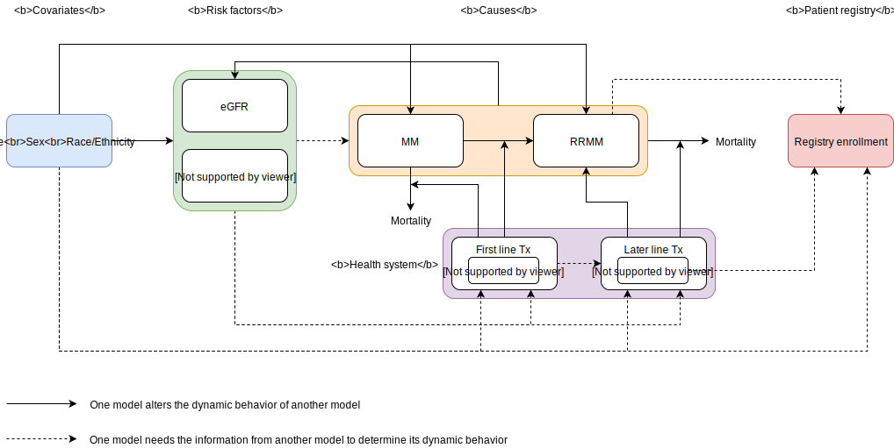

.. role:: underline
    :class: underline

..
  Section title decorators for this document:
  ==============
  Document Title
  ==============
  Section Level 1 (#.0)
  +++++++++++++++++++++

  Section Level 2 (#.#)
  ---------------------
  Section Level 3 (#.#.#)
  ~~~~~~~~~~~~~~~~~~~~~~~
  Section Level 4
  ^^^^^^^^^^^^^^^
  Section Level 5
  '''''''''''''''
  The depth of each section level is determined by the order in which each
  decorator is encountered below. If you need an even deeper section level, just
  choose a new decorator symbol from the list here:
  https://docutils.sourceforge.io/docs/ref/rst/restructuredtext.html#sections
  And then add it to the list of decorators above.

.. _2019_concept_model_vivarium_csu_multiple_myeloma:

=======================================================
Vivarium CSU Multiple Myeloma Registries Phase 1
=======================================================

.. contents::
  :local:

+------------------------------------+
| List of abbreviations              |
+=======+============================+
| ASCT  | Autologous stem cell       |
|       | transplantation            |
+-------+----------------------------+
| CKD   | Chronic kidney disease     |
+-------+----------------------------+
| Dara  | Daratumumab                |
+-------+----------------------------+
| eGFR  | Estimated glomerular       |
|       | filtration rate            |
+-------+----------------------------+
| HR    | Hazard ratio               |
+-------+----------------------------+
| Isa   | Isatuximab                 |
+-------+----------------------------+
| MM    | Multiple myeloma           |
+-------+----------------------------+
| OS    | Overall Survival           |
+-------+----------------------------+
| PFS   | Progression-free survival  |
+-------+----------------------------+
| RCT   | Randomized controlled trial|
+-------+----------------------------+
| RRMM  | Relapsed/ Refractory MM    |
+-------+----------------------------+

.. _mm1.0:

1.0 Background
++++++++++++++
In March of 2020, the United States (US) Food and Drug Administration approved the use of a new drug, Isatuximab, in combination with pomalidomide and dexamethasone for the treatment of relapsed/refractory multiple myeloma (RRMM) in adults who had previously received at least two prior therapies including lenalidomide and a proteasome inhibitor. ([Sanofi-2020]_) A phase 3 clinical study has shown Isatuximab, in addition to pomalidomide-dexamethasone, to significantly improve progression-free survival in patients with RRMM. ([Attal-et-al-2019]_) Since the introduction of Isatuximab on the US drug market, Sanofi has started a clinical registry in the US to observe the use of Isatuximab in patients with RRMM in a real-world setting.

As Isatuximab is still relatively new and the clinical registry is in early stages of enrollment, Sanofi is interested in using simulation to further understand Isatuximab’s potential impact and aid in registry design. Simulation is a general method that allows the incorporation of inter-related and dynamic factors and processes to predict health outcomes over time. In this project, we employ customized agent-based simulation software in which thousands of simulated individuals (“simulants”) with individual characteristics and health backgrounds experience MM including treatment, progression, and survival in a realistic way. This project is currently planned out in three phases including, 1) simulating the general population in one location and a registry population in the same location, 2) updating input data parameters using real registry data and rerunning the microsimulation from phase 1 iteratively to calibrate with real-world evidence and 3) expanding the microsimulation to other locations of interest. This document will outline the current analysis plan for phase 1 of this project.

FDA just approved isatuximab in combination with carfilzomib and dexamethasone (Kd), for the treatment of adult patients with RRMM who have received one to three prior lines of therapy.([Sanofi-2021]_)

Key sub-populations agreed upon include:

* Black/African American population

* Population with high-risk cytogenetics

* Population with renal impairment/CKD (eGFR < 60 ml/min/1.73m^2)

* Elder population (aged > 75 years)

In the absence of data on treatment effects for sub-groups we will need to make assumptions with client guidance. A strength of this project is that we will be able to iteratively update such assumptions as we get real world data from registries and re-run the simulation.

.. _mm1.1:

1.1 Project overview
--------------------
This project intends to model the impact of a new treatment option for myeloma disease, Isatuximab, from 2021 to 2025 among the general population, key subpopulations listed above, and a registry population within the United States. The model will make use of the current multiple myeloma treatment guidelines in the United States. The choice of treatment is dependent on disease status only.

.. _mm1.2:

1.2 Literature review
---------------------

There is one randomized controlled trial on Isatuximab treatment that is currently active and is briefly described below.

.. list-table:: RCT Summaries
   :header-rows: 1

   * - Study Name
     - Recent Publication(s)
     - Location
     - Intervention arm
     - Control arm
     - Eligible population
     - Length of follow-up
   * - Multinational Clinical Study Comparing Isatuximab, Pomalidomide, and Dexamethasone to Pomalidomide and Dexamethasone in Refractory or Relapsed and Refractory Multiple Myeloma Patients (ICARIA-MM)
     - (1.) Dimopoulos, M.A., Leleu, X., Moreau, P. et al. 2020; (2.) Attal, Richardson, Rajkumar, San-Miguel, Beksac, Spicka, et al. 2019 [Dimopoulos-et-al-2020]_
     - 102 sites in 24 countries
     - IPd (isatuximab + pomalidomide + dexamethasone)
     - Pd (pomalidomide + dexamethasone)
     - Adult patients with relapsed and refractory multiple myeloma who had received at least two previous lines of treatment, including lenalidomide and a proteasome inhibitor.
     - 28-day treatment cycle

.. _mm2.0:

2.0 Modeling aims and objectives
++++++++++++++++++++++++++++++++

The primary objective of this project is to answer the following question: what can we expect the incidence, prevalence, mortality, and survival of MM to be overall and among a registry population in the United States, and in key sub-populations, under a business-as-usual treatment scenario and an Isatuximab treatment scenario over 5 years? The key sub-populations include the Black/African American population, population with high-risk cytogenetics, population with renal impairment and the elderly population (age > 75 years).

To answer this question, we will gather data from the 2019 Global Burden of Disease Study (GBD), SEER, literature, and Flatiron Health and run our own survival regression to inform the parameters for our simulation. We will simulate the changes in MM and RRMM disease incidence, prevalence and survival from 2021 to 2025 in response to an Isatuximab treatment intervention scenario in the US population and simulated registry population. These outcomes will be stratified by age, sex, calendar year, race/ethnicity, renal impairment and cytogenetic risk.

.. _mm3.0:

3.0 Causal framework
++++++++++++++++++++

.. _mm3.1:

3.1 Causal diagram
------------------

 .. note::
    link to DAGs page
    use round circles with DAGs

**Outcome (O)**:

**Most proximal determinant/exposure (E)**:

**Confounders (C)**:

**Effect modifiers**:

**Mediators (M)**:

.. _mm3.2:

3.2 Effect sizes
----------------

4.0 Intervention
++++++++++++++++

Among MM and RRMM patients, they expect to have:
 - Isatuximab treatment with coverage rates informed by Sanofi's commercial
   team; OR
 - Daratummumab treatment with coverage rates derived from IQVIA sales
   projection; OR
 - Residual (non Isa or Dara-based) treatment with coverage rates calculated
   by (1 - Isa_coverage - Dara_coverage).

.. _mm4.1:

4.1 Simulation scenarios
------------------------

To measure the impact of an isatuximab scale-up in the first line of treatment, we will simulate two scenarios, a baseline scenario and an alternative scenario, outlined below. The underlying health state of each simulant will be measured at each 28-day time step and the probability that each simulant is treated will be dependent on the coverage stated in that scenario.

**Baseline** Coverage of isatuximab in the first line of treatment will remain at its 2021 value of 0% for the duration of the simulation from 2021 to 2025.

**Alternative** Coverage of isatuximab in the first line of treatment will scale-up linearly over the duration of the simulation from 0% in 2021 to 10% in 2025.

More details on treatment coverage in each simulation scenario can be found in the `5.3.3.2 Treatment Modeling Strategy`_ section.

Additionally, we will perform several runs of the simulation baseline and alternative scenarios under different key parameter assumptions in order to perform sensitivity analyses that test the impact of different parameter values on simulation outcomes (the difference between scenarios). The two parameters and their respective assumed values we will include in this sensitivity analysis are listed below.

1. Treatment effects (see the `5.3.3.2 Treatment Modeling Strategy`_ section for more detail)

  1a. Flatiron Health based estimates

  1b. Clinical trial based estimates

2. Impact of race on survival outcomes (see the `5.3.2.2 Risk Factor Effects`_ section for more detail)

  2a. Hazard ratios from the CoMMpass registry [Derman-et-al-2020]_

  2b. Assumption of no impact of race on multiple myeloma survival outcomes independent of age

Therefore, we will perform four different simulation runs of the alternative and baseline scenarios under each of the following conditions:

- Run 1: 1a, 2a
- Run 2: 1a, 2b
- Run 3: 1b, 2a
- Run 4: 1b, 2b

.. _mm5.0:

5.0 Vivarium modelling components
+++++++++++++++++++++++++++++++++

.. _mm5.1:

5.1 Vivarium concept model
--------------------------

The simulation concept model consists of five main components:
 1. Covariates (age, sex, race/ethnicity)
 2. Risk factors (eGFR and cytogenetics)
 3. Causes (progression of multiple myeloma)
 4. Health system (multiple lines of treatment for MM and RRMM population)
 5. Patient registry

.. _mm5.2:

5.2 Demographics
----------------

.. _mm5.2.1:

5.2.1 Population description
~~~~~~~~~~~~~~~~~~~~~~~~~~~~

  - Location: United States
  - Cohort type: Prospective **closed** cohort of individuals aged 15 years and
    older (open cohort if we only examine on age 50+ population)
  - Size of largest starting population: 200,000 simulants
  - Time span: Jan 1, 2011 to Dec 31, 2025 (Jan 1, 2011 to Jan 1, 2021 is a
    10-year long burn-in period)
  - Time step: 28 days

.. _mm5.2.2:

5.2.2 Population of interest
~~~~~~~~~~~~~~~~~~~~~~~~~~~~~~~~~

**General US population** and **Registry population** stratified by
sub-population groups of following:

 - Black/African American population
 - Population with high-risk cytogenetics (abnormality includes Del(17p) t(14;16) t(14;20) Del(1p))
 - Population with Renal Impairment (RI) (eGFR < 60 ml/min/1.73m2)
 - Elder population (aged > 75 years)

.. _mm5.3:

5.3 Models
----------

.. _mm5.3.1:

5.3.1 Disease model
~~~~~~~~~~~~~~~~~~~

See :ref:`multiple myeloma cause model<2019_cancer_model_multiple_myeloma>`

.. _mm5.3.2:

5.3.2 Risk factor model
~~~~~~~~~~~~~~~~~~~~~~~

In this model, we implement risk exposures for simulants upon entry to the MM state of the multiple myeloma cause model. Simulants in the susceptible state will not have risk exposure values (aside from sex and age) or risk effects. The risk exposure and effects for the risks included in this model (sex, age, race, cytogenetic risk, renal impairment) are described below.

.. note::

  This risk factor model assigns race as an attribute upon diagnosis of multiple myeloma according to the racial distribution of newly diagnosed patients rather than tracking race as an attribute throughout the simulation and applying differential probability of MM incidence by race. This was done in order to avoid the complexities of modeling differential background mortality rates by race throughout our simulation.

  However, a simulation output of interest is age-, sex-, and race-specific multiple myeloma incidence rates per person year in the general population for that demographic group. Because we do not track race-specific person time in the general population in our simulation, we will not be able to directly compute this measure from our simulation results.

  Instead, we will calculate race-specific multiple myeloma incidence rates post-hoc using the multiple myeloma incidence rates from our simulation, the racial distribution of the US population (to be obtained from census/NHANES/other data sources), and the incidence rate ratio of multiple myeloma by racial groups. This will be performed as part of our simulation output processing rather than a feature built into the simulation.

  More details will be forthcoming.

.. _mm5.3.2.1:

5.3.2.1 Risk Factor Exposure Initialization
^^^^^^^^^^^^^^^^^^^^^^^^^^^^^^^^^^^^^^^^^^^^^^

Upon diagnosis with multiple myeloma, simulants should be assigned values for each of the following characteristics, with the probability shown in the table below depending on their sex and age at diagnosis. A dichotomous risk exposure value of <65 or 65+ should be assigned to each simulant based on the simulant's age at the time they are initialized into or transition into the newly diagnosed MM state.

.. list-table:: Risk Exposure Distributions by Age and Sex for Simulant Intiailization
  :header-rows: 1

  * - Sex
    - Age at diagnosis
    - Proportion Black
    - Proportion with high cytogenetic risk
    - Proportion with renal insufficiency at diagnosis
  * - Male
    - Under 65
    - 0.211
    - 0.34
    - 0.40
  * - Male
    - 65+
    - 0.159
    - 0.34
    - 0.40
  * - Female
    - Under 65
    - 0.225
    - 0.34
    - 0.40
  * - Female
    - 65+
    - 0.165
    - 0.34
    - 0.40

The probability of high cytogenetic risk (34%) was obtained from [Rice-et-al-2020]_, assuming that unknown/undocumented status was missing at random. This value was used instead of the value reported in [Braunlin-et-al-2021]_ because it was substantially higher than values reported in other data source, as discussed in correspondence with the client.

The probability of renal impairment (40%) was obtained from [Derman-et-al-2020]_. This value was chosen instead of the value reported in [Braunlin-et-al-2021]_, as it was consistent with values from serveral other sources, as discussed in correspondence with the client.

Given the lack of joint distributions for renal impairment and cytogenetic risk available in the literature, we assumed that the exposure distribution for cytogenetic risk and renal insufficiency were independent of each other as well as with age, sex, and race. Notably, we reallocated the observations with missing data on cytogenetic risk assuming a complete lack of non-response bias.

The proportion of Black multiple myeloma patients by sex and age at diagnosis +/- 65 years was calculated using SEER data.

.. todo::

  Cite SEER data source.

Notably, we only have risk factor exposure distribution data among newly diagnosed patients. Due to the differential survival rates among the different risk exposure groups, we do not expect that the risk exposure distribution among relapsed and refractory multiple myeloma patients to be the same as among newly diagnosed patients. Due to our lack of data to inform risk exposure initialization probabilities among RRMM patients at the beginning of the simulation, we will model a "burn-in" period prior to the official time-frame of the simulation (2021-2026) in which all MM patients are initialized to the first MM state, allowing these risk exposure distributions to shift along with disease progression according to the risk effects described in the next section. Details are described in the :ref:`multiple myeloma cause model document<2019_cancer_model_multiple_myeloma>`.

After the initial 10 burn-in period run, prevalent risk exposure distributions for race, cytogenetic risk, and renal function should be recorded for each MM cause model state. In order to achieve this, person-time stratified by risk exposure and multiple myeloma cause model state is required as a simulation output. Given our assumpiton of independence of risk exposures, the prevalent risk exposure distributions should be evaluated at the population level; however, the age risk exposure distribution should be stratified by GBD 5 year-age group. For future runs in which a burn-in period is not run and simulants are initialized into RRMM states rather than solely the first MM state, simulants should be assigned with risk exposures for race/cytogenetic risk/renal function at diagnosis with probabilities corresponding to the recorded risk exposure distribution specific to the MM cause model state that the simulant is initialized into.

.. note::

  While the table above should be used to assign risk exposures to simulants in our model, the table below should be used to calculate risk effects as described below.

.. list-table:: Risk Exposure Distributions for Risk Effects Calculation
  :header-rows: 1

  * - Parameter
    - Exposed group
    - Unexposed group
    - Probability of exposure
    - Note
  * - Gender
    - Male
    - Female
    - 0.539
    -
  * - Age at diagnosis
    - 65+ years
    - <65 years
    - 0.647
    - Collapsed age categories reported by [Braunlin-et-al-2020]_ for compatibility with age categories for risk effects reported by [Derman-et-al-2020]_
  * - Race
    - Black
    - Non-Black
    - 0.177
    - We reallocated missing observations assuming lack of non-response bias
  * - Cytogenetic risk
    - High
    - Standard
    - 0.34
    - value from [Rice-et-al-2020]_, assuming unknown/undocumented at random
  * - Renal function at diagnosis
    - Impaired
    - Not impaired
    - 0.40
    - Obtained from [Derman-et-al-2020]_. Value supported by multiple sources in correspondence with client

.. _mm5.3.2.2:

5.3.2.2 Risk Factor Effects
^^^^^^^^^^^^^^^^^^^^^^^^^^^^

The table below reports hazard ratios for overall survival and progression free survival for each covariate exposed group relative to the unexposed group (excluding race and cytogenetic risk, which are presented in separate subsequent tables). These hazard ratios are adjusted for age only. We chose hazard ratios unadjusted for treatment differences that we are not directly modeling (particularly ASCT) so that differences in prescribing practices by these risk exposures would be captured in these risk effects. However, these hazard ratios are *not* adjusted for each of the other risk factors that we are directly modeling aside from age, it is possible that these effects are confounded by one another (for instance, the effect of sex on survival may be confounded by renal impairment). Since the joint distributions of these risk exposures are unknown, we are unaware of the direction that this potential bias may impact our model. The hazard ratios shown in the table below were obtained from the data supplement in [Derman-et-al-2020]_.

.. list-table:: Risk Effects Table (to inform all simulation runs)
  :header-rows: 1

  * - Parameter
    - OS HR
    - PFS HR
    - Exposed group
    - Unexposed group
    - Adjustment variables
    - Note
  * - Sex
    - 1.8 (1.3, 2.5)
    - 1.3 (1.04, 1.6)
    - Male
    - Female
    - Age
    - Note that the SEER analysis suggests this is a overestimate.
  * - Age at diagnosis
    - 2.2 (1.6, 3.0)
    - 1.7 (1.4, 2.1)
    - 65+
    - <65
    - None
    -
  * - Renal function at diagnosis
    - 1.9 (1.4, 2.6)
    - 1.4 (1.1, 1.7)
    - Impaired
    - Not impaired
    - Age
    - Impairment defined as eGFR less than 60. No suspected confounding by race

.. list-table:: Race and Cytogenetic Risk Effects Table (to inform 2a simulation runs)
  :header-rows: 1

  * - Parameter
    - OS HR
    - PFS HR
    - Exposed group
    - Unexposed group
    - Adjustment variables
    - Note
  * - Race
    - 1.7 (1.2, 2.4)
    - 1.4 (1.1, 1.8)
    - Black
    - Non-Black
    - Age
    - Reference group from Derman et al. is white, which we are using as a proxy for the non-Black racial group due to the absence of more detailed data
  * - Cytogenetic risk | non-Black
    - 1.8 (1.3, 2.7)
    - 1.3 (1.0, 1.6)
    - High
    - Standard
    - Age
    - Effect modified by race. High risk defined as the presence of at least one cytogenetic abnormality. Assume that effect among the white racial group (from Derman et al.) is similar to the effect among the non-black racial group.
  * - Cytogenetic risk | Black
    - 1
    - 1
    - High
    - Standard
    - Age
    - Effect modified by race. High risk defined as the presence of at least one cytogenetic abnormality.

.. list-table:: Race and Cytogenetic Risk Effects Table (to inform 2b simulation runs)
  :header-rows: 1

  * - Parameter
    - OS HR
    - PFS HR
    - Exposed group
    - Unexposed group
    - Adjustment variables
    - Note
  * - Race
    - 1
    - 1
    - Black
    - Non-Black
    - N/A
    -
  * - Cytogenetic risk
    - 1.6 (1.1, 2.1)
    - 1.7 (1.3, 2.2)
    - High
    - Standard
    - Age
    - Effect from entire cohort in [Derman-et-al-2020]_, not stratified by race

Assume a lognormal distribution of uncertainty within the confidence intervals reported in the table above. See the `5.3.3.2 Treatment Modeling Strategy`_ section for instructions on how to sample from this distribution (`sampling instructions`_). For the effect of cytogenetic risk among Black simulants (HR=1), sampling from a distribution is not required and a value of 1 should be used for all draws.

For implementation in the model, each dichotomous risk factor exposure level will need a PFS and OS hazard ratio relative to the time-varying baseline hazard rate, obtained from the multiple myeloma cause model (rather than the opposite risk factor exposure level as shown above). The following steps describe how to derive these hazard ratios and how to appropriately apply them to a simulant's baseline hazard.

1.  For each covariate, calculate :math:`h_\text{exposed}` and :math:`h_\text{unexposed}` using the equations below, a sampled value from the hazard ratio uncertainty distributions from the table above, and the exposure prevalence from the risk exposure section above. Do this separately for overall survival and progression free survival. This process should also be performed separately for cytogenetic risk|Black and cytogenetic risk|non-Black.

.. math::

  HR_\text{exposed:unexposed} = \frac{h_\text{exposed}}{h_\text{unexposed}}

.. math::

  h_\text{baseline} = p_\text{exposed} * h_\text{exposed} + (1 - p_\text{exposed}) * h_\text{unexposed}

So that,

.. math::

  h_\text{exposed} = \frac{h_\text{baseline}}{p_\text{exposed} + \frac{1 - p_\text{exposed}}{HR_\text{exposed:unexposed}}}

and

.. math::

  h_\text{unexposed} = \frac{h_\text{exposed}}{HR_\text{exposed:unexposed}}

2.  Use covariate exposure level-specific hazard rate to solve for hazard ratio of each covariate exposure relative to the overall baseline hazard rate from the multiple myeloma cause model.

.. math::

  HR_\text{exposed:baseline} = \frac{h_\text{exposed}}{h_\text{baseline}}

.. math::

  HR_\text{unexposed:baseline} = \frac{h_\text{unexposed}}{h_\text{baseline}}

The calculation described above, performed using the treatment duration and overall survival hazard rates for the first time period at the first line of treamtent referenced in the multiple myeloma cause model document for :math:`h_\text{baseline}`, the values in the *Risk Exposure Distributions for Risk Effects Calculation* table for :math:`p_\text{exposed}`, and the values in the *Risk Effects Table* for the :math:`HR_\text{exposed:unexposed}` values.

The values in the table below should be used for simulation implementation. Notably, different values for race/cytogenetic risk effects should be used dependening on the simulation run (2a or 2b, as described in the `4.1 Simulation scenarios`_ section). The same values for the age, sex, and renal function risk effects should be used for all simulation runs.

.. list-table:: Final risk effects for simulation use (all simulation runs)
  :header-rows: 1

  * - Risk
    - Risk exposure
    - OS HR relative to baseline
    - PFS HR relative to baseline
  * - Age at diagnosis
    - 65+ years
    - 1.24 (1.16, 1.3)
    - 1.17 (1.11, 1.23)
  * - Age at diagnosis
    - <65 years
    - 0.57 (0.44, 0.71)
    - 0.69 (0.59, 0.8)
  * - Sex
    - Male
    - 1.26 (1.11, 1.38)
    - 1.12 (1.02, 1.21)
  * - Sex
    - Female
    - 0.7 (0.56, 0.87)
    - 0.86 (0.76, 0.97)
  * - Renal function
    - Renal impaired
    - 1.40 (1.20, 1.59)
    - 1.20 (1.09, 1.32)
  * - Renal function
    - Not renal impaired
    - 0.74 (0.61, 0.86)
    - 0.86 (0.79, 0.94)

.. list-table:: Final race/cytogenetic risk effects for 2a simulation use
  :header-rows: 1

  * - Risk
    - Risk exposure
    - OS HR relative to baseline
    - PFS HR relative to baseline
  * - Race/cytogenetic risk
    - Black and high cytogenetic risk
    - 1.50 (1.14, 1.89)
    - 1.31 (1.07, 1.58)
  * - Race/cytogenetic risk
    - Black and standard cytogenetic risk
    - 1.50 (1.14, 1.89)
    - 1.31 (1.07, 1.58)
  * - Race/cytogenetic risk
    - Non-black and high cytogenetic risk
    - 1.27 (0.98, 1.58)
    - 1.10 (0.96, 1.25)
  * - Race/cytogenetic risk
    - Non-black and standard cytogenetic risk
    - 0.70 (0.55, 0.85)
    - 0.85 (0.76, 0.93)

.. list-table:: Final race/cytogenetic risk effects for 2b simulation use
  :header-rows: 1

  * - Risk
    - Risk exposure
    - OS HR relative to baseline
    - PFS HR relative to baseline
  * - Race/cytogenetic risk
    - Black and high cytogenetic risk
    - 1.33 (1.14, 1.53)
    - 1.37 (1.19, 1.56)
  * - Race/cytogenetic risk
    - Black and standard cytogenetic risk
    - 0.83 (0.73, 0.93)
    - 0.81 (0.71, 0.90)
  * - Race/cytogenetic risk
    - Non-black and high cytogenetic risk
    - 1.33 (1.14, 1.53)
    - 1.37 (1.19, 1.56)
  * - Race/cytogenetic risk
    - Non-black and standard cytogenetic risk
    - 0.83 (0.73, 0.93)
    - 0.81 (0.71, 0.90)

3. Apply the hazard ratios specific to the exposure value a simulant possesses for each risk factor to the baseline hazard rate to get the simulant's individual hazard rate separately for PFS and OS, as shown in the equation below.

  for risk exposure(i) in under 65 at diagnosis/over 65 at diagnosis, male/female, Black and high cytogenetic risk/Black and low cytogenetic risk/non-Black and high cytogenetic risk/non-Black and low cytogenetic risk, renal impaired/not renal impaired:

.. math::

  h_\text{simulant} = h_\text{baseline} * \prod HR_\text{risk exposure(i):baseline}

.. note::

  The relapse hazard rate is equal to the progression free survival hazard rate *minus* the overall survival hazard rate. Therefore, the hazard ratios specific to a simulant should be applied to the relapse (incidence to next MM cause model state) and mortality hazards should be as follows:

  .. math::

    h_\text{mortality(i)} = h_\text{OS} * HR_\text{OS(i)}

    h_\text{relapse(i)} = h_\text{PFS} * HR_\text{PFS(i)} - h_\text{mortality(i)}

.. 5.3.2.3:

5.3.2.3 Assumptions and Limitations
^^^^^^^^^^^^^^^^^^^^^^^^^^^^^^^^^^^^^^

The assumption of independence of cytogenetic risk and renal function with each other and the other risk exposures in this model ignores the joint distribution of these risks. There is evidence that there is little to no correlation between race and these risk factors from Derman et al. 2020, but there may be unaccounted for correlations between the remaining factors. This could be improved with access to Flatiron microdata.

We are limited in that the hazard ratios for our risk effects are adjusted for age only, so the effects of one risk factor in our model may be confounded by another. Since we lack information on the joint distributions of these risk exposures, we are unable to inform the direction this may bias our model. Additionally, we assume that the risk effects of each of the risk factors we model are independent of one another with the exception of cytogenetic risk and race.

We are limited in that the hazard ratios obtained from [Derman-et-al-2020]_ were evaluated among newly diagnosed multiple myeloma patients and assessed using exposures assessed at baseline. We assume that these risk effects based on patients' baseline risk exposures do not vary with disease progression, which is particularly limited in the case of renal function, which may change over time. However, there is not consistent evidence that the reversal of renal failure is associated with increased survival, as discussed by [Dimopoulos-et-al-2008]_, which indicates this limitation may not have a large impact on our model.

We assume that the hazard ratios for PFS and OS among Black individuals relative to white individuals reported in [Derman-et-al-2020]_ is similar to those among Black individuals relative to non-Black individuals. We make this assumption in the absence of reported hazard ratios adjusted for treatment for additional racial groups. Additionally, we assume that the effect of cytogenetic risk on PFS and OS among white individuals is similar to that among non-Black individuals. While [Derman-et-al-2020]_ did include the patients who reported being Hispanic/Latino in the white category and the majority of the non-Black population in the US is white, this remains a limitation of our analysis that could potentially be address through access to Flatiron microdata provided adequate data on race/ethnicity is included.

.. note::

  Previous information on cytogenetic risk and renal function was removed from the risk factors section, but a record of this information remains in https://github.com/ihmeuw/vivarium_research/pull/516

.. _mm5.3.3:

5.3.3 Treatment model
~~~~~~~~~~~~~~~~~~~~~

.. _mm5.3.3.1:

5.3.3.1 Research Background
^^^^^^^^^^^^^^^^^^^^^^^^^^^^^

Treatment guidelines for multiple myeloma are complex and varied. [Rajkumar-and-Kumar-2020]_ and [Nijhof-et-al-2017]_ published recent reviews on multiple myeloma treatment options and guidelines. Important classes of anti-myeloma drugs are summarized (non-exhaustively) below, according to [Nijhof-et-al-2017]_:

.. list-table:: Select anti-myeloma drug classes
   :header-rows: 1

   * - Class
     - Acronym
     - Drugs
   * - Immunomodulatory agents
     - IMiDs
     - Thalidomide, lenalidomide, pomalidomide
   * - Proteasome inhibitors
     - PIs
     - Bortezomib, carfilzomib, ixazomib, marizomib, oprozomib
   * - Monoclonal antibodies
     - MoABs
     - isatuximab (anti-CD38), daratumumab (anti-CD38), MOR202 (anti-CD38), elotuzamab (anti-CS1/anti-SLAM7), denosumab (anti-RANKL), siltuximab (anti-IL6), IPH2101 (anti-KIR2DL1/2/3)
   * - Corticosteroids
     -
     - Dexamethasone, prednisone

The treatment indications with FDA approval for isatuxamib [FDA-prescribing-information-isa-2021]_ are listed below:

- in combination with pomalidomide (PI) and dexamethasone, for the treatment of adult patients with multiple myeloma who have received at least two prior therapies including lenalidomide (IMiD) and a proteasome inhibitor (PI)

- in combination with carfilzomib (PI) and dexamethasone, for the treatment of adult patients with relapsed or refractory multiple myeloma who have received 1 to 3 prior lines of therapy

.. note::

	Clinical trial efficacy data exists for isatuxamib + pomalidomide + dexamethasone treatment relative to pomalidomide + dexamethasone alone [Attal-et-al-2019]_. A clinical trial comparing isatuxamib + carfilzomib + dexamethasone relative to carfilzomib + dexamethasone is ongoing [Moreau-et-al-2019]_.

The treatment indications with FDA approval for DARZALEX FASPRO [FDA-prescribing-information-dara-2021]_, a monoclonal antibody competitor to isatuxamib, include:

- in combination with lenalidomide (PI) and dexamethasone in newly diagnosed patients ineligible for autologous stem cell transplant (ASCT)

- in combination with lenalidomide (PI) and dexamethasone in newly diagnosed patients ineligible for ASCT *and* in patients with replased or refractory multiple myeloma who have received at least one prior therapy

- in combination with bortezomib (PI), thalidomide (IMiD), and dexamethasone in newly diagnosed patients who are eligible for ASCT

- in combination with bortezomib (PI) and dexamethasone in patients who have received at least one prior therapy

- as monotherapy in patients who have received at least three prior lines of therapy including a PI and an IMiD or who are double-refractory to a PI and an IMiD

- in combination with bortezomib (PI), cyclophosphamide, and dexamethasome in newly diagnosed patients

[Braunlin-et-al-2021]_ summarized the multiple myeloma treatment landscape among recent years using Flatiron registry data. [Goto-et-al-2019]_ and [Jagannath-et-al-2016]_ published similar, but less recent, studies using SEER and International Oncology Netword data, respectively.

A figure of the multiple myeloma treatment regimens by line of treatment from [Braunlin-et-al-2021]_ is shown below. Notably, the usage of different treatment regimens has significantly changed over time as more treatments have become avaliable.

.. image:: treatment_landscape_braunlin_et_al_2021.png

Notably, [Braunlin-et-al-2021]_ reported that 90.7 percent of all patients received at least one treatment. As shown by [Goto-et-al-2019]_, older patients are significantly more likely to receive no treatment than younger patients.

As discussed in treatment guideline reviews, in general triplet regimens are preferred, but doublet regimens should be considered if patients are frail [Rajkumar-and-Kumar-2020]_. Additionally, for relapsed multiple myeloma, at least two new drugs that the patient is not refractory to, and preferably from a different class, should be considered [Rajkumar-and-Kumar-2020]_. [Rajkumar-and-Kumar-2020]_ notes that "patients refractory to a drug are likely to be reractory to different drug[s] in the same class"; although, two important exceptions exist, including pomalidomide for patients refractory to lenalidomide and carfilzombib in patients refractory to bortezomib (p. 6).

[Rajkumar-and-Kumar-2020]_ provide treatment recommendations for first line therapy based on ASCT eligibility and cytogenetic risk-stratification, summarized in the table below. Notably, ASCT improves median overall survival and can be delayed until first relapse, primarily based on patient choice (overall survival is similar whether ASCT was performed early or delayed until relapse) [Rajkumar-and-Kumar-2020]_.

.. list-table:: Initial therapy recommendations
   :header-rows: 1

   * - ASCT eligibility
     - Cytogenetic risk
     - Treatment recommendation
   * - Eligible
     - Standard
     - VRd: bortezomib + lenalidomide + dexamethasone
   * - Eligible
     - High
     - VRd: bortezomib + lenalidomide + dexamethasone; OR dara-VRD: daratumumab + bortezomib + lenalidomide + dexamethasone
   * - Ineligible
     - Standard
     - VRd: bortezomib + lenalidomide + dexamethasone; OR DRd: daratumumab, lenalidomide, dexamethasone
   * - Ineligible
     - High
     - VRd: bortezomib + lenalidomide + dexamethasone

.. _mm5.3.3.2:

5.3.3.2 Treatment Modeling Strategy
^^^^^^^^^^^^^^^^^^^^^^^^^^^^^^^^^^^^

We will have three possible treatment categories in our model, an isatuxamib-containing treatment category, a daratumumab-containing treatment category, and a residual treatment category that consists of all treatments that do not contain isatuxamib or daratumumab, including mono/doublet/triplet/quartet/etc. therapies. Specific implementation details are discussed below.

Notably, because retreatment with anti-CD38 monoclonal antibodies (daratumumab and isatuxamib) is a critical component of the effect of these drugs, we aim to model a "burn-in" period prior to the start of the official simulation timeframe (2021-2026) beginning at the first introduction of daratumumab as an anti-myeloma treatment in 2016. Modeling the scale-up of daratumumab and isatuxamib from this period will allow us to start our official simulation timeframe with the expected distribution of RRMM patients with prior anti-CD8 exposure in each RRMM state. A similar "burn-in" strategy was utilized to model the appropriate prevalence of each RRMM state in the multiple myeloma cause model, which is described in the :ref:`multiple myeloma cause model document <2019_cancer_model_multiple_myeloma>`.

**How to assign treatment category to a simulant:**

*Treatment Coverage Proportions*:

The table below shows the treatment category coverage proportions for the isatuxamib- and daratumumab-containing categories in 2021 (Jan 1. 2021) and 2025 (Dec. 31 2025) in the baseline and alternative scenarios. The residual treatment category coverage proportion is not shown, but covers the remaining proportion of patients. We will assume that coverage of each treatment category changes *linearly* from the 2021 value to the 2025 for each line of treatment.

For the burn-in period (both scenarios):

- Assume that daratumumab-containing treatment category coverage begins at 0% for the second and later lines of treatment on Jan. 1, 2016 and scales up linearly to the line-specific coverage levels listed for 2021.

- Assume that daratumumab-containing treatment category coverage for the first line of treatment begins at 0% on Jan. 1, 2019 and scales up linearly to the first line of treatment coverage level listed for 2021.

- Assume that isatuxamib-containing treatment category coverage begins at 0% for the second and later lines of treatment on Jan. 1, 2020 and scales up linearly to the line-specific coverage levels listed for 2021.

.. list-table:: Treatment category coverage proportions
   :header-rows: 1

   * - Line of treatment
     - Treatment category
     - 2021 (baseline and alternative)
     - 2025 (baseline)
     - 2025 (alternative)
   * - 1
     - Isatuxamib-containing
     - 0
     - 0
     - 10
   * - 1
     - Daratumuab-containing
     - 2.9%
     - 34%
     - 34%
   * - 2
     - Isatuxamib-containing
     - 0.5%
     - 10%
     - 10%
   * - 2
     - Daratumuab-containing
     - 19.8%
     - 34%
     - 34%
   * - 3
     - Isatuxamib-containing
     - 1.0%
     - 9%
     - 9%
   * - 3
     - Daratumuab-containing
     - 32.3%
     - 34%
     - 34%
   * - 4
     - Isatuxamib-containing
     - 3.3%
     - 7%
     - 7%
   * - 4
     - Daratumuab-containing
     - 36.5%
     - 34%
     - 34%
   * - 5+
     - Isatuxamib-containing
     - 3.3%
     - 7%
     - 7%
   * - 5+
     - Daratumuab-containing
     - 30.11%
     - 34%
     - 34%

*Burn-in period initialization*:

	Initialization for the treatment burn-in period should occur prior to the introduction of anti-CD38 monoclonal antibody treatments on Jan. 1, 2016. Each simulant should be initialized to the residual treatment category. Each simulant should be initialized to :code:`eligible_for_retreatment = False`. Initialization on Jan. 1, 2016 should include patients in all of the relapsed and refractory states, not only simulants in the newly diagnosed MM state.

*Post-burn in period initialization*:

  Post-burn in period initialization should occur at the official start of the simulation time frame on Jan. 1, 2021. Simulants should be initialized according to the treatment line-specific treatment category prevalence and :code:`eligible_for_retreatment` status prevalence on Jan. 1, 2021 from the burn-in period run as described above.

  The burn in period avoids the assumption that incident treatment coverage is equal to prevalent treatment coverage and also avoids the necessity of making a simple assumption about anti-CD38 exposure history among simulants at the start of our simulation time frame.

*At each time step post-initialization (burn in and otherwise)*:

  Simulants should have their treatment category exposure updated at each time-step for which they change multiple myeloma cause model states. Otherwise, their treatment exposures should not change. Simulants should be assigned treatment exposures in the following manner:

  For simulants with no prior exposure to isa or dara:

    If :code:`eligible_for_retreatment == False`, assign treatment categories according to the steps below.

    First, calculate proportion with ever exposure to isa and/or dara:

    .. math::

      ever_0 = 0

      ever_1 = c_1

      ever_2 = ever_1 + (c_2 - 0.15 * ever_1)

      ever_3 = ever_2 + (c_3 - 0.15 * ever_2)

      ever_4 = ever_3 + (c_4 - 0.15 * ever_3)

      ever_5 = ever_4 + (c_5 - 0.15 * ever_4)

    Where, :math:`c_\text{x}` is equal to the **combined** coverage or isa and dara at the Xth line of treatment.

    Then, the probability of treatment category exposure for each treatment category at treatment line :math:`x` is as follows:

    :math:`p_\text{x,isa} = \frac{(c_\text{x,isa} - ever_\text{x-1} \times 0.15  \times \frac{c_\text{x,isa}}{(c_\text{x,dara} + c_\text{x,isa})}}{1 - ever_\text{x-1}}`

    :math:`p_\text{x,dara} = \frac{(c_\text{x,dara} - ever_\text{x-1} \times 0.15  \times \frac{c_\text{x,dara}}{(c_\text{x,dara} + c_\text{x,isa})}}{1 - ever_\text{x-1}}`

    :math:`p_\text{x,resid} = 1 - p_\text{x,isa} - p_\text{x,dara}`

    Where :math:`c_x` represents the coverage of a particular treatment category for the simulant's current line of treatment at the current timestep.

    This is an approximation that (1) assumes similar overall survival rates among treatment categories, and (2) does not consider the relative changes in the coverage of the treatment categories over time (lagged by average time of progression). Notably, these assumptions will cause biases in opposite directions.

    .. note::

      It is possible that :math:`p_\text{isa} + p_\text{dara} > 1`. In that case, use the following probabilities:

      :math:`p_\text{isa} = \frac{c_\text{isa}}{c_\text{dara} + c_\text{isa}}`

      :math:`p_\text{dara} = \frac{c_\text{dara}}{c_\text{dara} + c_\text{isa}}`

      :math:`p_\text{resid} = 0`

    If a simulant is assigned an isa- or dara-containing treatment regimen, set :code:`eligible_for_retreatment = True`. If a simulant is assigned to the residual treatment category, do not change their value for :code:`eligible_for_retreatment` (keep as False).

  For simulants with prior exposure to isa or dara:

		If :code:`eligible_for_retreatment == True`, determine if they will be retreated with an anti-CD38 antimonoclonal antibody treatment with a probability of 15%.

		If it is determined that they will be retreated, determine if they will receive an isa-containing treatment or dara-containing treatment, with the probability of isa-containing treatment equal to :math:`\frac{c_\text{isa}}{c_\text{isa} + c_\text{dara}}`, where :math:`c` represents the coverage proportion for the respective treatment categories at the current timestep for the line of treatment that the simulant occupies.

		If it is determined that they will not be retreated (probability 85%), assign them to the residual treatment category. Keep :code:`eligible_for_retreatment = True`.

**How to assign treatment effects:**

Each treatment category has a hazard ratio associated with it both for progression-free survival and overall survival relative to the overall progression-free survival and overall survival of their demographic group as a whole. Additionally, the hazard ratios for the isatuxamib- and daratumumab-containing treatment categories vary based on retreatment status (if a simulant is in the isa or dara treatment category and :code:`eligible_for_retreatment_i == True`, they should be assigned the retreated hazard ratios). The hazard ratios are shown in the tables below.

We will run two separate simulations, one using the treatment effect sizes from clinical trial data and another using the treatment effect sizes from the population-based real world evidence, as described in the `4.1 Simulation scenarios`_ section. The treatment effect hazard ratios for each of these data sources are summarized in the following tables.

.. list-table:: Population-Based Progression Free Survival Hazard Ratios (1a simulation use)
  :header-rows: 1

  * - Line of Treatment
    - Isatuximab, not retreated
    - Isatuximab, retreated
    - Daratumumab, not retreated
    - Daratumumab, retreated
    - Residual
  * - First
    - 0.932 (0.647, 1.365)
    - N/A
    - 0.932 (0.647, 1.365)
    - N/A
    - 1.002 (0.989, 1.018)
  * - Second
    - 1.283 (0.878, 1.718)
    - 1.632 (0.905, 2.733)
    - 1.146 (1.000, 1.318)
    - 1.333 (0.995, 1.702)
    - 0.962 (0.920, 1.000)
  * - Third
    - 1.405 (0.924, 2.020)
    - 1.883 (0.974, 3.100)
    - 1.133 (0.977, 1.296)
    - 1.345 (0.993, 1.747)
    - 0.930 (0.852, 1.001)
  * - Fourth
    - 0.736 (0.394, 1.265)
    - 0.878 (0.653, 1.583)
    - 1.098 (0.877, 1.327)
    - 1.275 (0.981, 1.843)
    - 0.955 (0.822, 1.081)

.. list-table:: Population-Based Overall Survival Hazard Ratios (1a simulation use)
  :header-rows: 1

  * - Line of Treatment
    - Isatuximab, not retreated
    - Isatuximab, retreated
    - Daratumumab, not retreated
    - Daratumumab, retreated
    - Residual
  * - First
    - 0.971 (0.627, 1.488)
    - N/A
    - 0.971 (0.627, 1.488)
    - N/A
    - 1.001 (0.986, 1.011)
  * - Second
    - 1.517 (0.939, 2.349)
    - 2.085 (0.946, 3.634)
    - 1.225 (1.035, 1.443)
    - 1.502 (1.051, 1.944)
    - 0.941 (0.887, 0.987)
  * - Third
    - 1.453 (0.896, 2.407)
    - 2.008 (0.975, 3.790)
    - 1.265 (1.078, 1.457)
    - 1.685 (1.231, 2.152)
    - 0.865 (0.773, 0.951)
  * - Fourth
    - 1.627 (0.948, 2.628)
    - 2.333 (1.031, 4.074)
    - 1.217 (0.976, 1.467)
    - 1.620 (1.008, 2.210)
    - 0.834 (0.702, 0.969)
  * - Fifth+
    - 0.592 (0.103, 1.947)
    - 0.914 (0.493, 2.643)
    - 1.217 (0.976, 1.467)
    - 1.427 (0.834, 2.410)
    - 0.952 (0.744, 1.145)

.. list-table:: Clinical Trial Progression Free Survival Hazard Ratios (1b simulation use)
  :header-rows: 1

  * - Line of Treatment
    - Isatuximab, not retreated
    - Isatuximab, retreated
    - Daratumumab, not retreated
    - Daratumumab, retreated
    - Residual
  * - First
    - 0.445 (0.356, 0.542)
    - N/A
    - 0.445 (0.356, 0.542)
    - N/A
    - 1.017 (1.014, 1.019)
  * - Second, Third, Fourth
    - 0.814 (0.593, 1.056)
    - 0.927 (0.714, 1.077)
    - 0.949 (0.581, 1.681)
    - 0.987 (0.892, 1.207)
    - 1.023 (0.627, 1.272)

.. list-table:: Clinical Trial Overall Survival Hazard Ratios (1b simulation use)
  :header-rows: 1

  * - Line of Treatment
    - Isatuximab, not retreated
    - Isatuximab, retreated
    - Daratumumab, not retreated
    - Daratumumab, retreated
    - Residual
  * - First
    - 0.632 (0.587, 0.683)
    - N/A
    - 0.632 (0.587, 0.683)
    - N/A
    - 1.011 (1.010, 1.012)
  * - Second, Third, Fourth, Fifth+
    - 1.031 (0.960, 1.105)
    - 1.056 (0.928, 1.181)
    - 1.031 (0.960, 1.105)
    - 1.056 (0.928, 1.181)
    - 0.984 (0.929, 1.020)

.. note::

  For reference (to be included in technical report, but not simulation), the treatment duration hazard ratio for the isa/dara in first line of treatment was 0.380 (0.336, 0.425) and residual was 1.019 (1.017, 1.020)

.. _`sampling instructions`:

A lognormal distribution of uncertainty within the uncertainty intervals reported above should be assumed. Additionally, each time a value for a progression free survival hazard ratio is sampled for a given parameter (including each treatment, covariate, and risk factor effect), the same percentile within the distribution of uncertainty should be sampled for overall survival hazard ratio for that parameter. This dependent sampling strategy was chosen because PFS and OS hazard ratios are not independent of each other given that PFS is inclusive of OS.

The code block below instructs how to construct a distribution for each hazard ratio so that it can be sampled from.

.. code-block:: python

  from numpy import log
  from scipy.stats import norm, lognorm
  import random

  def sample_paired_pfs_and_os_hazard_ratio_values(pfs_mid,
                                                   pfs_upper,
                                                   os_mid,
                                                   os_upper,
                                                   seed):
    random.seed(seed)
    pfs_value = lognorm(s=(log(pfs_upper) - log(pfs_mid)) / q_975_stdnorm, scale=pfs_mid).ppf(random.random())
    random.seed(seed)
    os_value = lognorm(s=(log(os_upper) - log(os_mid)) / q_975_stdnorm, scale=os_mid).ppf(random.random())
    return pfs_value, os_value

The PFS and OS hazard ratios specific to the simulant's current line of treatment, assigned treatment category, and retreatment status should be *multiplied* to the simulant's progression-free and overall survival hazard rates for the entire duration the simulant remains in those states. This should be updated each time the simulant progresses through the MM cause model states.

.. note::

  The relapse hazard rate is equal to the progression free survival hazard rate *minus* the overall survival hazard rate. Therefore, the hazard ratios specific to a simulant should be applied to the relapse (incidence to next MM cause model state) and mortality hazards should be as follows:

  .. math::

    h_\text{mortality(i)} = h_\text{OS} * HR_\text{OS(i)}

    h_\text{relapse(i)} = h_\text{PFS} * HR_\text{PFS(i)} - h_\text{mortality(i)}

*Observers*:

We would like to stratify simulations outputs on treatment category (residual/isa, not retreated/isa, retreated/dara, not retreated/dara, retreated).

Additionally, we would like the *number* of simulants assigned to each treatment category at time of diagnosis or relapse for each line of treatment.

.. _mm5.3.4:

5.3.4 Patient registry model
~~~~~~~~~~~~~~~~~~~~~~~~~~~~

This simulation tracked which simulants were eligible for and included in a
registry. Inclusion criteria from Sanofi’s RRMM patient registry protocol was
used to determine who was eligible for inclusion. Of the individual simulants
eligible for inclusion, each had a 5% chance of being enrolled.

Inlcusion criteria
^^^^^^^^^^^^^^^^^^

According to Sanofi’s RRMM patient registry protocol, patients must meet all the
following criteria:

 1. 18 years and older
 2. With relapsed/refractory multiple myeloma (RRMM according to IMWG definition)
 3. First time using Isa (never received Isa for treatment of disease other than RRMM)
 4. No personal history of other malignant cancers in the past 3 years

Criteria 1-3 above were included as criteria in the simulation. 1 and 2
were simulant characteristics based on the simulation design. 3 requires a
simulant with RRMM must have had at least one previous line of treatment but
have not been previously treated with isatuximab for diseases other than RRMM.
Based on discussion with Sanofi and our domain expert, we decided to not
incorporate 4, personal history of malignancy, as a determinant in registry
enrollment within the simulation as it introduced additional analytic complexity
and we expect this criterion to have a small impact on eligibility.

.. note::

 We chose not to enforce inclusion criterion number 2 (with RRMM) for the
 alternative scenario in our simulation. The removal of this criterion allows us
 to demonstrate the potential additional number of eligible and enrolled patients
 if the registry were to accept NDMM patients at their first line of treatment in
 accordance with the modeled isatuximab scale-up in the first line of treatment
 in our alternative scenario.

Power calculation
^^^^^^^^^^^^^^^^^

To calculate the number of simulants eligible for inclusion and the number of
simulants in the registry for each calendar year from 2021 to 2025, we used the
equation presented below:

:math:`N_{candidate}(t) = Prev_{RRMM}(t) \times F_{Isa}`

And,

:math:`N_{enrollee}(t) = N_{candidate}(t) \times P`

Where,
 - :math:`N_{candidate}(t)` is the number of registry candidates in year t.
 - :math:`N_{enrollee}(t)` is the number of simulants in the registry in year t.
 - :math:`Prev_{RRMM}(t)` is the number of adult (15+ in our sim) prevalent RRMM
   cases in year t.
 - :math:`F_{Isa}` is the proportion of population eligible for Isatuximab treatment.
 - :math:`P` is the proportion of registry candidates that will be selected into
   the registry. We assume P is a constant number equal to **5%** over time.

Registry enrollment system
^^^^^^^^^^^^^^^^^^^^^^^^^^

We set January 1, 2021 as the start date of the registry and assumed that no
one was in the registry prior to the start date. At each simulation time step,
we looked at each simulant’s disease status and treatment history. If an
individual simulant met the inclusion criteria, they were eligible for inclusion.
Those eligible had a 5% chance of being enrolled, and they would stay in the
registry until death. The probability used to enroll eligible simulants into the
registry is a constant variable over the course of the simulation, independent
from simulant’s age, sex, race, cytogenetic risk, and renal function. We captured
two measures from the patient registry component: the cumulative number of eligible
simulants; and the cumulative number of living simulants in the registry.

.. _mm5.4:

5.4 Input data sources
----------------------

.. _mm5.5:

5.5 Output meta-table shell
---------------------------

.. list-table:: Output shell table
   :header-rows: 1

   * - Location
     - Year
     - Age group
     - Sex
     - Poulation group
     - Population subgroup
     - Scenario
     - Cause
     - Outcome
   * - United States
     - 2021
     - 15 to 19
     - Female
     - General population
     - Black/African American population
     - Baseline
     - Multiple myeloma
     - Incidence (cases per person-year)
   * -
     - 2022
     - 20 to 24
     - Male
     - Registry population
     - High-risk cytogenetics population
     - Alternative
     - Relapsed/refractory multiple myeloma
     - Prevalence (cases per person-year)
   * -
     - 2023
     - 25 to 29
     -
     -
     - Population with RI
     -
     -
     - Deaths (per person-year)
   * -
     - 2024
     - ...
     -
     -
     - Elder population
     -
     -
     - Median PFS (weeks)
   * -
     - 2025
     - 95 plus
     -
     -
     -
     -
     -
     - One-year PFS (%)
   * -
     -
     -
     -
     -
     -
     -
     -
     - Median OS (weeks)
   * -
     -
     -
     -
     -
     -
     -
     -
     - One-year OS (%)

- High-risk cytogenetics: abnormalities of Del(17p) t(14;16) t(14;20) Del(1p)
- Renal impairment (RI): eGFR < 60 ml/min/1.73m^2
- Elder: aged 75 years and older
- Median PFS (weeks): median length of time-to-progression in weeks
- One-year PFS (%): proportion of patients survival without progression during a one-year period
- Median OS (weeks): median length of time-to-death in weeks
- One-year OS (%): proportion of patients survival without death during a one-year period

.. _mm5.6:

5.6 Survival output table
-------------------------

.. list-table:: Survival observer metrics
   :header-rows: 1

   * - Variable
     - Definition
   * - input_draw
     - Input draw number. len(input_draw) = 30
   * - scenario
     - Intervention scenario. Choose from ['baseline', 'alternative']
   * - treatment_line
     - Treatment line/disease state a simulant is in. If a simulant is in state
       `multiple_myeloma_{x}`, assign this simulant `treatment_line {x}`. Choose
       from [1, 2, 3, 4, 5+]
   * - period
     - The number of days since the entrance into the `treatment_line` that the
       count measure was evaluated on.
   * - alive_at
     - Count of at-risk simulants alive at 'period' days since they entered `treatment_line`.
   * - died_by
     - Count of simulants who died at `period` days since they entered `treatment_line`.
   * - progress_by
     - Count of simulants who progressed to next line of treatment/disease state
       at `period` days since they entered `treatment_line`.
   * - sim_end_on
     - Count of simulants without death or progression at the end of the simulation
       at `period` days since they entered `treatment_line`.

Time frame for survival observer (timestep = 28 days):
 1. start_date = 2021-01-01, end_date = 2025-12-31
 2. start_date = 2025-01-01, end_date = 2025-12-31

.. note::

   Currently, there is no stratification of treatment category by line of treatmnet.
   If time allows, we will add this stratification to survival observer metrics so
   that we can compare survival outcomes for simulants treated with Isa/Dara to
   residual category.

.. _mm6.0:

6.0 Back of the envelope calculations
+++++++++++++++++++++++++++++++++++++

.. _mm7.0:

7.0 Limitations
+++++++++++++++

 1. The incorporation of ASCT into the treatment model of the simulation is
    dependent on data availability. If it is not incorporated we may underestimate
    the duration to first relapse among MM patients (though because it would not
    be incorporated in either the baseline or alternative scenarios, we do not
    expect the proportional difference between the two scenarios would be significantly
    impacted). To model the effect of ASCT along with the first-line treatment
    for MM patients, we need additional information on how long patients wait
    before they can get the transplant. We may overestimate the hazard of not
    receiving a transplant if we assume any patient who dies before receiving a
    transplant is a non-transplant patient. We do not intend to incorporate an
    option for “delayed transplant” in which transplant occurs at first relapse.
 2. We assume the incidence of MM from GBD is the detection rate of symptomatic
    cases.
 3. Guided by Sanofi’s RRMM patient registry protocol, patients who had previous
    malignancy in the past 3 years are not eligible to be enrolled in the registry.
    That means some RRMM patients will be excluded from registry based on their
    personal history of malignancy. Due to the fact that there is only a small
    proportion (less than 5%) of RRMM patietns with malignancy in the past 3
    years, we don't use the history of malignancy as a determinant factor in our
    list of inclusion criteria.

8.0 References
+++++++++++++++

.. [Attal-et-al-2019]
   Attal M, Richardson PG, Rajkumar SV, et al. Isatuximab plus pomalidomide and
   low-dose dexamethasone versus pomalidomide and low-dose dexamethasone in patients
   with relapsed and refractory multiple myeloma (ICARIA-MM): a randomised,
   multicentre, open-label, phase 3 study. Lancet 2019; 394: 2096–107.

.. [Braunlin-et-al-2021]
	Braunlin, Megan, et al. "Trends in the multiple myeloma treatment landscape and survival: A US analysis using 2011–2019 oncology clinic electronic health record data." Leukemia & Lymphoma 62.2 (2021): 377-386.

.. [Derman-et-al-2020]
  Derman, B. A., Jasielec, J., Langerman, S. S., Zhang, W., Jakubowiak, A. J., & Chiu, B. C. H. (2020). Racial differences in treatment and outcomes in multiple myeloma: a multiple myeloma research foundation analysis. Blood cancer journal, 10(8), 1-7.

.. [Dimopoulos-et-al-2020]
   Dimopoulos MA, Leleu X, Moreau P, et al. Isatuximab plus pomalidomide and
   dexamethasone in relapsed/refractory multiple myeloma patients with renal
   impairment: ICARIA-MM subgroup analysis. Leukemia 2021; 35: 562–72.

.. [Dimopoulos-et-al-2008]
    Dimopoulos, M. A., et al. "Pathogenesis and treatment of renal failure in multiple myeloma." Leukemia 22.8 (2008): 1485-1493.​

.. [FDA-prescribing-information-dara-2021]
	`See label here <https://www.accessdata.fda.gov/drugsatfda_docs/label/2021/761145s002lbl.pdf>`__

.. [FDA-prescribing-information-isa-2021]
	`See label here <https://www.accessdata.fda.gov/drugsatfda_docs/label/2021/761113s003lbl.pdf>`__

.. [Goto-et-al-2019]
	Goto, Daisuke, et al. "Utilization of novel systemic therapies for multiple myeloma: A retrospective study of front‐line regimens using the SEER‐Medicare data." Cancer medicine 9.2 (2020): 626-639.

.. [Jagannath-et-al-2016]
	Jagannath, Sundar, et al. "Real-world treatment patterns and associated progression-free survival in relapsed/refractory multiple myeloma among US community oncology practices." Expert review of hematology 9.7 (2016): 707-717.

.. [Moreau-et-al-2019]
	Moreau P, Dimopoulos MA, Yong K, Mikhael J, Risse ML, Asset G, Martin T. Isatuximab plus carfilzomib/dexamethasone versus carfilzomib/dexamethasone in patients with relapsed/refractory multiple myeloma: IKEMA Phase III study design. Future Oncol. 2020 Jan;16(2):4347-4358. doi: 10.2217/fon-2019-0431. Epub 2019 Dec 13. PMID: 31833394.

.. [Nijhof-et-al-2017]
	Nijhof, Inger S., et al. "Current and new therapeutic strategies for relapsed and refractory multiple myeloma: an update." Drugs 78.1 (2018): 19-37.

.. [Rajkumar-and-Kumar-2020]
	Rajkumar, S. Vincent, and Shaji Kumar. "Multiple myeloma current treatment algorithms." Blood cancer journal 10.9 (2020): 1-10.

.. [Rice-et-al-2020]
  Rice, M., Hao, L., & Singh, E. Real-World Cytogenetic Testing Among Patients with Multiple Myeloma in the United States. Clinical Lymphoma, Myeloma & Leukemia (2020). https://www.clinical-lymphoma-myeloma-leukemia.com/article/S2152-2650(20)30935-6/pdf

.. [Sanofi-2020] 	Sanofi : FDA approves Sarclisa® (isatuximab-irfc) for patients with relapsed refractory multiple myeloma. Sanofi. 2020; 2 March 2021.
    Retrieved 18 March 2021.
    https://www.sanofi.com/en/media-room/press-releases/2020/2020-03-02-19-51-16

.. [Sanofi-2021] FDA approves Sarclisa® (isatuximab) in combination with carfilzomib and dexamethasone for patients with relapsed or refractory multiple myeloma. Sanofi. 2021; 31 March 2021.
    Retrieved 9 April 2021.
    https://www.sanofi.com/en/media-room/press-releases/2021/2021-03-31-23-15-00-2202919
