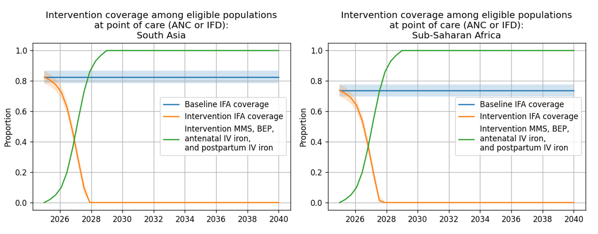
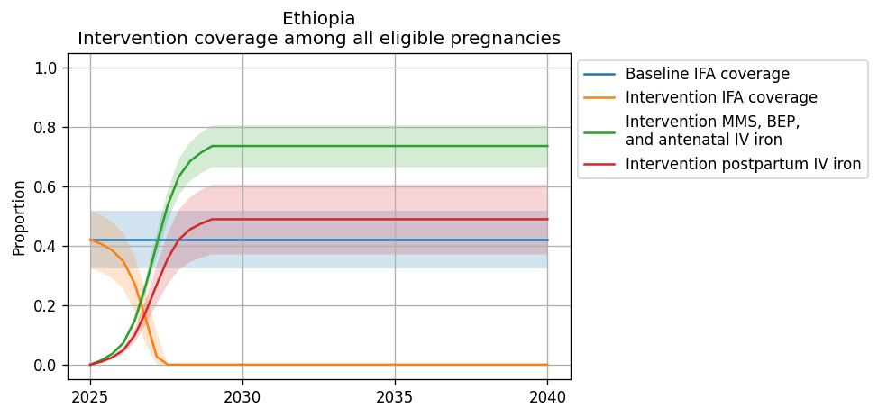
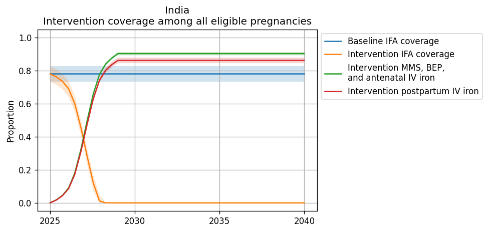
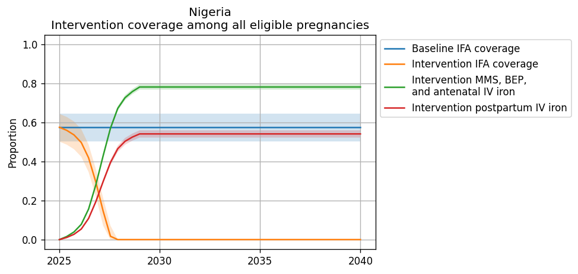

.. role:: underline
    :class: underline

..
  Section title decorators for this document:

  ==============
  Document Title
  ==============

  Section Level 1 (#.0)
  +++++++++++++++++++++

  Section Level 2 (#.#)
  ---------------------

  Section Level 3 (#.#.#)
  ~~~~~~~~~~~~~~~~~~~~~~~

  Section Level 4
  ^^^^^^^^^^^^^^^

  Section Level 5
  '''''''''''''''

  The depth of each section level is determined by the order in which each
  decorator is encountered below. If you need an even deeper section level, just
  choose a new decorator symbol from the list here:
  https://docutils.sourceforge.io/docs/ref/rst/restructuredtext.html#sections
  And then add it to the list of decorators above.

.. _2019_concept_model_vivarium_iv_iron:

===========================
Vivarium Intravenous Iron
===========================

This document is the overall page for the Intravenous Iron Intervention simulation and links to the following subpages included within the project:

.. toctree::
   :maxdepth: 2
   :glob:

   */concept_model*

Overview
+++++++++

.. contents::
  :local:

.. list-table:: Abbreviations
  :header-rows: 1

  * - Abbreviation
    - Definition
    - Note
  * - IV
    - Intravenous
    - 
  * - IDA
    - Iron deficiency anemia
    - 
  * - WRA
    - Women of reproductive age
    - 
  * - PLW
    - Pregnant and lactating women
    - 
  * - IFA
    - Iron and folic acid
    - 
  * - MMS
    - Multiple micronutrient supplementation
    - 
  * - BEP
    - Balanced energy protein
    - 
  * - BMGF
    - Bill and Melinda Gates Foundation
    - 
  * - ANC
    - Antenatal care
    - 
  * - IFD
    - In-facility delivery
    - 
  * - LMICs
    - Low and middle income countries
    - 

1.0 Background
++++++++++++++

.. note::

  Gendered terms such as "maternal disorders" and "pregnant/lactating women" are used throughout this document as the existing terminology in the GBD and other literature sources rely on such terms. However, we acknowledge that not all pregnant individuals identify as female and we are working to incorporate more inclusive language such as pregnant indiviudals/parents, chestfeeding, etc. Additionally, our simulation will rely on data specific to male/female sex without consideration of intersex individuals or gender differences, which is a limitation of our analysis.

Anemia, a condition defined by low blood hemoglobin concentration, is a significant cause of morbidity and mortality globally, particularly in low and middle income countries and in sub-Saharan Africa and south Asia. Iron deficiency is a common cause of anemia, although other conditions such as hemoglobinopathies may also contribute to the condition.

Pregnancy is a time of increased iron demands to meet the needs of fetal development. Anemia during pregnancy has several health consequences, including increased risk of adverse health outcomes for mother and child.

Iron supplementation during pregnancy can help meet the increased iron demands during this period and prevent and/or remediate iron deficiency anemia (IDA). However, for those who are severely anemic during pregnancy, intravenous (IV) iron can be a more effective strategy for resolving IDA. Additionally, anemia during the postpartum period also has potential health consequences for mother and child and postpartum IV iron may be beneficial to those who are severely anemic immediately following birth.

.. _iviron2.0:

2.0 Modeling aims and objectives
++++++++++++++++++++++++++++++++

**Objective:** Using the optimistic assumptions for the target product profiles from the Bill and Melinda Gates Foundation, estimate the cost effectiveness of a) IV iron use during pregnancy and b) IV iron use immediately postpartum under the following assumptions:

- Impact measured in terms of a) maternal anemia DALYs averted, and b) infant outcomes and stillbirths
- Assume no large-scale food fortification intervention. Comparator = routine anemia prevention/treatment in pregnancy and postpartum.
- Cost effectiveness estimates specific to all LMICs, disaggregated by region (separate estimates for South Asia and sub-Saharan Africa).

.. _iviron3.0:

3.0 Concept model
+++++++++++++++++

.. image:: concept_model_full.svg

The green components in the concept model represent those specific to the maternal population and the purple components represent those specific to the population of children under five.

.. _iviron3.1:

3.1 Simulation scenarios
------------------------

The following simulation scenarios apply to both the :ref:`women of reproductive age simulation <2019_concept_model_vivarium_iv_iron_maternal_sim>` and the :ref:`children under five simulation <2019_concept_model_vivarium_iv_iron_child_sim>`.

#. **Baseline:** baseline IFA coverage
#. **Oral iron:** MMS/BEP scale-up
#. **Antenatal IV iron:** MMS/BEP + antenatal IV iron scale-up
#. **Postpartum IV iron:** MMS/BEP + postpartum IV iron scale-up
#. **Antenatal and postpartum IV iron:** MMS/BEP + antenatal and postpartum IV iron scale-up

.. note::

  Scenario comparisons of interest to BMGF will be IV iron scenarios (antenatal IV iron, postpartum IV iron, antenatal + postpartum IV iron) relative to the oral iron scenario. However, all interventions will scale-up from baseline levels of intervention coverage.

`Intervention coverage for the modeled locations locations and each scenario can be found in the CSV file <https://github.com/ihmeuw/vivarium_research_iv_iron/blob/main/misc_investigations/simulation_intervention_coverage.csv>`_. NOTE: these values represent coverage of all *eligible* pregnancies (as described by each intervention model document) and are already scaled to the proportion of eligible pregnancies who attend ANC or IFD. For instance, for BEP coverage, the eligible population is pregnancies with a BMI < 18.5; therefore, the value in this file for BEP represents the proportion of all pregnancies under 18.5 that recieve BEP supplementation (which is a function of BEP coverage at ANC and the current rate of ANC coverage).

.. note::

  NOTE: these values may be updated if/when we recieve forecasted estimates for ANC and IFD values.

  The rate of intervention scale-up was determined by the intervention uptake curve from BMGF and supplemental input from Laura.

Figures representing intervention coverage among the eligible populations at point of care and among all pregnancies are shown in the figure panels below, respectively.

.. image:: intervention_coverage_all_pregnancies.PNG

.. _iviron3.2:

3.2 Simulation timeframe and intervention start dates
-----------------------------------------------------

Detailed in the :ref:`women of reproductive age simulation <2019_concept_model_vivarium_iv_iron_maternal_sim>` and the :ref:`children under five simulation <2019_concept_model_vivarium_iv_iron_child_sim>` pages.

.. _iviron4.0:

4.0 Vivarium modelling components
+++++++++++++++++++++++++++++++++

.. _iviron4.1:

4.1 Vivarium concept model diagram components
----------------------------------------------

Detailed in the :ref:`women of reproductive age simulation <2019_concept_model_vivarium_iv_iron_maternal_sim>` and the :ref:`children under five simulation <2019_concept_model_vivarium_iv_iron_child_sim>` pages.

.. _iviron4.2:

4.2 Demographics
----------------

4.2.1 Locations
~~~~~~~~~~~~~~~

Locations of interest to this project: 

- Sub-Saharan Africa (location_type=superregion; location_id=166)
- South Asia (location_type=region; location_id=159)
- Nigeria (location_type=national, location_id=214)
- India (location_type=national, location_id=163)
- Ethiopia (location_type=national, location_id=179)
- ON HOLD: All low and middle income countries (LMICs)

  - This simulation location does not have a corresponding GBD location ID. Rather, there are two location IDs that fall within this location of interest and together will make up the overall LMIC location (shown in the bullets below). We will run separate simulations for the following two location IDs and use the results from these simulations to produce summary level results during post-processing.

    - World bank lower middle income (location_type=region; location_id=44577)
    - World bank low income (location_type=region; location_id=44578)

National-level locations included in each of these locations of interest `can be found here <https://github.com/ihmeuw/vivarium_research_iv_iron/tree/main/locations>`_.

Location aggregation
^^^^^^^^^^^^^^^^^^^^^^

For GBD outcomes that do not have estimates available for the locations of interest, we will calculate aggregate weighted average estimates from the national estimates included in the regional locations of interest. Notably, for some parameters, we will want to weight to the size of the population of women of reproductive age and for others we will want to weight to the size of the pregnant population. Generally, the following steps should be followed:

#. Pull estimates specific to each national-level location_id included in the region of interest (can be found in .csv files linked above). NOTE: for modelled national locations, data for that country makes up 100% of the weight for that location.
#. Pull estimates of the relevant weighting unit for each national-level location_id included in the region of interest (weighting unit for each parameter is shown in the table below)
#. At the draw-level, caclulate a weighted average estimate across all national locations within the region of interest, like so:

.. math::

  estimate_\text{regional} = \frac{\sum_{n=1}^{n} \text{weighting unit value}_\text{national} * estimate_\text{national}}{\sum_{n=1}^{n} \text{weighting unit value}_\text{national}}

Details on how to calculate weighted averages for specific simulation parameters are shown on the :ref:`women of reproductive age simulation <2019_concept_model_vivarium_iv_iron_maternal_sim>` and the :ref:`children under five simulation <2019_concept_model_vivarium_iv_iron_child_sim>` pages.

Expanding to additional locations
^^^^^^^^^^^^^^^^^^^^^^^^^^^^^^^^^

As new locations are added to this model, there are several data values that need to be updated in the artifact in addition to standard GBD data updates. These calculations are performed in the `vivarium_research_iv_iron repository <https://github.com/ihmeuw/vivarium_research_iv_iron>`_  and include:

- Weights used in calculation of the below values
  
  - `Calculation performed in this notebook <https://github.com/ihmeuw/vivarium_research_iv_iron/blob/main/parameter_aggregation/Generate%20weights.ipynb>`_

- Hemoglobin validation targets
 
  - `Done for prevalence here <https://github.com/ihmeuw/vivarium_research_iv_iron/blob/main/hgb_validation_targets/Generate%20validation%20targets.ipynb>`_. Note that the anemia prevalence .csv file is too large to store in git, so it will have to be generated locally - this file has been added to .gitignore, but be sure not to commit similar files to avoid git issues.
 
  - `Done for YLDs here <https://github.com/ihmeuw/vivarium_research_iv_iron/blob/main/hgb_validation_targets/YLD%20validation%20targets.ipynb>`_

- Hemoglobin fraction under 100 g/L

  - `Hemoglobin fraction under 100 g/L calculation notebook found here <https://github.com/ihmeuw/vivarium_research_iv_iron/blob/main/parameter_aggregation/aggregated_hgb_below_100.ipynb>`_

  - For maternal model use: `Age-specific hemoglobin fraction under 100 g/L data available here <https://github.com/ihmeuw/vivarium_research_iv_iron/blob/main/parameter_aggregation/pregnant_proportion_with_hgb_below_100_age_specific.csv>`_

  - For child model use: `Non-age-specific hemoglobin fraction under 100 g/L data available here <https://github.com/ihmeuw/vivarium_research_iv_iron/blob/main/parameter_aggregation/pregnant_proportion_with_hgb_below_100.csv>`_

- Hemoglobin fraction under 70 g/L

  - `Hemoglobin fraction under 70 g/L calculation notebook found here <https://github.com/ihmeuw/vivarium_research_iv_iron/blob/main/parameter_aggregation/aggregated_hgb_below_70.ipynb>`_

  - `Hemoglobin fraction under 70 g/L data avilable here <https://github.com/ihmeuw/vivarium_research_iv_iron/blob/main/parameter_aggregation/pregnant_proportion_with_hgb_below_700_age_specific.csv>`_

- BMI fractions under 18.5 (stratified by hemoglobin level)

  - `BMI exposure calculation performed here <https://github.com/ihmeuw/vivarium_research_iv_iron/blob/main/misc_investigations/BMI%20and%20anemia%20exposure.ipynb>`_. Note that the ensemble distribution functions take some time, so it is preferred not to rerun locations that have data generated already.

  - Age-specific values for maternal model use: 

    - `Age-specific BMI exposure given low hemoglobin data available here <https://github.com/ihmeuw/vivarium_research_iv_iron/blob/main/misc_investigations/prevalence_of_low_bmi_given_hemoglobin_below_10.csv>`_

    - `Age-specific BMI exposure given high hemoglobin data available here <https://github.com/ihmeuw/vivarium_research_iv_iron/blob/main/misc_investigations/prevalence_of_low_bmi_given_hemoglobin_above_10.csv>`_

  - Non-age-specific values for child model use: 

    - `BMI exposure given low hemoglobin data available here <https://github.com/ihmeuw/vivarium_research_iv_iron/blob/main/misc_investigations/prevalence_of_low_bmi_given_hemoglobin_below_10_age_weighted.csv>`_

    - `BMI exposure given high hemoglobin data available here <https://github.com/ihmeuw/vivarium_research_iv_iron/blob/main/misc_investigations/prevalence_of_low_bmi_given_hemoglobin_above_10_age_weighted.csv>`_

- Hemoglobin on maternal disorders PAF

  - `Notebook for PAF calculation and PAF data available in this folder <https://github.com/ihmeuw/vivarium_research_iv_iron/tree/main/parameter_aggregation/hemoglobin_maternal_disorder_pafs>`_. Note that this is a resource-intensive computation, but it has already been performed for each national location within the Sub-Saharan Africa and South Asia locations. Otherwise, a potential solution to reduce computational intensity is to perform the calculation for a subset of randomly selected draws to be used in the simulation.

- ANC and IFD estimates (used in the calculation of intervention coverage below)

  - `Calculation performed here <https://github.com/ihmeuw/vivarium_research_iv_iron/blob/main/parameter_aggregation/Aggregation%20of%20ANC%20and%20IFD.ipynb>`_

- Intervention coverage values

  - `Intervention coverage calculation performed here <https://github.com/ihmeuw/vivarium_research_iv_iron/blob/main/misc_investigations/Intervention%20coverage%20values.ipynb>`_

  - `Intervention coverage data avilable here <https://github.com/ihmeuw/vivarium_research_iv_iron/blob/main/misc_investigations/simulation_intervention_coverage.csv>`_

- Sex ratio values

  - `Sex ratio calculation performed here <https://github.com/ihmeuw/vivarium_research_iv_iron/blob/main/parameter_aggregation/Aggregation%20of%20sex%20ratio%20by%20birth.ipynb>`_

.. _iviron5.0:

5.0 Model run requests
+++++++++++++++++++++++++++++++++++++

.. list-table:: Model run plan as of September 28, 2022
  :header-rows: 1

  * - Number
    - Run
    - Status
    - Priority
    - Number of draws
    - Population size per draw
    - Note
  * - 1
    - Wave I India maternal
    - Complete
    - N/A
    - 25
    - 600,000
    - 
  * - 2
    - Wave I Nigeria maternal
    - Complete
    - N/A
    - 25
    - 600,000
    - 
  * - 3
    - Wave I Ethiopia maternal
    - Complete
    - N/A
    - 25
    - 600,000
    - 
  * - 4
    - Wave I India child
    - Complete
    - N/A
    - 25
    - 600,000
    - 
  * - 5
    - Wave I Ethiopia child
    - Complete
    - N/A
    - 25
    - 600,000
    - 
  * - 6
    - Wave I Nigeria child
    - Complete
    - N/A
    - 25
    - 600,000
    - 
  * - 7
    - Wave I SSA maternal
    - Complete
    - N/A
    - 25
    - 600,000
    - 
  * - 8
    - Wave I SA maternal
    - Complete
    - N/A
    - 25
    - 600,000
    - 
  * - 9
    - Wave I SSA child
    - Complete
    - N/A
    - 25
    - 600,000
    - 
  * - 10
    - Wave I SA child
    - Complete
    - N/A
    - 25
    - 600,000
    - 
  * - 11
    - Wave II India maternal
    - Complete
    - N/A
    - 25
    - 600,000
    - Completed as part of extra jobs ran for wave I India maternal.
  * - 12
    - Wave II Nigeria maternal
    - Complete
    - N/A
    - 25
    - 600,000
    - 
  * - 13
    - Wave II Ethiopia maternal
    - Complete
    - N/A
    - 25
    - 600,000
    - 
  * - 14
    - Wave II India child
    - Complete
    - N/A
    - 25
    - 600,000
    - 
  * - 15
    - Wave II Ethiopia child
    - Complete
    - N/A
    - 25
    - 600,000
    - 
  * - 16
    - Wave II Nigeria child
    - Complete
    - N/A
    - 25
    - 600,000
    - 
  * - 17
    - Wave II SSA maternal
    - Complete
    - N/A
    - 25
    - 600,000
    - 
  * - 18
    - Wave II SA maternal
    - Complete
    - N/A
    - 25
    - 600,000
    - 
  * - 19
    - Wave II SSA child
    - Complete
    - N/A
    - 25
    - 600,000
    - 
  * - 20 
    - Wave II SA child
    - Complete
    - N/A
    - 25
    - 600,000
    - 

.. _iviron6.0:

6.0 Limitations
+++++++++++++++

In addition to the assumptions and limitations listed in each of the pages included in the `4.1 Vivarium concept model diagram components`_ section, our simulation is also subject to the following assumptions and limitations:

#. Our simulation is run at the regional level and does not consider sub-regional heterogeneity.
#. We do not model a distinction between iron-deficiency anemia and other types of anemia. Therefore, we may overestimate the number of individuals whose hemoglobin levels respond to our interventions, which may also vary by modeled location.
#. We do not directly model access to care among our simulated population nor any of its correlates.
#. We do not consider outcomes affected by the intervention other than those that act through maternal hemoglobin and infant birthweight. However, the maternal supplementation intervention may also have impacts on additional outcomes that we do not consider such as maternal malnourishment (including micronutrient deficiencies as well as maternal underweight). This may cause us to overestimate DALYs in our alternative scenarios.

7.0 References
+++++++++++++++

