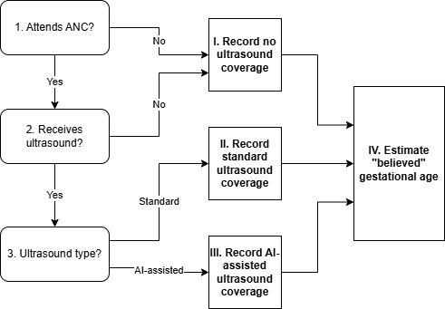

.. role:: underline
    :class: underline

..
  Section title decorators for this document:

  ==============
  Document Title
  ==============

  Section Level 1 (#.0)
  +++++++++++++++++++++

  Section Level 2 (#.#)
  ---------------------

  Section Level 3 (#.#.#)
  ~~~~~~~~~~~~~~~~~~~~~~~

  Section Level 4
  ^^^^^^^^^^^^^^^

  Section Level 5
  '''''''''''''''

  The depth of each section level is determined by the order in which each
  decorator is encountered below. If you need an even deeper section level, just
  choose a new decorator symbol from the list here:
  https://docutils.sourceforge.io/docs/ref/rst/restructuredtext.html#sections
  And then add it to the list of decorators above.

.. _2024_vivarium_mncnh_portfolio_ai_ultrasound_module:

======================================
AI Ultrasound Module
======================================

.. contents::
  :local:
  :depth: 2

1.0 Overview
++++++++++++

This module assesses whether a simulant receives an ultrasound during antenatal care, tracks the details of that care, and outputs a "believed" gestational age for that simulant based on the simulant's real gestational age and the measurement error of the gestational age dating care they recieved. Notably, coverage and type of ultrasounds offered at ANC visits will be scenario-dependent.

2.0 Module Diagram and Data
+++++++++++++++++++++++++++++++

2.1 Module Diagram
----------------------

2.2 Module Inputs
---------------------

.. list-table:: Module required inputs
  :header-rows: 1

  * - Input
    - Source module
    - Application
    - Note
  * - ANC attendance
    - :ref:`Antenatal care module <2024_vivarium_mncnh_portfolio_anc_module>`
    - Decision node 1
    - True/False value for each simulant
  * - Gestational age
    - :ref:`Pregnancy module <2024_vivarium_mncnh_portfolio_pregnancy_module>`
    - Action point IV
    - Point value in days

.. todo::

  Determine if partial term pregnancies are totally excluded from this decision tree or if we should use pregnancy duration instead of gestational age here

2.3 Module Decision Nodes
-----------------------------

.. list-table:: Module decision nodes
  :header-rows: 1

  * - Decision node
    - Description
    - Information
    - Note
  * - 1
    - Attends ANC?
    - Input from antenatal care module (True/False for each simulant)
    - 
  * - 2
    - Receives ultrasound?
    - Scenario-dependent variable: see the :ref:`pregnancy component scenario table <MNCNH pregnancy component scenario table>` for values
    - "Yes" if random propensity <= scenario-specific ultrasound coverage defined in table
  * - 3
    - Ultrasound type?
    - Scenario-dependent variable: :ref:`pregnancy component scenario table <MNCNH pregnancy component scenario table>` for values
    - 

2.4 Module Action Points
---------------------------

.. list-table:: Module action point
  :header-rows: 1

  * - Action point
    - Description
    - Information
    - Note
  * - I
    - Record :code:`none` ultrasound coverage 
    - Record to output A
    - 
  * - II
    - Record :code:`standard` ultrasound coverage
    - Record to output A
    - 
  * - III
    - Record :code:`ai_assisted` ultrasound coverage
    - Record to output A
    - 
  * - IV
    - Estimate "believed" gestational age
    - See instructions below and record to output B
    - 

2.4.1 Estimation of "belived" gestational age
+++++++++++++++++++++++++++++++++++++++++++++++

"Believed" gestational age should be estimated by adding a randomly sampled value from a normal distribution with a mean of zero and a standard deviation defined below to the simulant's assigned gestational age at birth exposure (input from the pregnancy module).

.. list-table:: Standard deviation values by ultrasound type
  :header-rows: 1

  * - Ultrasound type
    - Standard deviation
  * - None
    - 45.5 days
  * - Standard
    - 20 days
  * - AI-assisted ultrasound
    - 5 days

.. note::
  
   Need further clarification on outstanding questions from BMGF, see `PR comments <https://github.com/ihmeuw/vivarium_research/pull/1525>`_. `Standard deviation value for no ultrasound <https://journals.plos.org/plosone/article?id=10.1371/journal.pone.0272718#sec007>`_.

   Values should be confirmed with further research and data anlaysis

2.5: Module Outputs
-----------------------

.. list-table:: Module outputs
  :header-rows: 1

  * - Output
    - Value
    - Note
  * - A. Ultrasound coverage
    - *none* / *standard* / *AI-assisted*
    - Used for V&V and for estimation of output B
  * - B. "Believed" gestational age
    - Point values in days
    - Used for V&V and facility choice module of intrapartum component

3.0 Assumptions and limitations
++++++++++++++++++++++++++++++++

* The timing of ANC visits impacts the ability to accurately estimate gestational age, but we use an average instead. 
* The current version of the model does not include any false positive rates for pre-term or LBW. Since a false positive is unlikely to cause harm, only inclusion in higher level care, this seems sufficient. 
* Single cohort of pregnancies does not allow for cyclic effects such as improved ANC visit rates due to ultrasound presence 

4.0 Verification and Validation Criteria
+++++++++++++++++++++++++++++++++++++++++

* Confirm ANC visit rate matches expectations 
* Confirm ultrasound rates matches inputs for all scenarios 
* Confirm gestational age estimate and real gestational age have the correct margin of error based on ultrasound type 

5.0 References
+++++++++++++++

