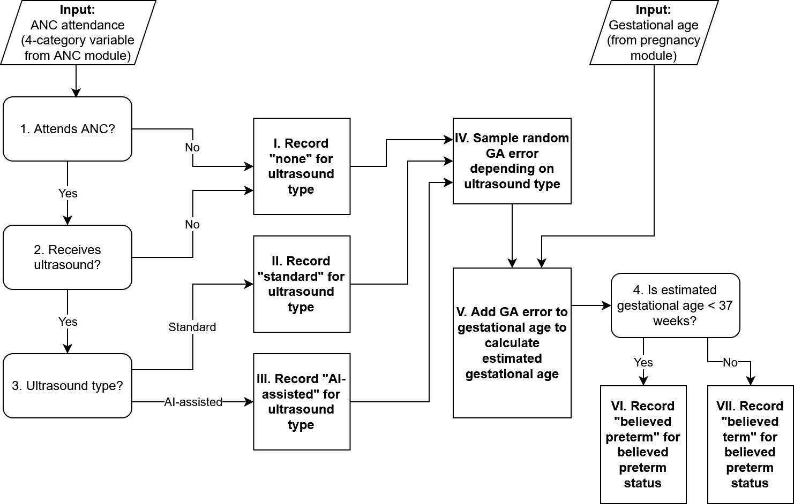

.. role:: underline
    :class: underline

..
  Section title decorators for this document:

  ==============
  Document Title
  ==============

  Section Level 1 (#.0)
  +++++++++++++++++++++

  Section Level 2 (#.#)
  ---------------------

  Section Level 3 (#.#.#)
  ~~~~~~~~~~~~~~~~~~~~~~~

  Section Level 4
  ^^^^^^^^^^^^^^^

  Section Level 5
  '''''''''''''''

  The depth of each section level is determined by the order in which each
  decorator is encountered below. If you need an even deeper section level, just
  choose a new decorator symbol from the list here:
  https://docutils.sourceforge.io/docs/ref/rst/restructuredtext.html#sections
  And then add it to the list of decorators above.

.. _2024_vivarium_mncnh_portfolio_ai_ultrasound_module:

======================================
AI Ultrasound Module
======================================

.. contents::
  :local:

1.0 Overview
++++++++++++

This module assesses whether a simulant receives an ultrasound during a specific antenatal care visit, tracks the details of that care, and outputs a "believed" gestational age at the end of pregnancy for that simulant based on the simulant's real gestational age at the end of pregnancy and the measurement error specific to the timing and type of gestational age dating care they received. Notably, coverage and type of ultrasounds offered at ANC visits will be scenario-dependent.

1.1 Gestational Age Dating Research Background
----------------------------------------------

Gestational age dating is a key component of antenatal care as it informs which services are 
rendered when (ex: intermittent preventative treatment for malaria should not be administered 
before 20 weeks of gestation and is recommended monthly thereafter) and pregnancy due date 
which can be used to identify preterm labor or pregnancies of advanced gestational age (>42 
weeks) that may indicate specific medical attention.

In the field of obstetrics, gestational age is expressed in terms of time elapsed from the 
first day of the last menstrual period (LMP) prior to conception under the assumption of a 
regular 28 day cycle with ovulation occurring on day 14 of the cycle (even for pregnancies in 
which these assumptions are known not to hold!). Pregnancy due dates are 40 weeks (280 days) 
after the first day of the last menstrual period under these assumptions.

Gestational age can be assessed in pregnancy according to several methods, including 
ultrasound, last menstrual period date, and fundal height measurement. Gestational age at 
birth can also be assessed according to characteristics of the newborn. Each method varies in 
its accuracy and utilization of these methods will vary based on availability and timing with 
which gestational age is assessed. A summary of these methods is included below.

1.1.1 Method overviews
~~~~~~~~~~~~~~~~~~~~~~~

Ultrasound
^^^^^^^^^^^^^

Ultrasound is a technology that uses sound waves to create images of a fetus. Gestational age 
can be informed via ultrasound by measuring fetal size and using that to inform the maturity 
of the fetus. GA dating via ultrasound is more accurate in the first trimester when there is 
less variation in fetal size by gestational age, as later in pregnancy factors like 
intrauterine growth restriction may cause a fetus to be small for their gestational age 
making it more difficult to assess gestational age based on fetal size. Early ultrasounds 
measure crown-rump length (CRL) and mean sac diameter (MSD) to inform gestational age. Later 
pregnancy ultrasounds use additional measurements such as biparietal diameter, head 
circumference, femur length, and abdominal circumference to assess gestational age.

Ultrasound gestational age dating performed in the first trimester is typically considered 
the gold standard method in gestational age dating.

Last menstrual period
^^^^^^^^^^^^^^^^^^^^^^^

Gestational age dating by LMP is limited for several reasons, outlined below:
- Some women may not have experienced a recent LMP due to becoming pregnant following amenorrhea induced by lactation, birth control, or some other cause
- Recall bias
- Many menstrual cycles will deviate from the assumption of ovulation occurring 14 days after the first day of a menstrual period (meaning a fetus may be more or less mature than the perfectly recalled LMP date would imply)

LMP dating is often considered to be reliable under the following conditions:
- It can be reported 
- Reporter is "certain" of LMP date
- Reporter has regular cycles

Studies on LMP's accuracy relative to first trimester ultrasound indicate that there is a 
greater magnitude of error in gestational age assessment and also tends to be a systematic 
bias that underestimates gestational age (increases the likelihood of believed preterm status 
among truly term pregnancies). As summarized in [Rittenhouse-et-al-2019]_ (see paper for 
embedded references):

  "Limitations of LMP as a dating method are well-documented.[9] Women with lower educational 
  attainment[9, 36] and later presentation to care[8, 37] tend to have less accurate recall 
  of LMP, and the measure is subject to number preference (e.g. rounding to zero or five, or 
  preference for 1st or 10th of month) and recall bias.[9, 10] Consequently, GA estimates by 
  LMP alone suffer imprecision, with some estimates differing by weeks when compared to 
  ultrasound.[38–41] Indeed, data from the Zambia Perinatal Record System, an electronic 
  system that captured more than 250,000 births over a 6 year period in Lusaka, suggests an 
  impossibly high preterm birth rate of 35% when LMP is used to determine GA.[11, 42, 43] "

  Additionally, as summarized by [Moore-et-al-2019]_, "LMP is less well recalled in late 
  attenders [16–19], and determination of LMP can be impeded by low literacy rates and 
  cultural factors [7,8]."

Furthermore, there are reports that LMP dates cannot be reported in significant portions of 
pregnancies in LMIC settings. See the following references:

- `More than two thirds of pregnancies assessed in a refugee camp on the Thai–Burmese border could not report an LMP date due to illiteracy and unfamiliarity with the Gregorian calendar <https://pmc-ncbi-nlm-nih-gov.offcampus.lib.washington.edu/articles/PMC3438883/>`__
- `Approximately 25% of women in a South African study were not able to report an LMP date. Of those who did report, 67.2% felt certain about the date. <- https://obgyn-onlinelibrary-wiley-com.offcampus.lib.washington.edu/doi/10.1111/jog.13801>`__
- `8.3% of women in a Nigerian study could not report the date of their LMP <https://journalijtdh.com/index.php/IJTDH/article/view/536>`__
- `At the time of birth, it was reported that only 45% of women presenting to a hospital in Ethiopia recalled their LMP date <chrome-extension://efaidnbmnnnibpcajpcglclefindmkaj/https://ecronicon.net/assets/ecgy/pdf/ECGY-08-00438.pdf`__

.. todo::

  Perform a more targeted search for data on the proportion of pregnancies with unknown LMP 
  dates in LMIC settings, preferably specific to time of assessment. We should extract at 
  least the following information for such studies:

  - Country
  - Study size
  - Population description
  - Timing of assessment
  - Details of LMP recall (ex: attendant-assisted recall, prospective vs. retrospective, etc.)
  - Definition of "unknown", "unreliable", or "uncertain"
  - Proportion of pregnancies classified as unknown/unreliable/uncertain

.. warning::

  Many studies that compare LMP gestational age dating accuracy to other methods have 
  inclusion criteria of "reliable" or "certain" LMP estimates, meaning that the LMP accuracy 
  in these studies will be overestimated relative to its actual use. We should be careful in 
  evaluating the inclusion/exclusion criteria of studies that assess LMP gestational age 
  dating accuracy.

  Additionally, prospectively collected menstrual period dates (via calendar tracking or 
  tracking via an app) will be more accurate than retrospectively collected LMP dates due to 
  recall bias. Given the differential practices around prospective tracking (due to 
  differential availability of apps and/or cultural differences) between high and low 
  resource settings, we should aim to have the accuracy of LMP GA dating informed from 
  studies performed in populations similar to the ones we are modeling.

Fundal height measurements
^^^^^^^^^^^^^^^^^^^^^^^^^^^^

Measurements of fundal height, the distance between the pubic bone and umbillicus can be used 
to approximate fetal growth after 20 weeks of gestation, with an expected centimeter for 
every week of gestational age (27 cm for 27 weeks, for example). This method is limited in 
that it cannot distinguish between variation in fetal size due to variation in gestational 
age or factors that cause small for gestational age (like intrauterine growth restriction). 
It is additionally limited in that it may vary due to differences in maternal stature and 
becomes less reliable in late pregnancy when the fetus "drops" into the pelvis 
("lightening"), usually 2-4 weeks before labor. It is also subject to measurement error due 
to provider skill and resources (it is reported to be measured with fingers if measuring 
tapes are not available).

Newborn assessment
^^^^^^^^^^^^^^^^^^^

In cases in which a reliable estimate of gestational age is not available at the onset of 
labor, gestational age at birth can be assessed by evaluating the newborn according to 
physical and neuromuscular signs. The New Ballard and Dubowitz scoring systems are a 
measurement tools meant to be performed in the first hours after birth that can estimate a 
neonate's maturity and distinguish between small for gestational age term infants from truly 
preterm infants [Lee-et-al-2017]_.

1.1.2 Clinical practice overview
~~~~~~~~~~~~~~~~~~~~~~~~~~~~~~~~~~~~

The WHO recommends that all pregnancies undergo at least one ultrasound for identification of 
certain complications as well as gestational age dating. However, ultrasound technology is 
not available at all ANC visits across LMICs. Additionally, ANC attendance during the first 
trimester when US GA dating is most accurate is low in LMICs. Therefore, LMP is commonly used 
to assess gestational age. ANC attendants often assist in recall of LMP dates by consulting a 
calendar and prompting the recall of events with known dates that occurred around the same 
time. In instances when LMP is unknown and ultrasound is unavailable, fundal height 
measurements will be used to assess gestational age (as reported as common practice in Kenya 
in [Oluoch-et-al-2015]_).

1.2 Modeling stratey overview
---------------------------------

Our modeling strategy will follow the steps below:

#. Assess *when* during a pregnancy gestational age dating occurs. We assume this occurs at their first ANC visit or at the onset of labor for simulants who do not attend ANC
#. Determine whether the simulant has a "reliable" or "unreliable" LMP date based on the assumed probabilities specific to the trimester in which gestational age dating occurs for that simulant.
#. Assess the method by which gestational age is dated for a given simulant based on the timing of their GA dating as well as reliability of their LMP date
#. Ascertain their "believed" gestational age at birth according to the measurement error associated with the simulant's GA dating method and timing as well as the simulant's underlying "true" gestational age at birth exposure

We will assume pregnancies are dated by the method specified in the table below, conditional 
on the level of ANC care received for a given simulant as well as whether the simulant has a 
"reliable" LMP date. We will determine whether a simulant's LMP date is "unreliable" 
according to the following probabilities that increase as time has elapsed from the LMP. 
Simulants who attend their first ANC visit in the first trimester will be subject to the 
first trimester rate, those who attend their first ANC visit in the second trimester will be 
subject to the second trimester rate, and those who do not attend ANC until the third 
trimester or who do not attend ANC at all will be subject to the 3rd trimester rate.

.. todo::

  Finalize the following values based on information obtained from literature search. The following values are a rough starting point based on the literature found so far

  - First trimester ANC 8% [Nigerian study, <20 weeks at time of assessment]
  - Second trimester ANC 25% [South African study... midpoint?]
  - Third trimester ANC 55% [Ethiopian study at labor presentation]

  ^Note this is among "care attenders"... generalizing to the no ANC population will likely underestimate given that this is positively associated with low SES/low educational attainment

.. list-table::
  :header-rows: 1

  * - ANC care
    - Reliable LMP
    - Unreliable LMP
  * - 1st trimester US
    - US (with 1st trimester accuracy)
    - US (with 1st trimester accuracy)
  * - 2nd trimester US
    - US (with 2nd trimester accuracy)
    - US (with 2nd trimester accuracy)
  * - Third trimester US
    - LMP (potentially with trimester-specific accuracy) 
    - US (with 3rd trimester accuracy)
  * - No US, ANC
    - LMP (potentially with trimester-specific accuracy)
    - Fundal height
  * - No ANC
    - LMP (potentially with trimester-specific accuracy)
    - Prenatal assessment: ??? undefined or some very large value?
      Postnatal assessment: neonatal assessment?? 

.. note::

  The New Ballard score postnatal assessment varies from all other methods. It can be used to 
  influence access to neonatal interventions including CPAP and neonatal probiotics for 
  preterm infants. However, it should not be used to influence the facility choice module or 
  determine access to ACS during labor.

.. todo::

  Finalize gestational age dating accuracy data seeking for the following GA assessment methods:

    - US in first trimester
    - US in second trimester
    - US in third trimester
    - LMP among subjects with known/reliable/certain date
    - LMP among all subjects
    - LMP among subjects with uncertain/unreliable date
    - Fundal height
    - Neonatal assessments like the New Ballard Score

  For each study that evaluates the accuracy of LMP GA dating, we should extract at least the following characteristics of each study:

    - Country
    - Study population size
    - Study population description
    - Study population inclusion/exclusion criteria, with specific focus on whether subjects with unknown/unreliable LMP dates were excluded
    - Timing of GA assessment
    - Details of assessment (for LMP: attendant-assisted recall, prospective or retrospective collection, etc.)
    - Magnitude of bias in GA measured in weeks (mean difference in GA relative to alternate method) and/or on preterm birth classification (OR or RR on PTB prevalence relative to alternate method)
    - Magnitude of error in GA measurement in weeks (standard deviation/error or +/- interval) and/or on preterm birth classification (sensitivity/specificity)

  Note that we should restrict our search to LMICs/resource-limited settings for LMP studies. The remaining methods should have a preference for LMIC settings, but may be expanded to other locations as necessary.

2.0 Module Diagram and Data
+++++++++++++++++++++++++++++++

.. todo:: 

  Update the following content to be compatible with updated modeling strategy

2.1 Module Diagram
----------------------

2.2 Module Inputs
---------------------

.. list-table:: Module required inputs
  :header-rows: 1

  * - Input
    - Source module
    - Application
    - Note
  * - ANC attendance category
    - :ref:`Antenatal care module <2024_vivarium_mncnh_portfolio_anc_module>`
    - Decision node 1
    - 4-category exposure variable.  As described in the :ref:`facility
      choice model document
      <2024_facility_model_vivarium_mncnh_portfolio>`, ANC attendance is
      correlated with other model variables.
  * - Gestational age at end of pregnancy (intervention modified)
    - :ref:`Pregnancy module <2024_vivarium_mncnh_portfolio_pregnancy_module>`
    - Action point IV
    - Point value in days

2.3 Module Decision Nodes
-----------------------------

.. list-table:: Module decision nodes
  :header-rows: 1

  * - Decision node
    - Description
    - Information
    - Note
  * - 1
    - Attends ANC at any point in pregnancy?
    - Decide "No" if ANC attendance
      category is *none*; decide "Yes" otherwise
    - ANC attendance has four exposure categories: The *none* category
      corresponds to no ANC attendance, while the other three categories
      indicate some ANC attendance
  * - 2
    - Receives ultrasound?
    - Scenario-dependent variable: see the :ref:`pregnancy component scenario table <MNCNH pregnancy component scenario table>` for values (and baseline coverage section below for baseline coverage)
    - "Yes" if random propensity <= scenario-specific ultrasound coverage defined in table
  * - 3
    - Ultrasound type?
    - Scenario-dependent variable: :ref:`pregnancy component scenario table <MNCNH pregnancy component scenario table>` for values (and baseline coverage section below for baseline coverage)
    - Possible values are "none," "standard," and "AI-assisted"
  * - 4
    - Attends ANC during first trimester?
    - Decide "Yes" if ANC attendance category is ``first_trimester_only`` or ``first_trimester_and_later_pregnancy``. Decide "No" otherwise.
    - 
  * - 5
    - Is estimated gestational age < 37 weeks?
    - "Yes" or "No" depending on the estimated gestational age
      calculated in Action point IV
    -

2.3.1: Baseline coverage
~~~~~~~~~~~~~~~~~~~~~~~~~

We assume 100% of ultrasounds are standard (and 0% are AI-assisted) at baseline.  Baseline coverage of ultrasound among those who attend ANC:

.. list-table:: Baseline ultrasound coverage values
  :header-rows: 1

  * - Location
    - Value
    - Note
  * - Ethiopia
    - 60.7%
    - `Ethiopia ultrasound rate <https://www.ncbi.nlm.nih.gov/pmc/articles/PMC8905208/>`_
  * - Nigeria
    - 58.7%
    - `Nigeria ultrasound rate <https://www.researchgate.net/publication/51782476_Awareness_of_information_expectations_and_experiences_among_women_for_obstetric_sonography_in_a_south_east_Nigeria_population>`_ 
  * - Pakistan
    - 66.7%
    - `India ultrasound rate <https://dhsprogram.com/pubs/pdf/FR339/FR339.pdf>`_ (Table 8.12, averaged percentage of women attending ANC 1-3 times and 4+ times). we currently use ultrasound utilization rates derived from the India DHS 2015-2016 as an imperfect proxy that can hopefully be improved with further research

2.4 Module Action Points
---------------------------

.. list-table:: Module action point
  :header-rows: 1

  * - Action point
    - Description
    - Information
    - Note
  * - I
    - Record ultrasound type
    - Record "None", "Standard", or "AI-assisted" to output depending on responses to decision nodes 1, 2, and 3.
    - 
  * - II
    - Record ultrasound timing
    - Record "N/A", "First trimester", or "Later pregnancy" to output depending on responses to prior decision nodes
    - 
  * - III
    - Sample random error for estimated gestational age
    - GA error is normally distributed with mean 0 and standard
      deviation depending on ultrasound type, as specified in the table
      below
    - See instructions in section `2.4.1 Calculation of estimated
      gestational age`_ below
  * - IV
    - Calculate estimated gestational age
    - Add the random GA error from Action point III to the gestational
      age from the pregnancy module, and record to output
    - See instructions in section `2.4.1 Calculation of estimated
      gestational age`_ below
  * - V
    - Record believed preterm status
    - Record ``believed_term`` or ``believed_preterm`` to output depending on respond to decision node #5
    - Corresponds to estimated gestational age < 37 weeks

2.4.1 Calculation of estimated gestational age
~~~~~~~~~~~~~~~~~~~~~~~~~~~~~~~~~~~~~~~~~~~~~~~~~

Estimated gestational age should be calculated by adding a randomly sampled value from a normal distribution with a mean of zero and a standard deviation defined below to the simulant's assigned gestational age at birth exposure (input from the pregnancy module).

.. list-table:: Standard deviation values by ultrasound type
  :header-rows: 1

  * - Ultrasound type
    - Ultrasound timing
    - Standard deviation
    - Reference
  * - None
    - N/A
    - 10 days
    - 
  * - Standard
    - First trimester
    - 6.7 days
    - 
  * - Standard
    - Later pregnancy
    - XXX days
    - 
  * - AI-assisted ultrasound
    - First trimester
    - 5 days
    - 
  * - AI-assisted ultrasound
    - Later pregnancy
    - XXX days
    - 

.. note::

  The "Later pregnancy" ultrasound timing corresponds with our :ref:`Antenatal Care Attendance model <2024_vivarium_mncnh_portfolio_anc_module>` "later pregnancy visit." Attendance of the later pregnancy ANC visit is a dichotomous variable in our model that is True if a simulant attends an ANC visit at any time during their second or third trimester and false otherwise. Our model does not consider the timing or frequency with which ANC visits are attended in the second or third trimesters.

.. todo::

  Update values in the table above. The existing value for standard ultrasound represents 
  an average value across pregnancy rather than differential values based on timing of u
  ltrasound measurement. The data in this 
  `paper referenced below <https://obgyn.onlinelibrary.wiley.com/doi/10.1002/uog.15894>`__ 
  may be a good source for updating the GA estimation standard deviation to be specific to 
  trimester of measurement.

.. todo::

  Add references for these numbers. Here's the `notebook I used to
  get them
  <https://github.com/ihmeuw/vivarium_research_mncnh_portfolio/blob/main/facility_choice/2025_04_17a_investigate_ga_error.ipynb>`_,
  which includes the citations.

.. note::
  
   BMGF sent us data on the error distribution of ultrasound accuracy based on gestational age so we could make this more accurate. 
   (See first bullet in Limitations list below for more details.)

2.5: Module Outputs
-----------------------

.. list-table:: Module outputs
  :header-rows: 1

  * - Output
    - Value
    - Note
  * - Ultrasound type
    - ``none``, ``standard``, ``ai_assisted``
    - Used to inform Ultrasound Summary output. Not needed for direct observation.
  * - Ultrasound timing
    - ``N/A``, ``first_trimester``, ``later_pregnancy``
    - Used to inform Ultrasound Summary output. Not needed for direct observation.
  * - Ultrasound summary
    - ``none``, ``standard_first_trimester``, ``standard_later_pregnancy``, ``ai_assisted_first_trimester``, ``ai_assisted_later_pregnancy``
    - Desired categories to be observered. Note that collapsing in this way allows us to avoid unnecessary stratifications in our outputs while maintaining the ability to perform V&V on ultrasound timing.
  * - Estimated gestational age
    - Point values in days
    - Used for V&V, and determination of
      eligibility for antenatal corticosteroids
  * - Believed preterm status
    - "believed preterm" or "believed term"
    - Used for V&V and for facility choice module in intrapartum component

3.0 Assumptions and limitations
++++++++++++++++++++++++++++++++

* Single cohort of pregnancies does not allow for cyclic effects such as improved ANC visit rates due to ultrasound presence 
* The data for baseline ultrasound utilization at the ANC is non-ideal for all of the locations. Our data for Ethiopia is most aligned with the value we are trying to find, as it comes from `a paper that
  estimates ultrasound utilization at ANC <https://pmc.ncbi.nlm.nih.gov/articles/PMC8905208/>`_, in a specific municipality of Jimma in Ethiopia. For Nigeria, our literature value is less trustworthy, coming from a paper that reports the percentage of 
  study participants who had previously had an obstetric ultrasound. We were unable to find any value for Pakistan, instead using data from the India DHS 2015-2016 to inform our Pakistan ultrasound coverage.
  India is probably not a great proxy for Pakistan, as use of ultrasound technology in India is heavily regulated (`see here <https://pmc.ncbi.nlm.nih.gov/articles/PMC5441446/#:~:text=In%20an%20attempt%20to%20curb,to%20facilitate%20sex%E2%80%93selective%20abortions>`__).

.. todo::

  If more suitable baseline coverage data for standard ultrasound utilization at ANCs for Nigeria or Pakistan, we should use that data instead and update 
  this documentation accordingly.

.. note:: 
  BMGF sent us data on the error distribution of ultrasound accuracy based on gestational age so we should be able to address the first limitation.
  We also found `a paper <https://obgyn.onlinelibrary.wiley.com/doi/10.1002/uog.15894>`_ that estimated uncertainty of GA dating by ultrasound was 6–7 
  days at 14 weeks' gestation, 12–14 days at 26 weeks' gestation and > 14 days in the third trimester.

  From Nathaniel: 
  I think the gestational age in the BMGF data and the gestational age in the paper are actually referring to two different things, and we may want to take both types of variation into account:

  The BMGF microdata compares the gestational age at birth estimated by ultrasound (given at some unknown time during the pregnancy) with gestational age at birth estimated by last menstrual period (LMP).
  I think the paper compares the gestational age estimated by an ultrasound in late pregnancy at the time of the late ultrasound with the "true" gestational age at the time of the late ultrasound, determined 
  from a combination of LMP and an ultrasound early in the pregnancy.
  From the BMGF data, I was interested in seeing whether there was bias (nonzero 1st moment) or skew (nonzero 3rd moment) in the error distribution depending on the gestational age at birth. It looks like there is: 
  For babies born early, you're more likely to overestimate their gestational age, whereas for babies born late, you're more likely to underestimate their gestational age (that is, when using LMP vs. an ultrasound).

  From the literature, I'm interested in how the size of the variance (2nd moment) of the error changes with the timing of when the ultrasound is administered. We know that the variance is higher when the ultrasound 
  is given later in pregnancy, and the paper quantifies how much higher.

4.0 Verification and Validation Criteria
+++++++++++++++++++++++++++++++++++++++++

* Confirm ANC visit rate matches expectations 
* Confirm ultrasound rates matches inputs for all scenarios 
* Confirm that ratio between ultrasound timing categories matches the expected ratio between first trimester ANC attendance and later pregnancy only ANC attendance. More specifically, the following should be true ``standard_first_trimester / standard_later_pregnancy == ai_assisted_first_trimester / ai_assisted_later_pregnancy == (anc_first_trimester_only + anc_first_trimester_and_later_pregnancy) / anc_later_pregnancy_only``
* Confirm that ultrasounds performed in the first trimester occur only among those who attend ANC in the first trimester according to their ANC attendance category (and likewise for later pregnancy)
* Confirm gestational age estimate and real gestational age have the correct margin of error based on ultrasound type and timing

5.0 References
+++++++++++++++

.. [Oluoch-et-al-2015]

  `Oluoch DA, Mwangome N, Kemp B, Seale AC, Koech A, Papageorghiou AT, Berkley JA, Kennedy SH, Jones CO. "You cannot know if it's a baby or not a baby": uptake, provision and perceptions of antenatal care and routine antenatal ultrasound scanning in rural Kenya. BMC Pregnancy Childbirth. 2015 May 29;15:127. doi: 10.1186/s12884-015-0565-5. PMID: 26021564; PMCID: PMC4446960. <https://pmc-ncbi-nlm-nih-gov.offcampus.lib.washington.edu/articles/PMC4446960/
  >`__

.. [Lee-et-al-2017]

  `Lee AC, Panchal P, Folger L, Whelan H, Whelan R, Rosner B, Blencowe H, Lawn JE. Diagnostic Accuracy of Neonatal Assessment for Gestational Age Determination: A Systematic Review. Pediatrics. 2017 Dec;140(6):e20171423. doi: 10.1542/peds.2017-1423. Epub 2017 Nov 17. PMID: 29150458. <https://pubmed-ncbi-nlm-nih-gov.offcampus.lib.washington.edu/29150458/>`__

.. [Rittenhouse-et-al-2019]

  `Rittenhouse KJ, Vwalika B, Keil A, Winston J, Stoner M, Price JT, Kapasa M, Mubambe M, Banda V, Muunga W, Stringer JSA. Improving preterm newborn identification in low-resource settings with machine learning. PLoS One. 2019 Feb 27;14(2):e0198919. doi: 10.1371/journal.pone.0198919. PMID: 30811399; PMCID: PMC6392324. <https://pmc-ncbi-nlm-nih-gov.offcampus.lib.washington.edu/articles/PMC6392324/>`__

.. [Moore-et-al-2015]

  `Moore KA, Simpson JA, Thomas KH, Rijken MJ, White LJ, Dwell SL, Paw MK, Wiladphaingern J, Pukrittayakamee S, Nosten F, Fowkes FJ, McGready R. Estimating Gestational Age in Late Presenters to Antenatal Care in a Resource-Limited Setting on the Thai-Myanmar Border. PLoS One. 2015 Jun 26;10(6):e0131025. doi: 10.1371/journal.pone.0131025. PMID: 26114295; PMCID: PMC4482646. < https://pmc-ncbi-nlm-nih-gov.offcampus.lib.washington.edu/articles/PMC4482646/>`__