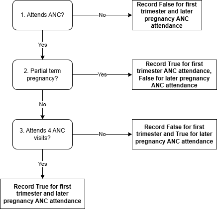

.. role:: underline
    :class: underline

..
  Section title decorators for this document:

  ==============
  Document Title
  ==============

  Section Level 1 (#.0)
  +++++++++++++++++++++

  Section Level 2 (#.#)
  ---------------------

  Section Level 3 (#.#.#)
  ~~~~~~~~~~~~~~~~~~~~~~~

  Section Level 4
  ^^^^^^^^^^^^^^^

  Section Level 5
  '''''''''''''''

  The depth of each section level is determined by the order in which each
  decorator is encountered below. If you need an even deeper section level, just
  choose a new decorator symbol from the list here:
  https://docutils.sourceforge.io/docs/ref/rst/restructuredtext.html#sections
  And then add it to the list of decorators above.

.. _2024_vivarium_mncnh_portfolio_anc_detail_module:

======================================
Antenatal care detail module
======================================

.. contents::
  :local:
  :depth: 2

1.0 Overview
++++++++++++

This module builds upon the :ref:`antenatal care attendance module <2024_vivarium_mncnh_portfolio_anc_module>` that determines whether or not a simulant attends an ANC visit at any point during pregnancy and additionally determines the frequency and timing of those visits.

2.0 Module Diagram and Data
+++++++++++++++++++++++++++++++

2.1 Module Diagram
----------------------

2.2 Module Inputs
---------------------

.. list-table:: Module required inputs
  :header-rows: 1

  * - Input
    - Source module
    - Application
    - Note
  * - ANC attendance
    - :ref:`ANC attendance module <2024_vivarium_mncnh_portfolio_anc_module>`
    - Used to determine answer to decision node #1
    - 
  * - Pregnancy term duration
    - :ref:`Pregnancy I <2024_vivarium_mncnh_portfolio_pregnancy_module>`
    - Used to determine answer to decision node #2
    - 

2.3 Module Decision Nodes
-----------------------------

.. list-table:: Module decision nodes
  :header-rows: 1

  * - Decision node
    - Description
    - Information
    - Note
  * - 1
    - Attends ANC?
    - Informed from ANC attendance input value
    - True/False
  * - 2
    - Partial term pregnancy?
    - Informed from pregnancy duration input value
    - "Yes" if input = 'partial', "No" if input = 'full'
  * - 3
    - Attends 4 ANC visits?
    - Probability equal to ANC4 rates (GBD covariate ID 8): :code:`get_covariate_estimates(location_id=location_id, gbd_round_id=7, year_id=2021, decomp_step='iterative', covariate_id=8)`
    - 

.. todo::

  Confirm if we want to be using GBD 2023 values here?? Note we have used GBD 2021 for existing implementation of ANC1 

2.4: Module Outputs
-----------------------

.. list-table:: Module outputs
  :header-rows: 1

  * - Output
    - Value
    - Note
  * - A. Attends first trimester ANC?
    - *True* / *False*
    - 
  * - B. Attends later pregnancy ANC?
    - *True* / *False* 
    - 

3.0 Assumptions and limitations
++++++++++++++++++++++++++++++++

* We assume that partial term pregnancies have the same probability of ANC coverage as full term pregnancies and assume that these visits occur exclusively during the first trimester given that these pregnancies do not progress late into pregnancy. Note that in effect this makes first trimester ANC attendance rate higher among partial term pregnancies than full term pregnancies, which is not necessarily logical. We accept this as a limitation given that the interventions partial term pregnancies can receive at a first trimester visit (MMS, AI ultrasound) primarily affect outcomes that do not apply to partial term pregnancies (MMS->stillbirth, MMS->LBWSG, MMS->hemoglobin->sepsis/obstructed labor, and ultrasound/facility delivery). However, it is possible that we will overestimate the impact of MMS->hemoglobin on anemia YLDs and depressive disorders among partial term pregnancies as a result of this assumption.

  - Note that an alternative strategy would be to assume the same first trimester ANC attendance rate for partial term pregnancies as full term pregnancies (equal to ANC4 proportion), but this would require us to use different ANC attendance rates for each pregnancy term duration in the already documented and implemented ANC attendance module. Also note that the data on ANC attendance in DHS is collected on live and still births (full term pregnancies) only.

* We assume that simulants with full term pregnancies **only** attend ANC visits in the first trimester if they attend at least 4 ANC visits in total. While this assumption is unlikely to be 100% accurate, we accept it as a limitation given that it will only affect the proportion of the population who receives MMS/IFA prior to being screened for IV iron and will not affect the overall eligible population size for either of these interventions. 

4.0 Verification and Validation Criteria
+++++++++++++++++++++++++++++++++++++++++

* Overall ANC attendance should match expected ANC1 values among the overall population as well as stratified by pregnancy term length
* Confirm no later pregnancy ANC attendance among partial term pregnancies
* Confirm first trimester ANC attendance rate among full term pregnancies is equal to ANC4 proportion

5.0 References
+++++++++++++++

