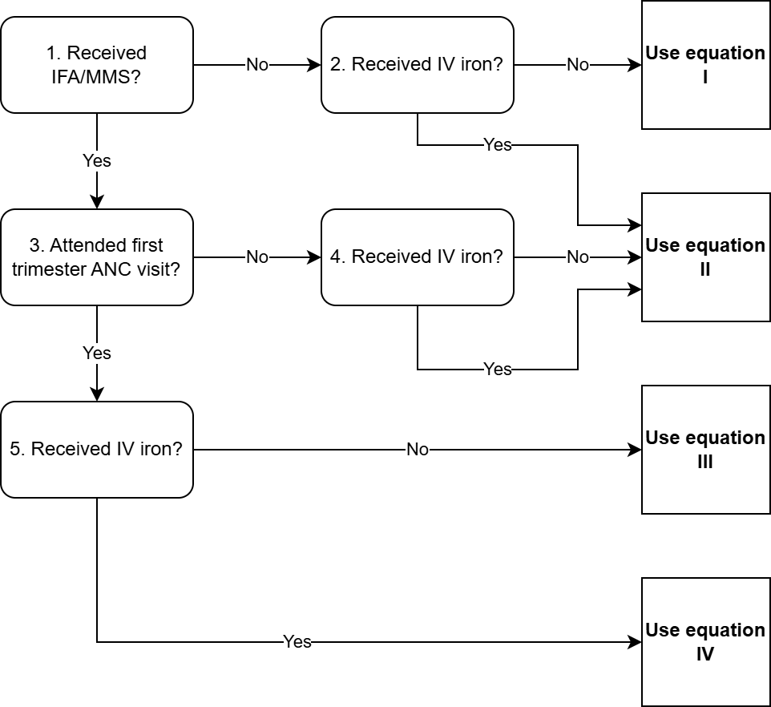

.. role:: underline
    :class: underline

..
  Section title decorators for this document:

  ==============
  Document Title
  ==============

  Section Level 1 (#.0)
  +++++++++++++++++++++

  Section Level 2 (#.#)
  ---------------------

  Section Level 3 (#.#.#)
  ~~~~~~~~~~~~~~~~~~~~~~~

  Section Level 4
  ^^^^^^^^^^^^^^^

  Section Level 5
  '''''''''''''''

  The depth of each section level is determined by the order in which each
  decorator is encountered below. If you need an even deeper section level, just
  choose a new decorator symbol from the list here:
  https://docutils.sourceforge.io/docs/ref/rst/restructuredtext.html#sections
  And then add it to the list of decorators above.

.. _2024_vivarium_mncnh_portfolio_anemia_module:

======================================
Anemia Module
======================================

.. contents::
  :local:
  :depth: 2

1.0 Overview
++++++++++++

This document is the page for the anemia YLDs module of the MNCNH Portfolio simulation.
The anemia module will process information related to simulants' hemoglobin exposure
throughout the course of the simulation and calculate corresponding anemia exposure
and YLDs.

Note that the simulation implementation of anemia YLDs as it relates to the 
:ref:`hemoglobin exposure modules <2024_vivarium_mncnh_portfolio_hemoglobin_module>`
has been performed slightly differently than written on these pages. The implementation
strategy can be summarized as follows:

  In order to keep a single definition of hemoglobin exposure throughout entire sim (as opposed to separate measures such as "hemoglobin at the start of pregnancy" and "hemoglobin at the end of pregnancy" as documented), we have multiple hemoglobin-related timesteps and update hemoglobin exposure and assess anemia YLDs across those timesteps rather than assess anemia YLDs as a lump sum from different hemoglobin values at different timepoints. Anemia YLDs are estimated according to the following steps:
  
    1. Initialize anemia YLDs at 0. 

    2. Progress to the first trimester ANC visit hemoglobin timestep. 

      - For simulants who attend that visit, update their anemia YLD values according to their hemoglobin exposure going into the visit and a duration equal to the gestational timing of their first trimester ANC visit (as defined in the parameter table on this document)

        - Update hemoglobin and LBWSG exposures according to interventions received at that visit

      - For simulants who do not attend that visit, do not update their anemia YLDs. 

    3. Progress to the later pregnancy ANC visit hemoglobin timestep.

      - For simulants who attend that visit and attended the first trimester visit as well, update their anemia YLD values according to their hemoglobin exposure going into that visit (intervention modified if covered) and the duration equal to the gestational timing of their later pregnancy visit minus the gestational timing of their first trimester visit (as defined in the parameter table on this document).

        - Update hemoglobin and LBWSG exposures according to interventions received at that visit

      - For simulants who attend that visit but not the first trimester visit update their anemia YLD values according to their hemoglobin exposure going into the visit (not intervention modified, even if covered at the later pregnancy visit) and a duration equal to the gestational timing of their later pregnancy ANC visit (as defined in the parameter table on this document)

        - Update hemoglobin and LBWSG exposures according to interventions received at that visit

      - For simulants who do not attend that visit, do not update their anemia YLDs

    4. Progress to the end of pregnancy hemoglobin timestep

      - Update anemia YLDs according to hemoglobin exposure going into this timestep and the simulant-specific gestational time elapsed since the last time anemia YLDs were updated

        - Pregnancy duration (according to intervention-modified gestational age) for those who never attended any ANC visits

        - Pregnancy duration (according to intervention-modified gestational age) - gestational timing of later pregnancy ANC visit for those who attended later pregnancy ANC 

        - Pregnancy duration (according to intervention-modified gestational age) - gestational timing of first trimester ANC visit for those who attended the first trimester but not later pregnancy ANC visit

.. todo::

  Include summary of the strategy for accruing postpartum anemia YLDs once implementation plan is formed

2.0 Module Diagram and Data
+++++++++++++++++++++++++++++++

2.1 Module Diagram
----------------------

2.2 Module Inputs
---------------------

.. list-table:: Hemoglobin module required inputs
  :header-rows: 1

  * - Input
    - Source module
    - Application
    - Note
  * - First trimester ANC attendance 
    - :ref:`ANC module <2024_vivarium_mncnh_portfolio_anc_module>`
    - Determines anemia YLD calculation equation
    - 
  * - Hemoglobin at the start of pregnancy
    - :ref:`Hemoglobin module<2024_vivarium_mncnh_portfolio_hemoglobin_module>`
    - Used to calculate anemia YLDs
    - 
  * - Hemoglobin at end of pregnancy
    - :ref:`Hemoglobin module<2024_vivarium_mncnh_portfolio_hemoglobin_module>`
    - Used to calculate anemia YLDs
    - 
  * - Postpartum hemoglobin
    - :ref:`Postpartum hemoglobin module<2024_vivarium_mncnh_portfolio_postpartum_hemoglobin>`
    - Used to calculate anemia YLDs
    - Note that this value will be missing for simulants who did not survive labor
  * - IV iron coverage
    - :ref:`Hemoglobin module<2024_vivarium_mncnh_portfolio_hemoglobin_module>`
    - Determines anemia YLD calculation equation
    - 
  * - IFA/MMS coverage
    - :ref:`Hemoglobin module<2024_vivarium_mncnh_portfolio_hemoglobin_module>`
    - Determines anemia YLD calculation equation
    - 
  * - Pregnancy duration
    - :ref:`Pregnancy II module <2024_vivarium_mncnh_portfolio_pregnancy_module>`
    - Used to calculate anemia YLDs
    - 

2.3 Module Decision Nodes
-----------------------------

.. list-table:: Hemoglobin module decision nodes
  :header-rows: 1

  * - Decision node
    - Description
    - Information
    - Note
  * - 1
    - Received IFA/MMS?
    - Yes if IFA/MMS coverage input value == True
    - 
  * - 2, 4, 5
    - Received IV iron
    - Yes if IV iron coverage input value == True
    - 
  * - 3
    - Attended first trimester ANC visit
    - Yes if first trimester ANC attendance input value == True
    - 

2.4 Module Action Points
---------------------------

We assume that hemoglobin may vary throughout the course of pregnancy/postpartum at the following distinct points opportunities: (1) following IFA/MMS supplementation at the first trimester ANC visit, (2) following IFA/MMS supplementation or IV iron administration at the later pregnancy ANC visit, and (3) following an incident case of maternal hemorrhage during labor, which will persist through the end of the postpartum period. Therefore, we will calculate YLDs due to anemia during pregnancy in this model as a weighted sum over the course of pregnancy stratified by these specified events.

Note that simulants who died during labor should not experience any YLDs due to anemia in the postpartum period. In other words, :math:`\text{DW}(\text{hgb}^\text{pp}_i) * \text{duration}^\text{pp} = 0` for these simulants.

.. list-table:: Hemoglobin module action point
  :header-rows: 1

  * - Equation
    - Value
    - Note
  * - I
    - :math:`\text{DW}(\text{hgb}^\text{start}_i) * \text{duration}^\text{preg}_i + \text{DW}(\text{hgb}^\text{pp}_i) * \text{duration}^\text{pp}` 
    - No interventions in pregnancy
  * - II
    - :math:`\text{DW}(\text{hgb}^\text{start}_i) * T^\text{first trimester}_i + \text{DW}(\text{hgb}^\text{birth}_i) * (\text{duration}^\text{preg}_i - T^\text{first trimester}_i) + \text{DW}(\text{hgb}^\text{pp}_i) * \text{duration}^\text{pp}` 
    - Received IFA/MMS and/or IV iron at later pregnancy visit
  * - III
    - :math:`\text{DW}(\text{hgb}^\text{start}_i) * T^\text{later pregnancy}_i + \text{DW}(\text{hgb}^\text{birth}_i) * (\text{duration}^\text{preg}_i - T^\text{later pregnancy}_i) + \text{DW}(\text{hgb}^\text{pp}_i) * \text{duration}^\text{pp}` 
    - Received IFA/MMS at first trimester visit, no IV iron
  * - IV
    - :math:`\text{DW}(\text{hgb}^\text{start}_i) * T^\text{first trimester}_i + \text{DW}(\text{hgb}^\text{start}_i + \text{shift}^\text{IFA/MMS}) * (T^\text{later pregnancy}_i - T^\text{first trimester}_i) + \text{DW}(\text{hgb}^\text{birth}_i) * (\text{duration}^\text{preg}_i - T^\text{later pregnancy}_i) + \text{DW}(\text{hgb}^\text{pp}_i) * \text{duration}^\text{pp}` 
    - Received IFA/MMS at first trimester visit, IV iron at later pregnancy visit

.. list-table:: Parameters
  :header-rows: 1

  * - Parameter
    - Value
    - Source/Note
  * - :math:`\text{DW}(\text{hgb})`
    - Function that returns the anemia disability weight for a given hemoglobin level. Note that as written this function will need to be able to handle simulants who have died in the intrapartum component and did not progress to the postpartum period (i.e. return zero for these simulants)
    - See the :ref:`anemia impairment document<2019_anemia_impairment>` for anemia hemoglobin thresholds (use the pregnancy-specific values) and disability weights
  * - :math:`\text{hgb}^\text{start}_i`
    - Hemoglobin exposure at the start of pregnancy for individual simulant
    - :ref:`Hemoglobin module<2024_vivarium_mncnh_portfolio_hemoglobin_module>`
  * - :math:`\text{hgb}^\text{birth}_i`
    - Hemoglobin exposure at birth for individual simulant
    - :ref:`Hemoglobin module<2024_vivarium_mncnh_portfolio_hemoglobin_module>`
  * - :math:`\text{hgb}^\text{pp}_i`
    - Postpartum hemoglobin for individual simulant
    - :ref:`Postpartum hemoglobin module<2024_vivarium_mncnh_portfolio_postpartum_hemoglobin>`. Note that there are some simulants who will not survive to the postpartum period and will have undefined postpartum hemoglobin.
  * - :math:`\text{duration}^\text{preg}_i`
    - Pregnancy duration in years for individual simulant
    - :ref:`Pregnancy II module <2024_vivarium_mncnh_portfolio_pregnancy_module>`, note a unit conversion to years may be necessary
  * - :math:`\text{duration}_\text{pp}`
    - 6 * 7 / 365.25
    - We track six weeks of postpartum anemia YLDs
  * - :math:`\text{shift}_\text{IFA/MMS}`
    - Effect of IFA/MMS on hemoglobin
    - :ref:`Oral iron supplementation intervention (IFA/MMS) <maternal_supplementation_intervention>`
  * - :math:`T^\text{first trimester}_i`
    - Randomly sample a different value for each simulant who attends a first trimester ANC visit. Use the distribution corresponding to the simulant's assigned pregnancy duration:

        - Pregnancy duration > 12 weeks: uniform distribution between 8 and 12 weeks 
        - Pregnancy duration between 8 and 12 weeks: uniform distribution between 8 weeks and the simulant's pregnancy duration
        - Pregnancy duration < 8 weeks: uniform distribution between 6 and the simulant's pregnancy duration
    - Note that we define minimum pregnancy duration/gestational age at birth values of 20 weeks for live births, 24 weeks for stillbirths, and 6 weeks for abortion/miscarriage/ectopic pregnancies (see details on the :ref:`pregnancy model document <other_models_pregnancy_closed_cohort_mncnh>`)
  * - :math:`T^\text{later pregnancy}_i`
    - Randomly sample a different value for each simulant who attends the later pregnancy ANC visit from a uniform distribution between 12/52 and :math:`\text{duration}^\text{pregnancy}_i - 2/52` 
    - Note that abortion/miscarriage/ectopic pregnancies cannot attend later pregnancy ANC visits according to the :ref:`ANC attendance module <2024_vivarium_mncnh_portfolio_anc_module>`. The minimum gestational age at birth for the remaining relevant pregnancy outcomes is 20 weeks for live births and 24 weeks for stillbirth, so we will not encounter later pregnancy ANC attendance among pregnancies that end prior to 14 weeks of gestation, which would result in an inverted distribution for this parameter.
  * - pregnancy duration
    - Duration of pregnancy for a given simulant, output from the :ref:`pregnancy module <2024_vivarium_mncnh_portfolio_pregnancy_module>`
    - Pregnancy duration is equal to gestational age at birth for live and stillbirths. Note that pregnancy duration as defined here should be intervention-modified. 

2.4: Module Outputs
-----------------------

.. list-table:: Hemoglobin module outputs
  :header-rows: 1

  * - Output
    - Value
    - Dependencies
  * - Anemia YLDs
    - Point value
    - Simulation result

3.0 Assumptions and limitations
++++++++++++++++++++++++++++++++

- We assume uniform distribution across assumed plausible ranges for timing of ANC visits as well as timing of pregnancies that end in ectopic pregnancy/miscarriage/abortion (as detailed on the :ref:`pregnancy model document <other_models_pregnancy_closed_cohort_mncnh>`) rather than informing these parameters with data
- We assume that interventions affect anemia YLDs at the time of administration at ANC (as according to the timed assumptions in the two prior bullets) with no additional delay 
- We only track anemia YLDs for six weeks postpartum

4.0 Verification and Validation Criteria
+++++++++++++++++++++++++++++++++++++++++

- Baseline simulated anemia YLDs should match corresponding pregnancy-specific GBD values. Run the following command to load the data from GBD 2023:

.. code-block:: python

   get_outputs(
       location_id=[165,179,214],
       topic='rei',
       rei_id=[206,206,207], # We also have rei_id=192 for all anemia and rei_id=432 for moderate and severe combined
       population_group_id=16,
       sex_id=2,
       year_id=2023,
       release_id=16, # release_id=33 also works
       compare_version_id=8306,
       measure_id=[3,5],
       age_group_id=[7, 8, 9, 10, 11, 12, 13, 14, 15, 24, 169]
   )

.. note::

   Make sure you have the latest version of ``db_queries`` to be able to use the ``population_group_id`` argument. To get pregnancy-specific results, the population group and the age groups need to be specified, because the default is all ages.
   As of the time of writing (July 2025), we can only use ``population_group_id=16`` with ``get_outputs()``. There were a few EPIC/COMO runs with pregnancy this GBD round, which are noted in the `tracking HUB page <https://hub.ihme.washington.edu/spaces/GBDdirectory/pages/229280352/GBD+2023+EPIC+COMO+tracking>`_.

5.0 References
+++++++++++++++

