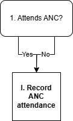

.. role:: underline
    :class: underline

..
  Section title decorators for this document:

  ==============
  Document Title
  ==============

  Section Level 1 (#.0)
  +++++++++++++++++++++

  Section Level 2 (#.#)
  ---------------------

  Section Level 3 (#.#.#)
  ~~~~~~~~~~~~~~~~~~~~~~~

  Section Level 4
  ^^^^^^^^^^^^^^^

  Section Level 5
  '''''''''''''''

  The depth of each section level is determined by the order in which each
  decorator is encountered below. If you need an even deeper section level, just
  choose a new decorator symbol from the list here:
  https://docutils.sourceforge.io/docs/ref/rst/restructuredtext.html#sections
  And then add it to the list of decorators above.

.. _2024_vivarium_mncnh_portfolio_anc_module:

======================================
Antenatal care module
======================================

.. contents::
  :local:
  :depth: 2

1.0 Overview
++++++++++++

This module determines whether or not a simulant attends an antenatal care visit according to their ANC visit propensity value.

.. note::

  This module is expecting to go through updates in wave II of the simulation.

2.0 Module Diagram and Data
+++++++++++++++++++++++++++++++

2.1 Module Diagram
----------------------

2.2 Module Inputs
---------------------

.. list-table:: Module required inputs
  :header-rows: 1

  * - Input
    - Source module
    - Application
    - Note
  * - ANC propensity value
    - :ref:`Initial attributes <2024_vivarium_mncnh_portfolio_initial_attributes_module>`
    - Used to determine answer to decision node #1
    - 

2.3 Module Decision Nodes
-----------------------------

.. list-table:: Module decision nodes
  :header-rows: 1

  * - Decision node
    - Description
    - Information
    - Note
  * - 1: Attends ANC?
    - Value is *True* if ANC propensity value input is <= ANC1 rate
    - ANC1 rates (GBD covariate ID 7): get_covariate_estimates(location_id=location_id, gbd_round_id=7, year_id=2021, decomp_step='iterative', covariate_id=7)
    - This is location specific, but not age specific. Currently assume that there is no correlation of ANC with other factors. Engineers, you can pull these value straight from GBD, but expected values are as follows - Ethiopia: 75.7%, Nigeria: 74.3%, Pakistan: 90.8%

2.4 Module Action Points
---------------------------

.. list-table:: Hemoglobin module action point
  :header-rows: 1

  * - Action point
    - Description
    - Information
    - Note
  * - I
    - Record ANC attendance
    - Record to output A
    - 

2.4: Module Outputs
-----------------------

.. list-table:: Module outputs
  :header-rows: 1

  * - Output
    - Value
    - Note
  * - A. ANC1?
    - *True* / *False*
    - 

3.0 Assumptions and limitations
++++++++++++++++++++++++++++++++

* This model does not consider timing of ANC visit

4.0 Verification and Validation Criteria
+++++++++++++++++++++++++++++++++++++++++

* Verify ANC1 coverage proportion

5.0 References
+++++++++++++++

