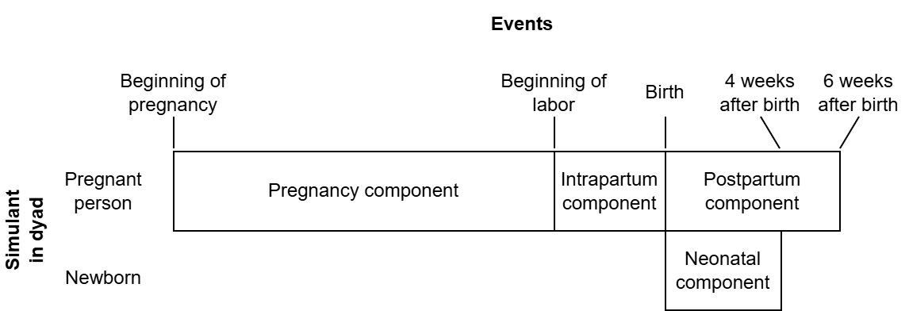

.. role:: underline
    :class: underline

..
  Section title decorators for this document:

  ==============
  Document Title
  ==============

  Section Level 1 (#.0)
  +++++++++++++++++++++

  Section Level 2 (#.#)
  ---------------------

  Section Level 3 (#.#.#)
  ~~~~~~~~~~~~~~~~~~~~~~~

  Section Level 4
  ^^^^^^^^^^^^^^^

  Section Level 5
  '''''''''''''''

  The depth of each section level is determined by the order in which each
  decorator is encountered below. If you need an even deeper section level, just
  choose a new decorator symbol from the list here:
  https://docutils.sourceforge.io/docs/ref/rst/restructuredtext.html#sections
  And then add it to the list of decorators above.

.. _2024_concept_model_vivarium_mncnh_portfolio:

===============
MNCNH Portfolio
===============

.. contents::
  :local:

.. list-table:: Abbreviations
  :widths: 5 15
  :header-rows: 1

  * - Abbreviation
    - Definition
  * - ACMR
    - All-Cause Mortality Rate
  * - ACS
    - Antenatal Corticosteroids
  * - AI ultrasound
    - Artificial Intelligence assisted ultrasound
  * - ANC
    - Antenatal Care
  * - ASFR
    - Age-Specific Fertility Rate
  * - BEmONC
    - Basic Emergency Obstetric and Newborn Care
  * - CEmONC
    - Comprehensive Emergency Obstetric and Newborn Care
  * - CPAP
    - Continuous Positive Airway Pressure
  * - CSMR
    - Cause-Specific Mortality Rate
  * - ENN
    - Early Neonatal
  * - GBD
    - Global Burden of Disease
  * - IFA
    - Iron and Folic Acid
  * - IFD
    - In-Facility Delivery
  * - IV iron
    - Intravenous iron
  * - LBW
    - Low Birth Weight
  * - LBWSG
    - Low Birth Weight and Short Gestation
  * - LNN
    - Late Neonatal
  * - MMS
    - Multiple Micronutrient Supplements
  * - MNCNH
    - Maternal, Newborn, and Child Nutrition and Health
  * - OL
    - Obstructed Labor
  * - PAF
    - Population Attributable Fraction
  * - PPD
    - Postpartum Depression
  * - PTB
    - Preterm Birth
  * - RDS
    - Respiratory Distress Syndrome
  * - RR
    - Relative Risk
  * - RT
    - Research Team
  * - SBR
    - Stillbirth (to live birth) Ratio
  * - V&V
    - Verification and Validation
  * - WRA
    - Women of Reproductive Age
  * - YLDs
    - Years Lived with Disability
  * - YLLs
    - Years of Life Lost

1.0 Overview
++++++++++++

This document is the overall page for the Maternal, Newborn, and Child Nutrition and Health (MNCNH) Portfolio simulation and
contains information that relates to all modeled subcomponents included in 
the simulation.

.. _mncnh_portfolio_2.0:

2.0 Modeling aims and objectives
++++++++++++++++++++++++++++++++

The MNCNH Portfolio simulation builds on work our team has done in other simulations
of pregnancy and early childhood.
The most recent was the :ref:`Nutrition Optimization (NO) <2021_concept_model_vivarium_nutrition_optimization>` simulation,
which (as the name suggests) focused particularly on nutrition interventions.
That simulation allowed us to estimate the impacts of each intervention, and crucially also
how the interventions might *interact*, for example due to prevention
reducing the need for treatment down the line.
"Optimization" refers to the fact that we used the output of the NO sim to calculate
*optimal* allocation of money to have the biggest impact given a budget,
taking all these interactions into account.

Nutrition interventions continue to be included in the MNCNH portfolio sim, but the "portfolio" is
broader; the intervention space includes more products.
These products, like the nutrition interventions in the NO project,
interact in complex ways, and an aim of this simulation is to estimate the impact
of different *combinations* of these interventions.
As before, we also plan to estimate costs and calculate optimal budget allocation,
possibly with improved costing methodology.
This page serves as documentation for the simulation part of the project, which is focused
on estimating burden under a variety of scenarios designed to surface all the relevant product interactions.

Simulating more interventions means simulating more risks and causes for those interventions
to act on, simulating more details of the healthcare system to model how those interventions
would be delivered, and including more detail in the intrapartum (labor and delivery) and neonatal time periods.

We plan to complete this work in 3 waves. 

* Wave 1 will include the basic model design, outlines of the healthcare system, and some interventions (AI ultrasound, RDS management).
* Wave 2 will add in some antenatal supplements (MMS, IV iron), the hemoglobin risk for birthing parents, all downstream causes affected by hemoglobin, and higher level delivery facility interventions.
* Wave 3 will add in gestational blood pressure and relevant causes and risks including pre-eclampsia care and downstream effects of high blood pressure.

As of August 2025, Wave 1 is mostly complete in both documentation and implementation, and Wave 2 is partially documented and has just started implementation.

.. _mncnh_portfolio_3.0:

3.0 Concept model diagram and submodels
+++++++++++++++++++++++++++++++++++++++

As in the NO simulation, rather than simulate an entire population of all ages and sexes,
this simulation includes only pregnant people and the neonates they give birth to.
We start the simulation with a cohort of simulants all at the beginning of pregnancy, and move
them in lockstep through their pregnancies.
For those pregnancies that result in a live birth, we then simulate a neonate (we do not model twins)
through the first month of life.
In this way, our simulation represents all the people who may benefit from the interventions of interest,
without wasting computational resources on simulating irrelevant people, such as adult males.
We call the potential simulant pair we follow through the simulation (pregnant person and neonate) a
"simulant dyad."

This model is different than NO and other simulations we've done in that it follows a decision-tree-like
format in which we jump directly to from one decision point to the next rather than taking equal-sized steps
through time.
For this reason, throughout this model we calculate and express events in terms of probabilities,
rather than rates per person-time or similar.

The overall simulation model is divided into four "components," which are differentiated by the timespan
and the simulant that they model.

* The :ref:`Pregnancy component <mncnh_portfolio_pregnancy_component>`, which models
  from the beginning of pregnancy until the start of labor.
* The :ref:`Intrapartum component <mncnh_portfolio_intrapartum_component>`, which models
  labor and delivery, including delivery complications.
* The :ref:`Neonatal component <mncnh_portfolio_neonatal_component>`, which models the
  first month of life for newborns.
* The :ref:`Postpartum component <mncnh_portfolio_postpartum_component>`, which models the
  six weeks after the end of pregnancy for the pregnant person.

.. warning::

  When we say "component" here, we mean something distinct from a
  :ref:`Vivarium component <vivarium:components_concept>`.

Graphically, the component breakdown looks like this:

.. note::

  Do not interpret the x-axis in this diagram as time, since e.g. the duration of pregnancy is not at all
  constant.
  Also, if misinterpreted this way, the x-axis would be wildly not to scale.

However, the only situation in which all components are actually reached for a given simulant
dyad is the case in which the pregnancy results in a live birth and the birthing person survives
childbirth.
In other situations, some components will not be reached.
The rules by which components flow into other components are as follows:

* All simulant dyads start at the pregnancy component.
* If the birth outcome from the pregnancy component is a live or stillbirth (NOT abortion/miscarriage/ectopic pregnancy), proceed to the intrapartum component.
  Otherwise, skip to the postpartum component.
* At the end of the intrapartum component, if the birth outcome from the pregnancy component is a live birth,
  proceed to the neonatal component.
  Otherwise, if the birth parent survives childbirth, proceed to the postpartum component.
* At the end of the neonatal component, if the birth parent survived childbirth in the intrapartum component,
  proceed to the postpartum component.

Here is a graphic representation of the same information:

Each component is further subdivided into "modules,"
which are organized by topic (rather than by time/simulant as in the components).
Each module may have some simulant dyad attributes as input (values it needs)
and some simulant dyad attributes as output (values it initializes).
Module outputs may be 
used as inputs to other modules and/or serve as information for verification and 
validation and/or simulation results.
For clarity, in the tables below we will write the modules in an order that satisfies the following property:
each variable is defined as a module output prior to being 
used as a module input.
This helps us make sure we aren't creating any cyclic dependencies.
Technically, any order satisfying this property is an equivalent, valid order in which
the modules could be run in the simulation.

.. note::

  There is :ref:`a template <2024_vivarium_mncnh_portfolio_module_template>` to use when creating new module pages.

..
  The below toctree, which used to be rendered (not :hidden:), shows all the modules in a flat list in alphabetical order.
  This didn't seem to add much beyond the tables below, and in fact was kind of confusing since all the components'
  modules were listed together and interspersed.

.. toctree::
   :maxdepth: 1
   :glob:
   :hidden:

   */module_document*
  
.. _mncnh_portfolio_pregnancy_component:

Pregnancy component
-------------------

.. _mncnh_portfolio_pregnancy_component_modules:

.. list-table:: Pregnancy Component Modules
    :header-rows: 1

    * - Module
      - Inputs
      - Outputs
      - Nested subcomponents
    * - :ref:`Initial attributes <2024_vivarium_mncnh_portfolio_initial_attributes_module>`
      - 
      - * Maternal age at end of pregnancy
        * Broad pregnancy outcome (live/stillbirth vs abortion/miscarriage/ectopic)
        * ANC propensity
        * LBWSG category propensity
        * IFD propensity
      - * :ref:`Pregnancy demography <other_models_pregnancy_demography>`
        * :ref:`Broad pregnancy outcome <pregnancy_broad_outcome_section>`
        * :ref:`Facility choice propensity correlation <facility_choice_correlated_propensities_section>`
    * - :ref:`Antenatal care <2024_vivarium_mncnh_portfolio_anc_module>`
      - * Broad pregnancy outcome
        * ANC propensity
      - * First trimester ANC attendance
        * Later pregnancy ANC attendance
        * ANC attendance category
      - 
    * - :ref:`Hemoglobin <2024_vivarium_mncnh_portfolio_hemoglobin_module>`
      - * Maternal age at end of pregnancy
        * First trimester ANC attendance
        * Later pregnancy ANC attendance
      - * IFA/MMS coverage
        * IV iron coverage
        * True hemoglobin at start of pregnancy
        * True hemoglobin at end of pregnancy
      - * :ref:`Hemoglobin risk exposure <2023_hemoglobin_exposure>`
        * :ref:`Oral iron supplementation intervention (IFA/MMS) <oral_iron_antenatal>`
        * :ref:`IV iron intervention <intervention_iv_iron_antenatal_mncnh>`
        * :ref:`Anemia screening intervention <anemia_screening>`
    * - :ref:`Pregnancy <2024_vivarium_mncnh_portfolio_pregnancy_module>`
      - * Broad pregnancy outcome
        * LBWSG category propensity
        * IFA/MMS coverage (affects birth outcome, gestational age, birthweight)
        * IV iron coverage (affects birth outcome, gestational age, birthweight)
      - * Pregnancy outcome (live birth vs stillbirth vs abortion/miscarriage/ectopic)
        * Gestational age at end of pregnancy
        * Preterm status
        * Sex of infant
        * Birthweight
      - * :ref:`Pregnancy model <other_models_pregnancy_closed_cohort_mncnh>`
          
          * :ref:`LBWSG exposure <2021_risk_exposure_lbwsg>`
    * - :ref:`AI ultrasound <2024_vivarium_mncnh_portfolio_ai_ultrasound_module>`
      - * ANC attendance category
        * Gestational age at end of pregnancy
      - * Ultrasound type
        * Estimated gestational age
        * Believed preterm status
      - 

.. _mncnh_portfolio_intrapartum_component:

Intrapartum component
---------------------

.. note::

  Only live births or stillbirths (NOT abortions/miscarriages/ectopic pregnancies) will proceed to the intrapartum component,
  as described above.

.. warning::

  As currently designed, the intrapartum component models an intervention for misoprostol to 
  prevent postpartum hemorrhage (PPH) in home birth settings only. We do not consider any
  interventions for PPH prevention at facility settings nor do we model the expected greater
  incidence of PPH in home settings relative to facility settings. 

  Therefore, as written, the incidence of PPH by delivery setting will be miscalibrated to
  the expectation in reality. We plan to continue with the implementing the model as written while
  noting this limitation until we implement a strategy to address this (`see related 
  ticket here <https://jira.ihme.washington.edu/browse/SSCI-2310>`_)

.. list-table:: Intrapartum Component Modules
    :header-rows: 1

    * - Module
      - Inputs
      - Outputs
      - Nested subcomponents
    * - :ref:`Facility choice <2024_vivarium_mncnh_portfolio_facility_choice_module>`
      - * IFD propensity
        * Believed preterm status
      - * IFD status
        * Birth facility
      - * :ref:`Facility choice model <2024_facility_model_vivarium_mncnh_portfolio>`
    * - :ref:`Intrapartum interventions <2024_vivarium_mncnh_portfolio_intrapartum_interventions_module>`
      - * Birth facility
        * Believed gestational age
        * ANC attendance
      - * Intrapartum azithromycin coverage 
        * Antenatal corticosteroid coverage
        * Misoprostol coverage
      - * :ref:`Intrapartum azithromycin <azithromycin_intervention>` 
        * :ref:`Misoprostol coverage <misoprostol_intervention>`
        * :ref:`Antenatal corticosteroids <acs_intervention>`
    * - :ref:`Maternal disorders <2024_vivarium_mncnh_portfolio_maternal_disorders_module>`
      - * :ref:`Intrapartum azithromycin coverage <azithromycin_intervention>`
        * Hemoglobin at end of pregnancy
      - * Maternal disorders outcomes (see outcome table)
      - * :ref:`Overall maternal disorders <2021_cause_maternal_disorders_mncnh>`
        * :ref:`Maternal hemorrhage <2021_cause_maternal_hemorrhage_mncnh>`
        * :ref:`Maternal sepsis <2021_cause_maternal_sepsis_mncnh>`
        * :ref:`Maternal obstructed labor and uterine rupture <2021_cause_obstructed_labor_mncnh>`
        * :ref:`Residual maternal disorders <2021_cause_residual_maternal_disorders_mncnh>`
        * :ref:`Abortion/miscarriage/ectopic pregnancy maternal disorders <2021_cause_abortion_miscarriage_ectopic_pregnancy_causes_mncnh>`

.. _mncnh_portfolio_neonatal_component:

Neonatal component
------------------

.. note::

  Only live births proceed to the neonatal component, as described above.

.. list-table:: Neonatal Component Modules
  :header-rows: 1

  * - Module
    - Inputs
    - Outputs
    - Nested subcomponents
  * - :ref:`Neonatal module <2024_vivarium_mncnh_portfolio_neonatal_module>`
    - * Birth facility
      * Birth weight
      * Gestational age
      * RDS intervention propensity
      * Hemoglobin exposure at birth (affects neonatal sepsis)
    - * Neonatal probiotics coverage
      * CPAP coverage
      * Neonatal mortality outcomes (see outcome table)
    - * :ref:`Neonatal Mortality Model <2021_cause_neonatal_disorders_mncnh>`
      * :ref:`Neonatal Sepsis and Other Infections Model <2021_cause_neonatal_sepsis_mncnh>`
      * :ref:`Neonatal Encephalopathy Model <2021_cause_neonatal_encephalopathy_mncnh>`
      * :ref:`Preterm Birth <2021_cause_preterm_birth_mncnh>`
      * :ref:`Antibiotics for treating bacterial infections <intervention_neonatal_antibiotics>`
      * :ref:`CPAP for treating Preterm with RDS <intervention_neonatal_cpap>`
      * :ref:`Neonatal probiotics <intervention_neonatal_probiotics>`
      * :ref:`Antenatal corticosteroids <acs_intervention>`
      * :ref:`LBWSG risk effects <2019_risk_effect_lbwsg>`
      * :ref:`Hemoglobin risk effects <2023_hemoglobin_effects>`

.. _mncnh_portfolio_postpartum_component:

Postpartum component
--------------------

.. list-table:: Postpartum Component Modules
  :header-rows: 1

  * - Module
    - Inputs
    - Outputs
    - Nested subcomponents
  * - :ref:`Postpartum hemoglobin <2024_vivarium_mncnh_portfolio_postpartum_hemoglobin>`
    - * Hemoglobin at end of pregnancy
      * Maternal hemorrhage incidence
    - * Postpartum hemoglobin
    - * :ref:`Hemoglobin risk exposure <2023_hemoglobin_exposure>`
      * :ref:`Maternal hemorrhage risk effects <2019_risk_effect_maternal_hemorrhage>` 
  * - :ref:`Anemia YLDs <2024_vivarium_mncnh_portfolio_anemia_module>`
    - * Hemoglobin at start of pregnancy
      * Hemoglobin at end of pregnancy
      * Postpartum hemoglobin
      * IFA/MMS coverage
      * IV iron coverage
      * First trimester ANC attendance
      * Pregnancy duration
    - * Anemia YLDs
    - * :ref:`Anemia impairment <2019_anemia_impairment>`
  * - :ref:`Postpartum depression <2024_vivarium_mncnh_portfolio_ppd_module>`
    - * Hemoglobin at end of pregnancy
    - * Maternal disorders outcomes (see outcome table)
    - * :ref:`Postpartum depression <2021_cause_postpartum_depression_mncnh>`
      * :ref:`Hemoglobin risk effects document <2023_hemoglobin_effects>`

**Wave 1 Concept Model Map (has not been updated recently):**

.. _mncnh_portfolio_3.1:

3.1 Scenario information
--------------------------

.. note::

  Scenarios were reworked for model version 18.4. To see the definition of scenarios used for prior models, see the record in `this pull request <https://github.com/ihmeuw/vivarium_research/pull/1811>`__. Note that scenario design for this simulation is expected to undergo an additional future rework to achieve compatibility with an "emulator" design.

.. _MNCNH pregnancy component scenario table:

.. list-table:: Pregnancy component scenario-dependent variables
  :header-rows: 1

  * - Scenario
    - Ultrasound coverage
    - Ultrasound type
    - Oral iron coverage
    - Hemoglobin screening coverage
    - Ferritin screening coverage
    - IV iron coverage
    - Note
  * - 1. Baseline
    - Defined in the baseline coverage section of the :ref:`AI ultrasound module page <2024_vivarium_mncnh_portfolio_ai_ultrasound_module>`
    - Defined in the baseline coverage section of the :ref:`AI ultrasound module page <2024_vivarium_mncnh_portfolio_ai_ultrasound_module>`
    - Defined in the baseline coverage section of the :ref:`oral iron supplementation page <oral_iron_antenatal>` (use the :code:`baseline_ifa_at_anc` parameter to determine individual coverage among simulants who attend ANC)
    - Defined in the baseline coverage section of the :ref:`anemia screening intervention page <anemia_screening>`
    - Defined in the baseline coverage section of the :ref:`anemia screening intervention page <anemia_screening>`
    - Defined in the baseline coverage section of the :ref:`IV iron page <intervention_iv_iron_antenatal_mncnh>`
    - 
  * - 2. CPAP and ACS scale-up
    - Baseline
    - Baseline
    - Baseline
    - Baseline
    - Baseline
    - Baseline
    - 
  * - 3. CPAP, ACS, and AI-ultrasound scale-up
    - 100%
    - 100% AI-assisted
    - Baseline
    - Baseline
    - Baseline
    - Baseline
    - When compared to 2, shows how AI ultrasound-->facility choice pathway can improve outcomes by having more preterm deliveries deliver in facility settings
  * - 4. Neonatal antibiotics scale-up
    - Baseline
    - Baseline
    - Baseline
    - Baseline
    - Baseline
    - Baseline
    - 
  * - 5. Neonatal probiotics scale-up
    - Baseline
    - Baseline
    - Baseline
    - Baseline
    - Baseline
    - Baseline
    - 
  * - 6. Azithromycin scale-up
    - Baseline
    - Baseline
    - Baseline
    - Baseline
    - Baseline
    - Baseline
    - 
  * - 7. AI ultrasound scale-up
    - 100% at ANC (no ultrasound among those who do not attend ANC)
    - 100% AI-assisted
    - Baseline
    - Baseline
    - Baseline
    - Baseline
    - 
  * - 8. Standard ultrasound scale-up
    - 100% at ANC (no ultrasound among those who do not attend ANC)
    - 100% standard
    - Baseline
    - Baseline
    - Baseline
    - Baseline
    -
  * - 9. Full product scale-up, October 2025
    - 100% at ANC (no ultrasound among those who do not attend ANC)
    - 100% AI-assisted
    - Baseline
    - Baseline
    - Baseline
    - Baseline
    - Not including anemia related interventions in this run as implementation of all model components is incomplete as of October 2025
  * - 10. MMS scale-up
    - Baseline
    - Baseline
    - 100% MMS
    - Baseline
    - Baseline
    - Baseline
    - 
  * - 11. Anemia screening and IV iron scale-up
    - Baseline
    - Baseline
    - Baseline
    - 100%
    - 100%
    - 100%
    - 
  * - 12. Azithromycin V&V
    - Baseline
    - Baseline
    - Baseline
    - Baseline
    - Baseline
    - Baseline
    - 
  * - 13. Misoprostol V&V
    - Baseline
    - Baseline
    - Baseline
    - Baseline
    - Baseline
    - Baseline
    - 
  * - 14. No ACS and total CPAP V&V
    - Baseline
    - Baseline
    - Baseline
    - Baseline
    - Baseline
    - Baseline
    - 
  * - 15. Total ACS and CPAP V&V
    - Baseline
    - Baseline
    - Baseline
    - Baseline
    - Baseline
    - Baseline
    - 
  * - 16. Total ACS and no CPAP V&V
    - Baseline
    - Baseline
    - Baseline
    - Baseline
    - Baseline
    - Baseline
    - 
  * - 17. Ultrasound V&V
    - 100% at ANC (no ultrasound among those who do not attend ANC)
    - 50% standard US, 50% AI-assisted US 
    - Baseline
    - Baseline
    - Baseline
    - Baseline
    - 
  * - 18. Anemia screening V&V
    - Baseline
    - Baseline
    - Baseline
    - 100% of eligible population
    - 100% of eligible population
    - Baseline
    - 

.. _MNCNH intrapartum component scenario table:

.. list-table:: Intrapartum component scenario-dependent variables
  :header-rows: 1

  * - Scenario
    - Azithromycin coverage
    - Corticosteroid coverage
    - Misoprostol coverage
    - Note
  * - 1. Baseline
    - Defined on :ref:`intrapartum intervention model document <2024_vivarium_mncnh_portfolio_intrapartum_interventions_module>`
    - Defined on :ref:`intrapartum intervention model document <2024_vivarium_mncnh_portfolio_intrapartum_interventions_module>`
    - Defined on :ref:`intrapartum intervention model document <2024_vivarium_mncnh_portfolio_intrapartum_interventions_module>`
    - 
  * - 2. CPAP and ACS scale-up
    - Baseline
    - 100% at BEmONC and CEmONC, baseline at home
    - Baseline
    - 
  * - 3. CPAP, ACS, and AI-assisted ultrasound scale-up
    - Baseline
    - 100% at BEmONC and CEmONC, baseline at home
    - Baseline
    -  
  * - 4. Neonatal antibiotics scale-up
    - Baseline
    - Baseline
    - Baseline
    - 
  * - 5. Neonatal probiotics scale-up
    - Baseline
    - Baseline
    - Baseline
    - 
  * - 6. Azithromycin scale-up
    - 100% at BEmONC and CEmONC, baseline at home
    - Baseline
    - Baseline
    - 
  * - 7. AI-assisted ultrasound scale-up
    - Baseline
    - Baseline
    - Baseline
    - 
  * - 8. Standard ultrasound scale-up
    - Baseline
    - Baseline
    - Baseline
    - 
  * - 9. Full product scale-up, October 2025
    - 100% at BEmONC and CEmONC, baseline at home
    - 100% at BEmONC and CEmONC, baseline at home
    - Baseline
    - Not including misoprostol scale-up in this run because as of October 2025 we have known calibration issues with our hemorrhage model by delivery facility setting
  * - 10. MMS scale-up
    - Baseline
    - Baseline
    - Baseline
    - 
  * - 11. Anemia screening and IV iron scale-up
    - Baseline
    - Baseline
    - Baseline
    -
  * - 12. Azithromycin V&V
    - 50% at BEmONC and CEmONC, baseline at home
    - 0%
    - 0%
    - 
  * - 13. Misoprostol V&V
    - 0%
    - 0%
    - 50% among eligible population (attends ANC and delivers at home)
    - 
  * - 14. No ACS and total CPAP V&V
    - Baseline
    - 0% coverage at all delivery location types 
    - Baseline
    - see neonatal table for CPAP coverage
  * - 15. Total ACS and CPAP V&V
    - Baseline
    - 100% coverage at BEmONC and CEmONC facilities, baseline at home
    - Baseline
    - see neonatal table for CPAP coverage
  * - 16. Total ACS and no CPAP V&V
    - Baseline
    - 100% coverage at BEmONC and CEmONC facilities, baseline at home
    - Baseline
    - see neonatal table for CPAP coverage    
  * - 17. Ultrasound V&V
    - Baseline
    - Baseline
    - Baseline
    - 
  * - 18. Anemia screening V&V
    - Baseline
    - Baseline
    - Baseline
    - 

.. _MNCNH neonatal component scenario table:

.. list-table:: Neonatal component scenario-dependent variables
  :header-rows: 1

  * - Scenario
    - CPAP coverage
    - Antibiotics coverage
    - Probiotics coverage
    - Note
  * - 1. Baseline
    - Defined on the :ref:`CPAP intervention model document <intervention_neonatal_cpap>`
    - Defined on the :ref:`neonatal antibiotic intervention document <intervention_neonatal_antibiotics>`
    - Defined on the :ref:`probiotics intervention model document <intervention_neonatal_probiotics>`
    - Baseline coverage values are delivery facility-specific
  * - 2. CPAP and ACS scale-up
    - 100% at BEMONC and CEMONC, baseline at home
    - Baseline
    - Baseline
    - 
  * - 3. CPAP, ACS, and AI-assisted ultrasound scale-up
    - 100% at BEMONC and CEMONC, baseline at home
    - Baseline
    - Baseline
    -  
  * - 4. Neonatal antibiotics scale-up
    - Baseline
    - 100% coverage
    - Baseline
    - 
  * - 5. Probiotics total scale-up
    - Baseline
    - Baseline
    - 100% at CEMONC and BEMONC, baseline at home
    - 
  * - 6. Azithromycin scale-up
    - Baseline
    - Baseline
    - Baseline
    - 
  * - 7. AI-assisted ultrasound scale-up
    - Baseline
    - Baseline
    - Baseline
    - 
  * - 8. Standard ultrasound scale-up
    - Baseline
    - Baseline
    - Baseline
    - 
  * - 9. Full product scale-up
    - 100% at BEMONC and CEMONC, baseline at home
    - 100%
    - 100% at BEMONC and CEMONC, baseline at home
    - 
  * - 10. MMS scale-up
    - Baseline
    - Baseline
    - Baseline
    - 
  * - 11. Anemia screening and IV iron scale-up
    - Baseline
    - Baseline
    - Baseline
    - 
  * - 12. Azithromycin V&V
    - Baseline
    - Baseline
    - Baseline
    - 
  * - 13. Misoprostol V&V
    - Baseline
    - Baseline
    - Baseline
    - 
  * - 14. No ACS and total CPAP V&V
    - 100% coverage at BEmONC and CEmONC facilities, baseline at home
    - Baseline
    - Baseline
    - See intrapartum table for ACS coverage
  * - 15. Total ACS and CPAP V&V
    - 100% coverage at BEmONC and CEmONC facilities, baseline at home
    - Baseline
    - Baseline
    - See intrapartum table for ACS coverage
  * - 16. Total ACS and no CPAP V&V
    - 0% coverage at all delivery location types 
    - Baseline
    - Baseline
    - See intrapartum table for ACS coverage 
  * - 17. Ultrasound V&V
    - Baseline
    - Baseline
    - Baseline
    - 
  * - 18. Anemia screening V&V
    - Baseline
    - Baseline
    - Baseline
    - 

.. _mncnh_portfolio_4.0:

4.0 Outputs/Observers
++++++++++++++++++++++

Specific observer outputs and their stratifications may vary by model run as needs change. Modifications to default will be noted in the model run requests tables. Note that the observers and outputs listed here are different from the module outputs above. The outputs of the module are intended to be intermediate values that may or may not be included as observed simulated outputs.

Default stratifications to all observers should include scenario and input draw.

.. note::
  
  Observers cannot support more than 15 stratifications. Design of simulation observers should take this into account.

.. list-table:: Simulation observers
  :header-rows: 1

  * - Observer
    - Default stratifications
    - Note
  * - 1. Maternal disorders burden: cause-specific cases, deaths, YLLs, and YLDs
    - * Maternal age group
      * Pregnancy outcome
      * Delivery facility
      * Azithromycin coverage
      * Misoprostol coverage
    - 
  * - 2. Births (this observer includes ALL pregnancy outcomes, including abortion/miscarriage/ectopic pregnancies that may not typically be considered "births")
    - * Pregnancy outcome
      * Child sex
      * Delivery facility type
      * Antibiotics availability
      * Probiotics availability
      * CPAP availability
      * Corticosteroid coverage
      * ACS eligibility (dichotomous, 'eligible' if believed gestational age is between 26-33 weeks, 'not eligible' if gestational age is outside of this range)
      * Preterm status (dichotomous at 37 weeks)
    -
  * - 3. Neonatal deaths (cause-specific)
    - * Child sex
      * Child age group
      * Delivery facility type
      * CPAP availability
      * Antibiotics availability
      * Probiotics availability
      * Corticosteroid coverage
      * ACS eligibility (dichotomous, 'eligible' if believed gestational age is between 26-33 weeks, 'not eligible' if gestational age is outside of this range)
      * Preterm status (dichotomous at 37 weeks)
    -
  * - 4. Antibiotics eligible birth counts
    - * Delivery facility type
    - Included. Confirm this represents "eligible birth counts"?
  * - 5. CPAP eligible birth counts
    - * Delivery facility type
    - Included. Confirm this represents "eligible birth counts"?
  * - 6. Probiotics eligible birth counts
    - * Delivery facility type
    - Included. Confirm this represents "eligible birth counts"?
  * - 7a. Maternal population counts: hemoglobin-related parameters
    - * Maternal age group
      * Pregnancy outcome
      * ANC attendance (polychotomous)
      * Oral iron coverage (ifa/mms/none)
      * IV iron coverage
      * True hemoglobin exposure ('low' if truly low hemoglobin and 'adequate' if truly adequate hemoglobin at time of screening)
      * Test hemoglobin exposure ('low' if tested low hemoglobin,'adequate' if tested adequate hemoglobin, 'not_tested' if not tested)
      * Ferritin status (dichotomous, 'low' if low ferritin, 'adequate' if adequate ferritin, 'not_tested' if not tested)
      * Preterm status (dichotomous at 37 weeks)
    - 
  * - 7b. Maternal population counts: other parameters
    - * Maternal age group
      * Pregnancy outcome
      * ANC attendance (polychotomous)
      * Ultrasound coverage
      * Delivery facility
      * Preterm status (dichotomous at 37 weeks)
      * Believed preterm status (dichotomous at 37 weeks)
      * ACS eligibility (dichotomous, 'eligible' if believed gestational age is between 26-33 weeks, 'not eligible' if gestational age is outside of this range)
      * ACS coverage
      * Azithromycin coverage
      * Misoprostol coverage
    - 
  * - 8. Neonatal all-cause mortality risk
    - * Child sex
      * Child age group
      * Delivery facility type
      * CPAP availability
      * Antibiotics availability
      * Probiotics availability
      * Corticosteroid coverage
      * ACS eligibility (dichotomous, 'eligible' if believed gestational age is between 26-33 weeks, 'not eligible' if gestational age is outside of this range)
      * Preterm status (dichotomous at 37 weeks)
    - Observe the following statistics about the :math:`\text{ACMRisk}_i` value described on the :ref:`neonatal mortality page <2021_cause_neonatal_disorders_mncnh>`,
      which is implemented as the :code:`death_in_age_group_probability` pipeline in the simulation
      (`see code <https://github.com/ihmeuw/vivarium_gates_mncnh/blob/b9f8d0d8a4b5562178fd84d364952d48524b744a/src/vivarium_gates_mncnh/constants/data_values.py#L259>`__):

      * The number of values (equal to the number of living simulants)
      * The sum of the values
      * The sum of the squares of the values

      All of these quantities can aggregate across seeds in the normal way (summation).
  * - 9. Neonatal cause-specific mortality risks (per cause)
    - * Child sex
      * Child age group
      * Delivery facility type
      * CPAP availability
      * Antibiotics availability
      * Probiotics availability
      * Corticosteroid coverage
      * ACS eligibility (dichotomous, 'eligible' if believed gestational age is between 26-33 weeks, 'not eligible' if gestational age is outside of this range)
      * Preterm status (dichotomous at 37 weeks)
    - Observe the following statistics about the :math:`\text{CSMRisk}^k_i` value described on the :ref:`neonatal mortality page <2021_cause_neonatal_disorders_mncnh>`,
      which is implemented as the :code:`csmr` pipeline on each cause in the simulation --
      not to be confused with the :code:`cause_specific_mortality_risk` pipeline which does not include intervention effects
      (`see code <https://github.com/ihmeuw/vivarium_gates_mncnh/blob/b9f8d0d8a4b5562178fd84d364952d48524b744a/src/vivarium_gates_mncnh/constants/data_values.py#L263>`__):

      * The number of values (equal to the number of living simulants)
      * The sum of the values
      * The sum of the squares of the values

      All of these quantities can aggregate across seeds in the normal way (summation).
  * - 10. Impossible neonatal CSMRisk
    - * Child sex
      * Child age group
      * Delivery facility type
      * CPAP availability
      * Antibiotics availability
      * Probiotics availability
      * Corticosteroid coverage
      * ACS eligibility (dichotomous, 'eligible' if believed gestational age is between 26-33 weeks, 'not eligible' if gestational age is outside of this range)
      * Preterm status (dichotomous at 37 weeks)
    - For each living simulant, take the modeled-cause CSMRisks (same pipelines as used in the previous observer),
      divide them each by the ACMRisk (same pipeline as observer #8), sum them and then subtract 1.
      If negative, clip this value to zero.
      This emulates the factor by which `the modeled-cause CSMRisk exceeds ACMRisk, requiring a hack to prevent other-causes CSMRisk from being negative <https://github.com/ihmeuw/vivarium_gates_mncnh/blob/b9f8d0d8a4b5562178fd84d364952d48524b744a/src/vivarium_gates_mncnh/components/mortality.py#L325-L345>`__.

      Then observe:

      * The number of values (equal to the number of living simulants)
      * The number of nonzero values
      * The sum of the values
      * The sum of the squares of the values

      All of these quantities can aggregate across seeds in the normal way (summation).

.. todo::

  Determine whether we want to continue to have duplicate information like:

    - Stratifying the birth observer by neonatal interventions,

    - AND separately observing neonatal intervention counts

.. note::

  Additional outputs to add for wave II include:

  * Anemia status at birth counts (none/mild/moderate/severe)
  * YLDs due to anemia in pregnancy
  * Postpartum anemia status counts (non/mild/moderate/severe)
  * YLDs due to anemia in the postpartum period

.. _mncnh_portfolio_5.0:

5.0 Model run requests
++++++++++++++++++++++

.. list-table:: Default simulation specifications
  :header-rows: 1

  * - Parameter
    - Value
    - Note
  * - Location(s)
    - * Ethiopia (ID: 179)
      * Nigeria (ID: 214)
      * Pakistan (ID: 165)
    -
  * - Number of draws
    - 10
    - See next row for which specific draws to be used. Based on calculations from the `Nutrition Optimization project <https://vivarium-research.readthedocs.io/en/latest/models/concept_models/vivarium_nutrition_optimization/kids/concept_model.html#production-run-specifications>`_: production run number divided in half for default V&V runs
  * - Draw numbers
    - 115, 60, 118, 197, 79, 244, 22, 167, 146, 71, 28, 156, 94, 170, 109, 26, 35, 114, 178, 127
    - The standard number of draws available for most of our model input parameters is 500 for GBD 2021 and 250 for GBD 2023. There are a few instances where our input data have different numbers of draws available. Those instances are summarized in the table following this one. To account for the varying number of draws available for our input data, we will pre-specify which draws to select according to the numbers listed here. 20 draws have been listed although the default number of draws for V&V model runs is 10 - the first 10 numbers in this list should be used for V&V runs. 

      This list of numbers was first generated for GBD 2021 data starting in model 11.0 by sampling a random number between 0 and 499 and resampling when a number was generated that had the same remainder after dividing by 100 or 250 as a number that was already in the list. This strategy ensures that we do not run multiple draws that have identical data for any parameter in our model. These draws included: [115, 60, 368, 197, 79, 244, 272, 167, 146, 71, 278, 406, 94, 420, 109, 26, 35, 114, 428, 218]. The final number in the list (218) was updated from (170) in September of 2025 to account for new input data with 250 draws.

      This list was later updated for GBD 2023 data starting in model 19.0 by taking the remainder of each number in the GBD 2021 list after dividing by 250 and re-sampling a new value for 218 (which had a duplicate value % 100 as another number in the list).
  * - Population size per draw
    - 100,000
    - Based on calculations from the `Nutrition Optimization project <https://vivarium-research.readthedocs.io/en/latest/models/concept_models/vivarium_nutrition_optimization/kids/concept_model.html#production-run-specifications>`_: production run number divided in half for default V&V runs
  * - Randomness key columns
    - ['entrance_time','age']
    - Note that each row of the population table in this simulation contains a pregnant simulant AND the outcome of that simulant's pregnancy. Therefore, the conversion of a stillbirth to a live birth between simulated scenarios in this simulation will not result in a new row added to the simulation state table and therefore will not change the state table index value of other simulants like occured in the IV iron simulation and resulted in disruptions to common random numbers between scenarios. Therefore, these randomness key columns are expected to be sufficient for this simulation.
  * - Age start (initialization) 
    - 10
    - Applies to pregnant population only
  * - Age end (initialization)
    - 54
    - Applies to pregnant population only
  * - Age start (observation)
    - N/A. All pregnant simulants observed from start of pregnancy. All neonatal simulants observed from birth.
    - 
  * - Age end (observation)
    - N/A; All pregnant simulants observed through conclusion of relevant modeled outcomes. All neonatal simulants observed until 28 days (end of late neonatal age group)
    - Pregnant/birthing simulants do not age in this simulation

.. list-table:: Summary of draw metadata by input parameter
  :header-rows: 1

  * - Parameter
    - Number of draws
    - Strategy for GBD 2021 (Models <19.0)
    - Strategy for GBD 2023 (Models 19.0+)
    - Note/reference
  * - Standard GBD data
    - 500 for GBD 2021, 250 for GBD 2023
    - Use 500 draws as is
    - Use 250 draws as-is
    - 
  * - :ref:`Hemoglobin risk exposure <2023_hemoglobin_exposure>` (using GBD 2023 data)
    - 100
    - Copy 5 times so that draw 1, 101, 201, 301, and 401 all have the same value, etc.
    - Copy 2.5 times so that draw 1, 101, and 201 all have the same value. Note that draws 0-49 will be used three times and draws 50-99 will be used twice.
    - 
  * - :ref:`Hemoglobin risk effects <2023_hemoglobin_effects>`, including those on stillbirth, gestational age, and birthweight that are modeled through the :ref:`IV iron intervention model <intervention_iv_iron_antenatal_mncnh>`
    - 250
    - Copy twice so that draw 1 and 251 have the same value, etc.
    - Use as is
    - Note that we have ordered the draws for hemoglobin RRs on gestational age, birth weight, and neonatal sepsis in the same order as we are modeling mediation by gestational age and birthweight in the effect of hemoglobin on neonatal sepsis and therefore expect that these draws will be correlated.
  * - :ref:`Delivery facility type probabilities <facility_choice_choosing_bemonc_cemonc_section>`
    - 100
    - Copy 5 times so that draw 1, 101, 201, 301, and 401 all have the same value, etc.
    - Copy 2.5 times so that draw 1, 101, and 201 all have the same value. Note that draws 0-49 will be used three times and draws 50-99 will be used twice.
    -
  
.. note::

  The "Directory" column in the table below lists the subdirectory nested within ``mnt/team/simulation_science/pub/models/vivarium_gates_mncnh/results/`` where results specific to that model run can be found.

  Model numbers with an asterisk indicate planned model runs that are not yet ready to be implemented. 

.. list-table:: Model runs
  :header-rows: 1

  * - Number
    - Run
    - Scenarios
    - Directory
    - Specification mods
    - Stratification mods
    - Observer mods
  * - 1
    - Wave I Pregnancy V&V
    - Baseline
    - ``pregnancy``
    - 
    -
    -
  * - 2
    - Wave I Maternal disorders V&V
    - Baseline
    - ``maternal_disorders``
    - 
    - 
    - 
  * - 3
    - Wave I Neonatal disorders V&V
    - Baseline
    - ``neonatal_disorders``
    - 
    - 
    - 
  * - 3.1
    - Wave I Neonatal disorders V&V with correct LBWSG distribution
    - Baseline
    - ``neonatal_disorders``
    - 
    -
    -
  * - 3.2
    - Wave I Neonatal disorders V&V with LBWSG component removed
    - Baseline
    - ``no_lbwsg``
    - 
    - 
    - 
  * - 3.3
    - Wave I Neonatal disorders V&V with early NN observer bugfix
    - Baseline
    - ``risk_effects``
    - 
    - 
    - 
  * - 4.1
    - Wave I CPAP 
    - Baseline
    - ``cpap``
    - 
    - 
    - 
  * - 4.2
    - Wave I CPAP with observer for counts per facility type
    - Baseline
    - ``cpap_2``
    - 
    - 
    - 
  * - 4.3
    - Wave I CPAP with addition of a delivery facility column in births observer and CPAP availability stratification
      in neonatal burden observer
    - Baseline
    - ``cpap_3``
    - 
    - 
    - 
  * - 4.4
    - Wave I CPAP with updated determination of delivery facility type
    - Baseline
    - ``cpap_4``
    - 
    - 
    - 
  * - 4.5
    - Wave I CPAP with bugfix for negative other causes mortality rates
    - Baseline
    - ``cpap_5``
    - 
    - 
    - 
  * - 4.6
    - Wave I CPAP with scale-up scenarios 
    - Baseline and alternative scenarios 2, 3, and 4
    - ``cpap_full_scenarios``
    - 
    - 
    - 
  * - 4.7
    - Correct pregnancy duration for abortion/miscarriage/ectopic pregnancies
    - Baseline and alternative scenarios 2, 3, and 4
    - ``birth_exposure_2``
    - 
    - 
    - 
  * - 5.0
    - Wave I neonatal antibiotics with scale-up scenarios 
    - Baseline and alternative scenarios 2 - 7 
    - ``antibiotics``
    - 
    - 
    - 
  * - 5.1
    - Wave I neonatal antibiotics with scale-up scenarios; engineer refactor 
    - Baseline and alternative scenarios 2 - 7 
    - ``children_mapped``
    - 
    - 
    - 
  * - 6.0
    - Wave I neonatal probiotics with scale-up scenarios 
    - Baseline and alternative scenarios 2 - 10 
    - ``probiotics``
    - 
    - 
    - 
  * - 6.0.1
    - Wave I neonatal disorders ACMR with 200k population without interventions
    - Baseline 
    - ``/no_interventions/``
    - Population increased 10 fold (random seed population size changed from 20k to 200k)
    - 
    - 
  * - 6.0.2
    - Wave I neonatal disorders ACMR with 2 million population
    - Baseline
    - ``/acmr-2mil/``
    - Population increased 100 fold (random seed population size changed from 20k to 2 million)
    - 
    - 
  * - 6.0.3
    - Wave I neonatal disorders ACMR with rate to probability conversion
    - Baseline 
    - ``/rate_conversion/``
    - 
    - 
    - 
  * - 6.0.4
    - Wave I neonatal disorders ACMR with raw CMSR
    - Baseline
    - ``/raw_csmr/``
    - 
    - 
    - 
  * - 6.1
    - Rerun with LBWSG PAF changes for Ethiopia: (1) fix sex-specificity bug in LBWSG PAF calculation, and (2) use LBWSG exposure at birth for calculation of the ENN LBWSG PAF
    - All scenarios
    - ``model6.1``
    - 
    - 
    - 
  * - 6.2
    - Same specifications as model 6.1, but this time with the exponential rate-to-probability conversion (:math:`p= 1 - e^{(-\text{rate} * \text{duration scaling factor})}`) in `this function <https://github.com/ihmeuw/vivarium_gates_mncnh/blob/29fe810c2f1abf5b358a452d3f59ffdda266afe8/src/vivarium_gates_mncnh/utilities.py#L187-L193>`_
    - Baseline
    - ``model6.2``
    - 
    - 
    - Birth observer updated from output of state table (single row per simulant) to observer detailed in the observer section for all subsequent model runs
  * - 6.2.1
    - Same as 6.2, but with a fix for `this rate to probability equation transcription error <https://github.com/ihmeuw/vivarium_gates_mncnh/commit/fc12ab5063dc363a4b8d14e5b85ecb794cd19598>`_ (add back in the duration_scaling_factor) and include abortion/miscarriage/ectopic pregnancy fix to birth observer
    - Baseline
    - ``model6.2.1``
    -
    - 
    - 
  * - 6.3
    - Same specifications as model 6.2 (including the exponential rate-to-probability calculation), but with ENN LBWSG PAF updated to use the ENN LBWSG exposure prevalence rather than the LBWSG exposure at birth
    - Baseline
    - ``model6.3``
    -
    - 
    - 
  * - 6.4
    - Same specifications as model 6.3 (including the ENN LBWSG PAF using ENN exposure), but with the revision of the rate-to-probability calculation back to :math:`p = \text{rate} * \text{duration scaling factor}`
    - Baseline
    - ``model6.4``
    -
    - 
    - 
  * - 6.5
    - * Use the birth prevalence to calculate the LBWSG PAF for the early neonatal age group (like in model run 6.1). Use this until otherwise noted.
      * Use the linear rate-to-probability equation (like in model run 6.1). Use this until otherwise noted.
      * Add in observer #7 (maternal population observer)
    - All scenarios
    - ``model6.5``
    - Default
    - Default
    - Maternal population observer added for this run and to be included in all subsequent runs
  * - 7.0
    - Wave I neonatal probiotics with scale-up scenarios, same as model 6.0 but with `effective coverage (only preterm neonates receive probiotics) <https://github.com/ihmeuw/vivarium_research/pull/1643>`_ 
    - Baseline and alternative scenarios 2 - 10 
    - ``model7.0``
    - Default
    - Stratify probiotics observer (#6) with gestational age above/below 37 weeks for V&V
    - Default
  * - 7.0.1
    - Same specifications as 7.0, but with preterm stratification for the probiotics observer included (left out of last run) and fix to the intervention observers to not count stillbirths
    - All scenarios
    - ``model7.0.1``
    - Default
    - * Stratify probiotics observer (#6) by gestational age above/below 37 weeks for V&V
      * Stratify births observer by gestational age above/below 37 weeks
      * Stratify neonatal deaths observer by gestational age above/below 37 weeks
    - Default
  * - 7.0.2
    - Update :math:`p_\text{preterm}` parameter used in the :ref:`preterm cause model <2021_cause_preterm_birth_mncnh>` to use birth exposure rather than age-specific exposure 
    - All scenarios
    - ``model7.0.2``
    - Default
    - Default
    - Default
  * - 7.1
    - Update neonatal mortality rates to mortality risks 

      * Update mortality input data and remove rate to probability conversion: `see this PR for full details and accounting of updates <https://github.com/ihmeuw/vivarium_research/pull/1654>`_
      * Use the birth LBWSG exposure for calculation of the ENN LBWSG PAF
      * Use the LNN LBWSG exposure for calculation of the LNN LBWSG PAF. Note that this is incorrect, but an acceptable placeholder until we update in model run 7.2
    - Baseline
    - ``model7.1``
    - Default
    - Same modifications as run 7.0.1:

      * Stratify probiotics observer (#6) by gestational age above/below 37 weeks for V&V
      * Stratify births observer by gestational age above/below 37 weeks
      * Stratify neonatal deaths observer by gestational age above/below 37 weeks
    - Default
  * - 7.1.1
    - Add parameter uncertainty interval for CPAP effect size
    - All scenarios
    - ``model7.1.1``
    - Default
    - Same as 7.0.1
    - Default
  * - 8.0
    - Wave I azithromycin 
    - All scenarios (note new azithromycin scale-up scenario #11)
    - ``model8.0``
    - Default
    - Azithromycin stratifications added to observers #1 and #7 (maternal burden and maternal population observers) - to be continued as defaults for all future runs
    - Default
  * - 8.1
    - * Implement LBWSG RR caps (applied to both the ENN and LNN age groups)
      * Recalculate LBWSG PAFs with capped RRs
    - Baseline
    - ``model8.1``
    - Default
    - Same modifications as run 7.0.1
    - Default
  * - 8.2
    - Update neonatal probiotics intervention effect size in accordance with `line #183 in this PR <https://github.com/ihmeuw/vivarium_research/pull/1672>`_
    - All scenarios
    - ``model8.2``
    - Default
    - Same modifications as run 7.0.1
    - Default
  * - 8.3
    - `Update neonatal antibiotics intervention modeling strategy in accordance with this PR <https://github.com/ihmeuw/vivarium_research/pull/1670>`_
    - All scenarios (note that scenarios #6 and #7 have been deleted as they are no longer relevant and scenario #5 no longer has delivery facility-specific coverage)
    - ``model8.3``
    - Default
    - Default
    - Default
  * - 9.0
    - Wave I misoprostol
    - Baseline and #12
    - ``model9.0``
    - Default
    - Note misoprostol coverage added as a stratifying variable to maternal disorders burden and maternal population observers and delivery facility as a stratifying variable for the maternal disorders burden observer
    - Default
  * - 9.1
    - Bugfix to scale up neonatal antibiotics intervention among home deliveries as well 
    - All scenarios
    - ``model9.1``
    - Default
    - Default
    - Default
  * - 9.2
    - Larger population size to confirm maternal obstructed labor is not affected by azithromycin
    - All scenarios
    - ``model9.2``
    - 10x larger population size (100 seeds of 20_000 population size each = 2_000_000 population size per draw) and 2x as many draws for a total of 20 draws
    - Default
    - Default
  * - 9.3
    - Additional stratifications and updated intervention scenario coverage for intrapartum intervention V&V
    - All scenarios -- Note changes to scenario numbers 11 and 12
    - ``model9.3``
    - Same population size as 9.2
    - Make sure maternal disorders burden is stratified by delivery facility and pregnancy outcome as specified
    - Default 
  * - 10.0
    - :ref:`Postpartum depression <2021_cause_postpartum_depression_mncnh>` added as new maternal disorder cause
    - Baseline
    - ``model10.0``
    - Default
    - Default
    - Note that postpartum depression cause should be added to the maternal disorders burden observer
  * - 10.1
    - Run with no effect between LBWSG risk factor and Neonatal encephalopathy due to birth asphyxia and birth trauma (but keep LBWSG effects on all other outcomes)
    - All scenarios
    - ``model10.1``
    - Default
    - Default
    - Default
  * - 10.2
    - Same as 10.0 but with additional scenario #13 (azithromycin results)
    - All scenarios
    - ``model10.2``
    - Default
    - Default
    - Default
  * - 11.0
    - Add :ref:`Hemoglobin risk exposure model <2023_hemoglobin_exposure>`. Note that this will be the starting point for the larger :ref:`wave II hemoglobin module <2024_vivarium_mncnh_portfolio_hemoglobin_module>`, which will be built out in future model runs
    - Baseline
    - ``model11.0``
    - Default
    - Default
    - Default (no new hemoglobin observer required)
  * - 11.1
    - Bugfix to VPH LBWSG refactor to ensure that LBWSG exposure **at birth** (rather than the early neonatal exposure) is used for initializing LBWSG exposures in the simulation. Note that this VPH refactor was introduced between models 8.2/8.3 and 9.0 and persisted until this run.
    - Baseline
    - ``model11.1``
    - Default
    - Default
    - Default
  * - 11.2
    - `Update draws in accordance with this PR <https://github.com/ihmeuw/vivarium_research/pull/1697>`_
    - Baseline
    - ``model11.2``
    - Default
    - Default
    - Default
  * - 12.0
    - Capped LBWSG RRs and new late neonatal LBWSG PAF calculation, in accordance with `vivarium research PR #1681 <https://github.com/ihmeuw/vivarium_research/pull/1681>`_ and `subsequent update in PR #1716 <https://github.com/ihmeuw/vivarium_research/pull/1716>`_
    - Baseline
    - ``model12.0``
    - Default
    - Default
    - Default
  * - 12.1
    - Bugfix to calculation of prevalence of preterm in :ref:`this equation <preterm_csmrisk_equation>`, to ensure we include categories with an upper bound of 37 weeks
    - Baseline
    - ``model12.1``
    - Default
    - Default
    - Default
  * - 12.1.1
    - Update to LBWSG PAF calculation for the late neonatal age group. In model 12.0, the PAF calculation for the late neonatal age group did not use the PAF as calculated for the early neonatal age group in the determination of mortality among the early neonatal age group (the PAF using capped and interpolated RRs), as specified in the documentation. This model run will update the LNN LBWSG PAF calculation to utilize the custom calculated ENN LBWSG PAF as specified in the documentation.
    - Baseline
    - ``model12.1.1``
    - Default
    - Default
    - Default
  * - 13.0
    - `Hemoglobin risk effects on maternal disorders <https://vivarium-research.readthedocs.io/en/latest/models/concept_models/vivarium_mncnh_portfolio/maternal_disorders_module/module_document.html#id1>`_
    - Baseline
    - ``model13.0``
    - Default
    - Default
    - Default
  * - 13.1
    - * Update hemoglobin on maternal disorders PAF values to be location specific (rather than using location_id=1)
      * Allow for RRs <1 for values above (and below) the hemoglobin TMREL value
      * Assign RR values equal to the RR value at 40 g/L for all hemoglobin exposures less than 40 g/L
    - Baseline
    - ``model13.1``
    - Default
    - Default
    - Default
  * - 13.2
    - Update to correct bugs in the LBWSG PAF calculation's implementation of :ref:`this equation <details_of_the_lbwsg_paf_calculation_equation>`.
      
      In earlier model runs, the PAF calculation for late neonates began from
      `age-specific LBWSG prevalence <https://github.com/ihmeuw/vivarium_gates_mncnh/blob/ad3ced96b6b497f9566b2e7c8e568328c613a69a/src/vivarium_gates_mncnh/components/lbwsg.py#L406-L409>`_
      and the mortality-based weighting
      `implemented <https://github.com/ihmeuw/vivarium_gates_mncnh/blob/ad3ced96b6b497f9566b2e7c8e568328c613a69a/src/vivarium_gates_mncnh/components/lbwsg.py#L412-L426>`_
      did not work due to
      `all deaths being excluded by population filters <https://github.com/ihmeuw/vivarium_gates_mncnh/blob/ad3ced96b6b497f9566b2e7c8e568328c613a69a/src/vivarium_gates_mncnh/components/lbwsg.py#L378>`_.
      Instead, in this run, the PAF calculation for late neonates should begin from birth prevalence
      and properly apply the mortality-based weighting, as documented.
    - Baseline
    - ``model13.2``
    - Default
    - Default
    - Default
  * - 13.3
    - Update to use end-of-ENN LBWSG prevalence for the :math:`p_\text{preterm}` for the LNN age group in :ref:`this equation <preterm_csmrisk_equation>`. Details can be found in the diff of `this pull request <https://github.com/ihmeuw/vivarium_research/pull/1732/files>`_.
    - Baseline
    - ``model13.3``
    - Default
    - Default
    - Default
  * - 14.0
    - Wave II updates to the :ref:`antenatal care attendance module <2024_vivarium_mncnh_portfolio_anc_module>`
    - Baseline
    - ``model14.0``
    - Default
    - Default
    - Default, note that we would like the 4-category ANC attendance variable observed
  * - 15.0
    - :ref:`Delivery facility choice model
      <2024_facility_model_vivarium_mncnh_portfolio>`, including updates
      to the :ref:`AI Ultrasound module
      <2024_vivarium_mncnh_portfolio_ai_ultrasound_module>`
    - Baseline
    - ``model15.0``
    - Default
    - Added preterm status and believed preterm status to maternal
      population observer (#7)
    - Default
  * - 15.1
    - Updates to 15.0 to (1) add preterm and believed preterm status to maternal population count observer and (2) fix bug that results in 0% ANC attendance
    - Baseline
    - ``model15.1``
    - Default
    - Added preterm status and believed preterm status to maternal
      population observer (#7)
    - Default
  * - 16.0
    - Wave I antenatal corticosteroids
    - Baseline
    - ``model16.0``
    - Default
    - Default, note that we would like additional stratifications based on believed gestational age in the maternal population, births, and neonatal burden observers
    - Default
  * - 16.1
    - Facility choice model bugfixes. Same model as 16.0, but with:

      * Believed preterm status added to maternal population (ANC) observer
      * Updated ANC, IFD, and LBWSG propensity values
      * Updates to `gestational age estimation error values <https://github.com/ihmeuw/vivarium_gates_mncnh/blob/bc7f99565db6b7867ec417e099b0f8da22ed0a07/src/vivarium_gates_mncnh/constants/data_values.py#L169>`_ to match :ref:`documentation <2024_vivarium_mncnh_portfolio_ai_ultrasound_module>`
    - Baseline and Ultrasound V&V scenario (scenario #20)
    - ``model16.1``
    - Default
    - Default, but add believed preterm stratification to maternal population observer
    - Default
  * - 16.3
    - Same as model 16.1, but with facility choice model and neonatal mortality bugfixes.
      Note this is numbered 16.3 because we originally planned to separate these two sets of changes,
      but did not run them separately.

      Facility choice model bugfixes:

      * Believed preterm status stratification added to the maternal population (ANC) observer
      * Antenatal corticosteroid stratifications added to the maternal population (ANC), births, and neonatal mortality observers (see observer table above!)
      * Location-specific values for correlation coefficient between delivery facility and ANC propensities
      * Scenario # 20 added to run
      * Bugfix for "no ACS" effects being applied to simulants outside of the eligible believed gestational age range

      Neonatal mortality bugfixes:

      * Ensure all simulants initialized in the LBWSG PAF calculation sim are assigned to the early neonatal age group;
        previously some were being assigned to the stillbirth "age group".
        More details in `this pull request <https://github.com/ihmeuw/vivarium_gates_mncnh/pull/138>`__.
      * When we `subtract deaths in the denominator of mortality risk in artifact-building <https://github.com/ihmeuw/vivarium_gates_mncnh/blob/2bb721ab7b99ca60e284a0a3a948e6504d639a6d/src/vivarium_gates_mncnh/data/loader.py#L805>`__,
        subtract all-cause deaths rather than cause-specific deaths.
        This bug reduced our CSMRisk for preterm by ~1-1.5% in LNN.
    - Baseline and ultrasound V&V scenario (scenario #20)
    - ``model16.3``
    - Default
    - Default, but with noted stratifications added
    - Default
  * - 16.4
    - Bugfix to resolve missing values for the :code:`neonatal_preterm_birth_with_rds.csmr` pipeline for ACS-eligible simulants and to add back the preterm birth status stratification to the neonatal deaths observer
    - Baseline
    - ``model16.4``
    - Default
    - Default, but with preterm birth status stratification of neonatal deaths observers
    - Default
  * - 16.5
    - Inclusion of low hemoglobin RR for depressive disorders. No need to actually re-run the model, we just need this RR value active in the interactive context for our custom PAF calculations.
    - Baseline
    - ``model16.5``
    - Default
    - Default
    - Default
  * - 17.0
    - :ref:`Oral iron antenatal supplementation (IFA/MMS) <oral_iron_antenatal>`, including effects on hemoglobin, birth weight, gestational age, and stillbirth. See the :ref:`hemoglobin module <2024_vivarium_mncnh_portfolio_hemoglobin_module>` for additional detail. Note this intervention has been implemented in previous models such as nutrition optimization. 
    - Baseline and MMS scale-up scenarios 
    - ``model17.0``
    - Default
    - Default, note IFA/MMS coverage added as a stratifying variable to maternal population observer. Also add preterm birth stratification to the births observer.
    - Default
  * - 18.0
    - :ref:`Anemia screening implementation <anemia_screening>` (including hemoglobin and ferritin screenings), see also the :ref:`hemoglobin module <2024_vivarium_mncnh_portfolio_hemoglobin_module>`
    - Baseline, MMS scale-up, and anemia screening scale-up scenarios
    - ``model18.0``
    - Default
    - Default, note hemoglobin and ferritin screening coverage and results added as stratifying variables to maternal population observer
    - Default
  * - 18.1
    - Model 17.0 bugfixes:

      * Update so that only those who attend ANC are eligible for IFA/MMS

        * Include corresponding update in the baseline IFA calibration `laid out in this PR <https://github.com/ihmeuw/vivarium_research/pull/1803>`__

      * Confirm that cat1/cat2 are defined consistently for IFA and MMS coverage and consider updating to covered/uncovered
    - No run necessary, all V&V done in the interactive simulation
    - N/A
    - N/A
    - N/A
    - N/A
  * - 18.2
    - Model 17.0 bugfixes, continued:

      * Updated artifact key for excess shift of IFA on birthweight
      * Update hemoglobin risk effects to use intervention-affected hemoglobin exposure rather than raw hemoglobin exposure
      * Update baseline calibration to use coverage among total pop rather than at ANC
      * Fix common random numbers between scenarios with regard to ANC attendance
    - No run necessary, all V&V done in the interactive simulation
    - N/A
    - N
    - N/A
    - N/A
  * - 18.3
    - Run with updated observer requests to avoid >15 stratifications and multiple bugfixes laid out in the outstanding V&V issues table `in this PR <https://github.com/ihmeuw/vivarium_research/pull/1809>`__ 
    - Baseline, MMS scale-up, and anemia screening scale-up scenarios
    - ``model18.3``
    - Default
    - Default
    - Default (note that observer 7 has been broken up into 7a and 7b)
  * - 18.4
    - Updated scenarios (this run to be used for presentation to GF and for record of results pre-GBD 2023 update for comparison)
    - Scenario numbers 1-9 (all scale-up scenarios for implemented interventions other than misoprostol and hemoglobin-related interventions)
    - ``model18.4``
    - Default
    - Default
    - Default
  * - 19.0
    - GBD 2023 Update, part 1: data directly from GBD.

      * `See update in draw-level modeling strategy in this PR <https://github.com/ihmeuw/vivarium_research/pull/1808>`__
      * Note that as described on the GBD 2023 LBWSG risk exposure document, we will continue to use GBD 2021 data for the LBWSG risk factor exposures and RR values. However, we will still need to re-run the LBWSG RR cap and PAF calculations as they depend on updated mortality risk data.

      This is an artifact only; the model will not run with this artifact, because it is missing required keys.
    - All
    - ``model19.0``
    - Default
    - Default
    - Default
  * - 19.0.1
    - Artifact tweaks and bug-fixes:

      * Sex ratio at birth had been research-team-owned in the past, but this was a simple calculation from a GBD
        covariate and has been transferred to the engineering side.
        See `this PR <https://github.com/ihmeuw/vivarium_research/pull/1823>`__ for the documentation update.
      * Effect sizes of oral iron supplementation on hemoglobin were erroneously marked as research-team-owned
        and slated for 19.1; those should be added back unchanged from the 18.X artifacts.
      * The MMS relative risk on stillbirth was incorrect, in both the code and the docs;
        see `this PR <https://github.com/ihmeuw/vivarium_research/pull/1826>`__ for the corrected value.
      * There was some ambiguity about where truncated normal distributions were truncated.
        This has been clarified in `this docs PR <https://github.com/ihmeuw/vivarium_research/pull/1827>`__.

      Note this is still just an artifact, and not a model run.
    - All
    - ``model19.0.1``
    - Default
    - Default
    - Default
  * - 19.1
    - GBD 2023 Update, part 2: data derived from GBD through more complex, research-owned processes.
    - All
    - ``model19.1``
    - Default
    - Default
    - Default
  * - 20.0
    - :ref:`In-hospital (CEmONC) delivery estimates from HS team <facility_choice_choosing_bemonc_cemonc_section>`. See `PR with diff here <https://github.com/ihmeuw/vivarium_research/pull/1792/>`__
    - Baseline 
    - ``model20.0``
    - Default
    - Default
    - Default
  * - 21.0
    - Larger run for neonatal mortality V&V with "neonatal all-cause mortality risk", "neonatal cause-specific mortality risks", and "impossible neonatal CSMRisk" observers.
    - Baseline
    - ``model21.0``
    - For this run only, 10,000,000 population size per draw
    - Default
    - Default, note addition of "neonatal all-cause mortality risk", "neonatal cause-specific mortality risks", and "impossible neonatal CSMRisk" observers.
  * - 22.0*
    - Inclusion of the :ref:`residual maternal disorders <2021_cause_residual_maternal_disorders_mncnh>` and :ref:`abortion/miscarriage/ectopic pregnancy maternal disorders <2021_cause_abortion_miscarriage_ectopic_pregnancy_causes_mncnh>` cause models
    - Baseline
    - ``model22.0``
    - Default
    - Default
    - Default
  * - 23.0
    - :ref:`IV iron intervention <intervention_iv_iron_antenatal_mncnh>` coverage and effect on hemoglobin. See the :ref:`hemoglobin module document <2024_vivarium_mncnh_portfolio_hemoglobin_module>` for more detail.
    - Baseline and IV iron scale-up scenarios
    - ``model23.0``
    - Default
    - Default, note IV iron coverage as a new stratifying variable to the maternal population observer
    - Default
  * - 24.0*
    - IV iron effects on birth weight, gestational age, and stillbirth as defined on the :ref:`IV iron intervention document <intervention_iv_iron_antenatal_mncnh>` (data specific to GBD 2023 has yet to be generated)
    - Baseline and IV iron scale-up scenarios
    - ``model24.0``
    - Default
    - Default
    - Default
  * - 25.0*
    - Updated hemoglobin effects as defined on the :ref:`hemoglobin risk effects document <2023_hemoglobin_effects>` (Custom PAFs and neonatal sepsis effects have yet to be calculated for GBD 2023)

      * Updated custom PAF values for maternal hemorrhage and maternal sepsis outcomes (paired with existing implementation of GBD RRs)
      * New risk effect (using GBD RRs and custom PAFs) for depressive disorders
      * New risk effect (using custom RRs and PAFs) for neonatal sepsis
    - Baseline and IV iron scale-up scenarios
    - ``model25.0``
    - Default
    - Default
    - Default

.. note:: 

  Some of the notebook URLs for the older runs might be out-of-date. If you click one of these links and it gives
  you a 404 error, add to your URL `/old_vnv_notebooks/` after `verification_and_validation`, and that should take you
  to the right place!

.. list-table:: V&V tracking 
  :header-rows: 1

  * - Model number
    - V&V plan
    - V&V summary
    - Link to notebook
  * - 1.0
    - 
      - Confirm ANC visit rate matches expectations
      - Confirm ultrasound rates matches inputs for all scenarios
      - Confirm gestational age estimate and real gestational age have the correct margin of error based on ultrasound type
      - Confirm birth rates (live, still, partial) match GBD
      - Confirm pregnancy population is within expected WRA age group (15-49 years) 
    - All checks passed except last one; RT is updating our observer output requests to add an observer for pregnant person age.
    - `Notebook linked here <https://github.com/ihmeuw/vivarium_research_mncnh_portfolio/blob/main/verification_and_validation/pregnancy_model.ipynb>`__ 
  * - 2.0
    - 
       - For each modeled maternal disorder (sepsis, hemorrhage, and OL/uterine rupture), we need to: 
          - Validate the cause-specific incidence risk and case fatality rate in
            each age group against the corresponding quantities calculated from
            GBD data
          - Validate the number of cause-specific deaths per population against
            the CSMR from GBD
          - Validate the total YLDs and YLLs per case
       - Confirm the overall mortality rate of all maternal disorders lines up with GBD expectations. 
    - All checks passed except error found in GBD 2021 for Pakistan fistula modeling - need to update the artifact for Pakistan OL prevalence values from 
      GBD 2021 to GBD 2023. Did not explicitly check YLLs yet.
    - `Notebook linked here <https://github.com/ihmeuw/vivarium_research_mncnh_portfolio/blob/main/verification_and_validation/maternal_disorders_refactored.ipynb>`__
  * - 3.0
    - For each modeled neonatal disorder (sepsis, hemorrhage, and OL/uterine rupture), we need to: 
       - Validate the cause-specific incidence risk and case fatality rate in
          each age group against the corresponding quantities calculated from
          GBD data
       - Validate the number of cause-specific deaths per population against
          the CSMR from GBD 
    - Found an error in LBWSG distribution in artifact, which might be the cause of some of the other checks that weren't passing, including the ACMR 
      for the late neonatal group and the CSMR for preterm 
    - `Notebook linked here <https://github.com/ihmeuw/vivarium_research_mncnh_portfolio/blob/main/verification_and_validation/neonatal_disorders.ipynb>`__
  * - 3.1
    - Validate LBWSG exposure distribution
    - LBWSG distributions in artifact, GBD, and simulation are now matching, but preterm deaths still look too low in the simulation
    - `Notebook linked here <https://github.com/ihmeuw/vivarium_research_mncnh_portfolio/blob/main/verification_and_validation/old_vnv_notebooks/lbwsg_distribution.ipynb>`__
  * - 3.2
    - Validate all-cause mortality for early and late neonatal age groups with LBWSG component removed
    - Early neonatal mortality is still being overestimated in the simulation 
    - `Notebook linked here <https://github.com/ihmeuw/vivarium_research_mncnh_portfolio/blob/main/verification_and_validation/2025_2_26_vnv_neonatal_acmr.ipynb>`__
  * - 3.3
    - 
      - Validate all-cause mortality for early neonatal age group with observer bugfix
      - Validate that individual RRs vary with LBWSG exposure 
      - Validate that individual RRs affect mortality rates appropriately
      - Validate that no non-preterm babies are dying of preterm
    - Early neonatal mortality is validating now! 
      Note: Ali noticed in the LBWSG interactive sim that the state table and pipeline values for LBWSG exposure don't match, but engineers confirmed this is okay,
      the pipeline values refresh after being recorded in the state table (and then are not used again).
    - 
      - `Notebook linked here <https://github.com/ihmeuw/vivarium_research_mncnh_portfolio/blob/main/verification_and_validation/old_vnv_notebooks/2025_2_27_vnv_neonatal_acmr.ipynb>`__
      - `LBWSG interactive sim <https://github.com/ihmeuw/vivarium_research_mncnh_portfolio/blob/main/verification_and_validation/20250313_lbwsg_effects_interactive_simulation.ipynb>`__
  * - 4.1
    - Validate RR of CPAP on RDS preterm (and confirm other causes are unchanged)
    - Cannot validate, need observer with counts per facility type 
    - 
      - `Full run notebook linked here <https://github.com/ihmeuw/vivarium_research_mncnh_portfolio/blob/main/verification_and_validation/2025_03_18a_vnv_cpcp_full_run.ipynb>`__
      - `ACMR notebook linked here <https://github.com/ihmeuw/vivarium_research_mncnh_portfolio/blob/main/verification_and_validation/2025_03_18b_vnv_neonatal_acmr-w_cpap.ipynb>`__
      - `CSMR notebook linked here <https://github.com/ihmeuw/vivarium_research_mncnh_portfolio/blob/main/verification_and_validation/2025_03_18c_vnv_neonatal_csmr_w_cpap.ipynb>`__

  * - 4.2
    - Validate RR of CPAP on RDS preterm (and confirm other causes are unchanged)
    - Cannot validate, need to add delivery facility column in births observer and stratification for CPAP availability 
    - 
      - `Full run notebook linked here <https://github.com/ihmeuw/vivarium_research_mncnh_portfolio/blob/main/verification_and_validation/2025_03_18a_vnv_cpcp_full_run.ipynb>`__
      - `ACMR notebook linked here <https://github.com/ihmeuw/vivarium_research_mncnh_portfolio/blob/main/verification_and_validation/2025_03_18b_vnv_neonatal_acmr-w_cpap.ipynb>`__
      - `CSMR notebook linked here <https://github.com/ihmeuw/vivarium_research_mncnh_portfolio/blob/main/verification_and_validation/2025_03_18c_vnv_neonatal_csmr_w_cpap.ipynb>`__

  * - 4.3
    - Validate RR of CPAP on RDS preterm (and confirm other causes are unchanged)
    - Not validating, need to update how we determine which delivery facility type a simulant will go to 
    - 
      - `Full run notebook linked here <https://github.com/ihmeuw/vivarium_research_mncnh_portfolio/blob/main/verification_and_validation/2025_03_18a_vnv_cpcp_full_run.ipynb>`__
      - `ACMR notebook linked here <https://github.com/ihmeuw/vivarium_research_mncnh_portfolio/blob/main/verification_and_validation/2025_03_18b_vnv_neonatal_acmr-w_cpap.ipynb>`__
      - `CSMR notebook linked here <https://github.com/ihmeuw/vivarium_research_mncnh_portfolio/blob/main/verification_and_validation/2025_03_18c_vnv_neonatal_csmr_w_cpap.ipynb>`__

  * - 4.4
    - Validate RR of CPAP on RDS preterm (and confirm other causes are unchanged)
    - Not validating, we are seeing negative mortality rates for Other causes 
    - 
      - `Full run notebook linked here <https://github.com/ihmeuw/vivarium_research_mncnh_portfolio/blob/main/verification_and_validation/2025_03_18a_vnv_cpcp_full_run.ipynb>`__
      - `ACMR notebook linked here <https://github.com/ihmeuw/vivarium_research_mncnh_portfolio/blob/main/verification_and_validation/2025_03_18b_vnv_neonatal_acmr-w_cpap.ipynb>`__
      - `CSMR notebook linked here <https://github.com/ihmeuw/vivarium_research_mncnh_portfolio/blob/main/verification_and_validation/2025_03_18c_vnv_neonatal_csmr_w_cpap.ipynb>`__

  * - 4.5
    - Validate RR of CPAP on RDS preterm (and confirm other causes are unchanged)
    - CSMRs and ACMR are all validating now, with the bugfix to adjust all negative values to 0 and rescale the rest of the RRs to add up to 1
    - 
      - `Full run notebook linked here <https://github.com/ihmeuw/vivarium_research_mncnh_portfolio/blob/main/verification_and_validation/2025_03_18a_vnv_cpcp_full_run.ipynb>`__
      - `ACMR notebook linked here <https://github.com/ihmeuw/vivarium_research_mncnh_portfolio/blob/main/verification_and_validation/2025_03_18b_vnv_neonatal_acmr-w_cpap.ipynb>`__
      - `CSMR notebook linked here <https://github.com/ihmeuw/vivarium_research_mncnh_portfolio/blob/main/verification_and_validation/2025_03_18c_vnv_neonatal_csmr_w_cpap.ipynb>`__

  * - 4.7
    - Validate abortion/miscarriage/ectopic pregnancy duration is between 6 and 24 weeks and uniformly distributed. 
    - Validated for all 3 locations
    - `Notebook linked here <https://github.com/ihmeuw/vivarium_research_mncnh_portfolio/blob/main/verification_and_validation/2025_04_07a_vnv_partial_term_preg.ipynb>`__
  * - 5.0
    - Validate RR of antibiotics on sepsis (and confirm other causes are unchanged)
    - Everything is validating - RR on sepsis aligns with expected value; other causes, non-RDS preterm, and encephalopathy all have the expected RRs of 1 from antibiotics.
      There's an RR of 0.78 for antibiotics on preterm with RDS, but we confirmed that when we group this by facility type, there is the expected RR of 1. This is because
      the probability of a simulant receiving CPAP and the probability of receiving antibiotics are not independent (both related to facility choice).
    - `Notebook linked here <https://github.com/ihmeuw/vivarium_research_mncnh_portfolio/blob/main/verification_and_validation/2025_03_31a_vnv_and_scenario_results_antibiotics.ipynb>`__
  * - 5.1
    - Validate maternal and neonatal disorders and intervention effect sizes after refactor
    - Everything is validating! We noticed the maternal disorders incidence parquet files were mislabeled, the fix for that has already been implemented. 
    - 
      - `Maternal disorders notebook linked here <https://github.com/ihmeuw/vivarium_research_mncnh_portfolio/blob/main/verification_and_validation/2025_04_09a_vnv_maternal_disorders_refactor.ipynb>`__
      - `Neonatal disorders notebook linked here <https://github.com/ihmeuw/vivarium_research_mncnh_portfolio/blob/main/verification_and_validation/2025_04_09b_vnv_neonatal_disorders_refactor.ipynb>`__
      - `Antibiotics & ACMR notebook linked here <https://github.com/ihmeuw/vivarium_research_mncnh_portfolio/blob/main/verification_and_validation/2025_04_09c_vnv_neonatal_acmr-w_antibiotics_refactor.ipynb>`__
      - `Antibiotics & CSMR notebook linked here <https://github.com/ihmeuw/vivarium_research_mncnh_portfolio/blob/main/verification_and_validation/2025_04_09e_vnv_neonatal_csmr_w_antibiotics_refactor.ipynb>`__
  * - 6.0
    - Validate coverage, RR of probiotics on sepsis (and confirm other causes are unchanged)
    - Neonatal ACMR looks off, residuals have gotten increasingly worse with additional interventions
    - `ACMR notebook linked here <https://github.com/ihmeuw/vivarium_research_mncnh_portfolio/blob/main/verification_and_validation/2025_04_10a_vnv_neonatal_acmr-w_probiotics.ipynb>`__
      `Notebook linked here <https://github.com/ihmeuw/vivarium_research_mncnh_portfolio/blob/main/verification_and_validation/2025_04_10b_vnv_and_scenario_results_probiotics.ipynb>`__
  * - 6.0.1
    - Validate neonatal disorders ACMR with 200k population without interventions
    - Used the attached notebook and spreadsheet to figure out which runs were validating with ACMR and which were not
    - 
      - `Source of truth notebook for testing neonatal disorders ACMR here <https://github.com/ihmeuw/vivarium_research_mncnh_portfolio/blob/main/verification_and_validation/2025_04_28a_vnv_neonatal_acmr.ipynb>`_
      - `Excel spreadsheet of neonatal ACMR V&V run list here <https://uwnetid.sharepoint.com/:x:/r/sites/ihme_simulation_science_team/_layouts/15/Doc.aspx?sourcedoc=%7B1DCEBE2A-AC51-49D3-8553-B0FBBEA276B1%7D&file=Neonatal%20Disorders%20ACMR%20Model%20Run%20List.xlsx&action=default&mobileredirect=true>`_
  * - 6.0.2
    - Validate neonatal disorders ACMR in baseline scenario with 2 million population
    - Used the attached notebook and spreadsheet to figure out which runs were validating with ACMR and which were not
    - 
      - `Source of truth notebook for testing neonatal disorders ACMR here <https://github.com/ihmeuw/vivarium_research_mncnh_portfolio/blob/main/verification_and_validation/2025_04_28a_vnv_neonatal_acmr.ipynb>`_
      - `Excel spreadsheet of neonatal ACMR V&V run list here <https://uwnetid.sharepoint.com/:x:/r/sites/ihme_simulation_science_team/_layouts/15/Doc.aspx?sourcedoc=%7B1DCEBE2A-AC51-49D3-8553-B0FBBEA276B1%7D&file=Neonatal%20Disorders%20ACMR%20Model%20Run%20List.xlsx&action=default&mobileredirect=true>`_
  * - 6.0.3
    - Validate neonatal disorders ACMR when reverting the rate to probability conversion for mortality rates when choosing when neonates die
    - Used the attached notebook and spreadsheet to figure out which runs were validating with ACMR and which were not
    - 
      - `Source of truth notebook for testing neonatal disorders ACMR here <https://github.com/ihmeuw/vivarium_research_mncnh_portfolio/blob/main/verification_and_validation/2025_04_28a_vnv_neonatal_acmr.ipynb>`_
      - `Excel spreadsheet of neonatal ACMR V&V run list here <https://uwnetid.sharepoint.com/:x:/r/sites/ihme_simulation_science_team/_layouts/15/Doc.aspx?sourcedoc=%7B1DCEBE2A-AC51-49D3-8553-B0FBBEA276B1%7D&file=Neonatal%20Disorders%20ACMR%20Model%20Run%20List.xlsx&action=default&mobileredirect=true>`_
  * - 6.0.4
    - Validate neonatal disorders ACMR when using raw CSMRs for the non-preterm neonatal causes, removed LBWSG RRs on those neonatal causes
    - Used the attached notebook and spreadsheet to figure out which runs were validating with ACMR and which were not
    - 
      - `Source of truth notebook for testing neonatal disorders ACMR here <https://github.com/ihmeuw/vivarium_research_mncnh_portfolio/blob/main/verification_and_validation/2025_04_28a_vnv_neonatal_acmr.ipynb>`_
      - `Excel spreadsheet of neonatal ACMR V&V run list here <https://uwnetid.sharepoint.com/:x:/r/sites/ihme_simulation_science_team/_layouts/15/Doc.aspx?sourcedoc=%7B1DCEBE2A-AC51-49D3-8553-B0FBBEA276B1%7D&file=Neonatal%20Disorders%20ACMR%20Model%20Run%20List.xlsx&action=default&mobileredirect=true>`_
  * - 6.1
    - Check ENN mortality ratio compared to GBD
    - Neonatal mortality ratios are now slightly underestimated (rather than the previous overestimation). Note that calculation of the mortality ratio of the LNN age group has been updated in this notebook to be [deaths in LNN age group] / [population at the start of the LNN age group], rather than a denominator of live births so that LNN mortality is not dependent on ENN mortality.
    - * `Model 6.1 neonatal mortality validation notebook for all locations and draws <https://github.com/ihmeuw/vivarium_research_mncnh_portfolio/blob/main/verification_and_validation/model_6.1_nn_mortality_full_locations_and_draws.ipynb>`_. 
      * `Model 6.1 neonatal mortality validation notebook for a single draw run <https://github.com/ihmeuw/vivarium_research_mncnh_portfolio/blob/main/verification_and_validation/model_6.1_nn_mortality_single_draw.ipynb>`_
      * `Notebook comparing model 6.1 to 6.1-6.4 <https://github.com/ihmeuw/vivarium_research_mncnh_portfolio/blob/main/verification_and_validation/model_6.1_through_6.4_nn_mortality_comparison.ipynb>`_
  * - 6.2
    - Check ENN mortality ratio compared to GBD
    - Neonatal mortality ratios are now dramatically overestimated. Note that while the birth observer has changed between models 6.1 and 6.2, it has been verified that birth counts do not vary between these runs and that greater death count values are driving the difference between neonatal mortality ratios in 6.1 and 6.2
    - * `Model 6.2 neonatal mortality validatio notebook <https://github.com/ihmeuw/vivarium_research_mncnh_portfolio/blob/main/verification_and_validation/model_6.2_nn_mortality.ipynb>`_
      * Birth observer has zero counts for all abortion/miscarriage/ectopic pregnancy outcomes
  * - 6.2.1
    - Check ENN mortality ratio compared to GBD, check that birth observer is recording abortion/miscarriage/ectopic pregnancies 
    - * neonatal mortality ratios are within the expected range (underestimated to a degree greater than 6.1)
      * birth observer is functioning as expected
    - * `Model 6.2.1 vv notebook <https://github.com/ihmeuw/vivarium_research_mncnh_portfolio/blob/main/verification_and_validation/model_6.2.1_nn_mortality.ipynb>`_
      * `Notebook comparing model 6.1 and 6.2.1 <https://github.com/ihmeuw/vivarium_research_mncnh_portfolio/blob/main/verification_and_validation/model_6.1_through_6.4_nn_mortality_comparison.ipynb>`_
  * - 6.3
    - Check ENN mortality ratio compared to GBD and models 6.1-6.4
    - Mortality is slightly overestimated. It appears that overestimation in 6.3 is slightly larger in magnitude than the underestimation of 6.1. 
    - `Notebook comparing model 6.3 to 6.1-6.4 <https://github.com/ihmeuw/vivarium_research_mncnh_portfolio/blob/main/verification_and_validation/model_6.1_through_6.4_nn_mortality_comparison.ipynb>`_
  * - 6.4
    - Check ENN mortality ratio compared to GBD and models 6.1-6.4
    - Mortality is overestimated to a degree greater than 6.3
    - `Notebook comparing model 6.4 to 6.1-6.4 <https://github.com/ihmeuw/vivarium_research_mncnh_portfolio/blob/main/verification_and_validation/model_6.1_through_6.4_nn_mortality_comparison.ipynb>`_
  * - 6.5
    - * Check that the neonatal mortality ratio is as expected in line with model 6.1
      * Check that the new observer #7 is as expected
      * Check that the pregnant population age structure looks as expected in new observer
    - * Neonatal mortality ratio in expected range for all cause mortality (slightly underestimated, same as model 6.1)
      * Neonatal mortality ratio in expected range for cause-spcific mortality other than preterm birth (slightly underestimated, same as all-cause mortality)
      * Neonatal mortality ratio due to preterm birth is slightly overestimated
      * Maternal population observer looks good!
      * Age structure looks as expected
    - `Model 6.5 VV notebook available here <https://github.com/ihmeuw/vivarium_research_mncnh_portfolio/blob/main/verification_and_validation/model_6.5_nn_mortality_and_observer_check.ipynb>`_
  * - 7.0
    - * Check that probiotics are only received by preterm neonates
      * Check that coverage at each facility type is as expected
    - * Probiotics observer not stratified by preterm birth, so we will need to rerun or do coverage V&V in the interactive sim
      * Neonatal intervention observers appear to be counting stillbirths, but should only be counting live births
      * Neonatal mortality looks as expected (same as model 6.5)
    - * `Intervention coverage bug for 7.0 here <https://github.com/ihmeuw/vivarium_research_mncnh_portfolio/blob/main/verification_and_validation/model_7.0_results_check.ipynb>`_
      * `Neonatal mortality check and missing observer stratification notebook for 7.0 available here <https://github.com/ihmeuw/vivarium_research_mncnh_portfolio/blob/main/verification_and_validation/model_7.0_nn_mortality_and_observer_check.ipynb>`_
  * - 7.0.1
    - * Check that probiotics are only received by preterm neonates
      * Check that coverage at each facility type is as expected
      * Check that intervention observers are no longer counting stillbirths
      * Check probiotics effect size is as expected among preterm infants
    - All specified V&V criteria looks great! Did notice that CPAP relative risk in artifact is a point value despite having uncertainty specified in documentation.
    - `Notebook for model 7.0.1 neonatal V&V found here <https://github.com/ihmeuw/vivarium_research_mncnh_portfolio/blob/main/verification_and_validation/model_7.0.1_nn_checks.ipynb>`_
  * - 7.0.2
    - Check that preterm birth mortality is as expected: we should change from a slight overestimation to a slight underestimation. A slight underestimation is expected due to known mortality probabilities greater than 1, which will be addressed in future model runs.
    - The overestimation of preterm birth mortality is of lower magnitude than in 7.0.1, indicating that the update of the preterm prevalence term improved the model. However, preterm birth mortality remains slightly overestimated on average rather than the expected slight underestimation.
    - `Model 7.0.2 neonatal V&V notebook <https://github.com/ihmeuw/vivarium_research_mncnh_portfolio/blob/main/verification_and_validation/model_7.0.2_nn_checks.ipynb>`_
  * - 7.1
    - * Neonatal mortality (all cause and cause-specific) is expected to remain slightly underestimated in the baseline scenario (by the same magnitude of model run 6.1). This is expected as we have not yet implemented a strategy to account for known probabilities greater than 1.
      * Recheck LBWSG Effects
      * Check that intervention effect sizes are maintained
    - * Neonatal mortality is in expected range
      * LBWSG risk factor is affecting mortality pipeline values as expected (checked in the interactive sim)
    - * `Neonatal mortality and intervention notebook for model 7.1 <https://github.com/ihmeuw/vivarium_research_mncnh_portfolio/blob/main/verification_and_validation/model_7.1_nn_checks.ipynb>`_
      * `Recheck of LBWSG effects for model 7.1 <https://github.com/ihmeuw/vivarium_research_mncnh_portfolio/blob/main/verification_and_validation/model_7.1_lbwsg_effects_interactive_simulation.ipynb>`_
  * - 7.1.1
    - * Check that artifact values for the CPAP relative risk have been updated
      * Check that CPAP intervention effect size is as expected
      * Check that preterm birth mortality is as expected
    - All looks good except the artifact values for the CPAP relative risk are not quite as expected due to `issue raised in this comment <https://github.com/ihmeuw/vivarium_gates_mncnh/pull/68#discussion_r2130230902>`_
    - `Model 7.1.1 notebook available here <https://github.com/ihmeuw/vivarium_research_mncnh_portfolio/blob/main/verification_and_validation/model_7.1.1_nn_checks.ipynb>`_
  * - 8.0
    - * Check baseline and intervention coverage of azithromycin intervention
      * Check that maternal disorders burden (particularly sepsis) still verifies at the population level in the baseline scenario
      * Check that the effect size of the azithromycin intervention verifies
      * Check that CPAP intervention effect size has been appropriately updated
    - * Azithromycin intervention coverage looks good
      * Maternal sepsis incidence and mortality in the baseline scenario still validates
      * Can't fully confirm azithromycin coverage by delivery facility and pregnancy outcome due to insufficient stratifications
      * Azithromycin effect on maternal sepsis looks good
      * It appears that azithromycin is also affecting maternal obstructed labor, which should not be the case
      * CPAP intervention effect size looks good
    - * `Model 8.0 maternal notebook <https://github.com/ihmeuw/vivarium_research_mncnh_portfolio/blob/main/verification_and_validation/model_8.0_maternal_checks.ipynb>`_
      * `Model 8.0 neonatal notebook <https://github.com/ihmeuw/vivarium_research_mncnh_portfolio/blob/main/verification_and_validation/model_8.0_nn_checks.ipynb>`_
  * - 8.1
    - * Early neonatal mortality is expected to validate to GBD targets (no longer be underestimated!). Note that LNN mortality may not exactly validate because we have not yet updated the LNN LBWSG PAF calculation to use exposure specific to the population at 7 days of life.
      * Check that LBWSG effects are updated and functioning as expected
      * Check that intervention effect sizes are maintained too
    - * All cause mortality in the ENN age group is looking good! Great!
      * All cause mortality in the LBB age group is a little overestimated, but this is expected to be off because we have not updated the PAFs.
      * Cause-specific mortality still looks a little less than ideal
    - * `Model 8.1 neonatal notebook <https://github.com/ihmeuw/vivarium_research_mncnh_portfolio/blob/main/verification_and_validation/model_8.1_nn_checks.ipynb>`_
      * `Model 8.1 LBWSG RR checks <https://github.com/ihmeuw/vivarium_research_mncnh_portfolio/blob/main/verification_and_validation/model_8.1_lbwsg_effects_interactive_simulation.ipynb>`_
  * - 8.2
    - * Check that neonatal mortality remains as expected
      * Check that probiotics intervention effect is as expected
    - All looks good!
    - `Model 8.2 V&V notebook <https://github.com/ihmeuw/vivarium_research_mncnh_portfolio/blob/main/verification_and_validation/model_8.2_nn_checks.ipynb>`_
  * - 8.3
    - * Check that baseline neonatal mortality remains as expected
      * Check antibiotics coverage by scenario is as expected (and no longer varies by delivery facility)
      * Check that NN sepsis mortality between the baseline scenario and scenario #5 (full antibiotics scale-up) reflects the RR for the neonatal outpatient antibiotics intervention for Pakistan and Nigeria. For Ethiopia (which has baseline coverage), check that the intervention effect is reflected in the covered and uncovered populations
    - All looks good, except antibiotics coverage is not being scaled up among those who deliver at home as it should be
    - `Model 8.3 V&V notebook <https://github.com/ihmeuw/vivarium_research_mncnh_portfolio/blob/main/verification_and_validation/model_8.3_nn_checks.ipynb>`_
  * - 9.0
    - * Check maternal hemorrhage still verifies in baseline scenario
      * Check that misoprostol coverage is as expected among eligible population in baseline and intervention scenarios
      * Check that only eligible population (attends ANC and delivers at home) receives misoprostol
      * Check effect size of misoprostol on maternal hemorrhage incidence
    - * Intrapartum intervention demonstrated expected behavior in the interactive sim, but unable to verify in simulation outputs
      * Maternal disorders burden still verifies in baseline scenario
      * Misoprostol coverage by scenario looks good
      * Neonatal all cause mortality reverted to underestimate in this model run after being resolved in last model run of 8.3
    - * `Model 9.0 maternal V&V notebook <https://github.com/ihmeuw/vivarium_research_mncnh_portfolio/blob/main/verification_and_validation/model_9.0_maternal_checks.ipynb>`_
      * `Model 9.0 interactive sim V&V notebook <https://github.com/ihmeuw/vivarium_research_mncnh_portfolio/blob/main/verification_and_validation/model_9.0_interactive_sim_maternal_interventions.ipynb>`_
      * `Model 9.0 neonatal notebook <https://github.com/ihmeuw/vivarium_research_mncnh_portfolio/blob/main/verification_and_validation/model_9.0_neonatal_checks.ipynb>`_
  * - 9.1
    - * Confirm neonatal antibiotics intervention coverage is appropriately scaled up in home births
    - * Looks good in the "antibiotics" scenario
      * No need for the "antibiotics_home" scenario, which can be deleted/removed
    - `Model 9.1 neonatal V&V notebook <https://github.com/ihmeuw/vivarium_research_mncnh_portfolio/blob/main/verification_and_validation/model_9.1_nn_checks.ipynb>`_
  * - 9.2
    - * Confirm that there is no effect of azithromycin on maternal obstructed labor
      * Confirm maintained effect of azithromycin on maternal sepsis
      * Confirm maternal disorders still validate in baseline scenario
    - Same conclusions as 9.0
    - `Model 9.2 V&V notebook <https://github.com/ihmeuw/vivarium_research_mncnh_portfolio/blob/main/verification_and_validation/model_9.2_maternal_checks.ipynb>`_
  * - 9.3
    - Confirm intrapartum interventions are meeting V&V criteria
    - Intrapartum intervention coverage and effects are looking just as expected :) 
    - `Model 9.3 V&V notebook <https://github.com/ihmeuw/vivarium_research_mncnh_portfolio/blob/main/verification_and_validation/model_9.3_maternal_checks.ipynb>`_
  * - 10.0
    - * Check PPD incidence ratio in baseline scenario matches expectation
      * Confirm PPD is non-fatal
      * Confirm PPD YLD rate matches expectation
    - All looks great!
    - `Model 10.0 vv notebook <https://github.com/ihmeuw/vivarium_research_mncnh_portfolio/blob/main/verification_and_validation/model_10.0_maternal_checks.ipynb>`_
  * - 10.1
    - Check if cause-specific neonatal mortality validates
    - * NN enceph. mortality severely underestimated
      * NN other causes and preterm birth tends to be overestimated
      * NN sepsis mortality tends to be underestimated 
    - `Model 10.1 vv notebook <https://github.com/ihmeuw/vivarium_research_mncnh_portfolio/blob/main/verification_and_validation/model_10.1_neonatal_checks.ipynb>`_
  * - 10.2
    - Confirm baseline mortality is as expected, scenario-specific intervention coverage is as expected
    - Looks as expected (including persistent NN mortality underestimation that arose in model 9.0)
    - `Model 10.2 vv notebook <https://github.com/ihmeuw/vivarium_research_mncnh_portfolio/blob/main/verification_and_validation/model_10.2_neonatal_checks.ipynb>`_
  * - 11.0
    - * Use the interactive sim to verify the hemoglobin distribution in pregnancy matches expectation
      * Confirm maternal disorders burden still matches expectation
    - All looks good! However, we are not using the draw numbers `pre-specified in this PR <https://github.com/ihmeuw/vivarium_research/pull/1697>`_. The draws that have been run include duplicate hemoglobin exposure values.
    - * `Model 11.0 interactive sim notebook <https://github.com/ihmeuw/vivarium_research_mncnh_portfolio/blob/main/verification_and_validation/model_11_interactive_simulation.ipynb>`_
      * `Model 11.0 maternal checks notebook <https://github.com/ihmeuw/vivarium_research_mncnh_portfolio/blob/main/verification_and_validation/model_11.0_maternal_checks.ipynb>`_
  * - 11.1
    - * Check neonatal all cause mortality (among early neonatal age group) validates
    - Looks good!
    - `Model 11.1 neonatal checks notebook <https://github.com/ihmeuw/vivarium_research_mncnh_portfolio/blob/main/verification_and_validation/model_11.1_neonatal_checks.ipynb>`_ 
  * - 11.2
    - Check that draw numbers have been updated
    - Looks good!
    - `Model 11.2 notebook <https://github.com/ihmeuw/vivarium_research_mncnh_portfolio/blob/main/verification_and_validation/model_11.2_maternal_checks.ipynb>`_
  * - 12.0
    - * Confirm neonatal all-cause mortality risks match expectation
      * Confirm LBWSG risk effects are working as expected
    - * Neonatal all cause mortality risks are within "10% target range," but late neonatal all cause mortality varies more than early neonatal
      * LBWSG Risk effects and PAF values yet to be directly verified
    - * `Model 12.0 neonatal notebook <https://github.com/ihmeuw/vivarium_research_mncnh_portfolio/blob/main/verification_and_validation/model_12.0_neonatal_checks.ipynb>`_
  * - 12.1
    - * Confirm neonatal cause-specific mortality risks match expectation for each preterm subcause
      * Confirm LBWSG risk effects are working as expected
      * Check whether neonatal cause-specific mortality risks match expectation for non-preterm causes
    - Neonatal cause-specific mortality risks match expectation for both preterm and non-preterm causes *in the early neonatal period*.
      We appear to be systematically underestimating preterm CSMRisks in the late neonatal period.
    - `Model 12.1 neonatal checks notebook <https://github.com/ihmeuw/vivarium_research_mncnh_portfolio/blob/c8d568f37906732b6d2f3a630d8ec6be6b591fe7/verification_and_validation/model_12.1_nn_checks.ipynb>`_ 
  * - 12.1.1
    - * Confirm neonatal all-cause mortality risks match expectation
      * Confirm that neonatal cause-specific mortality matches expectation
      * Confirm LBWSG risk effects are working as expected
      * Confirm that LBWSG PAF values match expectation through independent replication
    - * Reasonably confident that the LNN PAF values in the artifact are correct based on this `artifact verification notebook <https://app.reviewnb.com/ihmeuw/vivarium_research_mncnh_portfolio/blob/12.1.1/verification_and_validation/model_12.1.1_artifact_check.ipynb/>`_
      * LBWSG risk effects are working as expected based on this `interactive simulation notebook <https://app.reviewnb.com/ihmeuw/vivarium_research_mncnh_portfolio/blob/12.1.1/verification_and_validation/model_12.1.1_lbwsg_effects_interactive_simulation.ipynb/>`_
      * All cause mortality risk is within 10% of target, but particularly for late neonatal females, there appears to be some slight miscalibration (although the direction varies by location)
      * Preterm birth mortality risk is slightly underestimated in late neonatal age group. Other cause specific mortality risks look generally acceptable, with other causes mortalty risks trending towards overestimation
    - * `Model 12.1.1 artifact checking notebook <https://app.reviewnb.com/ihmeuw/vivarium_research_mncnh_portfolio/blob/12.1.1/verification_and_validation/model_12.1.1_artifact_check.ipynb/>`_
      * `Model 12.1.1 LBWSG effect interactive sim notebook <https://app.reviewnb.com/ihmeuw/vivarium_research_mncnh_portfolio/blob/12.1.1/verification_and_validation/model_12.1.1_lbwsg_effects_interactive_simulation.ipynb/>`_
      * `Model 12.1.1 neonatal checks <https://app.reviewnb.com/ihmeuw/vivarium_research_mncnh_portfolio/blob/12.1.1/verification_and_validation/model_12.1.1_nn_checks.ipynb/>`_
  * - 13.0
    - * Confirm baseline maternal disorders burden still validates
      * Confirm hemoglobin exposure appropriately modifies maternal disorders incidence ratios (using the interactive sim), but not case fatality rates
    - * Maternal hemorrhage and sepsis incidence rates are not quite calibrated to targets, expected to be due to using global rather than location-specific PAF values
      * Hemoglobin RRs are being applied as expected to hemorrhage and sepsis incidence risks
      * RR values for hemoglobin exposures <40 g/L are not as expected: they taper down rather than being equal to the RR value for a hemoglobin level of 40
      * It appears that RR=1 for all exposure values above the TMREL value of 120 rather than following the risk curve that allows for risks below 1
    - * `Model 13.0 maternal checks notebook <https://github.com/ihmeuw/vivarium_research_mncnh_portfolio/blob/main/verification_and_validation/model_13.0_maternal_checks.ipynb>`_
      * `Model 13.0 interactive sim notebook (for hemoglobin effects) <https://github.com/ihmeuw/vivarium_research_mncnh_portfolio/blob/main/verification_and_validation/model_13.0_interactive_simulation_hemoglobin.ipynb>`_
  * - 13.1
    - * Confirm baseline maternal disorders validates
      * Confirm hemoglobin exposure appropriately modifies maternal disorders incidence ratios (using the interactive sim), but not case fatality rates
      * Confirm RR values for hemoglobin exposures <40 are equal to the RR value for a hemoglobin exposure of 40
      * Confirm that artifact RR values match expectation
      * Confirm that RR values for hemoglobin exposures above the TMREL vary according to the input data
    - * Slight overestimation of maternal sepsis incidence, particularly in Nigeria. Mean values are generally within 10% of target otherwise. Significant draw-level variation, with underestimation of lower draws and overestimation of higher draws.
      * Hemoglobin exposure appropriately modifies maternal disorder incidence but not mortality
      * RR values for hemoglobin exposures <40 equal that of hemoglobin exposure equal to 40
      * Artifact RR values match expectation
      * RR values for hemoglobin exposures >TMREL vary according to input data 
    - * `Model 13.1 maternal checks notebook <https://github.com/ihmeuw/vivarium_research_mncnh_portfolio/blob/main/verification_and_validation/model_13.1_maternal_checks.ipynb>`_
      * `Model 13.1 interactive sim notebook <https://github.com/ihmeuw/vivarium_research_mncnh_portfolio/blob/main/verification_and_validation/model_13.1_interactive_simulation_hemoglobin.ipynb>`_
  * - 13.2
    - * Check late neonatal all-cause mortality risk and cause-specific mortality risks;
        expected change is small but should be in the direction of better verification to GBD
    - * As expected, no change to early neonatal mortality risks
      * Late neonatal all-cause mortality risks closer than in model 12.1.1 (already within 10%, now well within 5% for all locations and sexes)
      * Late neonatal cause-specific mortality risks pretty similar to model 12.1.1, as expected (maybe a bit closer to GBD targets, but hard to tell)
    - `Model 13.2 neonatal checks <https://github.com/ihmeuw/vivarium_research_mncnh_portfolio/blob/5d9d726cbb58438fc21091e6baddf0a2bd9140d7/verification_and_validation/model_13.2_nn_checks.ipynb>`_
  * - 13.3
    - * Check that neonatal all-cause mortality risks match expectation
      * Check that neonatal cause-specific mortality risks match expectation
    - * All-cause mortality risks unchanged from 13.2, as expected
      * Substantial improvement (reduction) in late neonatal overestimation of other-causes mortality risk and underestimation of preterm mortality risk in all locations;
        however, there still appears to be systematic bias in this direction
      * Noticed bug in PAF sim population (see Model 16.3 for fix)
      * Identified miscalibration in late neonatal CPAP PAF on preterm with RDS (see known issues)
    - `Model 13.3 neonatal checks <https://github.com/ihmeuw/vivarium_research_mncnh_portfolio/blob/d8dce03ab1de546d6af5719c59e344d77384d93f/verification_and_validation/model_13.3_nn_checks.ipynb>`_
      `Model 13.3 interactive sim neonatal mortality checks <https://github.com/ihmeuw/vivarium_research_mncnh_portfolio/blob/a2f00672cfe9762b83f6d05f15a4ca5be050750c/verification_and_validation/model_13.3_interactive_simulation_neonatal_mortality.ipynb>`_
  * - 14.0
    - * Confirm ANC attendance exposure varies as expected by broad pregnancy outcome
      * Confirm ANC attendance exposure matches expectation
      * Confirm AI ultrasound exposure categories is consistent with ANC attendance categories (ex: no ultrasound coverage if no ANC coverage)
    - All V&V criteria met!
    - `Model 14.0 maternal checks notebook <https://github.com/ihmeuw/vivarium_research_mncnh_portfolio/blob/760c91b03cb60f15c3dbb38e015b746be8434fb3/verification_and_validation/model_14.0_maternal_checks.ipynb>`_
  * - 15.0
    - Note 1
        For these checks, "verify" means we are comparing the simulation
        output to a value that was input directly (e.g., the LBWSG
        distribution), whereas "validate" means we are expecting the sim
        to indirectly reproduce a value that was not input directly
        (e.g., matching GBD's IFD proportion by using the specified
        causal probabilities for facility choice)

      Note 2
        The calculation of several of the validation targets requires
        running Nathaniel's facility choice nanosim or its
        data-processing code. The necessary validation targets are
        computed in the `facility choice validation targets notebook`_
        and are saved in the `facility choice validation targets .csv
        file`_

      **Checks using observer outputs:**

      * Validate rates of preterm birth given in-facility status against
        optimization targets (calculated in `facility choice validation
        targets notebook`_)
      * Validate rates of in-facility delivery given ANC status against
        optimization targets (calculated in `facility choice validation
        targets notebook`_)
      * Validate rates of in-facility delivery against GBD covariate 51
      * Verify preterm birth rates (overall, not sex-specific) match
        GBD preterm rates calculated from LBWSG data
      * Verify proportions of male and female births match GBD (using
        either the "live births by sex" covariate 1106, or
        get_population with the "Birth" age group 164)
      * Verify rates of ANC1 match GBD covariate 7
      * Verify rates of BEmONC vs. CEmONC match input data on
        :ref:`facility choice model page
        <2024_facility_model_vivarium_mncnh_portfolio>`
      * Verify rates of standard ultrasound given ANC1 status match
        baseline coverage from :ref:`AI Ultrasound module
        <2024_vivarium_mncnh_portfolio_ai_ultrasound_module>`
      * Validate observed probabilities of IFD given believed preterm
        status against observed probabilities in `facility choice
        nanosim`_
      * Validate confusion matrix of preterm status vs. believed preterm
        status against observed probabilities in `facility choice
        nanosim`_
      * Validate P( believed preterm | preterm status, ultrasound type )
        against observed probabilities in `facility choice nanosim`_

      Note 3
        The following checks in the interactive sim are probably only
        necessary if some of the above checks are failing, although it
        might be a good idea to do at least the first two (LBWSG
        distribution and GA error distribution) since these components
        are getting modified for this model run

      **Checks using interactive sim:**

      * Verify sex-specific LBWSG distribution against GBD
      * Verify that the distribution of gestational age estimation
        errors, stratified by ultrasound type, matches the normal
        distributions specified in the :ref:`AI Ultrasound module
        <2024_vivarium_mncnh_portfolio_ai_ultrasound_module>`
      * Verify that correlations between the LBWSG category, ANC, and
        IFD propensities match the :ref:`correlations specified on the
        facility choice model page
        <facility_choice_correlated_propensities_section>` (also saved
        in the `facility choice optimization results .csv file`_)
      * Verify that the sim is using the specified :ref:`causal
        probabilities of IFD given believed preterm status
        <facility_choice_causal_probabilities_section>` (also saved in
        the `facility choice optimization results .csv file`_)
    - Measures meeting V&V criteria:

      * BEmONC fraction of in-facility deliveries
      * Sex ratio at birth
      * Preterm prevalence

      V&V issues:

      * IFD slightly overestimated
      * Not meeting ANC attendance targets (100% anc_coverage == 'none')
      * Delivery facility by ANC attendance (rates are way high among those who do not attend ANC, but this could be a ripple effect of the ANC bug?)

      Not able to be checked:

      * Ultrasound coverage (ultrasound coverage is dependent on ANC attendance, which is not functioning in this model)
      * Preterm birth rates by delivery setting (need additional stratifications)
      * IFD | believed preterm status (need additional stratifications)
      * Preterm status vs. believed preterm status (need additional stratifications)
      * Believed preterm | preterm status and ultrasound type (need additional statifications and non-zero ANC/US coverage)
    - `See model 15.0 V&V notebooks here <https://github.com/ihmeuw/vivarium_research_mncnh_portfolio/pull/120>`_
  * - 15.1
    - Same as 15.0
    - Measures meeting V&V criteria:

      * BEmONC fraction of in-facility deliveries
      * Sex ratio at birth
      * Preterm prevalence
      * ANC attendance
      * Ultrasound coverage at ANC

      Known issues:

      * Identical values for ANC, IFD, and LBWSG propensity values (correlation values of 1.0)
      * Gestational age estimation error values differ between the :ref:`documentation <2024_vivarium_mncnh_portfolio_ai_ultrasound_module>` and `simulation <https://github.com/ihmeuw/vivarium_gates_mncnh/blob/bc7f99565db6b7867ec417e099b0f8da22ed0a07/src/vivarium_gates_mncnh/constants/data_values.py#L169>`_
      * No "believed preterm" stratification in maternal population (ANC) observer

      V&V targets not met: (thought to be related to "known issues")

      * IFD slightly overestimated
      * Delivery facility by preterm status
      * Delivery facility by believed preterm status
      * Delivery facility by ANC attendance
      * Confusion matrix of preterm vs. believed preterm status
      * Rates of believed preterm status by preterm status and ultrasound coverage
    - `See model 15.1 V&V notebooks here <https://github.com/ihmeuw/vivarium_research_mncnh_portfolio/pull/121>`_
  * - 16.0
    - * Use the interactive sim to confirm RDS and all-cause mortality rates between 33 weeks with ACS coverage and 34 weeks (no ACS coverage due to ineligibility).
      * Confirm neonatal mortality rate of preterm birth with RDS in baseline scenario still validates.
      * Confirm ratio of preterm with RDS mortality among the eligible population of those without ACS divided by those with ACS equals the relative risk parameter specified in the :ref:`ACS intervention page <acs_intervention>`.
      * Confirm that baseline coverage of ACS is equal to that of CPAP as specified in the :ref:`CPAP intervention page <intervention_neonatal_cpap>`.
      * Confirm that the same propensity value is used for ACS and CPAP.
      * Use the interactive sim to confirm there is no coverage of ACS outside of the eligible gestational age range.
    - * In the interactive sim, confirmed that ACS coverage was in the expected believed gestational age range, was at the expected rate conditional on delivery facility, and had the expected correlation with CPAP coverage. 
      * Interactive sim shows suspicious behavior of the CPAP and ACS intervention effects and unable to verify behavior in simulation results without additional stratifications
      * Neonatal mortality due to preterm birth with RDS underestimated in simulation results
    - `Notebooks for model 16.0 V&V here <https://github.com/ihmeuw/vivarium_research_mncnh_portfolio/pull/123>`_
  * - 16.1
    - * Same as 15.0
      * Confirm expected correlation of IFD, ANC, and LBWSG propensities
      * Confirm expected gestational age estimation error of different ultrasound types (including AI-assisted US in scenario #20)
      * Confirm that there are slight increases in IFD rate between the baseline scenario and scenario #20 (with improved US coverage)
    - All V&V criteria met except for:
      
      * Correlation between delivery facility and antenatal care propensities are not as expected for Nigeria or Pakistan
      * Distribution of in-facility delivery stratified by ANC1 attendance not meeting target (except for Ethiopia)

      (Note that scenario #20 was not included in this run, so related V&V will be performed in 16.3 instead)
    - `Notebooks for model 16.1 V&V here <https://github.com/ihmeuw/vivarium_research_mncnh_portfolio/pull/123>`_
  * - 16.3
    - For facility choice: Same as 16.1 and 16.0

      For neonatal mortality:

      * Check that neonatal all-cause mortality risks match expectation, except for slight LNN miscalibration after preterm with RDS CSMRisk is applied
      * Check that neonatal cause-specific mortality risks match expectation, except for slight LNN miscalibration in preterm with RDS after CPAP PAF is applied
    - * All delivery facility choice V&V targets met! Note unexpected *validation* of decrease of IFD rate in the ultrasound V&V scenario that is being discussed on the research team
      * ACS coverage by scenario, eligibility, and CPAP coverage looks good 
      * Ultrasound coverage by scenario and ANC coverage looks good
      * Zero observered deaths among the ACS eligible and ACS/CPAP covered population -- looks to be a result of missing values in the :code:`neonatal_preterm_birth_with_rds.csmr` pipeline for simulants eligible for ACS
      * Effect of CPAP and ACS cannot be properly assessed without preterm birth stratification in the neonatal deaths observer
      * Neonatal mortality underestimated. More specific neonatal mortality V&V checks will be performed on model 16.4 when the missing pipeline values bug is resolved
    - * `Model 16.3 facility choice V&V notebooks <https://github.com/ihmeuw/vivarium_research_mncnh_portfolio/pull/125>`_
      * `Model 16.3 ACS intervention V&V notebooks <https://github.com/ihmeuw/vivarium_research_mncnh_portfolio/pull/126>`_
  * - 16.4
    - Same as 16.3
    - * Bug that caused zero observed deaths among the ACS eligible and covered population has been resolved. Neonatal mortality is looking improved
      * Effect of CPAP and ACS believed to be functioning as expected. We will do a final confirmation once preterm stratification is added to the births observer, but based on the interactive sim there is no reason to believe there is a bug
      * ENN preterm birth with RDS CSMRisk overestimated by approximately 1.5% (only checked one draw in Ethiopia) due to LBWSG
        correlation with CPAP and ACS induced by facility choice model (was calibrated in 13.3)
      * LNN ACMRisk underestimated by approximately 0.75% (only checked one draw in Ethiopia) due to the previous bullet causing
        differential mortality miscalibration by LBWSG, with corresponding impacts on each CSMRisk, including preterm birth
        with RDS which was already underestimated by approximately 2% due to the lack of age-specific delivery facility exposure in
        PAF calculation
    - * `Notebooks for model 16.4 ACS V&V available here <https://github.com/ihmeuw/vivarium_research_mncnh_portfolio/pull/127>`
      * `Model 16.4 interactive sim neonatal mortality checks <https://github.com/ihmeuw/vivarium_research_mncnh_portfolio/blob/2a39aa123008fb48bb69c0f0d84bb729ccd2a030/verification_and_validation/model_16.4_interactive_simulation_neonatal_mortality.ipynb>`__
  * - 17.0
    - * Confirm scenario-specific coverage (verification with sim outputs)
      * Confirm only simulants who attend ANC receive IFA/MMS (verification with sim outputs)
      * Confirm that baseline verification targets are still met for the following parameters:

        * Baseline hemoglobin exposure (verification with interactive sim)
        * Maternal disorders outcomes (verification with sim outputs, noting existing slight deviation in maternal sepsis incidence rates from model 13.1)
        * LBWSG exposure (verification with interactive sim)
        * Neonatal mortality risk (verification with sim outputs, noting exiting deviations from model 13.3)
        * Birth outcome rates (verification with sim outputs)
      
      * Confirm expected effect on all affected outcomes. For each affected outcome, the effect of IFA should be examined in the baseline scenario. Then, for each affected outcome, values should be compared between the baseline and MMS scale-up scenarios for identical simulants and we should verify separately the effect of transitioning from baseline IFA coverage to MMS and the transition from no baseline IFA coverage to MMS.
      
        * Hemoglobin exposure 
        * Gestational age
        * Birthweight
        * Birth outcomes (MMS reduces rate of stillbirth, increases rate of live birth, no change to abortion/miscarriage/ectopic outcomes)

      * Additional confirmation of effect of CPAP/ACS interventions with newly added preterm birth stratification to the births observer (as was done in the neonatal checks notebook for model 16.4)
    - * There is IFA coverage among those who do not attend ANC
      * Suspicious that cat1/cat2 for IFA/MMS coverage are not being defined consistently
      * Effect of IFA on birthweight in the excess shift data key is low -- maybe it's reading in data from the effect on hemoglobin?
      * Appears that the "raw" hemoglobin exposure is modifying the risk of hemoglobin affected outcomes rather than the intervention-affected hemoglobin exposure 
      * Unable to verify effect of IFA and MMS on gestational age or birthweight, intervention effect on preterm birth in simulation results does not meet verification target
      * Potential common random numbers issues between scenarios... individual differences between BW and GA exposures have a very large range and the mean is not the expected value
      * Hemoglobin exposure does not update as expected between baseline and MMS scenarios at the individual level (some simulants who should have no change have increases and some have decreases, some who should have a chane have no change)
    - `Model 17.0 V&V notebooks <https://github.com/ihmeuw/vivarium_research_mncnh_portfolio/pull/134>`__
  * - 18.0
    - * Confirm scenario-specific anemia screening coverage rates (verification with sim outputs)
      * Confirm only simulants who attend ANC are covered by hemoglobin screening (verification with sim outputs)
      * Confirm only simulants who attend ANC AND test low hemoglobin are covered by ferritin screening (verification with sim outputs)
      * Confirm sensitivity and specificity of hemoglobin screening test by comparing true versus test hemoglobin screening results (verification with sim outputs)
      * Confirm "true" low hemoglobin rate matches corresponding GBD anemia impairment prevalence in pregnancy estimate (verification with sim outputs)
      * Confirm low ferriting screening result matches expectation (verification with sim outputs)
      * Validation: confirm that there are lower rates of true/test low hemoglobin status in the MMS scale-up scenario than the baseline scenario
    - * Baseline coverage of hemoglobin screening test does not vary by ANC attendance and is equal to 100% rather than expected baseline coverage value
      * Coverage of ferritin screening does not vary by ANC attendance or by tests low hemoglobin exposure as expected
      * Hemoglobin screening test is not reading in the expected hemoglobin measure: `see this comment <https://github.com/ihmeuw/vivarium_gates_mncnh/pull/149/files#r2403444540>`__
      * Hemoglobin sensitivity and specificity are not being applied to hemoglobin screening results
      * Anemia status during pregnancy assessment is not reading in the expected hemoglobin measure: `see this comment <https://github.com/ihmeuw/vivarium_gates_mncnh/pull/149/files#r2403448860>`__
    - `Interactive simulation notebook for model 18.0 found here <https://github.com/ihmeuw/vivarium_research_mncnh_portfolio/blob/main/verification_and_validation/model_18.0_interactive_simulation_anemia_screening.ipynb>`__. Note that simulation results for this run were not generated due to too many observer stratifications.
  * - 18.1
    - * Same as 17.0
    - * IFA coverage varies by ANC attendance as expected
      * Coverage of baseline IFA is equal to 1 - the expected value (reading in cat1 exposure rather than cat2)
      * Baseline calibration of IFA on hemoglobin is using the value of IFA coverage among ANC attendees rather than among the entire population
      * Hemoglobin relative risk values vary according to non-intervention affected hemoglobin exposure
      * Common random numbers not applied appropriately to ANC attendance between scenarios
    - 
  * - 18.2
    - Same as 17.0
    - * Baseline IFA coverage, calibration, and effects on hemoglobin are all functioning as expected
      * Coverage and effects of MMS on hemoglobin is functioning as expected
      * Hemoglobin RR values vary according to intervention-affected hemoglobin exposure, as desired
      * Common random numbers functioning as expected between scenarios with respect to ANC attendance and oral iron intervention coverage
      * Pipeline values for ``iron_folic_acid_supplementation_on_birth_weight.effect`` and ``iron_folic_acid_supplementation_on_gestational_age.effect`` contain the expected values, but cannot verify how these are being applied to LBWSG exposures.
      * Cannot verify that common random numbers are functioning as expected with regard to LBWSG exposure between scenarios
    - * `18.2 interactive sim for hemoglobin <https://github.com/ihmeuw/vivarium_research_mncnh_portfolio/blob/main/verification_and_validation/model_18.2_interactive_simulation_hemoglobin.ipynb>`__
      * `18.2 interactive sim for LBWSG <https://github.com/ihmeuw/vivarium_research_mncnh_portfolio/blob/main/verification_and_validation/model_18.2_interactive_simulation_lbwsg.ipynb>`__
  * - 18.3
    - Same as 17.0 and 18.0
    - Meeting the following criteria:

      * Oral iron coverage looks good by ANC and scenario
      * Effect of IFA and MMS on hemoglobin looks good (both in the interactive sim and sim results)
      * The 'first_anc_hemoglobin.exposure' pipeline value looks as expected (IFA-affected for those who are covered by IFA and attend ANC during their first trimester)
      * Hemoglobin screening is among those who attend ANC only, as expected and scales up by scenario as expected
      * Ferritin screening is among those who test low hemoglobin only
      * Neonatal mortality appears in line with previous versions
      * Maternal disorders burden appears in line with previous versions

      Partially meeting the following criteria:

      * Effects of IFA and MMS on gestational age and birth weight looks as expected in the interactive sim, but no evidence of effect in simulation results (confirmed no effect on simulation results generated using the same model_spec file and environment used for the interactive simulation investigation)
      * No observed difference in maternal hemorrhage incidence by scenario in the simulation results despite differences in hemoglobin exposure by scenario and despite that hemoglobin appears to be affecting maternal hemorrhage incidence in the interactive sim in the baseline scenario (confirmed no effect on simulation results generated using the same model_spec file and environment used for the interactive simulation investigation)

      Not meeting the following criteria:

      * Anemia status during pregnancy appears to be reading in inappropriate hemoglobin exposure measure (IFA-deleted rather than first ANC)
      * Hemoglobin screening test appears to be reading in inappropriate hemoglobin exposure measure (IFA-deleted rather than first ANC). Note that this is expected to be causing the following two issues as well: no change in test hemoglobin exposure by scenario (despite changes in true hemoglobin exposure by scenario), and an underestimation of hemoglobin test specificity
      * Less than 100% ferritin screening coverage among those who test low hemoglobin. It appears that there may be an additional requirement to have truly low hemoglobin in order to test for ferritin, but this should not be the case.
      * No impact of MMS on stillbirth, either in simulation results or interactive sim (despite meeting verification criteria in previous model versions)
      * No difference in neonatal deaths between the baseline and MMS scale-up scenarios despite increased coverage of MMS and effects on LBWSG exposure
      * No difference in preterm birth counts between the baseline and MMS scale-up scenarios despite increased coverage of MMS and effects on gestational age

    - `See all 18.3 V&V notebooks here <https://github.com/ihmeuw/vivarium_research_mncnh_portfolio/pull/144>`__
  * - 19.0
    - * Confirm all parameters continue to meet V&V criteria in the baseline scenario
      * Confirm list of draws has been updated in accordance with GBD 2023 strategy
    - 
    - 
  * - 20.0
    - 
    - 
    -
  * - 21.0
    - Confirm expected rates of cause-specific and overall maternal disorders causes
    - 
    - 
  * - 22.0
    - * Confirm that the proportion of in-facility deliveries in CEmONC and BEmONC facilities matches the location-specific estimates from the HS team.
    -
    -
  * - 23.0
    - * Confirm scenario-specific IV iron and anemia screening coverage rates (verification with sim outputs)
      * Confirm only simulants who attend ANC, who test low hemoglobin AND test low ferritin receive IV iron (verification with interactive sim)
      * Confirm IV iron has the expected effect on hemoglobin (verification in the interactive simulation)
      * Confirm that hemoglobin exposure (using the interactive simulation) and maternal disorders outcomes (using sim outputs) still meet expectations
    - 
    - 
  * - 24.0
    - * Confirm the baseline outcomes still meet expectations, including:

        * LBWSG exposure (in the interactive simulation)
        * Neonatal mortality risk
        * Birth outcome rates

      * Confirm expected effects of IV iron on birth weight, gestational age, and birth outcome rates using the interactive simulation
    - 
    - 
  * - 25.0
    - * Confirm that neonatal mortality (particularly for neonatal sepsis) still matches expectation in the baseline scenario
      * Using the interactive simulation, confirm effect of hemoglobin exposure on neonatal sepsis. Direct effect should be evaluated using the pipeline RR values. The total effect should be evaluated by stepping through the simulation and observing the rate of mortality due to neonatal sepsis stratified by maternal hemoglobin exposure.
    - 
    - 

.. _facility choice code:
  https://github.com/ihmeuw/vivarium_research_mncnh_portfolio/tree/main/facility_choice
.. _facility choice validation targets notebook:
  https://github.com/ihmeuw/vivarium_research_mncnh_portfolio/blob/main/facility_choice/facility_choice_validation_targets.ipynb
.. _facility choice validation targets .csv file:
  https://github.com/ihmeuw/vivarium_research_mncnh_portfolio/blob/main/facility_choice/facility_choice_validation_targets.csv
.. _facility choice nanosim:
  `facility choice validation targets notebook`_
.. _facility choice optimization results .csv file:
  https://github.com/ihmeuw/vivarium_research_mncnh_portfolio/blob/main/facility_choice/facility_choice_optimization_results.csv

.. list-table:: Outstanding model verification and validation issues
  :header-rows: 1

  * - Issue
    - Explanation
    - Action plan
    - Timeline
  * - Observer updates
    - For hemoglobin and ferritin, we have a column for coverage (true/false) and a column for test result (low/adequate/not_tested). We can delete the coverage columns and reduce the amount of stratification present in our results. However, the ferritin screening columns contradict one another (ferritin low/adequate results for those with ferritin screening coverage == False), so this should be investigated before we update to make sure we don't hide a bug.

      Also, stratification by ultrasound type is present in the anc_hemoglobin observer and can be removed

      We can condense our oral iron coverage results into a single column with values ifa/mms/none to reduce the total number of stratifications
    - Engineers to investigate and update
    - Anemia screening bugfix run, version number TBD
  * - Maternal disorders burden does not vary by scenario despite increased coverage of the oral iron intervention affecting hemoglobin exposure
    - It appears that the :code:`hemoglobin_exposure` column in the state table matches the :code:`hemoglobin.exposure` pipeline value at the pregnancy timestep. However, after progressing to the timesteps where maternal disorders burden is assigned, this is no longer the case. The state table value is used to assess maternal disorders risk and does not reflect the appropriate intervention-affected hemoglobin exposure.
    - Engineers to investigate and update
    - Anemia screening bugfix run, version number TBD
  * - Neonatal deaths do not vary by scenario despite increased coverage of the oral iron intervention that should affect BW and GA exposures (and therefore child mortality)
    - Unknown, verified impacts of oral iron intervention of birth weight and gestational age pipeline values in the interactive simulation. Ali suspects that this issue is related to LBWSG RRs being assigned either based on the state table exposure values (that are not affected by the interventions) or after LBWSG exposures get reset in pipeline values and maybe lose the impact of the interventions
    - Engineers to investigate and update
    - Anemia screening bugfix run, version number TBD
  * - No impact of IFA or MMS on observed preterm birth counts
    - Ali is verifying expected effects of IFA and MMS on preterm birth assessed by the gestational age pipeline values in the interactive simulation. Ali suspects that while we have the interventions modifying the pipeline values for these exposures, we are observing preterm birth based on the state table values that are not being modified by interventions.
    - Engineers to investigate and update
    - Anemia screening bugfix run, version number TBD
  * - No impact of MMS on stillbirth
    - Unknown, was previously meeting verification criteria. No impact in the interactive sim or in the simulation results
    - Engineers to investigate and update
    - Anemia screening bugfix run, version number TBD
  * - Ferritin screening rate < 100% among eligible population in scale-up scenario
    - We are only testing ferritin among those who have low exposure values for their tested hemoglobin AND their true hemoglobin. Everyone who has a low tested hemoglobin exposure should be screened for ferritin regardless of their true hemoglobin exposure
    - Engineers to update
    - Anemia screening bugfix run, version number TBD
  * - Hemoglobin screening test and anemia status during pregnancy appear to be reading in an inappropriate hemoglobin exposure measure
    - See linked comments (it appears we  created a new measure to be used in these instances, but did not actually update it as the input variables)
    - Engineers to update
    - Anemia screening bugfix run, version number TBD
  * - Propensity for LBWSG category remains constant across timesteps, but propensity for continuous BW and GA values reset at each timestep
    - This should not cause significant bias in our results, but it is not logical to have a different birth weight at different ages and unnecessarily increases stochastic uncertainty in our simulation
    - Low priority to update (sometime when engineers have the capacity)
    - TBD
  * - There is non-zero coverage of hemoglobin screening among those who attend first trimester screening ONLY
    - Unclear if we would like to perform hemoglobin screening tests during the first trimester visit as it is only actionable in our model to screen at 2nd trimester visit to determine IV Iron eligibility, but in practice screening may be done in the first trimester as well to inform oral iron adherence/dose (although we will not model the impact of this in our sim)
    - Discuss desired behavior for costing purposes with the Gates Foundation at our next interaction
    - TBD
  * - `Ferritin exposure model needs updating <https://jira.ihme.washington.edu/browse/SSCI-2439>`__
    - Ali's documentation issue resulted in known issues with ferritin data used for implementation of anemia screening model
    - Either update to strategy outlined `in this PR <https://github.com/ihmeuw/vivarium_research/pull/1810>`__ or an alternative strategy using PRISMA data shared by the Gates foundation
    - Will decide how to proceed when we receive PRISMA data
  * - Unable to verify ferritin screening results among those who are not anemic according to hemoglobin level at the time of testing
    - Re-address when we update ferritin exposure model
    - Maintain existing behavior for now
    - TBD
  * - `Peripartum depression model needs updating <https://jira.ihme.washington.edu/browse/SSCI-2415>`__
    - Current implementation is based off of an adaptation of the assumptions used in the GBD 2021 major depressive disorders cause model
    - We will need to either (1) update our model to be in line with the GBD 2023 model and consider updating our PAF calculation strategy as described in this ticket, or (2) update to the extra-GBD data on peripartum depression obtained from the mental disorders modelers
    - Will decide how to proceed after discussing with the mental disorders modelers 
  * - Miscalibration of maternal sepsis incidence rates, particularly for Nigeria
    - Thought to be due to using the fatal PAF from GBD applied to incidence and/or the location-aggregated PAF for our modeled locations which are not most detailed locations
    - Update to custom-calculated PAF and reassess
    - TBD
  * - Late neonatal mortality due to preterm birth slightly underestimated and other-causes mortality may be slightly overestimated (though within 10%)
    - Unknown -- possibly related to negative other causes mortality in Pakistan and Nigeria.
    - Zeb to request an observer for negative other causes mortality
    - Model 20.0
  * - Scenario with increased ultrasound coverage leads to (very slightly) lower IFD
    - Does not appear to be an implementation bug (all facility choice model V&V criteria are met), but is not the expected result
    - Ali to investigate the rates of false positive and false negatives by scenario to determine if ultrasound improvements is reducing false positives among term babies more than it is reducing false negatives among preterm babies, which could explain this result
    - Tabled for now. `See ticket here <https://jira.ihme.washington.edu/browse/SSCI-2409>`_
  * - Late neonatal mortality due to preterm birth with RDS slightly (~2%) underestimated
    - The PAF of ACS and CPAP on preterm birth with RDS CSMRisk is calculated with delivery facility proportions at birth, not at 7 days
    - Accept this limitation, until/unless there are other reasons to revamp PAF calculation, since this would require many components not currently present in PAF sim
    - N/A
  * - Early neonatal mortality due to preterm birth with RDS slightly (~1.5%) overestimated and
      late neonatal mortality slightly (~0.75%) underestimated across all causes
    - The PAF of ACS and CPAP on preterm birth with RDS CSMRisk is calculated without accounting for
      correlation between LBWSG and CPAP/ACS, which is induced by the facility choice model.
      The miscalibration in ENN causes miscalibration of LBWSG exposure for LNN.
    - Accept these limitations, until/unless there are other reasons to revamp PAF calculation,
      since this would require many components not currently present in PAF sim.
      Note that the LNN limitation stacks with the previous limitation for preterm birth with RDS to result in
      a nearly 3% underestimate in that LNN CSMRisk.
    - N/A
  * - In model 2: Found an error in GBD 2021 for Pakistan fistula modeling - need to come back in a future V&V run after we update the Pakistan OL prevalence values from GBD 2021 to GBD 2023. 
    - 
    - Revisit following GBD 2023 update
    - On hold until GBD 2023 update

.. _mncnh_portfolio_6.0:

6.0 Limitations
+++++++++++++++

* Unclear if we will be able to include upstream factors, but these are likely correlated with many things such as ANC visit rate, care available, or even outcome rates 

* We currently do not consider the potential impact of pregnancy outcome, mode of delivery, or preterm status on postpartum depression incidence (although we do model the impact of hemoglobin on PPD incidence). This may cause us to underestimate the impact of interventions that work through these mechanisms on postpartum depression burden. 

* Factors such as birth asphyxia have been shown to predisopose infants to infection which can result in sepsis [Tikmani-et-al-2016]_. We do not model a relationship between birth asphyxia and sepsis, so we do not capture any indirect effects of interventions to reduce birth asphyxia (like cesarean sections) on sepsis as mediated through reductions in birth asphyxia. 

* We assume that all maternal deaths occur at the conclusion of the intrapartum period and prior to the start of the postpartum period. Therefore, we assume it is not possible for any simulants who die of a maternal disorder to experience postpartum YLDs (such as those due to postpartum depression and/or postpartum anemia). However, this may be possible in reality, particularly for those who die of "late maternal deaths."

* We track certain outcomes among abortion/miscarriage/ectopic pregnancies in this model, including first trimester ANC attendance and associated interventions, anemia YLDs, and postpartum depression. However, these pregnancies are not given special consideration other than their premature end and we do not consider how this population may differ from pregnancies that end in live or still births in terms of their ANC attendance rates or other attributes beyond maternal disorders burden. Additionally, we do not model any variation in these attributes by subtype (abortion vs. miscarriage vs. ectopic pregnancy), despite there being expected differences in behavior between these groups.

* We do not model an underlying correlation between hemoglobin exposure and stillbirth rates, despite evidence that such an association exists. Therefore, our IV iron intervention model, which is targeted to those with low hemoglobin, will be misaligned with respect to the stillbirth rate among the IV iron intervention target population.
  
  * We could use the GBD risk effects between hemoglobin and stillbirth to model baseline correlation only and not model updates in stillbirth rates in response to changes in hemoglobin exposure to address this limitation (as these effects are captured in the impact of the hemoglobin-affecting interventions IV Iron and IFA/MMS already). However, this model upgrade is not highest priority. `See this backlog JIRA ticket #2343 <https://jira.ihme.washington.edu/browse/SSCI-2343>`_

* [Finkelstein-et-al-2024]_ primarily includes RCTs from high-income countries, so the effect size for IFA on maternal hemoglobin may be overestimated for Sub-Saharan African countries (including Ethiopia and Nigeria) with typically higher rates of non-iron deficiency anemias.

* We do not currently model an oral iron treatment intervention, despite the recommendation by WHO to treat all pregnancies with IFA and all anemic pregnancies with oral iron treatment (essentially a higher dosage of iron than IFA).
  We have a `JIRA ticket <https://jira.ihme.washington.edu/browse/SSCI-2376>`_ to add this intervention in the future, but it is not currently prioritized. 
  There are some individuals who receive oral iron treatment at baseline and we want to model the replacement of that oral iron treatment with IV iron treatment. 
  However, we are not subtracting out the effect of oral iron treatment prior to modeling the scale up of IV iron treatment. This will result in the following limitations:
  
    * For individuals who received oral iron treatment at baseline and still remain eligible for IV iron following their oral iron treatment: we will double count the impact of the interventions, thus overestimating the potential scale-up of IV iron.
    * For individuals who received oral iron treatment at baseline and no longer remain eligible for IV iron following their oral iron treatment: there will be essentially no difference in impact for this population given that IV and oral iron treatment have basically equal impacts, however, we will be underestimating the size of the population requiring treatment and therefore underestimating the cost required to achieve the health outcomes seen in these scenarios.

.. _mncnh_portfolio_7.0:

7.0 References/Other
++++++++++++++++++++

.. [Tikmani-et-al-2016]

  See the "("Darmstadt 2011" reference in: Tikmani SS, Muhammad AA, Shafiq Y, Shah S, Kumar N, Ahmed I, Azam I, Pasha O, Zaidi AK. Ambulatory Treatment of Fast Breathing in Young Infants Aged <60 Days: A Double-Blind, Randomized, Placebo-Controlled Equivalence Trial in Low-Income Settlements of Karachi. Clin Infect Dis. 2017 Jan 15;64(2):184-189. doi: 10.1093/cid/ciw690. Epub 2016 Oct 19. PMID: 27941119; PMCID: PMC5853586.

.. note::

  This concept model was reorganized in April 2025 after much of wave I had been implemented. A record of the PRs for this reorganization are listed below:

  * Pregnancy component reorganization: `https://github.com/ihmeuw/vivarium_research/pull/1615 <https://github.com/ihmeuw/vivarium_research/pull/1615>`_
  * Intrapartum component reorganization: `https://github.com/ihmeuw/vivarium_research/pull/1617 <https://github.com/ihmeuw/vivarium_research/pull/1617>`_
  * Neonatal component reorganization: `https://github.com/ihmeuw/vivarium_research/pull/1619 <https://github.com/ihmeuw/vivarium_research/pull/1619>`_
