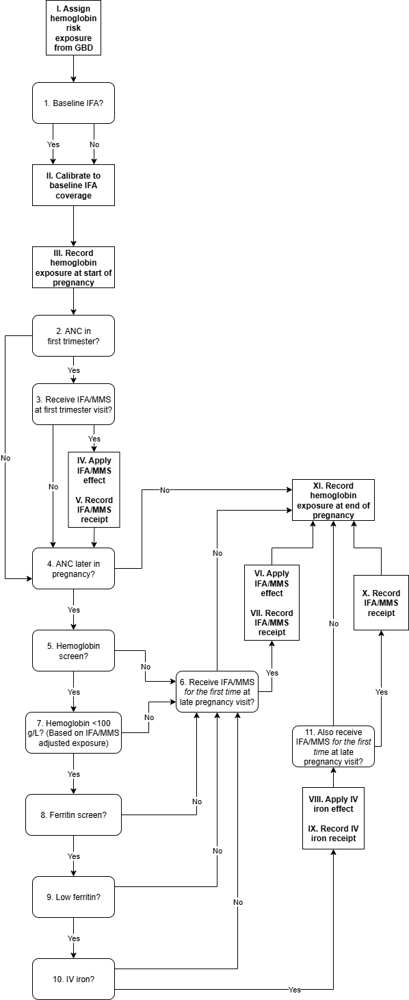

.. role:: underline
    :class: underline

..
  Section title decorators for this document:

  ==============
  Document Title
  ==============

  Section Level 1 (#.0)
  +++++++++++++++++++++

  Section Level 2 (#.#)
  ---------------------

  Section Level 3 (#.#.#)
  ~~~~~~~~~~~~~~~~~~~~~~~

  Section Level 4
  ^^^^^^^^^^^^^^^

  Section Level 5
  '''''''''''''''

  The depth of each section level is determined by the order in which each
  decorator is encountered below. If you need an even deeper section level, just
  choose a new decorator symbol from the list here:
  https://docutils.sourceforge.io/docs/ref/rst/restructuredtext.html#sections
  And then add it to the list of decorators above.

.. _2024_vivarium_mncnh_portfolio_hemoglobin_module:

======================================
Hemoglobin Module
======================================

.. contents::
  :local:
  :depth: 2

1.0 Overview
++++++++++++

This document is the page for the hemoglobin module of the pregnancy component
in the MNCNH Portfolio simulation.

This module will:

  1. Assign starting point hemoglobin exposure based on GBD

  2. Read-in necessary information from ANC module

  3. Modify hemoglobin exposure according to services received during pregnancy

  4. Output the following information:

    - Services received during pregnancy that relate to hemoglobin (for V&V, cost counting)

    - Hemoglobin exposure at the end of pregnancy for hemoglobin risk effect estimation (inputs to downstream models)

.. note::

  This module may have potential dependencies with the hypertension/pre-eclampsia model that have not yet been thought through. Model structure is subject to change in order to accomodate these dependencies.

2.0 Module Diagram and Data
+++++++++++++++++++++++++++++++

2.1 Module Diagram
----------------------

.. note::
  
  As discussed on the :ref:`maternal supplementation intervention document <oral_iron_antenatal>`, IFA and MMS have equivalent effects on hemoglobin. This diagram treats them as equivalent for this reason. However, we will need track which product was received as they have differences that will apply to other downstream modules of this simulation. 

2.2 Module Inputs
---------------------

.. list-table:: Hemoglobin module required inputs
  :header-rows: 1

  * - Input
    - Source module
    - Application
    - Note
  * - First trimester ANC attendance 
    - :ref:`ANC module <2024_vivarium_mncnh_portfolio_anc_module>`
    - Decision node #2
    - (True/False value)
  * - Later pregnancy ANC attendance
    - :ref:`ANC module <2024_vivarium_mncnh_portfolio_anc_module>`
    - Decision node #4
    - (True/False value)

2.3 Module Decision Nodes
-----------------------------

.. list-table:: Hemoglobin module decision nodes
  :header-rows: 1

  * - Decision node
    - Description
    - Information
    - Note
  * - 1
    - ANC in first trimester?
    - As informed from module input (output from :ref:`ANC module <2024_vivarium_mncnh_portfolio_anc_module>`)
    - 
  * - 2
    - Recieve IFA/MMS at first trimester visit?
    - Coverage defined by scenario, see :ref:`pregnancy component scenario table <MNCNH pregnancy component scenario table>`. Probability of "yes" is equal to scenario-specific coverage.
    - Use same propensity value as decision node #5 and #9 to answer this question
  * - 3
    - ANC later in pregnancy?
    - As informed from module input (output from :ref:`ANC module <2024_vivarium_mncnh_portfolio_anc_module>`)
    - 
  * - 4
    - Hemoglobin screen?
    - Coverage defined by scenario, see :ref:`pregnancy component scenario table <MNCNH pregnancy component scenario table>`. Probability of "yes" is equal to scenario-specific coverage.
    - 
  * - 5
    - Receive IFA/MMS *for the first time* at late pregnancy visit?
    - Coverage defined by scenario, see :ref:`pregnancy component scenario table <MNCNH pregnancy component scenario table>`. If answer to decision node #3 is no, then answer to this decision node is also no. Answer can only be yes if ANC attendance==ANC in later pregnancy ONLY. Then, probability of "yes" is equal to scenario-specific coverage.
    - Use same propensity value as decision node #2 and #9 to answer this question
  * - 6 
    - Hemoglobin screening value <100 g/L? (Based on IFA/MMS adjusted exposure)
    - Instructions detailed on the :ref:`anemia screening intervention page <anemia_screening>`
    - 
  * - 7
    - Ferritin screen?
    - Coverage defined by scenario, see :ref:`pregnancy component scenario table <MNCNH pregnancy component scenario table>`. Probability of "yes" is equal to scenario-specific coverage
    - 
  * - 8
    - Low ferritin screening value?
    - Instructions detailed on the :ref:`anemia screening intervention page <anemia_screening>`
    - 
  * - 9
    - IV iron?
    - Coverage defined by scenario, see :ref:`pregnancy component scenario table <MNCNH pregnancy component scenario table>`. Probability of "yes" is equal to scenario-specific coverage.
    - 
  * - 10
    - Also receive IFA/MMS *for the first time* at late pregnancy visit?
    - Coverage defined by scenario, see :ref:`pregnancy component scenario table <MNCNH pregnancy component scenario table>`. If answer to decision node #3 is no, then answer to this decision node is also no. Answer can only be yes if ANC attendance==ANC in later pregnancy ONLY. Then, probability of "yes" is equal to scenario-specific coverage.
    - Use same propensity value as decision node #2 and #5 to answer this question

2.4 Module Action Points
---------------------------

.. list-table:: Hemoglobin module action point
  :header-rows: 1

  * - Action point
    - Description
    - Information
    - Note
  * - I
    - Assign hemoglobin exposure based on GBD
    - See :ref:`hemoglobin risk exposure document <2023_hemoglobin_exposure>`
    - 
  * - II
    - Calibrate to and remove effect of baseline IFA coverage
    - Effect size on hemoglobin defined on :ref:`maternal supplementation intervention document <oral_iron_antenatal>`. We assume no one receives baseline IFA prior to their first ANC visit. Since we are initializing hemoglobin exposure at the start of pregnancy prior to anyone receiving IFA, we subtract the value of :code:`baseline_ifa_coverage * ifa_hemoglobin_shift` from the hemoglobin exposure value of all simulants. 
    - The effect of baseline IFA will be added back in later in the decision tree when simulants receive it at their ANC visits.

  * - III
    - Record hemoglobin exposure at the start of pregnancy
    - Record to output C
    - 
  * - IV
    - Apply IFA/MMS effect
    - Effect size on hemoglobin defined on :ref:`antenatal supplementation intervention document <oral_iron_antenatal>`
    - Use effect size from this page only (ignore instructions for how to apply effects regarding timeline and baseline coverage). Note that IFA and MMS effectively have the same effect on maternal hemoglobin
  * - V
    - Record IFA/MMS receipt
    - Record to output A
    - 
  * - VI
    - Apply IFA/MMS effect
    - Effect size on hemoglobin defined on :ref:`antenatal supplementation intervention document <oral_iron_antenatal>`
    - Use effect size from this page only (ignore instructions for how to apply effects regarding timeline and baseline coverage). Note that IFA and MMS effectively have the same effect on maternal hemoglobin
  * - VII
    - Record IFA/MMS receipt
    - Record to output A
    - 
  * - VIII
    - Apply IV iron effect
    - Effect size on hemoglobin defined on :ref:`intravenous iron intervention document <intervention_iv_iron_antenatal_mncnh>`
    - Ignore instructions regarding timing of effect implementation on this document
  * - IX
    - Record IV iron receipt
    - Record to output B
    - 
  * - X
    - Record receipt of IFA/MMS
    - Record to output A
    - Note that IFA/MMS hemoglobin effect is not applied on top of IV iron effect
  * - XI
    - Record hemoglobin value at end of pregnancy
    - Record to output D
    - 
  * - XII
    - Calculate and record anemia YLDs
    - Done in the :ref:`anemia YLDs module <2024_vivarium_mncnh_portfolio_anemia_module>`
    - 

2.4: Module Outputs
-----------------------

.. list-table:: Hemoglobin module outputs
  :header-rows: 1

  * - Output
    - Value
    - Dependencies
  * - A. Maternal supplementation
    - `ifa` / `mms` / `none`
    - Used for anemia YLD calculation, V&V
  * - B. IV iron
    - `True` / `False`
    - Used for anemia YLD calculation, V&V
  * - C. True hemoglobin at the beginning of pregnancy 
    - point value
    - V&V
  * - D. True hemoglobin at the end of pregnancy
    - point value
    - Value to be used for :ref:`hemoglobin risk effects model <2023_hemoglobin_effects>`, V&V
  * - F. True Hemoglobin at screening
    - point value
    - V&V
  * - G. Test hemoglobin at screening
    - point value
    - V&V
  * - H. Ferritin exposure at screening
    - `low` / `adequate`
    - V&V

3.0 Assumptions and limitations
++++++++++++++++++++++++++++++++

- We assume there are no changes in natural history hemoglobin trajectory throughout pregnancy. 

- We assume immediate effect of oral and IV iron interventions on hemoglobin from intervention receipt.

- We assume complete adherence of oral iron intervention.

- We assume no additional effect of oral iron supplementation when taken following IV iron administration

- We use the fraction of iron responsive anemia among total anemia as a proxy for low ferritin given low hemoglobin. This may underestimate the population eligible for IV iron by not considering the iron non responsive anemias that have low ferritin. Note that this may be improved upon by updating to PRIMSA data.

- We assume the IV iron intervention (+23 g/L) to have a greater effect than GBD 2023's implied effect of IV iron used in the estimation of their iron deficiency models (+14.3 g/L(95% UL:3.58 -25.59). Notably, our assumed effect is within the confidence interval of GBD's assumed effect size and the value we assume is specific to the pregnant population (whereas GBD's value is not).

4.0 Verification and Validation Criteria
+++++++++++++++++++++++++++++++++++++++++

- Baseline simulated hemoglobin distribution (mean and standard deviation) should match the GBD 2023 hemoglobin risk exposure distribution

- Hemoglobin at the start of pregnancy and end of pregnancy should vary in accordance with intervention receipts

- Intervention coverage should match expected values

- IFA/MMS should have expected effect on hemoglobin

- At the individual level, only simulants who attend ANC should receive interventions

- Check that IV iron only given to those with measured low hemoglobin and low ferritin
- Check that IV iron has the intended effect on hemoglobin when given 

- Check that measured and true hemoglobin exposures vary by the expected degree

- Check that low ferritin values match expectations (specific to anemia status)

5.0 References
+++++++++++++++

