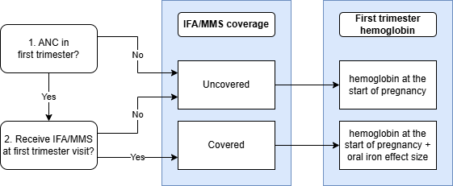
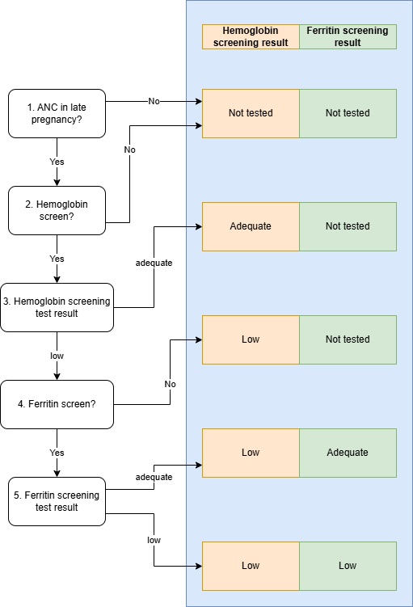
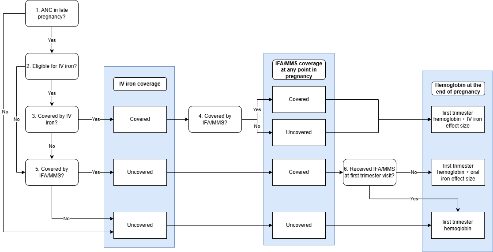

.. role:: underline
    :class: underline

..
  Section title decorators for this document:

  ==============
  Document Title
  ==============

  Section Level 1 (#.0)
  +++++++++++++++++++++

  Section Level 2 (#.#)
  ---------------------

  Section Level 3 (#.#.#)
  ~~~~~~~~~~~~~~~~~~~~~~~

  Section Level 4
  ^^^^^^^^^^^^^^^

  Section Level 5
  '''''''''''''''

  The depth of each section level is determined by the order in which each
  decorator is encountered below. If you need an even deeper section level, just
  choose a new decorator symbol from the list here:
  https://docutils.sourceforge.io/docs/ref/rst/restructuredtext.html#sections
  And then add it to the list of decorators above.

.. _2024_vivarium_mncnh_portfolio_hemoglobin_module:

======================================
Hemoglobin Module
======================================

.. contents::
  :local:
  :depth: 2

1.0 Overview
++++++++++++

This document is the page for the hemoglobin module of the pregnancy component
in the MNCNH Portfolio simulation.

This module will:

  1. Assign starting point hemoglobin exposure based on GBD

  2. Read-in necessary information from ANC module

  3. Modify hemoglobin exposure according to services received during pregnancy

  4. Output the following information:

    - Services received during pregnancy that relate to hemoglobin (for V&V, cost counting)

    - Hemoglobin exposure at the end of pregnancy for hemoglobin risk effect estimation (inputs to downstream models)

To increase ease in modeling, it has been broken into the following submodules

- `Hemoglobin at the Start of Pregnancy Module`_
- `First Trimester Hemoglobin Module`_
- `Anemia Screening Module`_
- `End of Pregnancy Hemoglobin Module`_

.. note::

  This module may have potential dependencies with the hypertension/pre-eclampsia model that have not yet been thought through. Model structure is subject to change in order to accomodate these dependencies.

2.0 Modules
++++++++++++++

Hemoglobin at the Start of Pregnancy Module 
--------------------------------------------

This module will assign a hemoglobin exposure based on the :ref:`GBD hemoglobin risk exposure model <2023_hemoglobin_exposure>` and adjust these exposure to remove the effect of the :ref:`baseline coverage of oral iron supplementation <oral_iron_antenatal>` as we assume that there is zero coverage or oral iron *at the start of pregnancy.* The effect of oral iron supplementation (including baseline coverage) will be added back in subsequent hemoglobin modules on this page.

.. list-table:: Hemoglobin at the start of pregnancy module inputs
  :header-rows: 1

  * - Input
    - Source 
    - Note
  * - Maternal age at end of pregnancy
    - :ref:`Initial attributes module <2024_vivarium_mncnh_portfolio_initial_attributes_module>`
    -
  * - :code:`baseline_ifa_overall`
    - Defined on :ref:`maternal supplementation intervention document <oral_iron_antenatal>`.  
    - Use the :code:`baseline_ifa_overall` parameter rather than :code:`baseline_ifa_at_anc`
  * - :code:`ifa_hemoglobin_shift`
    - Defined on :ref:`maternal supplementation intervention document <oral_iron_antenatal>`
    - 

Complete the following steps for the Hemoglobin at the Start of Pregnancy Module:

1. Assign :code:`gbd_hemoglobin_exposure` according to the :ref:`hemoglobin risk exposure document <2023_hemoglobin_exposure>` at the age-specific level according to maternal age at the end of prenancy as assigned in the :ref:`Initial attributes module <2024_vivarium_mncnh_portfolio_initial_attributes_module>`.

2. Record :code:`hemoglobin_at_the_start_of_pregnancy` as a module output equal to :code:`gbd_hemoglobin_exposure - baseline_ifa_overall * ifa_hemoglobin_shift`

.. list-table:: Hemoglobin at the start of pregnancy module inputs
  :header-rows: 1

  * - Output
    - Value
    - Dependencies
  * - Hemoglobin at the start of pregnancy
    - point value
    - Used as an in input to the :ref:`anemia YLD module <2024_vivarium_mncnh_portfolio_anemia_module>` and `First Trimester Hemoglobin Module`_
    
First Trimester Hemoglobin Module
------------------------------------

This module adds the effect of oral iron supplementation received at a first trimester ANC visit to hemoglobin exposure and records coverage of oral iron supplementation at that first trimester visit as well as hemoglobin exposure modified by coverage of the intervention.

.. list-table:: First trimester hemoglobin module inputs
  :header-rows: 1

  * - Input
    - Source 
    - Note
  * - Hemoglobin at the start of pregnancy
    - `Hemoglobin at the Start of Pregnancy Module`_
    -
  * - Anemia intervention propensity
    - :ref:`Initial attributes module <2024_vivarium_mncnh_portfolio_initial_attributes_module>`
    - 
  * - First trimester ANC attendance
    - :ref:`ANC module <2024_vivarium_mncnh_portfolio_anc_module>`
    - 
  * - Scenario-specific IFA/MMS coverage
    - :ref:`Pregnancy component scenario table <MNCNH pregnancy component scenario table>`
    - 
  * - :code:`ifa_hemoglobin_shift`
    - Defined on :ref:`maternal supplementation intervention document <oral_iron_antenatal>`
    - 

.. list-table:: First trimester hemoglobin module decision nodes
  :header-rows: 1

  * - Decision node
    - Description
    - Information
    - Note
  * - 1
    - ANC in first trimester?
    - Direct input from :ref:`ANC module <2024_vivarium_mncnh_portfolio_anc_module>`
    - "True for ANC attendance exposures in ['first_trimester_only', 'first_trimester_and_later_pregnancy']. False for exposures in ['later_pregnancy_only','none']
  * - 2
    - Receive IFA/MMS at first trimester visit?
    - Use the :ref:`anemia intervention propensity <2024_vivarium_mncnh_portfolio_initial_attributes_module>` and the scenario-specific IFA/MMS coverage value defined in the :ref:`pregnancy component scenario table <MNCNH pregnancy component scenario table>` to determine if an individual simulant is screened for hemoglobin
    - 

.. list-table:: First trimester hemoglobin module outputs
  :header-rows: 1

  * - Output
    - Value
    - Dependencies
  * - Oral iron coverage in first trimester
    - :code:`none` / :code:`ifa` / :code:`mms`
    - Input to `End of Pregnancy Hemoglobin Module`_
  * - First trimester hemoglobin
    - point value
    - Input to `Anemia Screening Module`_

Anemia Screening Module
-------------------------

This module performs the anemia screening interventions, including hemoglobin and ferriting screening testes, at the late pregnancy ANC visit. Anemia exposures should be assessed according to first trimester hemoglobin as output from the `First Trimester Hemoglobin Module`_. The results of the anemia screening tests will be used in subsequent modules to determine eligibility for the IV iron intervention. Additionally, a measure of "true hemoglobin exposure" is an additional output of this module and will be used to assess the sensitivity and specificity of the hemoglobin screening test and a convenient stratifying variable for certain observed outputs for V&V, but this measure will not be used as an input for any subsequent modules.

.. list-table:: Anemia screening module inputs
  :header-rows: 1

  * - Input
    - Source
    - Note
  * - First trimester hemolobin
    - `First Trimester Hemoglobin Module`_
    - 
  * - Later pregnancy ANC attendance
    - :ref:`ANC module <2024_vivarium_mncnh_portfolio_anc_module>`
    - True for ANC attendance exposures in ['later_pregnancy_only', 'first_trimester_and_later_pregnancy']. False for exposures in ['first_trimester_only','none']
  * - Anemia intervention propensity
    - :ref:`Initial attributes module <2024_vivarium_mncnh_portfolio_initial_attributes_module>`
    - 
  * - Hemoglobin screening coverage
    - N/A, defined in the :ref:`pregnancy component scenario table <MNCNH pregnancy component scenario table>`
    - 
  * - Ferritin screening coverage
    - N/A, defined in the :ref:`pregnancy component scenario table <MNCNH pregnancy component scenario table>`
    - 

.. list-table:: Anemia screening module decision nodes
  :header-rows: 1

  * - Decision node
    - Description
    - Information
    - Note
  * - 1
    - ANC later in pregnancy?
    - Direct input from :ref:`ANC module <2024_vivarium_mncnh_portfolio_anc_module>`
    - "Yes" for ANC attendance exposures in ['later_pregnancy_only', 'first_trimester_and_later_pregnancy']. "No" for exposures in ['first_trimester_only','none']
  * - 2
    - Hemoglobin screen?
    - Use the :ref:`anemia intervention propensity <2024_vivarium_mncnh_portfolio_initial_attributes_module>` and the scenario-specific hemoglobin screening coverage value defined in the :ref:`pregnancy component scenario table <MNCNH pregnancy component scenario table>` to determine if an individual simulant is screened for hemoglobin
    - 
  * - 3
    - Hemoglobin screening test result
    - Use the instructions detailed on the :ref:`anemia screening intervention page <anemia_screening>` to determine hemoglobin screening test result based on first trimester hemolobin exposure output from the `First Trimester Hemoglobin Module`_
    - 
  * - 4
    - Ferritin screen?
    - Use the :ref:`anemia intervention propensity <2024_vivarium_mncnh_portfolio_initial_attributes_module>` and the scenario-specific ferritin screening coverage value defined in the :ref:`pregnancy component scenario table <MNCNH pregnancy component scenario table>` to determine if an individual simulant is screened for hemoglobin.
    - 
  * - 5
    - Ferritin screening test result
    - Use the instructions detailed on the :ref:`anemia screening intervention page <anemia_screening>`. Anemia status should be assessed according to first trimester hemolobin exposure output from the `First Trimester Hemoglobin Module`_.
    - 

.. list-table:: Anemia screening module outputs
  :header-rows: 1

  * - Output
    - Value
    - Dependencies
  * - Hemoglobin screening result
    - :code:`not_tested` / :code:`low` / :code:`adequate`
    - V&V (via observation), simulation result
  * - Ferritin screening result
    - :code:`not_tested` / :code:`low` / :code:`adequate`
    - V&V (via observation), simulation result
  * - True hemoglobin exposure
    - :code:`low` if first trimester hemoglobin <100 g/L, :code:`adequate if first trimester hemoglobin 100+ g/L`
    - Used for V&V (via observation) to assess sensitivity and specificity of the hemoglobin screening test and as a convenient stratifying variable for specific observed outcomes. Not used as an input to any other module.

End of Pregnancy Hemoglobin Module
-------------------------------------------

This module applies the effect of the IV iron intervention for those who received it and applies the effect of oral iron intervention for those who have not already received the effect from their earlier first trimester ANC visit. Only those who have "low" test results for both the hemoglobin and ferritin screenings are eligible for IV iron. We assume that among those who receive both IV and oral iron interventions at the later pregnancy ANC visit, they receive only the effect of IV iron on their hemoglobin exposure rather than the additive impact of both interventions.

.. list-table:: End of pregnancy hemoglobin module inputs
  :header-rows: 1

  * - Input
    - Source
    - Note
  * - First trimester hemolobin
    - `First Trimester Hemoglobin Module`_
    - 
  * - Later pregnancy ANC attendance
    - :ref:`ANC module <2024_vivarium_mncnh_portfolio_anc_module>`
    - True for ANC attendance exposures in ['later_pregnancy_only', 'first_trimester_and_later_pregnancy']. False for exposures in ['first_trimester_only','none']
  * - Anemia intervention propensity
    - :ref:`Initial attributes module <2024_vivarium_mncnh_portfolio_initial_attributes_module>`
    - 
  * - Hemoglobin screening test result
    - `Anemia Screening Module`_ output
    - 
  * - Ferritin screening test result
    - `Anemia Screening Module`_ output
    - 
  * - Scenario-specific IFA/MMS coverage
    - Defined in the :ref:`pregnancy component scenario table <MNCNH pregnancy component scenario table>`
    - 
  * - Scenario-specific IFA/MMS coverage
    - Defined in the :ref:`pregnancy component scenario table <MNCNH pregnancy component scenario table>`
    - 

.. list-table:: End of pregnancy hemoglobin module decision nodes
  :header-rows: 1

  * - Decision node
    - Description
    - Information
    - Note
  * - 1
    - ANC later in pregnancy?
    - Direct input from :ref:`ANC module <2024_vivarium_mncnh_portfolio_anc_module>`
    - "Yes" for ANC attendance exposures in ['later_pregnancy_only', 'first_trimester_and_later_pregnancy']. "No" for exposures in ['first_trimester_only','none']
  * - 2
    - Eligible for IV iron?
    - True for thoes with hemoglobin_screening_test_result==True AND ferritin_screening_test_result==True. False for all other simulants
    - Hemoglobin and ferritin screening test results output from the `Anemia Screening Module`_
  * - 3
    - Covered by IV iron?
    - Use the :ref:`anemia intervention propensity <2024_vivarium_mncnh_portfolio_initial_attributes_module>` and the scenario-specific IV Iron coverage value defined in the :ref:`pregnancy component scenario table <MNCNH pregnancy component scenario table>` to determine if an individual simulant is screened for hemoglobin.
    - 
  * - 4
    - Covered by IFA/MMS?
    - Use the :ref:`anemia intervention propensity <2024_vivarium_mncnh_portfolio_initial_attributes_module>` and the scenario-specific IFA/MMS coverage value defined in the :ref:`pregnancy component scenario table <MNCNH pregnancy component scenario table>` to determine if an individual simulant is screened for hemoglobin.
    - 
  * - 5
    - Covered by IFA/MMS?
    - Use the :ref:`anemia intervention propensity <2024_vivarium_mncnh_portfolio_initial_attributes_module>` and the scenario-specific IFA/MMS coverage value defined in the :ref:`pregnancy component scenario table <MNCNH pregnancy component scenario table>` to determine if an individual simulant is screened for hemoglobin.
    - 
  * - 6
    - Received IFA/MMS at first trimester ANC visit?
    - Direct input from the `First Trimester Hemoglobin Module`_
    - Note that another way to answer this question would be if ANC attendance == 'first_trimester_and_later_pregnancy'

.. list-table:: End of pregnancy hemoglobin module outputs
  :header-rows: 1

  * - Output
    - Value
    - Dependencies
  * - IV iron coverage
    - :code:`covered` / :code:`uncovered`
    - V&V (via observation), simulation result
  * - Oral iron coverage at any time in pregnancy
    - :code:`none` / :code:`ifa` / :code:`mms`
    - V&V (via observation), simulation result
  * - Hemoglobin at the end of pregnancy
    - point value
    - Used to inform the risk effects of the hemoglobin risk factor (as an input to the :ref:`Pregnancy <2024_vivarium_mncnh_portfolio_pregnancy_module>`, :ref:`Maternal disorders <2024_vivarium_mncnh_portfolio_maternal_disorders_module>`, and the :ref:`Postpartum depression <2024_vivarium_mncnh_portfolio_ppd_module>` modules. Also used as an input to the :ref:`Anemia YLDs <2024_vivarium_mncnh_portfolio_anemia_module>`.

3.0 Assumptions and limitations
++++++++++++++++++++++++++++++++

- We assume there are no changes in natural history hemoglobin trajectory throughout pregnancy,
  including when a pregnancy spans GBD age groups (we use the age group at the *end* of pregnancy to determine hemoglobin).

- We assume immediate effect of oral and IV iron interventions on hemoglobin from intervention receipt.

- We assume complete adherence of oral iron intervention.

- We assume no additional effect of oral iron supplementation when taken following IV iron administration

- We use the fraction of iron responsive anemia among total anemia as a proxy for low ferritin given low hemoglobin. This may underestimate the population eligible for IV iron by not considering the iron non responsive anemias that have low ferritin. Note that this may be improved upon by updating to PRISMA data.

- We assume the IV iron intervention (+23 g/L) to have a greater effect than GBD 2023's implied effect of IV iron used in the estimation of their iron deficiency models, +14.3 g/L(95% UI: 3.58 -25.59). Notably, our assumed effect is within the uncertainty interval of GBD's assumed effect size and the value we assume is specific to the pregnant population (whereas GBD's value is not).

4.0 Verification and Validation Criteria
+++++++++++++++++++++++++++++++++++++++++

- Baseline simulated hemoglobin distribution (mean and standard deviation) should match the GBD 2023 hemoglobin risk exposure distribution

- Hemoglobin at the start of pregnancy and end of pregnancy should vary in accordance with intervention receipts

- Intervention coverage should match expected values

- IFA/MMS should have expected effect on hemoglobin

- At the individual level, only simulants who attend ANC should receive interventions

- Check that IV iron only given to those with measured low hemoglobin and low ferritin
- Check that IV iron has the intended effect on hemoglobin when given 

- Check that measured and true hemoglobin exposures vary by the expected degree

- Check that low ferritin values match expectations (specific to anemia status)

5.0 References
+++++++++++++++

