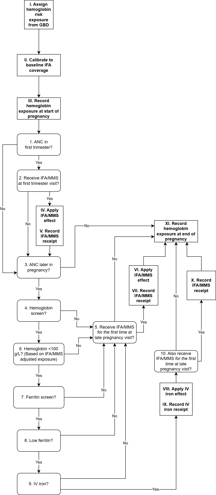

.. role:: underline
    :class: underline

..
  Section title decorators for this document:

  ==============
  Document Title
  ==============

  Section Level 1 (#.0)
  +++++++++++++++++++++

  Section Level 2 (#.#)
  ---------------------

  Section Level 3 (#.#.#)
  ~~~~~~~~~~~~~~~~~~~~~~~

  Section Level 4
  ^^^^^^^^^^^^^^^

  Section Level 5
  '''''''''''''''

  The depth of each section level is determined by the order in which each
  decorator is encountered below. If you need an even deeper section level, just
  choose a new decorator symbol from the list here:
  https://docutils.sourceforge.io/docs/ref/rst/restructuredtext.html#sections
  And then add it to the list of decorators above.

.. _2024_vivarium_mncnh_portfolio_hemoglobin_module:

======================================
Hemoglobin Module
======================================

.. contents::
  :local:
  :depth: 2

1.0 Overview
++++++++++++

This document is the page for the hemoglobin module of the pregnancy component
in the MNCNH Portfolio simulation.

This module will:

  1. Assign starting point hemoglobin exposure based on GBD

  2. Read-in necessary information from ANC module

  3. Modify hemoglobin exposure according to services received during pregnancy

  4. Output the following information:

    - Services received during pregnancy that relate to hemoglobin (for V&V, cost counting)

    - Hemoglobin exposure at the end of pregnancy for hemoglobin risk effect estimation (inputs to downstream models)

.. note::

  This module may have potential dependencies with the hypertension/pre-eclampsia model that have not yet been thought through. Model structure is subject to change in order to accomodate these dependencies.

2.0 Module Diagram and Data
+++++++++++++++++++++++++++++++

2.1 Module Diagram
----------------------

.. note::
  
  As discussed on the :ref:`maternal supplementation intervention document <oral_iron_antenatal>`, IFA and MMS have equivalent effects on hemoglobin. This diagram treats them as equivalent for this reason. However, we will need track which product was received as they have differences that will apply to other downstream modules of this simulation. 

2.2 Module Inputs
---------------------

.. list-table:: Hemoglobin module required inputs
  :header-rows: 1

  * - Input
    - Source module
    - Application
    - Note
  * - Maternal age at end of pregnancy
    - :ref:`Initial attributes module <2024_vivarium_mncnh_portfolio_initial_attributes_module>`
    - Action point I
    -
  * - First trimester ANC attendance 
    - :ref:`ANC module <2024_vivarium_mncnh_portfolio_anc_module>`
    - Decision node #2
    - (True/False value)
  * - Later pregnancy ANC attendance
    - :ref:`ANC module <2024_vivarium_mncnh_portfolio_anc_module>`
    - Decision node #4
    - (True/False value)

2.3 Module Decision Nodes
-----------------------------

.. list-table:: Hemoglobin module decision nodes
  :header-rows: 1

  * - Decision node
    - Description
    - Information
    - Note
  * - 1
    - ANC in first trimester?
    - As informed from module input (output from :ref:`ANC module <2024_vivarium_mncnh_portfolio_anc_module>`)
    - 
  * - 2
    - Recieve IFA/MMS at first trimester visit?
    - Coverage defined by scenario, see :ref:`pregnancy component scenario table <MNCNH pregnancy component scenario table>`. Probability of "yes" is equal to scenario-specific coverage.
    - Use same propensity value as decision node #5 and #9 to answer this question
  * - 3
    - ANC later in pregnancy?
    - As informed from module input (output from :ref:`ANC module <2024_vivarium_mncnh_portfolio_anc_module>`)
    - 
  * - 4
    - Hemoglobin screen?
    - Coverage defined by scenario, see :ref:`pregnancy component scenario table <MNCNH pregnancy component scenario table>`. Probability of "yes" is equal to scenario-specific coverage.
    - 
  * - 5
    - Receive IFA/MMS *for the first time* at late pregnancy visit?
    - Coverage defined by scenario, see :ref:`pregnancy component scenario table <MNCNH pregnancy component scenario table>`. If answer to decision node #3 is no, then answer to this decision node is also no. Answer can only be yes if ANC attendance==ANC in later pregnancy ONLY. Then, probability of "yes" is equal to scenario-specific coverage.
    - Use same propensity value as decision node #2 and #9 to answer this question
  * - 6 
    - Hemoglobin screening value <100 g/L? (Based on IFA/MMS adjusted exposure)
    - Instructions detailed on the :ref:`anemia screening intervention page <anemia_screening>`
    - 
  * - 7
    - Ferritin screen?
    - Coverage defined by scenario, see :ref:`pregnancy component scenario table <MNCNH pregnancy component scenario table>`. Probability of "yes" is equal to scenario-specific coverage
    - 
  * - 8
    - Low ferritin screening value?
    - Instructions detailed on the :ref:`anemia screening intervention page <anemia_screening>`
    - 
  * - 9
    - IV iron?
    - Coverage defined by scenario, see :ref:`pregnancy component scenario table <MNCNH pregnancy component scenario table>`. Probability of "yes" is equal to scenario-specific coverage.
    - 
  * - 10
    - Also receive IFA/MMS *for the first time* at late pregnancy visit?
    - Coverage defined by scenario, see :ref:`pregnancy component scenario table <MNCNH pregnancy component scenario table>`. If answer to decision node #3 is no, then answer to this decision node is also no. Answer can only be yes if ANC attendance==ANC in later pregnancy ONLY. Then, probability of "yes" is equal to scenario-specific coverage.
    - Use same propensity value as decision node #2 and #5 to answer this question

2.4 Module Action Points
---------------------------

.. list-table:: Hemoglobin module action point
  :header-rows: 1

  * - Action point
    - Description
    - Information
    - Note
  * - I
    - Assign hemoglobin exposure based on GBD
    - See :ref:`hemoglobin risk exposure document <2023_hemoglobin_exposure>`
    - Uses maternal age at end of pregnancy
  * - II
    - Calibrate to and remove effect of baseline IFA coverage
    - Effect size on hemoglobin and baseline coverage defined on :ref:`maternal supplementation intervention document <oral_iron_antenatal>`. We assume no one receives baseline IFA prior to their first ANC visit. Since we are initializing hemoglobin exposure at the start of pregnancy prior to anyone receiving IFA, we subtract the value of :code:`baseline_ifa_overall * ifa_hemoglobin_shift` from the hemoglobin exposure value of all simulants. Use the :code:`baseline_ifa_overall` parameter rather than :code:`baseline_ifa_at_anc`
    - The effect of baseline IFA will be added back in later in the decision tree when simulants receive it at their ANC visits. 
  * - III
    - Record hemoglobin exposure at the start of pregnancy
    - Record to output
    - 
  * - IV
    - Apply IFA/MMS effect
    - Effect size on hemoglobin defined on :ref:`antenatal supplementation intervention document <oral_iron_antenatal>`
    - Note that IFA and MMS effectively have the same effect on maternal hemoglobin
  * - V
    - Record IFA/MMS receipt
    - Record to output
    - 
  * - VI
    - Apply IFA/MMS effect
    - Effect size on hemoglobin defined on :ref:`antenatal supplementation intervention document <oral_iron_antenatal>`
    - Note that IFA and MMS effectively have the same effect on maternal hemoglobin
  * - VII
    - Record IFA/MMS receipt
    - Record to output
    - 
  * - VIII
    - Apply IV iron effect
    - Effect size on hemoglobin defined on :ref:`intravenous iron intervention document <intervention_iv_iron_antenatal_mncnh>`
    - Ignore instructions regarding timing of effect implementation on this document
  * - IX
    - Record IV iron receipt
    - Record to output
    - 
  * - X
    - Record receipt of IFA/MMS
    - Record to output
    - Note that IFA/MMS hemoglobin effect is not applied on top of IV iron effect
  * - XI
    - Record hemoglobin value at end of pregnancy
    - Record to output
    - 

2.4: Module Outputs
-----------------------

.. list-table:: Hemoglobin module outputs
  :header-rows: 1

  * - Output
    - Value
    - Dependencies
  * - IFA/MMS coverage
    - "ifa" or "mms" or "none"
    - Used for anemia YLD calculation, V&V, simulation result 
  * - IV iron coverage
    - "True" or "False"
    - Used for anemia YLD calculation, V&V, simulation result 
  * - True hemoglobin at the beginning of pregnancy 
    - point value
    - Used for anemia YLD calculation, V&V (via interactive context)
  * - True hemoglobin at the end of pregnancy
    - point value
    - Value to be used for :ref:`hemoglobin risk effects model <2023_hemoglobin_effects>`, used for anemia YLD calculation, V&V (via interactive context)
  * - True hemoglobin at screening
    - "low" or "adequate"
    - V&V (via observation)
  * - Tests hemoglobin exposure
    - "low" or "adequate"
    - V&V (via observation)
  * - Ferritin exposure at screening
    - "low" or "adequate"
    - V&V (via observation)

2.5: Python implementation summary
----------------------------------

The Python below shows possible implementation steps that are compatible with the diagram defined above. 

.. code-block:: python 

  # step 1: remove effect of baseline IFA from everyone
  hgb_start_of_pregnancy = gbd_hgb_exposure - ifa_effect_size * baseline_ifa_overall

  # step 2: apply first trimester oral iron effect
  hgb_after_first_trimester_anc = (
    hgb_start_of_pregnancy + ifa_effect_size
    if (anc_attendance in ['first_trimester_only', 'later_pregnancy_and_first_trimester'])
      and oral_iron_covered
    else
    hgb_start_of_pregnancy
  )

  # step 3: assess IV iron coverage based on hgb_after_first_trimester_anc exposure and other attributes

  # anemia screening: see anemia screening page for documentation
  # note that we use hgb_after_first_trimester_anc for this
  actual_low_hemoglobin = hgb_after_first_trimester_anc < 100
  probability_test_low_hemoglobin = (
    HEMOGLOBIN_SCREENING_SENSITIVITY
    if actual_low_hemoglobin
    else
    1 - HEMOGLOBIN_SCREENING_SPECIFICITY
  )
  test_low_hemoglobin = np.random.choice(
    [True, False],
    p=[probability_test_low_hemoglobin, 1 - probability_test_low_hemoglobin]
  )
  # end anemia screening

  received_iv_iron = (
    anc_attendance in ['later_pregnancy_only', 'first_trimester_and_later_pregnancy']
      and hemoglobin_screen_covered 
      and test_low_hemoglobin
      and low_ferritin_exposure 
      and iv_iron_covered
  )

  # step 4: apply later pregnancy ANC oral iron effects effects
  hgb_at_after_later_pregnancy = hgb_after_first_trimester_anc + (
    ifa_effect_size
    if (anc_attendance == 'later_pregnancy_only')
      and oral_iron_covered
      and not received_iv_iron
    else
    0
  )

  # step 5: apply IV iron effect size
  hgb_at_birth = hgb_at_after_later_pregnancy + (
    iv_iron_effect_size
    if received_iv_iron
    else
    0
  )

3.0 Assumptions and limitations
++++++++++++++++++++++++++++++++

- We assume immediate effect of oral and IV iron interventions on hemoglobin from intervention receipt.

- We assume complete adherence of oral iron intervention.

- We assume no additional effect of oral iron supplementation when taken following IV iron administration

- We use the fraction of iron responsive anemia among total anemia as a proxy for low ferritin given low hemoglobin. This may underestimate the population eligible for IV iron by not considering the iron non responsive anemias that have low ferritin. Note that this may be improved upon by updating to PRISMA data.

- We assume the IV iron intervention (+23 g/L) to have a greater effect than GBD 2023's implied effect of IV iron used in the estimation of their iron deficiency models, +14.3 g/L(95% UI: 3.58 -25.59). Notably, our assumed effect is within the uncertainty interval of GBD's assumed effect size and the value we assume is specific to the pregnant population (whereas GBD's value is not).

- GBD assesses pregnancy-specific anemia burden among live births and stillbirths only and not among pregnancies that result in abortion/miscarriage/ectopic pregnancy. We apply the pregnancy hemoglobin adjustment factor to all pregnancies regardless of outcome. 

- We assume there are no changes in natural history hemoglobin trajectory throughout pregnancy, including when a pregnancy spans GBD age groups (we use the age group at the *end* of pregnancy to determine hemoglobin). The natural history of hemoglobin throughout pregnancy among "frequent" and "infrequent" users of oral iron supplements was assessed by [Yefet-et-al-2021]_, with a figure included below for easy reference. Rather than modeling a decreasing hemoglobin over the first two trimesters followed by a rebound in the third trimester, we assume that hemoglobin is constant at the approximate average exposure over the course of pregnancy for the entirety of that pregnancy. This limits our model in the following ways:

.. image:: hemoglobin_trajectory.PNG

- By not modeling the "dip" in hemoglobin observered  the 28 weeks of gestation we will underestimate the portion of the population that meets the eligibility criteria for IV iron at any point in their pregnancy.

- Our model does not consider the interaction between ANC attendance timing and hemoglobin exposure trajectory throughout pregnancy as it relates to assessment of IV iron eligibility by anemia screening. For instance, a given pregnancy would be assessed as eligible for IV iron if screened at 28 weeks gestation, but not if they were screened at 15 or 35 weeks. We assume that simulants have an equal likelihood of IV iron eligibility at any point in their second or third trimester.

- Our model assumes that the effect of iron interventions in pregnancy is not modified by gestational age at birth. Additionally, we assume that there is no association between gestational age at birth and hemoglobin exposure at birth, which is also implied from these findings. The findings from [Yefet-et-al-2021]_ imply that both of these dynamics are present.

- Our calibration of anemia YLDs throughout pregnancy will be off to what is expected in reality. However, our model remains in line with GBD methodology and its associated limitations with respect to anemia YLDs in pregnancy.

- By applying the effect of oral iron supplementation given in the first trimester to hemoglobin exposure immediately, we will likely overestimate the impact of this intervention on hemoglobin exposure in the second trimester. This will cause us to overestimate the reduction in anemia YLDs in the first and second trimesters. We will also overestimate the reduction that oral iron supplementation has on the population eligible for IV iron that is assessed during the second trimester (although less so when assessed during the third trimester). However, as we are not modeling the number or timing of ANC visits in the second and third trimesters, we do not have the modeling resolution to address these issues.

- We do not allow for the possibility that oral iron received early in the second trimester may prevent IV iron eligibility at a subsequent ANC visit later in the second or third trimester.

.. todo::

  Note that the most comprehensive strategy here would be to:

    - Model hemoglobin trajectory throughout pregnancy as informed from evidence from sources such as [Yefet-et-al-2021]_

    - Model gestational week-specific effects of our oral iron intervention (from sources such as [Yefet-et-al-2021]_)

    - Model adherence-specific effects of oral iron supplementation (from sources such as [Yefet-et-al-2021]_)

    - Model more detailed ANC visit patterns (including timing and frequency) to reflect a more realistic opportunity to detect pregnancies that are eligible for IV iron (DHS and the health system team have more information on the number of ANC visits per pregnancy)

4.0 Verification and Validation Criteria
+++++++++++++++++++++++++++++++++++++++++

- Baseline simulated hemoglobin distribution (mean and standard deviation) should match the GBD 2023 hemoglobin risk exposure distribution

- Hemoglobin at the start of pregnancy and end of pregnancy should vary in accordance with intervention receipts

- Intervention coverage should match expected values

- IFA/MMS should have expected effect on hemoglobin

- At the individual level, only simulants who attend ANC should receive interventions

- Check that IV iron only given to those with measured low hemoglobin and low ferritin
- Check that IV iron has the intended effect on hemoglobin when given 

- Check that measured and true hemoglobin exposures vary by the expected degree

- Check that low ferritin values match expectations (specific to anemia status)

5.0 References
+++++++++++++++

.. [Yefet-et-al-2021]

  Yefet, E., Yossef, A. & Nachum, Z. Prediction of anemia at delivery. Sci Rep 11, 6309 (2021). `https://doi.org/10.1038/s41598-021-85622-7 <https://doi.org/10.1038/s41598-021-85622-7>`__