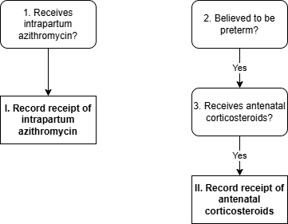

.. role:: underline
    :class: underline

..
  Section title decorators for this document:

  ==============
  Document Title
  ==============

  Section Level 1 (#.0)
  +++++++++++++++++++++

  Section Level 2 (#.#)
  ---------------------

  Section Level 3 (#.#.#)
  ~~~~~~~~~~~~~~~~~~~~~~~

  Section Level 4
  ^^^^^^^^^^^^^^^

  Section Level 5
  '''''''''''''''

  The depth of each section level is determined by the order in which each
  decorator is encountered below. If you need an even deeper section level, just
  choose a new decorator symbol from the list here:
  https://docutils.sourceforge.io/docs/ref/rst/restructuredtext.html#sections
  And then add it to the list of decorators above.

.. _2024_vivarium_mncnh_portfolio_intrapartum_interventions_module:

======================================
Intrapartum intervention module
======================================

.. contents::
  :local:
  :depth: 2

1.0 Overview
++++++++++++

.. todo::

  Update this page to include the misoprostol intervention

This module in the intrapartum component determines coverage of intrapartum interventions, including azithromycin and corticosteroids (and eventually intrapartum sensors in wave II). Coverage availability/eligibility will depend on birth facility and believed gestational age.

2.0 Module Diagram and Data
+++++++++++++++++++++++++++++++

2.1 Module Diagram
----------------------

2.2 Module Inputs
---------------------

.. list-table:: Module required inputs
  :header-rows: 1

  * - Input
    - Source module
    - Application
    - Note
  * - Pregnancy term
    - :ref:`Pregnancy module <2024_vivarium_mncnh_portfolio_pregnancy_module>`
    - Partial term pregnancies do not proceed through this module
    - 
  * - Birth facility
    - :ref:`Facility choice <2024_vivarium_mncnh_portfolio_facility_choice_module>`
    - Determines intervention availability
    - 
  * - Believed gestational age
    - :ref:`AI ultrasound <2024_vivarium_mncnh_portfolio_ai_ultrasound_module>`
    - Affects antenatal corticosteroid coverage (decision node #2)
    - Only births believed to be preterm are eligible for coverage

2.3 Module Decision Nodes
-----------------------------

.. list-table:: Module decision nodes
  :header-rows: 1

  * - Decision node
    - Description
    - Information
    - Note
  * - 1
    - Receives intrapartum azithromycin?
    - Scenario-dependent variable: :ref:`intrapartum component scenario table <MNCNH intrapartum component scenario table>` for values (and baseline coverage section below for baseline coverage)
    - 
  * - 2
    - Believed to be preterm?
    - Believed gestational age (from pregnancy module output) < 37 weeks
    - Note necessary unit conversion between days and weeks
  * - 3
    - Receives antenatal corticosteroids
    - Scenario-dependent variable: :ref:`intrapartum component scenario table <MNCNH intrapartum component scenario table>` for values (and baseline coverage section below for baseline coverage)
    - 

2.3.1 Baseline coverage
~~~~~~~~~~~~~~~~~~~~~~~~~

**Intrapartum azithromycin:** 

  * Home birth: 10%

  * Hospital birth: 67.7%

  * Clinic/low-level birth: 18.5%

Source: SARA (Ehtiopia; Table 3.8.2). These are placeholder values (percentage of each facility type that have azithromycin, not the percentage of pregnancies that receive it) and will be updated with further analysis. We want these to be location specific, please code accordingly.

**Antenatal corticosteroids:** (percentage of believed preterm births)

  * Home birth: 1%

  * Hospital birth: 12%

  * Clinic/low-level birth: 2%

Source: EmONC (Ethiopia; Table 10.5.4A). These are placeholder values and will be updated with further analysis. We want these to be location specific, please code accordingly. The denominator for these values is LBW and preterm births. Outstanding items: believe this only affected neonatal outcomes, confirm with BMGF

.. todo::

  Update terminology to be consistent with BEMONC/CEMONC?

2.4 Module Action Points
---------------------------

.. list-table:: Module action point
  :header-rows: 1

  * - Action point
    - Description
    - Information
    - Note
  * - I
    - Record receipt of intrapartum azithromycin
    - Record to output A
    - 
  * - II
    - Record receipt of antenatal corticosteroids
    - Record to output B
    - 

2.4: Module Outputs
-----------------------

.. list-table:: Module outputs
  :header-rows: 1

  * - Output
    - Value
    - Note
  * - A. Intrapartum azithromycin coverage
    - *True* / *False*
    - 
  * - B. Antenatal corticosteroid coverage
    - *True* / *False*
    - Coverage can only be *True* if gestational age is believed to be < 37 weeks

3.0 Assumptions and limitations
++++++++++++++++++++++++++++++++

.. todo::

  List module assumptions and limitations

4.0 Verification and Validation Criteria
+++++++++++++++++++++++++++++++++++++++++

* Confirm rates of simulants receiving azithromycin and corticosteroid matches inputs

* Confirm no simulants believed to be >37 weeks gestational age at birth recieve corticosteroids

5.0 References
+++++++++++++++

