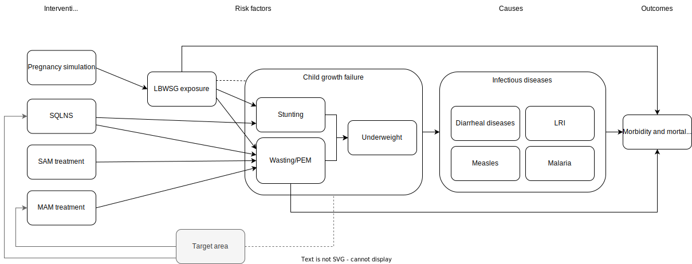

.. role:: underline
    :class: underline

..
  Section title decorators for this document:

  ==============
  Document Title
  ==============

  Section Level 1 (#.0)
  +++++++++++++++++++++

  Section Level 2 (#.#)
  ---------------------

  Section Level 3 (#.#.#)
  ~~~~~~~~~~~~~~~~~~~~~~~

  Section Level 4
  ^^^^^^^^^^^^^^^

  Section Level 5
  '''''''''''''''

  The depth of each section level is determined by the order in which each
  decorator is encountered below. If you need an even deeper section level, just
  choose a new decorator symbol from the list here:
  https://docutils.sourceforge.io/docs/ref/rst/restructuredtext.html#sections
  And then add it to the list of decorators above.

.. _2021_concept_model_vivarium_nutrition_optimization_children:

===================================================
Nutrition Optimization Concept Model: CHILDREN
===================================================

.. contents::
  :local:

1.0 Overview
++++++++++++

This is the concept model document for the CHILD component of the Nutrition Optimization simulation model.
Documents that contain information specific to the overall model and the pregnancy subcomponent can be found here:

- :ref:`Overall nutrition optimization concept model document <2021_concept_model_vivarium_nutrition_optimization>`

- :ref:`Pregnancy subcomponent concept model <2021_concept_model_vivarium_nutrition_optimization_pregnancies>`

.. _nutritionoptimizationchild2.0:

1.1 Modeling aims and objectives
---------------------------------

1.2 Outstanding questions and/or high-level to-dos
-------------------------------------------------------

**Outstanding questions/to-dos:**

- Determine how to handle the :ref:`wasting treatment propensity strategy as described here <WastingPropensityNote>` for the baseline scenario 

  - In short, the optimization protocol generally assumes that all interventions have the same propensity, although the child wasting treatment modeling strategy has a randomly generated propensity value upon each wasting transition. 

  - Note that this should only affect the baseline scenario as it is the only scenario in which wasting treatment coverage values will not equal zero or one.

**Notes/reminders:**

- We have chosen to exclude the "vicious cycle" feedback model from diarrheal diseases to child wasting in this simulation for the following reasons:

  - Inclusion of this effect would require "backing out" the direct effect of SQ-LNS on wasting exposure from the total effect of SQ-LNS on wasting exposure as mediated through the feedback cycle with diarrheal diseases as to not "double count" any effects of SQ-LNS on child wasting exposure.

  - This simulation model does not include any interventions that directly reduce diarrheal disease incidence rates, so it is not a pathway by which interventions primarily affect intervention outcomes.

  - The impact of child wasting on diarrheal diseases *incidence* is relatively small in magnitude (the majority of the effect applies to diarrheal diseases *mortality*). Therefore, the effect of feedback loop between *incidence* of wasting and *incidence* of diarrhea is expected to be modest.

- We have chosen to exclude the x-factor model of heterogeneity in wasting incidence rates calibrated to wasting treatment relapse data from this simulation for the following reasons:

  - This model made little difference in population-level intervention impact estimates when included in the CIFF project.

  - This model requires robust external calibration.

  - We are not considering any interventions that are directly targeted to the "x-factor." Instead, we will target interventions to a separate "target area" risk factor that will incorporate heterogeneity in wasting incidence rates. 

2.0 Model design
++++++++++++++++

2.1 Concept model diagram
-------------------------

2.2 Waves, GBD Rounds, and age groups
-------------------------------------

We will separate the implementation of the child model into two waves of updates. 
In addition to other differences detailed in the next section:

- Wave I will use GBD 2019 data, with the exception of using GBD 2021 data for child growth failure risk exposure and risk effects.

- Wave II will use GBD 2021 data for the entire model.

Notably, GBD 2021 uses different age groups than GBD 2019 (as summarized in the 
tables below). Therefore, the Wave I implementation that uses data from both GBD 
2019 and 2021 will require a hybrid approach that was used in the CIFF and wasting 
paper simulations. In this hybrid approach, the simulation uses GBD 2021 age groups 
for the entire simulation, but informs rates for these age groups from pooled 2019 
age groups for parameters other than child growth failure risk exposures and 
effects. For instance, cause model data for the 1-5 month and 6-11 month age groups 
in the simulation will be informed using data specific to the post neonatal age group from 2019.

.. list-table:: GBD 2019 age groups
  :header-rows: 1

  * - Age group
    - Age range
    - Age group ID
  * - early_neonatal
    - 0-6 days
    - 2
  * - late_neonatal
    - 7-28 days
    - 3
  * - post_neonatal
    - 28 days to 1 year
    - 4
  * - 1_to_4_years
    - 1 to 4 years
    - 5

.. list-table:: GBD 2021 age groups
  :header-rows: 1

  * - Age group
    - Age range
    - Age group ID
  * - early_neonatal
    - 0-6 days
    - 2
  * - late_neonatal
    - 7-28 days
    - 3
  * - 1-5_months
    - 1-5 months
    - 388
  * - 6-11_months
    - 6-11 months
    - 389
  * - 12_to_23_months
    - 12-23 months
    - 238
  * - 2_to_4_years
    - 2-4 years
    - 34

2.3 Submodels
-------------

.. list-table:: Risk exposure subcomponents
  :header-rows: 1

  * - Component
    - Existing version
    - Wave I update
    - Wave II update
    - Note
  * - LBWSG exposure
    - :ref:`2019 docs<2019_risk_exposure_lbwsg>`, implemented in IV iron
    - Artifact rebuild
    - 
    - 
  * - Child wasting exposure
    - :ref:`2020 docs<2020_risk_exposure_wasting_state_exposure>`, implemented in wasting paper
    - :ref:`Updated docs for children 6-59 months <2021_risk_exposure_wasting_state_exposure>` (use transitions rate values linked in .csv file) use :ref:`static wasting exposure <2020_risk_exposure_static_wasting>` for children 0-6 months of age (as implemented in IV iron)
    - :ref:`Updated documentation for children 0-6 months included in wasting exposure model document <2021_risk_exposure_wasting_state_exposure>`
    - (Does not require separate 2021 update)
  * - Child stunting exposure
    - :ref:`2020 docs<2020_risk_exposure_child_stunting>`, implemented in IV iron, wasting paper
    - Artifact rebuild, effects applied to 1-5 month age group
    - 
    - (Does not require separate 2021 update)
  * - Child underweight exposure
    - No
    - New :ref:`child underweight exposure model <2020_risk_exposure_child_underweight>`, effects applied to 1-5 month age group
    - 
    - (Does not require separate 2021 update)
  * - Target area
    - No
    - N/A
    - Needs to be created!
    - 
 
.. list-table:: Risk effects subcomponents
  :header-rows: 1

  * - Risk
    - Affected outcome
    - Existing version
    - Wave I update
    - Wave II update
    - Note
  * - LBWSG
    - Mortality
    - :ref:`Docs here<2019_risk_effect_lbwsg>`, implemented in IV iron
    - 
    - Will need PAF calculation for GBD 2021
    - 
  * - LBWSG
    - Wasting
    - Yes, docs part of :ref:`antenatal supplementation intervention CGF effects <maternal_supplementation_intervention>`. Implemented in IV iron
    - Use "static child wasting" effects from birth through initialization into the 6-11 month age group only; then wasting exposure model updates to transition model
    - :ref:`Described in the initialization section of the wasting exposure model document <2021_risk_exposure_wasting_state_exposure>`
    - 
  * - LBWSG
    - Stunting
    - Yes, docs part of :ref:`antenatal supplementation intervention CGF effects <maternal_supplementation_intervention>`, implemented in IV iron
    - 
    - 
    - 
  * - CGF (wasting, stunting, and underweight)
    - Infectious disease
    - Only wasting is documented :ref:`found here <2019_risk_effect_wasting>`. Docs need updating
    - Updated to 2021 values, added underweight risk effects, added malaria as affected outcome. :ref:`Updated version of CGF risk effects <2021_risk_effect_cgf>`
    - None
    - (Does not require separate 2021 update)
  * - Target area
    - CGF
    - No
    - N/A
    - Needs to be created
    - 

.. list-table:: Intervention subcomponents
  :header-rows: 1

  * - Intervention
    - Existing version
    - Wave I update
    - Wave II update
    - Note
  * - SAM tx
    - :ref:`Docs here <intervention_wasting_treatment>`, implemented in wasting paper
    - :ref:`Updated modeling strategy (combined protocol data) found here <intervention_wasting_tx_combined_protocol>`. Use draw-level E_SAM and C_SAM parameters linked on this page.
    - 
    - 
  * - MAM tx
    - :ref:`Docs here <intervention_wasting_treatment>`, implemented in wasting paper
    - :ref:`Updated modeling strategy (combined protocol data) found here <intervention_wasting_tx_combined_protocol>`. Use draw-level E_MAM and C_MAM parameters linked on this page.
    - 
    - 
  * - SQLNS
    - :ref:`Docs here <lipid_based_nutrient_supplements>`, implemented in wasting paper
    - :ref:`Updates described in docs <lipid_based_nutrient_supplements>` and `found in this PR <https://github.com/ihmeuw/vivarium_research/pull/1327>`_
    - 
    - 

.. list-table:: Cause subcomponents
  :header-rows: 1

  * - Cause
    - Existing version
    - Wave I update
    - Wave II update
    - Note
  * - Diarrheal diseases
    - :ref:`Docs here <2019_cause_diarrhea>`, implemented in IV iron
    -  
    - 
    - See note below
  * - Measles
    - :ref:`Docs here <2019_cause_measles>`, implemented in IV iron
    - 
    - 
    - 
  * - Lower respiratory infections (LRI)
    - :ref:`Docs here <2019_cause_lower_respiratory_infections>`, implemented in IV iron
    - 
    - 
    - See note below
  * - Malaria
    - No existing version
    - :ref:`Docs here <2021_cause_malaria>`, was not included in IV iron
    - 
    - See note below
  * - Protein energy malnutrition (PEM)
    - :ref:`Old docs here <2020_risk_exposure_wasting_state_exposure>`, implemented in IV iron and CIFF
    - :ref:`New docs here <2021_pem>`. TODO: list whether or not there are updates other than breaking up docs pages
    - 
    - 
  * - Background morbidity
    - :ref:`Docs here <other_causes_ylds>`, but has not yet been implemented
    - 
    - 
    - Bonus model, not a high priority

.. note::

  For the diarrheal diseases, lower respiratory infections, and malaria cause models, we intend to set the age start parameter for each cause model to 28 days (the end of the late neonatal age group). We achieve this by applying the following conditions for each of these models:

  - Birth prevalence equal to the post neonatal (ID=4, 28 days to 1 year) age group for GBD 2019 and the 1-5 month age group (ID=388, 28 days to 6 months) for GBD 2021
  - Set CSMR, disability weight, incidence rate, and remission rate to zero for the early neonatal (ID=2, 0-6 days) and late neonatal (ID=3, 7-28 days) age groups

  This strategy allows us to increase our simulation timestep by removing the need to model very high excess mortality rates due to these causes in the neonatal age groups (:ref:`see an explanation here <vivarium_best_practices_time_steps>`), but while still including mortality due to these causes in the background mortality (deaths due to "other causes") component in our model. 

  Notably, CGF risks do not affect these causes during the neonatal period and we are able to model the effect of the LBWSG risk factor on diarrheal diseases and LRI by including them as "affected unmodeled causes" in the risk effects modeling strategy. 

  Also note that the measles cause model age start value in GBD is the postneonatal (GBD 2019)/6-11 month (GBD 2021) age gorups, so these changes are not necessary to apply to the measles cause model.

2.3.1 Task tracking for each wave
~~~~~~~~~~~~~~~~~~~~~~~~~~~~~~~~~

`A list of outstanding tasks for the child model (separated into wave I and wave II) can be found in this excel file in the "outstanding tasks" tab <https://uwnetid.sharepoint.com/:x:/r/sites/ihme_simulation_science_team/_layouts/15/Doc.aspx?sourcedoc=%7BB63E43A6-D0A8-482E-9AE2-5F8653F72818%7D&file=20230615_MNCH_Nutrition%20Optimization%20Timeline.xlsx&action=default&mobileredirect=true>`_

2.4 Default specifications
--------------------------

.. list-table::
  :header-rows: 1

  * - Parameter
    - Value
    - Note
  * - Location(s)
    - Ethiopia (ID: 179)
    - Eventually will also add Nigeria (214) and Pakistan (164)
  * - Number of draws
    - Same as pregnancy sim output data
    - 
  * - Population size per draw
    - Same as pregnancy sim output data
    - 
  * - Cohort type
    - Closed
    - 
  * - Sex
    - Male and female
    - 
  * - Age start (initialization)
    - 0
    -
  * - Age start (observation)
    - 0
    - 
  * - Age end (initialization)
    - 0
    - All simulants initialized at birth
  * - Exit age (observation)
    - 5
    - years
  * - Simulation start date
    - 2025-01-01
    - All simulants enter simulation at the same time
  * - Simulation observation start date
    - 2025-01-01
    - 
  * - Simulation end date
    - 2029-12-31
    - 
  * - Timestep
    - Non-varying: 4 days. For variable timesteps details see section below. 
    - 
  * - Randomness key columns
    - ['entrance_time', 'maternal_id']
    - Entrance time should be identical for all simulants despite simulants having different birth dates/times from the pregnancy simulation

Variable timestep rules
~~~~~~~~~~~~~~~~~~~~~~~~

The general strategy for developing timestep rules for this project has been to review all transition rates and determine the shortest-time-to-event intervals across different demographics. This was done by selecting the maximum rate across all 1,000 draws and manually evaluating/grouping by demographic group, `as explored in this notebook <https://github.com/ihmeuw/vivarium_research_nutrition_optimization/blob/data_prep/data_prep/timestep_investigation.ipynb>`_.

**For test run:**

.. list-table::
  :header-rows: 1

  * - Group
    - Timestep in days
    - Rationale
    - Note
  * - Neonatal age group
    - 0.5
    - Lower than current 4 days to test whether V&V improves for these age groups
    - Note that this timestep will still be unacceptably large for the highest risk LBWSG categories, but an improvement from 4 days.
  * - Acute disease (diarrheal diseases, LRI, measles, OR malaria)
    - 4
    - Shortest time to event is remission rate of diarrheal diseases (4.2 days)
    - Maintaining currently implemented 4 day timestep here for consistency between models as cause remission rates have been adjusted to this timestep duration
  * - 1-5 month age group
    - 4
    - Shortest time to event is 14 days (if we are modeling wasting transitions in this age group (model 10 and beyond); otherwise 23 days for highest risk CGF categories.
    - Keep currently implemented timestep for consistency (note that we will have relatively larger timestep:time-to-events for this age group than the "otherwise" category)
  * - Otherwise
    - 8
    - Shortest time to event is in MAM and mild states (35 days). Timestep selected as 25% of this duration.
    - 

.. note::

  Preference for this test run would be to use the model version used for wave I production runs.

  However, if this model version is not ready-to-go, then we should run two versions of the latest wave II model:

    - One with 4 day timesteps for all simulants
    - One with the variable timesteps described in the table above

  This is because there are ongoing V&V issues with the most recent wave II models (as of 11/13/23), so we will use the model run with non-variable timesteps as our V&V target rather than GBD/artifact validation targets.

  Regardless of the model version used, the baseline pregnancy and baseline child model scenario should be used and we should run for 5 draws.

**For future runs:**

For each individual simulant, the duration of the next timestep should be determined by selecting the minimum value that results from the following two tables. We would like to run multiple runs with differing scalar values to test the impact of this parameter. Test runs should be performed on the baseline pregnancy and baseline child model scenarios and run across 5 draws.

Requested test runs:

1. Standard probability value; scalar=2
2. Standard probability value; scalar=10
3. Probability = annual rate * timestep; scalar=2
4. Probability = annual rate * timestep; scalar=10

.. important::

  For these runs, the artifact values for the diarrheal diseases and lower respiratory infections remission rates should be updated `in accordance with the changes in this PR. <https://github.com/ihmeuw/vivarium_research/pull/1400>`_

.. list-table:: Equation-based timestep lengths
  :header-rows: 1

  * - Component
    - Timestep in days
    - Note
  * - Simulant-specific mortality hazard
    - 365.25/(1/mortality_rate_i)/scalar
    - 
  * - Diarrheal diseases incidence rate
    - 365.25/(1/(diarrheal_diseases_incidence_rate * (1-PAF) * whz_rr_i * haz_rr_i * waz_rr_9))/scalar
    - Use diarrheal diseases incidence rate here because it is the largest of the modeled causes. PAF and relative risk values should be specific to affected_entity=diarrheal_diseases and affected_measure=incidence_rate. 

.. list-table:: Group-based timestep lengths
  :header-rows: 1

  * - Group
    - Timestep in days
    - Note
  * - Early neonatal age group
    - 2
    - 
  * - Late neonatal age group
    - 4
    - 
  * - Infected with diarrheal diseases, LRI, measles, OR malaria
    - 4.2/scalar
    - Minimum duration of diarrheal diseases case selected as it is the shortest duration of all modeled acute causes
  * - 1-5 month age group AND in SAM wasting state (cat1)
    - 14/scalar
    - 
  * - Mild or MAM wasting states (cat3 or cat2)
    - 35/scalar
    - 
  * - Otherwise
    - 126/scalar
    - 

.. _nutritionoptimizationchild4.0:

2.5 Simulation scenarios
------------------------

As of June, 2023, there are a total of 5 scenarios in the pregnancy simulation, :ref:`which can be found here <nutritionoptimizationpreg4.0>`. With the exception of the baseline scenario, all of the following child scenarios should be run on the outputs for each pregnancy scenario.

Wave I:

- 1 location

- Baseline scenario as well as scenarios 0 through 8

- Total number of scenarios = (5 pregnancy :math:`\times` 9 child :math:`+` 1 baseline) :math:`\times` 1 location :math:`=` **46 scenarios** 

Wave II:

- 3 locations

- Baseline scenario as well as scenarios 0 through 18

- Total number of scenarios = (5 pregnancy :math:`\times` 19 child :math:`+` 1 baseline) :math:`\times` 3 locations :math:`=` **288 scenarios** 

- It is possible we decide to exclude scenarios 13-18 from wave II, reducing the number of child scenarios from 19 to 13 and the total number of scenarios to 66/location for **198 scenarios**

.. list-table:: Child scenarios, implemented for each pregnancy scenario
  :header-rows: 1

  * - Pregnancy scenario
    - Child scenario
    - SAM tx coverage
    - MAM tx coverage
    - SQ-LNS coverage
  * - 0
    - Baseline
    - baseline
    - baseline
    - baseline (0)
  * - All
    - 0: Zero coverage
    - 0
    - 0
    - 0
  * - All
    - 1: SAM tx
    - 1
    - 0
    - 0
  * - All
    - 2: MAM tx
    - 0
    - 1
    - 0
  * - All
    - 3: SQ-LNS
    - 0
    - 0
    - 1
  * - All
    - 5: SAM and MAM
    - 1
    - 1
    - 0
  * - All
    - 6: SAM and SQLNS
    - 1
    - 0
    - 1
  * - All
    - 7: MAM and SQLNS
    - 0
    - 1
    - 1
  * - All
    - 8: All
    - 1
    - 1
    - 1
  * - All
    - 9: targeted SQLNS
    - 0
    - 0
    - 1 for target group; 0 for others
  * - All
    - 10: targeted SQLNS and SAM
    - 1
    - 0
    - 1 for target group; 0 for others
  * - All
    - 11: targeted SQLNS and MAM
    - 0
    - 1
    - 1 for target group; 0 for others
  * - All
    - 12: targeted SQLNS and SAM and MAM
    - 1
    - 1
    - 1 for target group; 0 for others
  * - All
    - 13: targeted MAM
    - 0
    - 1 for target group; 0 for others
    - 0
  * - All
    - 14: SAM and targeted MAM
    - 1
    - 1 for target group; 0 for others
    - 0
  * - All
    - 15: SQLNS and targeted MAM
    - 0
    - 1 for target group; 0 for others
    - 1
  * - All
    - 16: SQLNS and SAM and targeted MAM
    - 1
    - 1 for target group; 0 for others
    - 1
  * - All
    - 17: targeted MAM and targeted SQLNS
    - 0 
    - 1 for target group; 0 for others
    - 1 for target group; 0 for others
  * - All
    - 18: SAM plus targeted MAM and targeted SQLNS
    - 1
    - 1 for target group; 0 for others
    - 1 for target group; 0 for others

Where:

- **0** is zero coverage

- **baseline** is baseline coverage

- **1** is 100% coverage 

Baseline values for :ref:`wasting treatment <intervention_wasting_tx_combined_protocol>` (:math:`C_\text{SAM}`, :math:`E_\text{SAM}`, :math:`C_\text{MAM}`, and :math:`E_\text{MAM}` parameters) and :ref:`SQ-LNS <lipid_based_nutrient_supplements>` interventions can be found on the respective intervention model documents.

.. note::

  :math:`E_\text{SAM}` and :math:`E_\text{MAM}` parameter values will **not** vary by scenario in this model.

2.6 Outputs
------------

The outputs for this simulation will be highly variable by model version. This is because the production runs will have as few outputs and stratifications as possible to maximize efficiency and minimize computational resource requirements across the many modeled scenarios. However, different outputs and additional stratifications will be needed throughout model development for verification and validation. 

All possible observers and their default stratifications are outlined below. Requested outputs and stratification for each model run will be detailed in the model run request table. 

.. list-table:: Requested Count Data Outputs and Stratifications
  :header-rows: 1

  * - Output
    - Note
  * - Stunting state person time
    - 
  * - Wasting transition counts
    - 
  * - Wasting state person time
    - 
  * - Underweight state person time
    - 
  * - Deaths and YLLs (cause-specific)
    - 
  * - YLDs (cause-specific)
    - 
  * - Cause state person time
    - 
  * - Cause state transition counts
    - 
  * - Mortality hazard first moment
    - Each simulant’s all-cause mortality hazard multiplied by the person-time spent with that mortality hazard for each observed stratum. This observer is an attempt to measure the expected differences in mortality between scenarios without the influence of stochastic uncertainty, which will enable us to run the simulation with smaller population sizes.

2.7 Computational resource scoping
------------------------------------

Since this project requires running across many more scenarios than typical vivarium simulations, we ran some back-of-the-envelope calculations on the magnitude of computing resources to run all scenarios across all projects. The following assumptions went into these calculations:

- 46 scenarios in wave I (no targeting of SQLNS or MAM tx and 1 location) and 288 scenraios in wave II (including targeting of SQLNS and MAM treatment as well AND 3 locations)
- 4 day timestep in the child simulation if no "timestep inrease strategy" (such as variable timesteps or YLD/YLL-only modeling strategy) is implemented and 28 day timestep if we do implement one of these strategies
- Simulation takes 32 seconds per timestep. This assumption was informed by the "emulator test runs" of the wasting paper simulation that output only the necessary measures with no stratifications by year, age, or sex
- Assume 15,000 threads available on all.q

Under these assumptions, a full run of wave I will take 3.8 cluster-hours with 4-day timesteps and 0.6 cluster-hours with 28-day timesteps. A full run of wave II will take 23.5 cluster-hours with 4-day timesteps and 3.5 cluster-hours with 28-day timesteps.

:download:`Calculations of these estimated resource requirements can be found in this excel file <timestep scaling.xlsx>`

Notably, the run time of this simulation may increase as we add complexity to our model, particularly with respect to the additional risk factor of child underweight exposure and the additional cause model of malaria, which were not present in our test runs.

.. _nutritionoptimizationchild3.0:

3.0 Models
++++++++++

Wave I
------

.. note::

  Model sequences were designed with the following in mind: https://blog.crisp.se/2016/01/25/henrikkniberg/making-sense-of-mvp

.. list-table:: Model run requests
  :header-rows: 1

  * - Run
    - Description
    - Pregnancy scenario(s)
    - Child scenario(s)
    - Spec. mods
    - Note
  * - 1.0
    - Replication of IV iron child model fit to nutrition optimization pregnancy model input data
    - All
    - Baseline
    - 
    - Should include antenatal supplementation intervention and maternal anemia/BMI exposure effects on birth weight
  * - 1.1
    - Replication of IV iron child model fit to nutrition optimization pregnancy model input data
    - All
    - Baseline
    - 
    - Include new intervention impacts on gestational age 
  * - 2.0
    - Include CIFF/wasting paper implementation of the wasting transition model for children 6-59 months
    - All
    - Baseline
    - 
    - This will implicitly include the model of wasting treatment (as implemented in the wasting paper; updates to this model to come later)
  * - 2.0.1
    - CGF exposure bugfixes
    - All
    - Baseline
    - 
    - 
  * - 2.1
    - Same as model 2.0, but more scenarios and less observers to act as emulator test runs
    - All
    - Baseline, 0-8
    - 
    - 
  * - 3.0
    - Add malaria cause model
    - Baseline
    - Baseline
    - 
    - 
  * - 3.0.1
    - `Update malaria prevalence to be a function of incidence, in accordance with this PR <https://github.com/ihmeuw/vivarium_research/pull/1316>`_
    - Baseline
    - Baseline
    - 
    - 
  * - 3.0.2
    - 3.0.1bugfix (update EMR as a function of updated prevalence from 3.0.1)
    - Baseline
    - Baseline
    - 
    - 
  * - 3.0.3
    - `Remove neonatal age groups from malaria cause model, in accordance with this PR <https://github.com/ihmeuw/vivarium_research/pull/1319>`_
    - Baseline
    - Baseline
    - 
    - 
  * - 3.0.4
    - Keep updates from 3.0.3, but pull back in 3.0.1 (updated prevalence) and 3.0.2 (updated EMR) updates
    - Baseline
    - Baseline
    - 
    - 
  * - 4.0 
    - Add underweight risk exposure model
    - Baseline
    - Baseline
    - 
    - 
  * - 4.0.1
    - Update to 4.0 to include 2.0bugfixes, rerun of underweight lookup table to fix missing values
    - Baseline
    - Baseline
    - 
    - 
  * - 4.0.2
    - `Data update to lookup table that solved mixup between underweight cat2 and cat3, shown in this PR <https://github.com/ihmeuw/vivarium_research/pull/1326>`_
    - Baseline
    - Baseline
    - 
    - 
  * - 5.0
    - Update CGF risk effects
    - Baseline
    - Baseline
    - 
    - `Future model versions of 5.0 should use data update in this PR <https://github.com/ihmeuw/vivarium_research/pull/1326>`_
  * - 5.1
    - 5.0 Bugfix
    - Baseline
    - Baseline
    - 
    - 
  * - 5.2
    - Updated EMR RR artifact values
    - Baseline
    - Baseline
    - 
    - 
  * - 5.3
    - Update PAF values `in accordance with data update in this PR <https://github.com/ihmeuw/vivarium_research/pull/1326>`_
    - Baseline
    - Baseline
    - 
    - 
  * - 6.0
    - Wasting risk exposure model update (update wasting transition rates and C_MAM,C_SAM,E_MAM,E_SAM parameter values found in .csv files linked in documentation)
    - Baseline
    - Baseline
    - 
    - `Future model versions of 6.0 should use data update in this PR <https://github.com/ihmeuw/vivarium_research/pull/1326>`_
  * - 6.0.2
    - `Data update <https://github.com/ihmeuw/vivarium_research/pull/1326>`_ and resolve issue with treatment not affecting transitions
    - Baseline
    - Baseline
    - 
    - Additional bugfix results at :code:`6.0.2_no_neonatal_wasting_transitions` that addressed issue with transitions among those less than 6 months of age
  * - 6.1
    - Emulator data runs
    - All (includes zero coverage scenario)
    - Baseline, 0-8
    - 
    - 
  * - 7.0
    - SQLNS intervention updates
    - Baseline, 0
    - Baseline, 0, 3
    - 
    - 
  * - 7.0rerun
    - Rerun for emulator
    - All
    - All
    - 
    - 
  * - 8.0
    - Production test runs
    - Baseline, 0, 2
    - Baseline, 0, 3, 8
    - 
    - 
  * - 8.0.1
    - Update observers/maternal input data, BEP->BW update for adequately nourished pregnancies
    - All
    - All
    - Only 5 draws
    - Use pregnancy model 9.1 as inputs
  * - 8.1
    - Production runs
    - All
    - Baseline, 0-8
    - 20 pregnancy seeds (at 20,000 pregnancies per seed) per draw; as many batched draws as we can!
    - NOTE: this is 1/4 of the number of seeds run in the pregnancy model production runs (9.1). We will need to rescale the relative population sizes accordingly before passing these results into the emulator.

.. list-table:: Output specifications
  :header-rows: 1
  :widths: 1 10 3

  * - Model
    - Outputs
    - Overall strata
  * - 1.0
    - 1. Deaths and YLLs (cause-specific)
      2. YLDs (cause-specific)
      3. Cause state person time
      4. Cause state transition counts
      5. Stunting state person time, stratified by antenatal intervention coverage
      6. Wasting state person time, stratified by antenatal intervention coverage
    - * Age group
      * Sex
  * - 2.0 and 2.0.1
    - 1. Deaths and YLLs (cause-specific)
      2. YLDs (cause-specific)
      3. Cause state person time
      4. Cause state transition counts
      5. Stunting state person time, stratified by antenatal intervention coverage
      6. Wasting state person time, stratified by antenatal intervention coverage
      7. Wasting transition counts, stratified by wasting treatment coverage
    - * Age group
      * Sex
  * - 2.1
    - 1. Deaths and YLLs (does not need to be not cause-specific)
      2. YLDs (does not need to be cause-specific)
      3. Stunting state person time, stratified by SQ-LNS coverage
      4. Wasting transition counts, stratified by wasting treatment coverage
      5. Wasting state person time
    - None
  * - 3.0, 3.0.1, 3.0.2, 3.0.3, 3.0.4
    - 1. Deaths and YLLs (cause-specific)
      2. YLDs (cause-specific)
      3. Cause state person time
      4. Cause state transition counts
    - * Age group
      * Sex
  * - 4.0, 4.0.1, 4.0.2
    - 1. Deaths 
      2. Stunting state person time
      3. Wasting state person time
      4. Wasting transition counts
      5. Underweight state person time
    - * Age group
      * Sex
  * - 5.0 and all bugfixes
    - 1. Deaths and YLLs (cause-specific) stratified by wasting
      2. Cause state person time, stratified by wasting
      3. Cause state transition counts, stratified by wasting
      4. Stunting state person time
      5. Wasting state person time
      6. Underweight state person time
    - * Age group
      * Sex
  * - 6.0 and 6.1
    - 1. Deaths, stratified by wasting exposure state
      2. Wasting state person time, stratified by wasting treatment coverage
      3. Wasting transition rates, stratified by wasting treatment coverage
      4. Stunting state person time
      5. Underweight state person time
    - * Age group
      * Sex
  * - 7.0 
    - 1. Deaths
      2. Wasting state person time
      3. Stunting state person time
      4. Underweight state person time
      5. Wasting transition counts
    - * Custom age groups: early_neonatal, late_neonatal, 1-5_months, [6, 10) months, [10, 18) months, [18, 24) months, 2_to_4_years
      * Sex
  * - 7.0rerun
    - Same as 7.0, but with stunting state person time stratified by SQ-LNS coverage
    - Same as 7.0
  * - 8.0, NOTE: use maternal model 9.1 results, but only for 5 draws
    - 1. Deaths and YLLs (cause-specific)
      2. YLDs (cause-specific)
      3. Count of incident SAM cases stratified by SAM treatment
      4. Count of incident MAM cases stratified by MAM treatment
      5. Stunting state person-time stratified by SQ-LNS utilization
      6. Mortality hazard first moment
    - * Random seed
  * - 8.0.1, NOTE: use maternal model 9.1 results, but only for 5 draws
    - 1. Deaths and YLLs (do not need to be cause-specific)
      2. YLDs (do not need to be cause-specific)
      3. Wasting transition counts **stratified by MAM/SAM treatment**
      4. Stunting state person-time stratified by SQ-LNS utilization
    - * Random seed
      * Age strata of 0-6 months, 6-18 months, 18-59 months
  * - 8.1
    - 1. Deaths and YLLs (**NOT**) cause-specific)
      2. YLDs (**NOT** cause-specific)
      3. Wasting transition counts **stratified by MAM/SAM treatment**
      4. Stunting state person-time stratified by SQ-LNS utilization
    - Age strata of 0-6 months, 6-18 months, 18-59 months

.. list-table:: Verification and validation tracking
  :header-rows: 1
  :widths: 1 5 5 

  * - Model
    - V&V plan
    - V&V summary
  * - 1.0
    - * Verify to GBD cause YLDs and YLLs and risk exposures
      * Verify antenatal intervention effects on birthweight, wasting, and stunting exposures
      * Verify maternal BMI/anemia exposure effects on birthweight
    - `Model 1.0 V&V notebook available here <https://github.com/ihmeuw/vivarium_research_nutrition_optimization/blob/data_prep/verification_and_validation/child_model/model_1.0_risk_and_cause_checks.ipynb>`_
      * Diarrheal diseases prevalence spikes at the post neonatal age group - why?
      * Underestimating diarrheal disease incidence rates - why? (note this was present in IV iron for Ethiopia but not other locations)
      * Didn't have additional pregnancy scenarios, so could not check LBWSG by intervention - will evaluate in model 1.1 instead.
  * - 1.1
    - The following will be best to perform in the interactive sim:
      * Verify new antenatal intervention effects on gestational age
      * Check intervention effects on birthweight as well as impact of maternal joint BMI/anemia exposure on BW (should be the same as IV iron)
      * Note that LBWSG exposure has already been verified in the maternal output data
    - The `interactive sim model 1 notebook <https://github.com/ihmeuw/vivarium_research_nutrition_optimization/blob/data_prep/verification_and_validation/child_model/model_1.0_interactive.ipynb>`_ shows that antenatal intervention effects on birth weight and gestational age seem to be working but have a lot of variation. This is to be expected though given the wide confidence intervals in effect size. The same notebook also contains checks on the maternal joint BMI/anemia exposure on birthweight which seem to be working fine as well. 
  * - 2.0
    - * Verify wasting risk exposure
      * Verify baseline wasting treatment coverage
      * Verify that antenatal intervention effects remain for stunting
      * Verify that wasting intervention effects remain for wasting among <6 months, and taper off for >6 months
    - See `notebook with CGF exposure here <https://github.com/ihmeuw/vivarium_research_nutrition_optimization/blob/data_prep/verification_and_validation/child_model/model_2.0_risk_and_cause_checks.ipynb>`_ and a `notebook on wasting transitions here <https://github.com/ihmeuw/vivarium_research_nutrition_optimization/blob/data_prep/verification_and_validation/child_model/model_3.0_wasting_transitions.ipynb>`_. Note that a `V&V notebook that may be helpful for future wasting transition rate V&V can be found here (basically a record of what we expect each rate to be) <https://github.com/ihmeuw/vivarium_research_ciff_sam/blob/main/wasting_transitions/alibow_ki_database_rates/KI_rates_5.3.3.ipynb>`_.

      * Wasting exposure is really wacky. Looks like incidence rates are really large, remission rates are zero.
      * Stunting exposure model does not appear to be updated to GBD 2021
      * Wasting treatment coverage does not appear to be affecting wasting transition rates
      * Baseline wasting treatment coverage looks good
      * Note that cause model V&V looks bad here because CGF exposure is so off
  * - 2.1
    - * Verify wasting risk exposure
      * Verify baseline wasting treatment coverage
      * Verify that antenatal intervention effects remain for stunting
      * Verify that wasting intervention effects remain for wasting among <6 months, and taper off for >6 months
    - See `notebook with CGF exposure and cause data here <https://github.com/ihmeuw/vivarium_research_nutrition_optimization/blob/data_prep/verification_and_validation/child_model/model_2.0_risk_and_cause_checks.ipynb>`_ and a `notebook on wasting transitions here <https://github.com/ihmeuw/vivarium_research_nutrition_optimization/blob/data_prep/verification_and_validation/child_model/model_3.0_wasting_transitions.ipynb>`_. Note that a `V&V notebook that may be helpful for future wasting transition rate V&V can be found here (basically a record of what we expect each rate to be) <https://github.com/ihmeuw/vivarium_research_ciff_sam/blob/main/wasting_transitions/alibow_ki_database_rates/KI_rates_5.3.3.ipynb>`_.

      * Wasting exposure is looking correct 
      * Stunting exposure model is looking correct. Noting that early and late neonatal have 100% of simulants in cat4 
      * Antenatal intervention effects on CGF exposures seem to be working. This is seen in an `interactive CGF exposure sim <https://github.com/ihmeuw/vivarium_research_nutrition_optimization/blob/data_prep/verification_and_validation/child_model/model_2.0_interactive.ipynb>`_ and a `results based model <https://github.com/ihmeuw/vivarium_research_nutrition_optimization/blob/data_prep/verification_and_validation/child_model/antenatal_effects_on_wasting_and_stunting.ipynb>`_. 
      * Wasting treatment coverage's effect on wasting transition rates appear to be working 
      * Cause models are looking correct. There are the same issues with diarrheal diseases prevalence spiking in the post neonatal age group which was noted in Model 1. 
  * - 2.2
    - Check intervention algorithm for all scenarios
    - 
  * - 3.0
    - * Verify that malaria YLDs and YLLs match expected values
    - Initially, prevalence and CSMR were dramatically underestimated
  * - 3.0.1
    - Verify malaria prevalence and CSMR match expected values
    - Prevalence matches artifact value, but still underestimating CSMR because the artifact value for EMR was not updated to new prevalence value
  * - 3.0.2
    - Verify malaria prevalence and CSMR match expected values
    - `Malaria is now looking pretty good, except for the late neonatal age group (expected long time step issue) <https://github.com/ihmeuw/vivarium_research_nutrition_optimization/blob/data_prep/verification_and_validation/child_model/model_3.0_risk_and_cause_checks.ipynb>`_. The incidence and prevalence are a bit low but within the uncertainty. 
  * - 3.0.3
    - Verify exclusion of neonatal age groups from malaria cause model and that ACMR is still validating for neonatal age groups
    - Exclusion of neonatal age groups looks good, but malaria cause model appears to be using prevalence and EMR values from model 3.0 rather than 3.0.2. `Model 3.0.3 V&V notebook available here <https://github.com/ihmeuw/vivarium_research_nutrition_optimization/blob/data_prep/verification_and_validation/child_model/model_3.0.3_risk_and_cause_checks.ipynb>`_
  * - 3.0.4
    - Verify malaria prevalence and CSMR are as expected
    - Looks great! Ready to move on. `Model 3.0.4 notebook available here <https://github.com/ihmeuw/vivarium_research_nutrition_optimization/blob/data_prep/verification_and_validation/child_model/model_3.0.4_risk_and_cause_checks.ipynb>`_
  * - 4.0
    - In simulation outputs:

      * Verify risk exposure for all CGF measures

      In interactive sim:

      * Verify conditional risk exposures
    - `There are no simulants in cat3 underweight exposure <https://github.com/ihmeuw/vivarium_research_nutrition_optimization/blob/data_prep/verification_and_validation/child_model/model_4.0.1_risk_and_cause_checks.ipynb>`_. It appears that in generating the lookup.csv file some data was cut off. The file has been regenerated and engineering will rerun with the new file. 
      
      * Cause models have not been assessed since the underweight exposure is being updated. 
      * The interactive sim has not been assessed since underwight exposure is being updated. 
  * - 4.0.1
    - In simulation outputs:

      * Verify risk exposure for all CGF measures

      In interactive sim:

      * Verify conditional risk exposures
    - `cat2 and cat3 underweight exposures appear to be switched <https://github.com/ihmeuw/vivarium_research_nutrition_optimization/blob/data_prep/verification_and_validation/child_model/model_4.0_risk_and_cause_checks.ipynb>`_. The lookup.csv file error was found and is being recreated. We will rerun with the updated file. 

      * Malaria CSMR and prevalence look low but other cause models appear to be working. Waiting for the Model 3 updates to malaria before continuing. 
      * The interactive sim was used to find `underweight exposure by wasting stunting group <https://github.com/ihmeuw/vivarium_research_nutrition_optimization/blob/data_prep/verification_and_validation/child_model/model_4.0_interactive.ipynb>`_. Overall this appeared to match the artifact across age/sex groups. In some cases, cat1 and 2 were less aligned than other groups, but the overall rate of underweight individuals was consistently correct. 
  * - 4.0.2
    - Same as 4.0.1
    - Looks great! `4.0.2 notebook available here <https://github.com/ihmeuw/vivarium_research_nutrition_optimization/blob/data_prep/verification_and_validation/child_model/model_4.0.2_risk_and_cause_checks.ipynb>`_
  * - 5.0
    - In simulation outputs:
      
      * Cause-specific incidence rates and EMRs stratified by wasting should match expected joint CGF RR values by wasting state
      * Note that wasting exposure (and therefore underweight exposure and cause-specific data) may not meet verification criteria for this model version until updates in model 6.0 are implemented

      In interactive sim:

      * Verify wasting, stunting, and underweight risk effects for incidence and mortality
    - 1. Appears that there are only stunting effects on incidence for and no effects of any risks on excess mortality in the 1-5 month age group (from the interactive 
      sim. Also no difference in incidence or EMR stratified by wasting in count data)
      
      1a. `Cause data is underestimated for the 1-5 age group in model 5.0bugix <https://github.com/ihmeuw/vivarium_research_nutrition_optimization/blob/data_prep/verification_and_validation/child_model/model_5.0bugfix_risk_and_cause_checks.ipynb>`_. Perhaps PAFs are being applied but not RRs?
      
      2. Appears that underweight does not affect incidence rates in the `model 5.0bugfix interactive sim <https://github.com/ihmeuw/vivarium_research_nutrition_optimization/blob/data_prep/verification_and_validation/child_model/model_5.0bugfix_intsim.ipynb>`_
      
      3. Unable to verify in the interactive sim that there are any effects on excess mortality rates, although it appears that there are in the `model 5.0bugfix count data results <https://github.com/ihmeuw/vivarium_research_nutrition_optimization/blob/data_prep/verification_and_validation/child_model/model_5.0bugfix_rrs.ipynb>`_
  * - 5.1
    - Same as 5.0
    - * `5.1 interactive sim <https://github.com/ihmeuw/vivarium_research_nutrition_optimization/blob/data_prep/verification_and_validation/child_model/model_5.1_intsim.ipynb>`_ on branch :code:`feature/pnast/MIC-4537-Model-5.0-bugfix-2` now demonstrates expected behavior
      * Relative risks now being applied to 1-5 month age group
      * Excess mortality rate RRs are not being adjusted for incidence rate RRs in the artifact; looks to be updated in 5.2 artifact already :). `See 5.1 RR notebook here <https://github.com/ihmeuw/vivarium_research_nutrition_optimization/blob/data_prep/verification_and_validation/child_model/model_5.1_rrs.ipynb>`_
  * - 5.2
    - Verify updated artifact EMR values were applied and check for data update
    - * PAF values appear to not have been updated `in accordance with this PR <https://github.com/ihmeuw/vivarium_research/pull/1326>`_
      * Note that when evaluating mean RRs, effects on mortality appeared to be overestimated in the younger age groups, but verified to expected values when evaluating median values instead. `5.2 RR V&V notebook available here <https://github.com/ihmeuw/vivarium_research_nutrition_optimization/blob/data_prep/verification_and_validation/child_model/model_5.2_rrs.ipynb>`_
  * - 5.3
    - Baseline cause and risk values should verify to GBD expected values
    - Looks great! `5.3 notebook available here <https://github.com/ihmeuw/vivarium_research_nutrition_optimization/blob/data_prep/verification_and_validation/child_model/model_5.3_risk_and_cause_checks.ipynb>`_
  * - 6.0
    - * Verify updated wasting recovery parameters
      * Verify CGF risk exposures
      * Verify cause-specific parameters
    - * `Wasting transitions rates match expected values <https://github.com/ihmeuw/vivarium_research_nutrition_optimization/blob/data_prep/verification_and_validation/child_model/model_6.0_wasting_transitions.ipynb>`_ (implemented correctly, yay)
      * `Wasting risk exposure still looks good at a population level <https://github.com/ihmeuw/vivarium_research_nutrition_optimization/blob/data_prep/verification_and_validation/child_model/model_6.0_risk_and_cause_checks.ipynb>`_ (calculated correctly, yay)
      * Wasting treatment does not appear to be affecting MAM and SAM recovery rates (needs to be updated)
  * - 6.0.2
    - Ensure wasting transitions are as expected when stratified by treatment coverage and check that data update has been applied 
    - `Transitions are in line with expected values from data update and when stratified by wasting treatment <https://github.com/ihmeuw/vivarium_research_nutrition_optimization/blob/data_prep/verification_and_validation/child_model/model_6.0.2_wasting_transitions.ipynb>`_. Note that 6.0.2 had wasting transitions in the under 6 month ages, but this was resolved in `6.0.2_no_neonatal_wasting_transitions <https://github.com/ihmeuw/vivarium_research_nutrition_optimization/blob/data_prep/verification_and_validation/child_model/model_6.0.2bugfix_wasting_transitions.ipynb>`_. 
  * - 6.1
    - Results to be used for emulator design only 
    - N/A
  * - 7.0 
    - Between scenario 0 and 3:
      * Verify SQ-LNS utilization ends at 18 months
      * Verify SQ-LNS incidence rate ratios by age
      * Verify SQ-LNS prevalence ratios
      Baseline YLDs and YLLs should still verify
    - Looks great! `Model 7.0 notebook available here <https://github.com/ihmeuw/vivarium_research_nutrition_optimization/blob/data_prep/verification_and_validation/child_model/model_7.0.ipynb>`_
  * - 8.0
    - * Verify that intervention coverage is as expected in each scenario
      * Final check on baseline deaths, YLLs, YLDs
      * Check population size stability
    - * No stratification by MAM/SAM tx in these results
      * Realized that BEP->BW undernourished effect size is being applied to all pregnancies
      * Run on pregnancy 8.3 results with smaller pop size, so we will follow-up on population stability
  * - 8.0.1
    - * Check stratifications
      * Check BEP -> BW effect was updated for adequate BMI pregnancies
      * Check population size stability
    - * Stratifications look good
      * `BEP effect on BW is now appropriately modified by maternal BMI category <https://github.com/ihmeuw/vivarium_research_nutrition_optimization/blob/data_prep/verification_and_validation/child_model/model_8.0_interactive.ipynb>`_
      * `20 seeds per draw (at 20,000 PREGNANCIES per seed) is sufficient for our runs <https://github.com/ihmeuw/vivarium_research_nutrition_optimization/blob/data_prep/verification_and_validation/child_model/model_8.0_seed_analysis.ipynb>`_

Wave II
-------

.. todo::

  Add model duplication for Nigeria and Pakistan as well as "worse" MAM targeting model versions to table, ordering TBD

.. list-table:: Model run requests
  :header-rows: 1

  * - Run
    - Description
    - Pregnancy scenario(s)
    - Child scenario(s)
    - Spec. mods
    - Note
  * - 9.0
    - Adding in Targeted MAM Scenarios
    - Baseline
    - 13
    - 
    - Scenario 13 is targeted MAM only 
  * - 9.0.1
    - Bugfix for underweight category
    - Baseline
    - 13
    - 
    - Scenario 13 is targeted MAM only 
  * - 10.0
    - Wasting transitions among 1-5 months, including LBWSG-dependent initialization
    - Baseline, zero coverage, MMS
    - Baseline
    - 
    - 
  * - 10.1
    - Bugfix, `equation update <https://github.com/ihmeuw/vivarium_research/pull/1376>`_, and RR placeholder data update
    - Same as 10.0
    - Same as 10.0
    - 
    - 
  * - 10.2
    - Updated observers, check in on model 9 MAM targeting
    - Baseline
    - Baseline, 2, 13
    - 
    - 
  * - 10.3
    - Bugfixes to:
      * Wasting treatment coverage in 1-5 month age group
      * Underestimation of mild to susceptible transition rate for all ages
      * Effect of wasting treatment on wasting transition rates for the 1-5 month age group
    - Baseline
    - Baseline, 2, 13
    - 
    - 
  * - 11.0
    - MAM treatment also targeted to "worse" MAM category
    - Baseline
    - 13
    - 
    - 
  * - 11.1 and 11.2
    - Bugfixes and updated observers
    - Baseline
    - Baseline, 2, 13
    - 
    - 
  * - 12.0
    - Replication for Nigeria and Pakistan
    - Baseline
    - Baseline
    - 
    - Remember data updates for:
      
      * Antenatal supplementation gestational age shifts
      * Wasting transition rates
      * CGF PAFs
      * LBWSG PAFs (to be generated)
      * Underweight exposure lookup table
      * Wasting treatment C_SAM, E_SAM, C_MAM, and E_MAM parameter values
  * - 12.1
    - All locations, with data updates (MMS shifts and wasting transition rates)
    - Baseline
    - Baseline
    - 
    - 
  * - 12.2
    - Pakistan, mean_draw_subset (to test whether mean draw replicates mean of draws)
    - Baseline
    - Baseline
    - 
    - `Code to generte mean draw for all artifact keys except the LBWSG PAF can be found here <https://github.com/ihmeuw/vivarium_research_nutrition_optimization/blob/data_prep/data_prep/mean_draw_generation.ipynb>`_. The mean LBWSG PAF can be calculated using the LBWSG PAF calculation code using the mean draw for LBWSG RRs and LBWSG exposure.

.. list-table:: Output specifications
  :header-rows: 1
  :widths: 1 10 3

  * - Model
    - Outputs
    - Overall strata
  * - 9.0 and 9.0.1
    - 1. Deaths
      2. Wasting state person time, stratified by wasting treatment coverage
      3. Stunting state person time
      4. Underweight state person time, stratified by wasting treatment coverage
      5. Wasting transition counts, stratified by wasting treatment coverage
    - * Age group
      * Sex
      * Underweight category
  * - 10.0 and 10.1
    - 1. Deaths
      2. Wasting state person time, stratified by BW +/- 2500 grams if possible
      3. Stunting state person time
      4. Underweight state person time
      5. Wasting transition counts, stratified b BW +/- 2500 grams if possible
    - * Age group
      * Sex
  * - 10.2, 10.3, 10.3.1
    - 1. Deaths
      2. Wasting state preson time, stratified by wasting treatment coverage (all transitions)
      3. Stunting state person time
      4. Underweight state person time, stratified by wasting treatment coverage
    - * Age group (including 12_to_23_months)
      * Sex
      * Underweight category
  * - 11.0
    - 1. Deaths
      2. Wasting state person time (including better/worse MAM differentiation), stratifie by wasting treatment coverage
      3. Stunting state person time
      4. Underweight state person time, stratified by wasting treatment coverage
      5. Wasting transition counts (including better/worse MAM differentiation), stratified by wasting treatment coverage
    - * Age group
      * Sex
      * Underweight category
  * - 11.1 and 11.2
    - 1. Deaths
      2. Wasting state person time (including better/worse MAM differentiation), stratifie by wasting treatment coverage
      3. Stunting state person time
      4. Underweight state person time, stratified by wasting treatment coverage
      5. Wasting transition counts (including better/worse MAM differentiation and ALL transitions), stratified by wasting treatment coverage
    - * Age group (including 12_to_23_months)
      * Sex
      * Underweight category
  * - 12.0 and 12.1 and 12.2
    - 1. Deaths, stratifie by wasting state
      2. Wasting state person time, stratified by wasting treatment coverage
      3. Stunting state person time
      4. Underweight state person time
      5. Wasting transition counts, stratified by wasting treatment coverage
      6. Cause state person time, stratified by wasting state
      7. Cause transition counts, stratified by wasting state
      8. YLDs and YLLs
    - * Age group
      * Sex

.. list-table:: Verification and validation tracking
  :header-rows: 1
  :widths: 1 5 5 

  * - Model
    - V&V plan
    - V&V summary
  * - 9.0
    - * Verify MAM treatment is targeted based on age and underweight category
      * Verify wasting state person time, wasting transitions and underweight person time all vary based on MAM treatment coverage 
      * Verify other parts of the model still look as expected 
    - * MAM targeting looks to be working correctly for age but underweight category needs to be updated.  
      * `MAM targeting appears to be mostly covering the correct simulants <https://github.com/ihmeuw/vivarium_research_nutrition_optimization/blob/data_prep/verification_and_validation/child_model/model_9.0.ipynb>`_
      * We see that all of the simulants in the wasting cat2 and age 6-18 months are targeted and a subset of wasting cat2 in other age groups. This matches with the model design. 
      * The mild underweight category is being used for targeting instead of the severe category - this will be updated and fixed. 
  * - 9.0.1
    - * Verify that the correct underweight category is being used for targeting 
    - `Underweight category was fixed <https://github.com/ihmeuw/vivarium_research_nutrition_optimization/blob/data_prep/verification_and_validation/child_model/model_9.0.1.ipynb>`_. Ready to move on. 
  * - 10.0
    - Check application of LBWSG to wasting effect
    - There were issues with our equations, so we `updated <https://github.com/ihmeuw/vivarium_research/pull/1376>`_ and reran
  * - 10.1
    - Same as 10.0
    - * `LBWSG effect on wasting looks as expected <https://github.com/ihmeuw/vivarium_research_nutrition_optimization/blob/data_prep/verification_and_validation/child_model/model_10.1_lbwsg_on_wasting_effects.ipynb>`_
      * `Wasting exposure not validating <https://github.com/ihmeuw/vivarium_research_nutrition_optimization/blob/data_prep/verification_and_validation/child_model/model_10.1_risk_and_cause_checks.ipynb>`_ (MAM overestimated), but `transitions look good <https://github.com/ihmeuw/vivarium_research_nutrition_optimization/blob/data_prep/verification_and_validation/child_model/model_10.1_wasting_transitions.ipynb>`_. 

        * Could it be something to do with our MAM targets applying to baseline as well? We did not check this for model 9. Will add this check to a rerun request.
  * - 10.2
    - Check on wasting transitions and MAM treatment coverage in different scenarios
    - * `Underestimation of mild wasting to TMREL transition rate for all age groups. Also, underestimating MAM to mild transition rate among the 1-5 month age group. <https://github.com/ihmeuw/vivarium_research_nutrition_optimization/blob/data_prep/verification_and_validation/child_model/model_10.2_wasting_transitions.ipynb>`_ These issues may be causing the `miscalibration of our wasting exposure <https://github.com/ihmeuw/vivarium_research_nutrition_optimization/blob/data_prep/verification_and_validation/child_model/model_10.2_risk_and_cause_checks.ipynb>`_ (underestimation of cat4, overestimation of cat2 and cat3)
      * `There is coverage of MAM treatment in scenarios 2 and 13 among the 1-5 month age group <https://github.com/ihmeuw/vivarium_research_nutrition_optimization/blob/data_prep/verification_and_validation/child_model/model_10.2_MAM_targets.ipynb>`_ -- this age group is ineligible for treatment and coverage should be at 0% for all scenarios.
  * - 10.3
    - Check wasting transition rates and wasting treatment coverage in 1-5 month groups
    - * `Underestimation of untreated SAM to MAM remission rate for 1-5 month age group <https://github.com/ihmeuw/vivarium_research_nutrition_optimization/blob/data_prep/verification_and_validation/child_model/model_10.3_wasting_transitions.ipynb>`_
      * `Underestimation of MAM to mild remission rate for all ages 6-59 months (but resolved for 1-5 month age group) <https://github.com/ihmeuw/vivarium_research_nutrition_optimization/blob/data_prep/verification_and_validation/child_model/model_10.3_wasting_transitions.ipynb>`_

      The above two issues are resulting in `lack of person-time exposure validation for MAM and SAM states. <https://github.com/ihmeuw/vivarium_research_nutrition_optimization/blob/data_prep/verification_and_validation/child_model/model_10.3_risk_and_cause_checks.ipynb>`_

      Otherwise, the underestimation of the mild to susceptible transition rate for all ages (see transition rate notebook) as well as the `treatment coverage issue among the 1-5 month age group have been resolved. <https://github.com/ihmeuw/vivarium_research_nutrition_optimization/blob/data_prep/verification_and_validation/child_model/model_10.3_MAM_targets.ipynb>`_
  * - 10.3.1
    - Check on wasting transition rates and exposure
    - * `Transition rates are now all verifying <https://github.com/ihmeuw/vivarium_research_nutrition_optimization/blob/data_prep/verification_and_validation/child_model/model_10.3.1_wasting_transitions.ipynb>`_
      * `We are underestimating SAM and MAM exposure <https://github.com/ihmeuw/vivarium_research_nutrition_optimization/blob/data_prep/verification_and_validation/child_model/model_10.3.1_risk_and_cause_checks.ipynb>`_ despite accurate implementation of wasting transition rates. This may be an issue with our wasting transition rate values rather than model implementation.

        - Confirmed to be an issue with wasting transition rate generation, which was `resolved in this PR <https://github.com/ihmeuw/vivarium_research_nutrition_optimization/pull/106>`_
  * - 11.0
    - Check implementation of better/worse MAM and targeting of MAM treatment to worse MAM state
    - * `Ratio of worse:better MAM exposure looks good, but combined MAM exposure is off (low at initialization) <https://github.com/ihmeuw/vivarium_research_nutrition_optimization/blob/data_prep/verification_and_validation/child_model/model_11.0_risk_exposure.ipynb>`_

      * `MAM treatment targets do not appear to be functioning correctly <https://github.com/ihmeuw/vivarium_research_nutrition_optimization/blob/data_prep/verification_and_validation/child_model/model_11.0_MAM_targets.ipynb>`_:

        * Low coverage in 6-11 month age group, which should be 100% covered

        * Appears that there is no targeting based on worse MAM state

      * `Better/worse MAM transition rates look good, but mild to no wasting transition is underestimated <https://github.com/ihmeuw/vivarium_research_nutrition_optimization/blob/data_prep/verification_and_validation/child_model/model_11.0_wasting_transitions.ipynb>`_
  * - 11.1
    - Check on issues from run 11.1
    - * `Total MAM exposure now looks good at initialization (bug resolved) <https://github.com/ihmeuw/vivarium_research_nutrition_optimization/blob/data_prep/verification_and_validation/child_model/model_11.1_risk_exposure.ipynb>`_. Note that MAM and SAM is underestimated in 6-59 month ages, but this issue is present in model 10 and therefore not a model 11 bug.
      * `Targeted MAM treatment targeted to better rather than worse MAM state <https://github.com/ihmeuw/vivarium_research_nutrition_optimization/blob/data_prep/verification_and_validation/child_model/model_11.1_MAM_targets.ipynb>`_
      * `Wasting transition rates look good <https://github.com/ihmeuw/vivarium_research_nutrition_optimization/blob/data_prep/verification_and_validation/child_model/model_11.1_wasting_transitions.ipynb>`_
      * `All MAM wasting transition rates in scenario 13 observed as uncovered, despite having covered wasting person time <https://github.com/ihmeuw/vivarium_research_nutrition_optimization/blob/data_prep/verification_and_validation/child_model/model_11.1_wasting_treatment_effects.ipynb>`_ 
  * - 11.2
    - Check bugs from 11.1
    - * `CGF exposure looks good after data update <https://github.com/ihmeuw/vivarium_research_nutrition_optimization/blob/data_prep/verification_and_validation/child_model/model_11.1_risk_exposure.ipynb>`_
      * `Targeted MAM now appears to be targeted to the worse rather than better MAM substate (bug resolved!) <https://github.com/ihmeuw/vivarium_research_nutrition_optimization/blob/data_prep/verification_and_validation/child_model/model_11.2_MAM_targets.ipynb>`_
      * `Issue with no coverage of targeted MAM intervention in MAM->mild transition remains (was not addresssed directly in this run) <https://github.com/ihmeuw/vivarium_research_nutrition_optimization/blob/data_prep/verification_and_validation/child_model/model_11.1_wasting_treatment_effects.ipynb>`_
      * `Note that some mortality rates are off even after fixing our risk exposures <https://github.com/ihmeuw/vivarium_research_nutrition_optimization/blob/data_prep/verification_and_validation/child_model/model_11.1_risk_exposure.ipynb>`_
  * - 12.0
    - Check alignment with GBD metrics
    - [1] `Issues with wasting exposure <https://github.com/ihmeuw/vivarium_research_nutrition_optimization/blob/data_prep/verification_and_validation/child_model/model_12.0_risk_and_cause_checks.ipynb>`_ -- this is thought to be due to identified issue with wasting transition rate data used for this run and is expected to be resolved when `data is updated in accordance with this PR <https://github.com/ihmeuw/vivarium_research/pull/1403>`_. `Otherwise, wasting transition rate implementation looks appropriate. <https://github.com/ihmeuw/vivarium_research_nutrition_optimization/blob/data_prep/verification_and_validation/child_model/model_12.0_wasting_transitions.ipynb>`_

      [2] `Issues with underweight exposure <https://github.com/ihmeuw/vivarium_research_nutrition_optimization/blob/data_prep/verification_and_validation/child_model/model_12.0_risk_and_cause_checks.ipynb>`_ -- this is suspected to be an issue resulting from the miscalibration of wasting exposure described above.

      [3] `Underestimation of diarrheal diseases and LRI excess mortality rates in 1-5 and 6-11 month age groups <https://github.com/ihmeuw/vivarium_research_nutrition_optimization/blob/data_prep/verification_and_validation/child_model/model_12.0_risk_and_cause_checks.ipynb>`_
  * - 12.1
    - Confirm wasting transition rate data update in sim outputs and confirm MMS effect size update in the interactive sim
    - * `Wasting transition rates data update implemented as expected at the population level <https://github.com/ihmeuw/vivarium_research_nutrition_optimization/blob/data_prep/verification_and_validation/child_model/model_12.1_wasting_transitions.ipynb>`_
      * `MAM and SAM treatment do not appear to be affecting wasting transition rates <https://github.com/ihmeuw/vivarium_research_nutrition_optimization/blob/data_prep/verification_and_validation/child_model/model_12.1_wasting_treatment_effects.ipynb>`_

        * Note that *targeted* MAM treatment appears to be functioning correctly in scenario #13
        * Note that there are simulants uncovered by SAM treatment who are transitioning through the treated SAM to mild child wasting transition (this should never happen)
        * Note this is a new issue from 11.2

      * `There are non-zero uncovered MAM->mild transition counts in the 6-11 month age group for targeted MAM in scenario #13 <https://github.com/ihmeuw/vivarium_research_nutrition_optimization/blob/data_prep/verification_and_validation/child_model/model_12.1_MAM_targets.ipynb>`_

        * Note this is a new issue from 11.2. There should be 100% coverage in this age group, but it is a low priority to fix because coverage remains close to 1 in this age group.

      * `Underweight exposure is scrambled for all locations <https://github.com/ihmeuw/vivarium_research_nutrition_optimization/blob/data_prep/verification_and_validation/child_model/model_12.1_risk_and_cause_checks.ipynb>`_

        * Note this is a new issue from model 11.2 for Ethiopia
        * Underweight exposure was off for Nigeria and Pakistan in model 12.0, but I thought it was due to being off in our wasting exposures due to outdated transition rates. However, underweight exposure issues are persisting despite resolved wasting exposure issues.

      * `No major cause model concerns at the moment <https://github.com/ihmeuw/vivarium_research_nutrition_optimization/blob/data_prep/verification_and_validation/child_model/model_12.1_risk_and_cause_checks.ipynb>`_ -- let's revisit once we resolve underweight exposure issues

      * `MMS is not affecting gestational age at all <https://github.com/ihmeuw/vivarium_research_nutrition_optimization/blob/data_prep/verification_and_validation/child_model/model_12.1_interactive_MMS_effect.ipynb>`_. In the interactive sim, MMS didn't have any effect on gestational age. IFA did affect gestational age and MMS did affect birthweight so it is suspected that this is a "typo type" error in data loading or linkage. Engineering to investigate. 
  * - 12.1.1
    - Check (1) underweight exposure, (2) wasting treatment effects, (3) MAM substate exposure data update, (4) MAM substate risk effects data update, (5) cause models
    - * `Underweight exposure looks good now (bug resolved!) <https://github.com/ihmeuw/vivarium_research_nutrition_optimization/blob/data_prep/verification_and_validation/child_model/model_12.1.1_risk_and_cause_checks.ipynb>`_
      * `Wasting treatment looks good in baseline scenario now (bug resolved!) <https://github.com/ihmeuw/vivarium_research_nutrition_optimization/blob/data_prep/verification_and_validation/child_model/model_12.1.1_wasting_treatment_effects.ipynb>`_
      * MAM substate exposure looks good (TODO: LINK)
      * `MAM substate relative risks look good <https://github.com/ihmeuw/vivarium_research_nutrition_optimization/blob/data_prep/verification_and_validation/child_model/model_12.1.1_rrs.ipynb>`_
      * `Diarrheal diseases and LRI mortality still a bit underestimated for specific age groups in Pakistan and Nigeria, but I am ready to call this close enough <https://github.com/ihmeuw/vivarium_research_nutrition_optimization/blob/data_prep/verification_and_validation/child_model/model_12.1.1_risk_and_cause_checks.ipynb>`_
      * `Zero counts for non-MAM wasting state person time among those covered by targeted MAM in scenario #13 (new issue) <https://github.com/ihmeuw/vivarium_research_nutrition_optimization/blob/data_prep/verification_and_validation/child_model/model_12.1.1_risk_and_cause_checks.ipynb>`_
      * `Zero transition counts for several transitions among those covered by targeted MAM in scenario #13 (new issue) <https://github.com/ihmeuw/vivarium_research_nutrition_optimization/blob/data_prep/verification_and_validation/child_model/model_12.1.1_risk_and_cause_checks.ipynb>`_
  * - 12.2
    - Check that results for this run approximate the mean of the results from run 12.1
    - 

.. list-table:: Outstanding V&V issues
  :header-rows: 1

  * - Issue
    - Explanation
    - Action plan
    - Timeline
  * - 1: MMS not affecting gestational age exposure
    - Unknown
    - Engineers to investigate
    - ASAP; for model 12.1.2
  * - 2: Zero counts for non-MAM wasting state person time for those covered by targeted MAM treatment
    - Unknown
    - Engineers to investigate
    - ASAP; for model 12.1.2
  * - 3: Zero wasting transition counts for several transitions among those covered by targeted MAM treatment
    - Unknown
    - Engineers to investigate
    - ASAP; for model 12.1.2
