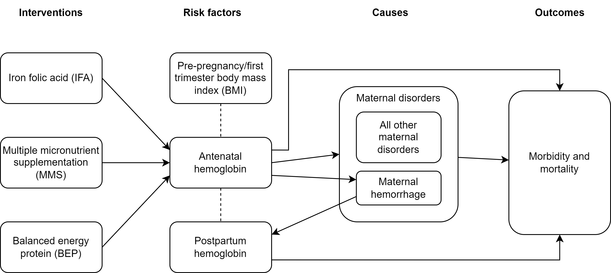

.. role:: underline
    :class: underline

..
  Section title decorators for this document:

  ==============
  Document Title
  ==============

  Section Level 1 (#.0)
  +++++++++++++++++++++

  Section Level 2 (#.#)
  ---------------------

  Section Level 3 (#.#.#)
  ~~~~~~~~~~~~~~~~~~~~~~~

  Section Level 4
  ^^^^^^^^^^^^^^^

  Section Level 5
  '''''''''''''''

  The depth of each section level is determined by the order in which each
  decorator is encountered below. If you need an even deeper section level, just
  choose a new decorator symbol from the list here:
  https://docutils.sourceforge.io/docs/ref/rst/restructuredtext.html#sections
  And then add it to the list of decorators above.

.. _2021_concept_model_vivarium_nutrition_optimization_pregnancies:

===================================================
Nutrition Optimization Concept Model: PREGNANCIES
===================================================

.. contents::
  :local:

1.0 Overview
++++++++++++

This is the concept model document for the pregnancy component of the Nutrition Optimization simulation model.
Documents that contain information specific to the overall model and the child subcomponent can be found here:

- :ref:`Overall nutrition optimization concept model document<2021_concept_model_vivarium_nutrition_optimization>`

- :ref:`Child subcomponent concept model document <2021_concept_model_vivarium_nutrition_optimization_children>`

.. _nutritionoptimizationpreg2.0:

1.1 Modeling aims and objectives
---------------------------------

.. todo::

  List modeling aims and objectives

2.0 Model design
++++++++++++++++

2.1 Concept model diagram
-------------------------

2.2 Submodels
-------------

.. todo::

  Link individual model documents as they are completed and merged

.. note::

  Unless specifically noted, only change from the IV iron implementation is the update from GBD 2019 to GBD 2021 data

+---------------------+-------------------------------------------+---------------------+
| Category            | Model                                     | Note                |
+=====================+===========================================+=====================+
|Demography           |:ref:`Population structure at              |Change from IV iron  |
|                     |initialization                             |due to closed cohort |
|                     |<other_models_pregnancy_demography>`       |                     |
|                     +-------------------------------------------+                     |
|                     |:ref:`Pregnancy model (closed cohort)      |                     |
|                     |<other_models_pregnancy_closed_cohort>`    |                     |
+---------------------+-------------------------------------------+---------------------+
|Risk exposure        |Hemoglobin/anemia                          |                     |
|                     +-------------------------------------------+---------------------+
|                     |Pre-pregnancy/first trimester BMI          |                     |
|                     +-------------------------------------------+---------------------+
|                     |Birth weight and gestational age           |                     |
+---------------------+-------------------------------------------+---------------------+
|Risk correlation     |Hgb/BMI/LBWSG                              |                     |
+---------------------+-------------------------------------------+---------------------+
|Risk effects         |Hemoglobin, including effects on:          |Do not include effect|
|                     | - Maternal disorders                      |on birth outcomes    |
|                     | - Maternal hemorrhage incidence           |(stillbirth). Change |
|                     |                                           |from IV iron         |
|                     +-------------------------------------------+---------------------+
|                     |:ref:`Maternal hemorrhage effect on        |                     |
|                     |hemoglobin                                 |                     |
|                     |<2019_risk_effect_maternal_hemorrhage>`    |                     |
+---------------------+-------------------------------------------+---------------------+
|Causes               |:ref:`Maternal disorders                   |                     |
|                     |<2021_cause_maternal_disorders>`           |                     |
|                     +-------------------------------------------+---------------------+
|                     |:ref:`Maternal hemorrhage incidence        |                     |
|                     |<2019_cause_maternal_hemorrhage_incidence>`|                     |
|                     +-------------------------------------------+---------------------+
|                     |:ref:`Background morbidity due to other    |Modeled causes: r192 |
|                     |causes <other_causes>`                     |(anemia). See note   |
|                     |                                           |regarding exclusion  |
|                     |                                           |of c366 below.       |
|                     |                                           |Change from          |
|                     |                                           |IV iron!             |
|                     +-------------------------------------------+---------------------+
|                     |Removal of background mortality due to     |Change from IV iron  |
|                     |other causes                               |                     |
+---------------------+-------------------------------------------+---------------------+
|Interventions        |:ref:`Antenatal supplementation, including |Change from IV iron! |
|                     |IFA, MMS, and BEP and their effects        |New effects on       |
|                     |on antenatal hemoglobin, LBWSG, and        |gestational age and  |
|                     |birth outcomes                             |birth outcomes (no   |
|                     |<maternal_supplementation_intervention>`   |changes to hemoglobin|
|                     |                                           |effects). Also,      |
|                     |                                           |coverage algorithm is|
|                     |                                           |updated              |
+---------------------+-------------------------------------------+---------------------+

.. list-table:: Wave I outstanding tasks
  :header-rows: 1

  * - Task
    - Dependencies
    - RT person
    - ST person
    - Note
  * - Model builds 0.0 through 1
    - .
    - Docs ready, will need V&V (Ali)
    - In progress (Patrick/Steve)
    - New content from IV iron
  * - Model builds 2-6
    - .
    - Docs ready, will need V&V (Ali)
    - Patrick/Steve
    - No new content from IV iron (except one exclusion)
  * - Model build 7
    - .
    - Docs ready, will need V&V (Ali)
    - Patrick/Steve
    - New content from IV iron
  * - Production runs
    - . 
    - Ali
    - Patrick/Steve
    - Triple check everything is finalized and ready for next steps :) 

.. list-table:: Wave II outstanding tasks
  :header-rows: 1

  * - Task
    - Dependencies
    - RT person
    - ST person
    - Note
  * - General GBD 2021 update
    - Ali blocked by hemoglobin distribution questions, team blocked by GBD timeline
    - Ali
    - Patrick/Steve
    - 
  * - Background morbidity
    - .
    - Ali
    - Patrick/Steve
    - Bonus task, not necessary for success

2.3 Default specifications
--------------------------

.. list-table::
  :header-rows: 1

  * - Parameter
    - Value
    - Note
  * - Location(s)
    - Ethiopia (ID: 179)
    - Eventually will also add Nigeria (214) and Pakistan (164)
  * - Number of draws
    - 10
    - May be increased for final runs
  * - Population size per draw
    - 100,000
    - Eventually to be refined based on test runs
  * - Cohort type
    - Closed
    - Change from IV iron!
  * - Sex
    - Female only!
    - 
  * - Age start (initialization)
    - 10
    -
  * - Age start (observation)
    - 10
    - 
  * - Age end (initialization)
    - 54 (inclusive)
    - 
  * - Exit age (observation)
    - Age at which postpartum period ends
    - Need to confirm with engineers
  * - Simulation start date
    - 2025-01-01
    -
  * - Simulation observation start date
    - 2025-01-01
    - (No burn-in period)
  * - Simulation end date
    - 2025-12-3
    - Assumes maximum pregnancy duration of 42 weeks + 6 weeks postpartum + 1 day. 2025 is not a leap year
  * - Timestep
    - 1 week (7 days)
    - Note, could be increased to two weeks if duration of maternal disorders pregnancy state is updated.
  * - Randomness key columns
    - ['entrance_time', 'age']
    - 

.. _nutritionoptimizationpreg4.0:

2.4 Simulation scenarios
------------------------

.. note::

  Scenarios subject to change, but will follow similar structure

  Note that while IFA must be included in the model for baseline calibration, it will *not* be included as a scale-up intervention to include in the optimization process. Therefore, we will not "zero" out IFA coverage in the "zero coverage" scenario and we will not scale-up IFA coverage to its maximum value independently. IFA coverage may only remain at its baseline coverage level *or* be reduced to zero when it is replaced with MMS or BEP.

.. list-table:: Scenarios
  :header-rows: 1

  * - Scenario
    - IFA coverage
    - MMS coverage
    - BEP coverage
  * - Baseline/zero coverage
    - Baseline
    - 0
    - 0
  * - 1: MMS
    - 0
    - 1
    - 0
  * - 2: Universal BEP
    - 0
    - 0
    - 1
  * - 3: Targeted BEP/none
    - Baseline for adequate BMI pregnancies
    - 0
    - 1 for low BMI pregnancies
  * - 4: Targeted BEP/MMS
    - 0
    - 1 for adequate BMI pregnancies
    - 1 for low BMI pregnancies

Where: 

- **0** represents the minimum intervention coverage (0%, or no coverage)

- **1** represents the maximum intervention coverage (100%)

- **Baseline** represents location-specific baseline IFA coverage, `which can be found in location-specific .csv files here <https://github.com/ihmeuw/vivarium_research_nutrition_optimization/tree/data_prep/data_prep/antenatal_interventions/baseline_ifa_coverage>`_ (`note these values were calculated in this notebook <https://github.com/ihmeuw/vivarium_research_nutrition_optimization/blob/data_prep/data_prep/antenatal_interventions/Gestational%20age%20shifts.ipynb>`_

2.5 Outputs
------------

There are two important categories of outputs for this model. The first is maternal health data obtained from observing the simulants in the pregnancy simulation that will be used to inform maternal health outcomes in the emulator. The second is data that will be used as inputs to the child simulation (including information such as LBWSG risk exposure). The maternal health data will be recorded at the aggregate level, but the child health data will be recorded at the individual level. 

Specific outputs for specific models are specified in the following section.

.. _nutritionoptimizationpreg3.0:

3.0 Models
++++++++++

.. note::

  Unless otherwise specified, all maternal outputs should be stratified by maternal age group

.. note::

  Models 2.0 through 6.0 do not contain any updates relative to the IV iron implementation (with the exception of the removal of the hemoglobin risk effect on birth outcomes/stillbirths). These model runs may be collapsed into fewer submodels if convenient for implementation. 

  If this is done, model output requests should be updated. 

.. list-table:: Model run requests
  :header-rows: 1

  * - Run
    - Description
    - Scenarios
    - Spec. mods
    - Maternal outputs
    - Child outputs
    - Note
  * - 0.0
    - Standard demography 
    - Baseline
    - None
    - * Deaths
      * YLLs
    - N/A
    - 
  * - 0.1
    - Pregnancy demography (:ref:`docs here <other_models_pregnancy_demography>`)
    - Baseline
    - None
    - * Deaths
      * YLLs
      * Pregnancy state person-time
    - N/A
    - All simulants initialized into the pregnancy state, but no other aspects of pregnancy model included
  * - 1.0
    - Pregnancy state transitions (:ref:`docs here <other_models_pregnancy_closed_cohort>`). For now, all pregnancies have duration of 40 weeks.
    - Baseline
    - None
    - * Deaths
      * YLLs
      * Pregnancy state person-time
      * Pregnancy transition counts
    - N/A
    - Note closed cohort change from IV iron pregnancy model. Custom observer exit at the end of postpartum period? (Bonus ask)
  * - 1.1 
    - Term length outputs (separation of full and partial term births). For now, full term pregnancies all have 40 weeks duration and partial term births have duration as specified in docs. 
    - Baseline
    - None
    - * Deaths
      * YLLs
      * Pregnancy state person-time
      * Pregnancy transition counts
      * Counts of births stratified by pregnancy term lengths
    - Full term births paired with maternal_ids
    -  
  * - 1.2
    - LBWSG outputs. Update pregnancy duration to reflect sex-specific LBWSG exposures and separate full term births into live birth and stillbirth outcomes.
    - Baseline
    - None
    - * Deaths
      * YLLs
      * Pregnancy state person-time, **stratified by birth outcome**
      * Pregnancy transition counts, **stratified by birth outcome**
      * Counts of birth outcomes
    - Live and still births with maternal_ids and LBWSG exposures
    - 
  * - 2.0
    - Maternal disorders and maternal hemorrhage cause models, removal of background mortality
    - Baseline
    - None
    - * Deaths
      * YLLs
      * YLDs
      * Pregnancy state person-time
      * Pregnancy transition counts
      * Incident maternal disorder counts
      * Incident maternal hemorrhage counts
    - N/A
    - 
  * - 3.0
    - Hemoglobin/anemia exposure
    - Baseline
    - None
    - * YLDs
      * Anemia state person time, stratified by pregnancy state
    - N/A
    - 
  * - 4.0
    - Hemoglobin on maternal disorders, hemoglobin on maternal hemorrhage, and maternal hemorrhage on hemoglobin risk effects
    - Baseline
    - None
    - * Deaths
      * YLLs
      * YLDs
      * Pregnancy state person-time
      * Pregnancy transition counts
      * Anemia state person-time **stratified by pregnancy state**
      * Incident maternal disorder counts **stratified by anemia status at birth**
      * Incident maternal hemorrhage counts **stratified by anemia status at birth**
    - N/A
    - Do NOT include risk effect of hemoglobin on birth outcomes (which was included in IV iron). Data block for GBD 2021 update as of 6/23.
  * - 5.0
    - BMI exposure with correlation to hemoglobin and LBWSG
    - Baseline
    - None
    - * Deaths
      * YLLs
      * YLDs
      * BMI exposure, stratified by pregnancy state and anemia state
    - Live and still births with maternal_ids, infant sex, maternal BMI exposure, maternal hemoglobin above/below 100 g/L, and LBWSG exposures
    - Data block for GBD 2021 update as of 6/23.
  * - 6.0
    - Intervention effects on hemoglobin and birthweight
    - All
    - None
    - * Deaths
      * YLLs
      * YLDs
      * Pregnancy state person time
      * Pregnancy transition counts
      * Anemia state person time, stratified by intervention coverage
      * Intervention counts
    - Live and still births with maternal_ids, infant sex, maternal BMI exposure, maternal hemoglobin above/below 100 g/L, intervention coverage, and LBWSG exposures
    - Both of these intervention effects were implemented in IV iron and are not changed for this model
  * - 7.0
    - Intervention effects on gestational age and birth outcomes
    - All
    - None
    - * Deaths 
      * YLLs
      * YLDs
      * Pregnancy state person time
      * Pregnancy transition counts
      * Birth outcomes, stratified by intervention coverage
    - Live and still births with maternal_ids, infant sex, maternal BMI exposure, maternal hemoglobin above/below 100 g/L, intervention coverage, and LBWSG exposures
    - These intervention effects are new and were not implemented in IV iron
  * - 8.0
    - Background morbidity
    - All
    - None
    - * Deaths 
      * YLLs
      * YLDs
      * Pregnancy state person time
      * Pregnancy transition counts
    - N/A
    - 
  * - 9.0
    - Production run test
    - 1-4
    - (some larger number of draws and seeds, tbd)
    - No age stratification:
      
      * Deaths
      * YLLs
      * YLDs
      * Intervention counts
    - Live and still births with maternal_ids, infant sex, intervention coverage, and LBWSG exposures
    - 
  * - 9.1
    - Production runs
    - 1-4
    - (some larger number of draws and seeds, tbd)
    - No age stratification:
      
      * Deaths
      * YLLs
      * YLDs
      * Intervention counts
    - Live and still births with maternal_ids, infant sex, intervention coverage, and LBWSG exposures
    - 
  * - 10.0
    - GBD 2021 update?
    - Baseline
    - None
    - 
    - 
    - This model may be inserted earlier in the timeline, depending on when it is ready

.. note::

  Model build ordering determined with the following in mind https://blog.crisp.se/2016/01/25/henrikkniberg/making-sense-of-mvp

.. list-table:: Verification and validation tracking
  :header-rows: 1

  * - Model
    - V&V plan
    - V&V summary
  * - 0.0
    - Proportion of deaths in each age group is as expected from GBD ACMR estimates among WRA
    - Overall seems to be functioning as expected, but would like to add person-time observer to results. `Notebook can be found here <https://github.com/ihmeuw/vivarium_research_nutrition_optimization/blob/data_prep/verification_and_validation/pregnancy_model/model_0.0.ipynb>`_.
  * - 0.1
    - Check that distribution of observed person-time by age group matches distribution of pregnancies in GBD, check ACMR
    - Looks great! Some deviation from GBD ACMR at edge age groups as a result of small numbers, but not a concern. `Model 0.1 V&V notebooks can be found here <https://github.com/ihmeuw/vivarium_research_nutrition_optimization/blob/data_prep/verification_and_validation/pregnancy_model/model_0.1.ipynb>`_
  * - 1.0
    - Confirm pregnancy transitions occurring and at the expected intervals. For this model, all pregnancies hard coded for duration of 40 weeks. Postpartum period duration of 6 weeks.
    - Looks great! Note that pregnancy duration skews when evaluated at age-specific level, but this is not a bug in implementation, rather in analysis. `Model 1.0 V&V notebook can be found here <https://github.com/ihmeuw/vivarium_research_nutrition_optimization/blob/data_prep/verification_and_validation/pregnancy_model/model_1.0.ipynb>`_
  * - 1.1
    - Confirm that relative distribution of partial versus full term pregnancies is as expected, that partial term pregnancy duration implemented as expected, and that child data looks good
    - Looks great! `Model 1.1 V&V notebook can be found here <https://github.com/ihmeuw/vivarium_research_nutrition_optimization/blob/data_prep/verification_and_validation/pregnancy_model/model_1.1.ipynb>`_
  * - 1.2
    - * Check that average duration of "other" birth outcomes is 15 weeks in maternal outputs
      * Check that average duration of live and still birth outcomes is close to 38-39 weeks or so in maternal outputs
      * Check live birth to stillbirth ratio verifies to expected value
      * Check that LBWSG exposure in child outputs verifies to GBD exposure distribution
    - Looks good! `Model 1.2 V&V notebook can be found here <https://github.com/ihmeuw/vivarium_research_nutrition_optimization/blob/data_prep/verification_and_validation/pregnancy_model/model_1.2.ipynb>`. Noted that infant sex should be added to child output data moving forward.
  * - 2.0
    - Verify incident and fatal maternal disorder and maternal hemorrhage (incident only) rates as well as YLDs, confirm removal of background mortality
    - 

.. list-table:: Outstanding V&V issues
  :header-rows: 1

  * - Issue
    - Explanation
    - Action plan
    - Timeline
  * - 
    - 
    - 
    - 

4.0 Research background and limitations
++++++++++++++++++++++++++++++++++++++++

.. _MDYLDNote:

4.1 A note on years lived with disability and maternal disorders
-----------------------------------------------------------------

This simulation has taken a particular modeling strategy regarding years lived with disability due to :ref:`maternal disorders <2021_cause_maternal_disorders>` that involved integrating it into the :ref:`pregnancy model <other_models_pregnancy_closed_cohort>`. 

While described in more detail on the individual model documents, the main strategic decisions made in the design of this model are outlined below, with explanations:

- Modeling a specific "maternal disorders" state in the pregnancy model document with a duration of a single timestep that occurs between the pregnancy and postpartum states in which a simulant is either affected or unaffected by the maternal disorders cause. 

  - Modeling the maternal disorders state with the duration of one timestep (rather than an instantaneous moment at birth) allowed us to take advantage of standard vivarium behavior for accruing YLDs over the duration of time spent in the state according to a state-specific disability weight (custom calculated in this case).

- Modeling YLDs due to maternal disorders according to a custom calculated "disability weight" equal to the annual amount of YLDs due to maternal disorders per non-fatal case of maternal disorders rather than the typical strategy of prevalence-weighted average of sequela-specific disability weights.  

  - We took this strategy because the maternal disorders cause is a composite parent cause of many maternal disorders subcauses (see :ref:`the maternal disorders document<2021_cause_maternal_disorders>`). These subcauses all have differing disability weights as well as average durations. Therefore, by using the GBD COMO-adjusted YLD estimates to back-calculate a "disability weight" for the composite maternal disorders parent cause that results, we can produce the appropriate COMO-adjusted annual baseline rate of maternal disorders YLDs without needing to account for the differential DWs and durations of each of the maternal disorder subcauses to appropriately replicate the COMO adjustment within the simulation.

    - Note that a limitation of this strategy is that there are some sequelae within the maternal disorders cause that last for longer than one year. Because of this, some of the YLDs in the GBD estimate of the COMO-adjusted annual YLD rate due to maternal disorders will be due to births that occurred in the year prior to our index year; we will therefore assign some of these YLDs due to prevalent cases to incident cases in our simulation. However, we are additionally limited in that we do not consider disability due to incident maternal disorder cases beyond one year after birth. Note that for the baseline scenario, these two limitations should cancel out so long as the incidence of these long-lasting sequelae are stable over time after adjusting for changing fertility rates. 

- Pausing accumulation of YLDs due to causes other than maternal disorders (specifically anemia, other causes) while simulants occupy the maternal disorders state in the pregnancy model.

  - We took this strategy because the maternal disorders YLDs as calculated above are already COMO adjusted. Therefore, we do not wish to further adjust these YLDs for comorbid causes that a simulant may possess.

    - Note that this causes underestimation of YLDs due to causes other than maternal disorders from the start of pregnancy until six weeks postpartum by roughly a factor of 1/38 (~2.16 percent) for this simulation given a timestep of one week and an average pregnancy + postpartum combined duration of approximately 38 weeks (6 weeks postpartum + 32 weeks of pregnancy, weighted average of full and partial term pregnancies).
      - We have addressed this limitation during post-processing for the IV iron simulation by multiplying YLDs due to anemia accrued during the postpartum state by :code:`6/5` given that the duration of the maternal disorders state was one week and the duration of the postpartum state was 5 weeks. 

.. todo:: 
  
  Determine if we wish to replicate this anemia YLD re-scaling strategy for this simulation (trade off between observer stratification and associated increases in run time). Will need to update final output/stratification requests if desired. 

- Not including maternal disorders as a "modeled cause" in the model of morbidity due to "other causes," :ref:`as discussed on this page <other_causes_ylds>`.

  - This allows us to adjust YLDs due to causes other than maternal disorders to be COMO-adjusted for maternal disorders, since this adjustment will not be done within the simulation despite the fact that we are modeling maternal disorders due to our unique modeling strategy for this cause. Note that YLDs due to maternal disorders in our simulation are already COMO-adjusted for all other causes because we are using the GBD COMO-adjusted YLD estimate to calculate the maternal disorders disability weight, as described above.

    - Note that this modeling strategy does not allow for intervention-associated reductions in YLDs due to maternal disorders to cause *increases* in YLDs due to causes other than maternal disorders (which should occur for comorbid causes, :ref:`as discussed on this page <other_causes_ylds>`) and vise versa (reductions in YLDs due to anemia will not increase comorbid YLDs due to maternal disorders). However, given that each of these individual causes represents a small portion of all cause YLDs for our modeled demographic groups, the impact of this limitation will be small. 

- Modeling YLDs and YLLs due to :ref:`maternal hemorrhage <2019_cause_maternal_hemorrhage_incidence>` as part of the :ref:`maternal disorders <2021_cause_maternal_disorders>` composite cause rather than part of the maternal hemorrhage incidence cause (which has no associated morbidity or mortality).

  - We did this in order to remain consistent with GBD. The GBD hemoglobin risk effect applies equally to all maternal disorders subcauses (in other words, the hemoglobin relative risks are specific to *all* maternal disorders and we do not have data for cause-specific hemoglobin risk effects). Therefore, we model the risk effect of hemoglobin on maternal disorders as a composite cause (including hemorrhage) and model maternal hemorrhage incidence **only** as a way to estimate the impact of pregnancy hemoglobin on postpartum hemoglobin as mediated through hemorrhage at birth. 

    - Note that it is possible that we could use the more specific hemoglobin on maternal hemorrhage risk effects obtained from the literature to apply to maternal hemorrhage morbidity and mortality, but we chose to remain consistent with GBD rather than model more detailed risk effects for this single specific subcause of maternal disorders. 