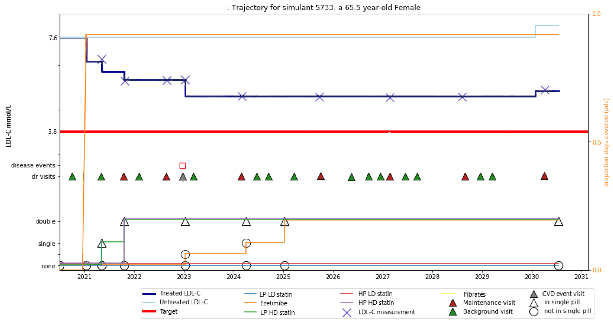

.. _2017_concept_model_vivarium_sanofi_zenon:

=====================================================
Vivarium CSU Simulating lipid lowering
=====================================================

Model Overview
--------------

Objective
+++++++++

The objective is to model and simulate the Public Health Impact of fixed dose combination on LDL cholesterol and ASCVD (Ischemic heart disease, Ischemic stroke) in Brazil, China, France, Spain, and Russia. This includes the intervention targets of reducing deaths and DALYs due to Ischemic Heart Disease and Ischemic Stroke based on the intervention scenario. 

.. list-table:: Table of Term Definitions
   :widths: 15, 20, 20
   :header-rows: 1

   * - Term
     - Definition
     - Notes
   * - High LDL-c in Business As Usual (BAU) scenario 
     - LDL-c > 4.9
     - 
   * - High LDL-c in intervention scenarios
     - LDL-c > 3.0
     - Determined by CV risk SCORE
   * - Hitting target
     - 50% or more reduction over untreated LDL-c
     - 
   * - High potency statin
     - Refers to high potency of drugs: atorvastatin, rosuvastatin
     - Defined by guidelines and discussion with external private sector experts
   * - Low potency statin
     - Refers to low potency of drugs: simvastatin, pravastatin, fluvastatin
     - Defined by guidelines and discussion with external private sector experts 
   * - High dose 
     - 40mg and up
     - 
   * - Low dose
     - under 40mg 
     - 
   * - CV risk category: very high risk
     - past CVD event
     - 
   * - CV risk category: high risk 
     - CV score greater than 10 or severe diabetes or severe CKD
     - 
   * - CV risk category: moderate risk 
     - score between five and 10 or mild/moderate diabetes/CKD or SBP greater than 180
     - 
   * - CV risk category: low risk 
     - CV score less than five
     - 

Intervention Definitions
++++++++++++++++++++++++

Business As Usual (BAU) scenario
~~~~~~~~~~~~~~~~~~~~~~~~~~~~~~~~

A baseline scenario projecting current treatment (per location), patient adherence, and trends of LDL-c and ASCVD outcomes, for the current year and five years into the future. (2019-2024). This scenario will be used to compare the two subsequent scenarios. The definition of adherence is the probability of a patient taking their medication 80% of the time. The proportion of patients that are adherent come from literature. More detailed information about adherence and probability of prescription given are included in the Data Artifact and subsequent to change during the development of the Zenon project.

2019 Guidelines with multiple pills scenario
~~~~~~~~~~~~~~~~~~~~~~~~~~~~~~~~~~~~~~~~~~~~

For each of the simulated populations/locations, IHME will run a counterfactual scenario in which all initial variables are identical to the BAU Scenario, but in which treatments follow the ESC 2019 Guidelines using individual components (i.e., multiple pills) for simulants meeting guideline criteria. The same treatment pathway will be applied to all countries based on ESC 2019 Guidelines. The guidelines propose a more proactive treatment than current treatment practices. More information about this scenario and associated adherence to multiple pills treatment can be found in the Treamtent Ramp below and is included in the Data Artifact.

2019 Guidelines with combination single pill scenario
~~~~~~~~~~~~~~~~~~~~~~~~~~~~~~~~~~~~~~~~~~~~~~~~~~~~~

For each of the simulated populations/locations, IHME will run a counterfactual scenario in which all initial variables are identical to '2019 Guidelines with multiple pills scenario', but in which treatments follow the ESC 2019 Guidelines using FDC rather than individual components for simulants meeting guideline criteria. This scenario would include an assumption about the increased adherence to single pill treatment compared to multiple pills. More information about this scenario and the increased adherence to single pill treatment can be found in the Treamtent Ramp below and is included in the Data Artifact.

Questions of Interest
+++++++++++++++++++++

Hi david, please fill me out

Scope of Modeling
+++++++++++++++++

Concept Model Diagram
---------------------

.. image:: zenon_concept_model_diagram.svg

Model Components
----------------

Time
++++

* Start and end date: **Jan 1, 2019 -- Dec 31, 2024**

* One year of lead in time (where all the scenarios are the same) and scenarios start to change at **Jan 1, 2020.**

* Simulation time step: **28 days** to capture cardiovascular events and treatment timesteps

Demographics
++++++++++++

* Locations: **Brazil, China, France, Italy, Spain, Russia**
* Population: **Prospective open cohort of 40-74 year olds**
* Size of largest starting population: **100,000 simulants**
* Youngest start-age and oldest end-age: **30 - 100 years**
* Exit age (at what age to stop tracking simulants): **101 years**
* Fertility: **Not applicable**

GBD Causes
++++++++++

* :ref:`Ischemic Heart Disease <2017_cause_ischemic_heart_disease>`

* :ref:`Ischemic Stroke <2017_cause_ischemic_stroke>`

GBD Risks
+++++++++

* :ref:`High LDL cholesterol <2017_risk_high_ldl_c>`

PAF-of-1 Cause/Risk Pairs
+++++++++++++++++++++++++

* :ref:`Chronic Kidney Disease (CKD) / Impaired Kidney Function (IKF) <2017_cause_ckd>`

* :ref:`Diabetes Mellitus (DM) / Fasting Plasma Glucose (FPG) <2017_cause_diabetes_mellitus>`

Risk-Outcome Relationships
++++++++++++++++++++++++++

Coverage Gap Framework
++++++++++++++++++++++

Eligible to Treatment Criteria
++++++++++++++++++++++++++++++

Simulants who are eligible to treatment fall in the criteria of: Starting age group of 40 years old or greater. No new treatment would be given to simulants over 75 years old but they continue treatment. 

We will assign treatment to new simulant patients who are currently not on treatment but meet the treatment criteria, based on scenario, and simulants who are currently on treatment but have had a CVD event or meet the treatment criteria to increase dosage. Treatment is not a one-time treatment but is a continuing treatment over 5 years. During the 5 year simulation, treatment for a patient may stay constant or may ramp up, based on the simulant and their LDL-c level, SBP level, or if they have had a CVD event. 

Utilization estimates used in this model are for the average number of outpatient healthcare visits, which will inform the treatment ramp of when a patient will seek care through a visit and get their LDL-c levels measured. The utilization rates are based on GHDx_, 'Global Inpatient and Outpatient Health Care Utilization, Unit Costs, and Costs and Services Needed to Achieve Universal Health Coverage 1990-2016'.

.. _GHDx: http://ghdx.healthdata.org/record/ihme-data/UHC-cost-and-services-2016

Initialization of patients into treatment for BAU
+++++++++++++++++++++++++++++++++++++++++++++++++

Initialization Strategy
+++++++++++++++++++++++

B+C+D = (C+D) / (1 – pr_rx* pr_hitting_target)
pr_rx = (B+D) / (B+C+D) # db has from literature (table 2)
pr_hitting_target = B / (B + D) # db has from literature (table 3)
C + D = pr_high_ldl_c
 
we can solve for B in the first line, and then solve for D in the second line

1.     Need:

D / (C+D) = pr[treated | LDL >= 5]

B / (A+B) = pr[treated | LDL < 5]
 
2. Next we need: (all these normals dists should be truncated normals, truncated to be between [0,1])

Pr[treatment profile t | on treatment] (where t is a treatment profile, including drugs, dosage)

Table 6 says % on each drug; table 8 (not numbered) says % on mono vs multi; %fdc if multi

Abie recommends:

a.     Decide if they are on monotherapy: location-specific probability chosen for all simulants from N(mean_value, sd_value)

b.     If they are not on monotherapy: decide if they are on FDC, location-specific probability chosen for all simulants from N(mean_value, sd_value)

c.     Now to table 6---

a.     if you are on FDC, treatment profile is low-potenecy statin + ezetimibe

b.     if you are on multiple individual pills, treatment profile is statin + ezetimibe

                                                   i.    find a location-specific probability of high potency statin from N(mean_value, sd_value), decide if they are on high or low potency statin

                                                  ii.    they also get ezetimibe
                                                  
c.     if you are on monotherapy, decide if it is ezetimibe, fibrates, high-potency statin, or low-potency statin by taking values:

                                                   i.    p_eze_draw ~ N(mean_value, sd_value) population-specific

                                                  ii.    p_fib_draw ~ N(mean_value, sd_value), population-specific

                                                 iii.    p_high_pot_stat ~ N(mean, sd)

                                                 iv.    p_low_pot_stat ~ N(mean, sd)

                                                  v.    T = p_eze_draw + p_fib_draw + p_high_draw + p_low_draw

                                                 vi.    Pr[drug = D] is p_eze_draw / T for D = ezetimibe, p_fib_draw / T for D = firbates, p_high_pot_stat / T for D = high potency statin, p_low_pot_stat / T for D = low potency statin

Then we need:
Pr[adherence | on treatment profile t, IHD/IS status]
This is categorical (adherent/non-adherent), and comes from table 4:
If not IHD or IS, for monotherapy OR FDC, adherent with probability derived from Table 4, first part location-specific value drawn from N_[0,1](mean, std)

              If multiple individual pills, Adherence with multiple pills (primary prevention) location-specific row from Table 4 location-specific value drawn from N(mean, std)

If IHD or IS, for monotherapy OR FDC, adherent with probability from Table 4 location-specific rows for “Adherence after MI (one pill)” location-specific value drawn from N(mean, std)
If IHD or IS, for multiple individual pills, adherent with probability from Table 4 location-specific rows for “Adherence after MI (multi-pill)” location-specific value drawn from N(mean, std)
 
Finally, we need to know:
Untreated LDL-C level | treated, treatment profile t, adherence yes/no
If not treated or not adherent, untreated LDL-c = LDC-c (drawn from GBD)
If treated, and adherent, look up multiplier in treatment table 3 (second part):
If monotherapy, treatment profile is {t}, eff_t ~ N(mean, sd) same for all individuals, and

              Untreated LDL-C = LDL-C / (1 - eff_t)

If FDC or multiple individual pills, treatment profile is {t, s}, eff_t ~ N, eff_s ~ N(mean_s, sd_s)

              Untreated LDL-C = LDL-C / ((1 - eff_t) * (1 - eff_s))

(same effect for all indiviuals, which we will note in the limitations)

This effect size calculation should also be used during the simulation to determine if a patient is 'at target' - which is defined as a reduction in LDL-C of 50% or more over untreated LDL-C level.

To get on FDC:  prob(adding 2nd drug)*prob(FDC if multi drug). These values are listed in 'Table 5: Probability of adding 2nd drug v. increasing dose' and 'Table 8: Distribution of therapy type' below).

BAU parameter data tables
+++++++++++++++++++++++++

Information about Table 1: For post-MI visits, the patient is given Rx with probability = 1. LDL-C should be recorded in the simulation, but its value does not impact treatment decision in any of the 3 scenarios.

* For background visits, the patient may or may not have their LDL-C measured, and the probability that they do measure LDL-C is given by the data in Table 1.
* For follow-up visits, the LDL-C should be measured with probability = 1 and recorded in the simulation (to determine if the patient has reached target), and may impact Tx decisions (e.g. increasing dose if not at target).

.. csv-table:: Table 1: Probability of having LDL-c measured
   :file: prob_testing_ldlc.csv
   :widths: 20, 10, 10
   :header-rows: 1

.. todo::

	Need input from medical experts - should we treat patients with 100% probability in the 2 intervention scenarios? As is, we are not - we will use the prob(Rx| high LDL-c) from below Table 2.

Information about Table 2: For background visits, if a patient is above the relevant threshold (4.9 mmol/L in BAU and according to the treatment algorithm involving SCORE, DM/CKD state, and SBP in the 2 intervention scenarios), they may or may not (therapeutic inertia) be given Rx. Whether they are given Rx given that they are above the threshold is determined by the data in Table 2.

.. csv-table:: Table 2: Probability of Rx given high LDL-C = P(Rx | Untreated LDL-C > 4.9)
   :file: prob_rx_given_high_ldlc.csv
   :widths: 20, 10, 10
   :header-rows: 1

.. csv-table:: Table 3: Probability of reaching target given Rx = prob(reaching target | Rx)
   :file: prob_target_given_rx.csv
   :widths: 20, 10, 10
   :header-rows: 1

.. csv-table:: Table 4: Probability of Adherence
   :file: adherence_parameters.csv
   :widths: 30, 20, 10, 10
   :header-rows: 1

Information about Table 5: At a follow-up visit, if a patient has not reached their target (defined as 50% reduction in their untreated LDL-C), they may be given a higher dose, a 2nd drug or a different statin (if on statin). The probability of each is given in Table 5. These numbers are global, not location specific.

.. csv-table:: Table 5: Probability of adding 2nd drug v. increasing dose
   :file: prob_adding_drugs.csv
   :widths: 30, 20, 10
   :header-rows: 1

Update: BAU ONLY	mean (sd); 
prob increasing dose if not at target =	0.07 (0.02); 
prob of adding 2nd drug if not at target = 0.06 (0.02); 
prob of switching drugs if not at target = 0.03 (0.02); 
prob of no change (BAU only) = 0.84 (0.02)

Note: patients in BAU will "ramp-up" their treatment if they are not "at target", which is defined as a 50% or more reduction in their untreated LDL-C.  Reduction in LDL-C due to treatment is determined based on the particular treatment given to the simulant, whether they are adherent and intervention efficacy data in Table 9.  Specifically:  LDL-C reduction = is_adherent(0 or 1)*reduction_in_ldlc for their particular drug/dose Rx.

Note:  Ramp-up should be monotonic in terms of average efficacy:  lifestyle_intervention < fibrates < ezetimibe < LP LD statin < LP HD statin < HP LD statin < HP HP statin < 2-drug combination (either as 2-pill or FDC, depending on scenario). The probabilities in Table 5 above determin if dose will increase (from LD to HD) or if potency will increase (from LP to HP) or if a 2nd drug will be added (note BAU Table 5 includes "prob of no change", while intervention scenario Table 5 does not - so there are 2 Table 5s).  These are mutually exclusive events - only one can change at any given time doctor visit.  Thus, it is ok for a patient to transition from LP LD statin to HP LD statin in one step - even though they jumped over LP HD statin - since only potency changed in this example.   

Information about Table 6: The specific Rx for each patient (at initialization and for new patients during the simulation) is determined by the data in Table 6 - current treatment practice distribution by drug type. First, the type of drug is determined (statin, ezetimibe or fibrate). Then the sub-type of statin is determined for patients on statin. In BAU, dosing is 40mg for low potency statin (called "high dose") and 20mg for high potency statin (called "low dose"). In the 2 intervention scenarios, the initial dose is "high dose" of high potency statin.

.. csv-table:: Table 6: Current treatment practice - distribution by drug type 
   :file: current_rx.csv
   :widths: 30, 20, 10, 10
   :header-rows: 1

Information about Table 7: If a patient experiences a side effect, they will be given a different drug on their next visit. The treatment algorithm assumes these patients are not adherent.

.. csv-table:: Table 7: Probability of side effect (adverse events)
   :file: prob_adverse_events.csv
   :widths: 20, 10, 10
   :header-rows: 1

Information about 'Distribution of therapy type' table: This is not used as a BAU parameter directly. This table was used to calculate 'adherence' parameters. 

.. csv-table:: Table 8: Distribution of therapy type
   :file: dist_therapy_type.csv
   :widths: 20, 10, 10,10
   :header-rows: 1

.. csv-table:: Table 9: Efficacy - Reduction in LDL-c by drug and dose
   :file: reduction_in_ldlc.csv
   :widths: 30, 20, 10, 10, 10
   :header-rows: 1

.. csv-table:: Table 10: Average dose in mg for statins, by potency (all locations)
   :file: table_10.csv
   :widths: 20, 10, 10, 10
   :header-rows: 1

Interventions
+++++++++++++

Both treatment scenarios are based on the CV RISK score, which is a function of Age, Sex and SBP:

SCORE = -19.5 + 0.043*SBP + 0.266*AGE + 2.32*SEX 
wher SEX = 1 if male, AGE is in years, and SBP is in mmHg

There are two caveats involving DM state and CKD state, which are included in the treatment diagram.
New patients will be started on a high dose, high potency statin (max dose of a statin randomly selected from the “high potency” list according to the weighted probability of use for each statin flavor).  
If a patient experiences a side effect, they will either have their dose cut in half – unless they are at the minimum dose already, in which case they will be given a low potency statin.  If they are not at target, they will combine these changes with addition of ezetimibe.

Initialization of patients into treatment for intervention scenarios
++++++++++++++++++++++++++++++++++++++++++++++++++++++++++++++++++++

The 2 intervention scenarios (guidelines + multiple pills and guidelines + single, combination pill) are initialized the same way as the BAU case.  
The difference is that in the intervention scenarios, treatment criteria have changed – there is now a lower threshold for treatment (based on a patient’s CV risk SCORE), including caveats for DM and CKD state.

SCORE is calculated according to the equation in the concept model documentation.
An additional difference between these scenarios and the BAU case is that follow-up visits here are scheduled at 4-6 week intervals instead of the 3-6 month timeframe in BAU.
In terms of treatment options – here, new patients are started on a low dose of high intensity statin.  Ramp-up follows the diagram “copy of treatment for engineers”.

Additionally, new patients will start treatment on a high potency, high dose statin. In BAU, this is not necessarily true.

If not at target at follow-up, a second drug will be added (ezetimibe) - as 2-pills in scenario 1 and as FDC in scenario 2. If a patient in either intervention scenario experiences a random adverse event, they will be given a lower dose of the same medication at follow-up.

2019 Guidelines with multiple pills scenario
~~~~~~~~~~~~~~~~~~~~~~~~~~~~~~~~~~~~~~~~~~~~

2019 Guidelines with combination single pill scenario 
~~~~~~~~~~~~~~~~~~~~~~~~~~~~~~~~~~~~~~~~~~~~~~~~~~~~~

Treatment Ramp
++++++++++++++

Business As Usual (BAU) Scenario
~~~~~~~~~~~~~~~~~~~~~~~~~~~~~~~~

.. image:: bau_treatment_ramp.svg

Intervention Scenarios (Both scenarios illustrated)
~~~~~~~~~~~~~~~~~~~~~~~~~~~~~~~~~~~~~~~~~~~~~~~~~~~

.. image:: intervention_scenarios_treatment_ramp.svg

Desired Model Outputs
---------------------

.. csv-table:: Subpopulations categories
   :file: subpopulations_categories.csv
   :widths: 20, 15, 15
   :header-rows: 1

.. csv-table:: Prioritized Model Outputs
   :file: data_output_shell_table.csv
   :widths: 20, 15, 15, 15, 15, 15, 15
   :header-rows: 1

.. csv-table:: Full Desired Model Outputs
   :file: data_output_shell_table with_updated_supops_and_strats.csv
   :widths: 1, 5, 10, 5, 5, 30, 30, 20
   :header-rows: 1
   
Stratification
++++++++++++++

Stratify by **location, age, sex, year, and Subpopulation (listed in Desired Model Outputs)**.

Observers
+++++++++

.. todo::

   Confirm with RT/SE teams if these are the correct observers or if any observers should be removed/added. I added 'FPGTimeSeries', SBPTimeSeries', and 'LDLCTimeSeries' observers to account for the need to be able to provide Mean LDL-C/SBP/FPG value per location/sex/age group/scenario.

For validation and reports, the research team requests the observers needed to create simulant trajectory visualizations. An example simulant trajectory plot is located below. 

.. list-table:: Observers
   :widths: 15 20
   :header-rows: 1

   * - Observer Type
     - Definition 
   * - Disability 
     - Disability observed (by cause) at the simulant-level at each time step
   * - Medication
     - The treatment prescription (medication) observed at the simulation-level throughout the treatment algorithm per intervention scenario 
   * - Disease observer - 'Ischemic heart disease (IHD)'
     - Count of IHD observed at the simulant-level throughout the simulation 
   * - Disease observer - 'Ischemic_stroke'
     - Count of Ischemic stroke observed at the simulant-level throughout the simulation 
   * - Disease observer - 'Chronic kidney disease (CKD)'
     - Count of CKD observed at the simulant-level throughout the simulation 
   * - Disease observer - 'Diabetes mellitus (DM)'
     - Count of DM observed at the simulant-level throughout the simulation 
   * - LDL-c 
     - Observed LDL-c level in (mmol/L units) throughout the simulation at the simulant-level 
   * - FPG 
     - Observed FPG level in (mmol/L units) throughout the simulation at the simulant-level 
   * - IKF 
     - The category of IKF throughout the simulation at the simulant-level 
   * - SBP 
     - Observed SBP for simulant at each time step
   * - Doctor visit 
     - The number of outpatient visits throughout the simulation at the simulant-level 

Verification and Validation Strategy
------------------------------------

1. Develop hypothesis about how this model will behave
2. Write assumptions down

.. todo::

   Add assumptions from back-of-the-envelope calculations + preliminary data input validation

3. Check internal consistency - all epi measures (data inputs) agree and produce results that make sense

  * Cause-Specific Mortality Rate (CSMR) = Excess Mortality Rate (EMR) * Prevalence for all causes 

4. Check the model outputs as outside sources

* for location in Brazil, China, France, Italy, Spain, Russia:

* for cause in ischemic_heart_disease, ischemic_stroke, chronic_kidney_disease, diabetes_mellitus:

* for measure in incidence, death, yll, yld, daly, emr, csmr:

* for age_group in 30-34, 35-39, 40-44, 45-49, 50-54, 55-59, 60-64, 65-69, 70-74, 75-79, 80-84, 85-89, 90-94, 95+:

  - Simulate history & check against GBD 2017 
  - model_outputs_location_cause_measure_sex_age_group = gbd_2017__location_cause_measure_sex_age_group

5. Model assumptions validation:

* Does the average LDL-C for the population from GBD look like the average LDL-C for the population that is initialized this way? Since we have initialized a certain number of people with specific doses of specific drugs (and we know the efficacy of each drug as a function of dose), we should be able to compare these two population level LDL-Cs.
