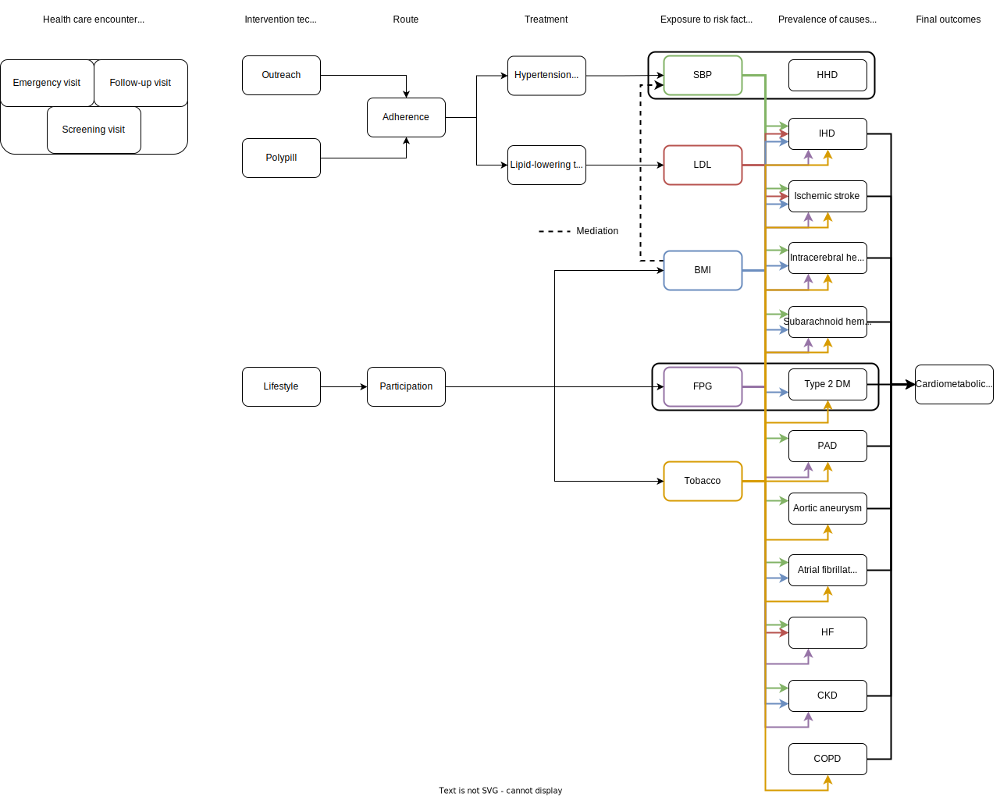
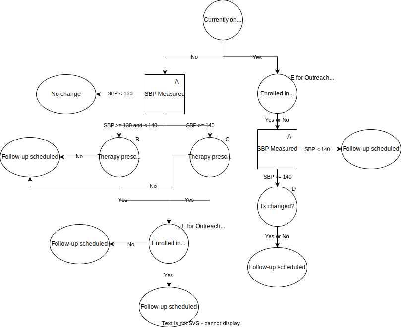

.. _us_cvd_concept_model:
..
  Section title decorators for this document:

  ==============
  Document Title
  ==============

  Section Level 1 (#.0)
  +++++++++++++++++++++
  
  Section Level 2 (#.#)
  ---------------------

  Section Level 3 (#.#.#)
  ~~~~~~~~~~~~~~~~~~~~~~~

  Section Level 4
  ^^^^^^^^^^^^^^^

  Section Level 5
  '''''''''''''''

  The depth of each section level is determined by the order in which each
  decorator is encountered below. If you need an even deeper section level, just
  choose a new decorator symbol from the list here:
  https://docutils.sourceforge.io/docs/ref/rst/restructuredtext.html#sections
  And then add it to the list of decorators above.

====================================================
Vivarium - US Health Disparities - CVD Interventions
====================================================

.. contents::
  :local:

.. list-table:: Definitions of terms and abbreviations
  :widths: 15 15 15
  :header-rows: 1

  * - Term or Abbreviation
    - Definition
    - Note
  * - BMI
    - Body Mass Index
    - Risk Factor
  * - FPG
    - Fasting Plasma Glucose
    - Risk Factor
  * - HbA1c
    - Hemoglobin A1c
    - Measures blood glucose control over the last 2-3 months
  * - LDL-C
    - Low Density Lipoprotein Cholesterol
    - Risk Factor
  * - SBP
    - Systolic blood pressure
    - Risk Factor
  * - DBP
    - Diastolic blood pressure
    - Risk Factor; not currently modeled as part of GBD, but used clinically to define hypertension
  * - Stage 1 hypertension
    - SBP 130-139 OR DBP 80-89
    - American Heart Association/American College of Cardiology guidelines
  * - Stage 2 hypertension
    - SBP 140 or higher OR DBP 90 or higher
    - American Heart Association/American College of Cardiology guidelines
  * - PDC
    - Percent days covered
    - :math:`\frac{Number\ of\ days\ in\ period\ medication\ taken}{Number\ of\ days\ in\ period}`

.. _uscvd1.0:

1.0 Background
++++++++++++++
We have shown that geographic disparities in cardiovascular disease (CVD) are large and have persisted over 
the past 40 years. For example, the age-standardized death rate due to ischemic heart disease in Oklahoma 
remains more than twice that of Minnesota (144 vs. 63 per 100,000). Alarmingly, many states have seen no 
further decline in CVD since 2010 and the gap in CVD between states has not improved. 

In a projection of CVD risk factors and mortality, we found that over 2 million premature deaths would 
be prevented with expanded control of risk factors. Our research also estimated that in the U.S., the 
absolute risk of premature CVD death would be reduced more than 4% if major risk factor targets are 
achieved by 2025. 

These results indicate that reducing risk factors would be very impactful in reducing CVD, however due to the 
geographic disparities, these national results have limited usefulness. A subnational evaluation of the impact 
of population-level evidence-based interventions is an important goal. 

The NIH has recognized the importance of studying health disparities, as required by the Minority Health and 
Health Disparities Research and Education Act. In its strategic plan, NHLBI has encouraged the investigation 
of “strategies that effectively address these differences,” asking the question “how can cardiometabolic risk 
be managed to improve health trajectories in specific populations?” 

We distinguish between two areas of research needed to understand population-level CVD trajectories: 
a) population health projections and b) health policy models. Population health projections are the result 
of a particular set of assumptions on future health trends. Health policy models are a subtype of projection 
that project future changes in health due to interventions after the efficacy of the intervention is 
established. Previous health policy models developed with NIH support operate only for only a single 
geographic region (usually the United States), and consider only a limited set of risks and outcomes.  

.. _uscvd2.0:

2.0 Modeling Aims and Objectives
++++++++++++++++++++++++++++++++

**Objective:** Model the effect of three different interventions on the development of cardiometabolic burden 
in the United States, contingent on each state’s current population characteristics, patterns of CVD risk, 
health care access, level of effective medication delivery, and differential effects of risk factor 
interventions by subgroups. 

- Intervetions are aimed at: 1) improving blood pressure and LDL-cholesterol control, 2) increasing exercise, 3) decreasing BMI/weight, and 4) improving control of fasting plasma glucose 
- Initial efforts will focus on the 50 US states and Washington DC  
- Comparisons will be with the GBD results of incidence, prevalence, and mortality for various causes and risks associated with CVD  

.. _uscvd3.0:

3.0 Concept Model
+++++++++++++++++

**Ideal Concept Model**

**Minimum Viable Model**

.. image:: concept_model_v3.svg

.. _uscvd3.1:

3.1 Simulation Scenarios
------------------------

#. **Baseline**  
#. **Medical Outreach 50% Coverage**  
#. **Medical Outreach 100% Coverage**
#. **Polypill 50% Coverage**  
#. **Polypill 100% Coverage**
#. **Lifestyle Modification 50% Coverage**
#. **Lifestyle Modification 100% Coverage**

**Baseline** is assumed to have no one enrolled in any intervention. 

**Medical Outreach 50% Coverage** assumes 50% of eligible simulants are enrolled in the outreach intervention. Scales 
linearly over 1 year such that there is 0% coverage at baseline (Jan 1, 2023) and 50% at year 1 (Jan 1, 2024). Remain at 50% coverage for the remainder of the simulation. 

**Medical Outreach 100% Coverage** assumes all eligible simulants are enrolled in the intervention. Scales 
linearly over 1 year such that there is 0% coverage at baseline (Jan 1, 2023) and 100% at year 1 (Jan 1, 2024). 

**Polypill 50% Coverage** assumes 50% of eligible simulants receive the polypill intervention. Scales 
linearly over 1 year such that there is 0% coverage at baseline (Jan 1, 2023) and 50% at year 1 (Jan 1, 2024). Remain at 50% coverage for the remainder of the simulation. 

**Polypill 100% Coverage** assumes all eligible simulants receive the polypill intervention. Scales 
linearly over 1 year such that there is 0% coverage at baseline (Jan 1, 2023) and 100% at year 1 (Jan 1, 2024).

**Lifestyle Modification 50% Coverage** assumes 50% of eligible simulants are enrolled in the lifestyle modification 
intervention. Scales linearly over 1 year such that there is 0% coverage at baseline (Jan 1, 2023) and 50% at year 1 (Jan 1, 2024). Remain at 50% coverage for the remainder of the simulation. 

**Lifestyle Modification 100% Coverage** assumes all eligible simulants are enrolled in the lifestyle modeification 
intervention. Scales linearly over 1 year such that there is 0% coverage at baseline (Jan 1, 2023) and 100% at year 1 (Jan 1, 2024). 

.. _uscvd3.2:

3.2 Simulation Timeframe and Intervention Start Dates
-----------------------------------------------------

.. list-table:: Developmental model CVD simulation timeframe and intervention dates
  :header-rows: 1

  * - Parameter
    - Value
  * - Date of simulation burn-in period start
    - January 1, 2021
  * - Date of simulation observation period start
    - January 1, 2023
  * - Date of intervention scale-up start
    - January 1, 2024
  * - Date of simulation end
    - December 31, 2040
  * - Simulation time step
    - 28 days
  * - Intervention scale-up rate
    - Linear scale-up over 1 year

.. _uscvd4.0:

4.0 Vivarium Modeling Components
++++++++++++++++++++++++++++++++

.. _uscvd4.1:

4.1 Vivarium Concept Model Diagram Components 
---------------------------------------------

.. _4.1.1:

4.1.1 Cause Models
~~~~~~~~~~~~~~~~~~
* :ref:`Hypertensive Heart Disease <2019_cause_hhd>`
* :ref:`Ischemic Heart Disease and Heart Failure <2019_cause_ihd>`
* :ref:`Ischemic Stroke <2019_cause_Ischemic_Stroke>`
* :ref:`Intracerebral Hemorrhage <2019_cause_ich>`
* :ref:`Subarachnoid Hemorrhage <2019_cause_sah>`
* :ref:`Diabetes Mellitus <2019_cause_diabetes>`
* :ref:`Peripheral Arterial Disease <2019_cause_pad>`
* :ref:`Aortic Aneurysm <2019_cause_Aortic_Aneurysm>`
* :ref:`Atrial Fibrillation and Flutter <2019_cause_afib>`
* :ref:`Chronic Obstructive Pulmonary Disease <2019_cause_copd>`

.. todo::
  CKD does not currently exist in 2019 models, need to investigate and/or create 

.. _4.1.2:

4.1.2 Risk Exposure Models
~~~~~~~~~~~~~~~~~~~~~~~~~~
* :ref:`Systolic Blood Pressure <2019_risk_sbp>`
* :ref:`High LDL Cholesterol <2019_risk_exposure_ldl>`
* :ref:`Body Mass Index <2019_risk_bmi>`
* :ref:`Fasting Plasma Glucose <2019_risk_exposure_fpg>`

.. todo::
  Decide on inclusion of tobacco and create as needed  

.. _4.1.3:

4.1.3 Risk Effects Models
~~~~~~~~~~~~~~~~~~~~~~~~~~
* :ref:`Systolic Blood Pressure <2019_risk_effect_sbp>`
* :ref:`High LDL Cholesterol <2019_risk_effect_ldl>`
* :ref:`Body Mass Index <2019_risk_effect_bmi>`
* :ref:`Fasting Plasma Glucose <2019_risk_effect_fpg>`

.. _4.1.4:

4.1.4 Intervention Models
~~~~~~~~~~~~~~~~~~~~~~~~~
.. note::
  Main intervention page will be deleted once information is transferred to individual pages 
  :ref:`Carbiometabolic Risk Management <intervention_crm_mgmt>`

Individual intervention pages: 

* :ref:`Outreach Intervention <intervention_crm_mgmt_outreach>`
* :ref:`Polypill Intervention <intervention_crm_mgmt_polypill>`
* :ref:`Lifestyle Modification Intervention <intervention_crm_mgmt_lifestyle>`

.. _4.1.5:

4.1.5 Other Models
~~~~~~~~~~~~~~~~~~
.. note::
  These are out of date and **should not be used** 

  * :ref:`Health Care Visit Types <intervention_crm_mgmt_visit>`
  * :ref:`Affected Outcomes <intervention_crm_mgmt_affected_outcomes>`
  * :ref:`Initialization <intervention_crm_mgmt_initialization>`

.. _uscvd4.2:

4.2 Demographics 
----------------

.. _uscvd4.2.1:

4.2.1 Population Description
~~~~~~~~~~~~~~~~~~~~~~~~~~~~

**Throughout model development and verification/validation:**

.. list-table:: CVD simulation model development population parameters
   :header-rows: 1

   * - Parameter
     - Value
     - Note
   * - Population size
     - 50,000
     - per draw 
   * - Number of draws
     - 10
     - 
   * - Cohort type
     - Closed
     - 
   * - Age start
     - 5 years
     - Minimum age at initialization was chosen to have youngest simulants be 25 at the end. Ages 5-25 will be modeled but not observed. 
   * - Age end
     - 125 years
     - Maximum age at initialization
   * - Sex restrictions
     - None 
     - 

**Single Draw Run:**

.. list-table:: CVD simulation model population parameters
   :header-rows: 1

   * - Parameter
     - Value
     - Note
   * - Population size
     - TBD
     - per draw
   * - Number of draws
     - 1
     - We will use draw 829 
   * - Cohort type
     - Closed
     - 
   * - Age start
     - 5 years
     - Minimum age at initialization was chosen to have youngest simulants be 25 at the end. Ages 5-25 will be modeled but not observed. 
   * - Age end
     - 125 years
     - Maximum age at initialization
   * - Sex restrictions
     - None 
     - 

Note: 
  - In order to pick this draw, end results for DALYs and heart failure prevalence were analyzed for a set of 10 draws and 829 was selected as the best middle ground for `all interventions <https://github.com/ihmeuw/vivarium_research_nih_us_cvd/blob/main/Figure_Mockup2.ipynb>`_ 
  - The draws were also looked at in terms of input data - MI incidence, SBP mean value, etc to ensure that it was also reasonably close to the average for `input data <https://github.com/ihmeuw/vivarium_research_nih_us_cvd/blob/main/Draw_Correlation.ipynb>`_ 

**Seed Testing:**

.. list-table:: CVD simulation model population parameters
   :header-rows: 1

   * - Parameter
     - Value
     - Note
   * - Population size
     - 50 seeds (10,000 sims per seed)
     - 
   * - Number of draws
     - 5
     - 
   * - Cohort type
     - Closed
     - 
   * - Age start
     - 5 years
     - Minimum age at initialization was chosen to have youngest simulants be 25 at the end. Ages 5-25 will be modeled but not observed. 
   * - Age end
     - 125 years
     - Maximum age at initialization
   * - Sex restrictions
     - None 
     - 

Note: 
  - For this run, results must **be stratified by seed** 
  - 30 seeds was selected as the size based on this `draw and seed sizing notebook <https://github.com/ihmeuw/vivarium_research_nih_us_cvd/blob/main/draw_seed_analysis.ipynb>`_

**Draw Testing:**

.. list-table:: CVD simulation model population parameters
   :header-rows: 1

   * - Parameter
     - Value
     - Note
   * - Population size
     - 30 seeds (10,000 sims per seed)
     - 
   * - Number of draws
     - 50
     - 
   * - Cohort type
     - Closed
     - 
   * - Age start
     - 5 years
     - Minimum age at initialization was chosen to have youngest simulants be 25 at the end. Ages 5-25 will be modeled but not observed. 
   * - Age end
     - 125 years
     - Maximum age at initialization
   * - Sex restrictions
     - None 
     - 

Note: 
  - 20 draws was selected as the size based on this `draw and seed sizing notebook <https://github.com/ihmeuw/vivarium_research_nih_us_cvd/blob/main/draw_seed_analysis.ipynb>`_

**Timing Test Run:**

.. list-table:: CVD simulation model population parameters
   :header-rows: 1

   * - Parameter
     - Value
     - Note
   * - Population size
     - 100_000 (plan to test both 100_000 with 1 seed and 50_000 with 2 seeds)
     - per draw
   * - Number of draws
     - 10 
     - 
   * - Cohort type
     - Closed
     - 
   * - Age start
     - 5 years
     - Minimum age at initialization was chosen to have youngest simulants be 25 at the end. Ages 5-25 will be modeled but not observed. 
   * - Age end
     - 125 years
     - Maximum age at initialization
   * - Sex restrictions
     - None 
     - 

**Final Model Run:**

.. list-table:: CVD simulation model population parameters
   :header-rows: 1

   * - Parameter
     - Value
     - Note
   * - Population size
     - 30 seeds (10,000 sims per seed)
     - per draw
   * - Number of draws
     - 20 
     - 
   * - Cohort type
     - Closed
     - 
   * - Age start
     - 5 years
     - Minimum age at initialization was chosen to have youngest simulants be 25 at the end. Ages 5-25 will be modeled but not observed. 
   * - Age end
     - 125 years
     - Maximum age at initialization
   * - Sex restrictions
     - None 
     - 

.. _uscvd4.2.2:

4.2.2 Location description
~~~~~~~~~~~~~~~~~~~~~~~~~~

**Locations**: All 50 US states and District of Columbia

.. _uscvd4.3:

4.3 Healthcare System Modeling
------------------------------

Within this model, simulants move through the healthcare system. The initialization parameters for screening visits 
are listed separately. Below are diagrams for how blood pressure and LDL-C measurement and medication, as well as the lifestyle intervention are handled. Regardless of visit type (screening, follow-up, or emergency), simulants will move through the same pathways for all conditions at each visit. 

First, it is determined if the simulant will have a healthcare interaction in that time step. 

.. list-table:: Visit Interactions per Time Step 
  :widths: 3 15 15
  :header-rows: 1

  * - Visit Type 
    - Assignment to Visit  
    - Notes
  * - No Visit 
    - Default assignment   
    - 
  * - Screening 
    - If simulant does not have a follow-up scheduled or an emergency visit, use: outpatient_visits=HealthcareEntity (name='outpatient_visits', kind='healthcare_entity', gbd_id=me_id(19797), utilization=me_id(19797),). If a patient has a follow-up or emergency appointment, they will not have a screening appointment. 
    - Outpatient utilization envelope from GBD; will want to update to use NHANES data in future. This modelable entity only works for 2017, GBD round 5 
  * - Follow-up 
    - Scheduled at time of medication prescription or emergency event. If an emergency visit occurs, simulant will not have a follow-up appointment during that time step, even if one was previously scheduled. 
    - Scheduling of follow-up is pulled from uniform distribution ranging between 3 and 6 months. 
  * - Emergency 
    - If simulant has an acute event during this time step, 100% will have an emergency visit 
    - Acute events are ischemic stroke or acute myocardial infarction 

**Scheduling Appointments** 
The only appointment type that can be scheduled is a follow-up. A simulant can have a maximum of 1 follow-up 
scheduled at any time. If they have a follow-up previously scheduled and would be assigned a new follow-up 
after a screening or emergency visit, ignore the new assignment. The original follow-up scheduled will remain. 

If a simulant misses an appointment, they are assumed to be 'lost to follow-up' and will not have future 
appointments until they have a screening or emergency visit. 

If a simulant misses an appointment, they are NOT considered for a screening appointment in that time step. 

If a simulant leaves a visit in the "no change" state but previously had a follow-up scheduled, they will 
keep that follow-up appointment. 

**Missing Appointments** 
For follow-up appointments only, a simulant has a probability of missing their appointment. For emergency 
visits, it is assumed the patient seeks medical care. For screening visits, the chance to not attend 
is covered by the probability of a visit. 

The probability of missing a follow-up appointment is 8.68% for all simulants. [Hwang_2015]_ 

**SBP Treatment Ramp**

.. list-table:: SBP Treatment Inputs
  :widths: 3 15 15
  :header-rows: 1

  * - ID
    - Decision Information 
    - Notes
  * - A
    - SBP measurement error pulled from a normal distribution with mean=0 and SD=2.9 mm Hg
    - Measurements have a minimum value of 0 enforced [Wallace_2011]_
  * - B
    - 80% will not start medication due to theraputic inertia. Of those that start medication: 20.5% will start on two drugs at half dose and 79.5% will start on one drug at half dose. [An_2021]_
    - Theraputic inertia should be calculated based on section 4.3.1 on each healthcare visit. 80% was selected based on a statement in Turchin 2010 that stated 1 in 5 encounters with elevated blood pressure lead to medication. [Turchin_2010]_ [Byrd_2011]_ [Ali_2021]_ [Liu_2017]_
  * - C
    - 80% will not start medication. Of those that start medication: 45% will receive two drugs at half dose and 55% will receive one drug at half dose  
    - Theraputic inertia should be calculated based on section 4.3.1 on each healthcare visit. 80% was selected based on a statement in Turchin 2010 that stated 1 in 5 encounters with elevated blood pressure lead to medication. [Turchin_2010]_ [Byrd_2011]_ [Ali_2021]_ [Liu_2017]_
  * - D
    - Only adherent simulants will move up categories. 87% will not change medication due to theraputic inertia. The remainder will move to the next treatment category on the ladder. If a simulant is in the highest category, there will be no change.  
    - Theraputic inertia should be calculated based on section 4.3.1 on each healthcare visit. 87% was selected here from Bolen 2008 which found that in 13% of cases, patients were titrated up. [Bolen_2008]_ [Ali_2021]_ [Liu_2017]_
  * - E (outreach intervention scenarios)
    - If simulant is eligible, either 50% or 100% enrolled depending on scenario  
    - For 50% scenario, assignment is random 
  * - F (polypill intervention scenarios)
    - If simulant has a measured SBP of 140+ OR 130+ and a history of MI or stroke, either 50% or 100% are enrolled depending on scenario  
    - 

**LDL-C Treatment Ramp**

.. image:: ldl_ramp_all.svg

.. list-table:: LDL-C Treatment Inputs
  :widths: 3 15 15
  :header-rows: 1

  * - ID
    - Decision Information 
    - Notes
  * - A
    - ASCVD = -19.5 + (0.043 * SBP) + (0.266 * Age) + (2.32 * Sex) where Sex=1 for males and Sex=0 for females 
    - This equation returns percentage values. It is okay if they are negative. 
  * - B
    - LDL-C measreument error pulled from a normal distribution with mean=0 and SD=0.08 mmol/L 
    - Measurements have a minimum value of 0 enforced [McCormack_2020]_
  * - C
    - If simulant is in: AMI, Post MI, HF_IHD, AMI_HF, HF_Resid, acute ischemic stroke, or chronic ischemic stroke 
    - 
  * - D
    - 84% will not start medication. Of those that start medication, 42% will receive high intensity statin; 52% medium intensity; and 6% low intensity 
    - Theraputic inertia should be calculated based on section 4.3.1 on each healthcare visit. 84% was selected from Goldberg 2007 which found that statin dose was increased 16% of the time. [Goldberg_2007]_ [Arnett_2019]_ [Nguyen_2015]_
  * - E
    - 84% will not start medication. Of those that start medication, 24% will receive high intensity statin; 66% medium intensity; and 10% low intensity 
    - Theraputic inertia should be calculated based on section 4.3.1 on each healthcare visit. 84% was selected from Goldberg 2007 which found that statin dose was increased 16% of the time. [Goldberg_2007]_ [Arnett_2019]_ [Nguyen_2015]_
  * - F
    - 84% will not start medication. Of those that start medication, 15% will receive high intensity statin; 71% medium intensity; and 14% low intensity 
    - Theraputic inertia should be calculated based on section 4.3.1 on each healthcare visit. 84% was selected from Goldberg 2007 which found that statin dose was increased 16% of the time. [Goldberg_2007]_ [Arnett_2019]_ [Nguyen_2015]_
  * - G
    - Only adherent simulants will move up categories. 84% will not move up medication categories due to theraputic inertia 
    - Theraputic inertia should be calculated based on section 4.3.1 on each healthcare visit   
  * - H
    - If simulant is eligible, either 50% or 100% depending on scenario  
    - 

Notes: 
 - We added an additional stratificaiton to LDL-C treatment assignment for simulants over 75. In ACC/AHA guidelines, stain use in older populations is based on clinical assessment, which is difficult to include in a simulation model. 
 - Here, we set guidelines for use based on LDL-C level that will result in treatment levels approximately aligned to NHANES statin use in older adults. We do this by setting the LDL-C level for treatment equal to the 65th percentile in exposures, as NHANES has about 35% of older adults on statins. Overtime, this will lead to about the correct number of simulants on treatment. 
 - For LDL-C we only have one inertia value for treatment intialization and up-tiration instead of the two seen in SBP. This is due to limited data availablility. 

**Lifestyle Intervention Ramp**

.. image:: lifestyle_ramp.svg

.. list-table:: Lifestyle Intervention Inputs
  :widths: 3 15 15
  :header-rows: 1

  * - ID
    - Decision Information 
    - Notes
  * - A
    - Simulant is age 35+, BMI 25+ AND has not had their FPG tested in 3 years 
    - 
  * - B
    - Eligible simulants will have their FPG measured 71% of the time 
    - [Mehta_2017]_ 
  * - C
    - If simulant is eligible, either 8.55%, 50% or 100% depending on scenario 
    - 

.. _uscvd4.3.1:

4.3.1 Therapeutic Inertia Propensity
~~~~~~~~~~~~~~~~~~~~~~~~~~~~~~~~~~~~

Therapeutic inertia is a complex combination of simulant-level characteristics and 
random variation. Therefore, we want each individual simulant’s propensity 
to be autocorrelated between healthcare visits, but we don’t want this autocorrelation 
to be 100%. To model this, we use a combination of a random component which is 
redrawn at each healthcare visit and a simulant level component with is constant over 
the course of the simulation. 

By the time a simulant has their first healthcare visit, (it does not matter if 
this happens at initialization, or first healthcare visit), the simulant-specific 
component should be randomly drawn from a normal distribution with mean 0 and 
variance 0.5.

At each healthcare visit, the random component should be randomly drawn from a 
normal distribution with mean 0 and variance 0.5.

The last step is combining these two components, which is done with this equation:

.. math::
  \text{inertia_propensity} = \Phi(\text{simulant_component} + \text{random_component})

The sum of the two components has a standard normal distribution, which means 
that the standard normal’s CDF of that sum is uniformly distributed between 
0 and 1. This can be seen visually in the notebook below. 

This final simulant inertia propensity will be compared against the cutoffs in the 
healthcare modeling section to determine if a simulant overcomes inertia. 

The math for this is modeled after :ref:`income in the PRL work <census_prl_income>`. The variances 
were found via `nanosim testing <https://github.com/ihmeuw/vivarium_research_nih_us_cvd/blob/main/therapeutic_inertia_nanosim.ipynb>`_. To derive these values, a percent of eligible 
people on medication was found from NHANES and then we plugged different variances into 
the nanosim until we achieved the desired medication level in equilibrium. 

.. _uscvd4.4:

4.4 Treatment Assignment and Effect Modeling
--------------------------------------------

Adherence
~~~~~~~~~

Adherence is a widely recognized issue both in the US and globally [Sabate_2003]_. Non-adherence to medication 
costs the US an estimated $170 billion annually in healthcare expenses, and is a major cause of negative 
patient outcomes [Fischer_2010]_. This can be especially pronounced in chronic conditions, such as hypertension and hyperlipidemia. 

In our modeling, we categorize adherence into dichotomous outcomes, where adherent simulants receive the full 
benefit of their medication and non-adherent simulants receive no benefit. The selection of an 80% cutoff matches 
current literature standards, and has been validated for both hypertension and hyperlipidemia [Baumgartner_2018]_. 

Adherence is categorized into three buckets: 

#. Primary nonadherent - simulant never fills their prescription 
#. Secondary nonadherent - simulant fills prescription for medication but has a percent of days covered (PDC) less than 0.8 
#. Adherent - simulant has a PDC greater than or equal to 0.8 

If a simulant is primary or secondary nonadherent, their adherence score in the model is 0. If they are 
adherent, their adherence score is 1. 

A simulant's adherence score **does NOT change** during the simulation and will be assigned at initialization. 
The below table shows the percent chance of being assigned different buckets of adherence. Adherence is 
randomly assigned to all simulants. 

Adherence is only observed for those prescribed a medication.

 .. Note::
    The current adherence system is a placeholder for additional information to be added in later models. Ideally, we will utilize a first-hand dataset to create adherence by age, sex, and state. Adherence should be programmed in such a way that allowing for later changes is easy to implement. 

**LDL-C Treatments**

.. list-table:: Adherence Score Values 
  :widths: 10 10 10 
  :header-rows: 1

  * - Category
    - Percent of Simulants 
    - Notes
  * - Primary Non-adherence
    - 25%
    - [Cheen_2019]_
  * - Secondary Non-adherence
    - 9.75%
    - 
  * - Adherent
    - 65.25%
    - Medicare Part D Data

**Blood Pressure Treatments**

.. list-table:: Adherence Score Values 
  :widths: 10 10 10 
  :header-rows: 1

  * - Category
    - Percent of Simulants 
    - Notes
  * - Primary Non-adherence
    - 16%
    - [Cheen_2019]_
  * - Secondary Non-adherence
    - 10.08%
    - 
  * - Adherent
    - 73.92%
    - Medicare Part D Data

Treatment Assignments
~~~~~~~~~~~~~~~~~~~~~

**Blood Pressure Treatments** 

In general, blood pressure medication is prescribed "start low and go slow" where medication is started at a low level 
and slowly increased over subsequent visits when a patient is not reaching targets. This approach can lead to under 
medicating individuals, but is followed here to best simulate real world practice. [Arnett_2019]_

Further details about treatment assignment to simulants can be found in the healthcare visits above. At a high level, 
for simulants where theraputic inertia is overcome: 

- A new simulant with SBP >=130 and <140 is assigned to one medication at half dose 
- A new simulant with SBP >=140: 
  
  - 45% will receive two drugs at half dose 
  - 55% will receive one drug at half dose 
- A simulant already on medication with SBP >= 140 will move up one treatment category 
  
  - For example: a simulant receiving two drugs at standard dose will move to three drugs at half dose 
  - Once a simulant is receiving three drugs at standard dose, they will remain in the treatment category permanently 

For all medication prescriptions and increases, theraputic inertia must be overcome. 

**LDL-C Treatments** 

LDL-C treatments follow a similar pattern as the blood pressure ramp decribed above. The decision to assign a 
simulant treatment is completed in the healthcare visits above. The choice of intensity is determined by the 
simulant's ASCVD score and LDL-C. For simulants where theraputic inertia is overcome, the treatment assignements
are summarized below. [Arnett_2019]_

- LDL-C value, ASCVD risk and medical history all contribute to a simulants's statin prescription. 

- A simulant already on medication with LDL-C > 1.81 mmol/L will move up one treatment category 
  
  - For example: a simulant receiving a high intensity statin will move to a low/medium intensity statin with a non-statin medication 
  - Once a simulant is receiving a high intensity statin with a non-statin therapy, they will remain in the treatment category permanently 

For all medication prescriptions and increases, theraputic inertia must be overcome. 

Treatment Effects
~~~~~~~~~~~~~~~~~

**Blood Pressure Treatments**  

Blood pressure treatments are split into 6 categories based on the number of medications and dosage. It 
is assumed that different medications have a similar impact and therefore are not modeled individually. 

.. list-table:: SBP Treatments 
  :widths: 10 
  :header-rows: 1

  * - Medication Group 
  * - One Drug at Half Dose 
  * - One Drug at Standard Dose 
  * - Two Drugs at Half Dose 
  * - Two Drugs at Standard Dose 
  * - Three Drugs at Half Dose 
  * - Three Drugs at Standard Dose 

Decrease in SBP is dependent on a simulant's starting SBP value. Full efficacy data is at this file path: /ihme/costeffectiveness/artifacts/vivarium_nih_us_cvd/raw_data/drug_efficacy_sbp.csv [Law_2009]_

Due to lack of data, the same efficacy value for SBP will be used for all simulants. 
**Please note that this is intentionally different than for LDL-C medication.** 

SBP decrease for an individual simulant can be calculated as: 

 :math:`SBP Decrease = Treatment Efficacy * Adherence Score`

Where adherence score = 0 for primary or secondary nonadherent; and adherence score = 1 for adherent 

**LDL-C Treatments** 

LDL-C treatment is split into 5 categories based on the intensity of statins prescribed, 
and the inclusion of ezetimibe. This assumes that the impact of different therapies is 
similar and therefore are not modeled individually. 

.. list-table:: LDL-C Treatments 
  :widths: 10 
  :header-rows: 1

  * - Medication Group 
  * - Low Intensity Statins
  * - Medium Intensity Statins 
  * - Low/Medium Intensity Statins with ezetimibe 
  * - High Intensity Statins
  * - High Intensity Statins with ezetimibe 

LDL-C treatment efficacy is a **percent reduction** in LDL-C level. This means that simulants with higher 
initial LDL-C levels will see a higher total reduction. The full efficacy data is file path: /ihme/costeffectiveness/artifacts/vivarium_nih_us_cvd/raw_data/drug_efficacy_ldl.csv [Law_2003]_ [Goff_2014]_ [Descamps_2015]_

For each input draw, a parameter value for efficacy will be selected based on the mean and 
standard deviation provided in the table above. Assume a normal distribution for the parameter value. 
This average value for efficacy by category will be used for all simulants in that draw. This accounts 
for parameter uncertainity only. Variation in the simulant response is assumed 
to not affect the population measures used as outputs from this simulation. 

LDL-C decrease for an individual simulant can be calculated as: 

 :math:`LDL Decrease = Treatment Efficacy * Adherence Score` 

Where adherence score = 0 for primary or secondary nonadherent; and adherence score = 1 for adherent 

Treatment Discontinuation
~~~~~~~~~~~~~~~~~~~~~~~~~

In order to address overly optimisitic (i.e. too much) medication in the simulation, 
we are adding a possibility for treatment discontinuation. The general 
principles for discontinuation are based on the observations of [An_2021]_ 
which summarized the number of patients who had discontinued treatment by 1 year 
and 2 years after initialization. This approach can be summarized as: 

- Approximately 31.4% (adjusted by age/sex/state) of simulants who start medication will discontinue all treatments within 1 year (this is a weighted average across medication types in reference above)
- Simulants who make it one year on treatment will continue on treatment indefinitely - this is based on the relatively low number of patients who discontinued treatment between year 1 and year 2 
- Simulants who discontinue treatment will not restart medication at any point 
- This approach applies to both SBP and LDL-C medications, although discontinuation on the different medication classes is independent (e.g., discontinuing SBP meds does not affect a simulant's discontinuation rate on LDL-C meds)

To include state level medication changes on time steps, 
we are adding age/sex/state specific discontinuation here. 

First, find the appropriate discontinuation base rate to use with: 

 :math:`SBPdiscon_{i} = 0.314 / RR_{SBP, age, sex, state}` 

 :math:`LDLdiscon_{i} = 0.314 / RR_{LDL, age, sex, state}` 

Please note that the equations are dividing by relative risk instead of multiplying. 

Each state has an age/sex/medication type specific "relative risk" value for being 
medicated. These values are stored in the 'state_medication_real_data.csv'. For ages 
not included in this csv, use the closest age (e.g., use 25-29 for all sims under 25 
and 80+ for all sims over 80).

These values :math:`SBPdiscon_{i}` and :math:`LDLdiscon_{i}` are these used in all 
steps below.

**On Initialization**

Simulants initialized on treatment: 

Some of the simulants initialized on treatment will have started their medication within 1 
year and are therefore eligible for discontinuation. To include this in the sim, simulants 
initialized on treatment will be assigned a treatment start time uniformly distributed 
between 0 and 3 years in the past. This is designed so that approximately 1/3 of simulants are 
eligible for discontinuation and was validated through the interactive sim below. It was 
designed so that the initialized rates of medication are maintained throughout the sim. 

Simulants initialized NOT on treatment: 

Some simulants initialized not on treatment will have already started and discontinued 
treatment, meaning they are not eligible for future treatment. To include this in the sim, 
:math:`SBPdiscon_{i}` (or :math:`LDLdiscon_{i}`) percent of simulants within an age/sex group will be randomly 
assigned as inelgible for future 
treatment due to prior discontinuation. The remaining :math:`1 - SBPdiscon_{i}` (or :math:`1 - LDLdiscon_{i}`) 
will still be eligible for future 
treatment assignment. 

This will be an overestimate, especially for age/sex groups with low medication rates. However, 
it is a reasonable simplification and was designed so that the initialized rates of medication 
are maintained throughout the sim. This was validated in the interactive sim. 

**On Time Steps**

A simulant who starts treatment (and does not end treatment for any other 
reason such as death within the first year) should have a :math:`SBPdiscon_{i}` 
(or :math:`LDLdiscon_{i}`) chance of 
discontinuing treatment within 1 year, with a constant risk over that time. 
This probability is the same for all simulants. 

Simulants who previously received and discontinued treatment are not eligible to 
restart treatment. They are therefore also not eligible for the outreach and 
polypill interventions. They are still eligible for the lifestyle intervention. 

Simulants who have not previously received or discontinued treatment can receive 
treatment per the treatment ladder above. 

This work was tested in an `edited interactive simulation <https://github.com/ihmeuw/vivarium_research_nih_us_cvd/blob/main/2023_10_31b_interactive_medication_inertia-take_2_pr60%20(1).ipynb>`_. 

The addition of the state level variation was tested first in `a discontination nanosim <https://github.com/ihmeuw/vivarium_research_nih_us_cvd/blob/main/therapeutic_inertia_nanosim_add_discontinuation.ipynb>`_ 
and then in an interactive sim `adjusted to include a different discontinuation rate <https://github.com/ihmeuw/vivarium_research_nih_us_cvd/blob/main/2023_12_6_interactive_discon_state_variation.ipynb>`_. 

Note: this strategy will likely result in less simulant "churn" between not treatment 
and treated than happens in real life. While the overall level of treatment is correct, 
we have simulants relatively fixed into either not treated or treated permanently, which 
is not reflective of real life. 

.. _uscvd4.5:

4.5 Initialization Parameters
-----------------------------

.. list-table:: Key parameters for initialization
  :widths: 5 5 10 10
  :header-rows: 1

  * - Parameter
    - Reference
    - Data Source for Simulation
    - Notes
  * - Baseline Coverage Data for Medication of SBP or LDL-C 
    - See below code and equations 
    - Generated from NHANES data 
    - 
  * - SBP baseline coverage rate for each ramp position
    - [An_2021]_
    - 43% receive two drugs at half dose; 57% one drug at half dose 
    - Burn in period will allow some simulants to move to different medication buckets prior to sim start 
  * - LDL-C baseline coverage rate
    - [Garcia-Gil_2016]_
    - 3.82% receive low intensity; 71.94% medium intensity; 24.24% high intensity 
    - Burn in period will allow some simulants to move to different medication buckets prior to sim start 
  * - Follow-up visit initialization 
    - 
    - All simulants initialized in the "acute" state will receive an appointment immediately. All other simulants that are either on SBP medication, LDL-C medication, or in "post myocaridal infarction" or "chronic stroke" states will receive a follow-up appointment scheduled. 
    - Burn in period will allow some simulants to have appointments for hypertension or hyperlipidemia prior to sim start 
  * - Follow-up visit time distribution  
    - 
    - All simulants will be assigned a follow-up from a uniform distribution of 0-3 months 
    - Burn in period will allow the distribution of follow-up appointments to reach equilibrium prior to time start 
  * - Last FPG Test 
    - 
    - Simulants who are not eligible for FPG testing (age is <35 OR BMI <25) will never have had an FPG test. Among those eligible, 29% will never have had an FPG test and 71% will have their last test date selected from a uniform distirbution between 0-3 years prior to time start. 
    - For our model, it only matters if the simulant has been tested within 3 years. So for eligible simulants who have not had a test in the past 3 years, it does not matter if they were tested 3.1 years ago or never, it will have the same outcome in the simulation.  

Creation of "Untreated" SBP Values on Initializaiton
~~~~~~~~~~~~~~~~~~~~~~~~~~~~~~~~~~~~~~~~~~~~~~~~~~~~
GBD values for SBP which are used in this sim reflect the US distribution of SBP **including** medication benefits. 
Therefore, by later applying treatment benefits to certain simulants, we are double counting the population level 
benefit of treatment. To avoid this, we must add SBP to all adherent simulants on medication upon initialization 
in order to create an "untreated" baseline SBP level. 

To do this, we will add a percent increase in SBP to all simulants who are assigned SBP medication at 
initialization **AND** are adherent. The section below includes details on who will receive medication. 

In initialization simulants are also assigned to one drug or two drugs. Based on this assignment, a percent increase 
in SBP level will be given to each. The percent increase **only applies to adherent simulants**.

.. list-table:: Percent Increase in SBP 
  :widths: 10 10 
  :header-rows: 1

  * - Medication Assigned 
    - Percent Increase in SBP  
  * - One Drug  
    - 5.1% 
  * - Two Drugs  
    - 12%  

.. list-table:: Example Implementation for Simulants 
  :widths: 10 10 5 5 5 5 10 
  :header-rows: 1

  * - Simulant 
    - Raw SBP (from GBD)
    - Treatment?   
    - Type of treatment? 
    - Adherent? 
    - Multiplier 
    - Untreated SBP 
  * - 1
    - 140 
    - Yes   
    - Two drugs 
    - Adherent 
    - 1.12 (12% increase)
    - 140 * 1.12 = 156.8 
  * - 2
    - 130
    - No    
    - N/A 
    - N/A
    - 1
    - 130 
  * - 3 
    - 150 
    - Yes   
    - One drug 
    - Not adherent  
    - 1 (0% increase)
    - 150 (does not change due to nonadherence) 

As simulants move age categories and change SBP, the **same multiplier** from initialization 
will be applied. If simulant 1 in the table above ages into a new category and their raw SBP 
is now 145, their untreated SBP will be 145 * 1.12 = 162.4 regardless of their current treatment category.  

Sources: NHANES Data for Medication Initialization; [An_2021]_; [Law_2009]_ 

Creation of "Untreated" LDL-C Values on Initializaiton
~~~~~~~~~~~~~~~~~~~~~~~~~~~~~~~~~~~~~~~~~~~~~~~~~~~~~~
Similar to SBP, GBD values for LDL-C reflect the US distribution of LDL-C **including** medication benefits. 
Therefore, we again add LDL-C at initialization to create an "untreated" LDL-C level. To do this, we will 
add a percent increase in LDL-C  to all simulants who are assigned medication at initialization. 

In initialization simulants are also assigned to a statin intensity level. Based on this assignment, a percent 
increase in LDL-C level will be given to each. 

.. list-table:: Percent Increase in LDL-C 
  :widths: 10 10 
  :header-rows: 1

  * - Medication Assigned 
    - Percent Increase  
  * - Low Intensity
    - 24.67% 
  * - Medium Intensity
    - 36.2% 
  * - High Intensity
    - 51.25% 

.. list-table:: Example Implementation for Simulants 
  :widths: 10 10 5 5 5 5 10 
  :header-rows: 1

  * - Simulant 
    - Raw LDL-C (from GBD)
    - Treatment?   
    - Type of treatment? 
    - Adherent? 
    - Multiplier 
    - Untreated LDL-C
  * - 1
    - 2
    - Yes   
    - Medium Intensity 
    - Adherent 
    - 1.362 (36.2% increase)
    - 2 * 1.362 = 2.724 
  * - 2
    - 1.9
    - No    
    - N/A 
    - N/A
    - 1
    - 1.9 
  * - 3 
    - 2.3 
    - Yes   
    - High Intensity  
    - Not adherent 
    - 1 (0% increase)
    - 2.3 (does not change due to nonadherence) 

As simulants move age categories and change LDL-C, the **same multiplier** from initialization 
will be applied. If simulant 1 in the table above ages into a new category and their raw LDL-C 
is now 2.4, their untreated SBP will be 2.4 * 1.362 = 3.2688 regardless of their current treatment category.  

Sources: NHANES Data for Medication Initialization; [Garcia-Gil_2016]_; [Law_2003]_ 

Medication Coverage of SBP or LDL-C at Initialization
~~~~~~~~~~~~~~~~~~~~~~~~~~~~~~~~~~~~~~~~~~~~~~~~~~~~~

Baseline coverage of treatment for elevated SBP and elevated LDL-c is substantial and expected to vary by age, sex, and time. To initialize simulants, the research team has fit a multinomial regression to NHANES data. The code used to generate this data is below, but not needed for initialization. The system of equations provided gives the probabilities for each simulant being on the different types of medicaiton. 

Simulants can be assigned to medication regardless of their adherence status. If 
a non-adherent simulant is assigned to medication: 

#. They must be assigned to the lowest 'rung' - one drug at half dose for SBP or low intensity for LDL-C 
#. They will not receive benefit from their medication, similar to other non-adherent simulants 

**Covariate Values:** 

These covariate values are calculated for each simulant and are then plugged into the below equations to provide the individual probabilities. 

 :math:`SBP_{i} = exp((-6.75) + (0.025 * SBP_{level}) + (-0.173 * LDL_{level}) + (0.05 * age_{(yrs)}) + (0.158 * sex))` 

 :math:`LDL_{i} = exp((-4.23) + (-0.0026 * SBP_{level}) + (-0.196 * LDL_{level}) + (0.062 * age_{(yrs)}) + (-0.19 * sex))` 

 :math:`Both_{i} = exp((-6.26) + (0.018 * SBP_{level}) + (-0.524 * LDL_{level}) + (0.069 * age_{(yrs)}) + (0.13 * sex))` 

Where sex = 1 for men and 2 for women 
and SBP and LDL level refer to the raw values from GBD 

**Adjusting for State Level Variation:** 

Each state has an age/sex/medication type specific "relative risk" value for being 
medicated. These values are stored in the 'state_medication_real_data.csv'. 

Once the above covariates have been calculated, 
multiply them by the appropriate relative risk found in the csv file. There are 3 
columns labeled "sbp_rr", "ldl_rr" and "both_rr" that can be used independently. The relative risk 
is then pulled for the specific age group, sex and state and multiplied by the covariate. 
Note that the age groups end at 80+. The 80+ age group can be used for all simulants 
over the age of 80. Similar the 25 age group can be used for all simulants less than 25. 

 :math:`SBP_{i} = SBP_{i} * RR_{SBP, age, sex, state}` 

 :math:`LDL_{i} = LDL_{i} * RR_{LDL, age, sex, state}` 

 :math:`Both_{i} = Both_{i} * RR_{Both, age, sex, state}` 

**Calculating Probabilities:** 

 :math:`P(tx=SBPonly) = \frac{SBP_{i}}{SBP_{i} + LDL_{i} + Both_{i} + 1}`

 :math:`P(tx=LDLonly) = \frac{LDL_{i}}{SBP_{i} + LDL_{i} + Both_{i} + 1}`

 :math:`P(tx=Both) = \frac{Both_{i}}{SBP_{i} + LDL_{i} + Both_{i} + 1}`

 :math:`P(tx=none) = \frac{1}{SBP_{i} + LDL_{i} + Both_{i} + 1}`

Code is below for reference 

 .. code-block:: R

  ###### Setup ######
  rm(list=ls())

  suppressMessages(library(data.table))
  library(ggplot2)
  library(nnet)

  ###### Files and paths ######
  file_path <- "/share/scratch/projects/cvd_gbd/cvd_re/simulation_science/nhanes/"

  ###### Read in file ######
  load(paste0(file_path, "nhanes_microdata.rdata"))

  # Recode treatment variables to account for skip pattern
  data[,sbptx:=ifelse(highbp==0 & is.na(bpmeds), 0, bpmeds)]
  data[,choltx:=ifelse(highchol==0 & is.na(cholmeds), 0, cholmeds)]
  data[,tx:=ifelse(sbptx==0 & choltx==0, "none", ifelse(sbptx==1 & choltx==0, "bponly", 
      ifelse(sbptx==0 & choltx==1, "cholonly", ifelse(sbptx==1 & choltx==1, "both", NA))))]
  data[,tx2:=factor(tx, levels=c("none", "bponly", "cholonly", "both"))]
  data$ldl <- data$lbdldl * 0.02586

  meds <- multinom(tx2 ~ bpsys + lbdldl + sex_id + age_year, data=data)

  # weights:  24 (15 variable)
  initial  value 21425.179351 
  iter  10 value 16793.908492
  iter  20 value 14903.770849
  final  value 14903.720511 
  converged

  summary(meds)
  Call: multinom(formula = tx2 ~ bpsys + ldl + sex_id + age_year, 
    data = data)

  Coefficients:
           (Intercept)        bpsys        ldl     sex_id   age_year
  bponly     -6.746073  0.024903737 -0.1729900  0.1577051 0.05006258
  cholonly   -4.234099 -0.002565917 -0.1957560 -0.1899843 0.06173408
  both       -6.261919  0.018468094 -0.5239551  0.1326455 0.06909274

  Std. Errors:
           (Intercept)       bpsys        ldl     sex_id    age_year
  bponly     0.1863466 0.001265914 0.02490310 0.04686404 0.001632663
  cholonly   0.2665264 0.001872415 0.03497859 0.06485717 0.002270436
  both       0.2067255 0.001371409 0.02922430 0.05139634 0.001875815

  Residual Deviance: 29807.44 
  AIC: 29837.44 
 

Additional information on the `generation of data can be found in this notebook <https://github.com/ihmeuw/vivarium_research_nih_us_cvd/blob/main/generating_state_medication.ipynb>`_. 

.. _uscvd4.6:

4.6 Models
----------

 .. note::
    Simulation results in the R-Shiny below are from a prior version of the project and have not been updated with new data 

`Simulation Results <https://shiny.ihme.washington.edu/content/416/>`_
    

.. list-table:: Model verification and validation tracking
  :widths: 3 10 20
  :header-rows: 1

  * - Model
    - Description
    - V&V summary
  * - 1.0
    - Cause model for myocardial infarction and ischemic stroke in Alabama 
    - `Validation workbook Model 1 <https://github.com/ihmeuw/vivarium_research_nih_us_cvd/blob/main/Model1_VV-withMI.ipynb>`_ Incidence and prevalance match GBD and artifact values. CSMR, EMR and DALYs compared to GBD/the artifact are slightly off for MI, likely due to implementation of IHD data. ACMR is correctly, need to continue to confirm this as other IHD causes are added. Results appear sensitive to small sample sizes. 
  * - 2.0
    - Adding SBP and LDL-C risk factors 
    - `Validation workbook Model 2 <https://github.com/ihmeuw/vivarium_research_nih_us_cvd/blob/main/Model2_VV_SBP.ipynb>`_ `And interactive sim <https://github.com/ihmeuw/vivarium_research_nih_us_cvd/blob/main/Interactive_Model2_VV.ipynb>`_ Cause model is identical to Model 1 with same pieces correct and the same discrepancies. Risk factors match for exposure, standard deviation and relative risk. Outstanding issue with individual simulant outliers in SBP and incidence. 
  * - 3.0
    - Adding angina as a cause    
    - `Validation workbook Model 3 <https://github.com/ihmeuw/vivarium_research_nih_us_cvd>`_ Cause model is identical to prior models with same pieces correct and the same discrepancies. Risk factors match for exposure, standard deviation and relative risk. Outstanding issue with individual simulant outliers in SBP and incidence. Seems that angina relative risk is highly susceptible to low n-size and leads to high variation. NOTE: Angina has since been removed as a cause. 
  * - 4.0
    - Adding in healthcare system visits 
    - `Validation workbook Model 4 <https://github.com/ihmeuw/vivarium_research_nih_us_cvd/blob/main/Model4_VV.ipynb>`_  Cause model is identical to prior models with same pieces correct and the same discrepancies. Risk factors match for exposure, standard deviation and relative risk. It is difficult to properly V&V appointments as everyone gets a follow-up right now, but accounting for that it appeared stable. Check with: [Rodgers_2009]_ 
  * - 5.0
    - Adding medications for SBP 
    - `Current validation workbook Model 5 <https://github.com/ihmeuw/vivarium_research_nih_us_cvd/blob/76057dd6e432511c2e3ae9ef77284881be7bf776/Model5_VV.ipynb>`_ V&V was largely successful for Model 5. However, it does appear that we are overmedicating the population, resulting in "curing" SBP over time. The average decrease is ~2-3 mmHg in exposure to SBP by age/sex group. To account for this, we are exploring adding a discontinuation rate to SBP medication. Comparison literature: [Gu_2012]_ [Derington_2020]_ 
  * - 6.0
    - Adding medications for LDL-C 
    - The validation workbook Model 6 is split into two halves. `Causes and risk effects <https://github.com/ihmeuw/vivarium_research_nih_us_cvd/blob/76057dd6e432511c2e3ae9ef77284881be7bf776/Model6_VV.ipynb>`_ and `medications and helathcare appointments <https://github.com/ihmeuw/vivarium_research_nih_us_cvd/blob/76057dd6e432511c2e3ae9ef77284881be7bf776/Model6_VV-Copy1.ipynb>`_. V&V for this model is quite concerning. Exposure to LDL-C changes quite drastically over time, with younger populations increasing in exposure and older populations decreasing. In addition, huge percents of the population are ending up on high intensity statins very quickly, which is not realistic. This will need additional work to fix the LDL-C treatment. Comparison literature: [Gu_2012]_ [Derington_2020]_
  * - 7.0
    - Adding Outreach Intervention 
    - `Validation workbook for Model 7 <https://github.com/ihmeuw/vivarium_research_nih_us_cvd/blob/main/Model7_VV.ipynb>`_. V&V worked well for this model. In the incidence of MI and stroke, there is a clear difference between scenarios that is in line with back of the envelope expectations. We do not visually see a separation in ACMR, but that was also expected. 
  * - 8.0
    - Adding Polypill Intervention
    - `Validation workbook for Model 8 <https://github.com/ihmeuw/vivarium_research_nih_us_cvd/blob/main/Model8_VV.ipynb>`_. The change between scenarios was less visually apparent in this model. Following discussion with Greg, we had the intervention change efficacy and have higher enrollment. This lead to better scenario differentiation. 
  * - 9.0
    - Adding BMI
    - `Validation workbook for Model 9 <https://github.com/ihmeuw/vivarium_research_nih_us_cvd/blob/main/Model9_VV.ipynb>`_ and `interactive sim for Model 9 <https://github.com/ihmeuw/vivarium_research_nih_us_cvd/blob/main/Interactive_Model9_VV.ipynb>`_. We had significant issues with BMI validation. The standard deviation for BMI has a lot of variation. After discussing with the GBD modeling team, we removed all standard deviations over 15. However, we still see significant variation between draws, which is leading to higher exposure values than expected and higher incidence and CSMR rates. The interactive sim shows that the model is working as expected, and we believe the issues is with the input data. Currently, we are considering using data from Greg's team, using a mean draw, or ignoring until GBD 2021 is available.  
  * - 10.0 
    - Adding FPG 
    - `Validation workbook for Model 10 <https://github.com/ihmeuw/vivarium_research_nih_us_cvd/blob/main/Model10_VV.ipynb>`_. FPG validation largely worked as expected. We found that FPG levels remained stable over time and matched the artifact. In the `interactive sim for Model 10 <https://github.com/ihmeuw/vivarium_research_nih_us_cvd/blob/main/Interactive_Model10_VV.ipynb>`_, we additionally saw that standard deviation matched the expected outputs. There were some high RRs for FPG -> MI in older populations. This appears to be a result of a cluster of higher exposure values in these groups, also visible on exposure graphs. Therefore, we think that FPG is validating as expected.  
  * - 11.0
    - Adding Heart Failure  
    - After heart failure was added, the model would not run due to transition rates summing to greater than 1. This was causes by very high risk individuals who would have an 100% chance of a cardiac event on that time step. To fix this, we updated the model to include the US Health Disparities team risk factor data for SBP, BMI and LDL-C. In addition, we set new maximum exposure values for all 4 risks. 
  * - 11.1
    - Changes in Risk Factors
    - With the new changes in risk factors and heart failure, we re-ran the model as a cause only model. The `validation workbook for model 11 <https://github.com/ihmeuw/vivarium_research_nih_us_cvd/blob/main/Model11_VV.ipynb>`_. As this included only causes, we checked heart failure which appeared to validate as expected. 
  * - 12.0
    - LDL-C Ramp Update 
    - This run included risks and medications but was still only the baseline scenario. The validation workbooks for `causes <https://github.com/ihmeuw/vivarium_research_nih_us_cvd/blob/main/Model12_cause_VV.ipynb>`_, `risks <https://github.com/ihmeuw/vivarium_research_nih_us_cvd/blob/main/Model12_risks_VV.ipynb>`_, and the `interactive sim <https://github.com/ihmeuw/vivarium_research_nih_us_cvd/blob/main/Interactive_Model12_VV.ipynb>`_ are here. There were a number of possible V&V issues identified, which are being tracked with next steps in this `document <https://uwnetid.sharepoint.com/:w:/r/sites/ihme_simulation_science_team/Shared%20Documents/Research/GBD_CVD/V%20and%20V%20Questions.docx?d=w18c68f6abf2045cca0b79147de851454&csf=1&web=1&e=aev52f>`_. 
  * - 12.1
    - V&V Follow-up 
    - To follow-up on some of the issues above, we are completing a model run with risks and risk effects but not medication. In addition, we will record results starting in 2021. 
  * - 13.0
    - Lifestyle Intervention  
    - This was a complete run including all scenarios. No new issues were found regarding the new lifestyle scenario. Runs with all interventions were completed and looked as expected. Greg confirmed that the ordering and magnitude of decreases aligns to expectations. The validation workbooks are here for `causes only <https://github.com/ihmeuw/vivarium_research_nih_us_cvd/blob/main/Model13_cause_VV.ipynb>`_ and `risks only <https://github.com/ihmeuw/vivarium_research_nih_us_cvd/blob/main/Model13_risks_VV.ipynb>`_. 
  * - 14.0
    - Adding the transient state 
    - To help fix observed issues, we added a transient state to the IHD cause model. This ensures that the probability of an event for a single simulant never goes over 100%. More information can be found on the IHD cause model page. After some debugging, the model appears to be working as expected. This model was validated in the same workbooks as model 12 and links can be found above. At this time, the new list of outstanding `possible V and V items is here <https://uwnetid.sharepoint.com/:w:/r/sites/ihme_simulation_science_team/_layouts/15/Doc.aspx?sourcedoc=%7B3B5D387C-0BAC-4312-99FD-0EB43FC85944%7D&file=Model_Updates_5.26.23.docx&action=default&mobileredirect=true>`_. None of these are under active investigation but are important to note. 
  * - 15.0
    - Extended V&V Attempts 
    - There were many runs and a significant amount of back and forth to try to solve some V&V issues. The main issues were: too low exposures at initialization, decreasing risk factors over time, and too low incidence for MI and stroke. The test runs completed and current thinking are best recorded in this `tracker <https://uwnetid.sharepoint.com/:x:/r/sites/ihme_simulation_science_team/_layouts/15/Doc.aspx?sourcedoc=%7BC6881D3C-63E1-450A-A1A6-3A866080D0DD%7D&file=CVD_VV_Tracker_06202023.xlsx&action=default&mobileredirect=true>`_. At this time, this has not been solved. 
  * - 16.0
    - Adding Correlation 
    - No new issues found with adding correlation. `Causes with correlation <https://github.com/ihmeuw/vivarium_research_nih_us_cvd/blob/main/Cause_VV_correlation_07.25.2023.ipynb>`_ and `risks with correlation <https://github.com/ihmeuw/vivarium_research_nih_us_cvd/blob/main/risks_VV_07.25.2023.ipynb>`_ were checked in the same manner as previous runs. Additionally, `simulant exposure values <https://github.com/ihmeuw/vivarium_research_nih_us_cvd/blob/main/interactive_correlation.ipynb>`_ were checked for correlation in the interactive sim both on initialization and after 25 time steps. It was found that correlation varied around the expected input values. 
  * - 17.0
    - Add New Observer - Binned Exposure  
    - The new observer seems to be working well, V&V for this observer only can be found in the `binned exposure notebook <https://github.com/ihmeuw/vivarium_research_nih_us_cvd/blob/main/binned_risks_08.08.2023.ipynb>`_. 
  * - 18.0
    - Test Runs for Timing on 10 States 
    - These runs were completed and the V&V was saved to this `folder <https://github.com/ihmeuw/vivarium_research_nih_us_cvd/tree/main/10_locations_7.18.23>`_. V&V largely worked well and no state specific issues were noted. There was an issue with randomness being included between scenarios which was resolved and fixed.
  * - 19.0
    - Adjusting Theraputic Inertia 
    - After adjustments to theraputic inertia, initialized values for medication are more stable throughout the sim. This workbook included the `latest medication rates <https://github.com/ihmeuw/vivarium_research_nih_us_cvd/blob/main/Risks_VV_08_3_23.ipynb>`_. There are still three outstanding questions: (1) the no treatment group increases over time in the sim  for both medications (2) very few simulants move to higher treatment categories and (3) the age for LDL-C medication change should be lower in men to prevent drift. However, we are leaving this until after the 51 location run is working to reassess. 
  * - 20.0
    - Single draw run in 51 locations 
    - Runs were completed with draw 829. The V&V for causes and risks looked to be expected in this notebook for `51 location causes <https://github.com/ihmeuw/vivarium_research_nih_us_cvd/blob/main/Cause_VV_multi_location_8.4.23.ipynb>`_ and `51 location risks <https://github.com/ihmeuw/vivarium_research_nih_us_cvd/blob/main/Risks_VV_multi_location_8_7_23.ipynb>`_. However, there were issues with overlap between scenarios. We are still investigating this but it might be related to heart failure. Additionally, there are still issues with the PAFs containing zero values. We are currently avoiding this by selecting specific draws, however, a more permanent solution would be preferred. 
  * - 21.0
    - Add Mediation and PAF Recalculations 
    - Runs were completed for mediation and PAFs were recalculated. PAFs no longer contain any zero values. Most of the model is working as expected. The `causes with mediation <https://github.com/ihmeuw/vivarium_research_nih_us_cvd/blob/main/Cause_VV_mediation_10.16.2023.ipynb>`_ are working as prior model versions. The `risks with mediation <https://github.com/ihmeuw/vivarium_research_nih_us_cvd/blob/main/Risks_VV_10_16_23.ipynb>`_ have strange results in the 95+ age group which is still being investigated. 
  * - 21.1
    - Mediation and PAF Recalculations with Fix for 95+ Age Group 
    - With the updates to the exposure observer for the oldest age group, the `risks for 95+ <https://github.com/ihmeuw/vivarium_research_nih_us_cvd/blob/main/Risks_VV_10_20_23.ipynb>`_ have resolved. 
  * - 22.0
    - Changes to Inertia with Simulant and Random Propensities 
    - The medication levels were tested for a `50 50 component split <https://github.com/ihmeuw/vivarium_research_nih_us_cvd/blob/main/meds_VV_10_18_23.ipynb>`_ and a `75 random 25 simulant component split <https://github.com/ihmeuw/vivarium_research_nih_us_cvd/blob/main/meds_VV_10_20_23.ipynb>`_. It was decided to proceed with the 50/50 split. There are some changes in treatment over the course of the sim, but we do not expect them to impact final results significantly.  
  * - 23.0
    - Add treatment discontinuation 
    - Although treatment discontinuation did not acheive the idealized results we might have hoped for, we still think this is a significant improvement to the model. We tested the results both in the `general sim outputs <https://github.com/ihmeuw/vivarium_research_nih_us_cvd/blob/main/meds_VV_11_20_23.ipynb>`_ and in the interactive sim in order to include only the simulants that `need medication <https://github.com/ihmeuw/vivarium_research_nih_us_cvd/blob/main/interactive_medication_inertia.ipynb>`_. Treatment rates still change, but are acceptably stable over time. This is a limitation in the model. 
  * - 24.0
    - Final Runs 
    - Research team to specify this further 
  * - 25.0
    - Update to GBD 2021 
    - No longer planned at this time 

Model 3 V&V for the relative risk with angina showed a lot of variability: 
    .. image:: Model3_VV_Angina.png

.. _uscvd4.7:

4.7 Model Outputs
-----------------

.. list-table:: Model Outputs 
  :widths: 5 15 15 
  :header-rows: 1

  * - Output 
    - Notes
    - Additional Stratifications Needed* 
  * - Population  
    - 
    -  
  * - Person-time  
    - sum of total person time
    - By state for each cause (i.e., suscepitble vs acute for myocardial infarction)
  * - YLLs  
    - sum of YLLs for cause i 
    - Stratify by cause 
  * - YLDs  
    - sum of YLDs for cause i 
    - Stratify by cause 
  * - Deaths 
    - sum of deaths for cause i 
    - Stratify by cause 
  * - Transitions between states 
    - sum of transitions between states within cause i 
    - i.e., transition from susceptible to acute MI, stratified by cause 
  * - Mean SBP 
    - sum of SBP * person time
    - Not included in timing test runs
  * - Mean LDL-C
    - sum of LDL-C * person time
    - Not included in timing test runs
  * - Mean BMI 
    - sum of BMI * person time 
    - Not included in timing test runs
  * - Mean FPG 
    - sum of FPG * person time 
    - Not included in timing test runs
  * - Population achieving target LDL-C values
    - sum of person time in each category: <2.59, >/=2.59 and <3.36, >/=3.36 and <4.14, >/=4.14 and <4.91, >/=4.91; can be included only in final models 
    - 
  * - Population achieving target SBP values
    - sum of person time in each category: <130, >/=130 and <140, >/=140 SBP; can be included only in final models 
    - 
  * - Healthcare appointments 
    - sum of healthcare appointments 
    - Split by type of appointment - follow-up vs emergency vs screening as well as usual age/sex/state/etc. Not included in timing test runs
  * - Missed follow-up appointments 
    - sum of missed follow-up appointments 
    - Not included in timing test runs
  * - Population on SBP medication 
    - sum of person time on SBP medication 
    - Split by primary non-adherent, secondary non-adherent, and adherent; and split by medication category. Not included in timing test runs
  * - Population on LDL-C medication 
    - sum of person time on LDL-C medication 
    - Split by primary non-adherent, secondary non-adherent, and adherent; and split by medication category. Not included in timing test runs
  * - Number of interventions 
    - sum of person-time in interventions 
    - Split by intervention type. Not included in timing test runs

Stratifications for All (not included above): 

#. Year 
#. Age-group 
#. Sex 
#. State (Alabama, Alaska, etc)
#. Scenario 
#. Race (note: not included in minimum viable model, to be added later)

.. _uscvd5.0:

5.0 Back of the Envelope Calculations
+++++++++++++++++++++++++++++++++++++

Workbook for the back of the envelope calculations is `here <https://github.com/ihmeuw/vivarium_research_nih_us_cvd/blob/main/Back_of_envelope.ipynb>`_.

In general, the calculations seemed to show a relatively small impact from the outreach intervention. This is 
likely because the intervention only affects primary adherence for folks on SBP or LDL-C medciations, which 
is a small subset of folks. Assuming about 37.5% of people are medicated, 96% would not be affected 
by this intervention. Making a stronger impact would require more folks to be affected. 

However, this did show about 2% of heart attacks and 1.5% of strokes could be avoided 
annually in the United States with this intervention, which is a considerable number. 

Some limitations of this analysis include: 

#. Once medicated your exposure decreases to the TMREL. This is not always the case (non-responders, minimal benefit folks) and would lead to an overestimation of the effect 
#. Assumes that medication is randomly distributed across age/sex/starting SBP level. This is not true, the most in need would be more likely to receive medication which would lead to an underestimation of effect 
#. Percent of folks are medicated today does not have good starting data 
#. Some simulants might survive with the intervention when they would have died, or delay a heart attack/stroke but still ultimately experience one. These dynamic changes will be captured by the simulation but are not captured here. 

.. _uscvd6.0:

6.0 Limitations
+++++++++++++++

**Treatments for SBP and LDL-C**

#. We are using treatment categories only, not individual treatments as different types of treatments have similar efficacy values. This also means a patient cannot "switch" medications 
#. There is no option for dicontinuation of medications or take fewer medications (i.e., "move down" treatment categories)
#. All simulants receive the average efficacy from medications, there is no indiviual variation in response 
#. SBP does not have a parameter uncertainity value 

**Adherence**

#. All simulants receive an adherence that does not change, this means persistance is not simulanted (continued adherence)

**Healthcare Interactions**

#. Data for screening appointments is pulled from GBD envelope "outpatient visits". It is not clear where this data was derived and while it does vary by age and sex, the trend is not continuous. This is an area for refinement. 
#. Outpatient visits does not have a well defined variation right now. It is likely that this is not a true Poisson distribution, and is overdispersed and/or bimodal.  
#. The "no-show" rate for appointments is based on multiple research papers and is an approximate value. This is an area for refinement. 

**Other Limitations**

#. There are many lifestyle factors that contribute significantly to heart disease but aren't included here 
#. Simulants do not have a natural biologic variation in SBP or LDL-C as they might in real life due to stress, seasons, or other factors. This might lead to "jumps" for individual simulants in exposure values at age group jumps 
#. Counter to GBD, simulants can experience multiple causes of heart disease simultaneously, such as myocaridal infarction and ischemic stroke. Since categories are no longer mutually exclusive, there might be an understimation of overall heart disease compared with GBD 
#. Current documentation does not include enough information to have interventions run concurrently. This decision was made by the sim science team and Greg as it allows for multiple simplifying assumptions and removes the need for risk mediation. 
#. To create "untreated" SBP and LDL-C values, we addded an approximate treatment value to those simulants who were initialized to be on medication. This method did not create a blanket population "PAF" from medication, which is different than other simulations. This should be checked in V&V for possible side effects.  
#. During initialization of the model, we "take measurements" from the raw GBD values rather than the treatment adjusted values. This is only for simulants initialized in the emergency state. Since treatment effects have not been applied yet, this is necessary and with the burn-in period it is unlikely to affect the outcomes. 
#. Maximum and minimum threshold values are enforced on the raw GDB data for SBP and LDL-C. These are not enforced for the "real" values with treatment adjustments. They are also not enforced for measured values EXCEPT that measurements cannot be negative (you cannot test and show -2 LDL-C for example). 

.. _uscvd7.0:

7.0 References
++++++++++++++

.. [Ali_2021] Ali, Dalia H., Birsen Kiliç, Huberta E. Hart, Michiel L. Bots, Marion C. J. Biermans, Wilko Spiering, Frans H. Rutten, and Monika Hollander. 2021. “Therapeutic Inertia in the Management of Hypertension in Primary Care.” Journal of Hypertension 39 (6): 1238–45. 
  https://doi.org/10.1097/HJH.0000000000002783.

.. [An_2021] An, Jaejin, Tiffany Luong, Lei Qian, Rong Wei, Ran Liu, Paul Muntner, Jeffrey Brettler, Marc G. Jaffe, Andrew E. Moran, and Kristi Reynolds. 2021. “Treatment Patterns and Blood Pressure Control With Initiation of Combination Versus Monotherapy Antihypertensive Regimens.” Hypertension 77 (1): 103–13. 
  https://doi.org/10.1161/HYPERTENSIONAHA.120.15462.

.. [Arnett_2019] Arnett, Donna K., Roger S. Blumenthal, Michelle A. Albert, Andrew B. Buroker, Zachary D. Goldberger, Ellen J. Hahn, Cheryl Dennison Himmelfarb, et al. 2019. “2019 ACC/AHA Guideline on the Primary Prevention of Cardiovascular Disease: Executive Summary: A Report of the American College of Cardiology/American Heart Association Task Force on Clinical Practice Guidelines.” Circulation 140 (11). 
  https://doi.org/10.1161/CIR.0000000000000677  

.. [Baumgartner_2018] Baumgartner, Pascal C., R. Brian Haynes, Kurt E. Hersberger, and Isabelle Arnet. 2018. “A Systematic Review of Medication Adherence Thresholds Dependent of Clinical Outcomes.” Frontiers in Pharmacology 9. 
  https://www.frontiersin.org/articles/10.3389/fphar.2018.01290 

.. [Bolen_2008] Bolen, Shari Danielle, T. Alafia Samuels, Hsin-Chieh Yeh, Spyridon S. Marinopoulos, Maura McGuire, Marcela Abuid, and Frederick L. Brancati. 2008. “Failure to Intensify Antihypertensive Treatment by Primary Care Providers: A Cohort Study in Adults with Diabetes Mellitus and Hypertension.” Journal of General Internal Medicine 23 (5): 543–50. 
  https://doi.org/10.1007/s11606-008-0507-2.

.. [Byrd_2011] Byrd, James B., Chan Zeng, Heather M. Tavel, David J. Magid, Patrick J. O’Connor, Karen L. Margolis, Joe V. Selby, and P. Michael Ho. 2011. “Combination Therapy as Initial Treatment for Newly Diagnosed Hypertension.” American Heart Journal 162 (2): 340–46. 
  https://doi.org/10.1016/j.ahj.2011.05.010.

.. [Cheen_2019] Cheen, McVin Hua Heng, Yan Zhi Tan, Ling Fen Oh, Hwee Lin Wee, and Julian Thumboo. 2019. “Prevalence of and Factors Associated with Primary Medication Non-Adherence in Chronic Disease: A Systematic Review and Meta-Analysis.” International Journal of Clinical Practice 73 (6): e13350. 
  https://doi.org/10.1111/ijcp.13350

.. [Derington_2020] Derington, Catherine G., Jordan B. King, Jennifer S. Herrick, Daichi Shimbo, Ian M. Kronish, Joseph J. Saseen, Paul Muntner, Andrew E. Moran, and Adam P. Bress. 2020. “Trends in Antihypertensive Medication Monotherapy and Combination Use Among US Adults, National Health and Nutrition Examination Survey 2005–2016.” Hypertension 75 (4): 973–81. 
  https://doi.org/10.1161/HYPERTENSIONAHA.119.14360.

.. [Descamps_2015] Descamps, Olivier, Joanne E. Tomassini, Jianxin Lin, Adam B. Polis, Arvind Shah, Philippe Brudi, Mary E. Hanson, and Andrew M. Tershakovec. 2015. “Variability of the LDL-C Lowering Response to Ezetimibe and Ezetimibe + Statin Therapy in Hypercholesterolemic Patients.” Atherosclerosis 240 (2): 482–89. 
  https://doi.org/10.1016/j.atherosclerosis.2015.03.004.

.. [Fischer_2010] Fischer, Michael A., Margaret R. Stedman, Joyce Lii, Christine Vogeli, William H. Shrank, M. Alan Brookhart, and Joel S. Weissman. 2010. “Primary Medication Non-Adherence: Analysis of 195,930 Electronic Prescriptions.” Journal of General Internal Medicine 25 (4): 284–90. 
  https://doi.org/10.1007/s11606-010-1253-9 

.. [Garcia-Gil_2016] García-Gil, Maria, Jordi Blanch, Marc Comas-Cufí, Josep Daunis-i-Estadella, Bonaventura Bolíbar, Ruth Martí, Anna Ponjoan, Lia Alves-Cabratosa, and Rafel Ramos. 2016. “Patterns of Statin Use and Cholesterol Goal Attainment in a High-Risk Cardiovascular Population: A Retrospective Study of Primary Care Electronic Medical Records.” Journal of Clinical Lipidology 10 (1): 134–42. 
  https://doi.org/10.1016/j.jacl.2015.10.007.

.. [Goff_2014] Goff, David C., Donald M. Lloyd-Jones, Glen Bennett, Sean Coady, Ralph B. D’Agostino, Raymond Gibbons, Philip Greenland, et al. 2014. “2013 ACC/AHA Guideline on the Assessment of Cardiovascular Risk.” Circulation 129 (25_suppl_2): S49–73. 
  https://doi.org/10.1161/01.cir.0000437741.48606.98

.. [Goldberg_2007] Goldberg, Kenneth C., Stephanie D. Melnyk, and David L. Simel. 2007. “Overcoming Inertia: Improvement in Achieving Target Low-Density Lipoprotein Cholesterol.” The American Journal of Managed Care 13 (9): 530–34.
  https://pubmed-ncbi-nlm-nih-gov.offcampus.lib.washington.edu/17803367/ 

.. [Gu_2012] Gu, Qiuping, Vicki L. Burt, Charles F. Dillon, and Sarah Yoon. 2012. “Trends in Antihypertensive Medication Use and Blood Pressure Control Among United States Adults  With Hypertension.” Circulation 126 (17): 2105–14. 
  https://doi.org/10.1161/CIRCULATIONAHA.112.096156. 

.. [Hwang_2015] Hwang, Andrew S., Steven J. Atlas, Patrick Cronin, Jeffrey M. Ashburner, Sachin J. Shah, Wei He, and Clemens S. Hong. 2015. “Appointment ‘No-Shows’ Are an Independent Predictor of Subsequent Quality of Care and Resource Utilization Outcomes.” Journal of General Internal Medicine 30 (10): 1426–33. 
  https://doi.org/10.1007/s11606-015-3252-3.

.. [Law_2009] Law, M. R., J. K. Morris, and N. J. Wald. 2009. “Use of Blood Pressure Lowering Drugs in the Prevention of Cardiovascular Disease: Meta-Analysis of 147 Randomised Trials in the Context of Expectations from Prospective Epidemiological Studies.” BMJ 338 (May): b1665. 
  https://doi.org/10.1136/bmj.b1665

.. [Law_2003] Law, M. R., N. J. Wald, and A. R. Rudnicka. 2003. “Quantifying Effect of Statins on Low Density Lipoprotein Cholesterol, Ischaemic Heart Disease, and Stroke: Systematic Review and Meta-Analysis.” BMJ 326 (7404): 1423. 
  https://doi.org/10.1136/bmj.326.7404.1423.

.. [Liu_2017] Liu, Xuefeng, Tinghui Zhu, Milisa Manojlovich, Hillel W. Cohen, and Dennis Tsilimingras. 2017. “Racial/Ethnic Disparity in the Associations of Smoking Status with Uncontrolled Hypertension Subtypes among Hypertensive Subjects.” PloS One 12 (8): e0182807. 
  https://doi.org/10.1371/journal.pone.0182807.

.. [McCormack_2020] McCormack, James P., and Daniel T. Holmes. 2020. “Your Results May Vary: The Imprecision of Medical Measurements.” BMJ 368 (February): m149. 
  https://doi.org/10.1136/bmj.m149.

.. [Munoz-NEJM] Muñoz, Daniel, et al. "Polypill for cardiovascular disease prevention in an underserved population." New England Journal of Medicine 381.12 (2019): 1114-1123.
  https://www.nejm.org/doi/10.1056/NEJMoa1815359

.. [Nguyen_2015] Nguyen, Vincent, Emil M. deGoma, Erik Hossain, and Douglas S. Jacoby. 2015. “Updated Cholesterol Guidelines and Intensity of Statin Therapy.” Journal of Clinical Lipidology 9 (3): 357–59. 
  https://doi.org/10.1016/j.jacl.2014.12.009.

.. [Rodgers_2009] “ACC 2009 Survey Results and Recommendations: Addressing the Cardiology Workforce Crisis.” n.d. Accessed September 12, 2022. 
  https://doi.org/10.1016/j.jacc.2009.08.001. 

.. [Sabate_2003] Sabaté, Eduardo, and World Health Organization, eds. 2003. Adherence to Long-Term Therapies: Evidence for Action. Geneva: World Health Organization. 

.. [Thom-2013] Thom, Simon, et al. "Effects of a fixed-dose combination strategy on adherence and risk factors in patients with or at high risk of CVD: the UMPIRE randomized clinical trial." Jama 310.9 (2013): 918-929.
	https://jamanetwork.com/journals/jama/fullarticle/1734704

.. [Turchin_2010] Turchin, Alexander, Saveli I. Goldberg, Maria Shubina, Jonathan S. Einbinder, and Paul R. Conlin. 2010. “Encounter Frequency and Blood Pressure in Hypertensive Patients with Diabetes.” Hypertension 56 (1): 68–74. 
  https://doi.org/10.1161/HYPERTENSIONAHA.109.148791.

.. [Wallace_2011] Wallace, Emma, and Tom Fahey. 2011. “Measuring Blood Pressure in Primary Care: Identifying ‘White Coat Syndrome’ and Blood Pressure Device Comparison.” The British Journal of General Practice 61 (590): 544–45.
  https://doi.org/10.3399/bjgp11X593749. 
