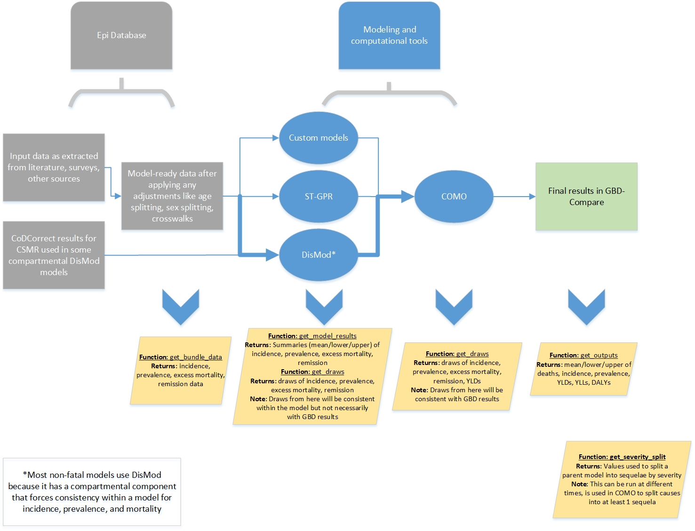

.. _2017_cause_models:

============
Cause Models in GBD
============

What is a cause?
----------------
A cause in the GBD is something that is responsible for death, disease, injury or disability. 
Some examples could be infectious diseases like malaria or diarrhea. 
They could also be chronic diseases like diabetes or cancer. The could be things
that people are born with like congenital disorders or happen during childbirth like maternal hemorrhage.
Some causes are only associated with non-fatal outcomes, such as lower back pain.
Many different things cause health loss and 
this variation is reflected in the many ways that GBD models them. 

Causes in the GBD are organized in a hierarchy where at every level of that hierarchy
causes of death or disease are mutually exclusive and collectively exhaustive. 

- All causes

  - Injuries, communicable diseases, non-communicable diseases

    - ... down to the most detailed level

*Measures* are a quantity of disease burden. Measures for causes include:  
deaths, incidence, prevalence, remission, excess mortality, YLDs, YLLs, and DALYs

*Metrics* are units that describe disease burden. Metrics for causes include:  
counts, rates, and percentages

Modeling causes of death
------------------------

.. image:: fatal_flowchart.png
   :width: 600
   
Fatal modeling in the GBD includes statistical and meta-regression models to produce estimates of cause-
specific mortality rates. In GBD 2017, there were 282 causes of death. For every cause, the GBD estimates
years of life lost (YLLs) that are based on the age at death and reference population life expectancy. 

This section will provide background information and links to resources for the fatal modeling tools used in 
GBD 2017, types of input data, enforcement of internal consistency (CoDCorrect), and how to pull results. 

**Modeling approach** 

Most causes are estimated using a centrally-maintained Bayesian ensemble modeling tool (CODEm)

- Bayesian: estimates based on probabilities
- Ensemble: combines many unique submodels into a final model

This modeling tool has a user interface to manage model parameters, launch models, and vet results. This is called CoDViz and the internal
version can be found here: `CoDViz
<https://internal.ihme.washington.edu/cod/>`_.

Some causes are modeled in custom approaches. Important examples include HIV, cancer, and some maternal disorders.

**Input data**

Input data into CODEm are managed by a single team (`Cause of death team
<https://hub.ihme.washington.edu/display/COD/Causes+of+Death>`_) 
and undergo a series of data adjustments before modeling.
These adjustments can be somewhat complicated but in general they are to account for causes of death that are not sufficiently specific.
GBD calls these "garbage codes", meaning deaths coded to things that are not detailed enough. An example might be "dehydration".
Deaths coded as dehydration are *redistributed* into specific causes like diarrhea.

Data come from a variety of sources like vital registration, verbal autopsy, surveillance, sibling history, and others.

The central function `get_cod_data
<https://scicomp-docs.ihme.washington.edu/db_queries/current/get_cod_data.html>`_ will return the input data into a cause of death model. The user must specify a *cause_id*. An important
note is that the data that are returned will have several different values for cause fraction (*cf*, or the percent of all deaths
in a given age/sex/year/location that were due to the cause). Unless there is a specific reason to use one of the intermediate
cause fractions, the *cf* variable should be used.

**Enforcing internal consistency**

Cause of death estimates in the GBD are internally consistent. This means that the sum of all cause specific death models must
equal the all-cause mortality *envelope*. An envelope just means a larger model that contains many sub-model estimates. More information
on CoDCorrect can be found `here
<https://hub.ihme.washington.edu/display/CCMD/CoDCorrect>`_.

GBD does this by scaling cause-specific mortality estimates to cumulatively sum to the all-cause mortality estimate. This occurs
by age/sex/year/location. The central tool that performs this scaling is called CodCorrect. CoDCorrect runs at the draw level and so 
it maintains the uncertainty from each model. Importantly, it also adds back in HIV deaths as well as *fatal discontinuity* deaths.
A fatal discontinuity is jargon for a death that occurred as part of a cluster of deaths that were irregular, like wars,
epidemics, or famines. 

**Getting results**

The central function `get_draws()
<https://scicomp-docs.ihme.washington.edu/get_draws/current/>`_ 
can be used to get estimates of cause of deaths models at the draw level for two outputs. Unless there is a good and 
specific reason, draws from CoDCorrect should be used for estimates of cause-specific mortality or YLLs.

- Output from CoDCorrect are age/sex/year/location specific deaths and years of life lost (YLLs). The function get_draws() returns both deaths and YLLs in *count* space.
	
	- The source for CoDCorrect should be "codcorrect"
	
- Output from CODEm are age/sex/year/location specific cause specific mortality rates and cause fractions (percent of all deaths)
	
	- get_draws() can return CODEm and custom COD model results (source = "codem")
	- These are intermediate results! This might not be the best place to pull results because they haven't gone through CoDCorrect yet.

**Getting more information**

The documentation for GBD causes (write-ups) are available as part of the Appendix to peer-reviewed publications.
The Appendix for the GBD 2017 Cause of Death manuscript is available and Open Access at the Lancet website 
`GBD COD Capstone
<https://www.thelancet.com/journals/lancet/article/PIIS0140-6736(18)32203-7/fulltext#seccestitle540>`_

Modeling non-fatal outcomes (Outline)
---------------------------

Non-fatal modeling in the GBD includes statistical and meta-regression models to produce estimates of incidence
and prevalence of diseases. In GBD 2017, there were 354 non-fatal models and 3,484 sequelae. While a non-fatal
model must produce estimates for incidence and prevalence, a sequela is a health state associated with a disease 
or disability and are frequently split from a parent model. Impairments are conditions or domains of health loss
that are spread across multiple sequelae. An example could be anemia which can be caused by maternal hemorrhage, 
iron deficiency, malaria, or other diseases. To produce estimates of years lived with disability (YLDs),
a cause, sequela, or impairment must have estimates of prevalence and disability weights. 

This section will provide background information and links to resources for the non-fatal modeling tools used in 
GBD 2017, types of input data, enforcement of internal consistency (COMO), and how to pull results. 
   
**DisMod** 

Disease Model Meta Regression 2.1 (DisMod, sometimes DisMod MR) is a statistical modeling tool developed for the Global
Burden of Disease study to estimate non-fatal disease burden. It is the most frequently used tool for non-fatal modeling
in the GBD and models that are run outside of it are frequently called *custom models*. A short description of DisMod is
provided below and more information can be found on the HUB including 
`Training slides
<https://hub.ihme.washington.edu/display/gbd2017/GBD+2017+Trainings?preview=/44794562/44950973/DisMod_gbd2017.pptx>`_ 
and a page on settings and running models
`HUB page for modeling
<https://hub.ihme.washington.edu/display/gbd2017/DisMod>`_.

DisMod has a user interface. The 
`External Version
<https://vizhub.healthdata.org/epi/>`_
shows published and final models for GBD 2017.
The 
`Internal Version
<https://internal.ihme.washington.edu/epi/>`_
is where new and ongoing modeling occurs and is for GBD 2019 (but shows GBD 2017 best models). 

There are three main components to DisMod: 

1. It is a meta-regression statistical model. This means that it uses point estimates with uncertainty around those 
estimates and covariates to predict disease burden for every location/year/age/sex.
These predictions are produced separately for each estimation year (every 5 years from 1990 to 2015 and the year 2017) and
there is no cohort component to DisMod meaning that there is no enforcement in incidence and prevalence over time and age.  
   
2. It is a compartmental model of disease. This means that DisMod is solving differential equations while fitting meta-regression 
estimates to enforce consistency between disparate measures of disease like incidence, prevalence, remission, and excess mortality. 
  
3. It is age-integrating. Input data in DisMod must have an age or age range associated with those data, ranges which may be noisy. 
DisMod can account for ranges in age in the input data by integrating across age-specific rates to help it produce continuous estimates of disease burden across all ages.

Input data for DisMod can be any of the measures of disease that are estimated within it. These include prevalence, incidence,
remission, excess mortality, and cause-specific mortality. Input data will be described in more detail in the following section.

Results from DisMod are internally consistent *within* that model. Incidence, prevalence, remission, and excess mortality are
linked in the DisMod estimation process and so the results from a model will include all these measures of disease. However, results
from DisMod will *not* be consistent with final GBD estimates because of processes like COMO that rescale prevalence and sometimes
incidence of different non-fatal disease models to achieve consistency across all models. 

**Custom non-fatal modeling**

There are some non-fatal models in GBD that do not use DisMod to produce estimates of incidence and prevalence. Some non-fatal
causes are too data sparse, have geographic or age restrictions, or are otherwise unsuited to DisMod. Because of their nature,
custom models follow a variety of modeling approaches. Some examples of custom models include:

- HIV: HIV incidence uses a custom modeling software called Spectrum, developed by UNAIDS

- Tuberculosis: The case fatality of active tuberculosis is modeled and then applied to the estimates of tuberculosis cause-specific mortality to get disease incidence. Non-fatal estimates of tuberculosis are also split into active and latent disease, disease in HIV- and HIV+ populations, and drug resistant and susceptible infections. 

- Visceral leishmaniasis: Case notification data are used in a spatio-temporal Gaussian process regression (ST-GPR). 

- Neoplasms (cancers): The mortality to incidence ratio for each subtype of cancer was estimated in a mixed-effects linear regression model. The product of this ratio and the cause-specific mortality rates are the incidence of each type of cancer. Prevalence was calculated from the incidence using cancer survival curves.

**Finding more information on modeling**

The best place to view non-fatal models is 
`EpiViz
<https://internal.ihme.washington.edu/epi-2019/>`_. The site loads GBD 2019 models by default but GBD 2017 final (best) models are available as well. These models
will not necessarily match the final GBD 2017 estimates because they are pre-COMO.
Non-fatal final results are available in the 
`GBD-Compare
<https://vizhub.healthdata.org/gbd-compare/>`_ visualization tool. 

Cause write-ups are available from the GBD 2017 non-fatal manuscript in the 
`Lancet
<https://www.thelancet.com/journals/lancet/article/PIIS0140-6736(18)32279-7/fulltext#seccestitle470>`_
Supplementary Appendix 1. The documentation for GBD includes flowcharts and descriptions of modeling strategies and input data.
There is an effort within GBD to build extended documentation, intended for internal use. 

GBD Modeler assignments can be found on the 
`HUB
<https://hub.ihme.washington.edu/display/GBD2019/GBD+2019?preview=/53336417/83201029/Assignments_191105.xlsx>`_ 
and Modelers are usually available to help answer specific questions about the causes. 

**Epi Computation and COMO**

- What is Comorbidity adjustment (COMO)

- Other processes like years lived with disability calculation
