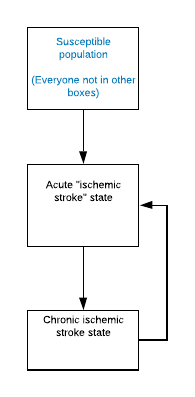
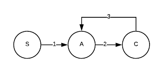

.. _2017_cause_ischemic_stroke:

===================
Ischemic Stroke
===================

Disease Description
-------------------

.. todo::

   Add more information and references. In particular, find data about global prevalence and relation to disease fatal and non-fatal description.

Modeling Ischemic Stroke in GBD 2017
-------------------------------------------

Strokes in GBD 2017
++++++++++++++++++++++++++++++++++++++

Modeling Strategy for Ischemic Stroke
++++++++++++++++++++++++++++++++++++++++++++

Cause Model Diagram
--------------------------

Transitions Diagram
--------------------------

Model Assumptions and Limitations
+++++++++++++++++

Restrictions
------------
.. todo:: 

    Restriction type (Yll only, YLD only, YLL age start, YLL age end, YLD age start, YLD age end, male only, female only). 
    Value (True, False, 5, 255, 13, No)

.. todo::

   Describe more assumptions and limitations of the model.

Data Description
----------------

.. todo::

   Add tables describing data sources for the Vivarium model.

Validation Criteria
-------------------

.. todo::

   Describe tests for model validation.

References
----------