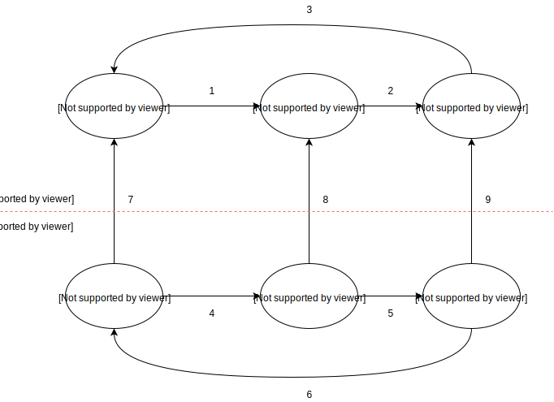

.. _2017_cause_latent_tb:

===================
Latent Tuberculosis
===================

Cause Model Diagram
-------------------

Data Description
----------------
.. list-table:: **Abbreviations**
   :widths: 5 10
   :header-rows: 1

   * - Label
     - Definition
   * - S
     - susceptible
   * - C
     - with condition
   * - TB
     - tuberculosis
   * - LTBI
     - latent tuberculosis infection
   * - AcTB
     - active tuberculosis
   * - DS-TB
     - Drug-susceptible TB
   * - MDR-TB
     - Multidrug-resistant TB
   * - XDR-TB
     - Extensively drug-resistant TB
   * - HIV
     - human immunodeficiency virus
   * - HIV+ DS-TB
     - HIV/AIDS - Drug-susceptible TB
   * - HIV+ MDR-TB
     - HIV/AIDS - Multidrug-resistant TB
   * - HIV+ XDR-TB
     - HIV/AIDS - Extensively drug-resistant TB
   * - prev
     - prevalence
   * - i
     - incidence
   * - csmr
     - cause-specific mortality rate
   * - emr
     - excess mortality rate
   * - dw
     - disability weight
   * - {measure}_{gbd_id_type}{gbd_id}
     - e.g. prev_c954 = prevalence of LTBI

.. list-table:: **State Measures**
   :widths: 5 15 5 20 10 15
   :header-rows: 1

   * - State
     - Definition
     - Measure
     - Value
     - Source
     - Notes
   * - S_TB, S_HIV
     - Not TB or HIV infected
     - prevalence
     - 1 - everything (sum of all other states prev)
     - como
     - confirm everything = (prev_c297 + prev_c298) - prev_c954 * prev_c300
   * - S_TB, S_HIV
     - 
     - excess mortality rate
     - 0
     - NA
     - 
   * - S_TB, S_HIV
     - 
     - disability weight
     - 0
     - NA
     - 
   * - LTBI, S_HIV
     - LTBI, not HIV infected
     - prevalence
     - prev_c954 * (1 - prev_c300)
     - como
     - 
   * - LTBI, S_HIV
     - 
     - excess mortality rate
     - 0
     - NA
     - 
   * - LTBI, S_HIV
     - 
     - disability weight
     - 0
     - NA
     - 
   * - AcTB, S_HIV
     - HIV negative active TB = SUM(DS-TB, MDR-TB, XDR-TB)
     - prevalence
     - prev_c934 + prev_c946 + prev_c947
     - como
     - 
   * - AcTB, S_HIV
     - 
     - excess mortality rate
     - :math:`\frac{\text{csmr_c934} \,+\, \text{csmr_c946} \,+\,
       \text{csmr_c947}}{\text{prev_c934} \,+\, \text{prev_c946} \,+\,
       \text{prev_c947}}`
     - codcorrect
     - confirm csmr_c954 = 0, csmr_c297 = csmr_c934 + csmr_c946 + csmr_c947
   * - AcTB, S_HIV
     - 
     - disability weight
     - :math:`\frac{\displaystyle{\sum_{s\in\text{sequelae_c934, sequelae_c946,
       sequelae_c947}}} \text{dw_s} \,\times\, \text{prev_s}}{\displaystyle
       {\sum_{s\in\text{sequelae_c934, sequelae_c946, sequelae_c947}}}
       \text{prev_s}}`
     - sequelae_c934, sequelae_c946, sequelae_c947; each of them has a list of
       4 sequelae
     - dw_c934, dw_c946, dw_c947; Expect to match 0.333 [0.224, 0.454]
   * - S_TB, C_HIV
     - Not TB infected, HIV infected
     - prevalence
     - (1 - prev_c954) * prev_c300
     - como
     - 
   * - S_TB, C_HIV
     - 
     - excess mortality rate
     - :math:`\text{emr_c300} = \frac{\text{csmr_c300}}{\text{prev_c300}}`
     - codcorrect
     -
   * - S_TB, C_HIV
     - 
     - disability weight
     - :math:`\frac{\displaystyle{\sum_{s\in\text{sequelae_c300}}} \text{dw_s}
       \,\times\, \text{prev_s}}{\displaystyle{\sum_{s\in\text{sequelae_c300}}}
       \text{prev_s}}`
     - sequelae_c300 has a list of 16 sequelae
     -
   * - LTBI, C_HIV
     - LTBI, HIV infected
     - prevalence
     - prev_c954 * prev_c300
     - como
     - 
   * - LTBI, C_HIV
     - 
     - excess mortality rate
     - :math:`\text{emr_c300} = \frac{\text{csmr_c300}}{\text{prev_c300}}`
     - codcorrect
     -
   * - LTBI, C_HIV
     - 
     - disability weight
     - :math:`\frac{\displaystyle{\sum_{s\in\text{sequelae_c300}}} \text{dw_s}
       \,\times\, \text{prev_s}}{\displaystyle{\sum_{s\in\text{sequelae_c300}}}
       \text{prev_s}}`
     - sequelae_c300 has a list of 16 sequelae
     -
   * - AcTB, C_HIV
     - HIV positive active TB = SUM(HIV+ DS-TB, HIV+ MDR-TB, HIV+ XDR-TB)
     - prevalence
     - prev_c948 + prev_c949 + prev_c950
     - como
     - 
   * - AcTB, C_HIV
     - 
     - excess mortality rate
     - :math:`\frac{\text{csmr_c948} \,+\, \text{csmr_c949} \,+\,
       \text{csmr_c950}}{\text{prev_c948} \,+\, \text{prev_c949} \,+\,
       \text{prev_c950}}`
     - codcorrect
     - 
   * - AcTB, C_HIV
     - 
     - disability weight
     - :math:`\frac{\displaystyle{\sum_{s\in\text{sequelae_c948, sequelae_c949,
       sequelae_c950}}} \text{dw_s} \,\times\, \text{prev_s}}{\displaystyle
       {\sum_{s\in\text{sequelae_c948, sequelae_c949, sequelae_c950}}}
       \text{prev_s}}`
     - sequelae_c948, sequelae_c949, sequelae_c950; each of them has a list of
       4 sequelae
     - dw_c948, dw_c949, dw_c950; Expect to match 0.408 [0.274, 0.549]

.. list-table:: **Transition Data**
   :widths: 1 5 5 1 10 10
   :header-rows: 1

   * - Label
     - Source State
     - Sink State
     - Unit
     - Value
     - Notes
   * - 1
     - S_TB, C_HIV
     - LTBI, C_HIV
     - rate
     - LTBI incidence (i_c954)
     - calculated by dismod_mr 1.1.0
   * - 2
     - LTBI, C_HIV
     - AcTB, C_HIV
     - rate
     - :math:`\frac{\text{i_c948} \,+\, \text{i_c949} \,+\,
       \text{i_c950}}{\text{prev_c954} \,\times\, \text{prev_c300}}`
     - 
   * - 3
     - AcTB, C_HIV
     - S_TB, C_HIV
     - rate
     - All-form TB remission
     - dismod id 9422 stand-in
   * - 4
     - S_TB, S_HIV
     - LTBI, S_HIV
     - rate
     - LTBI incidence (i_c954)
     - calculated by dismod_mr 1.1.0
   * - 5
     - LTBI, S_HIV
     - AcTB, S_HIV
     - rate
     - :math:`\frac{\text{i_c934} \,+\, \text{i_c946} \,+\,
       \text{i_c947}}{\text{prev_c954} \,\times\, (1 \,-\, \text{prev_c300})}`
     -
   * - 6
     - AcTB, S_HIV
     - S_TB, S_HIV
     - rate
     - All-form TB remission
     - dismod id 9422 stand-in
   * - 7
     - S_TB, S_HIV
     - S_TB, C_HIV
     - rate
     - i_c300
     - 
   * - 8
     - LTBI, S_HIV
     - LTBI, C_HIV
     - rate
     - i_c300
     -
   * - 9
     - AcTB, S_HIV
     - AcTB, C_HIV
     - rate
     - i_c300
     -

Modeling Strategy for Non-standard Data Sources
-----------------------------------------------
LTBI incidence calculation
 - We ran DisMod-MR 1.1.0 and used LTBI prevalence, excess MR (equivalent to 
   AcTB incidence / LTBI prevalence), remission (zero), and all causes CSMR as 
   inputs to back calculate the LTBI incidence data that are not exist in GBD. 
   Then we load the location-/age-/sex-/year-/draw- specific LTBI incidence 
   estimates into the artifact. (Note that the age range for estimated LTBI
   incidence is 0 to 100 and age interval equal to one.)
TB remission
 - The current model applied all-form active TB remission (dismod_id=9422)
   to inform the transition flow from HIV-positive active TB and HIV-negative
   active TB back to susceptible. The future plan is to disaggregate the all-form
   active TB remission by HIV status based on TB duration data.
   [Global-TB-Burden-2018]_ (Table 1, pp. 26)

References
----------
.. [Global-TB-Burden-2018] Methods used by WHO to estimate the global burden of TB disease
   https://www.who.int/tb/publications/global_report/gtbr2018_online_technical_appendix_global_disease_burden_estimation.pdf
