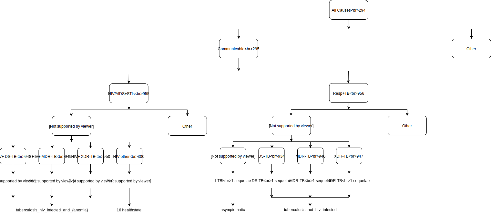

.. _2017_cause_latent_tb:

===================
Latent Tuberculosis
===================

Cause Hierarchy
-------------
.. list-table:: **Hierarchy**
   :widths: 10 5 5
   :header-rows: 1

   * - Cause
     - gbd_id
     - Level
   * - All Causes
     - 294
     - 0
   * - Communicable, maternal, neonatal, and nutritional diseases
     - 295
     - 1
   * - HIV/AIDS and sexually transmitted infections
     - 955
     - 2
   * - Respiratory infections and tuberculosis
     - 956
     - 2
   * - Tuberculosis
     - 297
     - 3
   * - HIV/AIDS
     - 298
     - 3
   * - Latent Tuberculosis Infection
     - 954
     - 4
   * - Drug-susceptible TB
     - 934
     - 4
   * - Multidrug-resistant TB
     - 946
     - 4
   * - Extensively drug-resistant TB
     - 947
     - 4
   * - HIV/AIDS - Drug-susceptible TB
     - 948
     - 4
   * - HIV/AIDS - Multidrug-resistant TB
     - 949
     - 4
   * - HIV/AIDS - Extensively drug-resistant TB
     - 950
     - 4
   * - HIV/AIDs resulting in other diseases
     - 300
     - 4

- {Anemia} = [no_anemia, mild_anemia, moderate_anemia, severe_anemia]
- {HIV/AIDS} = [early_hiv, symptomatic_hiv, hiv_aids_with_art, aids]
The causes in the GBD at any level of hierarchy are mutually exclusive
and collectively exhaustive. 
